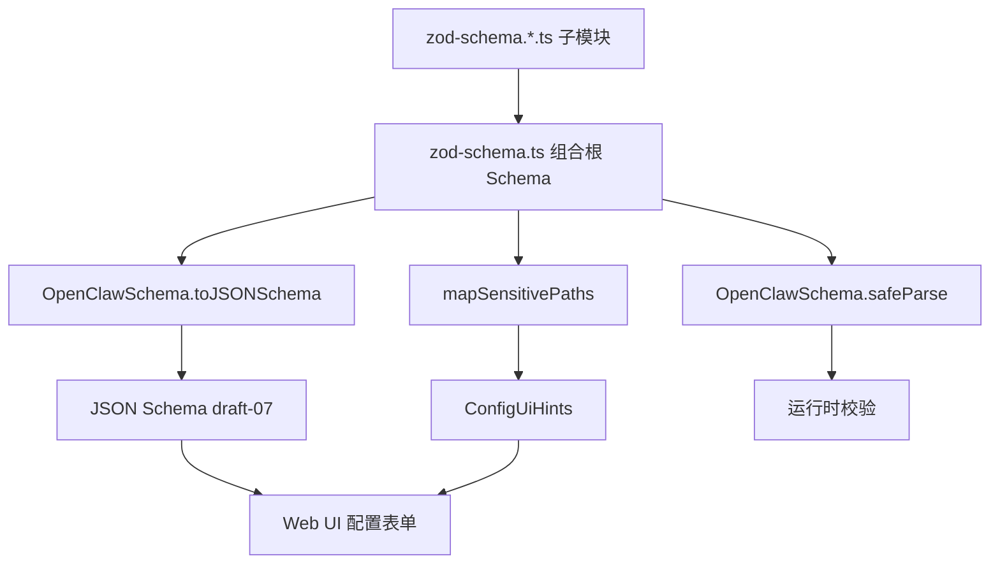
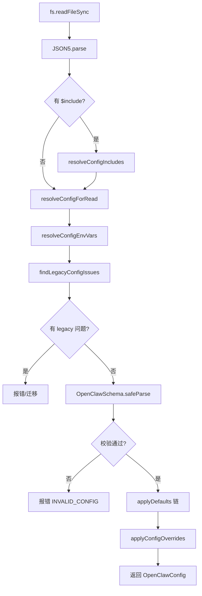

# PD-367.01 OpenClaw — Zod 驱动配置管理与校验体系

> 文档编号：PD-367.01
> 来源：OpenClaw `src/config/`
> GitHub：https://github.com/openclaw/openclaw.git
> 问题域：PD-367 配置管理与校验 Configuration Management & Validation
> 状态：可复用方案

---

## 第 1 章 问题与动机

### 1.1 核心问题

Agent 系统的配置管理面临多重挑战：配置项数量庞大（OpenClaw 的 Zod schema 覆盖 30+ 顶级分区、数百个嵌套字段）、多渠道多插件的动态扩展需求、敏感凭证的安全处理、以及运行时热重载的可靠性。传统的 JSON 配置 + 手动校验方式在这种规模下极易出错，且无法提供类型安全保障。

核心痛点：
- 配置项爆炸式增长，手动维护类型定义和校验逻辑不可持续
- 环境变量引用（`${VAR}`）需要在读写两端保持一致性，避免凭证泄露
- Legacy 配置格式需要平滑迁移，不能破坏用户现有配置
- 多文件 include 组合需要防止循环引用和路径穿越攻击
- 热重载需要精确判断哪些变更可以热加载、哪些需要重启

### 1.2 OpenClaw 的解法概述

OpenClaw 构建了一套以 Zod schema 为核心的完整配置管理体系：

1. **Zod Schema 单一真相源** — 所有配置类型、校验规则、JSON Schema 生成、UI hints 均从 `OpenClawSchema`（`src/config/zod-schema.ts:124`）派生，消除类型定义与校验逻辑的不一致
2. **六阶段配置加载管道** — JSON5 解析 → `$include` 合并 → `${VAR}` 替换 → Legacy 迁移检测 → Zod 校验 → 运行时默认值注入，每阶段职责清晰（`src/config/io.ts:645-779`）
3. **环境变量往返保护** — 读取时替换 `${VAR}` 为实际值，写回时通过 `restoreEnvVarRefs` 恢复原始引用，防止凭证被明文写入配置文件（`src/config/env-preserve.ts:89-134`）
4. **规则驱动的热重载** — `BASE_RELOAD_RULES` 按配置路径前缀定义 restart/hot/none 三种策略，chokidar 监听文件变更后构建 `GatewayReloadPlan`（`src/gateway/config-reload.ts:50-67`）
5. **敏感字段自动脱敏** — 通过 Zod `.register(sensitive)` 标记 + 路径模式匹配双重机制，在 Gateway 响应中自动替换为 `__OPENCLAW_REDACTED__` 哨兵值（`src/config/redact-snapshot.ts:42`）

### 1.3 设计思想

| 设计原则 | 具体实现 | 理由 | 替代方案 |
|----------|----------|------|----------|
| Schema 即文档 | Zod schema → JSON Schema → UI hints 三位一体 | 消除类型/校验/文档三者不一致 | 手动维护 JSON Schema + TypeScript 类型 |
| 管道式加载 | 6 阶段串行管道，每阶段可独立测试 | 关注点分离，便于调试和扩展 | 单函数一次性处理所有逻辑 |
| 写时恢复 | env var 引用在写回时自动恢复 | 防止 `${API_KEY}` 被替换为明文 `sk-ant-...` | 要求用户手动管理 env var 引用 |
| 路径前缀匹配 | 热重载规则按 config path prefix 分类 | 精确控制哪些变更需要重启 | 全量重启或全量热加载 |
| 防御性安全 | include 路径穿越检测 + symlink 验证 | 防止 CWE-22 路径穿越攻击 | 信任用户输入 |

---

## 第 2 章 源码实现分析

### 2.1 架构概览

OpenClaw 的配置管理系统由 5 个核心模块组成，围绕 `createConfigIO` 工厂函数构建：

```
┌─────────────────────────────────────────────────────────────────┐
│                    createConfigIO (io.ts)                        │
│  ┌──────────┐  ┌──────────┐  ┌──────────┐  ┌───────────────┐  │
│  │ loadConfig│  │readSnap- │  │writeConf-│  │ clearConfig-  │  │
│  │    ()     │  │  shot()  │  │  igFile()│  │   Cache()     │  │
│  └────┬─────┘  └────┬─────┘  └────┬─────┘  └───────────────┘  │
│       │              │              │                            │
│  ┌────▼──────────────▼──────────────▼────────────────────────┐  │
│  │              六阶段加载管道                                 │  │
│  │  JSON5 → $include → ${VAR} → legacy → Zod → defaults     │  │
│  └───────────────────────────────────────────────────────────┘  │
└─────────────────────────────────────────────────────────────────┘
         │                    │                    │
    ┌────▼────┐         ┌────▼────┐          ┌────▼────┐
    │includes │         │env-sub- │          │legacy.  │
    │  .ts    │         │stitution│          │rules.ts │
    │         │         │  .ts    │          │         │
    └─────────┘         └─────────┘          └─────────┘
         │
    ┌────▼────────────┐
    │config-reload.ts │  ← chokidar 监听
    │(热重载引擎)      │
    └─────────────────┘
```

### 2.2 核心实现

#### 2.2.1 Zod Schema 定义与 JSON Schema 生成



对应源码 `src/config/zod-schema.ts:124-707`：

```typescript
export const OpenClawSchema = z
  .object({
    $schema: z.string().optional(),
    meta: z.object({
      lastTouchedVersion: z.string().optional(),
      lastTouchedAt: z.string().optional(),
    }).strict().optional(),
    env: z.object({
      shellEnv: z.object({
        enabled: z.boolean().optional(),
        timeoutMs: z.number().int().nonnegative().optional(),
      }).strict().optional(),
      vars: z.record(z.string(), z.string()).optional(),
    }).catchall(z.string()).optional(),
    // ... 30+ 顶级分区
    gateway: z.object({
      // ...
      auth: z.object({
        token: z.string().optional().register(sensitive), // 敏感字段标记
        password: z.string().optional().register(sensitive),
      }).strict().optional(),
      reload: z.object({
        mode: z.union([
          z.literal("off"), z.literal("restart"),
          z.literal("hot"), z.literal("hybrid"),
        ]).optional(),
        debounceMs: z.number().int().min(0).optional(),
      }).strict().optional(),
    }).strict().optional(),
  })
  .strict()
  .superRefine((cfg, ctx) => {
    // 跨字段校验：broadcast 引用的 agentId 必须存在于 agents.list
    const agentIds = new Set((cfg.agents?.list ?? []).map(a => a.id));
    // ...
  });
```

JSON Schema 生成与 UI hints 构建（`src/config/schema.ts:322-340`）：

```typescript
function buildBaseConfigSchema(): ConfigSchemaResponse {
  if (cachedBase) return cachedBase;
  const schema = OpenClawSchema.toJSONSchema({
    target: "draft-07",
    unrepresentable: "any",
  });
  schema.title = "OpenClawConfig";
  const hints = applyDerivedTags(
    mapSensitivePaths(OpenClawSchema, "", buildBaseHints())
  );
  cachedBase = { schema: stripChannelSchema(schema), uiHints: hints,
    version: VERSION, generatedAt: new Date().toISOString() };
  return cachedBase;
}
```

#### 2.2.2 六阶段配置加载管道



对应源码 `src/config/io.ts:645-779`（`loadConfig` 函数核心流程）：

```typescript
function loadConfig(): OpenClawConfig {
  maybeLoadDotEnvForConfig(deps.env);
  if (!deps.fs.existsSync(configPath)) return {};

  const raw = deps.fs.readFileSync(configPath, "utf-8");
  const parsed = deps.json5.parse(raw);

  // 阶段 1-2: $include 合并 + ${VAR} 替换
  const { resolvedConfigRaw } = resolveConfigForRead(
    resolveConfigIncludesForRead(parsed, configPath, deps), deps.env
  );

  // 阶段 3: Legacy 检测
  warnOnConfigMiskeys(resolvedConfig, deps.logger);

  // 阶段 4: Zod 校验
  const validated = validateConfigObjectWithPlugins(resolvedConfig);
  if (!validated.ok) { /* 报错 */ }

  // 阶段 5: 默认值注入链
  const cfg = applyModelDefaults(
    applyCompactionDefaults(
      applyContextPruningDefaults(
        applyAgentDefaults(
          applySessionDefaults(
            applyLoggingDefaults(applyMessageDefaults(validated.config))
          )))));

  // 阶段 6: 运行时覆盖
  return applyConfigOverrides(cfg);
}
```

### 2.3 实现细节

#### $include 文件合并与安全防护

`IncludeProcessor`（`src/config/includes.ts:80-258`）实现了递归 include 合并，关键安全措施：

- **循环引用检测**：`visited` Set 追踪已访问路径，发现重复抛出 `CircularIncludeError`（L213-216）
- **深度限制**：`MAX_INCLUDE_DEPTH = 10`，防止无限递归（L22, L219-226）
- **路径穿越防护**：`isPathInside` 检查 + `fs.realpathSync` 解析 symlink 后二次验证（L186-208）
- **深度合并策略**：数组拼接、对象递归合并、原始值覆盖（`deepMerge` L59-74）

#### 环境变量往返保护

写回配置时，`restoreEnvVarRefs`（`src/config/env-preserve.ts:89-134`）通过三步确保 `${VAR}` 引用不被破坏：

1. 检查 parsed（磁盘上的原始配置）中是否包含 `${VAR}` 模式
2. 用当前 env 解析该模式，看结果是否等于 incoming 值
3. 如果匹配，恢复原始 `${VAR}` 引用；如果不匹配（用户主动修改），保留新值

#### 热重载规则引擎

`config-reload.ts:50-67` 定义了基于路径前缀的三级规则：

| 规则类型 | 行为 | 示例前缀 |
|----------|------|----------|
| `hot` | 热加载特定组件 | `hooks`, `cron`, `browser` |
| `restart` | 需要网关重启 | `gateway`, `plugins`, `discovery` |
| `none` | 忽略变更 | `meta`, `wizard`, `logging`, `models` |

插件可通过 `reload.configPrefixes` 和 `reload.noopPrefixes` 动态注册自己的热重载规则。

#### 配置快照与审计

每次写入配置时，`writeConfigFile`（`src/config/io.ts:972-1208`）执行：
- SHA256 哈希计算前后快照
- 原子写入（tmp → rename，Windows 降级为 copy）
- 备份轮转（`.bak` 文件）
- JSONL 审计日志（记录 pid、ppid、cwd、hash 变化、异常原因）
- 异常检测（文件大小骤降 >50%、meta 丢失、gateway mode 被删除）


---

## 第 3 章 迁移指南

### 3.1 迁移清单

**阶段 1：Schema 定义（基础）**
- [ ] 安装 `zod` 依赖
- [ ] 定义根配置 Zod schema，使用 `.strict()` 拒绝未知字段
- [ ] 为敏感字段创建 `sensitive` WeakSet 标记机制
- [ ] 实现 `toJSONSchema()` 导出，供 UI 和编辑器使用

**阶段 2：加载管道（核心）**
- [ ] 实现 `createConfigIO` 工厂函数，封装 configPath 解析
- [ ] 实现 JSON5 解析（支持注释和尾逗号）
- [ ] 实现 `$include` 指令处理（含循环检测和路径安全）
- [ ] 实现 `${VAR}` 环境变量替换
- [ ] 实现默认值注入链
- [ ] 添加配置缓存（TTL 200ms）

**阶段 3：写回保护（安全）**
- [ ] 实现 `restoreEnvVarRefs` 环境变量往返保护
- [ ] 实现原子写入（tmp + rename）
- [ ] 实现备份轮转
- [ ] 实现 JSONL 审计日志

**阶段 4：热重载（可选）**
- [ ] 定义路径前缀 → 重载策略映射表
- [ ] 集成 chokidar 文件监听
- [ ] 实现 debounce + reload plan 构建
- [ ] 实现 hybrid 模式（hot + restart 混合）

### 3.2 适配代码模板

#### 最小可用配置管理器（TypeScript）

```typescript
import { z } from "zod";
import JSON5 from "json5";
import fs from "node:fs";
import crypto from "node:crypto";

// 1. 敏感字段标记
const sensitive = new WeakSet<z.ZodType>();

// 2. Schema 定义
const AppConfigSchema = z.object({
  meta: z.object({
    version: z.string().optional(),
    lastTouchedAt: z.string().optional(),
  }).strict().optional(),
  llm: z.object({
    provider: z.enum(["openai", "anthropic", "gemini"]),
    apiKey: z.string().register(sensitive),
    model: z.string().default("gpt-4o"),
    maxTokens: z.number().int().positive().optional(),
  }).strict(),
  tools: z.object({
    enabled: z.array(z.string()).optional(),
    timeout: z.number().int().positive().default(30000),
  }).strict().optional(),
}).strict();

type AppConfig = z.infer<typeof AppConfigSchema>;

// 3. 环境变量替换
const ENV_VAR_PATTERN = /\$\{([A-Z_][A-Z0-9_]*)\}/g;

function substituteEnvVars(obj: unknown, env = process.env): unknown {
  if (typeof obj === "string") {
    return obj.replace(ENV_VAR_PATTERN, (_, name) => {
      const val = env[name];
      if (!val) throw new Error(`Missing env var: ${name}`);
      return val;
    });
  }
  if (Array.isArray(obj)) return obj.map(item => substituteEnvVars(item, env));
  if (obj && typeof obj === "object") {
    return Object.fromEntries(
      Object.entries(obj).map(([k, v]) => [k, substituteEnvVars(v, env)])
    );
  }
  return obj;
}

// 4. 环境变量往返保护
function restoreEnvVarRefs(
  incoming: unknown, parsed: unknown, env = process.env
): unknown {
  if (typeof incoming === "string" && typeof parsed === "string") {
    if (ENV_VAR_PATTERN.test(parsed)) {
      const resolved = parsed.replace(ENV_VAR_PATTERN, (_, name) => env[name] ?? "");
      if (resolved === incoming) return parsed; // 恢复 ${VAR} 引用
    }
    return incoming;
  }
  if (Array.isArray(incoming) && Array.isArray(parsed)) {
    return incoming.map((item, i) =>
      i < parsed.length ? restoreEnvVarRefs(item, parsed[i], env) : item
    );
  }
  if (incoming && typeof incoming === "object" && parsed && typeof parsed === "object") {
    const result: Record<string, unknown> = {};
    for (const [key, value] of Object.entries(incoming as Record<string, unknown>)) {
      result[key] = key in (parsed as Record<string, unknown>)
        ? restoreEnvVarRefs(value, (parsed as Record<string, unknown>)[key], env)
        : value;
    }
    return result;
  }
  return incoming;
}

// 5. 配置 I/O
function createConfigIO(configPath: string) {
  function loadConfig(): AppConfig {
    const raw = fs.readFileSync(configPath, "utf-8");
    const parsed = JSON5.parse(raw);
    const resolved = substituteEnvVars(parsed);
    const result = AppConfigSchema.safeParse(resolved);
    if (!result.success) {
      const details = result.error.issues
        .map(iss => `${iss.path.join(".")}: ${iss.message}`).join("\n");
      throw new Error(`Invalid config:\n${details}`);
    }
    return result.data;
  }

  async function writeConfig(cfg: AppConfig): Promise<void> {
    const currentRaw = fs.readFileSync(configPath, "utf-8");
    const currentParsed = JSON5.parse(currentRaw);
    const restored = restoreEnvVarRefs(cfg, currentParsed) as AppConfig;
    const stamped = { ...restored, meta: { ...restored.meta,
      lastTouchedAt: new Date().toISOString() } };
    const json = JSON.stringify(stamped, null, 2) + "\n";
    // 原子写入
    const tmp = `${configPath}.${process.pid}.tmp`;
    fs.writeFileSync(tmp, json, { mode: 0o600 });
    fs.copyFileSync(configPath, `${configPath}.bak`);
    fs.renameSync(tmp, configPath);
  }

  return { loadConfig, writeConfig };
}
```

### 3.3 适用场景

| 场景 | 适用度 | 说明 |
|------|--------|------|
| 多渠道 Agent 系统 | ⭐⭐⭐ | 配置项多、需要插件扩展 schema |
| CLI 工具配置 | ⭐⭐⭐ | JSON5 + env var 替换非常实用 |
| 长运行服务 | ⭐⭐⭐ | 热重载 + 审计日志是刚需 |
| 简单脚本 | ⭐ | 过度设计，直接用 dotenv 即可 |
| 多租户 SaaS | ⭐⭐ | 需要额外的租户隔离层 |

---

## 第 4 章 测试用例

```typescript
import { describe, it, expect, vi, beforeEach } from "vitest";
import { z } from "zod";

// 模拟 OpenClaw 的核心配置管理模式
const sensitive = new WeakSet<z.ZodType>();
const TestSchema = z.object({
  apiKey: z.string().register(sensitive),
  model: z.string().default("gpt-4o"),
  nested: z.object({
    timeout: z.number().int().positive(),
  }).strict().optional(),
}).strict();

// 环境变量替换
function substituteString(value: string, env: Record<string, string>): string {
  return value.replace(/\$\{([A-Z_][A-Z0-9_]*)\}/g, (_, name) => {
    const val = env[name];
    if (!val) throw new Error(`Missing env var: ${name}`);
    return val;
  });
}

// 环境变量往返保护
function restoreEnvRef(incoming: string, parsed: string, env: Record<string, string>): string {
  if (/\$\{[A-Z_][A-Z0-9_]*\}/.test(parsed)) {
    try {
      const resolved = substituteString(parsed, env);
      if (resolved === incoming) return parsed;
    } catch { /* missing var, keep incoming */ }
  }
  return incoming;
}

describe("Zod Schema 校验", () => {
  it("应拒绝未知字段（strict 模式）", () => {
    const result = TestSchema.safeParse({
      apiKey: "sk-test", model: "gpt-4o", unknownField: true,
    });
    expect(result.success).toBe(false);
  });

  it("应接受有效配置并应用默认值", () => {
    const result = TestSchema.safeParse({ apiKey: "sk-test" });
    expect(result.success).toBe(true);
    if (result.success) {
      expect(result.data.model).toBe("gpt-4o");
    }
  });

  it("应拒绝无效嵌套类型", () => {
    const result = TestSchema.safeParse({
      apiKey: "sk-test", nested: { timeout: -1 },
    });
    expect(result.success).toBe(false);
  });
});

describe("环境变量替换", () => {
  it("应替换 ${VAR} 为环境变量值", () => {
    const env = { API_KEY: "sk-real-key" };
    expect(substituteString("${API_KEY}", env)).toBe("sk-real-key");
  });

  it("应在缺少环境变量时抛出错误", () => {
    expect(() => substituteString("${MISSING_VAR}", {})).toThrow("Missing env var");
  });

  it("应保留非 ${} 模式的 $ 字符", () => {
    expect(substituteString("price is $100", {})).toBe("price is $100");
  });
});

describe("环境变量往返保护", () => {
  const env = { API_KEY: "sk-real-key" };

  it("应恢复未修改的 ${VAR} 引用", () => {
    expect(restoreEnvRef("sk-real-key", "${API_KEY}", env)).toBe("${API_KEY}");
  });

  it("应保留用户主动修改的值", () => {
    expect(restoreEnvRef("sk-new-key", "${API_KEY}", env)).toBe("sk-new-key");
  });

  it("应保留无 ${VAR} 模式的原始值", () => {
    expect(restoreEnvRef("plain-value", "plain-value", env)).toBe("plain-value");
  });
});

describe("$include 循环检测", () => {
  it("应检测直接循环引用", () => {
    const visited = new Set(["a.json5"]);
    const isCircular = visited.has("a.json5");
    expect(isCircular).toBe(true);
  });

  it("应限制 include 深度", () => {
    const MAX_DEPTH = 10;
    let depth = 0;
    while (depth < MAX_DEPTH + 1) depth++;
    expect(depth > MAX_DEPTH).toBe(true);
  });
});

describe("热重载规则匹配", () => {
  type Rule = { prefix: string; kind: "restart" | "hot" | "none" };
  const rules: Rule[] = [
    { prefix: "hooks.gmail", kind: "hot" },
    { prefix: "hooks", kind: "hot" },
    { prefix: "gateway", kind: "restart" },
    { prefix: "meta", kind: "none" },
  ];

  function matchRule(path: string): Rule | null {
    for (const rule of rules) {
      if (path === rule.prefix || path.startsWith(`${rule.prefix}.`)) return rule;
    }
    return null;
  }

  it("应匹配精确前缀", () => {
    expect(matchRule("hooks")?.kind).toBe("hot");
  });

  it("应匹配子路径", () => {
    expect(matchRule("hooks.gmail.pollInterval")?.kind).toBe("hot");
  });

  it("应优先匹配更具体的前缀", () => {
    expect(matchRule("hooks.gmail")?.kind).toBe("hot");
  });

  it("应对未知路径返回 null", () => {
    expect(matchRule("unknown.path")).toBeNull();
  });
});
```


---

## 第 5 章 跨域关联

| 关联域 | 关系类型 | 说明 |
|--------|----------|------|
| PD-04 工具系统 | 协同 | 工具注册信息存储在配置中（`tools` 分区），工具权限通过 `gateway.tools.deny/allow` 控制 |
| PD-05 沙箱隔离 | 协同 | 沙箱配置哈希（`config-hash.ts`）用于判断是否需要重建沙箱环境 |
| PD-06 记忆持久化 | 协同 | 记忆系统配置（`memory` 分区）通过 Zod schema 校验，支持 qmd/builtin 后端切换 |
| PD-10 中间件管道 | 依赖 | 配置加载本身就是一个 6 阶段管道，与中间件管道设计理念一致 |
| PD-11 可观测性 | 协同 | 配置写入审计日志（JSONL 格式）提供配置变更的可观测性，`diagnostics.otel` 分区支持 OTel 集成 |
| PD-03 容错与重试 | 协同 | 配置加载失败时返回空对象 `{}` 而非崩溃，热重载失败时保持当前配置不变 |

---

## 第 6 章 来源文件索引

| 文件 | 行范围 | 关键实现 |
|------|--------|----------|
| `src/config/zod-schema.ts` | L1-708 | 根 Zod schema 定义（OpenClawSchema），30+ 顶级分区 |
| `src/config/io.ts` | L636-1302 | createConfigIO 工厂、loadConfig 六阶段管道、writeConfigFile 原子写入 |
| `src/config/env-substitution.ts` | L1-172 | `${VAR}` 环境变量替换引擎，支持转义 `$${VAR}` |
| `src/config/env-preserve.ts` | L1-135 | 写回时 `${VAR}` 引用恢复，防止凭证明文化 |
| `src/config/includes.ts` | L1-287 | `$include` 指令处理，循环检测、深度限制、路径穿越防护 |
| `src/config/legacy.ts` | L1-44 | Legacy 配置检测与迁移入口 |
| `src/config/legacy.rules.ts` | L1-137 | 30+ 条 legacy 规则定义（路径迁移映射） |
| `src/config/legacy.migrations.ts` | L1-10 | 三部分迁移规则聚合 |
| `src/config/validation.ts` | L1-434 | Zod 校验 + 插件校验 + 自定义校验（avatar、heartbeat target） |
| `src/config/schema.ts` | L1-371 | JSON Schema 生成、UI hints 构建、插件/渠道 schema 合并 |
| `src/config/schema.hints.ts` | L1-237 | UI hints 定义（label、help、sensitive、placeholder）、敏感路径自动检测 |
| `src/config/redact-snapshot.ts` | L1-599 | 敏感字段脱敏（`__OPENCLAW_REDACTED__` 哨兵值）、写回时恢复 |
| `src/gateway/config-reload.ts` | L1-421 | 热重载引擎：chokidar 监听、路径前缀规则、debounce、reload plan |
| `src/config/merge-patch.ts` | — | RFC 6902 merge patch 实现，数组按 id 合并 |
| `src/config/backup-rotation.ts` | — | 配置备份轮转 |

---

## 第 7 章 横向对比维度

```json comparison_data
{
  "project": "OpenClaw",
  "dimensions": {
    "Schema定义": "Zod schema 单一真相源，30+ 顶级分区，.strict() 拒绝未知字段",
    "校验机制": "Zod safeParse + superRefine 跨字段校验 + 插件 JSON Schema 校验",
    "环境变量": "${VAR} 替换 + 写回时自动恢复引用，防止凭证明文化",
    "配置组合": "$include 指令支持单文件/数组合并，循环检测 + 路径穿越防护",
    "热重载": "路径前缀规则引擎，hot/restart/none 三级策略，chokidar + debounce",
    "敏感字段": "Zod .register(sensitive) + 路径模式匹配双重机制，REDACTED 哨兵值往返安全",
    "配置迁移": "30+ 条声明式 legacy 规则，三部分迁移脚本，自动检测 + 自动迁移",
    "审计追踪": "JSONL 审计日志记录每次写入的 hash/pid/异常原因",
    "UI集成": "Zod → JSON Schema → ConfigUiHints 三位一体，插件可扩展 schema"
  }
}
```

### 域元数据补充

```json domain_metadata
{
  "solution_summary": "OpenClaw 用 Zod schema 单一真相源驱动六阶段配置管道，支持 $include 文件合并、${VAR} 往返保护、30+ 条声明式 legacy 迁移规则、路径前缀热重载引擎和 REDACTED 哨兵值脱敏",
  "description": "配置系统需要同时服务于校验、UI 生成、脱敏和审计等多个消费者",
  "sub_problems": [
    "敏感字段脱敏与写回恢复",
    "配置写入原子性与审计追踪",
    "插件动态扩展 schema",
    "配置文件 include 安全（循环检测+路径穿越防护）"
  ],
  "best_practices": [
    "Zod .register(sensitive) 标记敏感字段",
    "写回时自动恢复 ${VAR} 引用防止凭证泄露",
    "路径前缀规则引擎实现精确热重载控制",
    "JSONL 审计日志记录配置变更"
  ]
}
```
