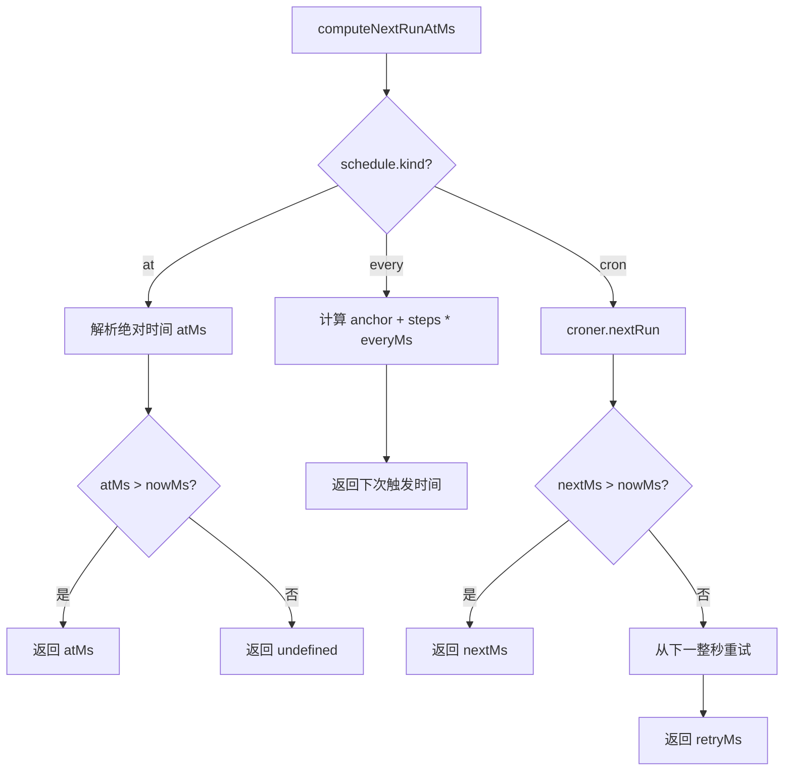
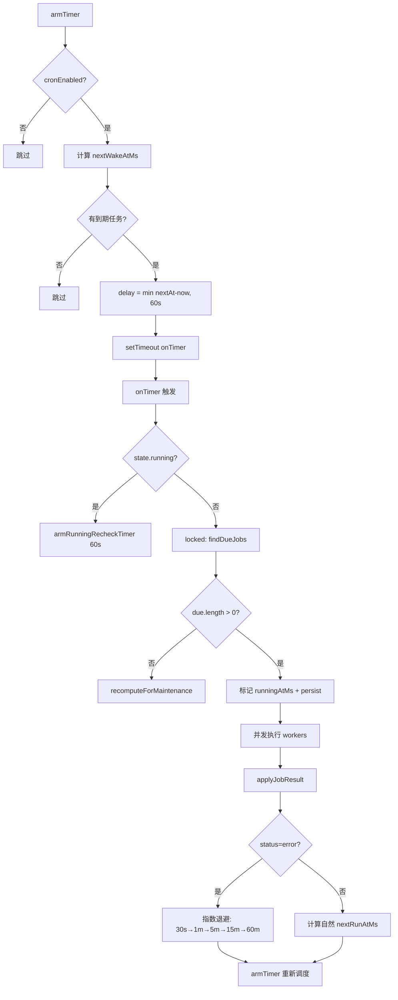

# PD-368.01 OpenClaw — 三层调度引擎与指数退避隔离 Agent 执行

> 文档编号：PD-368.01
> 来源：OpenClaw `src/cron/`
> GitHub：https://github.com/openclaw/openclaw.git
> 问题域：PD-368 定时任务调度 Task Scheduling
> 状态：可复用方案

---

## 第 1 章 问题与动机

### 1.1 核心问题

Agent 系统需要可靠的定时任务调度能力：按 cron 表达式周期执行、一次性定时触发、固定间隔重复执行。核心挑战包括：

1. **调度精度与防抖** — cron 表达式解析后如何避免同秒重复触发（spin-loop）
2. **并发安全** — 多个定时任务同时到期时如何控制并发度，防止资源耗尽
3. **错误恢复** — 任务执行失败后如何指数退避，避免重试风暴
4. **进程重启补偿** — 服务重启后如何检测并执行错过的任务（catch-up）
5. **隔离执行** — Agent 任务需要独立的 session、workspace、model 配置，互不干扰
6. **运行日志持久化** — 每次执行的状态、耗时、token 用量需要可追溯
7. **会话清理** — 隔离运行产生的临时 session 需要定期清理，防止存储膨胀

### 1.2 OpenClaw 的解法概述

OpenClaw 实现了一个完整的进程内 cron 调度引擎，核心设计：

1. **三种调度模式** — `cron`（标准 cron 表达式 + croner 库）、`at`（一次性绝对时间）、`every`（固定间隔 + 锚点对齐），统一通过 `computeNextRunAtMs` 计算下次执行时间 (`src/cron/schedule.ts:13`)
2. **单 Timer + 60s 心跳上限** — 用一个 `setTimeout` 驱动调度循环，delay 上限 60s 防止时钟漂移，执行期间保持 watchdog timer 防止调度器挂死 (`src/cron/service/timer.ts:22-292`)
3. **Promise 链串行锁** — 通过 `locked()` 函数实现基于 Promise 链的串行化，避免并发读写 store 文件 (`src/cron/service/locked.ts:11-22`)
4. **5 级指数退避** — 连续失败时按 30s → 1min → 5min → 15min → 60min 递增退避延迟 (`src/cron/service/timer.ts:108-119`)
5. **隔离 Agent 运行** — 每个 cron 任务可选 `isolated` session target，独立 workspace、model、auth profile (`src/cron/isolated-agent/run.ts:153-845`)

### 1.3 设计思想

| 设计原则 | 具体实现 | 理由 | 替代方案 |
|----------|----------|------|----------|
| 进程内调度 | 单 setTimeout + 60s 心跳上限 | 无外部依赖，适合 CLI/桌面场景 | 外部 cron daemon、Redis 队列 |
| 文件持久化 | JSON 文件 + 原子写入（tmp+rename） | 零依赖，crash-safe | SQLite、LevelDB |
| Promise 链锁 | `locked()` 基于 Promise.all 串行化 | 单进程内无需真正的互斥锁 | Mutex、文件锁 |
| 指数退避 | 5 级固定退避表 + consecutiveErrors 计数 | 简单可预测，避免重试风暴 | 随机抖动退避、令牌桶 |
| 确定性 stagger | SHA256(jobId) % staggerMs | 同一 job 每次偏移一致，避免 thundering herd | 随机延迟（不确定性） |
| 双模式执行 | main（注入 systemEvent）vs isolated（独立 Agent turn） | 轻量通知 vs 完整 Agent 推理 | 统一模式 |

---

## 第 2 章 源码实现分析

### 2.1 架构概览

OpenClaw 的 cron 模块采用分层架构，核心组件关系如下：

```
┌─────────────────────────────────────────────────────────┐
│                    CronService (Facade)                  │
│  service.ts — start/stop/add/update/remove/run/wake     │
└──────────────────────┬──────────────────────────────────┘
                       │ delegates to
┌──────────────────────▼──────────────────────────────────┐
│                   service/ops.ts                         │
│  CRUD 操作 + run 命令（locked 保护）                      │
├──────────────┬───────────────┬───────────────────────────┤
│ service/     │ service/      │ service/                  │
│ timer.ts     │ jobs.ts       │ store.ts                  │
│ armTimer     │ createJob     │ ensureLoaded              │
│ onTimer      │ recompute     │ persist                   │
│ executeJob   │ nextWakeAtMs  │ migration                 │
│ runMissedJobs│ isJobDue      │                           │
├──────────────┼───────────────┼───────────────────────────┤
│ service/locked.ts            │ service/state.ts          │
│ Promise 链串行锁             │ CronServiceState 定义      │
└──────────────┴───────────────┴───────────────────────────┘
        │                              │
        ▼                              ▼
┌───────────────────┐    ┌─────────────────────────────────┐
│   schedule.ts     │    │   isolated-agent/run.ts          │
│   computeNextRun  │    │   runCronIsolatedAgentTurn       │
│   croner 库封装    │    │   model/auth/session/delivery    │
├───────────────────┤    ├─────────────────────────────────┤
│   store.ts        │    │   run-log.ts                     │
│   loadCronStore   │    │   JSONL 运行日志                  │
│   saveCronStore   │    │   appendCronRunLog               │
│   atomic write    │    │   pruneIfNeeded                  │
├───────────────────┤    ├─────────────────────────────────┤
│   stagger.ts      │    │   session-reaper.ts              │
│   SHA256 偏移      │    │   sweepCronRunSessions           │
│   top-of-hour     │    │   24h 保留 + 5min 节流           │
└───────────────────┘    └─────────────────────────────────┘
```

### 2.2 核心实现

#### 2.2.1 三模式调度计算



对应源码 `src/cron/schedule.ts:13-77`：

```typescript
export function computeNextRunAtMs(schedule: CronSchedule, nowMs: number): number | undefined {
  if (schedule.kind === "at") {
    const atMs = typeof sched.atMs === "number" && Number.isFinite(sched.atMs) && sched.atMs > 0
      ? sched.atMs
      : typeof sched.at === "string" ? parseAbsoluteTimeMs(sched.at) : null;
    if (atMs === null) { return undefined; }
    return atMs > nowMs ? atMs : undefined;
  }
  if (schedule.kind === "every") {
    const everyMs = Math.max(1, Math.floor(schedule.everyMs));
    const anchor = Math.max(0, Math.floor(schedule.anchorMs ?? nowMs));
    if (nowMs < anchor) { return anchor; }
    const elapsed = nowMs - anchor;
    const steps = Math.max(1, Math.floor((elapsed + everyMs - 1) / everyMs));
    return anchor + steps * everyMs;
  }
  // cron 表达式模式
  const cron = new Cron(expr, { timezone: resolveCronTimezone(schedule.tz), catch: false });
  const next = cron.nextRun(new Date(nowMs));
  // 防同秒重调度：如果 croner 返回当前秒，从下一整秒重试
  const nextSecondMs = Math.floor(nowMs / 1000) * 1000 + 1000;
  const retry = cron.nextRun(new Date(nextSecondMs));
  return Number.isFinite(retryMs) && retryMs > nowMs ? retryMs : undefined;
}
```

关键防护：cron 表达式模式下，如果 croner 返回的时间 ≤ 当前时间（同秒边界），会自动从下一整秒重试，防止 spin-loop（`schedule.ts:70-76`）。

#### 2.2.2 Timer 驱动调度循环与指数退避



对应源码 `src/cron/service/timer.ts:108-119`（退避表）和 `src/cron/service/timer.ts:253-292`（armTimer）：

```typescript
// 5 级指数退避表
const ERROR_BACKOFF_SCHEDULE_MS = [
  30_000,       // 1st error  →  30 s
  60_000,       // 2nd error  →   1 min
  5 * 60_000,   // 3rd error  →   5 min
  15 * 60_000,  // 4th error  →  15 min
  60 * 60_000,  // 5th+ error →  60 min
];

function errorBackoffMs(consecutiveErrors: number): number {
  const idx = Math.min(consecutiveErrors - 1, ERROR_BACKOFF_SCHEDULE_MS.length - 1);
  return ERROR_BACKOFF_SCHEDULE_MS[Math.max(0, idx)];
}

// Timer 调度核心
export function armTimer(state: CronServiceState) {
  if (state.timer) { clearTimeout(state.timer); }
  state.timer = null;
  const nextAt = nextWakeAtMs(state);
  if (!nextAt) { return; }
  const now = state.deps.nowMs();
  const delay = Math.max(nextAt - now, 0);
  const clampedDelay = Math.min(delay, MAX_TIMER_DELAY_MS); // 60s 上限
  state.timer = setTimeout(() => {
    void onTimer(state).catch((err) => {
      state.deps.log.error({ err: String(err) }, "cron: timer tick failed");
    });
  }, clampedDelay);
}
```

### 2.3 实现细节

#### Promise 链串行锁

`src/cron/service/locked.ts:11-22` 实现了一个轻量级的基于 Promise 链的串行化机制：

```typescript
export async function locked<T>(state: CronServiceState, fn: () => Promise<T>): Promise<T> {
  const storePath = state.deps.storePath;
  const storeOp = storeLocks.get(storePath) ?? Promise.resolve();
  const next = Promise.all([resolveChain(state.op), resolveChain(storeOp)]).then(fn);
  const keepAlive = resolveChain(next);
  state.op = keepAlive;
  storeLocks.set(storePath, keepAlive);
  return (await next) as T;
}
```

这个设计同时等待两个 Promise 链（实例级 `state.op` 和 store 级 `storeLocks`），确保同一 store 文件的所有操作串行执行，即使跨 CronService 实例。

#### 原子文件写入

`src/cron/store.ts:50-62` 使用 tmp+rename 模式确保 crash-safe：

```typescript
export async function saveCronStore(storePath: string, store: CronStoreFile) {
  await fs.promises.mkdir(path.dirname(storePath), { recursive: true });
  const tmp = `${storePath}.${process.pid}.${randomBytes(8).toString("hex")}.tmp`;
  await fs.promises.writeFile(tmp, json, "utf-8");
  await fs.promises.rename(tmp, storePath);  // 原子操作
  await fs.promises.copyFile(storePath, `${storePath}.bak`); // best-effort 备份
}
```

#### 确定性 Stagger

`src/cron/service/jobs.ts:30-36` 用 SHA256(jobId) 生成确定性偏移，避免 top-of-hour 的 thundering herd：

```typescript
function resolveStableCronOffsetMs(jobId: string, staggerMs: number) {
  if (staggerMs <= 1) { return 0; }
  const digest = crypto.createHash("sha256").update(jobId).digest();
  return digest.readUInt32BE(0) % staggerMs;
}
```

默认对 `0 * * * *`（每小时整点）类表达式自动应用 5 分钟 stagger 窗口（`stagger.ts:3`）。

#### JSONL 运行日志与自动裁剪

`src/cron/run-log.ts:98-123` 实现了 append-only 的 JSONL 日志，带自动裁剪：

- 每个 job 一个 `.jsonl` 文件，路径为 `runs/<jobId>.jsonl`
- 文件超过 2MB 时自动裁剪到最近 2000 行
- 写入通过 `writesByPath` Map 串行化，防止并发追加导致数据损坏

#### 会话清理器

`src/cron/session-reaper.ts:52-110` 在 timer tick 中搭便车执行，自节流 5 分钟间隔：

- 清理 `...:cron:<jobId>:run:<uuid>` 格式的临时 session
- 默认保留 24 小时，可通过 `cronConfig.sessionRetention` 配置
- 在 `locked()` 之外执行，避免锁顺序反转

#### 启动 catch-up

`src/cron/service/timer.ts:514-592` 在服务启动时检测并执行错过的任务：

- 先清除所有 stale `runningAtMs` 标记（进程崩溃遗留）
- 收集所有 `nextRunAtMs < now` 的 enabled 任务
- 跳过已有 `lastStatus` 的 one-shot（`at`）任务，防止重复执行
- 串行执行 missed jobs，结果写回 store

---

## 第 3 章 迁移指南

### 3.1 迁移清单

**阶段 1：核心调度引擎（最小可用）**

- [ ] 定义 `CronSchedule` 联合类型（`at` / `every` / `cron` 三种 kind）
- [ ] 实现 `computeNextRunAtMs(schedule, nowMs)` 函数，集成 croner 库
- [ ] 实现 `CronJob` 数据模型（id, name, enabled, schedule, state, payload）
- [ ] 实现 JSON 文件 store（loadCronStore / saveCronStore，原子写入）
- [ ] 实现 `armTimer` + `onTimer` 调度循环（60s 心跳上限）

**阶段 2：可靠性增强**

- [ ] 添加 Promise 链串行锁（`locked()` 函数）
- [ ] 实现 5 级指数退避（consecutiveErrors 计数 + 退避表）
- [ ] 实现启动 catch-up（`runMissedJobs`）
- [ ] 添加 stuck run 检测（2h 超时清除 `runningAtMs`）
- [ ] 实现 MIN_REFIRE_GAP_MS 防 spin-loop（2s 最小间隔）

**阶段 3：隔离执行与运维**

- [ ] 实现 isolated session target（独立 workspace + model + auth）
- [ ] 实现 JSONL 运行日志（append + 自动裁剪）
- [ ] 实现 session reaper（定期清理临时 session）
- [ ] 实现确定性 stagger（SHA256 偏移，防 thundering herd）

### 3.2 适配代码模板

#### 最小调度引擎（TypeScript）

```typescript
import { Cron } from "croner";
import crypto from "node:crypto";
import fs from "node:fs";
import path from "node:path";

// --- 类型定义 ---
type CronSchedule =
  | { kind: "at"; at: string }
  | { kind: "every"; everyMs: number; anchorMs?: number }
  | { kind: "cron"; expr: string; tz?: string };

type CronJobState = {
  nextRunAtMs?: number;
  runningAtMs?: number;
  lastRunAtMs?: number;
  lastRunStatus?: "ok" | "error" | "skipped";
  lastError?: string;
  consecutiveErrors?: number;
};

type CronJob = {
  id: string;
  name: string;
  enabled: boolean;
  schedule: CronSchedule;
  state: CronJobState;
  payload: { message: string };
};

type CronStore = { version: 1; jobs: CronJob[] };

// --- 调度计算 ---
function computeNextRunAtMs(schedule: CronSchedule, nowMs: number): number | undefined {
  if (schedule.kind === "at") {
    const atMs = new Date(schedule.at).getTime();
    return atMs > nowMs ? atMs : undefined;
  }
  if (schedule.kind === "every") {
    const anchor = schedule.anchorMs ?? nowMs;
    const elapsed = nowMs - anchor;
    const steps = Math.max(1, Math.ceil(elapsed / schedule.everyMs));
    return anchor + steps * schedule.everyMs;
  }
  const cron = new Cron(schedule.expr, { timezone: schedule.tz, catch: false });
  const next = cron.nextRun(new Date(nowMs));
  return next ? next.getTime() : undefined;
}

// --- 指数退避 ---
const BACKOFF_MS = [30_000, 60_000, 300_000, 900_000, 3_600_000];
function errorBackoffMs(errors: number): number {
  return BACKOFF_MS[Math.min(errors - 1, BACKOFF_MS.length - 1)];
}

// --- 原子持久化 ---
async function saveStore(storePath: string, store: CronStore) {
  const tmp = `${storePath}.${process.pid}.${crypto.randomBytes(8).toString("hex")}.tmp`;
  await fs.promises.writeFile(tmp, JSON.stringify(store, null, 2), "utf-8");
  await fs.promises.rename(tmp, storePath);
}

// --- Promise 链锁 ---
let opChain = Promise.resolve();
async function locked<T>(fn: () => Promise<T>): Promise<T> {
  const next = opChain.catch(() => {}).then(fn);
  opChain = next.catch(() => {}) as Promise<void>;
  return next;
}

// --- 调度循环 ---
const MAX_TIMER_DELAY_MS = 60_000;
let timer: NodeJS.Timeout | null = null;

function armTimer(store: CronStore) {
  if (timer) clearTimeout(timer);
  const enabled = store.jobs.filter(j => j.enabled && j.state.nextRunAtMs);
  if (enabled.length === 0) return;
  const nextAt = Math.min(...enabled.map(j => j.state.nextRunAtMs!));
  const delay = Math.min(Math.max(nextAt - Date.now(), 0), MAX_TIMER_DELAY_MS);
  timer = setTimeout(() => void onTimer(store), delay);
}

async function onTimer(store: CronStore) {
  const now = Date.now();
  const due = store.jobs.filter(j =>
    j.enabled && !j.state.runningAtMs &&
    typeof j.state.nextRunAtMs === "number" && now >= j.state.nextRunAtMs
  );
  for (const job of due) {
    job.state.runningAtMs = now;
    try {
      await executeJob(job);
      job.state.lastRunStatus = "ok";
      job.state.consecutiveErrors = 0;
      job.state.nextRunAtMs = computeNextRunAtMs(job.schedule, Date.now());
    } catch (err) {
      job.state.lastRunStatus = "error";
      job.state.lastError = String(err);
      job.state.consecutiveErrors = (job.state.consecutiveErrors ?? 0) + 1;
      const backoff = errorBackoffMs(job.state.consecutiveErrors);
      const natural = computeNextRunAtMs(job.schedule, Date.now());
      job.state.nextRunAtMs = natural ? Math.max(natural, Date.now() + backoff) : Date.now() + backoff;
    } finally {
      job.state.runningAtMs = undefined;
      job.state.lastRunAtMs = now;
    }
  }
  armTimer(store);
}

async function executeJob(job: CronJob) {
  console.log(`[cron] executing: ${job.name} — ${job.payload.message}`);
  // 替换为实际的 Agent 执行逻辑
}
```

### 3.3 适用场景

| 场景 | 适用度 | 说明 |
|------|--------|------|
| CLI/桌面 Agent 定时任务 | ⭐⭐⭐ | 进程内调度，零外部依赖，完美适配 |
| 单实例服务端 Agent | ⭐⭐⭐ | JSON 文件持久化足够，无需数据库 |
| 多实例分布式部署 | ⭐⭐ | 需要替换文件锁为分布式锁（Redis/DB） |
| 高频调度（<1s 间隔） | ⭐ | 60s 心跳上限 + 2s 防抖不适合亚秒级调度 |
| 大规模任务（>1000 jobs） | ⭐⭐ | JSON 全量读写会成为瓶颈，需换 DB |

---

## 第 4 章 测试用例

```typescript
import { describe, it, expect, vi, beforeEach } from "vitest";

// --- 调度计算测试 ---
describe("computeNextRunAtMs", () => {
  it("at 模式：未来时间返回该时间", () => {
    const futureMs = Date.now() + 60_000;
    const result = computeNextRunAtMs(
      { kind: "at", at: new Date(futureMs).toISOString() },
      Date.now()
    );
    expect(result).toBe(futureMs);
  });

  it("at 模式：过去时间返回 undefined", () => {
    const pastMs = Date.now() - 60_000;
    const result = computeNextRunAtMs(
      { kind: "at", at: new Date(pastMs).toISOString() },
      Date.now()
    );
    expect(result).toBeUndefined();
  });

  it("every 模式：从锚点对齐计算", () => {
    const anchor = 1000;
    const everyMs = 500;
    const nowMs = 1800;
    const result = computeNextRunAtMs(
      { kind: "every", everyMs, anchorMs: anchor },
      nowMs
    );
    expect(result).toBe(2000); // anchor + 2 * everyMs
  });

  it("cron 模式：返回未来时间", () => {
    const result = computeNextRunAtMs(
      { kind: "cron", expr: "* * * * *" },
      Date.now()
    );
    expect(result).toBeDefined();
    expect(result!).toBeGreaterThan(Date.now());
  });
});

// --- 指数退避测试 ---
describe("errorBackoffMs", () => {
  it("第 1 次错误退避 30s", () => {
    expect(errorBackoffMs(1)).toBe(30_000);
  });

  it("第 3 次错误退避 5min", () => {
    expect(errorBackoffMs(3)).toBe(300_000);
  });

  it("第 10 次错误退避上限 60min", () => {
    expect(errorBackoffMs(10)).toBe(3_600_000);
  });
});

// --- 原子写入测试 ---
describe("saveCronStore", () => {
  it("写入后文件内容正确", async () => {
    const tmpDir = "/tmp/cron-test-" + Date.now();
    await fs.promises.mkdir(tmpDir, { recursive: true });
    const storePath = path.join(tmpDir, "jobs.json");
    const store: CronStore = {
      version: 1,
      jobs: [{ id: "j1", name: "test", enabled: true,
        schedule: { kind: "every", everyMs: 60000 },
        state: {}, payload: { message: "hello" } }],
    };
    await saveStore(storePath, store);
    const loaded = JSON.parse(await fs.promises.readFile(storePath, "utf-8"));
    expect(loaded.jobs).toHaveLength(1);
    expect(loaded.jobs[0].id).toBe("j1");
    await fs.promises.rm(tmpDir, { recursive: true });
  });
});

// --- 防重复触发测试 ---
describe("防重复触发", () => {
  it("runningAtMs 存在时 isJobDue 返回 false", () => {
    const job: CronJob = {
      id: "j1", name: "test", enabled: true,
      schedule: { kind: "every", everyMs: 1000 },
      state: { nextRunAtMs: 0, runningAtMs: Date.now() },
      payload: { message: "test" },
    };
    const due = job.enabled && !job.state.runningAtMs &&
      typeof job.state.nextRunAtMs === "number" && Date.now() >= job.state.nextRunAtMs;
    expect(due).toBe(false);
  });
});

// --- Stagger 确定性测试 ---
describe("resolveStableCronOffsetMs", () => {
  it("相同 jobId 返回相同偏移", () => {
    const offset1 = resolveStableCronOffsetMs("job-abc", 300_000);
    const offset2 = resolveStableCronOffsetMs("job-abc", 300_000);
    expect(offset1).toBe(offset2);
  });

  it("不同 jobId 返回不同偏移（大概率）", () => {
    const offset1 = resolveStableCronOffsetMs("job-abc", 300_000);
    const offset2 = resolveStableCronOffsetMs("job-xyz", 300_000);
    expect(offset1).not.toBe(offset2);
  });

  it("偏移在 [0, staggerMs) 范围内", () => {
    const staggerMs = 300_000;
    const offset = resolveStableCronOffsetMs("any-job", staggerMs);
    expect(offset).toBeGreaterThanOrEqual(0);
    expect(offset).toBeLessThan(staggerMs);
  });
});

function resolveStableCronOffsetMs(jobId: string, staggerMs: number) {
  if (staggerMs <= 1) return 0;
  const digest = crypto.createHash("sha256").update(jobId).digest();
  return digest.readUInt32BE(0) % staggerMs;
}
```

---

## 第 5 章 跨域关联

| 关联域 | 关系类型 | 说明 |
|--------|----------|------|
| PD-03 容错与重试 | 依赖 | 5 级指数退避表直接服务于 cron 任务的错误恢复，consecutiveErrors 计数驱动退避策略 |
| PD-05 沙箱隔离 | 协同 | isolated session target 为每个 cron 任务创建独立 workspace + session，与沙箱隔离理念一致 |
| PD-06 记忆持久化 | 协同 | JSON 文件 store 的原子写入（tmp+rename）和 JSONL 运行日志是持久化的具体实践 |
| PD-11 可观测性 | 依赖 | JSONL 运行日志记录每次执行的 status/duration/token usage，session reaper 的 pruned 计数提供运维指标 |
| PD-02 多 Agent 编排 | 协同 | isolated agent run 支持 subagent followup（等待子代理完成），与多 Agent 编排的 announce flow 集成 |
| PD-10 中间件管道 | 协同 | cron 执行结果通过 `onEvent` 回调和 `enqueueSystemEvent` 注入主 session 的中间件管道 |

---

## 第 6 章 来源文件索引

| 文件 | 行范围 | 关键实现 |
|------|--------|----------|
| `src/cron/service.ts` | L1-L56 | CronService Facade 类，暴露 start/stop/add/update/remove/run/wake API |
| `src/cron/schedule.ts` | L1-L77 | 三模式调度计算（at/every/cron），croner 封装，防同秒重调度 |
| `src/cron/types.ts` | L1-L143 | 核心类型定义：CronSchedule、CronJob、CronJobState、CronPayload、CronStoreFile |
| `src/cron/service/ops.ts` | L1-L459 | CRUD 操作实现，locked 保护的 add/update/remove/run/list |
| `src/cron/service/state.ts` | L1-L141 | CronServiceState 定义，CronServiceDeps 依赖注入接口 |
| `src/cron/service/timer.ts` | L1-L878 | 调度循环核心：armTimer、onTimer、executeJobCore、runMissedJobs、applyJobResult、指数退避 |
| `src/cron/service/jobs.ts` | L1-L635 | Job 生命周期：createJob、computeJobNextRunAtMs、recomputeNextRuns、stagger 计算、isJobDue |
| `src/cron/service/locked.ts` | L1-L22 | Promise 链串行锁，双链（实例级 + store 级）并行等待 |
| `src/cron/service/store.ts` | L1-L497 | Store 加载/持久化/迁移，legacy 字段规范化，ensureLoaded 带 skipRecompute 选项 |
| `src/cron/store.ts` | L1-L63 | 底层文件 I/O：loadCronStore（JSON5 解析）、saveCronStore（原子 tmp+rename） |
| `src/cron/run-log.ts` | L1-L400 | JSONL 运行日志：appendCronRunLog、readCronRunLogEntriesPage、pruneIfNeeded（2MB/2000行） |
| `src/cron/stagger.ts` | L1-L47 | 确定性 stagger：SHA256 偏移、top-of-hour 自动 5min 窗口 |
| `src/cron/session-reaper.ts` | L1-L116 | 会话清理器：24h 保留、5min 节流、updateSessionStore 原子清理 |
| `src/cron/delivery.ts` | L1-L79 | 投递计划解析：resolveCronDeliveryPlan，legacy payload 兼容 |
| `src/cron/isolated-agent/run.ts` | L1-L845 | 隔离 Agent 执行：model 解析、session 创建、auth profile、delivery、subagent followup |

---

## 第 7 章 横向对比维度

```json comparison_data
{
  "project": "OpenClaw",
  "dimensions": {
    "调度模式": "三模式统一：cron 表达式 + 一次性 at + 固定间隔 every",
    "持久化方式": "JSON 文件原子写入（tmp+rename），JSON5 解析兼容",
    "并发控制": "Promise 链串行锁 + configurable maxConcurrentRuns worker pool",
    "错误恢复": "5 级固定退避表（30s→60min）+ consecutiveErrors 计数",
    "防重复触发": "runningAtMs 标记 + 2s MIN_REFIRE_GAP + 2h stuck 超时清除",
    "补偿执行": "启动时 runMissedJobs 检测 nextRunAtMs < now 的任务并串行执行",
    "隔离执行": "isolated session target：独立 workspace/model/auth/session",
    "运行日志": "per-job JSONL 文件，2MB 自动裁剪到 2000 行",
    "Stagger 策略": "SHA256(jobId) 确定性偏移，top-of-hour 自动 5min 窗口"
  }
}
```

### 域元数据补充

```json domain_metadata
{
  "solution_summary": "OpenClaw 用 croner + 单 Timer 60s 心跳 + Promise 链锁实现三模式（cron/at/every）进程内调度引擎，配合 5 级指数退避、SHA256 确定性 stagger 和隔离 Agent session 执行",
  "description": "进程内零依赖调度引擎的设计模式，含 stagger 防雷群和会话生命周期管理",
  "sub_problems": [
    "确定性 stagger 防 thundering herd",
    "会话清理与存储膨胀控制",
    "legacy 字段迁移与向后兼容",
    "调度计算错误的自动禁用保护"
  ],
  "best_practices": [
    "SHA256(jobId) 确定性偏移避免随机抖动不一致",
    "60s 心跳上限防时钟漂移与进程挂起",
    "Promise 链双级串行化（实例级+store级）",
    "timer tick 搭便车执行 session reaper 减少定时器数量"
  ]
}
```
