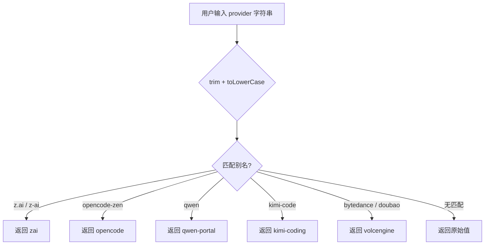
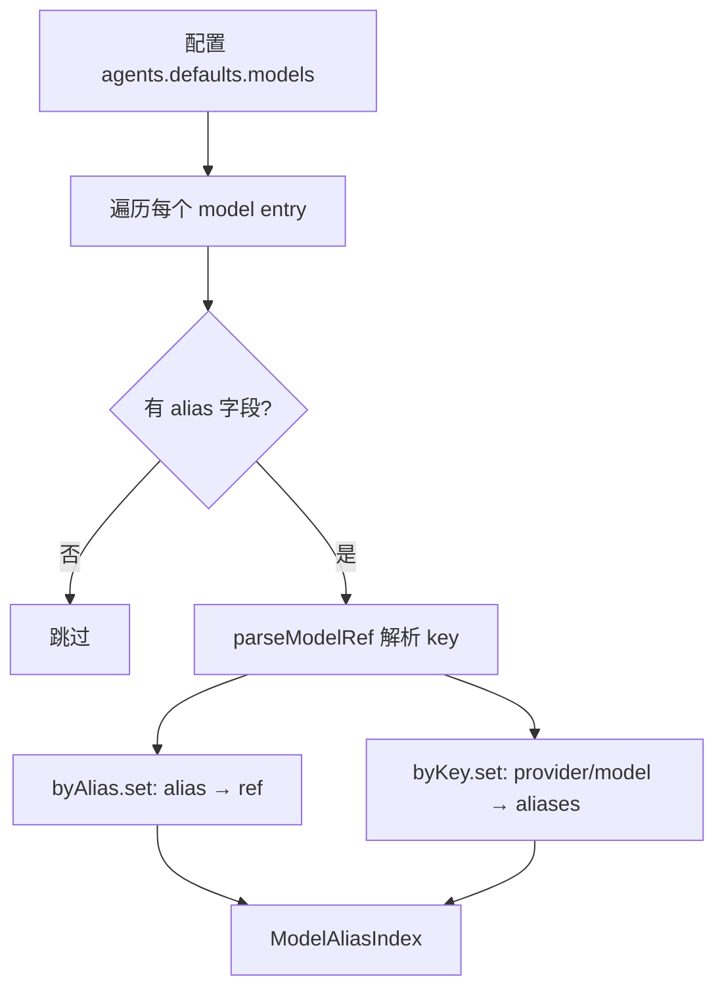
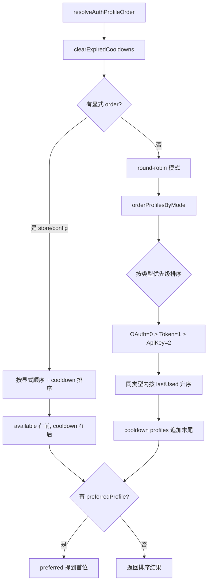

# PD-369.01 OpenClaw — 多模型 Provider 抽象与 AuthProfile 轮换

> 文档编号：PD-369.01
> 来源：OpenClaw `src/agents/model-selection.ts` `src/agents/auth-profiles/` `src/agents/models-config.providers.ts`
> GitHub：https://github.com/openclaw/openclaw.git
> 问题域：PD-369 多模型Provider抽象 Multi-Provider Abstraction
> 状态：可复用方案

---

## 第 1 章 问题与动机

### 1.1 核心问题

当一个 Agent 系统需要同时支持 20+ 个 LLM 提供商（Anthropic、OpenAI、Google、Bedrock、Ollama、HuggingFace、BytePlus、Venice、MiniMax、Moonshot、Kimi、Qwen、OpenRouter、vLLM、NVIDIA、Together、Qianfan、Xiaomi、Cloudflare AI Gateway、GitHub Copilot 等），面临三个核心挑战：

1. **模型标识碎片化**：同一模型在不同上下文中有不同名称（`opus-4.6` vs `claude-opus-4-6`，`bytedance` vs `volcengine`），用户输入不可预测
2. **认证方式异构**：API Key、OAuth Token、AWS SDK 凭证、GitHub Token 交换等多种认证模式共存，且需要自动轮换和冷却
3. **Provider 配置爆炸**：每个 Provider 有独立的 baseUrl、API 协议（anthropic-messages / openai-completions / bedrock-converse-stream / ollama）、模型目录、成本定义

### 1.2 OpenClaw 的解法概述

OpenClaw 构建了三层抽象来解决这些问题：

1. **ModelRef 标准化层**（`model-selection.ts:11-14`）：将所有模型引用统一为 `{provider, model}` 二元组，通过 `normalizeProviderId` 和 `normalizeProviderModelId` 消除命名差异
2. **AuthProfile 轮换层**（`auth-profiles/`）：统一的认证存储 + 优先级排序 + 指数退避冷却 + OAuth 自动刷新，支持 round-robin 和 cooldown-aware 排序
3. **Provider 隐式发现层**（`models-config.providers.ts:767-955`）：自动从环境变量和 auth-profiles 发现可用 Provider，动态构建 `models.json`，支持 Ollama/vLLM/Venice/Bedrock/HuggingFace 的运行时模型发现

### 1.3 设计思想

| 设计原则 | 具体实现 | 理由 | 替代方案 |
|----------|----------|------|----------|
| 标识归一化 | `normalizeProviderId` 将 `z.ai`/`z-ai`→`zai`，`bytedance`/`doubao`→`volcengine` | 用户输入不可控，需要单一规范形式 | 严格要求用户输入标准 ID（体验差） |
| 别名双向索引 | `ModelAliasIndex` 用 `byAlias` + `byKey` 双 Map | 需要从别名→模型和模型→别名双向查找 | 单向 Map + 遍历（O(n)） |
| 认证类型优先级 | OAuth > Token > API Key 排序（`order.ts:161`） | OAuth 可自动刷新，优先使用；API Key 是静态兜底 | 不区分类型（浪费 OAuth 优势） |
| 冷却窗口不可变 | `keepActiveWindowOrRecompute`（`usage.ts:352-361`） | 防止重试在窗口内不断延长恢复时间 | 每次失败重新计算（导致无限延长） |
| 隐式 Provider 发现 | `resolveImplicitProviders` 从 env + auth store 自动注册 | 零配置体验，有 key 就能用 | 要求用户手动配置每个 Provider |

---

## 第 2 章 源码实现分析

### 2.1 架构概览

OpenClaw 的多 Provider 抽象由三个核心模块组成，形成从用户输入到 API 调用的完整管道：

```
┌─────────────────────────────────────────────────────────────────┐
│                     用户输入 / 配置                              │
│  "opus-4.6"  "anthropic/claude-opus-4-6"  "my-fast-model"      │
└──────────────────────────┬──────────────────────────────────────┘
                           │
                    ┌──────▼──────┐
                    │ ModelRef    │  model-selection.ts
                    │ 标准化层    │  normalizeProviderId()
                    │             │  normalizeProviderModelId()
                    │             │  buildModelAliasIndex()
                    └──────┬──────┘
                           │ { provider: "anthropic", model: "claude-opus-4-6" }
                    ┌──────▼──────┐
                    │ AuthProfile │  auth-profiles/
                    │ 轮换层      │  resolveAuthProfileOrder()
                    │             │  resolveApiKeyForProfile()
                    │             │  markAuthProfileFailure()
                    └──────┬──────┘
                           │ apiKey + provider
                    ┌──────▼──────┐
                    │ Provider    │  models-config.providers.ts
                    │ 配置层      │  resolveImplicitProviders()
                    │             │  ensureOpenClawModelsJson()
                    └──────┬──────┘
                           │ { baseUrl, api, models, apiKey }
                    ┌──────▼──────┐
                    │ ModelCatalog │  model-catalog.ts
                    │ + Allowlist  │  loadModelCatalog()
                    │              │  buildAllowedModelSet()
                    └──────┬──────┘
                           │
                    ┌──────▼──────┐
                    │  API 调用    │  api-key-rotation.ts
                    │  + 轮换重试  │  executeWithApiKeyRotation()
                    └─────────────┘
```

### 2.2 核心实现

#### 2.2.1 Provider ID 归一化



对应源码 `src/agents/model-selection.ts:39-58`：

```typescript
export function normalizeProviderId(provider: string): string {
  const normalized = provider.trim().toLowerCase();
  if (normalized === "z.ai" || normalized === "z-ai") {
    return "zai";
  }
  if (normalized === "opencode-zen") {
    return "opencode";
  }
  if (normalized === "qwen") {
    return "qwen-portal";
  }
  if (normalized === "kimi-code") {
    return "kimi-coding";
  }
  // Backward compatibility for older provider naming.
  if (normalized === "bytedance" || normalized === "doubao") {
    return "volcengine";
  }
  return normalized;
}
```

#### 2.2.2 模型别名双向索引



对应源码 `src/agents/model-selection.ts:214-240`：

```typescript
export function buildModelAliasIndex(params: {
  cfg: OpenClawConfig;
  defaultProvider: string;
}): ModelAliasIndex {
  const byAlias = new Map<string, { alias: string; ref: ModelRef }>();
  const byKey = new Map<string, string[]>();

  const rawModels = params.cfg.agents?.defaults?.models ?? {};
  for (const [keyRaw, entryRaw] of Object.entries(rawModels)) {
    const parsed = parseModelRef(String(keyRaw ?? ""), params.defaultProvider);
    if (!parsed) continue;
    const alias = String((entryRaw as { alias?: string })?.alias ?? "").trim();
    if (!alias) continue;
    const aliasKey = normalizeAliasKey(alias);
    byAlias.set(aliasKey, { alias, ref: parsed });
    const key = modelKey(parsed.provider, parsed.model);
    const existing = byKey.get(key) ?? [];
    existing.push(alias);
    byKey.set(key, existing);
  }
  return { byAlias, byKey };
}
```

#### 2.2.3 AuthProfile 优先级排序与冷却



对应源码 `src/agents/auth-profiles/order.ts:11-141`，核心排序逻辑在 `orderProfilesByMode`（`order.ts:143-189`）：

```typescript
function orderProfilesByMode(order: string[], store: AuthProfileStore): string[] {
  const now = Date.now();
  const available: string[] = [];
  const inCooldown: string[] = [];

  for (const profileId of order) {
    if (isProfileInCooldown(store, profileId)) {
      inCooldown.push(profileId);
    } else {
      available.push(profileId);
    }
  }

  const scored = available.map((profileId) => {
    const type = store.profiles[profileId]?.type;
    const typeScore = type === "oauth" ? 0 : type === "token" ? 1 : type === "api_key" ? 2 : 3;
    const lastUsed = store.usageStats?.[profileId]?.lastUsed ?? 0;
    return { profileId, typeScore, lastUsed };
  });

  const sorted = scored
    .toSorted((a, b) => {
      if (a.typeScore !== b.typeScore) return a.typeScore - b.typeScore;
      return a.lastUsed - b.lastUsed;
    })
    .map((entry) => entry.profileId);

  const cooldownSorted = inCooldown
    .map((profileId) => ({
      profileId,
      cooldownUntil: resolveProfileUnusableUntil(store.usageStats?.[profileId] ?? {}) ?? now,
    }))
    .toSorted((a, b) => a.cooldownUntil - b.cooldownUntil)
    .map((entry) => entry.profileId);

  return [...sorted, ...cooldownSorted];
}
```

### 2.3 实现细节

**指数退避冷却策略**（`usage.ts:270-276`）：

冷却时间按 `60s × 5^(errorCount-1)` 计算，上限 1 小时：
- 第 1 次失败：1 分钟
- 第 2 次失败：5 分钟
- 第 3 次失败：25 分钟
- 第 4 次及以上：60 分钟（上限）

Billing 类错误使用独立的 `disabledUntil` 字段，退避基数为 5 小时，上限 24 小时，采用 `2^n` 指数增长。

**冷却窗口不可变性**（`usage.ts:352-361`）：关键设计——活跃的冷却窗口不会被后续重试延长。`keepActiveWindowOrRecompute` 检查现有窗口是否仍在活跃期，如果是则保持不变，只在窗口过期后才重新计算。这防止了"重试风暴"导致恢复时间无限延长的问题。

**OAuth 凭证继承**（`auth-profiles/oauth.ts:100-135`）：子 Agent 可以从主 Agent 继承更新的 OAuth 凭证。`adoptNewerMainOAuthCredential` 比较主/子 Agent 的 `expires` 时间戳，如果主 Agent 有更新的凭证则自动采用。

**Provider 隐式发现**（`models-config.providers.ts:767-955`）：`resolveImplicitProviders` 对每个已知 Provider 执行两步检测：(1) 检查环境变量 `resolveEnvApiKeyVarName(provider)` (2) 检查 auth-profiles store `resolveApiKeyFromProfiles({provider, store})`。任一有值即自动注册该 Provider，实现零配置体验。

**运行时模型发现**：Ollama（`discoverOllamaModels`，L230-267）、vLLM（`discoverVllmModels`，L269-320）、Venice（`discoverVeniceModels`）、HuggingFace（`discoverHuggingfaceModels`）、Bedrock（`discoverBedrockModels`）均支持运行时 HTTP 探测，自动发现可用模型列表。

---

## 第 3 章 迁移指南

### 3.1 迁移清单

**阶段 1：ModelRef 标准化（1-2 天）**
- [ ] 定义 `ModelRef = { provider: string; model: string }` 类型
- [ ] 实现 `normalizeProviderId()`，收集你需要支持的 Provider 别名映射
- [ ] 实现 `normalizeProviderModelId()`，处理各 Provider 的模型 ID 特殊规则
- [ ] 实现 `parseModelRef(raw, defaultProvider)` 解析 `provider/model` 格式
- [ ] 实现 `buildModelAliasIndex()` 支持用户自定义别名

**阶段 2：AuthProfile 存储与轮换（2-3 天）**
- [ ] 定义 `AuthProfileStore` 数据结构（profiles + order + lastGood + usageStats）
- [ ] 实现 JSON 文件持久化 + 文件锁（防并发写入）
- [ ] 实现 `resolveAuthProfileOrder()` 排序算法（类型优先级 + round-robin + cooldown）
- [ ] 实现 `markAuthProfileFailure()` + `markAuthProfileUsed()` 状态追踪
- [ ] 实现 `calculateAuthProfileCooldownMs()` 指数退避

**阶段 3：Provider 自动发现（1-2 天）**
- [ ] 实现 `resolveImplicitProviders()` 从环境变量 + auth store 自动注册
- [ ] 为每个 Provider 实现 `buildXxxProvider()` 工厂函数
- [ ] 实现运行时模型发现（Ollama/vLLM 等本地服务）
- [ ] 实现 `ensureModelsJson()` 合并隐式 + 显式配置

### 3.2 适配代码模板

以下是一个可直接复用的 TypeScript 实现，提取了 OpenClaw 的核心模式：

```typescript
// === model-ref.ts ===
export type ModelRef = { provider: string; model: string };

const PROVIDER_ALIASES: Record<string, string> = {
  "bytedance": "volcengine",
  "doubao": "volcengine",
  // 按需添加你的别名映射
};

export function normalizeProviderId(provider: string): string {
  const normalized = provider.trim().toLowerCase();
  return PROVIDER_ALIASES[normalized] ?? normalized;
}

export function parseModelRef(raw: string, defaultProvider: string): ModelRef | null {
  const trimmed = raw.trim();
  if (!trimmed) return null;
  const slash = trimmed.indexOf("/");
  if (slash === -1) {
    return { provider: normalizeProviderId(defaultProvider), model: trimmed };
  }
  const provider = trimmed.slice(0, slash).trim();
  const model = trimmed.slice(slash + 1).trim();
  if (!provider || !model) return null;
  return { provider: normalizeProviderId(provider), model };
}

// === auth-profile-rotation.ts ===
type ProfileUsageStats = {
  lastUsed?: number;
  cooldownUntil?: number;
  errorCount?: number;
};

export function calculateCooldownMs(errorCount: number): number {
  const n = Math.max(1, errorCount);
  return Math.min(60 * 60 * 1000, 60 * 1000 * 5 ** Math.min(n - 1, 3));
}

export function sortProfilesByPriority(
  profiles: Array<{ id: string; type: "oauth" | "token" | "api_key"; stats: ProfileUsageStats }>,
): string[] {
  const typeScore = (t: string) => (t === "oauth" ? 0 : t === "token" ? 1 : 2);
  const now = Date.now();

  const available = profiles.filter(
    (p) => !p.stats.cooldownUntil || now >= p.stats.cooldownUntil,
  );
  const inCooldown = profiles.filter(
    (p) => p.stats.cooldownUntil && now < p.stats.cooldownUntil,
  );

  available.sort((a, b) => {
    const ts = typeScore(a.type) - typeScore(b.type);
    if (ts !== 0) return ts;
    return (a.stats.lastUsed ?? 0) - (b.stats.lastUsed ?? 0);
  });

  inCooldown.sort(
    (a, b) => (a.stats.cooldownUntil ?? 0) - (b.stats.cooldownUntil ?? 0),
  );

  return [...available.map((p) => p.id), ...inCooldown.map((p) => p.id)];
}
```

### 3.3 适用场景

| 场景 | 适用度 | 说明 |
|------|--------|------|
| 多 Provider Agent 平台 | ⭐⭐⭐ | 核心场景，完整复用三层架构 |
| API Gateway / 路由层 | ⭐⭐⭐ | Provider 归一化 + 认证轮换直接适用 |
| 单 Provider + 多 Key 轮换 | ⭐⭐ | 只需 AuthProfile 层，ModelRef 层可简化 |
| 本地模型管理（Ollama/vLLM） | ⭐⭐ | 运行时发现模式可复用，认证层可省略 |
| 固定单模型应用 | ⭐ | 过度设计，直接硬编码即可 |

---

## 第 4 章 测试用例

```typescript
import { describe, it, expect } from "vitest";

// === 测试 Provider ID 归一化 ===
describe("normalizeProviderId", () => {
  it("normalizes z.ai variants to zai", () => {
    expect(normalizeProviderId("z.ai")).toBe("zai");
    expect(normalizeProviderId("z-ai")).toBe("zai");
    expect(normalizeProviderId("Z.AI")).toBe("zai");
  });

  it("normalizes bytedance/doubao to volcengine", () => {
    expect(normalizeProviderId("bytedance")).toBe("volcengine");
    expect(normalizeProviderId("doubao")).toBe("volcengine");
    expect(normalizeProviderId("Doubao")).toBe("volcengine");
  });

  it("passes through unknown providers", () => {
    expect(normalizeProviderId("anthropic")).toBe("anthropic");
    expect(normalizeProviderId("openai")).toBe("openai");
  });

  it("handles whitespace", () => {
    expect(normalizeProviderId("  anthropic  ")).toBe("anthropic");
  });
});

// === 测试模型引用解析 ===
describe("parseModelRef", () => {
  it("parses provider/model format", () => {
    const ref = parseModelRef("anthropic/claude-opus-4-6", "openai");
    expect(ref).toEqual({ provider: "anthropic", model: "claude-opus-4-6" });
  });

  it("uses default provider when no slash", () => {
    const ref = parseModelRef("gpt-4o", "openai");
    expect(ref).toEqual({ provider: "openai", model: "gpt-4o" });
  });

  it("returns null for empty input", () => {
    expect(parseModelRef("", "openai")).toBeNull();
    expect(parseModelRef("  ", "openai")).toBeNull();
  });

  it("normalizes provider in parsed ref", () => {
    const ref = parseModelRef("bytedance/doubao-pro", "anthropic");
    expect(ref?.provider).toBe("volcengine");
  });
});

// === 测试冷却计算 ===
describe("calculateCooldownMs", () => {
  it("returns 1 min for first error", () => {
    expect(calculateAuthProfileCooldownMs(1)).toBe(60_000);
  });

  it("returns 5 min for second error", () => {
    expect(calculateAuthProfileCooldownMs(2)).toBe(300_000);
  });

  it("returns 25 min for third error", () => {
    expect(calculateAuthProfileCooldownMs(3)).toBe(1_500_000);
  });

  it("caps at 1 hour", () => {
    expect(calculateAuthProfileCooldownMs(10)).toBe(3_600_000);
    expect(calculateAuthProfileCooldownMs(100)).toBe(3_600_000);
  });
});

// === 测试 Profile 排序 ===
describe("orderProfilesByMode", () => {
  it("prioritizes OAuth over Token over ApiKey", () => {
    // OAuth profiles should come first, then Token, then ApiKey
    // Within same type, oldest lastUsed comes first (round-robin)
  });

  it("puts cooldown profiles at the end", () => {
    // Profiles with active cooldownUntil > now should be appended
    // Sorted by cooldownUntil ascending (soonest recovery first)
  });

  it("respects preferredProfile override", () => {
    // If preferredProfile is specified and exists in list,
    // it should be moved to position 0
  });
});
```

---

## 第 5 章 跨域关联

| 关联域 | 关系类型 | 说明 |
|--------|----------|------|
| PD-03 容错与重试 | 强协同 | AuthProfile 的指数退避冷却 + API Key 轮换重试（`api-key-rotation.ts`）是容错的核心实现 |
| PD-11 可观测性 | 协同 | `auth-health.ts` 提供 Provider 级健康状态聚合，`ProfileUsageStats` 记录失败原因分布 |
| PD-06 记忆持久化 | 依赖 | AuthProfileStore 使用 JSON 文件 + 文件锁持久化，子 Agent 从主 Agent 继承凭证 |
| PD-04 工具系统 | 协同 | Provider 配置决定了可用的模型目录，影响工具调用时的模型选择 |
| PD-01 上下文管理 | 间接 | `ModelCatalogEntry.contextWindow` 字段为上下文窗口管理提供模型级元数据 |

---

## 第 6 章 来源文件索引

| 文件 | 行范围 | 关键实现 |
|------|--------|----------|
| `src/agents/model-selection.ts` | L11-L573 | ModelRef 类型定义、Provider/Model ID 归一化、别名索引、模型解析全流程 |
| `src/agents/auth-profiles/types.ts` | L1-L76 | AuthProfileCredential 联合类型（api_key/token/oauth）、ProfileUsageStats、AuthProfileStore |
| `src/agents/auth-profiles/order.ts` | L1-L189 | resolveAuthProfileOrder 排序算法、orderProfilesByMode 类型优先级 + round-robin |
| `src/agents/auth-profiles/usage.ts` | L1-L543 | 冷却计算、指数退避、billing 独立禁用、clearExpiredCooldowns 断路器半开 |
| `src/agents/auth-profiles/oauth.ts` | L1-L377 | OAuth 刷新（含 Chutes/Qwen 特殊路径）、子 Agent 凭证继承、fallback 链 |
| `src/agents/auth-profiles/profiles.ts` | L1-L117 | Profile CRUD、setAuthProfileOrder、markAuthProfileGood |
| `src/agents/auth-profiles/store.ts` | L1-L347 | JSON 持久化、文件锁、legacy 迁移、主/子 Agent store 合并 |
| `src/agents/models-config.providers.ts` | L1-L1050 | 20+ Provider 工厂函数、隐式发现、Ollama/vLLM/Venice/Bedrock/HuggingFace 运行时探测 |
| `src/agents/models-config.ts` | L1-L164 | Provider 合并策略（merge mode）、ensureOpenClawModelsJson |
| `src/agents/model-catalog.ts` | L1-L193 | ModelCatalogEntry、loadModelCatalog 缓存、pi-ai SDK 集成 |
| `src/agents/api-key-rotation.ts` | L1-L73 | executeWithApiKeyRotation 多 Key 轮换执行 |
| `src/agents/auth-health.ts` | L1-L262 | Provider 级健康聚合、OAuth 过期预警 |
| `src/agents/defaults.ts` | L1-L7 | DEFAULT_PROVIDER="anthropic"、DEFAULT_MODEL="claude-opus-4-6" |

---

## 第 7 章 横向对比维度

```json comparison_data
{
  "project": "OpenClaw",
  "dimensions": {
    "Provider注册方式": "隐式发现：env + auth-profiles 自动注册 20+ Provider",
    "模型标识策略": "双向别名索引 + Provider/Model 二元组归一化",
    "认证轮换机制": "三类型优先级排序（OAuth>Token>ApiKey）+ round-robin + 指数退避冷却",
    "运行时发现": "Ollama/vLLM/Venice/Bedrock/HuggingFace HTTP 探测自动发现模型",
    "冷却策略": "5^n 指数退避（1m→5m→25m→60m），billing 独立 2^n 退避（5h→24h）",
    "凭证继承": "子 Agent 自动从主 Agent 继承 OAuth 凭证，比较 expires 取最新"
  }
}
```

### 域元数据补充

```json domain_metadata
{
  "solution_summary": "OpenClaw 用三层架构（ModelRef归一化 + AuthProfile轮换 + Provider隐式发现）统一 20+ LLM 提供商，实现 OAuth>Token>ApiKey 优先级排序、5^n 指数退避冷却和运行时模型探测",
  "description": "多模型Provider抽象需要解决认证轮换、冷却恢复和运行时模型发现的协同问题",
  "sub_problems": [
    "认证类型优先级排序与 round-robin 负载均衡",
    "冷却窗口不可变性防止重试风暴",
    "子Agent凭证继承与主Agent同步",
    "运行时本地模型服务探测（Ollama/vLLM）",
    "Legacy 认证格式迁移与向后兼容"
  ],
  "best_practices": [
    "冷却窗口一旦激活不可被后续重试延长",
    "Billing 错误与普通错误使用独立退避策略",
    "隐式Provider发现实现零配置体验",
    "文件锁保护并发认证状态更新"
  ]
}
```
