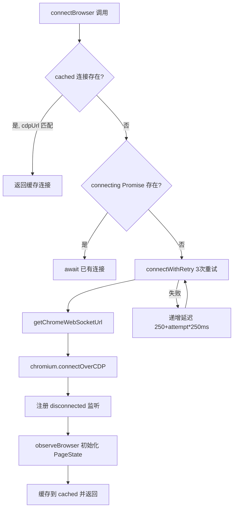
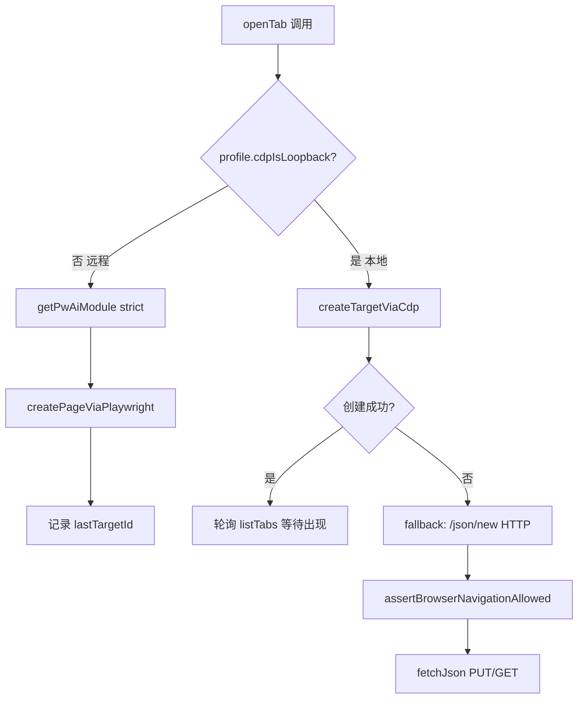
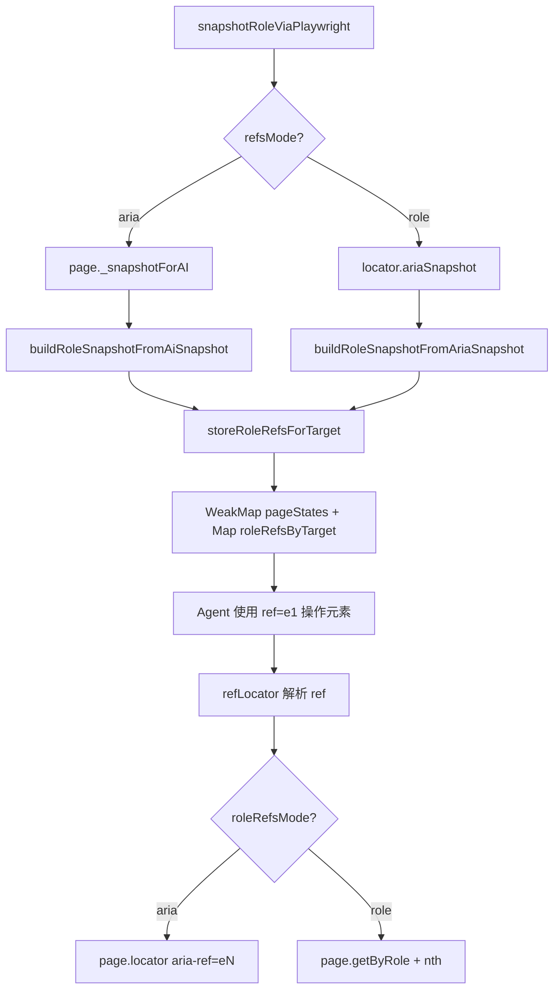

# PD-370.01 OpenClaw — Playwright + CDP 双通道浏览器自动化

> 文档编号：PD-370.01
> 来源：OpenClaw `src/browser/`
> GitHub：https://github.com/openclaw/openclaw.git
> 问题域：PD-370 浏览器自动化 Browser Automation
> 状态：可复用方案

---

## 第 1 章 问题与动机

### 1.1 核心问题

浏览器自动化是 Agent 系统与 Web 世界交互的关键能力。核心挑战包括：

1. **连接多样性**：Agent 需要同时支持本地 Chrome 实例（通过 CDP 直连）和远程浏览器容器（通过 Playwright 持久连接），两种模式的 Tab 生命周期语义完全不同
2. **多 Profile 隔离**：不同任务需要独立的浏览器上下文（Cookie、缓存、扩展），避免状态污染
3. **AI 辅助页面理解**：Agent 需要"看懂"页面——不是像素级截图，而是结构化的 ARIA 角色快照，并能通过 ref 引用精确操作元素
4. **安全边界**：浏览器是 Agent 最危险的工具之一，必须防止 SSRF、恶意导航、协议滥用
5. **扩展中继**：当 Chrome 扩展作为 CDP 桥接时，需要一个完整的 WebSocket 中继服务器来转发 CDP 命令

### 1.2 OpenClaw 的解法概述

OpenClaw 构建了一个三层浏览器自动化架构：

1. **CDP 直连层**（`cdp.ts` + `cdp.helpers.ts`）：通过 HTTP `/json/list`、`/json/new`、`/json/activate` 等端点管理 Tab，适用于本地 loopback 场景
2. **Playwright 持久连接层**（`pw-session.ts`）：通过 `chromium.connectOverCDP()` 建立持久 WebSocket 连接，适用于远程 CDP 场景，解决 HTTP 端点的"临时性"问题（`pw-session.ts:318-364`）
3. **扩展中继层**（`extension-relay.ts`）：当浏览器通过 Chrome 扩展暴露 CDP 时，中继服务器在本地端口上模拟完整的 CDP 协议（`extension-relay.ts:294-361`）

关键设计：根据 `profile.cdpIsLoopback` 自动选择 CDP 直连或 Playwright 持久连接（`server-context.ts:102-116`），对上层 API 透明。

### 1.3 设计思想

| 设计原则 | 具体实现 | 理由 | 替代方案 |
|----------|----------|------|----------|
| 双通道透明切换 | `cdpIsLoopback` 标志自动选择 CDP HTTP 或 Playwright 持久连接 | 远程 CDP 的 HTTP 端点创建的 Tab 是临时的，Playwright 持久连接才能保持 Tab 存活 | 全部走 Playwright（但本地场景 CDP 更轻量） |
| Profile 级隔离 | 每个 Profile 独立 CDP 端口（18800-18899）+ 独立 user-data-dir | 避免 Cookie/缓存/扩展状态污染 | 单实例多 BrowserContext（隔离度不够） |
| ARIA 角色快照 | `pw-role-snapshot.ts` 将 Playwright ariaSnapshot 转为带 ref 的结构化树 | Agent 需要语义化的页面理解，不是原始 DOM | 纯截图 + Vision LLM（成本高、延迟大） |
| 导航守卫 | `navigation-guard.ts` 在每次导航前校验 URL 协议和 SSRF 策略 | 防止 Agent 被诱导访问内网地址或使用危险协议 | 事后检测（太晚了） |
| 连接自愈 | `connectBrowser` 3 次重试 + 递增超时 + 断连自动清理缓存 | CDP WebSocket 连接不稳定，尤其是远程场景 | 单次连接失败即报错（体验差） |

---

## 第 2 章 源码实现分析

### 2.1 架构概览

OpenClaw 的浏览器自动化模块由 5 个核心层组成：

```
┌─────────────────────────────────────────────────────────────┐
│                    Agent API Layer                           │
│  pw-tools-core.interactions.ts  pw-tools-core.snapshot.ts   │
│  (click/type/fill/screenshot)   (snapshot/navigate/pdf)     │
├─────────────────────────────────────────────────────────────┤
│                  Session Management                          │
│  pw-session.ts                                              │
│  (connectBrowser / getPageForTargetId / refLocator)         │
│  (PageState: console/errors/requests/roleRefs WeakMap)      │
├──────────────────────┬──────────────────────────────────────┤
│   CDP Direct Layer   │   Extension Relay Layer              │
│   cdp.ts             │   extension-relay.ts                 │
│   cdp.helpers.ts     │   (WebSocket relay server)           │
├──────────────────────┴──────────────────────────────────────┤
│                  Profile & Chrome Management                 │
│  server-context.ts (ProfileContext / BrowserRouteContext)    │
│  chrome.ts (launch / stop / CDP readiness check)            │
│  profiles.ts (port allocation / color assignment)           │
│  navigation-guard.ts (SSRF protection)                      │
│  screenshot.ts (adaptive JPEG compression)                  │
└─────────────────────────────────────────────────────────────┘
```

### 2.2 核心实现

#### 2.2.1 Playwright 持久连接与自动重连



对应源码 `pw-session.ts:318-364`：

```typescript
async function connectBrowser(cdpUrl: string): Promise<ConnectedBrowser> {
  const normalized = normalizeCdpUrl(cdpUrl);
  if (cached?.cdpUrl === normalized) {
    return cached;
  }
  if (connecting) {
    return await connecting;
  }

  const connectWithRetry = async (): Promise<ConnectedBrowser> => {
    let lastErr: unknown;
    for (let attempt = 0; attempt < 3; attempt += 1) {
      try {
        const timeout = 5000 + attempt * 2000;
        const wsUrl = await getChromeWebSocketUrl(normalized, timeout).catch(() => null);
        const endpoint = wsUrl ?? normalized;
        const headers = getHeadersWithAuth(endpoint);
        const browser = await chromium.connectOverCDP(endpoint, { timeout, headers });
        const onDisconnected = () => {
          if (cached?.browser === browser) {
            cached = null;
          }
        };
        const connected: ConnectedBrowser = { browser, cdpUrl: normalized, onDisconnected };
        cached = connected;
        browser.on("disconnected", onDisconnected);
        observeBrowser(browser);
        return connected;
      } catch (err) {
        lastErr = err;
        const delay = 250 + attempt * 250;
        await new Promise((r) => setTimeout(r, delay));
      }
    }
    throw lastErr instanceof Error ? lastErr : new Error("CDP connect failed");
  };

  connecting = connectWithRetry().finally(() => { connecting = null; });
  return await connecting;
}
```

关键设计点：
- **单例缓存**：全局 `cached` 变量确保同一 cdpUrl 只维护一个连接（`pw-session.ts:105`）
- **连接去重**：`connecting` Promise 防止并发请求创建多个连接（`pw-session.ts:106`）
- **断连自清理**：`disconnected` 事件自动清空缓存，下次请求触发重连（`pw-session.ts:336-339`）

#### 2.2.2 双通道 Tab 管理（CDP vs Playwright）



对应源码 `server-context.ts:138-224`：

```typescript
const openTab = async (url: string): Promise<BrowserTab> => {
  const ssrfPolicyOpts = withBrowserNavigationPolicy(state().resolved.ssrfPolicy);

  // 远程 Profile：使用 Playwright 持久连接创建 Tab
  if (!profile.cdpIsLoopback) {
    const mod = await getPwAiModule({ mode: "strict" });
    const createPageViaPlaywright = (mod as Partial<PwAiModule> | null)?.createPageViaPlaywright;
    if (typeof createPageViaPlaywright === "function") {
      const page = await createPageViaPlaywright({
        cdpUrl: profile.cdpUrl, url, ...ssrfPolicyOpts,
      });
      const profileState = getProfileState();
      profileState.lastTargetId = page.targetId;
      return { targetId: page.targetId, title: page.title, url: page.url, type: page.type };
    }
  }

  // 本地 Profile：优先 CDP createTarget，失败则 fallback 到 /json/new
  const createdViaCdp = await createTargetViaCdp({
    cdpUrl: profile.cdpUrl, url, ...ssrfPolicyOpts,
  }).then((r) => r.targetId).catch(() => null);

  if (createdViaCdp) {
    // 轮询等待 Tab 出现在 /json/list 中（最多 2 秒）
    const deadline = Date.now() + 2000;
    while (Date.now() < deadline) {
      const tabs = await listTabs().catch(() => [] as BrowserTab[]);
      const found = tabs.find((t) => t.targetId === createdViaCdp);
      if (found) return found;
      await new Promise((r) => setTimeout(r, 100));
    }
    return { targetId: createdViaCdp, title: "", url, type: "page" };
  }
  // ... fallback to /json/new HTTP endpoint
};
```

#### 2.2.3 ARIA 角色快照与 Ref 系统



对应源码 `pw-role-snapshot.ts:322-379`：

```typescript
export function buildRoleSnapshotFromAriaSnapshot(
  ariaSnapshot: string,
  options: RoleSnapshotOptions = {},
): { snapshot: string; refs: RoleRefMap } {
  const lines = ariaSnapshot.split("\n");
  const refs: RoleRefMap = {};
  const tracker = createRoleNameTracker();
  let counter = 0;
  const nextRef = () => { counter += 1; return `e${counter}`; };

  if (options.interactive) {
    // 仅提取交互元素（button, link, textbox 等 20 种角色）
    const result = buildInteractiveSnapshotLines({ lines, options, ... });
    removeNthFromNonDuplicates(refs, tracker);
    return { snapshot: result.join("\n") || "(no interactive elements)", refs };
  }

  // 完整树：为交互元素和有名称的内容元素分配 ref
  const result: string[] = [];
  for (const line of lines) {
    const processed = processLine(line, refs, options, tracker, nextRef);
    if (processed !== null) result.push(processed);
  }
  removeNthFromNonDuplicates(refs, tracker);
  return { snapshot: options.compact ? compactTree(tree) : tree, refs };
}
```

### 2.3 实现细节

**PageState 生命周期管理**（`pw-session.ts:91-287`）：

每个 Playwright Page 对象通过 WeakMap 关联一个 PageState，自动收集：
- Console 消息（上限 500 条，FIFO 淘汰）
- 页面错误（上限 200 条）
- 网络请求（上限 500 条，含 status/ok/failureText）
- Role refs 缓存（跨请求稳定，通过 `roleRefsByTarget` Map 持久化，上限 50 个 target）

**强制断连自愈**（`pw-session.ts:628-679`）：

当 `evaluate` 操作卡住时，Playwright 会序列化所有后续 CDP 命令。OpenClaw 的解决方案：
1. 清空 `cached` 和 `connecting`
2. 通过原始 CDP WebSocket 发送 `Runtime.terminateExecution` 终止卡住的 JS
3. Fire-and-forget `browser.close()`（可能 hang 但不阻塞）
4. 下次请求自动创建全新的 CDP 连接

**Chrome 启动流程**（`chrome.ts:163-321`）：

启动分两阶段：
1. Bootstrap 阶段：首次启动创建 `Local State` 和 `Preferences` 文件，然后 SIGTERM 关闭
2. Decorate 阶段：注入 Profile 名称和颜色到 Chrome 偏好设置
3. 正式启动：带完整参数启动，包括 `--disable-blink-features=AutomationControlled` 反检测


---

## 第 3 章 迁移指南

### 3.1 迁移清单

**阶段 1：基础 CDP 连接**
- [ ] 安装 `playwright-core`（不含浏览器二进制，仅 API）
- [ ] 实现 `connectBrowser()` 单例缓存 + 3 次重试逻辑
- [ ] 实现 `getPageForTargetId()` 通过 CDP Session 获取 targetId
- [ ] 实现 `ensurePageState()` WeakMap 绑定页面状态

**阶段 2：Profile 管理**
- [ ] 定义 Profile 配置结构（name, cdpPort, cdpUrl, cdpIsLoopback, color）
- [ ] 实现 CDP 端口分配（范围 18800-18899，避免冲突）
- [ ] 实现 Chrome 启动器（spawn + CDP 就绪轮询）
- [ ] 实现 `ensureBrowserAvailable()` 自动启动/重启逻辑

**阶段 3：AI 页面理解**
- [ ] 集成 Playwright `ariaSnapshot()` 或 `_snapshotForAI()`
- [ ] 实现 `buildRoleSnapshotFromAriaSnapshot()` ref 分配
- [ ] 实现 `refLocator()` 将 ref 解析为 Playwright Locator
- [ ] 实现交互操作（click/type/fill）基于 ref 的 API

**阶段 4：安全加固**
- [ ] 实现 `assertBrowserNavigationAllowed()` 导航守卫
- [ ] 集成 SSRF 策略（DNS 解析 + 内网地址检测）
- [ ] 实现扩展中继认证（token-based WebSocket 升级）

### 3.2 适配代码模板

**最小可用的 Playwright CDP 连接管理器：**

```typescript
import { chromium, type Browser, type Page } from "playwright-core";

type CachedBrowser = { browser: Browser; cdpUrl: string };
let cached: CachedBrowser | null = null;

export async function connectBrowser(cdpUrl: string): Promise<Browser> {
  if (cached?.cdpUrl === cdpUrl) return cached.browser;

  for (let attempt = 0; attempt < 3; attempt++) {
    try {
      const timeout = 5000 + attempt * 2000;
      const browser = await chromium.connectOverCDP(cdpUrl, { timeout });
      browser.on("disconnected", () => {
        if (cached?.browser === browser) cached = null;
      });
      cached = { browser, cdpUrl };
      return browser;
    } catch (err) {
      if (attempt === 2) throw err;
      await new Promise((r) => setTimeout(r, 250 + attempt * 250));
    }
  }
  throw new Error("unreachable");
}

export async function getPage(cdpUrl: string, targetId?: string): Promise<Page> {
  const browser = await connectBrowser(cdpUrl);
  const pages = browser.contexts().flatMap((c) => c.pages());
  if (!targetId) return pages[0] ?? (() => { throw new Error("No pages"); })();

  for (const page of pages) {
    const session = await page.context().newCDPSession(page);
    try {
      const info = await session.send("Target.getTargetInfo") as any;
      if (info?.targetInfo?.targetId === targetId) return page;
    } finally {
      await session.detach().catch(() => {});
    }
  }
  throw new Error("tab not found");
}
```

**ARIA 角色快照 + Ref 系统简化版：**

```typescript
const INTERACTIVE_ROLES = new Set([
  "button", "link", "textbox", "checkbox", "radio",
  "combobox", "listbox", "menuitem", "option", "tab",
]);

type RoleRef = { role: string; name?: string; nth?: number };
type RoleRefMap = Record<string, RoleRef>;

export function buildRoleSnapshot(ariaSnapshot: string): {
  snapshot: string; refs: RoleRefMap;
} {
  const refs: RoleRefMap = {};
  let counter = 0;
  const lines = ariaSnapshot.split("\n");
  const result: string[] = [];

  for (const line of lines) {
    const match = line.match(/^(\s*-\s*)(\w+)(?:\s+"([^"]*)")?(.*)$/);
    if (!match) { result.push(line); continue; }
    const [, prefix, roleRaw, name, suffix] = match;
    const role = roleRaw.toLowerCase();

    if (INTERACTIVE_ROLES.has(role)) {
      counter++;
      const ref = `e${counter}`;
      refs[ref] = { role, ...(name ? { name } : {}) };
      result.push(`${prefix}${roleRaw}${name ? ` "${name}"` : ""} [ref=${ref}]${suffix}`);
    } else {
      result.push(line);
    }
  }
  return { snapshot: result.join("\n"), refs };
}
```

### 3.3 适用场景

| 场景 | 适用度 | 说明 |
|------|--------|------|
| Agent 驱动的 Web 交互 | ⭐⭐⭐ | 核心场景：Agent 通过 ref 精确操作页面元素 |
| 远程浏览器容器（Browserless/Steel） | ⭐⭐⭐ | Playwright 持久连接解决远程 Tab 临时性问题 |
| 多租户浏览器隔离 | ⭐⭐⭐ | Profile 级隔离 + 独立 CDP 端口 |
| Chrome 扩展桥接 | ⭐⭐ | 扩展中继架构复杂，但解决了无法直接 CDP 的场景 |
| 纯截图/爬虫 | ⭐ | 过度设计，简单场景用 Puppeteer 即可 |

---

## 第 4 章 测试用例

```typescript
import { describe, it, expect, vi, beforeEach } from "vitest";

// 基于 OpenClaw 真实函数签名的测试用例

describe("buildRoleSnapshotFromAriaSnapshot", () => {
  it("should assign refs to interactive elements", () => {
    const { buildRoleSnapshotFromAriaSnapshot } = require("./pw-role-snapshot");
    const aria = `- navigation "Main"
  - link "Home"
  - link "About"
- main
  - heading "Welcome" [level=1]
  - textbox "Search"
  - button "Submit"`;

    const { snapshot, refs } = buildRoleSnapshotFromAriaSnapshot(aria);

    expect(refs["e1"]).toEqual({ role: "link", name: "Home" });
    expect(refs["e2"]).toEqual({ role: "link", name: "About" });
    expect(refs["e3"]).toEqual({ role: "textbox", name: "Search" });
    expect(refs["e4"]).toEqual({ role: "button", name: "Submit" });
    expect(snapshot).toContain("[ref=e1]");
    expect(snapshot).toContain("[ref=e4]");
  });

  it("should handle interactive-only mode", () => {
    const { buildRoleSnapshotFromAriaSnapshot } = require("./pw-role-snapshot");
    const aria = `- navigation "Main"
  - link "Home"
- main
  - heading "Title"
  - paragraph "Some text"`;

    const { snapshot, refs } = buildRoleSnapshotFromAriaSnapshot(aria, { interactive: true });

    expect(Object.keys(refs)).toHaveLength(1);
    expect(refs["e1"]?.role).toBe("link");
    expect(snapshot).not.toContain("heading");
  });

  it("should handle duplicate role+name with nth index", () => {
    const { buildRoleSnapshotFromAriaSnapshot } = require("./pw-role-snapshot");
    const aria = `- button "Save"
- button "Save"
- button "Cancel"`;

    const { refs } = buildRoleSnapshotFromAriaSnapshot(aria);

    expect(refs["e1"]).toEqual({ role: "button", name: "Save", nth: 0 });
    expect(refs["e2"]).toEqual({ role: "button", name: "Save", nth: 1 });
    expect(refs["e3"]).toEqual({ role: "button", name: "Cancel" });
    // nth removed for non-duplicates
    expect(refs["e3"]?.nth).toBeUndefined();
  });
});

describe("assertBrowserNavigationAllowed", () => {
  it("should allow http/https URLs", async () => {
    const { assertBrowserNavigationAllowed } = require("./navigation-guard");
    await expect(
      assertBrowserNavigationAllowed({ url: "https://example.com" })
    ).resolves.toBeUndefined();
  });

  it("should block non-http protocols", async () => {
    const { assertBrowserNavigationAllowed } = require("./navigation-guard");
    await expect(
      assertBrowserNavigationAllowed({ url: "file:///etc/passwd" })
    ).rejects.toThrow("unsupported protocol");
  });

  it("should allow about:blank", async () => {
    const { assertBrowserNavigationAllowed } = require("./navigation-guard");
    await expect(
      assertBrowserNavigationAllowed({ url: "about:blank" })
    ).resolves.toBeUndefined();
  });
});

describe("normalizeBrowserScreenshot", () => {
  it("should pass through small images unchanged", async () => {
    const { normalizeBrowserScreenshot } = require("./screenshot");
    const small = Buffer.alloc(1024); // 1KB
    const result = await normalizeBrowserScreenshot(small);
    expect(result.buffer).toBe(small);
    expect(result.contentType).toBeUndefined();
  });
});

describe("allocateCdpPort", () => {
  it("should allocate first available port in range", () => {
    const { allocateCdpPort } = require("./profiles");
    const used = new Set([18800, 18801]);
    expect(allocateCdpPort(used)).toBe(18802);
  });

  it("should return null when range exhausted", () => {
    const { allocateCdpPort } = require("./profiles");
    const used = new Set(Array.from({ length: 100 }, (_, i) => 18800 + i));
    expect(allocateCdpPort(used)).toBeNull();
  });
});
```


---

## 第 5 章 跨域关联

| 关联域 | 关系类型 | 说明 |
|--------|----------|------|
| PD-01 上下文管理 | 协同 | ARIA 角色快照是 Agent 上下文的重要组成部分，`maxChars` 截断防止上下文溢出（`pw-tools-core.snapshot.ts:65-73`） |
| PD-03 容错与重试 | 依赖 | `connectBrowser` 的 3 次重试 + 递增超时是容错模式的典型应用；`forceDisconnectPlaywrightForTarget` 是卡死操作的自愈机制 |
| PD-04 工具系统 | 协同 | 浏览器操作（click/type/screenshot/snapshot）作为 Agent 工具暴露，每个操作都是独立的工具函数 |
| PD-05 沙箱隔离 | 依赖 | Profile 级隔离（独立 user-data-dir + CDP 端口）是沙箱隔离的浏览器层实现 |
| PD-10 中间件管道 | 协同 | 导航守卫 `assertBrowserNavigationAllowed` 是请求管道中的安全中间件 |
| PD-11 可观测性 | 协同 | PageState 自动收集 console/errors/requests，为 Agent 提供页面运行时可观测数据 |

---

## 第 6 章 来源文件索引

| 文件 | 行范围 | 关键实现 |
|------|--------|----------|
| `src/browser/pw-session.ts` | L1-807 | Playwright 持久连接管理、PageState WeakMap、refLocator、强制断连自愈 |
| `src/browser/server-context.ts` | L1-688 | ProfileContext 创建、双通道 Tab 管理（CDP/Playwright）、BrowserRouteContext |
| `src/browser/pw-role-snapshot.ts` | L1-455 | ARIA 角色快照解析、ref 分配、交互元素过滤、compact 树压缩 |
| `src/browser/pw-tools-core.interactions.ts` | L1-647 | click/type/fill/drag/evaluate 等交互操作，基于 ref 的元素定位 |
| `src/browser/pw-tools-core.snapshot.ts` | L1-213 | snapshot/navigate/resize/pdf 操作，SSRF 导航守卫集成 |
| `src/browser/chrome.ts` | L1-351 | Chrome 启动器（两阶段 bootstrap+decorate）、CDP 就绪检测、进程管理 |
| `src/browser/extension-relay.ts` | L1-822 | Chrome 扩展 WebSocket 中继服务器、CDP 命令路由、认证 |
| `src/browser/navigation-guard.ts` | L1-63 | URL 协议白名单、SSRF 策略集成 |
| `src/browser/screenshot.ts` | L1-58 | 自适应 JPEG 压缩（side grid × quality steps） |
| `src/browser/profiles.ts` | L1-114 | CDP 端口分配（18800-18899）、Profile 颜色分配 |
| `src/browser/pw-ai-module.ts` | L1-52 | pw-ai 模块懒加载（soft/strict 双模式） |

---

## 第 7 章 横向对比维度

```json comparison_data
{
  "project": "OpenClaw",
  "dimensions": {
    "连接架构": "CDP直连 + Playwright持久连接双通道，cdpIsLoopback自动切换",
    "页面理解": "ARIA角色快照 + ref引用系统，支持role/aria双模式",
    "Profile隔离": "独立CDP端口(18800-18899) + user-data-dir + 颜色标识",
    "安全防护": "导航守卫(协议白名单+SSRF) + 扩展中继认证(token-based)",
    "连接自愈": "3次递增重试 + 断连自清理 + Runtime.terminateExecution卡死恢复",
    "扩展桥接": "WebSocket中继服务器模拟完整CDP协议，支持Chrome扩展作为CDP源"
  }
}
```

### 域元数据补充

```json domain_metadata
{
  "solution_summary": "OpenClaw用CDP直连+Playwright持久连接双通道架构实现浏览器自动化，通过ARIA角色快照ref系统让Agent语义化操作页面元素，支持多Profile端口隔离和Chrome扩展WebSocket中继",
  "description": "Agent与Web交互的全栈自动化方案，涵盖连接管理、页面理解、安全防护",
  "sub_problems": [
    "扩展中继CDP命令路由与认证",
    "Playwright连接卡死的强制断连自愈",
    "ARIA快照ref跨请求稳定性维护"
  ],
  "best_practices": [
    "双通道透明切换：本地走CDP HTTP、远程走Playwright持久连接",
    "角色快照ref系统替代CSS选择器实现语义化元素操作",
    "WeakMap绑定PageState自动收集console/errors/requests"
  ]
}
```
