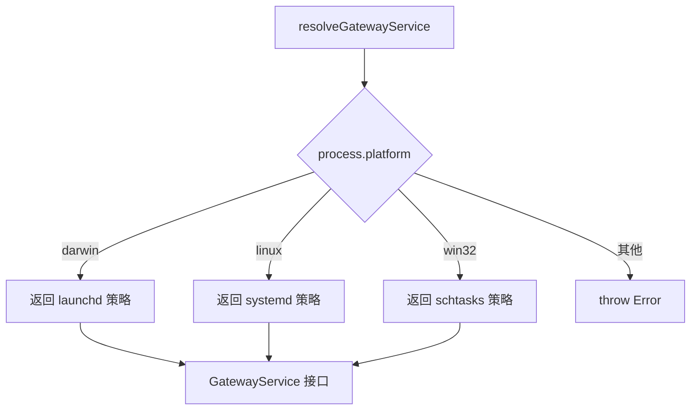
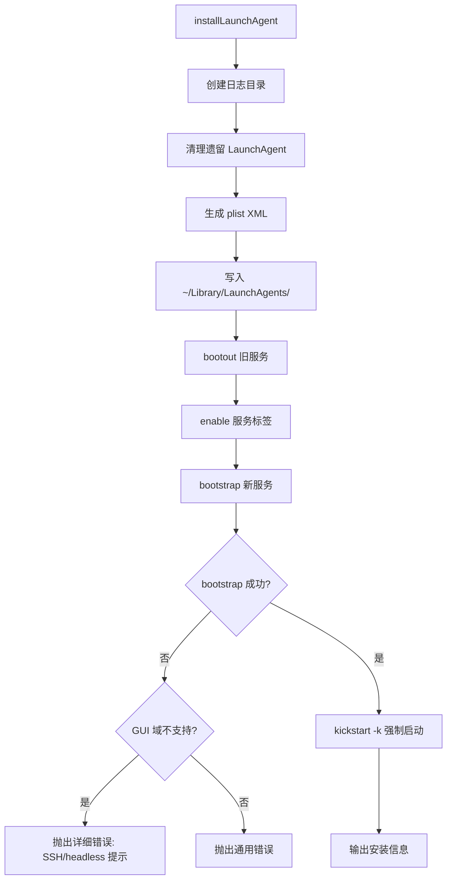
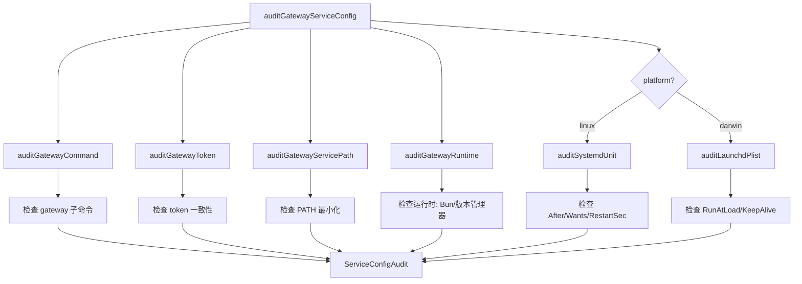

# PD-372.01 OpenClaw — 跨平台守护进程策略模式管理

> 文档编号：PD-372.01
> 来源：OpenClaw `src/daemon/`
> GitHub：https://github.com/openclaw/openclaw.git
> 问题域：PD-372 守护进程管理 Daemon Management
> 状态：可复用方案

---

## 第 1 章 问题与动机

### 1.1 核心问题

长驻后台的 Agent 服务（如 Gateway、Node Host）需要在用户登录后自动启动、崩溃后自动重启、升级时平滑替换。三大桌面/服务器平台各有完全不同的原生服务管理机制：

- **macOS**：`launchd` + plist XML 文件，通过 `launchctl` 管理
- **Linux**：`systemd` + unit 文件，通过 `systemctl --user` 管理
- **Windows**：`schtasks` + cmd 脚本，通过计划任务 API 管理

直接在业务代码中 `if/else` 三套平台逻辑会导致维护噩梦。更棘手的是：每个平台都有自己的陷阱——launchd 的 `gui/UID` 域限制、systemd 的 `loginctl enable-linger` 要求、schtasks 的 `/RU` 用户权限问题。

### 1.2 OpenClaw 的解法概述

OpenClaw 的 daemon 模块用 **策略模式 + 统一接口** 解决跨平台守护进程管理：

1. **统一 `GatewayService` 接口**（`src/daemon/service.ts:54-65`）：定义 `install/uninstall/stop/restart/isLoaded/readCommand/readRuntime` 七个操作，所有平台实现同一接口
2. **`resolveGatewayService()` 工厂函数**（`src/daemon/service.ts:67-114`）：根据 `process.platform` 返回对应平台的策略实现
3. **平台原生服务文件生成**：launchd plist XML（`src/daemon/launchd-plist.ts:82-110`）、systemd unit INI（`src/daemon/systemd-unit.ts:38-75`）、Windows cmd 脚本（`src/daemon/schtasks.ts:135-161`）
4. **最小化 PATH 构建**（`src/daemon/service-env.ts:145-184`）：为守护进程构建精简的 PATH，避免版本管理器路径污染
5. **多维度服务审计**（`src/daemon/service-audit.ts:384-405`）：检查运行时兼容性、PATH 安全性、token 一致性、平台特定配置

### 1.3 设计思想

| 设计原则 | 具体实现 | 理由 | 替代方案 |
|----------|----------|------|----------|
| 策略模式统一接口 | `GatewayService` 类型 + `resolveGatewayService()` 工厂 | 业务层无需感知平台差异，一套调用链适配三平台 | 继承体系（过重）、条件分支散落（难维护） |
| 平台原生而非跨平台抽象 | 直接生成 plist/unit/cmd 而非用 pm2/forever | 原生机制最可靠，无额外依赖，系统级重启保障 | pm2（需 npm 全局安装）、Docker（过重） |
| 最小化 PATH | `buildMinimalServicePath()` 只包含必要目录 | 守护进程不应依赖用户 shell 的 PATH，避免版本管理器路径导致运行时漂移 | 继承完整 PATH（不安全）、硬编码路径（不灵活） |
| 遗留服务自动清理 | `findLegacyLaunchAgents()`/`findLegacySystemdUnits()` | 产品重命名后旧服务残留会冲突，自动发现并清理 | 手动清理（用户体验差） |
| 环境变量注入隔离 | `buildServiceEnvironment()` 构建独立环境 | 守护进程环境与用户 shell 环境解耦，token/port/profile 显式传递 | 继承 process.env（泄露敏感信息） |

---

## 第 2 章 源码实现分析

### 2.1 架构概览

```
┌─────────────────────────────────────────────────────────┐
│                   业务层 (CLI commands)                    │
│              gateway install / uninstall / status          │
└──────────────────────┬──────────────────────────────────┘
                       │ resolveGatewayService()
                       ▼
┌─────────────────────────────────────────────────────────┐
│              GatewayService 统一接口                       │
│  install | uninstall | stop | restart | isLoaded         │
│  readCommand | readRuntime                                │
└──┬──────────────────┬──────────────────┬────────────────┘
   │ darwin            │ linux             │ win32
   ▼                   ▼                   ▼
┌──────────┐    ┌──────────────┐    ┌──────────────┐
│ launchd  │    │   systemd    │    │  schtasks    │
│ .ts      │    │   .ts        │    │  .ts         │
│          │    │              │    │              │
│ plist 生成│    │ unit 文件生成 │    │ cmd 脚本生成  │
│ launchctl│    │ systemctl    │    │ schtasks.exe │
└──────────┘    └──────────────┘    └──────────────┘
       │                │                   │
       ▼                ▼                   ▼
┌─────────────────────────────────────────────────────────┐
│                  横切关注点                                │
│  service-env.ts    → 环境变量构建 + 最小化 PATH            │
│  service-audit.ts  → 多维度健康审计                        │
│  runtime-paths.ts  → 运行时二进制路径解析                   │
│  constants.ts      → 服务标签/名称解析 + Profile 支持       │
│  inspect.ts        → 遗留服务发现与清理                     │
│  diagnostics.ts    → 日志错误模式匹配                      │
└─────────────────────────────────────────────────────────┘
```

### 2.2 核心实现

#### 2.2.1 策略模式工厂：`resolveGatewayService()`



对应源码 `src/daemon/service.ts:54-114`：

```typescript
export type GatewayService = {
  label: string;
  loadedText: string;
  notLoadedText: string;
  install: (args: GatewayServiceInstallArgs) => Promise<void>;
  uninstall: (args: GatewayServiceManageArgs) => Promise<void>;
  stop: (args: GatewayServiceControlArgs) => Promise<void>;
  restart: (args: GatewayServiceControlArgs) => Promise<void>;
  isLoaded: (args: GatewayServiceEnvArgs) => Promise<boolean>;
  readCommand: (env: GatewayServiceEnv) => Promise<GatewayServiceCommandConfig | null>;
  readRuntime: (env: GatewayServiceEnv) => Promise<GatewayServiceRuntime>;
};

export function resolveGatewayService(): GatewayService {
  if (process.platform === "darwin") {
    return {
      label: "LaunchAgent",
      loadedText: "loaded",
      notLoadedText: "not loaded",
      install: ignoreInstallResult(installLaunchAgent),
      uninstall: uninstallLaunchAgent,
      stop: stopLaunchAgent,
      restart: restartLaunchAgent,
      isLoaded: isLaunchAgentLoaded,
      readCommand: readLaunchAgentProgramArguments,
      readRuntime: readLaunchAgentRuntime,
    };
  }
  // ... linux → systemd, win32 → schtasks
  throw new Error(`Gateway service install not supported on ${process.platform}`);
}
```

#### 2.2.2 macOS launchd 安装流程



对应源码 `src/daemon/launchd.ts:344-415`：

```typescript
export async function installLaunchAgent({
  env, stdout, programArguments, workingDirectory, environment, description,
}: GatewayServiceInstallArgs): Promise<{ plistPath: string }> {
  const { logDir, stdoutPath, stderrPath } = resolveGatewayLogPaths(env);
  await fs.mkdir(logDir, { recursive: true });

  const domain = resolveGuiDomain();
  const label = resolveLaunchAgentLabel({ env });
  // 清理遗留服务
  for (const legacyLabel of resolveLegacyGatewayLaunchAgentLabels(env.OPENCLAW_PROFILE)) {
    const legacyPlistPath = resolveLaunchAgentPlistPathForLabel(env, legacyLabel);
    await execLaunchctl(["bootout", domain, legacyPlistPath]);
    await execLaunchctl(["unload", legacyPlistPath]);
    try { await fs.unlink(legacyPlistPath); } catch { /* ignore */ }
  }

  const plistPath = resolveLaunchAgentPlistPathForLabel(env, label);
  const plist = buildLaunchAgentPlist({ label, comment: serviceDescription,
    programArguments, workingDirectory, stdoutPath, stderrPath, environment });
  await fs.writeFile(plistPath, plist, "utf8");

  // launchd 可能保留 "disabled" 状态，bootstrap 前先 enable
  await execLaunchctl(["bootout", domain, plistPath]);
  await execLaunchctl(["unload", plistPath]);
  await execLaunchctl(["enable", `${domain}/${label}`]);
  const boot = await execLaunchctl(["bootstrap", domain, plistPath]);
  if (boot.code !== 0) {
    const detail = (boot.stderr || boot.stdout).trim();
    if (isUnsupportedGuiDomain(detail)) {
      throw new Error([
        `launchctl bootstrap failed: ${detail}`,
        `LaunchAgent install requires a logged-in macOS GUI session...`,
      ].join("\n"));
    }
    throw new Error(`launchctl bootstrap failed: ${detail}`);
  }
  await execLaunchctl(["kickstart", "-k", `${domain}/${label}`]);
  return { plistPath };
}
```

#### 2.2.3 多维度服务审计



对应源码 `src/daemon/service-audit.ts:384-405`：

```typescript
export async function auditGatewayServiceConfig(params: {
  env: Record<string, string | undefined>;
  command: GatewayServiceCommand;
  platform?: NodeJS.Platform;
  expectedGatewayToken?: string;
}): Promise<ServiceConfigAudit> {
  const issues: ServiceConfigIssue[] = [];
  const platform = params.platform ?? process.platform;
  auditGatewayCommand(params.command?.programArguments, issues);
  auditGatewayToken(params.command, issues, params.expectedGatewayToken);
  auditGatewayServicePath(params.command, issues, params.env, platform);
  await auditGatewayRuntime(params.env, params.command, issues, platform);
  if (platform === "linux") { await auditSystemdUnit(params.env, issues); }
  else if (platform === "darwin") { await auditLaunchdPlist(params.env, issues); }
  return { ok: issues.length === 0, issues };
}
```

### 2.3 实现细节

**最小化 PATH 构建**（`src/daemon/service-env.ts:145-184`）：守护进程的 PATH 不继承用户 shell 的完整 PATH，而是按平台精确构建。macOS 包含 `/opt/homebrew/bin`、`/usr/local/bin`、`/usr/bin`、`/bin` 以及用户级 bin 目录（`.local/bin`、`.volta/bin` 等）。Linux 类似但不含 Homebrew 路径。Windows 直接使用 `env.PATH`。

**Profile 多实例支持**（`src/daemon/constants.ts:20-59`）：通过 `OPENCLAW_PROFILE` 环境变量支持同一机器运行多个 Gateway 实例。Profile 会影响服务标签（`ai.openclaw.{profile}`）、systemd 单元名（`openclaw-gateway-{profile}`）和 Windows 任务名（`OpenClaw Gateway ({profile})`）。

**遗留服务发现**（`src/daemon/inspect.ts:315-432`）：`findExtraGatewayServices()` 扫描三个平台的服务目录，通过 marker 检测（`openclaw`/`clawdbot`/`moltbot`）发现遗留或冲突的服务实例，支持 `deep` 模式扫描系统级目录。

**systemd linger 管理**（`src/daemon/systemd-linger.ts:21-73`）：Linux 上 systemd 用户服务默认在用户注销后停止。`enableSystemdUserLinger()` 通过 `loginctl enable-linger` 确保服务在用户注销后继续运行，支持 `sudo` 提权模式。

**运行时二进制路径解析**（`src/daemon/runtime-paths.ts:156-185`）：`resolvePreferredNodePath()` 优先使用当前运行 `openclaw gateway install` 的 Node 路径（尊重用户的版本管理器选择），回退到系统 Node，并验证版本 >= 22。


---

## 第 3 章 迁移指南

### 3.1 迁移清单

**阶段 1：定义统一接口**
- [ ] 定义 `DaemonService` 接口：`install`、`uninstall`、`stop`、`restart`、`isRunning`、`readRuntime`
- [ ] 定义 `ServiceInstallArgs` 类型：`programArguments`、`workingDirectory`、`environment`、`description`
- [ ] 定义 `ServiceRuntime` 类型：`status`、`pid`、`lastExitStatus`、`detail`

**阶段 2：实现平台策略**
- [ ] macOS：实现 plist XML 生成 + `launchctl` 调用
- [ ] Linux：实现 systemd unit 文件生成 + `systemctl --user` 调用
- [ ] Windows：实现 cmd 脚本生成 + `schtasks` 调用
- [ ] 实现 `resolveDaemonService()` 工厂函数

**阶段 3：环境与安全**
- [ ] 实现最小化 PATH 构建（不继承用户 shell 的完整 PATH）
- [ ] 实现服务环境变量隔离（显式传递必要变量）
- [ ] 实现运行时二进制路径解析（优先当前 Node，回退系统 Node）

**阶段 4：运维能力**
- [ ] 实现服务审计（检查配置正确性、运行时兼容性）
- [ ] 实现遗留服务发现与清理
- [ ] 实现日志路径管理与错误模式匹配

### 3.2 适配代码模板

以下是一个可直接复用的跨平台守护进程管理模板（TypeScript）：

```typescript
// daemon-service.ts — 跨平台守护进程统一接口
import { execFile } from "node:child_process";
import fs from "node:fs/promises";
import path from "node:path";
import { promisify } from "node:util";

const execFileAsync = promisify(execFile);

// --- 类型定义 ---
type ServiceRuntime = {
  status: "running" | "stopped" | "unknown";
  pid?: number;
  lastExitStatus?: number;
  detail?: string;
};

type ServiceInstallArgs = {
  programArguments: string[];
  workingDirectory?: string;
  environment?: Record<string, string>;
  description?: string;
};

type DaemonService = {
  label: string;
  install(args: ServiceInstallArgs): Promise<void>;
  uninstall(): Promise<void>;
  stop(): Promise<void>;
  restart(): Promise<void>;
  isRunning(): Promise<boolean>;
  readRuntime(): Promise<ServiceRuntime>;
};

// --- macOS launchd 实现 ---
function createLaunchdService(serviceLabel: string, homeDir: string): DaemonService {
  const plistPath = path.join(homeDir, "Library", "LaunchAgents", `${serviceLabel}.plist`);
  const logDir = path.join(homeDir, ".myapp", "logs");
  const domain = `gui/${process.getuid?.() ?? 501}`;

  function buildPlist(args: ServiceInstallArgs): string {
    const argsXml = args.programArguments
      .map((a) => `<string>${escapeXml(a)}</string>`).join("\n      ");
    return `<?xml version="1.0" encoding="UTF-8"?>
<!DOCTYPE plist PUBLIC "-//Apple//DTD PLIST 1.0//EN"
  "http://www.apple.com/DTDs/PropertyList-1.0.dtd">
<plist version="1.0"><dict>
  <key>Label</key><string>${serviceLabel}</string>
  <key>RunAtLoad</key><true/>
  <key>KeepAlive</key><true/>
  <key>ProgramArguments</key><array>${argsXml}</array>
  <key>StandardOutPath</key><string>${logDir}/out.log</string>
  <key>StandardErrorPath</key><string>${logDir}/err.log</string>
</dict></plist>`;
  }

  async function launchctl(args: string[]) {
    try {
      const { stdout, stderr } = await execFileAsync("launchctl", args);
      return { stdout, stderr, code: 0 };
    } catch (err: any) {
      return { stdout: err.stdout ?? "", stderr: err.stderr ?? "", code: err.code ?? 1 };
    }
  }

  return {
    label: "LaunchAgent",
    async install(args) {
      await fs.mkdir(logDir, { recursive: true });
      await fs.mkdir(path.dirname(plistPath), { recursive: true });
      await fs.writeFile(plistPath, buildPlist(args), "utf8");
      await launchctl(["bootout", domain, plistPath]);
      await launchctl(["enable", `${domain}/${serviceLabel}`]);
      await launchctl(["bootstrap", domain, plistPath]);
      await launchctl(["kickstart", "-k", `${domain}/${serviceLabel}`]);
    },
    async uninstall() {
      await launchctl(["bootout", domain, plistPath]);
      try { await fs.unlink(plistPath); } catch {}
    },
    async stop() { await launchctl(["bootout", `${domain}/${serviceLabel}`]); },
    async restart() { await launchctl(["kickstart", "-k", `${domain}/${serviceLabel}`]); },
    async isRunning() {
      const res = await launchctl(["print", `${domain}/${serviceLabel}`]);
      return res.code === 0;
    },
    async readRuntime() {
      const res = await launchctl(["print", `${domain}/${serviceLabel}`]);
      if (res.code !== 0) return { status: "stopped" };
      const running = /state\s*=\s*running/i.test(res.stdout);
      return { status: running ? "running" : "stopped" };
    },
  };
}

// --- 工厂函数 ---
function resolveDaemonService(serviceLabel: string): DaemonService {
  const home = process.env.HOME || process.env.USERPROFILE || "";
  if (process.platform === "darwin") return createLaunchdService(serviceLabel, home);
  // if (process.platform === "linux") return createSystemdService(serviceLabel, home);
  // if (process.platform === "win32") return createSchtasksService(serviceLabel, home);
  throw new Error(`Unsupported platform: ${process.platform}`);
}

function escapeXml(s: string): string {
  return s.replace(/&/g, "&amp;").replace(/</g, "&lt;").replace(/>/g, "&gt;");
}
```

### 3.3 适用场景

| 场景 | 适用度 | 说明 |
|------|--------|------|
| CLI 工具需要后台常驻服务 | ⭐⭐⭐ | 最典型场景，如 Agent Gateway、本地 API 服务器 |
| 桌面应用的后台守护进程 | ⭐⭐⭐ | Electron/Tauri 应用的后台服务管理 |
| 开发工具的本地服务管理 | ⭐⭐ | 如本地数据库代理、文件同步服务 |
| 服务器端生产部署 | ⭐ | 生产环境通常用 Docker/K8s，此方案更适合桌面/开发场景 |
| 需要多实例（Profile）支持 | ⭐⭐⭐ | OpenClaw 的 Profile 机制可直接复用 |

---

## 第 4 章 测试用例

```typescript
import { describe, it, expect, vi, beforeEach } from "vitest";

// --- 测试 resolveGatewayService 策略选择 ---
describe("resolveGatewayService", () => {
  it("should return launchd strategy on darwin", () => {
    const originalPlatform = process.platform;
    Object.defineProperty(process, "platform", { value: "darwin" });
    try {
      const service = resolveGatewayService();
      expect(service.label).toBe("LaunchAgent");
      expect(service.loadedText).toBe("loaded");
      expect(typeof service.install).toBe("function");
      expect(typeof service.readRuntime).toBe("function");
    } finally {
      Object.defineProperty(process, "platform", { value: originalPlatform });
    }
  });

  it("should return systemd strategy on linux", () => {
    const originalPlatform = process.platform;
    Object.defineProperty(process, "platform", { value: "linux" });
    try {
      const service = resolveGatewayService();
      expect(service.label).toBe("systemd");
      expect(service.loadedText).toBe("enabled");
    } finally {
      Object.defineProperty(process, "platform", { value: originalPlatform });
    }
  });

  it("should throw on unsupported platform", () => {
    const originalPlatform = process.platform;
    Object.defineProperty(process, "platform", { value: "freebsd" });
    try {
      expect(() => resolveGatewayService()).toThrow("not supported");
    } finally {
      Object.defineProperty(process, "platform", { value: originalPlatform });
    }
  });
});

// --- 测试 plist 生成 ---
describe("buildLaunchAgentPlist", () => {
  it("should generate valid plist with RunAtLoad and KeepAlive", () => {
    const plist = buildLaunchAgentPlist({
      label: "ai.test.gateway",
      programArguments: ["/usr/local/bin/node", "server.js"],
      stdoutPath: "/tmp/out.log",
      stderrPath: "/tmp/err.log",
    });
    expect(plist).toContain("<key>Label</key>");
    expect(plist).toContain("<string>ai.test.gateway</string>");
    expect(plist).toContain("<key>RunAtLoad</key>");
    expect(plist).toContain("<true/>");
    expect(plist).toContain("<key>KeepAlive</key>");
    expect(plist).toContain("server.js");
  });

  it("should escape XML special characters in arguments", () => {
    const plist = buildLaunchAgentPlist({
      label: "test",
      programArguments: ["node", "--flag=a&b<c>d"],
      stdoutPath: "/tmp/out.log",
      stderrPath: "/tmp/err.log",
    });
    expect(plist).toContain("a&amp;b&lt;c&gt;d");
  });
});

// --- 测试 systemd unit 生成 ---
describe("buildSystemdUnit", () => {
  it("should generate unit with network dependency and restart policy", () => {
    const unit = buildSystemdUnit({
      programArguments: ["/usr/bin/node", "gateway.js"],
      description: "Test Gateway",
    });
    expect(unit).toContain("After=network-online.target");
    expect(unit).toContain("Wants=network-online.target");
    expect(unit).toContain("Restart=always");
    expect(unit).toContain("RestartSec=5");
    expect(unit).toContain("KillMode=process");
    expect(unit).toContain("WantedBy=default.target");
  });
});

// --- 测试服务审计 ---
describe("auditGatewayServiceConfig", () => {
  it("should detect missing PATH", async () => {
    const result = await auditGatewayServiceConfig({
      env: { HOME: "/home/test" },
      command: { programArguments: ["node", "gateway"], environment: {} },
      platform: "linux",
    });
    const pathIssue = result.issues.find(
      (i) => i.code === "gateway-path-missing"
    );
    expect(pathIssue).toBeDefined();
  });

  it("should detect token mismatch", async () => {
    const result = await auditGatewayServiceConfig({
      env: { HOME: "/home/test" },
      command: {
        programArguments: ["node", "gateway"],
        environment: { OPENCLAW_GATEWAY_TOKEN: "old-token" },
      },
      expectedGatewayToken: "new-token",
      platform: "linux",
    });
    const tokenIssue = result.issues.find(
      (i) => i.code === "gateway-token-mismatch"
    );
    expect(tokenIssue).toBeDefined();
  });

  it("should detect Bun runtime incompatibility", async () => {
    const result = await auditGatewayServiceConfig({
      env: { HOME: "/home/test" },
      command: {
        programArguments: ["/home/test/.bun/bin/bun", "gateway"],
        environment: { PATH: "/usr/bin" },
      },
      platform: "linux",
    });
    const bunIssue = result.issues.find(
      (i) => i.code === "gateway-runtime-bun"
    );
    expect(bunIssue).toBeDefined();
  });
});

// --- 测试 Profile 多实例 ---
describe("Profile resolution", () => {
  it("should return default label without profile", () => {
    expect(resolveGatewayLaunchAgentLabel()).toBe("ai.openclaw.gateway");
    expect(resolveGatewaySystemdServiceName()).toBe("openclaw-gateway");
  });

  it("should include profile in label", () => {
    expect(resolveGatewayLaunchAgentLabel("staging")).toBe("ai.openclaw.staging");
    expect(resolveGatewaySystemdServiceName("staging")).toBe("openclaw-gateway-staging");
  });

  it("should normalize 'default' profile to null", () => {
    expect(normalizeGatewayProfile("default")).toBeNull();
    expect(normalizeGatewayProfile("Default")).toBeNull();
  });
});
```


---

## 第 5 章 跨域关联

| 关联域 | 关系类型 | 说明 |
|--------|----------|------|
| PD-05 沙箱隔离 | 协同 | 守护进程的最小化 PATH 和环境变量隔离是一种轻量级沙箱，确保服务运行环境与用户 shell 解耦 |
| PD-11 可观测性 | 协同 | `diagnostics.ts` 的日志错误模式匹配和 `service-audit.ts` 的多维度审计为守护进程提供可观测性基础 |
| PD-03 容错与重试 | 依赖 | launchd 的 `KeepAlive=true` 和 systemd 的 `Restart=always` + `RestartSec=5` 是平台原生的容错重启机制 |
| PD-04 工具系统 | 协同 | 守护进程管理本身可作为 CLI 工具系统的一部分暴露（`gateway install/uninstall/status` 子命令） |
| PD-10 中间件管道 | 协同 | `repairLaunchAgentBootstrap()` 和 `enableSystemdUserLinger()` 可作为安装流程的中间件步骤 |

---

## 第 6 章 来源文件索引

| 文件 | 行范围 | 关键实现 |
|------|--------|----------|
| `src/daemon/service.ts` | L54-L114 | `GatewayService` 统一接口 + `resolveGatewayService()` 策略工厂 |
| `src/daemon/service-types.ts` | L1-L39 | 服务操作参数类型定义 |
| `src/daemon/service-runtime.ts` | L1-L13 | `GatewayServiceRuntime` 运行时状态类型 |
| `src/daemon/launchd.ts` | L27-L435 | macOS launchd 完整实现：安装/卸载/启停/运行时查询/遗留清理/修复 |
| `src/daemon/launchd-plist.ts` | L82-L110 | plist XML 生成器，含 XML 转义和环境变量字典渲染 |
| `src/daemon/systemd.ts` | L32-L411 | Linux systemd 完整实现：unit 文件管理/daemon-reload/enable/遗留清理 |
| `src/daemon/systemd-unit.ts` | L38-L75 | systemd unit 文件生成器，含参数转义和 KillMode=process |
| `src/daemon/systemd-linger.ts` | L21-L73 | `loginctl enable-linger` 管理，确保用户注销后服务继续运行 |
| `src/daemon/systemd-hints.ts` | L1-L30 | systemd 不可用时的诊断提示（WSL2 / 容器场景） |
| `src/daemon/schtasks.ts` | L135-L319 | Windows schtasks 完整实现：cmd 脚本生成/任务创建/用户权限处理 |
| `src/daemon/service-env.ts` | L145-L260 | 最小化 PATH 构建 + 服务环境变量组装（Gateway + Node Host） |
| `src/daemon/service-audit.ts` | L32-L405 | 16 种审计代码 + 多维度配置健康检查 |
| `src/daemon/runtime-paths.ts` | L7-L185 | 版本管理器检测 + 系统 Node 路径解析 + 首选运行时选择 |
| `src/daemon/runtime-binary.ts` | L1-L12 | Node/Bun 运行时识别 |
| `src/daemon/constants.ts` | L1-L114 | 服务标签/名称解析 + Profile 多实例 + 遗留名称兼容 |
| `src/daemon/inspect.ts` | L1-L432 | 跨平台遗留服务深度扫描（user/system 两级目录） |
| `src/daemon/diagnostics.ts` | L1-L44 | 日志错误模式匹配（5 种 Gateway 启动失败模式） |
| `src/daemon/paths.ts` | L1-L43 | HOME 解析 + 状态目录解析 + Profile 后缀 |

---

## 第 7 章 横向对比维度

```json comparison_data
{
  "project": "OpenClaw",
  "dimensions": {
    "平台覆盖": "macOS launchd + Linux systemd + Windows schtasks 三平台原生",
    "接口抽象": "GatewayService 策略模式统一接口，工厂函数按 process.platform 分发",
    "服务文件生成": "plist XML / systemd unit INI / cmd 脚本，三套原生格式生成器",
    "环境隔离": "buildMinimalServicePath 最小化 PATH + buildServiceEnvironment 显式变量注入",
    "审计能力": "16 种审计代码覆盖运行时/PATH/token/平台配置，分 recommended/aggressive 级别",
    "遗留兼容": "自动发现并清理 clawdbot/moltbot 等历史品牌的遗留服务",
    "多实例支持": "OPENCLAW_PROFILE 驱动服务标签/单元名/任务名的多实例隔离"
  }
}
```

### 域元数据补充

```json domain_metadata
{
  "solution_summary": "OpenClaw 用策略模式统一接口 + 三平台原生服务文件生成器（launchd plist/systemd unit/schtasks cmd），配合 16 种审计代码和最小化 PATH 构建实现跨平台守护进程管理",
  "description": "跨平台守护进程的策略模式抽象、环境隔离与配置审计",
  "sub_problems": [
    "遗留品牌服务自动发现与清理",
    "版本管理器路径污染检测与最小化 PATH",
    "systemd linger 持久化与 WSL2 兼容",
    "Profile 驱动的多实例服务隔离",
    "运行时二进制版本兼容性验证"
  ],
  "best_practices": [
    "策略模式统一接口消除平台条件分支",
    "守护进程 PATH 不继承用户 shell 完整 PATH",
    "launchd bootstrap 前先 enable 清除 disabled 状态",
    "systemd KillMode=process 避免子进程阻塞关闭",
    "审计代码分 recommended/aggressive 两级严重度"
  ]
}
```

