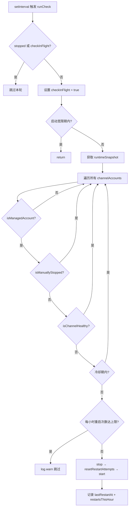
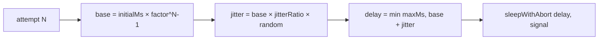

# PD-373.01 OpenClaw — 三层防护渠道健康监控与自动重启

> 文档编号：PD-373.01
> 来源：OpenClaw `src/gateway/channel-health-monitor.ts`
> GitHub：https://github.com/openclaw/openclaw.git
> 问题域：PD-373 渠道健康监控 Channel Health Monitoring
> 状态：可复用方案

---

## 第 1 章 问题与动机

### 1.1 核心问题

多渠道消息网关（Discord、Telegram、WhatsApp、Slack 等）在长时间运行中，各渠道连接会因网络抖动、上游服务重启、认证过期等原因断开。如果不主动检测并恢复，用户消息会静默丢失。但盲目重启又会引发"重启风暴"——一个持续崩溃的渠道在短时间内被反复重启，消耗大量资源并产生级联故障。

核心矛盾：**自动恢复的积极性** vs **重启风暴的防御性**。

### 1.2 OpenClaw 的解法概述

OpenClaw 采用三层防护架构解决这一矛盾：

1. **定时健康巡检**（`channel-health-monitor.ts:76-153`）— 每 5 分钟轮询所有渠道的运行时快照，判断 running + connected 状态
2. **冷却周期隔离**（`channel-health-monitor.ts:114-116`）— 刚重启的渠道在 cooldownCycles × checkInterval 内不再触发重启
3. **每小时重启次数上限**（`channel-health-monitor.ts:119-124`）— 滑动窗口计数，单渠道每小时最多重启 3 次
4. **启动宽限期**（`channel-health-monitor.ts:84-86`）— 系统启动后 60 秒内不执行健康检查，避免误判初始化中的渠道
5. **单次飞行锁**（`channel-health-monitor.ts:77-80`）— `checkInFlight` 标志防止检查重叠执行

此外，底层的 `ChannelManager`（`server-channels.ts:118-264`）自身也有独立的指数退避重连机制（最多 10 次），健康监控器是在 ChannelManager 自身重连耗尽后的"第二道防线"。

### 1.3 设计思想

| 设计原则 | 具体实现 | 理由 | 替代方案 |
|----------|----------|------|----------|
| 分层防御 | ChannelManager 自带 10 次退避重连 + HealthMonitor 外部巡检 | 内层快速恢复瞬时故障，外层兜底持久故障 | 单层重试（无法区分瞬时/持久故障） |
| 滑动窗口限流 | `restartsThisHour` 数组 + `pruneOldRestarts` 清理 | 比固定窗口更公平，避免窗口边界突发 | 令牌桶（实现更复杂） |
| 冷却周期 | `cooldownCycles × checkIntervalMs` | 给刚重启的渠道足够时间建立连接 | 固定冷却时间（不随检查频率自适应） |
| 手动停止豁免 | `isManuallyStopped()` 检查 | 用户主动停止的渠道不应被自动重启 | 无豁免（违反用户意图） |
| AbortSignal 协作取消 | `abortSignal` + `timer.unref()` | 优雅关闭，不阻塞进程退出 | process.exit（粗暴） |

---

## 第 2 章 源码实现分析

### 2.1 架构概览

OpenClaw 的渠道健康体系由三个层次组成：

```
┌─────────────────────────────────────────────────────────┐
│                   Gateway Server                         │
│  server.impl.ts:531-538                                 │
│  ┌───────────────────────────────────────────────────┐  │
│  │         ChannelHealthMonitor (外部巡检)             │  │
│  │  channel-health-monitor.ts                        │  │
│  │  • 5min 定时检查                                   │  │
│  │  • 冷却周期 + 每小时限流                            │  │
│  │  • 启动宽限期                                      │  │
│  └──────────────┬────────────────────────────────────┘  │
│                 │ getRuntimeSnapshot() / startChannel()  │
│  ┌──────────────▼────────────────────────────────────┐  │
│  │         ChannelManager (内部重连)                    │  │
│  │  server-channels.ts                               │  │
│  │  • 指数退避: 5s → 5min, factor=2                   │  │
│  │  • 最多 10 次自动重连                               │  │
│  │  • AbortController 生命周期管理                     │  │
│  └──────────────┬────────────────────────────────────┘  │
│                 │ computeBackoff()                       │
│  ┌──────────────▼────────────────────────────────────┐  │
│  │         Backoff Infrastructure                     │  │
│  │  infra/backoff.ts                                 │  │
│  │  • 通用退避计算: base × factor^(attempt-1) + jitter│  │
│  │  • sleepWithAbort: 可取消的延迟                     │  │
│  └───────────────────────────────────────────────────┘  │
└─────────────────────────────────────────────────────────┘
```

### 2.2 核心实现

#### 健康检查主循环



对应源码 `src/gateway/channel-health-monitor.ts:76-153`：

```typescript
async function runCheck() {
    if (stopped || checkInFlight) {
      return;
    }
    checkInFlight = true;

    try {
      const now = Date.now();
      if (now - startedAt < startupGraceMs) {
        return;
      }

      const snapshot = channelManager.getRuntimeSnapshot();

      for (const [channelId, accounts] of Object.entries(snapshot.channelAccounts)) {
        if (!accounts) continue;
        for (const [accountId, status] of Object.entries(accounts)) {
          if (!status) continue;
          if (!isManagedAccount(status)) continue;
          if (channelManager.isManuallyStopped(channelId as ChannelId, accountId)) continue;
          if (isChannelHealthy(status)) continue;

          const key = rKey(channelId, accountId);
          const record = restartRecords.get(key) ?? {
            lastRestartAt: 0,
            restartsThisHour: [],
          };

          // 冷却周期检查
          if (now - record.lastRestartAt <= cooldownMs) continue;

          // 每小时重启次数限制
          pruneOldRestarts(record, now);
          if (record.restartsThisHour.length >= maxRestartsPerHour) {
            log.warn?.(`[${channelId}:${accountId}] hit ${maxRestartsPerHour} restarts/hour limit`);
            continue;
          }

          // 执行重启: stop → reset → start
          try {
            if (status.running) {
              await channelManager.stopChannel(channelId as ChannelId, accountId);
            }
            channelManager.resetRestartAttempts(channelId as ChannelId, accountId);
            await channelManager.startChannel(channelId as ChannelId, accountId);
            record.lastRestartAt = now;
            record.restartsThisHour.push({ at: now });
            restartRecords.set(key, record);
          } catch (err) {
            log.error?.(`[${channelId}:${accountId}] restart failed: ${String(err)}`);
          }
        }
      }
    } finally {
      checkInFlight = false;
    }
  }
```

#### 指数退避计算



对应源码 `src/infra/backoff.ts:10-14`：

```typescript
export function computeBackoff(policy: BackoffPolicy, attempt: number) {
  const base = policy.initialMs * policy.factor ** Math.max(attempt - 1, 0);
  const jitter = base * policy.jitter * Math.random();
  return Math.min(policy.maxMs, Math.round(base + jitter));
}
```

### 2.3 实现细节

**健康判定逻辑**（`channel-health-monitor.ts:31-51`）：

- 未启用（`enabled === false`）或未配置（`configured === false`）的渠道视为"健康"（不需要管理）
- `running === false` → 不健康
- `running === true` 但 `connected === false` → 不健康（"stuck"状态）
- `running === true` 且 `connected` 未定义 → 健康（某些渠道不报告连接状态）

**重启原因分类**（`channel-health-monitor.ts:126-130`）：

| 原因 | 条件 | 含义 |
|------|------|------|
| `gave-up` | `!running && reconnectAttempts >= 10` | ChannelManager 内部重连耗尽 |
| `stopped` | `!running && reconnectAttempts < 10` | 意外停止 |
| `stuck` | `running && !connected` | 进程在但连接断了 |

**ChannelManager 内部重连**（`server-channels.ts:216-251`）：

ChannelManager 在渠道 task promise 结束后自动触发重连，使用独立的退避策略（`CHANNEL_RESTART_POLICY: initialMs=5s, maxMs=5min, factor=2, jitter=0.1`），最多 10 次。当 10 次耗尽后，渠道进入 `gave-up` 状态，此时 HealthMonitor 的外部巡检接管，执行 `resetRestartAttempts` 后重新启动，给予渠道新的 10 次重连机会。

**Web 渠道的 Watchdog**（`web/auto-reply/monitor.ts:157-325`）：

WhatsApp Web 渠道还有独立的 watchdog 机制：
- 心跳定时器：每 `heartbeatSeconds`（默认 60s）记录连接状态
- 消息超时检测：30 分钟无消息则强制断开重连
- 健康连接重置：如果连接存活超过一个心跳周期，重置 reconnectAttempts


---

## 第 3 章 迁移指南

### 3.1 迁移清单

**阶段 1：基础设施层**
- [ ] 实现通用退避计算函数 `computeBackoff(policy, attempt)`
- [ ] 实现可取消延迟 `sleepWithAbort(ms, signal)`
- [ ] 定义 `BackoffPolicy` 类型（initialMs, maxMs, factor, jitter）

**阶段 2：渠道管理层**
- [ ] 定义渠道运行时快照接口（running, connected, enabled, configured）
- [ ] 实现 ChannelManager 的内部自动重连（指数退避 + 最大次数限制）
- [ ] 实现 `isManuallyStopped` / `resetRestartAttempts` 接口

**阶段 3：健康监控层**
- [ ] 实现 `startChannelHealthMonitor` 定时巡检
- [ ] 添加冷却周期逻辑（cooldownCycles × checkInterval）
- [ ] 添加每小时重启次数限制（滑动窗口）
- [ ] 添加启动宽限期
- [ ] 添加 AbortSignal 优雅关闭

**阶段 4：可观测性**
- [ ] 为每次重启记录原因（gave-up / stopped / stuck）
- [ ] 为限流触发记录 warn 日志
- [ ] 暴露健康检查配置（`channelHealthCheckMinutes`，设为 0 可禁用）

### 3.2 适配代码模板

以下是可直接复用的 TypeScript 健康监控器模板：

```typescript
// channel-health-monitor.ts — 可独立使用的渠道健康监控器

type BackoffPolicy = {
  initialMs: number;
  maxMs: number;
  factor: number;
  jitter: number;
};

function computeBackoff(policy: BackoffPolicy, attempt: number): number {
  const base = policy.initialMs * policy.factor ** Math.max(attempt - 1, 0);
  const jitter = base * policy.jitter * Math.random();
  return Math.min(policy.maxMs, Math.round(base + jitter));
}

type ChannelSnapshot = {
  id: string;
  running: boolean;
  connected?: boolean;
  enabled: boolean;
  configured: boolean;
};

type RestartRecord = {
  lastRestartAt: number;
  restartsThisHour: { at: number }[];
};

type HealthMonitorConfig = {
  checkIntervalMs: number;      // 默认 5 * 60_000
  startupGraceMs: number;       // 默认 60_000
  cooldownCycles: number;        // 默认 2
  maxRestartsPerHour: number;    // 默认 3
};

const ONE_HOUR_MS = 3_600_000;

export function createHealthMonitor(
  config: HealthMonitorConfig,
  getSnapshots: () => ChannelSnapshot[],
  restartChannel: (id: string) => Promise<void>,
  abortSignal?: AbortSignal,
) {
  const records = new Map<string, RestartRecord>();
  const startedAt = Date.now();
  let stopped = false;
  let checking = false;

  function pruneOld(record: RestartRecord, now: number) {
    record.restartsThisHour = record.restartsThisHour.filter(
      (r) => now - r.at < ONE_HOUR_MS,
    );
  }

  async function check() {
    if (stopped || checking) return;
    checking = true;
    try {
      const now = Date.now();
      if (now - startedAt < config.startupGraceMs) return;

      for (const ch of getSnapshots()) {
        if (!ch.enabled || !ch.configured) continue;
        if (ch.running && ch.connected !== false) continue;

        const rec = records.get(ch.id) ?? { lastRestartAt: 0, restartsThisHour: [] };
        const cooldownMs = config.cooldownCycles * config.checkIntervalMs;
        if (now - rec.lastRestartAt <= cooldownMs) continue;

        pruneOld(rec, now);
        if (rec.restartsThisHour.length >= config.maxRestartsPerHour) continue;

        try {
          await restartChannel(ch.id);
          rec.lastRestartAt = now;
          rec.restartsThisHour.push({ at: now });
          records.set(ch.id, rec);
        } catch { /* log error */ }
      }
    } finally {
      checking = false;
    }
  }

  const timer = setInterval(() => void check(), config.checkIntervalMs);
  if (typeof timer === "object" && "unref" in timer) timer.unref();

  const stop = () => { stopped = true; clearInterval(timer); };
  abortSignal?.addEventListener("abort", stop, { once: true });

  return { stop };
}
```

### 3.3 适用场景

| 场景 | 适用度 | 说明 |
|------|--------|------|
| 多渠道消息网关 | ⭐⭐⭐ | 完美匹配：多个独立连接需要独立监控和恢复 |
| 微服务健康检查 | ⭐⭐⭐ | 模式通用：定时巡检 + 限流重启适用于任何服务监控 |
| WebSocket 长连接管理 | ⭐⭐ | 需要适配：WebSocket 通常有自己的 ping/pong 机制 |
| 数据库连接池 | ⭐ | 过度设计：连接池通常有内置的健康检查 |

---

## 第 4 章 测试用例

OpenClaw 的测试覆盖非常完整（`channel-health-monitor.test.ts`，14 个测试用例），以下是基于真实测试的关键场景：

```typescript
import { describe, it, expect, vi, beforeEach, afterEach } from "vitest";

// 基于 OpenClaw channel-health-monitor.test.ts 的测试模式
describe("ChannelHealthMonitor", () => {
  beforeEach(() => vi.useFakeTimers());
  afterEach(() => vi.useRealTimers());

  it("启动宽限期内不执行检查", async () => {
    const getSnapshots = vi.fn(() => []);
    const restart = vi.fn();
    const monitor = createHealthMonitor(
      { checkIntervalMs: 5000, startupGraceMs: 60000, cooldownCycles: 2, maxRestartsPerHour: 3 },
      getSnapshots, restart,
    );
    await vi.advanceTimersByTimeAsync(5001);
    expect(getSnapshots).not.toHaveBeenCalled();
    monitor.stop();
  });

  it("重启不健康的渠道（running=false）", async () => {
    const restart = vi.fn();
    const monitor = createHealthMonitor(
      { checkIntervalMs: 5000, startupGraceMs: 0, cooldownCycles: 2, maxRestartsPerHour: 3 },
      () => [{ id: "telegram:default", running: false, enabled: true, configured: true }],
      restart,
    );
    await vi.advanceTimersByTimeAsync(5001);
    expect(restart).toHaveBeenCalledWith("telegram:default");
    monitor.stop();
  });

  it("重启 stuck 渠道（running=true, connected=false）", async () => {
    const restart = vi.fn();
    const monitor = createHealthMonitor(
      { checkIntervalMs: 5000, startupGraceMs: 0, cooldownCycles: 2, maxRestartsPerHour: 3 },
      () => [{ id: "whatsapp:default", running: true, connected: false, enabled: true, configured: true }],
      restart,
    );
    await vi.advanceTimersByTimeAsync(5001);
    expect(restart).toHaveBeenCalledWith("whatsapp:default");
    monitor.stop();
  });

  it("冷却周期内跳过重启", async () => {
    const restart = vi.fn();
    const monitor = createHealthMonitor(
      { checkIntervalMs: 5000, startupGraceMs: 0, cooldownCycles: 2, maxRestartsPerHour: 3 },
      () => [{ id: "discord:default", running: false, enabled: true, configured: true }],
      restart,
    );
    await vi.advanceTimersByTimeAsync(5001);  // 第 1 次重启
    expect(restart).toHaveBeenCalledTimes(1);
    await vi.advanceTimersByTimeAsync(5000);  // 冷却期内
    expect(restart).toHaveBeenCalledTimes(1);
    await vi.advanceTimersByTimeAsync(5000);  // 仍在冷却期
    expect(restart).toHaveBeenCalledTimes(1);
    await vi.advanceTimersByTimeAsync(5000);  // 冷却期结束
    expect(restart).toHaveBeenCalledTimes(2);
    monitor.stop();
  });

  it("每小时最多重启 3 次", async () => {
    const restart = vi.fn();
    const monitor = createHealthMonitor(
      { checkIntervalMs: 1000, startupGraceMs: 0, cooldownCycles: 1, maxRestartsPerHour: 3 },
      () => [{ id: "discord:default", running: false, enabled: true, configured: true }],
      restart,
    );
    await vi.advanceTimersByTimeAsync(5001);
    expect(restart).toHaveBeenCalledTimes(3);
    await vi.advanceTimersByTimeAsync(1001);
    expect(restart).toHaveBeenCalledTimes(3);  // 不再增加
    monitor.stop();
  });

  it("跳过禁用和未配置的渠道", async () => {
    const restart = vi.fn();
    const monitor = createHealthMonitor(
      { checkIntervalMs: 5000, startupGraceMs: 0, cooldownCycles: 2, maxRestartsPerHour: 3 },
      () => [
        { id: "disabled", running: false, enabled: false, configured: true },
        { id: "unconfigured", running: false, enabled: true, configured: false },
      ],
      restart,
    );
    await vi.advanceTimersByTimeAsync(5001);
    expect(restart).not.toHaveBeenCalled();
    monitor.stop();
  });

  it("AbortSignal 优雅停止", async () => {
    const abort = new AbortController();
    const restart = vi.fn();
    const monitor = createHealthMonitor(
      { checkIntervalMs: 5000, startupGraceMs: 0, cooldownCycles: 2, maxRestartsPerHour: 3 },
      () => [{ id: "test", running: false, enabled: true, configured: true }],
      restart, abort.signal,
    );
    abort.abort();
    await vi.advanceTimersByTimeAsync(5001);
    expect(restart).not.toHaveBeenCalled();
    monitor.stop();
  });
});
```


---

## 第 5 章 跨域关联

| 关联域 | 关系类型 | 说明 |
|--------|----------|------|
| PD-03 容错与重试 | 强依赖 | HealthMonitor 的核心就是容错重试的外部化实现；`computeBackoff` 是共享的退避基础设施 |
| PD-04 工具系统 | 协同 | ChannelManager 的插件式渠道注册（`getChannelPlugin`）是工具系统设计模式的体现 |
| PD-10 中间件管道 | 协同 | 健康检查可以作为中间件管道的一个环节，OpenClaw 的 `server.impl.ts` 中将其与配置热重载、心跳等并行启动 |
| PD-11 可观测性 | 协同 | 每次重启都记录原因（gave-up/stopped/stuck）和限流触发日志，是可观测性的重要数据源 |

---

## 第 6 章 来源文件索引

| 文件 | 行范围 | 关键实现 |
|------|--------|----------|
| `src/gateway/channel-health-monitor.ts` | L1-L177 | 健康监控器完整实现：定时巡检、冷却周期、每小时限流、启动宽限期 |
| `src/gateway/channel-health-monitor.test.ts` | L1-L309 | 14 个测试用例：覆盖宽限期、冷却、限流、手动停止、stuck 检测、单次飞行锁 |
| `src/gateway/server-channels.ts` | L12-L18, L118-L264 | ChannelManager 内部重连：指数退避策略、10 次上限、手动停止追踪 |
| `src/infra/backoff.ts` | L1-L28 | 通用退避基础设施：`computeBackoff` + `sleepWithAbort` |
| `src/web/reconnect.ts` | L1-L52 | Web 渠道重连策略：ReconnectPolicy 定义、参数校验与合并 |
| `src/web/auto-reply/monitor.ts` | L34-L453 | WhatsApp Web 监控：心跳、watchdog 超时检测、reconnectAttempts 重置 |
| `src/signal/sse-reconnect.ts` | L1-L80 | Signal SSE 重连循环：成功事件重置计数、退避重连 |
| `src/gateway/server.impl.ts` | L531-L538 | 健康监控器启动入口：配置驱动、可禁用 |

---

## 第 7 章 横向对比维度

> **重要：** 本章用于自动填充 Butcher Wiki 的横向对比表。

```json comparison_data
{
  "project": "OpenClaw",
  "dimensions": {
    "检测机制": "定时轮询 runtimeSnapshot（5min 间隔），判断 running + connected 二元状态",
    "重启策略": "stop → resetRestartAttempts → start 三步重启，分类 gave-up/stopped/stuck 三种原因",
    "风暴防护": "三层防护：冷却周期（2×interval）+ 每小时滑动窗口限流（3次）+ 启动宽限期（60s）",
    "退避算法": "通用 computeBackoff：base × factor^(N-1) + jitter，ChannelManager 内部 5s→5min",
    "并发控制": "checkInFlight 单次飞行锁 + timer.unref() 不阻塞进程退出",
    "多账户支持": "channelId:accountId 复合键，每个账户独立追踪重启记录"
  }
}
```

### 域元数据补充

```json domain_metadata
{
  "solution_summary": "OpenClaw 用三层防护（冷却周期 + 滑动窗口限流 + 启动宽限期）实现渠道健康巡检，ChannelManager 内部 10 次退避重连 + HealthMonitor 外部兜底，防止重启风暴",
  "description": "多渠道网关的分层自愈体系，区分瞬时故障与持久故障的恢复策略",
  "sub_problems": [
    "stuck 状态检测（running 但 connected=false）",
    "手动停止渠道的豁免机制",
    "多账户独立健康追踪",
    "内部重连耗尽后的外部兜底恢复"
  ],
  "best_practices": [
    "滑动窗口计数优于固定窗口限流",
    "checkInFlight 单次飞行锁防止检查重叠",
    "timer.unref() 避免阻塞进程优雅退出",
    "重启原因分类（gave-up/stopped/stuck）提升可观测性"
  ]
}
```

