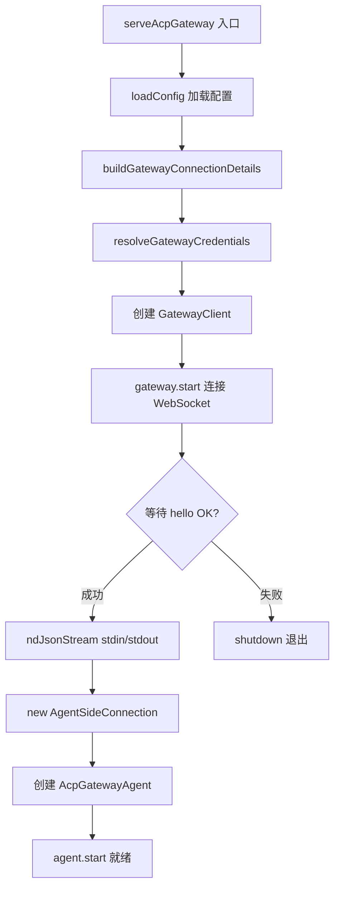
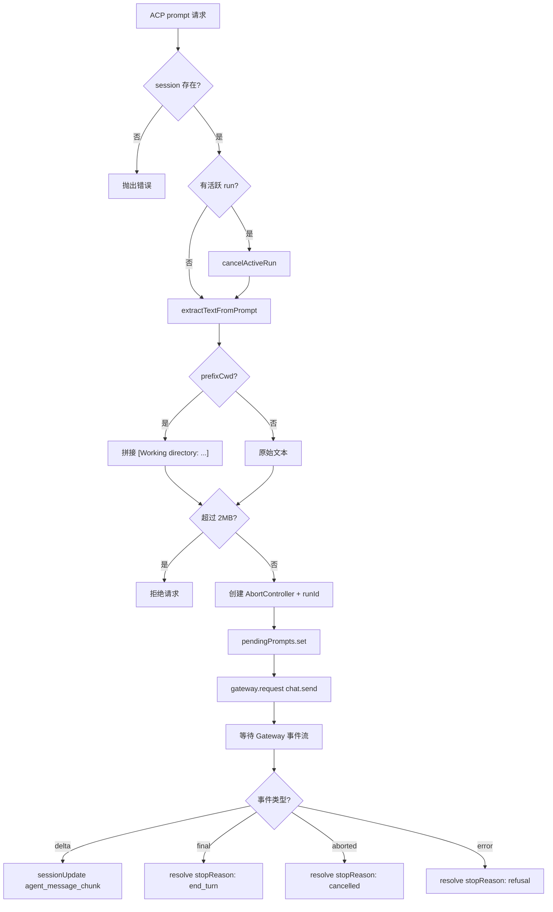
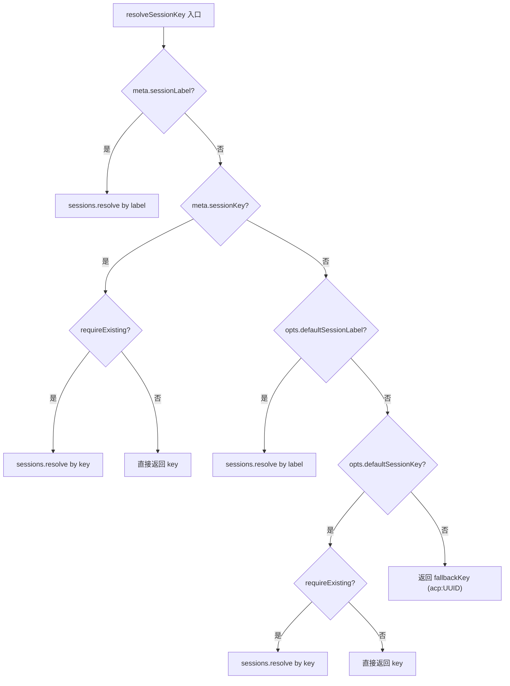

# PD-374.01 OpenClaw — ACP 协议翻译层与会话映射网关

> 文档编号：PD-374.01
> 来源：OpenClaw `src/acp/translator.ts`, `src/acp/server.ts`, `src/acp/session-mapper.ts`
> GitHub：https://github.com/openclaw/openclaw.git
> 问题域：PD-374 ACP协议适配 Agent Client Protocol Adaptation
> 状态：可复用方案

---

## 第 1 章 问题与动机

### 1.1 核心问题

Agent 系统通常有自己的内部通信协议（如 OpenClaw 的 Gateway WebSocket 协议），但外部 IDE 和客户端工具希望通过标准化的 Agent Client Protocol (ACP) 接入。这产生了两个核心矛盾：

1. **协议语义鸿沟**：ACP 定义了 `initialize`/`newSession`/`prompt`/`cancel` 等标准方法，而内部 Gateway 使用 `chat.send`/`chat.abort`/`sessions.resolve` 等自定义 RPC。两套协议的会话模型、消息格式、事件流完全不同。
2. **会话身份映射**：ACP 客户端用 UUID 标识会话（`sessionId`），Gateway 用业务语义键（`sessionKey`，如 `agent:main:main`）。同一个"会话"在两侧有不同的身份标识，需要双向映射且不能泄漏内部实现。
3. **安全边界**：外部 ACP 客户端不可信，需要速率限制、输入大小限制、凭证隔离等防御措施，而内部 Gateway 通信是可信的。

### 1.2 OpenClaw 的解法概述

OpenClaw 实现了一个完整的 ACP-to-Gateway 翻译层，核心设计：

1. **Translator 模式**：`AcpGatewayAgent` 类（`src/acp/translator.ts:64`）实现 ACP SDK 的 `Agent` 接口，将每个 ACP 方法翻译为对应的 Gateway RPC 调用
2. **双 ID 会话映射**：`session-mapper.ts` 负责将 ACP 的 `sessionId`（UUID）映射到 Gateway 的 `sessionKey`（业务键），支持按 key、label、fallback 三种解析路径
3. **ndJSON 流式通信**：`server.ts:117` 使用 ACP SDK 的 `ndJsonStream` 在 stdin/stdout 上建立双向 ndJSON 流，Gateway 侧使用 WebSocket
4. **内存会话存储 + LRU 淘汰**：`session.ts` 实现带 TTL 和容量上限的内存 session store，自动清理空闲会话
5. **分层安全防御**：固定窗口速率限制（`translator.ts:83-92`）+ 2MB prompt 大小限制（`translator.ts:44`）+ 凭证文件读取（`secret-file.ts`）

### 1.3 设计思想

| 设计原则 | 具体实现 | 理由 | 替代方案 |
|----------|----------|------|----------|
| 协议适配器模式 | `AcpGatewayAgent` 实现 `Agent` 接口，内部持有 `GatewayClient` | 将协议翻译逻辑集中在一个类中，ACP SDK 和 Gateway 各自独立演进 | 中间件链（更灵活但更复杂） |
| 双 ID 映射 | `sessionId`(UUID) ↔ `sessionKey`(业务键) 通过 `AcpSessionStore` 关联 | ACP 客户端不需要知道内部会话键的命名规则 | 统一 ID（破坏协议边界） |
| Promise 挂起模式 | `pendingPrompts` Map 存储未完成的 prompt Promise，Gateway 事件驱动 resolve | ACP prompt 是请求-响应模式，Gateway 是事件流模式，需要桥接 | 回调函数（更难管理生命周期） |
| 防御性输入验证 | 逐块字节计数 + 最终组装后二次检查（`translator.ts:264-274`） | 防止 DoS 攻击（CWE-400），在内存分配前拒绝超大输入 | 仅最终检查（已分配内存后才拒绝） |
| 固定窗口速率限制 | `createFixedWindowRateLimiter` 限制 session 创建频率 | 防止恶意客户端耗尽 session 资源 | 令牌桶（更平滑但实现更复杂） |

---

## 第 2 章 源码实现分析

### 2.1 架构概览

OpenClaw 的 ACP 适配层是一个经典的协议翻译网关，位于 ACP 客户端（IDE）和内部 Gateway 之间：

```
┌──────────────┐   ndJSON/stdio    ┌─────────────────────┐   WebSocket    ┌─────────────┐
│  ACP Client  │ ◄──────────────► │  AcpGatewayAgent    │ ◄────────────► │   Gateway    │
│  (IDE/CLI)   │                   │  (translator.ts)    │                │   Server     │
└──────────────┘                   │                     │                └─────────────┘
                                   │  ┌───────────────┐  │
                                   │  │ SessionStore   │  │
                                   │  │ (session.ts)   │  │
                                   │  └───────────────┘  │
                                   │  ┌───────────────┐  │
                                   │  │ SessionMapper  │  │
                                   │  │ (session-      │  │
                                   │  │  mapper.ts)    │  │
                                   │  └───────────────┘  │
                                   │  ┌───────────────┐  │
                                   │  │ EventMapper    │  │
                                   │  │ (event-        │  │
                                   │  │  mapper.ts)    │  │
                                   │  └───────────────┘  │
                                   │  ┌───────────────┐  │
                                   │  │ RateLimiter    │  │
                                   │  │ (fixed-window) │  │
                                   │  └───────────────┘  │
                                   └─────────────────────┘
```

关键组件职责：
- **AcpGatewayAgent**（translator.ts）：核心翻译器，实现 ACP `Agent` 接口的所有方法
- **SessionStore**（session.ts）：内存会话存储，管理 ACP sessionId ↔ Gateway sessionKey 映射
- **SessionMapper**（session-mapper.ts）：会话键解析，支持 key/label/fallback 三种路径
- **EventMapper**（event-mapper.ts）：Gateway 事件到 ACP 更新的格式转换
- **RateLimiter**（fixed-window-rate-limit.ts）：固定窗口速率限制器

### 2.2 核心实现

#### 2.2.1 ACP 服务启动与 ndJSON 流建立



对应源码 `src/acp/server.ts:15-126`：

```typescript
export async function serveAcpGateway(opts: AcpServerOptions = {}): Promise<void> {
  const cfg = loadConfig();
  const connection = buildGatewayConnectionDetails({ config: cfg, url: opts.gatewayUrl });
  const creds = resolveGatewayCredentialsFromConfig({ cfg, env: process.env, explicitAuth: {
    token: opts.gatewayToken, password: opts.gatewayPassword,
  }});

  // ... Gateway 连接建立 + 生命周期管理 ...

  gateway.start();
  await gatewayReady.catch((err) => { shutdown(); throw err; });

  // 关键：在 stdin/stdout 上建立 ndJSON 双向流
  const input = Writable.toWeb(process.stdout);
  const output = Readable.toWeb(process.stdin) as unknown as ReadableStream<Uint8Array>;
  const stream = ndJsonStream(input, output);

  new AgentSideConnection((conn: AgentSideConnection) => {
    agent = new AcpGatewayAgent(conn, gateway, opts);
    agent.start();
    return agent;
  }, stream);
}
```

注意 `server.ts:115-116` 中 stdin/stdout 的角色反转：`process.stdout` 作为 ACP 的输入（agent 写给客户端），`process.stdin` 作为 ACP 的输出（客户端写给 agent）。这是因为 ACP 协议从 agent 视角定义 I/O 方向。

#### 2.2.2 Prompt 翻译：ACP → Gateway → ACP 响应



对应源码 `src/acp/translator.ts:252-309`：

```typescript
async prompt(params: PromptRequest): Promise<PromptResponse> {
  const session = this.sessionStore.getSession(params.sessionId);
  if (!session) { throw new Error(`Session ${params.sessionId} not found`); }

  // 自动取消前一个未完成的 run
  if (session.abortController) { this.sessionStore.cancelActiveRun(params.sessionId); }

  const meta = parseSessionMeta(params._meta);
  // 逐块字节计数防 DoS（CWE-400）
  const userText = extractTextFromPrompt(params.prompt, MAX_PROMPT_BYTES);
  const attachments = extractAttachmentsFromPrompt(params.prompt);
  // prompt 前缀注入：自动添加工作目录上下文
  const prefixCwd = meta.prefixCwd ?? this.opts.prefixCwd ?? true;
  const displayCwd = shortenHomePath(session.cwd);
  const message = prefixCwd ? `[Working directory: ${displayCwd}]\n\n${userText}` : userText;

  const abortController = new AbortController();
  const runId = randomUUID();
  this.sessionStore.setActiveRun(params.sessionId, runId, abortController);

  return new Promise<PromptResponse>((resolve, reject) => {
    this.pendingPrompts.set(params.sessionId, {
      sessionId: params.sessionId, sessionKey: session.sessionKey,
      idempotencyKey: runId, resolve, reject,
    });
    this.gateway.request("chat.send", {
      sessionKey: session.sessionKey, message,
      attachments: attachments.length > 0 ? attachments : undefined,
      idempotencyKey: runId,
      thinking: readString(params._meta, ["thinking", "thinkingLevel"]),
    }, { expectFinal: true }).catch((err) => {
      this.pendingPrompts.delete(params.sessionId);
      this.sessionStore.clearActiveRun(params.sessionId);
      reject(err instanceof Error ? err : new Error(String(err)));
    });
  });
}
```

#### 2.2.3 会话键解析的三路径策略



对应源码 `src/acp/session-mapper.ts:27-85`：

```typescript
export async function resolveSessionKey(params: {
  meta: AcpSessionMeta; fallbackKey: string;
  gateway: GatewayClient; opts: AcpServerOptions;
}): Promise<string> {
  // 优先级：meta.sessionLabel > meta.sessionKey > opts.defaultSessionLabel > opts.defaultSessionKey > fallback
  if (params.meta.sessionLabel) {
    const resolved = await params.gateway.request<{ ok: true; key: string }>(
      "sessions.resolve", { label: params.meta.sessionLabel }
    );
    if (!resolved?.key) { throw new Error(`Unable to resolve session label: ${params.meta.sessionLabel}`); }
    return resolved.key;
  }
  if (params.meta.sessionKey) {
    if (!requireExisting) { return params.meta.sessionKey; }
    // ... validate existence via Gateway ...
  }
  // ... fallback chain continues ...
  return params.fallbackKey;
}
```

### 2.3 实现细节

**增量文本流式传输**：`handleDeltaEvent`（`translator.ts:435-462`）实现了一个巧妙的增量文本提取机制。Gateway 的 delta 事件携带的是累积全文（`fullText`），而 ACP 需要增量 chunk。通过 `sentTextLength` 记录已发送长度，每次只提取 `fullText.slice(sentSoFar)` 作为新增部分发送。

**工具调用事件翻译**：`handleAgentEvent`（`translator.ts:331-393`）将 Gateway 的 `agent.tool` 事件翻译为 ACP 的 `tool_call`/`tool_call_update` 更新。使用 `toolCalls` Set 去重，防止同一个 toolCallId 被重复报告。`inferToolKind`（`event-mapper.ts:127-154`）通过工具名称的关键词匹配推断工具类型（read/edit/delete/search/execute/fetch）。

**内存会话存储的 LRU 淘汰**：`session.ts:48-78` 实现了双重淘汰策略——先按 TTL 清理过期空闲会话（`reapIdleSessions`），若仍超容量则淘汰最老的空闲会话（`evictOldestIdleSession`）。活跃会话（有 `activeRunId`）永远不会被淘汰。

**Gateway 断连处理**：`handleGatewayDisconnect`（`translator.ts:103-110`）在 Gateway 断连时，遍历所有 pending prompts 并 reject，同时清理 session 的 activeRun 状态，确保 ACP 客户端不会永久挂起。


---

## 第 3 章 迁移指南

### 3.1 迁移清单

**阶段 1：协议翻译器骨架**
- [ ] 安装 `@agentclientprotocol/sdk`，实现 `Agent` 接口
- [ ] 创建 Translator 类，持有内部系统客户端引用
- [ ] 实现 `initialize` 返回 agent 能力声明
- [ ] 实现 `newSession`/`loadSession` 创建会话映射

**阶段 2：会话映射层**
- [ ] 设计内部会话键的命名规则（如 `acp:{uuid}`）
- [ ] 实现 `SessionStore` 接口（create/get/has/clear）
- [ ] 添加 TTL 淘汰和容量上限保护
- [ ] 实现 `resolveSessionKey` 多路径解析（key → label → fallback）

**阶段 3：消息翻译与流式传输**
- [ ] 实现 `prompt` 方法：ACP ContentBlock → 内部消息格式
- [ ] 实现 `pendingPrompts` Map 桥接请求-响应与事件流
- [ ] 实现增量文本提取（累积全文 → 增量 chunk）
- [ ] 实现工具调用事件翻译（内部事件 → ACP tool_call 更新）

**阶段 4：安全加固**
- [ ] 添加 prompt 大小限制（逐块计数 + 最终检查）
- [ ] 添加 session 创建速率限制
- [ ] 实现凭证文件读取（避免命令行暴露密码）
- [ ] 添加 Gateway 断连时的 pending prompt 清理

### 3.2 适配代码模板

以下是一个可直接复用的 ACP 协议翻译器骨架（TypeScript）：

```typescript
import { randomUUID } from "node:crypto";
import type {
  Agent, AgentSideConnection, InitializeRequest, InitializeResponse,
  NewSessionRequest, NewSessionResponse, PromptRequest, PromptResponse,
  CancelNotification, StopReason,
} from "@agentclientprotocol/sdk";
import { PROTOCOL_VERSION } from "@agentclientprotocol/sdk";

type PendingPrompt = {
  sessionId: string;
  internalKey: string;
  resolve: (response: PromptResponse) => void;
  reject: (err: Error) => void;
  sentTextLength: number;
};

type SessionEntry = {
  sessionId: string;       // ACP 侧 UUID
  internalKey: string;     // 内部系统的会话标识
  cwd: string;
  createdAt: number;
};

export class MyAcpAgent implements Agent {
  private connection: AgentSideConnection;
  private internalClient: YourInternalClient;
  private sessions = new Map<string, SessionEntry>();
  private pendingPrompts = new Map<string, PendingPrompt>();

  constructor(connection: AgentSideConnection, client: YourInternalClient) {
    this.connection = connection;
    this.internalClient = client;
  }

  start(): void { /* ready */ }

  async initialize(_params: InitializeRequest): Promise<InitializeResponse> {
    return {
      protocolVersion: PROTOCOL_VERSION,
      agentCapabilities: {
        loadSession: true,
        promptCapabilities: { image: true, audio: false, embeddedContext: true },
        mcpCapabilities: { http: false, sse: false },
      },
      agentInfo: { name: "my-agent", title: "My ACP Agent", version: "1.0.0" },
      authMethods: [],
    };
  }

  async newSession(params: NewSessionRequest): Promise<NewSessionResponse> {
    const sessionId = randomUUID();
    const internalKey = `acp:${sessionId}`;
    this.sessions.set(sessionId, {
      sessionId, internalKey, cwd: params.cwd, createdAt: Date.now(),
    });
    return { sessionId };
  }

  async prompt(params: PromptRequest): Promise<PromptResponse> {
    const session = this.sessions.get(params.sessionId);
    if (!session) throw new Error(`Session not found: ${params.sessionId}`);

    const text = params.prompt
      .filter((b) => b.type === "text")
      .map((b) => (b as { text: string }).text)
      .join("\n");

    return new Promise<PromptResponse>((resolve, reject) => {
      this.pendingPrompts.set(params.sessionId, {
        sessionId: params.sessionId,
        internalKey: session.internalKey,
        resolve, reject, sentTextLength: 0,
      });
      // 发送到内部系统，通过事件回调 resolve
      this.internalClient.send(session.internalKey, text).catch((err) => {
        this.pendingPrompts.delete(params.sessionId);
        reject(err instanceof Error ? err : new Error(String(err)));
      });
    });
  }

  // 内部系统事件回调
  async handleInternalEvent(internalKey: string, event: InternalEvent): void {
    const pending = this.findPendingByKey(internalKey);
    if (!pending) return;

    if (event.type === "delta") {
      const newText = event.fullText.slice(pending.sentTextLength);
      pending.sentTextLength = event.fullText.length;
      await this.connection.sessionUpdate({
        sessionId: pending.sessionId,
        update: { sessionUpdate: "agent_message_chunk", content: { type: "text", text: newText } },
      });
    } else if (event.type === "done") {
      this.pendingPrompts.delete(pending.sessionId);
      pending.resolve({ stopReason: "end_turn" });
    }
  }

  private findPendingByKey(key: string): PendingPrompt | undefined {
    for (const p of this.pendingPrompts.values()) {
      if (p.internalKey === key) return p;
    }
    return undefined;
  }
}
```

### 3.3 适用场景

| 场景 | 适用度 | 说明 |
|------|--------|------|
| 已有 Agent 系统需要接入 IDE（VS Code/JetBrains） | ⭐⭐⭐ | ACP 是 IDE 集成的标准协议，翻译层是最低侵入方案 |
| 多协议网关（同时支持 ACP + REST + WebSocket） | ⭐⭐⭐ | Translator 模式天然支持多协议适配，每个协议一个 Agent 实现 |
| 内部系统使用事件流，外部需要请求-响应 | ⭐⭐⭐ | Promise 挂起 + 事件驱动 resolve 是桥接两种模式的标准做法 |
| 需要会话隔离的多租户场景 | ⭐⭐ | 双 ID 映射提供了天然的隔离边界，但需要额外的租户标识 |
| 简单的单会话 CLI 工具 | ⭐ | 过度设计，直接实现 ACP 接口即可 |

---

## 第 4 章 测试用例

```typescript
import { describe, it, expect, beforeEach, vi } from "vitest";
import { createInMemorySessionStore, type AcpSessionStore } from "./session";
import { parseSessionMeta } from "./session-mapper";
import { extractTextFromPrompt, inferToolKind, formatToolTitle } from "./event-mapper";
import { createFixedWindowRateLimiter } from "../infra/fixed-window-rate-limit";

describe("AcpSessionStore", () => {
  let store: AcpSessionStore;

  beforeEach(() => {
    store = createInMemorySessionStore({ maxSessions: 3, idleTtlMs: 1000 });
  });

  it("should create and retrieve sessions", () => {
    const session = store.createSession({ sessionKey: "test:key", cwd: "/tmp" });
    expect(session.sessionId).toBeTruthy();
    expect(store.hasSession(session.sessionId)).toBe(true);
    expect(store.getSession(session.sessionId)?.sessionKey).toBe("test:key");
  });

  it("should update existing session on duplicate sessionId", () => {
    const s1 = store.createSession({ sessionId: "s1", sessionKey: "key1", cwd: "/a" });
    const s2 = store.createSession({ sessionId: "s1", sessionKey: "key2", cwd: "/b" });
    expect(s2.sessionKey).toBe("key2");
    expect(s2.cwd).toBe("/b");
  });

  it("should evict oldest idle session when at capacity", () => {
    store.createSession({ sessionId: "s1", sessionKey: "k1", cwd: "/" });
    store.createSession({ sessionId: "s2", sessionKey: "k2", cwd: "/" });
    store.createSession({ sessionId: "s3", sessionKey: "k3", cwd: "/" });
    // s1 is oldest, should be evicted
    store.createSession({ sessionId: "s4", sessionKey: "k4", cwd: "/" });
    expect(store.hasSession("s1")).toBe(false);
    expect(store.hasSession("s4")).toBe(true);
  });

  it("should not evict sessions with active runs", () => {
    store.createSession({ sessionId: "s1", sessionKey: "k1", cwd: "/" });
    store.setActiveRun("s1", "run1", new AbortController());
    store.createSession({ sessionId: "s2", sessionKey: "k2", cwd: "/" });
    store.createSession({ sessionId: "s3", sessionKey: "k3", cwd: "/" });
    // s1 has active run, s2 should be evicted instead
    store.createSession({ sessionId: "s4", sessionKey: "k4", cwd: "/" });
    expect(store.hasSession("s1")).toBe(true);
    expect(store.hasSession("s2")).toBe(false);
  });

  it("should cancel active run and abort controller", () => {
    store.createSession({ sessionId: "s1", sessionKey: "k1", cwd: "/" });
    const ac = new AbortController();
    store.setActiveRun("s1", "run1", ac);
    const cancelled = store.cancelActiveRun("s1");
    expect(cancelled).toBe(true);
    expect(ac.signal.aborted).toBe(true);
    expect(store.getSession("s1")?.activeRunId).toBeNull();
  });
});

describe("parseSessionMeta", () => {
  it("should parse all meta fields", () => {
    const meta = parseSessionMeta({
      sessionKey: "agent:main", sessionLabel: "My Session",
      resetSession: true, requireExisting: false, prefixCwd: true,
    });
    expect(meta.sessionKey).toBe("agent:main");
    expect(meta.sessionLabel).toBe("My Session");
    expect(meta.resetSession).toBe(true);
    expect(meta.prefixCwd).toBe(true);
  });

  it("should handle null/undefined meta gracefully", () => {
    expect(parseSessionMeta(null)).toEqual({});
    expect(parseSessionMeta(undefined)).toEqual({});
  });

  it("should support alias keys", () => {
    const meta = parseSessionMeta({ key: "k1", label: "l1", reset: true });
    expect(meta.sessionKey).toBe("k1");
    expect(meta.sessionLabel).toBe("l1");
    expect(meta.resetSession).toBe(true);
  });
});

describe("extractTextFromPrompt", () => {
  it("should extract text from text blocks", () => {
    const result = extractTextFromPrompt([
      { type: "text", text: "Hello" },
      { type: "text", text: "World" },
    ] as any);
    expect(result).toBe("Hello\nWorld");
  });

  it("should reject oversized prompts block-by-block", () => {
    const bigText = "x".repeat(1024);
    expect(() => extractTextFromPrompt(
      [{ type: "text", text: bigText }] as any, 100
    )).toThrow("exceeds maximum allowed size");
  });

  it("should extract text from resource blocks", () => {
    const result = extractTextFromPrompt([
      { type: "resource", resource: { text: "resource content" } },
    ] as any);
    expect(result).toBe("resource content");
  });
});

describe("inferToolKind", () => {
  it("should infer read tools", () => { expect(inferToolKind("readFile")).toBe("read"); });
  it("should infer edit tools", () => { expect(inferToolKind("writeFile")).toBe("edit"); });
  it("should infer execute tools", () => { expect(inferToolKind("bash")).toBe("execute"); });
  it("should default to other", () => { expect(inferToolKind("unknown")).toBe("other"); });
  it("should handle undefined", () => { expect(inferToolKind(undefined)).toBe("other"); });
});

describe("FixedWindowRateLimiter", () => {
  it("should allow requests within limit", () => {
    const limiter = createFixedWindowRateLimiter({ maxRequests: 3, windowMs: 10000 });
    expect(limiter.consume().allowed).toBe(true);
    expect(limiter.consume().allowed).toBe(true);
    expect(limiter.consume().allowed).toBe(true);
    expect(limiter.consume().allowed).toBe(false);
  });

  it("should reset after window expires", () => {
    let now = 0;
    const limiter = createFixedWindowRateLimiter({ maxRequests: 1, windowMs: 1000, now: () => now });
    expect(limiter.consume().allowed).toBe(true);
    expect(limiter.consume().allowed).toBe(false);
    now = 1001;
    expect(limiter.consume().allowed).toBe(true);
  });

  it("should report retryAfterMs", () => {
    let now = 0;
    const limiter = createFixedWindowRateLimiter({ maxRequests: 1, windowMs: 5000, now: () => now });
    limiter.consume();
    now = 2000;
    const result = limiter.consume();
    expect(result.allowed).toBe(false);
    expect(result.retryAfterMs).toBe(3000);
  });
});

describe("formatToolTitle", () => {
  it("should format tool with args", () => {
    expect(formatToolTitle("read", { path: "/tmp/file.ts" })).toBe("read: path: /tmp/file.ts");
  });

  it("should truncate long arg values", () => {
    const longVal = "x".repeat(200);
    const result = formatToolTitle("tool", { arg: longVal });
    expect(result).toContain("...");
    expect(result.length).toBeLessThan(200);
  });

  it("should handle no args", () => {
    expect(formatToolTitle("tool", undefined)).toBe("tool");
    expect(formatToolTitle(undefined, undefined)).toBe("tool");
  });
});
```


---

## 第 5 章 跨域关联

| 关联域 | 关系类型 | 说明 |
|--------|----------|------|
| PD-01 上下文管理 | 协同 | prompt 前缀注入 `[Working directory: ...]` 是上下文管理的一种形式；`extractTextFromPrompt` 的 2MB 限制也是上下文窗口保护 |
| PD-03 容错与重试 | 依赖 | Gateway 断连时的 pending prompt 清理、`handleGatewayDisconnect` 的全量 reject 是容错设计；速率限制的 `retryAfterMs` 提示客户端重试时机 |
| PD-04 工具系统 | 协同 | `handleAgentEvent` 将 Gateway 的工具调用事件翻译为 ACP 的 `tool_call` 更新；`inferToolKind` 和 `formatToolTitle` 是工具元数据的标准化 |
| PD-06 记忆持久化 | 协同 | `SessionStore` 的内存存储 + TTL 淘汰是会话记忆的短期持久化；`loadSession` 支持恢复已有会话 |
| PD-09 Human-in-the-Loop | 协同 | `cancel` 方法和 `AbortController` 机制允许用户中断正在执行的 prompt；`setSessionMode` 允许动态调整 thinking level |
| PD-10 中间件管道 | 互补 | ACP 翻译层本身可以看作一个协议级中间件，位于 ACP 客户端和 Gateway 之间；`getAvailableCommands` 暴露的命令列表类似中间件的能力声明 |
| PD-11 可观测性 | 依赖 | `this.log` 的 verbose 日志输出到 stderr 是基础可观测性；`idempotencyKey` 和 `runId` 提供了请求追踪的关联 ID |

---

## 第 6 章 来源文件索引

| 文件 | 行范围 | 关键实现 |
|------|--------|----------|
| `src/acp/translator.ts` | L1-498 | `AcpGatewayAgent` 核心翻译器，实现 ACP `Agent` 接口全部方法 |
| `src/acp/translator.ts` | L64-93 | 构造函数：注入 Gateway 客户端、SessionStore、速率限制器 |
| `src/acp/translator.ts` | L122-143 | `initialize`：返回协议版本和 agent 能力声明 |
| `src/acp/translator.ts` | L145-174 | `newSession`：创建会话映射 + 速率限制检查 |
| `src/acp/translator.ts` | L252-309 | `prompt`：核心翻译逻辑，ACP prompt → Gateway chat.send |
| `src/acp/translator.ts` | L331-393 | `handleAgentEvent`：工具调用事件翻译 |
| `src/acp/translator.ts` | L395-433 | `handleChatEvent`：聊天事件翻译（delta/final/aborted/error） |
| `src/acp/translator.ts` | L435-462 | `handleDeltaEvent`：增量文本提取与流式推送 |
| `src/acp/translator.ts` | L489-497 | `enforceSessionCreateRateLimit`：速率限制执行 |
| `src/acp/server.ts` | L15-126 | `serveAcpGateway`：服务启动入口，ndJSON 流建立 |
| `src/acp/server.ts` | L115-123 | stdin/stdout ndJSON 流 + AgentSideConnection 创建 |
| `src/acp/server.ts` | L90-100 | `shutdown`：优雅关闭，SIGINT/SIGTERM 处理 |
| `src/acp/session-mapper.ts` | L13-25 | `parseSessionMeta`：从 `_meta` 提取会话元数据，支持别名键 |
| `src/acp/session-mapper.ts` | L27-85 | `resolveSessionKey`：三路径会话键解析（label → key → fallback） |
| `src/acp/session-mapper.ts` | L87-98 | `resetSessionIfNeeded`：条件性会话重置 |
| `src/acp/session.ts` | L24-188 | `createInMemorySessionStore`：内存会话存储 + LRU 淘汰 |
| `src/acp/session.ts` | L48-78 | TTL 淘汰 + 最老空闲会话驱逐 |
| `src/acp/event-mapper.ts` | L59-90 | `extractTextFromPrompt`：逐块字节计数的安全文本提取 |
| `src/acp/event-mapper.ts` | L92-109 | `extractAttachmentsFromPrompt`：图片附件提取 |
| `src/acp/event-mapper.ts` | L127-154 | `inferToolKind`：工具名称 → 工具类型推断 |
| `src/acp/types.ts` | L1-35 | `AcpSession`/`AcpServerOptions` 类型定义 + agent info |
| `src/acp/meta.ts` | L1-47 | `readString`/`readBool`/`readNumber`：安全的 meta 字段读取 |
| `src/acp/commands.ts` | L1-40 | `getAvailableCommands`：ACP 可用命令列表 |
| `src/acp/secret-file.ts` | L1-22 | `readSecretFromFile`：凭证文件安全读取 |
| `src/infra/fixed-window-rate-limit.ts` | L10-48 | `createFixedWindowRateLimiter`：固定窗口速率限制器 |

---

## 第 7 章 横向对比维度

```json comparison_data
{
  "project": "OpenClaw",
  "dimensions": {
    "协议翻译架构": "Translator 类实现 ACP Agent 接口，内部持有 GatewayClient 做 RPC 转发",
    "会话映射": "双 ID 映射（UUID ↔ 业务键），三路径解析（label → key → fallback）",
    "速率限制": "固定窗口限流器，120 次/10s，仅限 session 创建",
    "流式通信": "ndJSON over stdin/stdout，增量文本提取（累积全文 slice 差量）",
    "输入防御": "逐块字节计数 + 最终组装二次检查，2MB 上限（CWE-400）",
    "会话生命周期": "内存 LRU 存储，5000 上限 + 24h TTL，活跃 run 不淘汰",
    "工具事件翻译": "inferToolKind 关键词匹配推断工具类型，toolCallId Set 去重"
  }
}
```

### 域元数据补充

```json domain_metadata
{
  "solution_summary": "OpenClaw 用 AcpGatewayAgent 翻译器将 ACP 标准协议映射到内部 Gateway WebSocket RPC，通过双 ID 会话映射、ndJSON 流式通信和逐块字节计数输入防御实现安全接入",
  "description": "标准 Agent 协议与内部系统的双向翻译网关设计",
  "sub_problems": [
    "增量文本流提取（累积全文到差量 chunk 转换）",
    "Gateway 断连时的 pending promise 批量清理",
    "内存会话 LRU 淘汰与活跃 run 保护"
  ],
  "best_practices": [
    "逐块字节计数防 DoS，在内存分配前拒绝超大输入",
    "idempotencyKey 关联 ACP prompt 与 Gateway run 防重复",
    "凭证文件读取替代命令行参数防进程列表泄露"
  ]
}
```

