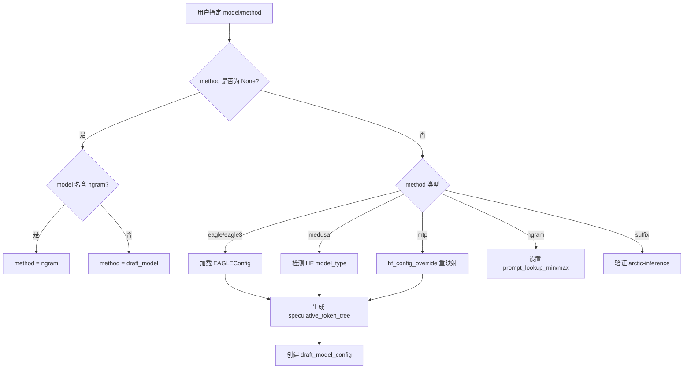
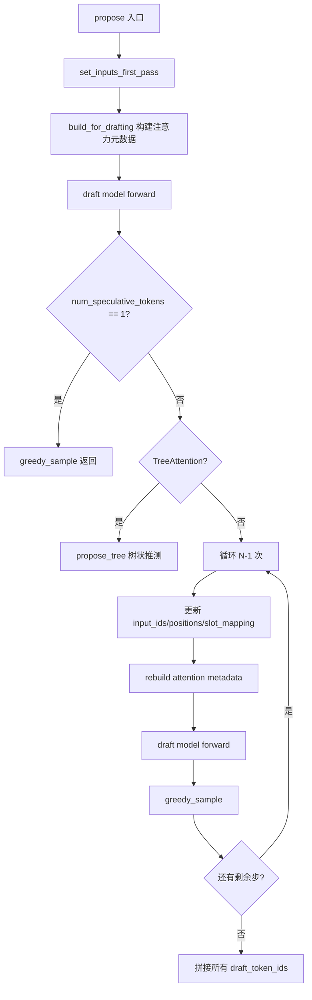
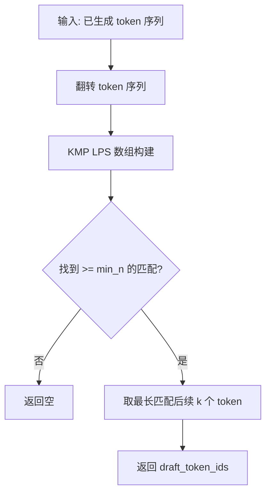

# PD-375.01 vLLM — 多方法推测解码统一框架

> 文档编号：PD-375.01
> 来源：vLLM `vllm/v1/spec_decode/`, `vllm/config/speculative.py`
> GitHub：https://github.com/vllm-project/vllm.git
> 问题域：PD-375 推测解码 Speculative Decoding
> 状态：可复用方案

---

## 第 1 章 问题与动机（≥ 30 行）

### 1.1 核心问题

自回归 LLM 推理的根本瓶颈在于**内存带宽受限**（memory-bound）：每生成一个 token 都需要完整加载模型权重，GPU 算力严重闲置。推测解码（Speculative Decoding）通过"先猜后验"的方式，用一个轻量级草稿模型（或无模型方法）一次性生成多个候选 token，再由目标模型并行验证，从而将多次串行推理压缩为一次并行验证，在不改变输出分布的前提下实现 2-3x 加速。

核心挑战在于：
1. **方法多样性**：EAGLE、EAGLE3、Medusa、N-gram、MLP Speculator、Suffix Decoding、MTP（Multi-Token Prediction）等方法各有适用场景，需要统一调度框架
2. **GPU 资源协同**：草稿模型与目标模型共享 GPU 内存和 KV Cache，需要精细的 slot 管理和权重共享
3. **树状推测**：从线性链式推测扩展到树状推测（tree speculation），需要专用的注意力机制和 top-k 分支采样
4. **可观测性**：接受率（acceptance rate）是推测解码的核心指标，需要逐位置追踪并暴露给 Prometheus

### 1.2 vLLM 的解法概述

vLLM 在 v1 引擎中实现了一套完整的推测解码框架，核心设计：

1. **统一 Proposer 接口**：所有推测方法（EAGLE/Medusa/N-gram/Suffix/DraftModel）实现统一的 `propose()` 接口，由 `SpeculativeConfig.method` 字段路由选择（`vllm/config/speculative.py:49-56`）
2. **SpecDecodeBaseProposer 基类**：1700+ 行的核心基类，封装了 CUDA Graph 管理、持久化 GPU Buffer、注意力元数据构建、slot mapping 计算等通用逻辑（`vllm/v1/spec_decode/eagle.py:60-1704`）
3. **权重共享机制**：EAGLE/MTP 方法通过 `_maybe_share_embeddings()` 和 `_maybe_share_lm_head()` 与目标模型共享 embedding 和 lm_head 层，节省 GPU 显存（`eagle.py:320-340`）
4. **树状推测支持**：`propose_tree()` 方法实现逐层 top-k 分支采样 + TreeAttentionMetadata 构建，支持任意树结构配置（`eagle.py:989-1160`）
5. **三层可观测性**：`SpecDecodingStats`（单步）→ `SpecDecodingLogging`（聚合日志）→ `SpecDecodingProm`（Prometheus 计数器），逐位置追踪接受率（`metrics.py:16-225`）

### 1.3 设计思想

| 设计原则 | 具体实现 | 理由 | 替代方案 |
|----------|----------|------|----------|
| 策略模式统一接口 | 所有 Proposer 实现 `propose()` + `load_model()`，由 config.method 路由 | 新增推测方法只需实现接口，不改调度逻辑 | 硬编码 if-else 分支 |
| 继承 + 组合复用 | EAGLE/DraftModel/Medusa 继承 BaseProposer；N-gram/Suffix 独立实现 | GPU 密集型方法共享 CUDA Graph/Buffer 管理；CPU 方法无需这些开销 | 全部独立实现 |
| 持久化 GPU Buffer | `input_ids`/`positions`/`hidden_states` 预分配为 max_num_tokens 大小 | 避免每步动态分配，兼容 CUDA Graph capture | 动态 tensor 分配 |
| Triton 内核加速 | `eagle_prepare_inputs_padded_kernel` 等 Triton JIT 内核处理 slot 映射 | 批量 slot 计算在 GPU 上并行执行，避免 CPU-GPU 同步 | Python 循环 + CPU 计算 |
| 配置驱动自动检测 | `SpeculativeConfig.__post_init__` 从模型名/HF config 自动推断 method | 用户只需指定模型名，无需手动选择方法 | 强制用户指定 method |

---

## 第 2 章 源码实现分析（≥ 60 行，核心章节）

### 2.1 架构概览

vLLM 推测解码的整体架构分为三层：配置层、提议层、验证层。

```
┌─────────────────────────────────────────────────────────────────┐
│                    SpeculativeConfig                            │
│  method: eagle|eagle3|medusa|ngram|suffix|draft_model|mtp       │
│  num_speculative_tokens / speculative_token_tree                │
│  draft_model_config / draft_parallel_config                     │
└──────────────────────────┬──────────────────────────────────────┘
                           │ 路由选择
        ┌──────────────────┼──────────────────────┐
        ▼                  ▼                      ▼
┌───────────────┐  ┌───────────────┐  ┌────────────────────┐
│ GPU Proposers │  │ CPU Proposers │  │  Hybrid Proposers  │
│               │  │               │  │                    │
│ EagleProposer │  │ NgramProposer │  │ SuffixDecoding     │
│ DraftModel    │  │ (Numba JIT)   │  │ Proposer           │
│ Proposer      │  │               │  │ (Arctic Inference)  │
│ MedusaProposer│  │               │  │                    │
└───────┬───────┘  └───────────────┘  └────────────────────┘
        │
        ▼
┌───────────────────────────────────────────────────────────────┐
│              SpecDecodeBaseProposer (eagle.py)                 │
│  ┌─────────────┐ ┌──────────────┐ ┌────────────────────────┐ │
│  │ CUDA Graph  │ │ Persistent   │ │ Attention Metadata     │ │
│  │ Dispatcher  │ │ GPU Buffers  │ │ Builder (Tree/Linear)  │ │
│  └─────────────┘ └──────────────┘ └────────────────────────┘ │
│  ┌─────────────┐ ┌──────────────┐ ┌────────────────────────┐ │
│  │ Weight      │ │ Triton       │ │ Slot Mapping           │ │
│  │ Sharing     │ │ Kernels      │ │ Computation            │ │
│  └─────────────┘ └──────────────┘ └────────────────────────┘ │
└───────────────────────────┬───────────────────────────────────┘
                            ▼
┌───────────────────────────────────────────────────────────────┐
│              Verification & Metrics                            │
│  RejectionSampler → SpecDecodingStats → Prometheus Counters   │
└───────────────────────────────────────────────────────────────┘
```

### 2.2 核心实现

#### 2.2.1 SpeculativeConfig — 配置驱动的方法路由



对应源码 `vllm/config/speculative.py:59-563`：

```python
@config
class SpeculativeConfig:
    """Configuration for speculative decoding."""
    num_speculative_tokens: int = Field(default=None, gt=0)
    model: str | None = None
    method: SpeculativeMethod | None = None
    # ...

    def __post_init__(self):
        # 自动推断 method
        if self.method is None:
            if self.model in ("ngram", "[ngram]"):
                self.method = "ngram"
            else:
                self.method = "draft_model"

        # MTP 类型统一归并
        if self.method in get_args(MTPModelTypes) and self.method != "mtp":
            self.method = "mtp"

        # 生成 token tree（线性链或自定义树）
        if self.speculative_token_tree is None:
            self.speculative_token_tree = str(
                [(i + 1) * (0,) for i in range(self.num_speculative_tokens)]
            )
        else:
            tree_choices = ast.literal_eval(self.speculative_token_tree)
            self.speculative_token_tree = str(
                sorted(tree_choices, key=lambda t: (len(t), t))
            )
```

关键设计：`SpeculativeMethod` 是一个 `Literal` 联合类型（`speculative.py:49-56`），涵盖 `ngram | medusa | mlp_speculator | draft_model | suffix | eagle | eagle3 | 14种MTP类型`。`hf_config_override` 静态方法（`speculative.py:190-313`）将 DeepSeek V3、MiMo、GLM4、Ernie、Qwen3 等模型的 HF config 重映射为统一的 MTP 架构名。

#### 2.2.2 SpecDecodeBaseProposer.propose() — 核心推测循环



对应源码 `vllm/v1/spec_decode/eagle.py:381-569`：

```python
def propose(
    self,
    target_token_ids: torch.Tensor,
    target_positions: torch.Tensor,
    target_hidden_states: torch.Tensor,
    next_token_ids: torch.Tensor,
    token_indices_to_sample: torch.Tensor | None,
    common_attn_metadata: CommonAttentionMetadata,
    sampling_metadata: SamplingMetadata,
    # ...
) -> torch.Tensor:
    batch_size = common_attn_metadata.batch_size()

    # EAGLE3 特殊处理：合并中间隐藏状态
    if self.method == "eagle3":
        target_hidden_states = self.model.combine_hidden_states(
            target_hidden_states
        )

    # 第一步：设置输入（处理 rejected tokens、slot mapping）
    num_tokens, token_indices_to_sample, common_attn_metadata = (
        self.set_inputs_first_pass(...)
    )

    # 构建注意力元数据
    attn_metadata = attn_metadata_builder.build_for_drafting(
        common_attn_metadata=common_attn_metadata, draft_index=0
    )

    # 第一次 forward
    with set_forward_context(per_layer_attn_metadata, ...):
        ret_hidden_states = self.model(**model_kwargs)

    # 单步推测或并行草稿：直接返回
    if self.num_speculative_tokens == 1 or self.parallel_drafting:
        draft_token_ids = self._greedy_sample(sample_hidden_states)
        return draft_token_ids.view(-1, self.num_speculative_tokens)

    # 树状推测分支
    if isinstance(attn_metadata, TreeAttentionMetadata):
        return torch.cat(self.propose_tree(...), dim=1)

    # 多步串行推测
    for token_index in range(self.num_speculative_tokens - 1):
        # 更新 input_ids, positions, slot_mapping
        # rebuild attention metadata
        # draft model forward
        # greedy sample
        draft_token_ids_list.append(draft_token_ids)
```

#### 2.2.3 NgramProposer — 无模型 KMP 匹配加速



对应源码 `vllm/v1/spec_decode/ngram_proposer.py:198-285`：

```python
@jit(nopython=True)
def _find_longest_matched_ngram_and_propose_tokens(
    origin_tokens: np.ndarray,
    min_ngram: int, max_ngram: int,
    max_model_len: int, k: int,
) -> np.ndarray:
    # 翻转 token 序列，将后缀匹配转化为前缀匹配
    tokens = origin_tokens[::-1]
    lps = np.zeros(max_ngram, dtype=np.int32)

    longest_ngram = 0
    position = 0
    prev_lps = 0
    i = 1
    while i < total_token:
        if tokens[prev_lps] == tokens[i]:
            prev_lps += 1
            if prev_lps >= longest_ngram:
                longest_ngram = prev_lps
                position = i
            # 限制匹配长度不超过 max_ngram
            if prev_lps == max_ngram:
                prev_lps = lps[max_ngram - 1]
            i += 1
        elif prev_lps != 0:
            prev_lps = lps[prev_lps - 1]
        else:
            i += 1

    start_position = total_token - 1 - position + longest_ngram
    return origin_tokens[start_position : start_position + k]
```

核心技巧：将 n-gram 后缀匹配问题转化为翻转序列上的前缀匹配，复用 KMP 的 LPS（Longest Prefix Suffix）数组，时间复杂度 O(n)。批量处理通过 Numba `@njit(parallel=True)` + `prange` 实现多请求并行（`ngram_proposer.py:169-195`）。

### 2.3 实现细节

**权重共享机制**：EAGLE/MTP 方法的草稿模型通常与目标模型共享 embedding 层和 lm_head 层。`SpecDecodeBaseProposer` 在 `load_model()` 中调用 `_maybe_share_embeddings()` 和 `_maybe_share_lm_head()`，通过检查参数形状是否匹配来决定是否共享。`DraftModelProposer` 覆写这两个方法为空操作（`draft_model.py:68-75`），因为独立草稿模型有自己的权重。

**并行草稿（Parallel Drafting）**：当 `parallel_drafting=True` 时，所有推测 token 在单次 forward 中并行生成。通过 Triton 内核 `copy_and_expand_eagle_inputs_kernel`（`utils.py:210-357`）将输入扩展为 `[valid_tokens + bonus_token + padding_slots + rejected_slots]` 的布局，padding 位置填充 `parallel_drafting_token_id`（从 HF config 的 `pard_token` 字段读取）。

**三层指标体系**：
- `SpecDecodingStats`（`metrics.py:16-44`）：单步统计，记录 `num_drafts`、`num_draft_tokens`、`num_accepted_tokens`、逐位置接受数
- `SpecDecodingLogging`（`metrics.py:47-117`）：聚合多步统计，定期输出平均接受长度、吞吐量、逐位置接受率
- `SpecDecodingProm`（`metrics.py:120-214`）：Prometheus 计数器，支持 PromQL 查询接受率和平均接受长度

---

## 第 3 章 迁移指南（≥ 40 行）

### 3.1 迁移清单

**阶段 1：核心框架（必须）**

- [ ] 定义 `SpeculativeConfig` 配置类，包含 `method`、`num_speculative_tokens`、`speculative_token_tree` 字段
- [ ] 实现 `ProposerInterface`（`propose()` + `load_model()` 方法签名）
- [ ] 实现至少一种 Proposer（推荐从 NgramProposer 开始，无需额外模型）
- [ ] 实现 rejection sampling 验证逻辑
- [ ] 集成 `SpecDecodingStats` 指标收集

**阶段 2：GPU 加速（高性能场景）**

- [ ] 实现 `SpecDecodeBaseProposer` 基类，包含持久化 GPU Buffer 管理
- [ ] 集成 CUDA Graph 支持（PIECEWISE 模式）
- [ ] 实现权重共享机制（embedding + lm_head）
- [ ] 添加 Triton 内核处理 slot mapping 和输入准备

**阶段 3：高级特性（可选）**

- [ ] 树状推测支持（`speculative_token_tree` 配置 + TreeAttentionMetadata）
- [ ] 并行草稿支持（`parallel_drafting` 模式）
- [ ] Prometheus 指标暴露
- [ ] 多种 MTP 模型类型的 HF config 重映射

### 3.2 适配代码模板

以下是一个最小可运行的推测解码框架模板：

```python
from dataclasses import dataclass, field
from typing import Protocol
import torch
import numpy as np


# --- 配置 ---
@dataclass
class SpecDecodeConfig:
    method: str = "ngram"  # ngram | eagle | draft_model
    num_speculative_tokens: int = 5
    prompt_lookup_min: int = 5
    prompt_lookup_max: int = 5


# --- Proposer 接口 ---
class Proposer(Protocol):
    def propose(self, context_tokens: torch.Tensor, **kwargs) -> torch.Tensor:
        """返回 [batch_size, num_spec_tokens] 的草稿 token ids"""
        ...

    def load_model(self, target_model) -> None: ...


# --- N-gram Proposer（无模型，可直接使用）---
class SimpleNgramProposer:
    def __init__(self, config: SpecDecodeConfig):
        self.min_n = config.prompt_lookup_min
        self.max_n = config.prompt_lookup_max
        self.k = config.num_speculative_tokens

    def propose(self, context_tokens: torch.Tensor, **kwargs) -> list[list[int]]:
        results = []
        for seq in context_tokens:
            tokens = seq.cpu().numpy()
            draft = self._find_ngram_match(tokens)
            results.append(draft)
        return results

    def _find_ngram_match(self, tokens: np.ndarray) -> list[int]:
        n = len(tokens)
        for ngram_len in range(self.max_n, self.min_n - 1, -1):
            if n < ngram_len:
                continue
            suffix = tokens[-ngram_len:]
            # 在历史中搜索匹配
            for i in range(n - ngram_len - 1, -1, -1):
                if np.array_equal(tokens[i:i + ngram_len], suffix):
                    start = i + ngram_len
                    end = min(start + self.k, n)
                    if start < n:
                        return tokens[start:end].tolist()
        return []

    def load_model(self, target_model) -> None:
        pass  # 无模型


# --- 指标收集（移植自 vLLM metrics.py）---
@dataclass
class SpecDecodingStats:
    num_spec_tokens: int
    num_drafts: int = 0
    num_draft_tokens: int = 0
    num_accepted_tokens: int = 0
    num_accepted_tokens_per_pos: list[int] = field(default_factory=list)

    @classmethod
    def new(cls, num_spec_tokens: int) -> "SpecDecodingStats":
        return cls(
            num_spec_tokens=num_spec_tokens,
            num_accepted_tokens_per_pos=[0] * num_spec_tokens,
        )

    def observe_draft(self, num_draft_tokens: int, num_accepted_tokens: int):
        self.num_drafts += 1
        self.num_draft_tokens += num_draft_tokens
        self.num_accepted_tokens += num_accepted_tokens
        for i in range(min(num_accepted_tokens, self.num_spec_tokens)):
            self.num_accepted_tokens_per_pos[i] += 1

    @property
    def acceptance_rate(self) -> float:
        if self.num_draft_tokens == 0:
            return 0.0
        return self.num_accepted_tokens / self.num_draft_tokens

    @property
    def mean_acceptance_length(self) -> float:
        if self.num_drafts == 0:
            return 0.0
        return 1 + (self.num_accepted_tokens / self.num_drafts)


# --- 验证循环 ---
def verify_and_accept(
    target_logits: torch.Tensor,  # [batch, num_spec_tokens+1, vocab]
    draft_token_ids: torch.Tensor,  # [batch, num_spec_tokens]
) -> tuple[torch.Tensor, int]:
    """简化版 rejection sampling：贪心验证"""
    batch_size, num_spec, vocab = target_logits[:, :-1, :].shape
    target_tokens = target_logits[:, :-1, :].argmax(dim=-1)  # [batch, num_spec]
    match = (target_tokens == draft_token_ids)

    accepted_counts = []
    for b in range(batch_size):
        count = 0
        for i in range(num_spec):
            if match[b, i]:
                count += 1
            else:
                break
        accepted_counts.append(count)

    # bonus token: 目标模型在最后一个接受位置的下一个 token
    bonus_tokens = target_logits[:, -1, :].argmax(dim=-1)
    return bonus_tokens, accepted_counts
```

### 3.3 适用场景

| 场景 | 适用度 | 说明 |
|------|--------|------|
| 高吞吐 LLM 推理服务 | ⭐⭐⭐ | vLLM 的核心场景，EAGLE/MTP 方法可获得 2-3x 加速 |
| 长文本生成（翻译、摘要） | ⭐⭐⭐ | 重复模式多，N-gram 方法接受率高 |
| 代码生成 | ⭐⭐⭐ | 代码有强模式性，N-gram + EAGLE 效果好 |
| 多轮对话 | ⭐⭐ | 对话模式较随机，接受率可能较低 |
| 小模型推理（< 7B） | ⭐ | 小模型本身推理快，推测解码的额外开销可能抵消收益 |
| 流式输出场景 | ⭐⭐ | 需要处理推测失败时的 token 回退 |

---

## 第 4 章 测试用例（≥ 20 行）

```python
import pytest
import numpy as np
import torch
from dataclasses import dataclass, field


# --- 测试 SpecDecodingStats ---
class TestSpecDecodingStats:
    def test_observe_draft_basic(self):
        stats = SpecDecodingStats.new(num_spec_tokens=5)
        stats.observe_draft(num_draft_tokens=5, num_accepted_tokens=3)
        assert stats.num_drafts == 1
        assert stats.num_draft_tokens == 5
        assert stats.num_accepted_tokens == 3
        assert stats.num_accepted_tokens_per_pos == [1, 1, 1, 0, 0]

    def test_acceptance_rate(self):
        stats = SpecDecodingStats.new(num_spec_tokens=5)
        stats.observe_draft(num_draft_tokens=5, num_accepted_tokens=4)
        stats.observe_draft(num_draft_tokens=5, num_accepted_tokens=2)
        assert stats.acceptance_rate == pytest.approx(0.6)  # 6/10

    def test_mean_acceptance_length(self):
        stats = SpecDecodingStats.new(num_spec_tokens=5)
        stats.observe_draft(num_draft_tokens=5, num_accepted_tokens=3)
        stats.observe_draft(num_draft_tokens=5, num_accepted_tokens=5)
        # mean = 1 + (3+5)/2 = 5.0
        assert stats.mean_acceptance_length == pytest.approx(5.0)

    def test_zero_drafts(self):
        stats = SpecDecodingStats.new(num_spec_tokens=5)
        assert stats.acceptance_rate == 0.0
        assert stats.mean_acceptance_length == 0.0

    def test_per_position_accumulation(self):
        stats = SpecDecodingStats.new(num_spec_tokens=3)
        stats.observe_draft(num_draft_tokens=3, num_accepted_tokens=2)
        stats.observe_draft(num_draft_tokens=3, num_accepted_tokens=3)
        stats.observe_draft(num_draft_tokens=3, num_accepted_tokens=1)
        # pos 0: 3 (all drafts accept at least 1)
        # pos 1: 2 (first and second draft)
        # pos 2: 1 (only second draft)
        assert stats.num_accepted_tokens_per_pos == [3, 2, 1]


# --- 测试 N-gram 匹配算法 ---
class TestNgramMatching:
    def _find_ngram(self, tokens, min_n, max_n, k):
        """简化版 n-gram 匹配，模拟 vLLM 的 KMP 算法"""
        n = len(tokens)
        for ngram_len in range(max_n, min_n - 1, -1):
            if n < ngram_len:
                continue
            suffix = tokens[-ngram_len:]
            for i in range(n - ngram_len - 1, -1, -1):
                if list(tokens[i:i + ngram_len]) == list(suffix):
                    start = i + ngram_len
                    end = min(start + k, n)
                    if start < n:
                        return list(tokens[start:end])
        return []

    def test_exact_match(self):
        # tokens: [1, 2, 3, 4, 5, 1, 2, 3]
        # suffix [1,2,3] matches at position 0, next tokens are [4, 5]
        tokens = [1, 2, 3, 4, 5, 1, 2, 3]
        result = self._find_ngram(tokens, min_n=3, max_n=3, k=3)
        assert result == [4, 5]

    def test_no_match(self):
        tokens = [1, 2, 3, 4, 5, 6, 7, 8]
        result = self._find_ngram(tokens, min_n=3, max_n=3, k=3)
        assert result == []

    def test_short_context(self):
        tokens = [1, 2]
        result = self._find_ngram(tokens, min_n=3, max_n=5, k=3)
        assert result == []

    def test_multiple_matches_returns_earliest(self):
        # [1,2,3,X,Y, 1,2,3,A,B, 1,2,3]
        tokens = [1, 2, 3, 10, 11, 1, 2, 3, 20, 21, 1, 2, 3]
        result = self._find_ngram(tokens, min_n=3, max_n=3, k=2)
        # 应该匹配最近的（位置5），返回 [20, 21]
        assert result == [20, 21]


# --- 测试验证逻辑 ---
class TestVerification:
    def test_all_accepted(self):
        target_logits = torch.zeros(1, 4, 10)  # [1, 3+1, vocab=10]
        target_logits[0, 0, 5] = 10.0  # token 5
        target_logits[0, 1, 3] = 10.0  # token 3
        target_logits[0, 2, 7] = 10.0  # token 7
        target_logits[0, 3, 1] = 10.0  # bonus token 1

        draft_ids = torch.tensor([[5, 3, 7]])
        bonus, counts = verify_and_accept(target_logits, draft_ids)
        assert counts == [3]
        assert bonus.item() == 1

    def test_partial_accept(self):
        target_logits = torch.zeros(1, 4, 10)
        target_logits[0, 0, 5] = 10.0
        target_logits[0, 1, 9] = 10.0  # 不匹配
        target_logits[0, 2, 7] = 10.0
        target_logits[0, 3, 1] = 10.0

        draft_ids = torch.tensor([[5, 3, 7]])
        bonus, counts = verify_and_accept(target_logits, draft_ids)
        assert counts == [1]  # 只有第一个匹配

    def test_none_accepted(self):
        target_logits = torch.zeros(1, 4, 10)
        target_logits[0, 0, 9] = 10.0  # 不匹配
        target_logits[0, 3, 2] = 10.0

        draft_ids = torch.tensor([[5, 3, 7]])
        bonus, counts = verify_and_accept(target_logits, draft_ids)
        assert counts == [0]
```

---

## 第 5 章 跨域关联

| 关联域 | 关系类型 | 说明 |
|--------|----------|------|
| PD-380 KV Cache 分页管理 | 强依赖 | 推测解码的 slot mapping 直接操作 KV Cache 的 block table，rejected tokens 需要用 `PADDING_SLOT_ID` 防止污染缓存 |
| PD-379 连续批处理调度 | 协同 | Scheduler 需要为推测 token 预留额外 slot（`max_num_new_slots_for_drafting`），并在验证后回收 rejected slots |
| PD-383 CUDA Graph 编译 | 协同 | 草稿模型使用 PIECEWISE 模式的 CUDA Graph，通过 `CudagraphDispatcher` 管理不同 batch size 的图实例 |
| PD-384 OpenAI 兼容 API | 协同 | 推测解码对用户透明，API 层无需感知；但流式输出需要处理推测失败时的 token 回退 |
| PD-376 分布式并行推理 | 协同 | 草稿模型的 tensor parallel size 需要与目标模型匹配（`_raise_if_draft_tp_mismatch`），或设为 1（仅 MLP Speculator 支持） |
| PD-377 模型量化 | 协同 | 草稿模型可以使用不同的量化方法（`SpeculativeConfig.quantization`），通过 `create_vllm_config_for_draft_model` 创建独立配置 |
| PD-11 可观测性 | 协同 | 三层指标体系（Stats → Logging → Prometheus）与 vLLM 的整体可观测性框架集成 |

---

## 第 6 章 来源文件索引

| 文件 | 行范围 | 关键实现 |
|------|--------|----------|
| `vllm/v1/spec_decode/eagle.py` | L60-L1704 | `SpecDecodeBaseProposer` 基类：CUDA Graph、持久化 Buffer、propose 循环 |
| `vllm/v1/spec_decode/eagle.py` | L1706-L1718 | `EagleProposer` 子类（设置 `pass_hidden_states_to_model=True`） |
| `vllm/v1/spec_decode/eagle.py` | L989-L1160 | `propose_tree()` 树状推测实现 |
| `vllm/v1/spec_decode/eagle.py` | L381-L569 | `propose()` 核心推测循环 |
| `vllm/v1/spec_decode/eagle.py` | L375-L379 | `_greedy_sample()` 贪心采样（支持 local argmax reduction） |
| `vllm/config/speculative.py` | L59-L563 | `SpeculativeConfig` 配置类：方法路由、自动检测、token tree 生成 |
| `vllm/config/speculative.py` | L190-L313 | `hf_config_override()` MTP 模型类型重映射 |
| `vllm/config/speculative.py` | L49-L56 | `SpeculativeMethod` 类型定义 |
| `vllm/v1/spec_decode/ngram_proposer.py` | L12-L167 | `NgramProposer` 类：Numba JIT 批量处理 |
| `vllm/v1/spec_decode/ngram_proposer.py` | L198-L285 | KMP 风格 n-gram 匹配算法 |
| `vllm/v1/spec_decode/draft_model.py` | L17-L75 | `DraftModelProposer`：独立草稿模型加载、TP 验证 |
| `vllm/v1/spec_decode/medusa.py` | L18-L79 | `MedusaProposer`：多头并行草稿生成 |
| `vllm/v1/spec_decode/suffix_decoding.py` | L9-L101 | `SuffixDecodingProposer`：Arctic Inference 集成 |
| `vllm/v1/spec_decode/metrics.py` | L16-L44 | `SpecDecodingStats` 单步统计 |
| `vllm/v1/spec_decode/metrics.py` | L47-L117 | `SpecDecodingLogging` 聚合日志 |
| `vllm/v1/spec_decode/metrics.py` | L120-L214 | `SpecDecodingProm` Prometheus 计数器 |
| `vllm/v1/spec_decode/metadata.py` | L10-L66 | `SpecDecodeMetadata` 数据结构 |
| `vllm/v1/spec_decode/utils.py` | L14-L54 | `eagle_prepare_inputs_padded_kernel` Triton 内核 |
| `vllm/v1/spec_decode/utils.py` | L120-L149 | `compute_new_slot_mapping` slot 映射计算 |
| `vllm/v1/spec_decode/utils.py` | L210-L357 | `copy_and_expand_eagle_inputs_kernel` 并行草稿输入扩展 |

---

## 第 7 章 横向对比维度

```json comparison_data
{
  "project": "vLLM",
  "dimensions": {
    "草稿方法": "7种统一框架：EAGLE/EAGLE3/Medusa/N-gram/Suffix/DraftModel/MTP",
    "验证策略": "Rejection Sampling 贪心验证 + bonus token",
    "调度框架": "策略模式 Proposer 接口 + SpeculativeConfig.method 路由",
    "KV Cache协同": "PADDING_SLOT_ID 防污染 + block_table slot mapping",
    "树状推测": "TreeAttentionMetadata + 逐层 top-k 分支采样",
    "GPU加速": "Triton JIT 内核 + CUDA Graph PIECEWISE + 持久化 Buffer",
    "权重共享": "EAGLE/MTP 共享 embedding+lm_head，DraftModel 独立加载",
    "可观测性": "三层指标：Stats→Logging→Prometheus 逐位置接受率"
  }
}
```

### 域元数据补充

```json domain_metadata
{
  "solution_summary": "vLLM 用策略模式统一 7 种推测方法（EAGLE/Medusa/N-gram/Suffix/DraftModel/MTP），通过 SpecDecodeBaseProposer 基类封装 CUDA Graph + Triton 内核 + 持久化 Buffer 的 GPU 加速管线",
  "description": "生产级推测解码需要统一的 Proposer 接口、GPU 资源精细管理和三层可观测性体系",
  "sub_problems": [
    "并行草稿模式下的 padding slot 管理与 Triton 内核优化",
    "树状推测的逐层注意力元数据重建与 top-k 分支采样",
    "14+ 种 MTP 模型类型的 HF config 自动重映射",
    "草稿模型与目标模型的 tensor parallel size 一致性约束"
  ],
  "best_practices": [
    "用 PADDING_SLOT_ID 标记 rejected tokens 防止 KV Cache 污染",
    "EAGLE/MTP 方法共享 embedding+lm_head 节省 30%+ 显存",
    "N-gram 方法用 KMP 算法 + Numba JIT 实现 O(n) 无模型推测",
    "三层指标体系（Stats→Logging→Prometheus）支持逐位置接受率追踪"
  ]
}
```
