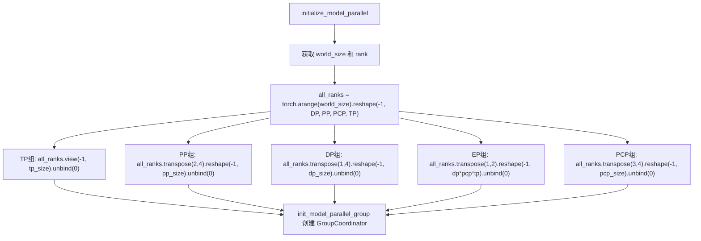
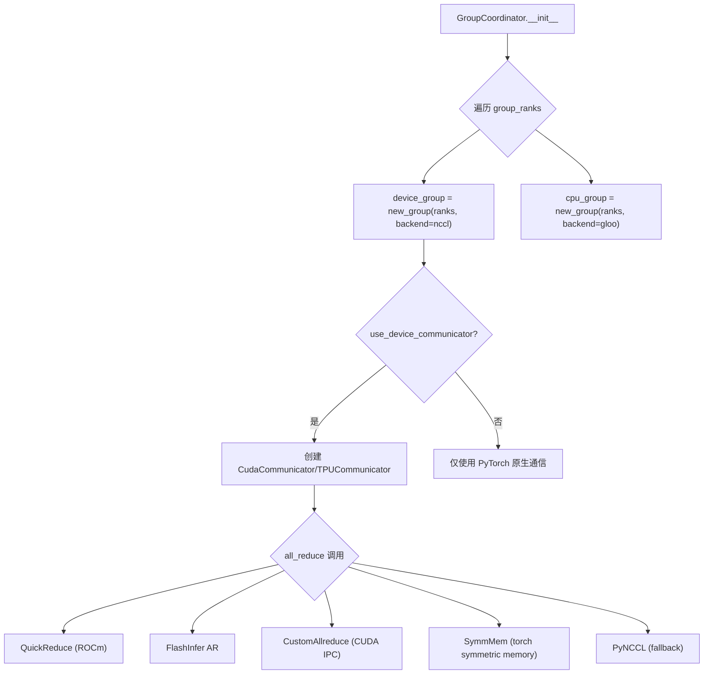
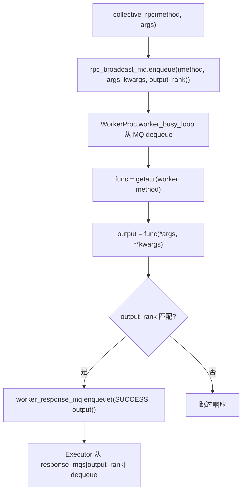

# PD-376.01 vLLM — 七维进程组拓扑与多策略集合通信

> 文档编号：PD-376.01
> 来源：vLLM `vllm/distributed/parallel_state.py`, `vllm/v1/executor/multiproc_executor.py`
> GitHub：https://github.com/vllm-project/vllm.git
> 问题域：PD-376 分布式并行推理 Distributed Parallel Inference
> 状态：可复用方案

---

## 第 1 章 问题与动机（≥ 30 行）

### 1.1 核心问题

大语言模型推理的分布式并行面临三个核心挑战：

1. **进程组拓扑管理**：当 TP×PP×DP×EP×PCP×DCP 六个并行维度组合时，如何正确划分进程组、分配 rank，使每个 GPU 知道自己在每个维度中的角色？
2. **通信后端选择**：不同并行维度的通信模式不同（TP 需要高频 all-reduce，PP 需要点对点 send/recv，EP 需要 all-to-all），如何为每种模式选择最优通信后端？
3. **执行器抽象**：如何在单机多进程（multiprocessing）和多机 Ray 集群两种部署模式之间提供统一的执行器接口？

这些问题在 vLLM 中尤为突出，因为它需要支持从单 GPU 到数百 GPU 的弹性扩展，同时保持推理吞吐量最大化。

### 1.2 vLLM 的解法概述

vLLM 的分布式并行推理方案围绕三个核心组件展开：

1. **`parallel_state.py` — 七维进程组拓扑管理器**：通过 `initialize_model_parallel()` 函数，使用 PyTorch tensor reshape + transpose 操作从全局 rank 列表中切分出 TP/PP/DP/EP/PCP/DCP/EPLB 七个 `GroupCoordinator` 实例（`vllm/distributed/parallel_state.py:1477-1728`）
2. **`GroupCoordinator` — 双后端通信协调器**：每个进程组同时持有 NCCL（GPU 通信）和 Gloo（CPU 通信）两个 PyTorch ProcessGroup，并通过 `DeviceCommunicatorBase` 策略模式支持多种 all-reduce 实现（`vllm/distributed/parallel_state.py:287-395`）
3. **`MultiprocExecutor` / `RayDistributedExecutor` — 双模式执行器**：通过共享内存消息队列（SHM MessageQueue）或 Ray Actor 实现 RPC 广播，统一 `collective_rpc` 接口（`vllm/v1/executor/multiproc_executor.py:95-389`）

### 1.3 设计思想

| 设计原则 | 具体实现 | 理由 | 替代方案 |
|----------|----------|------|----------|
| Tensor reshape 拓扑划分 | 将全局 rank 列表 reshape 为 `[ExternalDP, DP, PP, PCP, TP]` 五维张量，通过 transpose + view 提取各维度进程组 | 数学上保证进程组不重叠且覆盖完整，代码简洁 | 手动枚举 rank 列表（易出错） |
| 双后端分离 | 每个 GroupCoordinator 同时创建 NCCL device_group 和 Gloo cpu_group | GPU 张量通信用 NCCL 高性能，CPU 元数据/barrier 用 Gloo 避免 NCCL 的隐式 GPU 张量创建 | 单一后端（NCCL barrier 会创建隐式 GPU 张量） |
| 多策略 all-reduce 级联 | CudaCommunicator 按优先级尝试：QuickReduce → FlashInfer → CustomAllreduce → SymmMem → PyNCCL | 不同张量大小有不同最优策略，级联保证总是选择当前最优 | 固定使用 NCCL（小张量性能差） |
| SHM 消息队列 RPC | MultiprocExecutor 用共享内存环形缓冲区广播 SchedulerOutput，避免序列化开销 | 单机场景下比 gRPC/Ray 延迟低一个数量级 | Ray ObjectRef（多一次序列化） |
| Death pipe 父进程监控 | 子进程持有 death_reader pipe，父进程退出时 pipe 关闭触发 EOFError | 零开销检测父进程崩溃，比轮询 `os.getppid()` 更可靠 | 心跳轮询（增加延迟和 CPU 开销） |

---

## 第 2 章 源码实现分析（≥ 60 行，核心章节）

### 2.1 架构概览

vLLM 的分布式并行推理架构分为三层：

```
┌─────────────────────────────────────────────────────────────────┐
│                        Engine Core                               │
│  ┌──────────────────────────────────────────────────────────┐   │
│  │              Executor (Abstract)                          │   │
│  │  ┌─────────────────┐  ┌──────────────────────────────┐   │   │
│  │  │ UniProcExecutor  │  │ MultiprocExecutor            │   │   │
│  │  │ (单GPU)          │  │ ┌──────────────────────────┐ │   │   │
│  │  └─────────────────┘  │ │ SHM MessageQueue (广播)   │ │   │   │
│  │  ┌─────────────────┐  │ │ WorkerProc × N (子进程)   │ │   │   │
│  │  │ RayDistributed   │  │ │ FutureWrapper (异步响应)  │ │   │   │
│  │  │ Executor         │  │ └──────────────────────────┘ │   │   │
│  │  └─────────────────┘  └──────────────────────────────────┘   │
│  └──────────────────────────────────────────────────────────┘   │
│                              ↓ collective_rpc                    │
│  ┌──────────────────────────────────────────────────────────┐   │
│  │              parallel_state (进程组拓扑)                   │   │
│  │  _TP  _PP  _DP  _EP  _PCP  _DCP  _EPLB  _WORLD          │   │
│  │  每个都是 GroupCoordinator 实例                             │   │
│  │  ┌─────────────────────────────────────────────────┐      │   │
│  │  │ GroupCoordinator                                 │      │   │
│  │  │  ├─ device_group (NCCL ProcessGroup)             │      │   │
│  │  │  ├─ cpu_group (Gloo ProcessGroup)                │      │   │
│  │  │  ├─ device_communicator (CudaCommunicator)       │      │   │
│  │  │  │   ├─ QuickAllReduce (ROCm MI300)              │      │   │
│  │  │  │   ├─ FlashInferAllReduce                      │      │   │
│  │  │  │   ├─ CustomAllreduce (CUDA IPC)               │      │   │
│  │  │  │   ├─ SymmMemCommunicator                      │      │   │
│  │  │  │   └─ PyNcclCommunicator                       │      │   │
│  │  │  └─ mq_broadcaster (SHM MessageQueue)            │      │   │
│  │  └─────────────────────────────────────────────────┘      │   │
│  └──────────────────────────────────────────────────────────┘   │
└─────────────────────────────────────────────────────────────────┘
```

### 2.2 核心实现

#### 2.2.1 七维进程组拓扑初始化



对应源码 `vllm/distributed/parallel_state.py:1477-1628`：

```python
def initialize_model_parallel(
    tensor_model_parallel_size: int = 1,
    pipeline_model_parallel_size: int = 1,
    prefill_context_model_parallel_size: int = 1,
    decode_context_model_parallel_size: int | None = 1,
    backend: str | None = None,
) -> None:
    # 布局顺序: ExternalDP x DP x PP x PCP x TP
    all_ranks = torch.arange(world_size).reshape(
        -1,
        data_parallel_size,
        pipeline_model_parallel_size,
        prefill_context_model_parallel_size,
        tensor_model_parallel_size,
    )

    # TP组: 最后一维直接 view
    group_ranks = all_ranks.view(-1, tensor_model_parallel_size).unbind(0)
    _TP = init_model_parallel_group(group_ranks, ..., group_name="tp")

    # PP组: 将 PP 维度 transpose 到最后
    group_ranks = (
        all_ranks.transpose(2, 4)
        .reshape(-1, pipeline_model_parallel_size).unbind(0)
    )
    _PP = init_model_parallel_group(group_ranks, ..., group_name="pp")

    # EP组: 合并 DP×PCP×TP 维度（MoE 专家跨这三个维度分布）
    group_ranks = (
        all_ranks.transpose(1, 2)
        .reshape(-1, data_parallel_size * pcp_size * tp_size)
        .unbind(0)
    )
    _EP = init_model_parallel_group(group_ranks, ..., group_name="ep")
```

这段代码的精妙之处在于：通过 tensor 的 reshape/transpose/unbind 操作，用纯数学方式保证了进程组划分的正确性——每个 rank 恰好属于每个维度的一个组，且组内 rank 的物理拓扑关系（相邻 rank 在同一节点）得到保持。

#### 2.2.2 GroupCoordinator 双后端通信



对应源码 `vllm/distributed/parallel_state.py:316-378`：

```python
class GroupCoordinator:
    def __init__(
        self,
        group_ranks: list[list[int]],
        local_rank: int,
        torch_distributed_backend: str | Backend,
        use_device_communicator: bool,
        use_message_queue_broadcaster: bool = False,
        group_name: str | None = None,
    ):
        for ranks in group_ranks:
            device_group = torch.distributed.new_group(
                ranks, backend=torch_distributed_backend  # NCCL
            )
            cpu_group = torch.distributed.new_group(
                ranks, backend="gloo"  # 始终用 Gloo
            )
            if self.rank in ranks:
                self.ranks = ranks
                self.world_size = len(ranks)
                self.rank_in_group = ranks.index(self.rank)
                self_device_group = device_group
                self_cpu_group = cpu_group

        # 根据平台创建设备通信器
        if use_device_communicator and self.world_size > 1:
            device_comm_cls = resolve_obj_by_qualname(
                current_platform.get_device_communicator_cls()
            )
            self.device_communicator = device_comm_cls(
                cpu_group=self.cpu_group,
                device=self.device,
                device_group=self.device_group,
                unique_name=self.unique_name,
            )
```

关键设计：`barrier()` 方法显式使用 `cpu_group` 而非 `device_group`（`parallel_state.py:1026-1033`），因为 NCCL 的 barrier 内部会创建隐式 GPU 张量，容易导致设备混乱。

#### 2.2.3 MultiprocExecutor 共享内存 RPC



对应源码 `vllm/v1/executor/multiproc_executor.py:317-389`：

```python
def collective_rpc(
    self, method: str | Callable, timeout: float | None = None,
    args: tuple = (), kwargs: dict | None = None,
    non_block: bool = False, unique_reply_rank: int | None = None,
    kv_output_aggregator: KVOutputAggregator | None = None,
) -> Any:
    # 广播 RPC 请求到所有 worker
    self.rpc_broadcast_mq.enqueue(
        (send_method, args, kwargs, output_rank)
    )

    # 只从指定 rank 收集响应（优化：TP 场景只需 rank 0 的输出）
    response_mqs: Sequence[MessageQueue] = self.response_mqs
    if output_rank is not None:
        response_mqs = (response_mqs[output_rank],)

    def get_response():
        responses = []
        for mq in response_mqs:
            status, result = mq.dequeue(
                timeout=dequeue_timeout, cancel=shutdown_event
            )
            if status != WorkerProc.ResponseStatus.SUCCESS:
                raise RuntimeError(f"Worker failed: '{result}'")
            responses.append(result)
        return responses[0] if output_rank is not None else responses
```

### 2.3 实现细节

**Death pipe 父进程监控机制**（`multiproc_executor.py:617-643`）：

每个 worker 子进程在创建时获得一个 `death_reader` pipe。父进程持有对应的 `death_writer`。当父进程异常退出时，`death_writer` 自动关闭，子进程的 `death_reader.recv()` 抛出 `EOFError`，触发优雅关闭。这是一种零开销的进程存活检测机制。

**output_rank 优化**（`multiproc_executor.py:451-465`）：

在 TP+PP 场景下，只有最后一个 PP stage 的第一个 TP rank 需要返回模型输出。`_get_output_rank()` 计算公式为 `world_size - tp_size * pcp_size`，避免了所有 worker 都序列化和传输完整输出。

**EP 组与 EPLB 组分离**（`parallel_state.py:1683-1712`）：

Expert Parallel Load Balancing (EPLB) 使用独立的进程组，与 EP 的 MoE forward pass 通信隔离，防止 `torch.distributed` 调用在执行和负载均衡之间产生死锁。


---

## 第 3 章 迁移指南（≥ 40 行）

### 3.1 迁移清单

**阶段 1：进程组拓扑管理（核心）**

- [ ] 定义并行维度配置类（类似 `ParallelConfig`），包含 TP/PP/DP 等维度大小
- [ ] 实现 `GroupCoordinator` 封装类，同时管理 NCCL 和 Gloo 两个 ProcessGroup
- [ ] 实现 `initialize_model_parallel()` 函数，使用 tensor reshape 划分进程组
- [ ] 为每个进程组提供全局访问函数（`get_tp_group()` 等）

**阶段 2：通信后端（按需）**

- [ ] 实现 `DeviceCommunicatorBase` 抽象基类
- [ ] 集成 PyNCCL 作为默认 GPU 通信后端
- [ ] 可选：集成 CustomAllreduce 用于小张量优化

**阶段 3：执行器（按部署模式选择）**

- [ ] 单机：实现基于 `multiprocessing.Process` 的执行器 + SHM 消息队列
- [ ] 多机：实现基于 Ray Actor 的执行器
- [ ] 统一 `collective_rpc` 接口

### 3.2 适配代码模板

以下是一个可运行的进程组拓扑管理器最小实现：

```python
import torch
import torch.distributed as dist
from dataclasses import dataclass
from typing import Optional


@dataclass
class ParallelGroup:
    """双后端进程组协调器（简化版 GroupCoordinator）"""
    ranks: list[int]
    rank: int
    world_size: int
    rank_in_group: int
    device_group: dist.ProcessGroup  # NCCL
    cpu_group: dist.ProcessGroup     # Gloo
    name: str

    @property
    def is_first_rank(self) -> bool:
        return self.rank_in_group == 0

    def all_reduce(self, tensor: torch.Tensor) -> torch.Tensor:
        if self.world_size == 1:
            return tensor
        output = tensor.clone()
        dist.all_reduce(output, group=self.device_group)
        return output

    def barrier(self):
        # 关键：用 Gloo cpu_group 做 barrier，避免 NCCL 隐式 GPU 张量
        dist.barrier(group=self.cpu_group)

    def broadcast_object(self, obj, src: int = 0):
        if self.world_size == 1:
            return obj
        if self.rank_in_group == src:
            dist.broadcast_object_list([obj], src=self.ranks[src],
                                       group=self.cpu_group)
            return obj
        else:
            recv = [None]
            dist.broadcast_object_list(recv, src=self.ranks[src],
                                       group=self.cpu_group)
            return recv[0]


def create_parallel_groups(
    tp_size: int, pp_size: int, dp_size: int = 1,
    backend: str = "nccl"
) -> dict[str, ParallelGroup]:
    """使用 tensor reshape 创建进程组拓扑（vLLM 核心算法）"""
    world_size = dist.get_world_size()
    rank = dist.get_rank()
    local_rank = rank % torch.cuda.device_count()

    # 布局: DP x PP x TP
    all_ranks = torch.arange(world_size).reshape(dp_size, pp_size, tp_size)
    groups = {}

    def _make_group(name: str, group_ranks_list: list[list[int]]):
        for ranks in group_ranks_list:
            device_pg = dist.new_group(ranks, backend=backend)
            cpu_pg = dist.new_group(ranks, backend="gloo")
            if rank in ranks:
                groups[name] = ParallelGroup(
                    ranks=ranks, rank=rank,
                    world_size=len(ranks),
                    rank_in_group=ranks.index(rank),
                    device_group=device_pg, cpu_group=cpu_pg,
                    name=name,
                )

    # TP 组
    tp_ranks = all_ranks.view(-1, tp_size).unbind(0)
    _make_group("tp", [r.tolist() for r in tp_ranks])

    # PP 组
    pp_ranks = all_ranks.transpose(1, 2).reshape(-1, pp_size).unbind(0)
    _make_group("pp", [r.tolist() for r in pp_ranks])

    # DP 组
    dp_ranks = all_ranks.transpose(0, 2).reshape(-1, dp_size).unbind(0)
    _make_group("dp", [r.tolist() for r in dp_ranks])

    return groups
```

### 3.3 适用场景

| 场景 | 适用度 | 说明 |
|------|--------|------|
| LLM 推理服务（单机多卡） | ⭐⭐⭐ | 核心场景，MultiprocExecutor + SHM MQ 延迟最低 |
| LLM 推理服务（多机多卡） | ⭐⭐⭐ | RayDistributedExecutor 处理跨节点通信 |
| MoE 模型推理 | ⭐⭐⭐ | EP 组 + all-to-all 后端选择是 MoE 的关键 |
| 训练框架分布式通信 | ⭐⭐ | 进程组拓扑管理可复用，但执行器需适配训练循环 |
| 非 GPU 推理（CPU/TPU） | ⭐⭐ | GroupCoordinator 支持多平台，但通信优化策略不同 |
| 小模型单卡推理 | ⭐ | 过度设计，UniProcExecutor 更合适 |

---

## 第 4 章 测试用例（≥ 20 行）

```python
import pytest
import torch


class TestParallelGroupTopology:
    """测试进程组拓扑划分的正确性"""

    def test_tp_group_ranks_contiguous(self):
        """TP 组内 rank 应该连续（同一节点内）"""
        tp_size, pp_size = 4, 2
        world_size = tp_size * pp_size  # 8
        all_ranks = torch.arange(world_size).reshape(1, pp_size, tp_size)
        tp_groups = all_ranks.view(-1, tp_size).unbind(0)
        # 应该得到 [0,1,2,3] 和 [4,5,6,7]
        assert tp_groups[0].tolist() == [0, 1, 2, 3]
        assert tp_groups[1].tolist() == [4, 5, 6, 7]

    def test_pp_group_ranks_strided(self):
        """PP 组内 rank 应该跨 TP 组（不同 stage）"""
        tp_size, pp_size = 4, 2
        world_size = tp_size * pp_size
        all_ranks = torch.arange(world_size).reshape(1, pp_size, tp_size)
        pp_groups = (
            all_ranks.transpose(1, 2)
            .reshape(-1, pp_size).unbind(0)
        )
        # PP 组应该是 [0,4], [1,5], [2,6], [3,7]
        assert pp_groups[0].tolist() == [0, 4]
        assert pp_groups[1].tolist() == [1, 5]

    def test_dp_group_ranks(self):
        """DP 组内 rank 应该跨 PP×TP"""
        tp_size, pp_size, dp_size = 2, 2, 2
        world_size = tp_size * pp_size * dp_size  # 8
        all_ranks = torch.arange(world_size).reshape(dp_size, pp_size, tp_size)
        dp_groups = (
            all_ranks.transpose(0, 2)
            .reshape(-1, dp_size).unbind(0)
        )
        # DP 组应该是 [0,4], [1,5], [2,6], [3,7]
        assert dp_groups[0].tolist() == [0, 4]
        assert dp_groups[1].tolist() == [1, 5]

    def test_output_rank_calculation(self):
        """output_rank 应该是最后一个 PP stage 的第一个 TP rank"""
        tp_size, pp_size = 8, 4
        world_size = tp_size * pp_size  # 32
        pcp_size = 1
        output_rank = world_size - tp_size * pcp_size
        # 32 - 8 = 24，即 PP rank 3 的 TP rank 0
        assert output_rank == 24

    def test_ep_group_merges_dp_and_tp(self):
        """EP 组应该合并 DP×TP 维度"""
        tp_size, pp_size, dp_size = 2, 2, 2
        pcp_size = 1
        world_size = tp_size * pp_size * dp_size
        all_ranks = torch.arange(world_size).reshape(
            1, dp_size, pp_size, pcp_size, tp_size
        )
        ep_groups = (
            all_ranks.transpose(1, 2)
            .reshape(-1, dp_size * pcp_size * tp_size)
            .unbind(0)
        )
        # EP 组大小应该是 dp_size * tp_size = 4
        assert ep_groups[0].shape[0] == 4


class TestGroupCoordinatorBehavior:
    """测试 GroupCoordinator 的行为语义"""

    def test_single_gpu_bypass(self):
        """world_size=1 时 all_reduce 应该直接返回输入"""
        # 模拟 world_size=1 的行为
        tensor = torch.tensor([1.0, 2.0, 3.0])
        # GroupCoordinator.all_reduce 在 world_size==1 时直接返回
        world_size = 1
        if world_size == 1:
            result = tensor
        assert torch.equal(result, tensor)

    def test_death_pipe_eof_on_close(self):
        """death_writer 关闭时 death_reader 应该收到 EOFError"""
        import multiprocessing
        ctx = multiprocessing.get_context("spawn")
        reader, writer = ctx.Pipe(duplex=False)
        writer.close()
        with pytest.raises(EOFError):
            reader.recv()
        reader.close()
```


---

## 第 5 章 跨域关联

| 关联域 | 关系类型 | 说明 |
|--------|----------|------|
| PD-375 推测解码 | 协同 | `patch_tensor_parallel_group()` 允许 draft model 使用不同 TP 度，speculative decoding 依赖进程组动态切换 |
| PD-377 模型量化 | 协同 | 量化后的模型权重分片依赖 TP 组的 rank 分配，`load_model()` 在 worker 初始化时按 TP rank 加载对应分片 |
| PD-379 连续批处理调度 | 依赖 | `MultiprocExecutor.execute_model()` 接收 `SchedulerOutput`，连续批处理的调度结果通过 SHM MQ 广播到所有 worker |
| PD-380 KV Cache 分页管理 | 协同 | PP 场景下 KV cache 需要跨 stage 传输，依赖 PP 组的 `send_tensor_dict` / `recv_tensor_dict` |
| PD-384 OpenAI 兼容 API | 依赖 | API 层通过 Engine → Executor → Worker 链路调用，分布式推理对 API 层透明 |
| PD-385 弹性扩缩容 | 协同 | `enable_elastic_ep` 使用 `StatelessGroupCoordinator` 支持动态加入/退出 EP 节点，无需重启全部 worker |
| PD-387 分离式服务 | 协同 | Prefill-Decode 分离依赖 PCP 组（prefill context parallel），通过 KV transfer connector 跨组传输 |

---

## 第 6 章 来源文件索引

| 文件 | 行范围 | 关键实现 |
|------|--------|----------|
| `vllm/distributed/parallel_state.py` | L287-L395 | `GroupCoordinator` 类：双后端进程组协调器 |
| `vllm/distributed/parallel_state.py` | L489-L511 | `all_reduce()` 方法：custom op 注册与分发 |
| `vllm/distributed/parallel_state.py` | L1026-L1033 | `barrier()` 方法：显式使用 Gloo cpu_group |
| `vllm/distributed/parallel_state.py` | L1477-L1728 | `initialize_model_parallel()` 函数：七维进程组拓扑初始化 |
| `vllm/distributed/parallel_state.py` | L1118-L1131 | 全局进程组变量：_WORLD, _TP, _PP, _DP, _EP, _PCP, _DCP, _EPLB |
| `vllm/v1/executor/abstract.py` | L36-L191 | `Executor` 抽象基类：`collective_rpc` 接口定义 |
| `vllm/v1/executor/multiproc_executor.py` | L95-L226 | `MultiprocExecutor._init_executor()`：SHM MQ 初始化与 worker 创建 |
| `vllm/v1/executor/multiproc_executor.py` | L317-L389 | `collective_rpc()`：广播 RPC + 选择性响应收集 |
| `vllm/v1/executor/multiproc_executor.py` | L506-L598 | `WorkerProc.__init__()`：worker 初始化与消息队列设置 |
| `vllm/v1/executor/multiproc_executor.py` | L604-L643 | `make_worker_process()`：death pipe 创建 |
| `vllm/v1/executor/multiproc_executor.py` | L862-L888 | `worker_busy_loop()`：worker 主循环 |
| `vllm/v1/executor/ray_executor.py` | L62-L114 | `RayDistributedExecutor`：Ray Actor 执行器 |
| `vllm/config/parallel.py` | L94-L200 | `ParallelConfig`：并行配置（TP/PP/DP/EP/PCP/DCP） |
| `vllm/distributed/device_communicators/cuda_communicator.py` | L25-L153 | `CudaCommunicator`：多策略 all-reduce 级联 |
| `vllm/distributed/device_communicators/cuda_communicator.py` | L161-L199 | `all_reduce()`：QuickReduce → FlashInfer → Custom → SymmMem → NCCL |
| `vllm/distributed/device_communicators/base_device_communicator.py` | L28-L70 | `All2AllManagerBase`：EP all-to-all 通信基类 |
| `vllm/distributed/device_communicators/shm_broadcast.py` | L1-L76 | SHM 消息队列：memory fence + 环形缓冲区 |

---

## 第 7 章 横向对比维度

```json comparison_data
{
  "project": "vLLM",
  "dimensions": {
    "并行维度": "七维：TP/PP/DP/EP/PCP/DCP/EPLB，tensor reshape 拓扑划分",
    "通信后端": "五级级联：QuickReduce→FlashInfer→CustomAR→SymmMem→NCCL",
    "执行器模式": "三模式：UniProc/Multiproc(SHM MQ)/Ray Actor",
    "进程组管理": "GroupCoordinator 双后端（NCCL+Gloo）+ 全局单例注册表",
    "故障检测": "Death pipe 零开销父进程监控 + sentinel 哨兵线程",
    "弹性扩缩": "StatelessGroupCoordinator 支持 EP 节点动态加入退出"
  }
}
```

### 域元数据补充

```json domain_metadata
{
  "solution_summary": "vLLM 用 tensor reshape 拓扑划分七维进程组（TP/PP/DP/EP/PCP/DCP/EPLB），GroupCoordinator 双后端（NCCL+Gloo）管理通信，CudaCommunicator 五级级联 all-reduce，MultiprocExecutor 基于 SHM 消息队列实现零拷贝 RPC 广播",
  "description": "多维并行组合下的进程组拓扑自动划分与通信后端智能选择",
  "sub_problems": [
    "多维并行组合的 rank 自动分配与拓扑验证",
    "MoE 专家并行的 all-to-all 通信后端选择（6种策略）",
    "单机多进程与多机 Ray 的执行器统一抽象",
    "弹性 EP 节点动态加入退出的无状态进程组"
  ],
  "best_practices": [
    "用 Gloo 做 barrier 和 CPU 元数据通信，避免 NCCL 隐式 GPU 张量",
    "EP 与 EPLB 使用独立进程组防止 forward 与负载均衡死锁",
    "Death pipe 机制零开销检测父进程崩溃",
    "output_rank 优化：仅从最后 PP stage 的 TP rank 0 收集输出"
  ]
}
```

