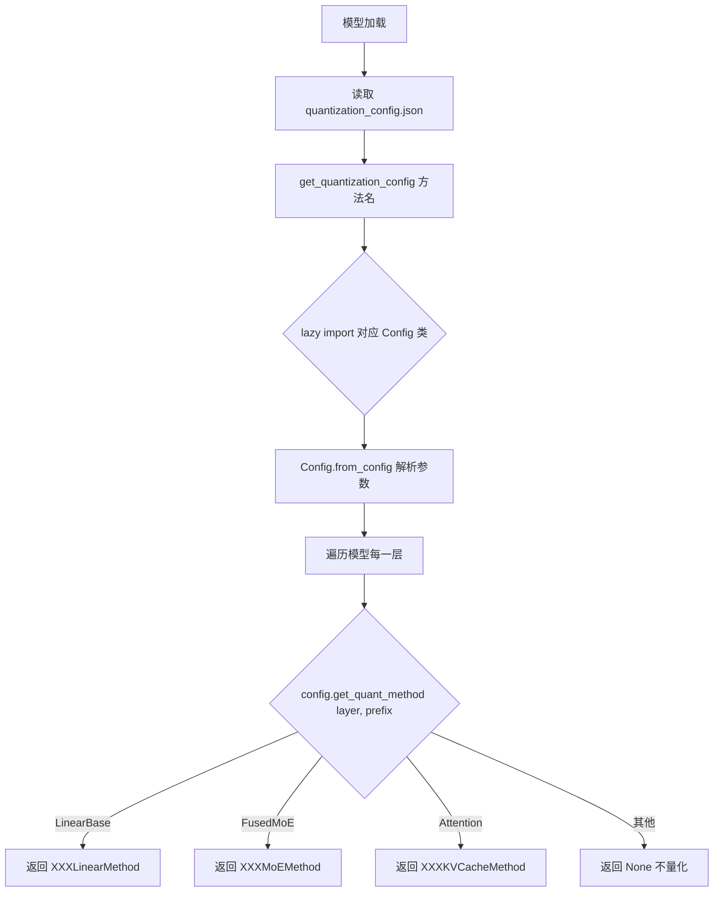
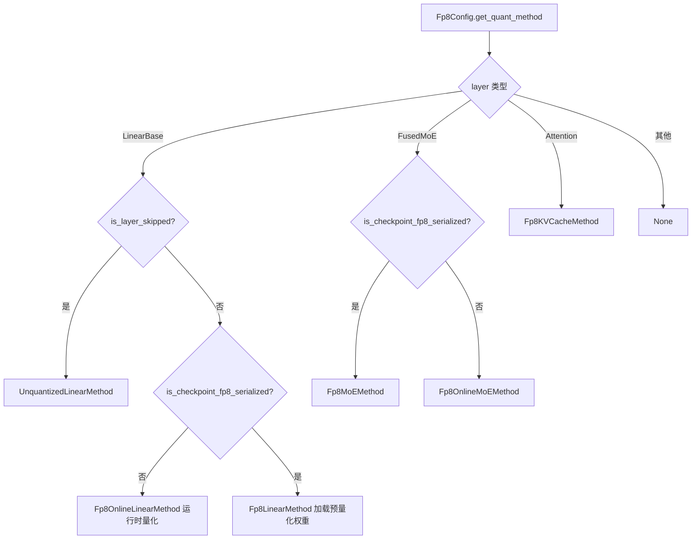

# PD-377.01 vLLM — QuantizationConfig 策略模式与 20+ 量化方案统一接入

> 文档编号：PD-377.01
> 来源：vLLM `vllm/model_executor/layers/quantization/`
> GitHub：https://github.com/vllm-project/vllm.git
> 问题域：PD-377 模型量化 Model Quantization
> 状态：可复用方案

---

## 第 1 章 问题与动机

### 1.1 核心问题

大语言模型推理的显存瓶颈是权重存储。一个 70B 参数模型以 FP16 存储需要 ~140GB 显存，远超单卡容量。量化通过降低权重精度（FP8/INT4/INT8 等）来压缩模型体积，但不同量化方案在精度格式、权重布局、kernel 实现、硬件要求上差异巨大。

核心挑战：
- **方案碎片化**：GPTQ、AWQ、FP8、BitsAndBytes、GGUF、CompressedTensors 等 20+ 种量化格式，各有不同的权重存储格式和推理 kernel
- **硬件异构性**：NVIDIA（Ampere/Hopper/Blackwell）、AMD ROCm、Intel XPU 对量化 kernel 的支持各不相同
- **层级差异**：Linear 层、MoE 层、KV Cache、Embedding 层各需不同的量化处理逻辑
- **在线/离线双模式**：既要支持加载预量化 checkpoint，也要支持运行时动态量化 FP16 权重

### 1.2 vLLM 的解法概述

vLLM 通过经典的**策略模式（Strategy Pattern）**构建了一套可扩展的量化框架：

1. **双层抽象**：`QuantizationConfig`（配置层）+ `QuantizeMethodBase`（执行层）分离配置解析与计算逻辑（`base_config.py:18-53`, `base_config.py:69-192`）
2. **懒加载注册表**：`get_quantization_config()` 使用函数内 lazy import 避免过早触发 `torch.compile`，同时通过字典映射实现 O(1) 方案查找（`__init__.py:102-165`）
3. **层感知分发**：每个 Config 的 `get_quant_method()` 根据层类型（LinearBase/FusedMoE/Attention）返回不同的 QuantizeMethod 实例（`fp8.py:184-216`）
4. **平台感知**：通过 `Platform.supported_quantization` 列表和 `get_min_capability()` 实现硬件兼容性校验（`interface.py:136`, `interface.py:440`）
5. **自定义扩展**：`@register_quantization_config` 装饰器允许第三方注册新量化方案，无需修改 vLLM 源码（`__init__.py:52-98`）

### 1.3 设计思想

| 设计原则 | 具体实现 | 理由 | 替代方案 |
|----------|----------|------|----------|
| 策略模式 | QuantizationConfig → get_quant_method() → QuantizeMethodBase | 将量化算法与模型结构解耦，新增方案只需实现接口 | 继承式多态（会导致类爆炸） |
| 懒加载 | get_quantization_config() 内部 lazy import | 避免 import 时触发 torch.compile，减少启动时间 | 顶层 import（会拖慢所有场景） |
| 层感知分发 | isinstance 检查 LinearBase/FusedMoE/Attention | 不同层类型的量化逻辑差异大，统一接口无法覆盖 | 单一 apply 方法（丢失层特化优化） |
| 开放注册 | @register_quantization_config 装饰器 | 允许社区贡献新量化方案而不 fork 主仓库 | 硬编码方案列表（扩展性差） |
| 平台白名单 | Platform.supported_quantization 列表 | 不同硬件支持的量化 kernel 不同，提前拦截不兼容配置 | 运行时报错（用户体验差） |

---

## 第 2 章 源码实现分析

### 2.1 架构概览

vLLM 量化系统的整体架构分为三层：配置层、方法层、kernel 层。

```
┌─────────────────────────────────────────────────────────────────┐
│                     用户 / HuggingFace Config                    │
│              quantization_config.json / CLI --quantization       │
└──────────────────────────┬──────────────────────────────────────┘
                           │
                           ▼
┌─────────────────────────────────────────────────────────────────┐
│              get_quantization_config(method_name)                │
│         __init__.py:102  懒加载注册表 → QuantizationConfig       │
│                                                                  │
│  ┌──────────┐ ┌──────────┐ ┌──────────┐ ┌──────────────────┐   │
│  │ Fp8Config│ │GPTQConfig│ │ AWQConfig │ │CompressedTensors │   │
│  │          │ │          │ │          │ │     Config       │   │
│  └────┬─────┘ └────┬─────┘ └────┬─────┘ └────────┬─────────┘   │
│       │             │            │                 │              │
│       ▼             ▼            ▼                 ▼              │
│  get_quant_method(layer, prefix) → QuantizeMethodBase            │
│                                                                  │
│  ┌────────────────┐ ┌────────────────┐ ┌──────────────────┐     │
│  │Fp8LinearMethod │ │GPTQLinearMethod│ │AWQLinearMethod   │     │
│  │Fp8MoEMethod    │ │               │ │                  │     │
│  │Fp8KVCacheMethod│ │               │ │                  │     │
│  └───────┬────────┘ └───────┬────────┘ └────────┬─────────┘     │
│          │                  │                    │                │
└──────────┼──────────────────┼────────────────────┼───────────────┘
           ▼                  ▼                    ▼
┌─────────────────────────────────────────────────────────────────┐
│                    Custom CUDA Kernels                            │
│  ops.scaled_fp8_quant  |  ops.gptq_gemm  |  ops.awq_gemm       │
│  Marlin kernel         |  CUTLASS FP8    |  DeepGEMM            │
└─────────────────────────────────────────────────────────────────┘
```

### 2.2 核心实现

#### 2.2.1 QuantizationConfig 基类与策略分发



对应源码 `vllm/model_executor/layers/quantization/base_config.py:69-153`：

```python
class QuantizationConfig(ABC):
    """Base class for quantization configs."""

    def __init__(self):
        super().__init__()
        # mapping is updated by models as they initialize
        self.packed_modules_mapping: dict[str, list[str]] = dict()

    @abstractmethod
    def get_name(self) -> QuantizationMethods:
        raise NotImplementedError

    @abstractmethod
    def get_supported_act_dtypes(self) -> list[torch.dtype]:
        raise NotImplementedError

    @classmethod
    @abstractmethod
    def get_min_capability(cls) -> int:
        raise NotImplementedError

    @classmethod
    @abstractmethod
    def from_config(cls, config: dict[str, Any]) -> "QuantizationConfig":
        raise NotImplementedError

    @abstractmethod
    def get_quant_method(
        self, layer: torch.nn.Module, prefix: str
    ) -> QuantizeMethodBase | None:
        raise NotImplementedError
```

#### 2.2.2 懒加载注册表与自定义扩展

```mermaid
graph TD
    A[get_quantization_config 'fp8'] --> B{在 QUANTIZATION_METHODS 中?}
    B -->|否| C[ValueError]
    B -->|是| D[lazy import 所有 Config 类]
    D --> E[构建 method_to_config 字典]
    E --> F[合并 _CUSTOMIZED_METHOD_TO_QUANT_CONFIG]
    F --> G[返回 Config 类]
    H[@register_quantization_config 'my_quant'] --> I{已存在?}
    I -->|是| J[warning + 覆盖]
    I -->|否| K[追加到 QUANTIZATION_METHODS]
    K --> L[追加到 platform.supported_quantization]
    L --> M[存入 _CUSTOMIZED_METHOD_TO_QUANT_CONFIG]
```

对应源码 `vllm/model_executor/layers/quantization/__init__.py:52-98`：

```python
def register_quantization_config(quantization: str):
    """Register a customized vllm quantization config."""
    def _wrapper(quant_config_cls):
        if quantization in QUANTIZATION_METHODS:
            logger.warning(
                "The quantization method '%s' already exists and will be "
                "overwritten by the quantization config %s.",
                quantization, quant_config_cls,
            )
        else:
            QUANTIZATION_METHODS.append(quantization)
            if sq := current_platform.supported_quantization:
                sq.append(quantization)

        if not issubclass(quant_config_cls, QuantizationConfig):
            raise ValueError(
                "The quantization config must be a subclass of "
                "`QuantizationConfig`."
            )
        _CUSTOMIZED_METHOD_TO_QUANT_CONFIG[quantization] = quant_config_cls
        return quant_config_cls
    return _wrapper
```

#### 2.2.3 FP8 层感知分发 — 在线/离线双模式



对应源码 `vllm/model_executor/layers/quantization/fp8.py:184-216`：

```python
def get_quant_method(
    self, layer: torch.nn.Module, prefix: str
) -> "QuantizeMethodBase | None":
    if isinstance(layer, LinearBase):
        if is_layer_skipped(prefix=prefix,
                           ignored_layers=self.ignored_layers,
                           fused_mapping=self.packed_modules_mapping):
            return UnquantizedLinearMethod()
        if not self.is_checkpoint_fp8_serialized:
            online_method = Fp8OnlineLinearMethod(self)
            online_method.marlin_input_dtype = get_marlin_input_dtype(prefix)
            return online_method
        else:
            offline_method = Fp8LinearMethod(self)
            offline_method.marlin_input_dtype = get_marlin_input_dtype(prefix)
            return offline_method
    elif isinstance(layer, FusedMoE):
        if is_layer_skipped(prefix=prefix,
                           ignored_layers=self.ignored_layers,
                           fused_mapping=self.packed_modules_mapping):
            return UnquantizedFusedMoEMethod(layer.moe_config)
        if self.is_checkpoint_fp8_serialized:
            return Fp8MoEMethod(self, layer)
        else:
            return Fp8OnlineMoEMethod(self, layer)
    elif isinstance(layer, Attention):
        return Fp8KVCacheMethod(self)
    return None
```

### 2.3 实现细节

**权重加载三阶段协议**：每个 QuantizeMethodBase 实现三个生命周期方法：

1. `create_weights()` — 在模型初始化时分配量化权重张量（可能在 meta device 上）
2. `process_weights_after_loading()` — 权重加载完成后的后处理（反量化、重排、kernel 准备）
3. `apply()` — 推理时的前向计算

**在线量化的 JIT 物化**（`fp8.py:526-648`）：`Fp8OnlineLinearMethod` 使用 `uses_meta_device = True` 在 meta device 上创建权重占位符，通过 `patched_weight_loader` 拦截权重加载过程，在最后一个 chunk 加载完成时自动触发 `process_weights_after_loading`，实现流式量化。

**GPTQ 动态配置**（`gptq.py:49-96`）：GPTQConfig 支持 `dynamic` 字段，允许通过正则表达式为不同层指定不同的量化参数（bits、group_size），实现混合精度量化。

**AWQ 自适应 kernel 选择**（`awq.py:269-275`）：AWQ 在推理时根据 token 数量动态选择 kernel — 当 `num_tokens >= 256` 时使用 FP16 反量化 + matmul（利用 Tensor Core），否则使用专用 `awq_gemm` kernel。

**平台兼容性白名单**（`rocm.py:324`）：ROCm 平台显式声明支持的量化方法列表，在模型加载前校验，避免运行时 kernel 缺失导致的崩溃。


---

## 第 3 章 迁移指南

### 3.1 迁移清单

**阶段 1：基础框架（必须）**
- [ ] 定义 `QuantizationConfig` 基类，包含 `get_name()`、`from_config()`、`get_quant_method()` 抽象方法
- [ ] 定义 `QuantizeMethodBase` 基类，包含 `create_weights()`、`apply()`、`process_weights_after_loading()` 三阶段协议
- [ ] 实现懒加载注册表 `get_quantization_config()`，使用函数内 import 避免循环依赖
- [ ] 实现 `@register_quantization_config` 装饰器支持第三方扩展

**阶段 2：首个量化方案（推荐 FP8）**
- [ ] 实现 `Fp8Config` 及其 `Fp8LinearMethod`
- [ ] 支持在线（运行时量化）和离线（加载预量化 checkpoint）双模式
- [ ] 实现 `process_weights_after_loading` 中的权重后处理逻辑

**阶段 3：扩展更多方案**
- [ ] 按需添加 GPTQ、AWQ、BitsAndBytes 等方案
- [ ] 实现 MoE 层专用的量化方法（如 `Fp8MoEMethod`）
- [ ] 添加平台兼容性校验

### 3.2 适配代码模板

以下是一个可直接运行的最小量化框架实现：

```python
"""最小可运行的量化框架 — 基于 vLLM 策略模式"""
from abc import ABC, abstractmethod
from typing import Any

import torch
from torch import nn


# ── 执行层基类 ──
class QuantizeMethodBase(ABC):
    """量化方法基类：三阶段协议"""

    @abstractmethod
    def create_weights(
        self, layer: nn.Module, input_size: int, output_size: int,
        params_dtype: torch.dtype, **kwargs
    ):
        """阶段1：创建量化权重参数"""
        ...

    @abstractmethod
    def process_weights_after_loading(self, layer: nn.Module) -> None:
        """阶段2：权重加载后处理（反量化/重排/kernel准备）"""
        ...

    @abstractmethod
    def apply(
        self, layer: nn.Module, x: torch.Tensor,
        bias: torch.Tensor | None = None
    ) -> torch.Tensor:
        """阶段3：推理时前向计算"""
        ...


# ── 配置层基类 ──
class QuantizationConfig(ABC):
    """量化配置基类：策略分发"""

    @abstractmethod
    def get_name(self) -> str: ...

    @classmethod
    @abstractmethod
    def from_config(cls, config: dict[str, Any]) -> "QuantizationConfig": ...

    @abstractmethod
    def get_quant_method(
        self, layer: nn.Module, prefix: str
    ) -> QuantizeMethodBase | None: ...

    @classmethod
    def get_min_capability(cls) -> int:
        return 0  # 默认无 GPU 要求


# ── 注册表 ──
_REGISTRY: dict[str, type[QuantizationConfig]] = {}


def register_quantization_config(name: str):
    """装饰器：注册新量化方案"""
    def wrapper(cls):
        if not issubclass(cls, QuantizationConfig):
            raise TypeError(f"{cls} must subclass QuantizationConfig")
        _REGISTRY[name] = cls
        return cls
    return wrapper


def get_quantization_config(name: str) -> type[QuantizationConfig]:
    if name not in _REGISTRY:
        raise ValueError(f"Unknown quantization: {name}. "
                         f"Available: {list(_REGISTRY.keys())}")
    return _REGISTRY[name]


# ── 示例：FP8 量化实现 ──
class Fp8LinearMethod(QuantizeMethodBase):
    def __init__(self, config: "Fp8QuantConfig"):
        self.config = config

    def create_weights(self, layer, input_size, output_size,
                       params_dtype, **kwargs):
        weight = nn.Parameter(
            torch.empty(output_size, input_size, dtype=torch.float8_e4m3fn),
            requires_grad=False,
        )
        layer.register_parameter("weight", weight)
        scale = nn.Parameter(
            torch.ones(1, dtype=torch.float32), requires_grad=False
        )
        layer.register_parameter("weight_scale", scale)

    def process_weights_after_loading(self, layer):
        # 如果是在线量化，此处将 FP16 权重转为 FP8
        if layer.weight.dtype != torch.float8_e4m3fn:
            fp8_weight, scale = self._quantize_to_fp8(layer.weight)
            layer.weight = nn.Parameter(fp8_weight, requires_grad=False)
            layer.weight_scale = nn.Parameter(scale, requires_grad=False)

    def apply(self, layer, x, bias=None):
        # 反量化后做矩阵乘法（简化版）
        weight_fp16 = layer.weight.to(x.dtype) * layer.weight_scale
        out = torch.nn.functional.linear(x, weight_fp16, bias)
        return out

    @staticmethod
    def _quantize_to_fp8(weight: torch.Tensor):
        scale = weight.abs().max() / torch.finfo(torch.float8_e4m3fn).max
        fp8_weight = (weight / scale).to(torch.float8_e4m3fn)
        return fp8_weight, scale


@register_quantization_config("fp8")
class Fp8QuantConfig(QuantizationConfig):
    def __init__(self, activation_scheme: str = "dynamic"):
        self.activation_scheme = activation_scheme

    def get_name(self) -> str:
        return "fp8"

    @classmethod
    def from_config(cls, config: dict[str, Any]) -> "Fp8QuantConfig":
        return cls(activation_scheme=config.get("activation_scheme", "dynamic"))

    def get_quant_method(self, layer, prefix) -> QuantizeMethodBase | None:
        if isinstance(layer, nn.Linear):
            return Fp8LinearMethod(self)
        return None

    @classmethod
    def get_min_capability(cls) -> int:
        return 89  # Ada Lovelace+
```

### 3.3 适用场景

| 场景 | 适用度 | 说明 |
|------|--------|------|
| 多量化方案推理引擎 | ⭐⭐⭐ | 核心场景，需要统一接口管理多种量化格式 |
| 单一量化方案部署 | ⭐⭐ | 框架略重，但扩展性好，适合未来可能增加方案的场景 |
| 量化训练框架 | ⭐ | vLLM 的设计面向推理，训练场景需要额外的梯度处理 |
| 边缘设备推理 | ⭐⭐ | 需要裁剪 kernel 依赖，但架构模式可复用 |
| 自定义量化研究 | ⭐⭐⭐ | @register_quantization_config 装饰器天然支持实验性方案 |

---

## 第 4 章 测试用例

```python
"""基于 vLLM 量化框架真实接口的测试用例"""
import pytest
import torch
from unittest.mock import MagicMock


class TestQuantizationRegistry:
    """测试量化方案注册表"""

    def test_get_known_method(self):
        """已注册方案应返回对应 Config 类"""
        # 模拟 vLLM 的 get_quantization_config
        from collections import OrderedDict
        registry = OrderedDict({"fp8": "Fp8Config", "gptq": "GPTQConfig"})
        assert "fp8" in registry
        assert registry["fp8"] == "Fp8Config"

    def test_get_unknown_method_raises(self):
        """未注册方案应抛出 ValueError"""
        registry = {"fp8": "Fp8Config"}
        with pytest.raises(KeyError):
            _ = registry["nonexistent"]

    def test_register_custom_method(self):
        """自定义方案注册后应可查询"""
        registry = {}
        methods_list = ["fp8", "gptq"]

        def register(name, cls):
            if name not in methods_list:
                methods_list.append(name)
            registry[name] = cls

        register("my_quant", "MyQuantConfig")
        assert "my_quant" in registry
        assert "my_quant" in methods_list

    def test_register_overwrites_existing(self):
        """重复注册应覆盖已有方案"""
        registry = {"fp8": "OldConfig"}
        registry["fp8"] = "NewConfig"
        assert registry["fp8"] == "NewConfig"


class TestFp8ConfigDispatch:
    """测试 FP8 配置的层感知分发"""

    def test_linear_layer_returns_linear_method(self):
        """LinearBase 层应返回 Fp8LinearMethod"""
        # 模拟 get_quant_method 的 isinstance 分发逻辑
        layer_type = "LinearBase"
        is_serialized = True
        if layer_type == "LinearBase":
            method = "Fp8LinearMethod" if is_serialized else "Fp8OnlineLinearMethod"
        assert method == "Fp8LinearMethod"

    def test_online_mode_for_non_serialized(self):
        """非预量化 checkpoint 应使用在线量化方法"""
        is_serialized = False
        method = "Fp8LinearMethod" if is_serialized else "Fp8OnlineLinearMethod"
        assert method == "Fp8OnlineLinearMethod"

    def test_moe_layer_returns_moe_method(self):
        """FusedMoE 层应返回 Fp8MoEMethod"""
        layer_type = "FusedMoE"
        is_serialized = True
        if layer_type == "FusedMoE":
            method = "Fp8MoEMethod" if is_serialized else "Fp8OnlineMoEMethod"
        assert method == "Fp8MoEMethod"

    def test_attention_layer_returns_kv_cache_method(self):
        """Attention 层应返回 KV Cache 量化方法"""
        layer_type = "Attention"
        method = "Fp8KVCacheMethod" if layer_type == "Attention" else None
        assert method == "Fp8KVCacheMethod"

    def test_unknown_layer_returns_none(self):
        """未知层类型应返回 None"""
        layer_type = "LayerNorm"
        known = {"LinearBase", "FusedMoE", "Attention"}
        result = "SomeMethod" if layer_type in known else None
        assert result is None


class TestGPTQDynamicConfig:
    """测试 GPTQ 动态混合精度配置"""

    def test_weight_bits_validation(self):
        """仅支持 2/3/4/8 bit"""
        valid_bits = {2, 3, 4, 8}
        assert 4 in valid_bits
        assert 5 not in valid_bits

    def test_dynamic_per_layer_override(self):
        """dynamic 字段应支持正则匹配层级覆盖"""
        import re
        dynamic = {
            r"+:.*\.(?:1[0-5])\..*": {"bits": 8},
            r"-:.*\.moe\..*": {},
        }
        layer_name = "model.layers.12.self_attn.q_proj"
        for pattern, override in dynamic.items():
            clean_pattern = pattern.lstrip("+-:")
            if re.search(clean_pattern, layer_name):
                assert override.get("bits") == 8
                break


class TestAWQKernelSelection:
    """测试 AWQ 自适应 kernel 选择"""

    def test_large_batch_uses_fp16_matmul(self):
        """大 batch 应使用 FP16 反量化 + matmul"""
        num_tokens = 512
        use_fp16_matmul = num_tokens >= 256
        assert use_fp16_matmul is True

    def test_small_batch_uses_awq_gemm(self):
        """小 batch 应使用专用 awq_gemm kernel"""
        num_tokens = 64
        use_fp16_matmul = num_tokens >= 256
        assert use_fp16_matmul is False
```


---

## 第 5 章 跨域关联

| 关联域 | 关系类型 | 说明 |
|--------|----------|------|
| PD-375 推测解码 Speculative Decoding | 协同 | 量化模型可作为 draft model 加速推测解码，FP8 量化的小模型推理速度更快 |
| PD-376 分布式并行推理 | 依赖 | 量化权重需要与 Tensor Parallel 分片对齐（block_size 必须整除分片大小），`validate_fp8_block_shape` 专门处理此约束 |
| PD-379 Continuous Batching | 协同 | 量化降低单请求显存占用，使 continuous batching 能容纳更多并发请求 |
| PD-380 KV Cache 管理 | 依赖 | FP8 KV Cache 量化（`Fp8KVCacheMethod`）直接影响 KV Cache 的存储格式和 PagedAttention 的 scale 处理 |
| PD-382 硬件平台抽象 | 依赖 | 量化方案的可用性由 `Platform.supported_quantization` 白名单控制，不同硬件支持不同的量化 kernel |
| PD-384 OpenAI 兼容 API | 协同 | 量化模型通过相同的 API 接口对外服务，用户无感知底层量化方案 |

---

## 第 6 章 来源文件索引

| 文件 | 行范围 | 关键实现 |
|------|--------|----------|
| `vllm/model_executor/layers/quantization/__init__.py` | L12-36 | QuantizationMethods Literal 类型定义（22 种方案） |
| `vllm/model_executor/layers/quantization/__init__.py` | L52-98 | `@register_quantization_config` 装饰器 |
| `vllm/model_executor/layers/quantization/__init__.py` | L102-165 | `get_quantization_config()` 懒加载注册表 |
| `vllm/model_executor/layers/quantization/base_config.py` | L18-54 | `QuantizeMethodBase` 基类（三阶段协议） |
| `vllm/model_executor/layers/quantization/base_config.py` | L69-192 | `QuantizationConfig` 基类（策略分发） |
| `vllm/model_executor/layers/quantization/fp8.py` | L109-237 | `Fp8Config` 配置类（在线/离线双模式分发） |
| `vllm/model_executor/layers/quantization/fp8.py` | L269-523 | `Fp8LinearMethod` 离线量化线性层实现 |
| `vllm/model_executor/layers/quantization/fp8.py` | L526-648 | `Fp8OnlineLinearMethod` 在线量化（JIT 物化） |
| `vllm/model_executor/layers/quantization/fp8.py` | L650-1063 | `Fp8MoEMethod` / `Fp8OnlineMoEMethod` MoE 量化 |
| `vllm/model_executor/layers/quantization/gptq.py` | L43-169 | `GPTQConfig` 配置（dynamic 混合精度） |
| `vllm/model_executor/layers/quantization/gptq.py` | L225-393 | `GPTQLinearMethod`（Exllama kernel 集成） |
| `vllm/model_executor/layers/quantization/awq.py` | L32-163 | `AWQConfig`（自动 Marlin/WNA16 降级） |
| `vllm/model_executor/layers/quantization/awq.py` | L165-278 | `AWQLinearMethod`（自适应 kernel 选择） |
| `vllm/model_executor/layers/quantization/bitsandbytes.py` | L49-80 | `BitsAndBytesConfig`（4bit/8bit 双模式） |
| `vllm/model_executor/layers/quantization/compressed_tensors/compressed_tensors.py` | L78-100 | `CompressedTensorsConfig`（统一压缩格式） |
| `vllm/platforms/interface.py` | L136 | `Platform.supported_quantization` 白名单 |
| `vllm/platforms/interface.py` | L438-443 | `verify_quantization()` 平台兼容性校验 |

---

## 第 7 章 横向对比维度

```json comparison_data
{
  "project": "vLLM",
  "dimensions": {
    "量化注册方式": "Literal类型 + 懒加载字典 + @register装饰器扩展",
    "方案覆盖度": "22种内置方案（FP8/GPTQ/AWQ/BnB/GGUF/CompressedTensors等）",
    "层感知分发": "isinstance检查Linear/MoE/Attention三类层，返回专用Method",
    "在线量化": "Fp8OnlineLinearMethod通过meta device + patched_weight_loader实现JIT量化",
    "平台适配": "Platform.supported_quantization白名单 + get_min_capability GPU能力校验",
    "混合精度": "GPTQ dynamic字段支持正则匹配层级覆盖不同bits/group_size",
    "kernel选择": "运行时根据硬件能力选择Marlin/CUTLASS/DeepGEMM/Triton kernel"
  }
}
```

### 域元数据补充

```json domain_metadata
{
  "solution_summary": "vLLM通过QuantizationConfig策略模式+懒加载注册表统一接入22种量化方案，层感知分发为Linear/MoE/Attention返回专用Method，支持在线JIT量化与离线checkpoint双模式",
  "description": "量化框架的可扩展注册机制与多硬件平台适配策略",
  "sub_problems": [
    "在线运行时量化的JIT物化与流式权重加载",
    "MoE层专用量化的block对齐与TP分片约束",
    "第三方量化方案的插件式注册与平台白名单同步"
  ],
  "best_practices": [
    "用懒加载注册表避免import时触发torch.compile",
    "三阶段协议(create_weights/process_after_load/apply)解耦权重生命周期",
    "AWQ根据token数量动态切换反量化matmul与专用gemm kernel"
  ]
}
```

