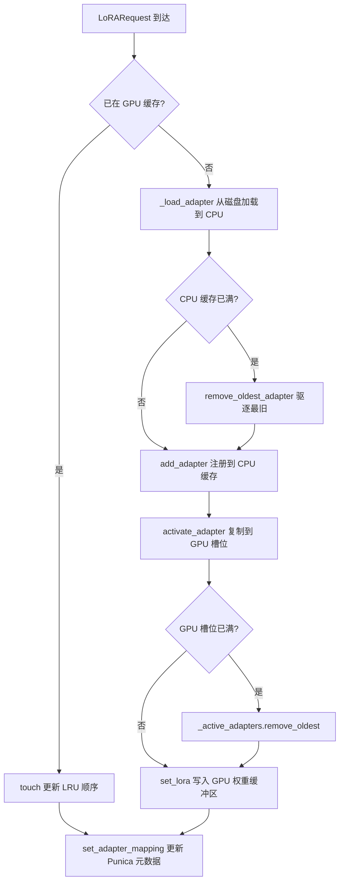
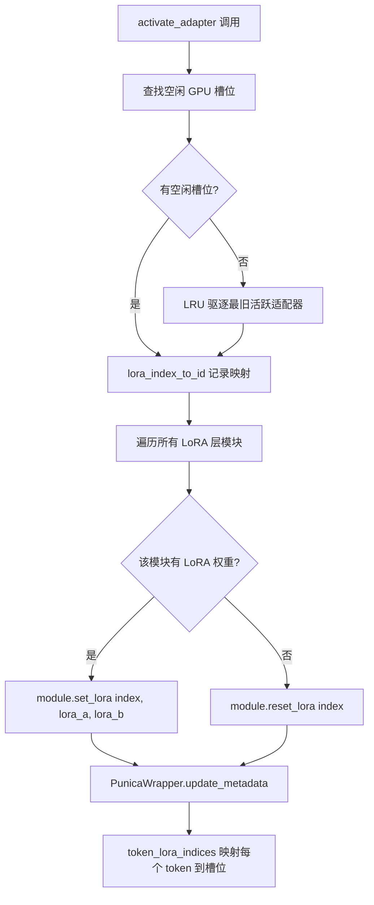
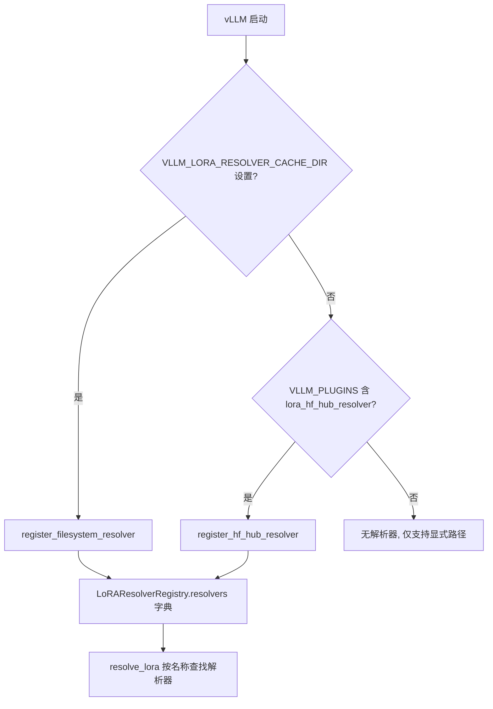

# PD-378.01 vLLM — LoRA 动态适配器热切换与 LRU 缓存管理

> 文档编号：PD-378.01
> 来源：vLLM `vllm/lora/model_manager.py`, `vllm/lora/worker_manager.py`
> GitHub：https://github.com/vllm-project/vllm.git
> 问题域：PD-378 LoRA动态适配 LoRA Dynamic Adapter
> 状态：可复用方案

---

## 第 1 章 问题与动机

### 1.1 核心问题

在大规模 LLM 推理服务中，多租户场景下不同用户可能使用不同的 LoRA 微调适配器。核心挑战包括：

1. **GPU 显存有限**：无法同时将所有 LoRA 适配器加载到 GPU，需要动态管理活跃适配器集合
2. **热切换延迟**：请求到达时如果所需 LoRA 不在 GPU 上，需要快速加载而不阻塞其他请求
3. **批量推理效率**：同一批次中可能包含使用不同 LoRA 的请求，需要高效的批量 LoRA 计算
4. **适配器来源多样**：LoRA 可能来自本地文件系统、HuggingFace Hub 或其他远程存储
5. **权重格式兼容**：需要支持 safetensors、bin、pt 等多种权重格式，以及 PEFT 的各种配置

### 1.2 vLLM 的解法概述

vLLM 通过四层架构实现多 LoRA 动态适配：

1. **双层 LRU 缓存**（`model_manager.py:789-878`）：CPU 层 `_registered_adapters` 和 GPU 层 `_active_adapters` 各自维护独立的 LRU 缓存，CPU 缓存容量由 `max_cpu_loras` 控制，GPU 缓存容量由 `max_loras` 控制
2. **Punica 批量计算引擎**（`punica_wrapper/punica_base.py:124-496`）：基于 Punica 论文实现的多 LoRA 批量 GEMM，通过 `token_lora_indices` 映射每个 token 到对应的 LoRA 槽位
3. **插件式解析器注册表**（`resolver.py:14-88`）：`LoRAResolverRegistry` 单例支持注册多种适配器来源解析器（文件系统、HF Hub），通过策略模式解耦来源逻辑
4. **Worker 级生命周期管理**（`worker_manager.py:24-290`）：`WorkerLoRAManager` 和 `LRUCacheWorkerLoRAManager` 封装了从加载、验证、激活到驱逐的完整生命周期
5. **Pin 机制防驱逐**（`model_manager.py:859-878`）：支持将高频 LoRA 钉在 CPU 和 GPU 缓存中，防止被 LRU 驱逐

### 1.3 设计思想

| 设计原则 | 具体实现 | 理由 | 替代方案 |
|----------|----------|------|----------|
| 双层缓存分离 | CPU LRU (`max_cpu_loras`) + GPU LRU (`max_loras`) | GPU 显存昂贵，CPU 内存便宜，分层可最大化缓存命中率 | 单层 GPU 缓存（浪费 CPU 内存或频繁磁盘 IO） |
| 槽位预分配 | `lora_index_to_id` 固定大小数组映射 LoRA 到 GPU 槽位 | 避免动态分配显存碎片，CUDA kernel 可直接索引 | 动态显存分配（碎片化严重） |
| 先加载后驱逐 | `LRUCacheWorkerLoRAManager.add_adapter` 先 `_load_adapter` 再 `remove_oldest` | 确保新适配器有效后才驱逐旧的，避免加载失败导致缓存空洞 | 先驱逐后加载（失败时缓存容量浪费） |
| 平台抽象 Punica | `punica_selector.py` 按平台选择 GPU/CPU/XPU 实现 | 同一接口支持多硬件后端 | 硬编码 CUDA 实现 |
| 插件式解析器 | `LoRAResolverRegistry` + 环境变量驱动注册 | 解耦适配器来源，支持自定义存储后端 | 硬编码 HF Hub 路径 |

---

## 第 2 章 源码实现分析

### 2.1 架构概览

vLLM 的 LoRA 子系统由五个核心组件构成：

```
┌─────────────────────────────────────────────────────────────────┐
│                     API / Scheduler Layer                       │
│  LoRARequest(lora_name, lora_int_id, lora_path)                │
└──────────────────────────┬──────────────────────────────────────┘
                           │ set_active_adapters()
┌──────────────────────────▼──────────────────────────────────────┐
│              LRUCacheWorkerLoRAManager                          │
│  ┌─────────────────┐  ┌──────────────────────────────────────┐ │
│  │ _load_adapter()  │  │ _apply_adapters()                    │ │
│  │ PEFTHelper       │  │ add/remove/activate                  │ │
│  │ LoRAModel.from_  │  │                                      │ │
│  │ local_checkpoint  │  │                                      │ │
│  └────────┬────────┘  └──────────────┬───────────────────────┘ │
└───────────┼──────────────────────────┼─────────────────────────┘
            │                          │
┌───────────▼──────────────────────────▼─────────────────────────┐
│              LRUCacheLoRAModelManager                           │
│  ┌──────────────────────┐  ┌─────────────────────────────────┐ │
│  │ _registered_adapters │  │ _active_adapters                │ │
│  │ (CPU LRU Cache)      │  │ (GPU LRU Cache)                │ │
│  │ capacity=max_cpu_loras│  │ capacity=max_loras             │ │
│  └──────────┬───────────┘  └──────────┬──────────────────────┘ │
│             │ add_adapter()            │ activate_adapter()     │
│             │                          │ set_lora(index, A, B)  │
└─────────────┼──────────────────────────┼───────────────────────┘
              │                          │
┌─────────────▼──────────────────────────▼───────────────────────┐
│              PunicaWrapper (GPU Kernel Layer)                    │
│  ┌────────────────────────────────────────────────────────────┐ │
│  │ token_lora_indices → per-token LoRA slot mapping           │ │
│  │ add_shrink(x @ lora_a) → add_expand(y @ lora_b)           │ │
│  │ sgmv kernel for prefill / bgmv kernel for decode           │ │
│  └────────────────────────────────────────────────────────────┘ │
└────────────────────────────────────────────────────────────────┘
              │
┌─────────────▼──────────────────────────────────────────────────┐
│              LoRAResolver Plugin System                          │
│  ┌──────────────────┐  ┌──────────────────────────────────────┐ │
│  │FilesystemResolver│  │ HfHubResolver                        │ │
│  │ (local dir scan) │  │ (snapshot_download + adapter_config) │ │
│  └──────────────────┘  └──────────────────────────────────────┘ │
└────────────────────────────────────────────────────────────────┘
```

### 2.2 核心实现

#### 2.2.1 双层 LRU 缓存与适配器生命周期



对应源码 `vllm/lora/worker_manager.py:255-289`：

```python
class LRUCacheWorkerLoRAManager(WorkerLoRAManager):
    _manager_cls: type[LRUCacheLoRAModelManager] = LRUCacheLoRAModelManager

    def add_adapter(self, lora_request: LoRARequest) -> bool:
        if (
            lora_request.lora_int_id not in self.list_adapters()
            or lora_request.load_inplace
        ):
            # Load the new adapter first to ensure it is actually valid, before
            # evicting any existing adapters.
            lora = self._load_adapter(lora_request)

            # Remove the existing adapter if it exists (inplace reload)
            self._adapter_manager.remove_adapter(lora.id)

            # Evict oldest if over capacity
            if len(self._adapter_manager) + 1 > self._adapter_manager.capacity:
                assert isinstance(self._adapter_manager, LRUCacheLoRAModelManager)
                self._adapter_manager.remove_oldest_adapter()
            loaded = self._adapter_manager.add_adapter(lora)
        else:
            # Already loaded, just touch to update LRU order
            loaded = (
                self._adapter_manager.get_adapter(lora_request.lora_int_id)
                is not None
            )
        self._adapter_manager.activate_adapter(lora_request.lora_int_id)
        return loaded
```

关键设计点：**先加载后驱逐**（load-before-evict）。`_load_adapter` 在第 269 行先执行，验证适配器有效性后，才在第 279 行驱逐最旧的缓存项。这避免了加载失败时白白驱逐了有效缓存。

#### 2.2.2 GPU 槽位激活与 Punica 映射



对应源码 `vllm/lora/model_manager.py:228-264`：

```python
def activate_adapter(self, lora_id: int) -> bool:
    """Move LoRA into a GPU buffer to be used in the forward pass."""
    if lora_id in self._active_adapters:
        return False
    first_free_slot = next(
        (
            (i, lora_id)
            for i, lora_id in enumerate(self.lora_index_to_id)
            if lora_id is None
        ),
        None,
    )
    if first_free_slot is None:
        raise ValueError("No free lora slots")
    index, _ = first_free_slot
    self._active_adapters[lora_id] = None
    lora_model = self._registered_adapters[lora_id]
    self.lora_index_to_id[index] = lora_model.id
    for module_name, module in self.modules.items():
        module_lora = self._get_lora_layer_weights(lora_model, module_name)
        if not module_lora:
            module.reset_lora(index)
            continue
        module.set_lora(index, module_lora.lora_a, module_lora.lora_b)
    return True
```

`lora_index_to_id` 是一个固定大小为 `max_loras` 的数组（`model_manager.py:98`），每个位置对应一个 GPU 权重槽位。`set_lora(index, A, B)` 将 LoRA 的 A/B 矩阵写入预分配的 GPU 张量的第 `index` 个切片。

### 2.3 实现细节

#### Pin 机制防止高频适配器被驱逐

`LRUCacheLoRAModelManager` 在 `model_manager.py:859-878` 实现了双层 pin：

```python
def pin_adapter(self, lora_id: int) -> bool:
    self._pin_lora_in_cpu_cache(lora_id)
    self._pin_lora_in_gpu_cache(lora_id)
    return True

def _pin_lora_in_gpu_cache(self, lora_id: int):
    if lora_id not in self._active_adapters:
        self.activate_adapter(lora_id)  # 自动激活到 GPU
    self._active_adapters.pin(lora_id)
```

底层 `LRUCache.pin()` 方法（`vllm/utils/cache.py:162-169`）将 key 加入 `pinned_items` 集合，`popitem()` 驱逐时会跳过 pinned 项。

#### 插件式解析器注册



`LoRAResolverRegistry`（`resolver.py:44-88`）是一个全局单例 dataclass，内部维护 `resolvers: dict[str, LoRAResolver]`。`FilesystemResolver`（`filesystem_resolver.py:11-47`）扫描本地目录的 `adapter_config.json` 验证 peft_type 和 base_model 匹配；`HfHubResolver`（`hf_hub_resolver.py:17-121`）继承自 `FilesystemResolver`，先通过 `HfApi().list_repo_files` 发现含 adapter_config.json 的子目录，再 `snapshot_download` 下载。

#### 多格式权重加载

`LoRAModel.from_local_checkpoint`（`lora_model.py:123-243`）支持三种格式的优先级链：

1. `adapter_model.safetensors`（优先，安全格式）
2. `adapter_model.bin`（PyTorch legacy）
3. `adapter_model.pt`（PyTorch 原生）
4. Tensorizer 序列化格式（通过 `tensorizer_config_dict` 启用）

加载前通过 `check_unexpected_modules` 验证权重模块名与模型期望的 `expected_lora_modules` 匹配，不匹配则抛出 `ValueError`。

---

## 第 3 章 迁移指南

### 3.1 迁移清单

**阶段 1：核心缓存层（必须）**

- [ ] 实现双层 LRU 缓存：CPU 注册缓存 + GPU 活跃缓存
- [ ] 实现固定大小 GPU 槽位数组 `lora_index_to_id`
- [ ] 实现 `activate_adapter` / `deactivate_adapter` 生命周期
- [ ] 实现 pin 机制防止高频适配器被驱逐
- [ ] 实现 "先加载后驱逐" 策略

**阶段 2：权重加载（必须）**

- [ ] 实现 PEFT adapter_config.json 解析（PEFTHelper）
- [ ] 支持 safetensors / bin / pt 多格式加载
- [ ] 实现 LoRA A/B 矩阵的 pack 与 merge 逻辑
- [ ] 实现 `optimize()` 将 scaling 合并到 lora_b

**阶段 3：计算引擎（按需）**

- [ ] 实现 Punica 风格的批量 LoRA GEMM（shrink + expand）
- [ ] 实现 per-token LoRA 索引映射
- [ ] 支持 prefill（sgmv）和 decode（bgmv）两种 kernel 路径

**阶段 4：解析器插件（可选）**

- [ ] 实现 LoRAResolver 抽象基类
- [ ] 实现 FilesystemResolver（本地目录扫描）
- [ ] 实现 HfHubResolver（HuggingFace Hub 下载）
- [ ] 实现注册表单例 + 环境变量驱动注册

### 3.2 适配代码模板

以下是一个可独立运行的双层 LRU 适配器管理器模板：

```python
from collections import OrderedDict
from dataclasses import dataclass, field
from typing import Any, Generic, TypeVar

T = TypeVar("T")


class AdapterLRUCache(Generic[T]):
    """带 pin 支持的 LRU 缓存"""

    def __init__(self, capacity: int, on_evict: callable = None):
        self.capacity = capacity
        self.cache: OrderedDict[int, T] = OrderedDict()
        self.pinned: set[int] = set()
        self.on_evict = on_evict

    def get(self, key: int) -> T | None:
        if key in self.cache:
            self.cache.move_to_end(key)
            return self.cache[key]
        return None

    def put(self, key: int, value: T) -> None:
        if key in self.cache:
            self.cache.move_to_end(key)
            self.cache[key] = value
            return
        if len(self.cache) >= self.capacity:
            self.evict_oldest()
        self.cache[key] = value

    def evict_oldest(self) -> int | None:
        for key in self.cache:
            if key not in self.pinned:
                value = self.cache.pop(key)
                if self.on_evict:
                    self.on_evict(key, value)
                return key
        raise RuntimeError("All adapters are pinned, cannot evict")

    def pin(self, key: int) -> None:
        if key not in self.cache:
            raise ValueError(f"Adapter {key} not in cache")
        self.pinned.add(key)

    def remove(self, key: int) -> T | None:
        self.pinned.discard(key)
        return self.cache.pop(key, None)

    def __len__(self) -> int:
        return len(self.cache)

    def __contains__(self, key: int) -> bool:
        return key in self.cache


@dataclass
class LoRASlotManager:
    """GPU 槽位管理器 — 固定大小数组映射"""

    max_slots: int
    slot_to_id: list[int | None] = field(init=False)

    def __post_init__(self):
        self.slot_to_id = [None] * self.max_slots

    def allocate(self, adapter_id: int) -> int:
        for i, sid in enumerate(self.slot_to_id):
            if sid is None:
                self.slot_to_id[i] = adapter_id
                return i
        raise RuntimeError("No free GPU slots")

    def release(self, adapter_id: int) -> None:
        try:
            idx = self.slot_to_id.index(adapter_id)
            self.slot_to_id[idx] = None
        except ValueError:
            pass


class DualLayerAdapterManager:
    """双层 LRU 适配器管理器（vLLM 模式）"""

    def __init__(self, max_cpu: int = 32, max_gpu: int = 4):
        self.gpu_slots = LoRASlotManager(max_gpu)
        self.cpu_cache = AdapterLRUCache[Any](
            max_cpu, on_evict=self._on_cpu_evict
        )
        self.gpu_cache = AdapterLRUCache[int](
            max_gpu, on_evict=self._on_gpu_evict
        )

    def load_adapter(self, adapter_id: int, weights: Any) -> int:
        """加载适配器，返回 GPU 槽位索引。先加载后驱逐。"""
        # 1. 先加载到 CPU（验证有效性）
        self.cpu_cache.put(adapter_id, weights)

        # 2. 激活到 GPU
        if adapter_id in self.gpu_cache:
            self.gpu_cache.get(adapter_id)  # touch LRU
            idx = self.gpu_slots.slot_to_id.index(adapter_id)
        else:
            if len(self.gpu_cache) >= self.gpu_cache.capacity:
                self.gpu_cache.evict_oldest()
            idx = self.gpu_slots.allocate(adapter_id)
            self.gpu_cache.put(adapter_id, idx)
            # 这里实际项目中执行 module.set_lora(idx, A, B)
        return idx

    def _on_cpu_evict(self, key: int, value: Any):
        """CPU 驱逐时同步清理 GPU"""
        if key in self.gpu_cache:
            self.gpu_cache.remove(key)
            self.gpu_slots.release(key)

    def _on_gpu_evict(self, key: int, slot_idx: int):
        """GPU 驱逐时释放槽位"""
        self.gpu_slots.release(key)
```

### 3.3 适用场景

| 场景 | 适用度 | 说明 |
|------|--------|------|
| 多租户 LLM 推理服务 | ⭐⭐⭐ | 核心场景，不同用户使用不同 LoRA |
| A/B 测试多模型变体 | ⭐⭐⭐ | 同一基座模型的多个微调版本快速切换 |
| 单 LoRA 固定部署 | ⭐ | 无需缓存管理，直接加载即可 |
| 训练时动态切换 | ⭐⭐ | 可借鉴缓存思路，但训练有梯度需求 |
| 边缘设备推理 | ⭐⭐ | 显存更紧张，双层缓存价值更大 |

---

## 第 4 章 测试用例

```python
import pytest
from collections import OrderedDict


# 使用第 3 章的 AdapterLRUCache 和 DualLayerAdapterManager


class TestAdapterLRUCache:
    def test_basic_put_get(self):
        cache = AdapterLRUCache[str](capacity=3)
        cache.put(1, "adapter_a")
        cache.put(2, "adapter_b")
        assert cache.get(1) == "adapter_a"
        assert cache.get(2) == "adapter_b"
        assert cache.get(99) is None

    def test_lru_eviction(self):
        evicted = []
        cache = AdapterLRUCache[str](
            capacity=2, on_evict=lambda k, v: evicted.append(k)
        )
        cache.put(1, "a")
        cache.put(2, "b")
        cache.put(3, "c")  # 应驱逐 1
        assert evicted == [1]
        assert 1 not in cache
        assert cache.get(2) == "b"

    def test_lru_order_update_on_access(self):
        evicted = []
        cache = AdapterLRUCache[str](
            capacity=2, on_evict=lambda k, v: evicted.append(k)
        )
        cache.put(1, "a")
        cache.put(2, "b")
        cache.get(1)  # touch 1, 使 2 成为最旧
        cache.put(3, "c")  # 应驱逐 2
        assert evicted == [2]

    def test_pin_prevents_eviction(self):
        evicted = []
        cache = AdapterLRUCache[str](
            capacity=2, on_evict=lambda k, v: evicted.append(k)
        )
        cache.put(1, "a")
        cache.put(2, "b")
        cache.pin(1)  # pin 1
        cache.put(3, "c")  # 应驱逐 2（1 被 pin）
        assert evicted == [2]
        assert cache.get(1) == "a"

    def test_all_pinned_raises(self):
        cache = AdapterLRUCache[str](capacity=2)
        cache.put(1, "a")
        cache.put(2, "b")
        cache.pin(1)
        cache.pin(2)
        with pytest.raises(RuntimeError, match="All adapters are pinned"):
            cache.put(3, "c")


class TestLoRASlotManager:
    def test_allocate_and_release(self):
        slots = LoRASlotManager(max_slots=2)
        idx0 = slots.allocate(100)
        idx1 = slots.allocate(200)
        assert idx0 == 0
        assert idx1 == 1
        slots.release(100)
        assert slots.slot_to_id[0] is None
        idx2 = slots.allocate(300)
        assert idx2 == 0  # 复用释放的槽位

    def test_no_free_slots_raises(self):
        slots = LoRASlotManager(max_slots=1)
        slots.allocate(100)
        with pytest.raises(RuntimeError, match="No free GPU slots"):
            slots.allocate(200)


class TestDualLayerAdapterManager:
    def test_load_and_activate(self):
        mgr = DualLayerAdapterManager(max_cpu=4, max_gpu=2)
        idx = mgr.load_adapter(1, {"lora_a": "...", "lora_b": "..."})
        assert idx == 0
        assert 1 in mgr.cpu_cache
        assert 1 in mgr.gpu_cache

    def test_gpu_eviction_on_overflow(self):
        mgr = DualLayerAdapterManager(max_cpu=4, max_gpu=2)
        mgr.load_adapter(1, "w1")
        mgr.load_adapter(2, "w2")
        mgr.load_adapter(3, "w3")  # GPU 满，驱逐最旧
        assert 3 in mgr.gpu_cache
        assert len(mgr.gpu_cache) == 2

    def test_load_before_evict_safety(self):
        """验证先加载后驱逐：即使 CPU 缓存满，新适配器也能成功加载"""
        mgr = DualLayerAdapterManager(max_cpu=2, max_gpu=2)
        mgr.load_adapter(1, "w1")
        mgr.load_adapter(2, "w2")
        mgr.load_adapter(3, "w3")  # CPU 满，驱逐 1
        assert 3 in mgr.cpu_cache
        assert 1 not in mgr.cpu_cache
```

---

## 第 5 章 跨域关联

| 关联域 | 关系类型 | 说明 |
|--------|----------|------|
| PD-380 KV Cache 分页管理 | 协同 | LoRA 槽位管理与 KV Cache 的 PagedAttention 共享 GPU 显存预算，两者需协调分配 |
| PD-375 投机解码 | 协同 | 投机解码的 draft model 可能也需要 LoRA 适配，需要在验证阶段同步切换 LoRA |
| PD-379 连续批处理调度 | 依赖 | 调度器决定哪些请求进入同一批次，直接影响需要激活哪些 LoRA 适配器 |
| PD-382 硬件平台抽象 | 协同 | Punica wrapper 的平台选择器依赖硬件抽象层，GPU/CPU/XPU 各有不同的 LoRA kernel 实现 |
| PD-377 模型量化 | 互斥/协同 | 量化模型的 LoRA 需要特殊处理（如 QLoRA），权重格式和计算精度需要适配 |
| PD-04 工具系统 | 协同 | LoRA 解析器的插件注册模式与工具系统的注册表模式高度相似，可复用设计 |

---

## 第 6 章 来源文件索引

| 文件 | 行范围 | 关键实现 |
|------|--------|----------|
| `vllm/lora/model_manager.py` | L48-57 | `AdapterLRUCache` — 带驱逐回调的 LRU 缓存 |
| `vllm/lora/model_manager.py` | L59-787 | `LoRAModelManager` — 核心管理器，槽位分配、模块替换、权重合并 |
| `vllm/lora/model_manager.py` | L789-878 | `LRUCacheLoRAModelManager` — LRU 缓存版管理器，双层缓存 + pin |
| `vllm/lora/model_manager.py` | L881-905 | `create_lora_manager` — 工厂函数 |
| `vllm/lora/worker_manager.py` | L24-210 | `WorkerLoRAManager` — Worker 级适配器生命周期管理 |
| `vllm/lora/worker_manager.py` | L213-290 | `LRUCacheWorkerLoRAManager` — LRU 版 Worker 管理器，先加载后驱逐 |
| `vllm/lora/lora_model.py` | L24-243 | `LoRAModel` — LoRA 权重容器，多格式加载 |
| `vllm/lora/lora_weights.py` | L13-250 | `LoRALayerWeights` / `PackedLoRALayerWeights` — 权重数据结构与 pack/optimize |
| `vllm/lora/resolver.py` | L14-88 | `LoRAResolver` ABC + `LoRAResolverRegistry` 单例注册表 |
| `vllm/plugins/lora_resolvers/filesystem_resolver.py` | L11-62 | `FilesystemResolver` — 本地目录解析器 |
| `vllm/plugins/lora_resolvers/hf_hub_resolver.py` | L17-143 | `HfHubResolver` — HuggingFace Hub 解析器 |
| `vllm/lora/punica_wrapper/punica_base.py` | L124-496 | `PunicaWrapperBase` — Punica 批量 LoRA 计算抽象基类 |
| `vllm/lora/punica_wrapper/punica_selector.py` | L13-21 | `get_punica_wrapper` — 平台感知的 Punica 实现选择器 |
| `vllm/lora/peft_helper.py` | L19-129 | `PEFTHelper` — PEFT 配置解析与验证 |
| `vllm/lora/request.py` | L8-67 | `LoRARequest` — 请求级 LoRA 描述符（msgspec Struct） |
| `vllm/lora/utils.py` | L48-312 | 工具函数：路径解析、模块发现、权重名解析、层替换 |
| `vllm/config/lora.py` | L29-108 | `LoRAConfig` — LoRA 全局配置（max_loras, max_cpu_loras, max_lora_rank 等） |
| `vllm/utils/cache.py` | L51-215 | `LRUCache` — 带 pin/stat/popitem 的通用 LRU 缓存基类 |

---

## 第 7 章 横向对比维度

```json comparison_data
{
  "project": "vLLM",
  "dimensions": {
    "缓存架构": "双层 LRU：CPU 注册缓存 + GPU 活跃缓存，各自独立容量控制",
    "驱逐策略": "先加载后驱逐 + Pin 防驱逐，LRU 淘汰非 pinned 最旧项",
    "计算引擎": "Punica 批量 GEMM，per-token LoRA 索引映射，sgmv/bgmv 双路径",
    "适配器来源": "插件式 LoRAResolverRegistry，支持文件系统和 HF Hub 双解析器",
    "权重格式": "safetensors/bin/pt/Tensorizer 四格式优先级链 + PEFT 配置验证",
    "槽位管理": "固定大小 lora_index_to_id 数组，预分配 GPU 权重缓冲区避免碎片",
    "多模态支持": "per-prefix PunicaWrapper 映射，language/tower/connector 各自独立 wrapper"
  }
}
```

### 域元数据补充

```json domain_metadata
{
  "solution_summary": "vLLM 通过双层 LRU 缓存（CPU max_cpu_loras + GPU max_loras）和固定槽位预分配实现多 LoRA 热切换，配合 Punica 批量 GEMM 和插件式解析器注册表支持多租户推理",
  "description": "推理服务中多 LoRA 适配器的生命周期管理与高效批量计算",
  "sub_problems": [
    "先加载后驱逐的缓存安全策略",
    "Pin 机制防止高频适配器被 LRU 驱逐",
    "多模态模型的 per-prefix Punica wrapper 分离",
    "多格式权重加载与 PEFT 配置验证"
  ],
  "best_practices": [
    "固定大小 GPU 槽位数组避免显存碎片化",
    "先验证适配器有效性再驱逐旧缓存项",
    "双层 pin 同时锁定 CPU 和 GPU 缓存"
  ]
}
```
