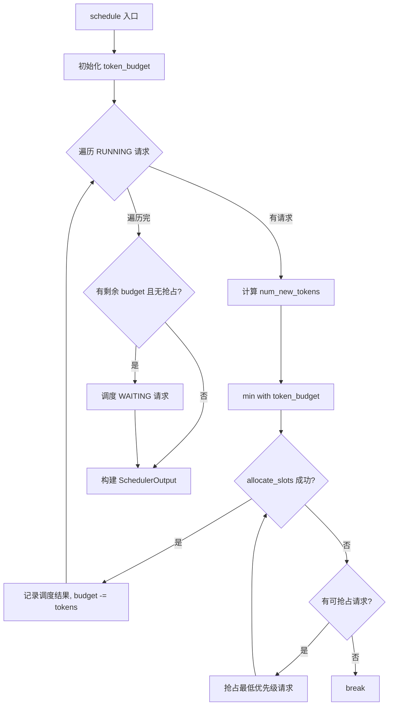
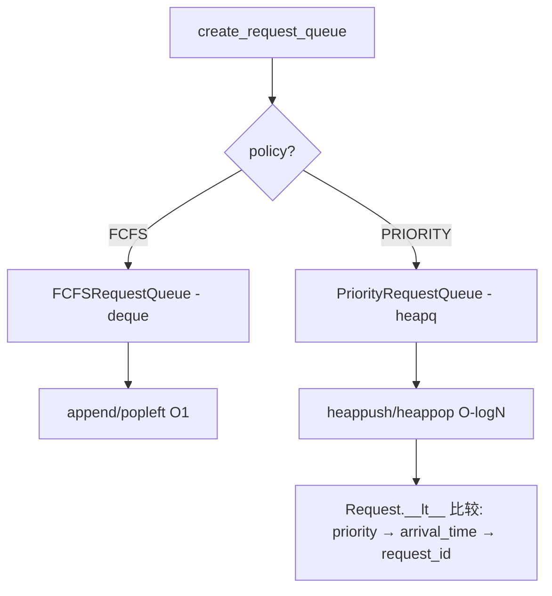
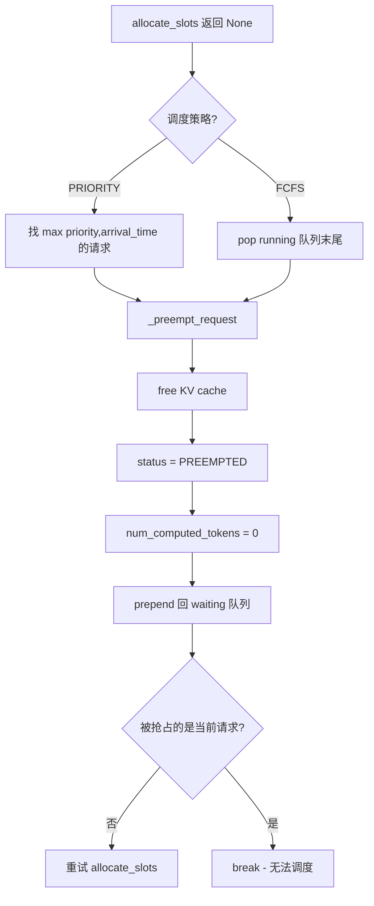

# PD-379.01 vLLM — 连续批处理调度器

> 文档编号：PD-379.01
> 来源：vLLM `vllm/v1/core/sched/scheduler.py`
> GitHub：https://github.com/vllm-project/vllm.git
> 问题域：PD-379 连续批处理调度 Continuous Batching Scheduler
> 状态：可复用方案

---

## 第 1 章 问题与动机

### 1.1 核心问题

LLM 推理服务面临一个根本矛盾：prefill（首次处理 prompt）是计算密集型，decode（逐 token 生成）是内存带宽密集型。传统静态批处理（static batching）要求一个 batch 内所有请求同时开始、同时结束，导致 GPU 利用率极低——短请求等长请求，新请求等旧 batch 完成。

连续批处理（continuous batching）的核心思想是：**每个调度步（iteration）独立决定哪些请求参与计算、每个请求处理多少 token**，从而实现请求的动态进出、prefill 与 decode 的混合执行。

### 1.2 vLLM 的解法概述

vLLM v1 的 Scheduler 是一个**统一的 iteration-level 调度器**，核心设计：

1. **无阶段区分**：不区分 "prefill 阶段" 和 "decode 阶段"，每个请求只有 `num_computed_tokens` 和 `num_tokens_with_spec`，调度器让前者追赶后者（`scheduler.py:322-332`）
2. **Token 预算制**：每步有 `max_num_scheduled_tokens` 总预算，先分配给 RUNNING 请求（decode），再分配给 WAITING 请求（prefill），预算耗尽即停（`scheduler.py:341`）
3. **策略模式队列**：通过 `SchedulingPolicy` 枚举 + 工厂函数支持 FCFS 和 Priority 两种调度策略（`request_queue.py:13-208`）
4. **抢占式调度**：当 KV cache 不足时，抢占最低优先级的 RUNNING 请求，释放其 KV cache 给更高优先级请求（`scheduler.py:448-480`）
5. **异步调度**：`AsyncScheduler` 子类在当前步提前为 decode 请求预分配 placeholder token，避免 GPU 空闲等待调度决策（`async_scheduler.py:12-60`）

### 1.3 设计思想

| 设计原则 | 具体实现 | 理由 | 替代方案 |
|----------|----------|------|----------|
| 统一调度模型 | 用 num_computed_tokens 追赶 num_tokens_with_spec，不区分 prefill/decode | 天然支持 chunked prefill、prefix caching、speculative decoding | 分离 prefill/decode 队列（Orca 原始设计） |
| Token 预算制 | max_num_scheduled_tokens 硬上限，先 RUNNING 后 WAITING | 保证 decode 延迟稳定，prefill 不会饿死 decode | 请求数上限（无法精细控制计算量） |
| 策略模式 | RequestQueue ABC + FCFS/Priority 实现 + 工厂函数 | 解耦调度策略与调度逻辑，易扩展 | if-else 硬编码策略 |
| 抢占恢复 | free KV cache → 状态置 PREEMPTED → 重新入队 | 优先级调度必须支持抢占，否则高优先级请求可能永远等待 | 拒绝新请求（浪费 GPU） |
| 异步流水线 | AsyncScheduler 预分配 output placeholder | 消除调度-执行间的 GPU 空闲间隙 | 同步调度（每步等待调度完成） |

---

## 第 2 章 源码实现分析

### 2.1 架构概览

vLLM v1 调度器的核心组件关系：

```
┌─────────────────────────────────────────────────────────┐
│                    SchedulerInterface (ABC)              │
│  schedule() → SchedulerOutput                           │
│  update_from_output() → EngineCoreOutputs               │
│  add_request() / finish_requests()                      │
└──────────────┬──────────────────────┬───────────────────┘
               │                      │
    ┌──────────▼──────────┐  ┌───────▼────────────────┐
    │     Scheduler       │  │   AsyncScheduler       │
    │  (同步调度)          │  │  (异步调度，继承Scheduler)│
    │                     │  │  预分配 placeholder      │
    └──────┬──────────────┘  └────────────────────────┘
           │
    ┌──────▼──────────────────────────────────────────┐
    │  RequestQueue (ABC)                              │
    │  ├─ FCFSRequestQueue (deque)                     │
    │  └─ PriorityRequestQueue (heapq)                 │
    └──────┬──────────────────────────────────────────┘
           │
    ┌──────▼──────────────────────────────────────────┐
    │  KVCacheManager                                  │
    │  allocate_slots() / free() / get_computed_blocks │
    └─────────────────────────────────────────────────┘
```

### 2.2 核心实现

#### 2.2.1 统一调度循环：RUNNING 请求优先



对应源码 `vllm/v1/core/sched/scheduler.py:322-910`：

```python
def schedule(self) -> SchedulerOutput:
    # NOTE(woosuk) on the scheduling algorithm:
    # There's no "decoding phase" nor "prefill phase" in the scheduler.
    # Each request just has the num_computed_tokens and
    # num_tokens_with_spec. At each step, the scheduler tries to assign
    # tokens to the requests so that each request's num_computed_tokens
    # can catch up its num_tokens_with_spec.

    scheduled_new_reqs: list[Request] = []
    scheduled_resumed_reqs: list[Request] = []
    scheduled_running_reqs: list[Request] = []
    preempted_reqs: list[Request] = []

    token_budget = self.max_num_scheduled_tokens
    if self._pause_state == PauseState.PAUSED_ALL:
        token_budget = 0

    # First, schedule the RUNNING requests.
    req_index = 0
    while req_index < len(self.running) and token_budget > 0:
        request = self.running[req_index]
        num_new_tokens = (
            request.num_tokens_with_spec
            + request.num_output_placeholders
            - request.num_computed_tokens
        )
        num_new_tokens = min(num_new_tokens, token_budget)
        # ... allocate_slots + preemption logic ...
```

#### 2.2.2 策略模式请求队列



对应源码 `vllm/v1/core/sched/request_queue.py:75-208`：

```python
class FCFSRequestQueue(deque[Request], RequestQueue):
    """A first-come-first-served queue that supports deque operations."""
    def add_request(self, request: Request) -> None:
        self.append(request)
    def pop_request(self) -> Request:
        return self.popleft()

class PriorityRequestQueue(RequestQueue):
    """A priority queue that supports heap operations.
    Respects the ordering defined in the Request class, where
    requests with a smaller value of `priority` are processed first."""
    def __init__(self) -> None:
        self._heap: list[Request] = []
    def add_request(self, request: Request) -> None:
        heapq.heappush(self._heap, request)
    def pop_request(self) -> Request:
        return heapq.heappop(self._heap)
```

#### 2.2.3 抢占式调度



对应源码 `vllm/v1/core/sched/scheduler.py:436-484` 和 `912-932`：

```python
# 抢占循环（在 RUNNING 调度中）
while True:
    new_blocks = self.kv_cache_manager.allocate_slots(
        request, num_new_tokens,
        num_lookahead_tokens=self.num_lookahead_tokens,
    )
    if new_blocks is not None:
        break
    # Preempt the lowest-priority request.
    if self.policy == SchedulingPolicy.PRIORITY:
        preempted_req = max(
            self.running,
            key=lambda r: (r.priority, r.arrival_time),
        )
        self.running.remove(preempted_req)
    else:
        preempted_req = self.running.pop()
    self._preempt_request(preempted_req, scheduled_timestamp)
    preempted_reqs.append(preempted_req)

def _preempt_request(self, request: Request, timestamp: float) -> None:
    self.kv_cache_manager.free(request)
    self.encoder_cache_manager.free(request)
    request.status = RequestStatus.PREEMPTED
    request.num_computed_tokens = 0
    request.num_preemptions += 1
    self.waiting.prepend_request(request)
```

### 2.3 实现细节

**Chunked Prefill 控制**：通过 `SchedulerConfig` 的三个参数精细控制 prefill 分块行为：
- `enable_chunked_prefill`：总开关（`config/scheduler.py:83`）
- `max_num_partial_prefills`：最大并发 partial prefill 数（`config/scheduler.py:69`）
- `long_prefill_token_threshold`：长 prompt 阈值，超过此值的 prompt 会被限制并发数（`config/scheduler.py:79`）

**PauseState 三态控制**（`interface.py:22-33`）：
- `UNPAUSED`：正常调度
- `PAUSED_NEW`：只调度 RUNNING 请求，不接受新请求
- `PAUSED_ALL`：完全暂停，token_budget 设为 0

**请求状态机**（`request.py:307-319`）：
```
WAITING → RUNNING → FINISHED_STOPPED/FINISHED_LENGTH_CAPPED
WAITING → WAITING_FOR_FSM → WAITING → RUNNING
RUNNING → PREEMPTED → WAITING → RUNNING
WAITING → WAITING_FOR_REMOTE_KVS → WAITING → RUNNING
```

---

## 第 3 章 迁移指南

### 3.1 迁移清单

**阶段 1：核心调度框架**
- [ ] 实现 `RequestQueue` 抽象基类 + FCFS/Priority 两种实现
- [ ] 实现 `Request` 数据结构，包含 `num_computed_tokens`、`priority`、`arrival_time`
- [ ] 实现 `Scheduler.schedule()` 主循环：先 RUNNING 后 WAITING 的 token 预算分配

**阶段 2：KV Cache 集成**
- [ ] 实现 `KVCacheManager` 的 `allocate_slots()` / `free()` 接口
- [ ] 实现抢占逻辑：allocate 失败时抢占低优先级请求

**阶段 3：高级特性**
- [ ] Chunked prefill：支持 `max_num_partial_prefills` 和 `long_prefill_token_threshold`
- [ ] AsyncScheduler：预分配 output placeholder 实现异步流水线
- [ ] PauseState：支持优雅暂停/恢复

### 3.2 适配代码模板

以下是一个可运行的最小调度器框架，提取了 vLLM 的核心调度逻辑：

```python
"""Minimal continuous batching scheduler inspired by vLLM v1."""
import heapq
import time
from abc import ABC, abstractmethod
from collections import deque
from dataclasses import dataclass, field
from enum import Enum
from typing import Iterator


class SchedulingPolicy(Enum):
    FCFS = "fcfs"
    PRIORITY = "priority"


@dataclass
class Request:
    request_id: str
    prompt_tokens: list[int]
    priority: int = 0
    arrival_time: float = field(default_factory=time.time)
    num_computed_tokens: int = 0
    num_preemptions: int = 0
    max_tokens: int = 256
    status: str = "waiting"

    @property
    def num_tokens(self) -> int:
        return len(self.prompt_tokens) + self.num_computed_tokens

    @property
    def num_new_tokens_needed(self) -> int:
        """Tokens remaining to be computed in this step."""
        total = len(self.prompt_tokens) + self.max_tokens
        return min(total - self.num_computed_tokens, 1 if self.status == "running" else total)

    def __lt__(self, other: "Request") -> bool:
        if self.priority != other.priority:
            return self.priority < other.priority
        return self.arrival_time < other.arrival_time


class RequestQueue(ABC):
    @abstractmethod
    def add(self, req: Request) -> None: ...
    @abstractmethod
    def pop(self) -> Request: ...
    @abstractmethod
    def prepend(self, req: Request) -> None: ...
    @abstractmethod
    def __bool__(self) -> bool: ...
    @abstractmethod
    def __len__(self) -> int: ...
    @abstractmethod
    def __iter__(self) -> Iterator[Request]: ...


class FCFSQueue(deque, RequestQueue):
    def add(self, req): self.append(req)
    def pop(self): return self.popleft()
    def prepend(self, req): self.appendleft(req)
    def __bool__(self): return len(self) > 0


class PriorityQueue(RequestQueue):
    def __init__(self):
        self._heap: list[Request] = []
    def add(self, req): heapq.heappush(self._heap, req)
    def pop(self): return heapq.heappop(self._heap)
    def prepend(self, req): self.add(req)  # priority queue has no "front"
    def __bool__(self): return bool(self._heap)
    def __len__(self): return len(self._heap)
    def __iter__(self):
        copy = self._heap[:]
        while copy:
            yield heapq.heappop(copy)


@dataclass
class SchedulerOutput:
    scheduled_tokens: dict[str, int]  # req_id -> num_tokens
    preempted: list[str]
    new_requests: list[str]


class ContinuousBatchingScheduler:
    def __init__(
        self,
        max_num_seqs: int = 128,
        max_num_batched_tokens: int = 2048,
        policy: SchedulingPolicy = SchedulingPolicy.FCFS,
        enable_chunked_prefill: bool = True,
    ):
        self.max_num_seqs = max_num_seqs
        self.max_num_batched_tokens = max_num_batched_tokens
        self.enable_chunked_prefill = enable_chunked_prefill
        self.policy = policy

        self.waiting: RequestQueue = (
            PriorityQueue() if policy == SchedulingPolicy.PRIORITY
            else FCFSQueue()
        )
        self.running: list[Request] = []

    def add_request(self, request: Request) -> None:
        self.waiting.add(request)

    def schedule(self) -> SchedulerOutput:
        scheduled: dict[str, int] = {}
        preempted: list[str] = []
        new_reqs: list[str] = []
        budget = self.max_num_batched_tokens

        # Phase 1: Schedule RUNNING requests (decode)
        for req in self.running:
            num_new = min(1, budget)  # decode = 1 token per step
            if num_new <= 0:
                break
            scheduled[req.request_id] = num_new
            budget -= num_new

        # Phase 2: Schedule WAITING requests (prefill)
        while self.waiting and budget > 0:
            if len(self.running) >= self.max_num_seqs:
                break
            req = self.waiting.pop()
            num_new = len(req.prompt_tokens) - req.num_computed_tokens
            if not self.enable_chunked_prefill and num_new > budget:
                self.waiting.prepend(req)
                break
            num_new = min(num_new, budget)
            scheduled[req.request_id] = num_new
            budget -= num_new
            req.status = "running"
            self.running.append(req)
            new_reqs.append(req.request_id)

        return SchedulerOutput(
            scheduled_tokens=scheduled,
            preempted=preempted,
            new_requests=new_reqs,
        )
```

### 3.3 适用场景

| 场景 | 适用度 | 说明 |
|------|--------|------|
| 高吞吐 LLM 推理服务 | ⭐⭐⭐ | 核心场景，连续批处理最大化 GPU 利用率 |
| 多优先级 SLA 服务 | ⭐⭐⭐ | Priority 队列 + 抢占机制天然支持 |
| 长上下文 + 短请求混合 | ⭐⭐⭐ | Chunked prefill 避免长 prompt 阻塞短请求 |
| 单请求低延迟场景 | ⭐⭐ | 连续批处理引入调度开销，单请求场景收益有限 |
| 非 LLM 的通用批处理 | ⭐ | 设计高度耦合 KV cache 和 token 概念 |

---

## 第 4 章 测试用例

```python
"""Tests for continuous batching scheduler components."""
import time
import pytest


class TestFCFSRequestQueue:
    """Tests for FCFSRequestQueue based on request_queue.py:75-128."""

    def test_fifo_ordering(self):
        from collections import deque
        queue = deque()
        r1 = {"id": "r1", "time": 1.0}
        r2 = {"id": "r2", "time": 2.0}
        queue.append(r1)
        queue.append(r2)
        assert queue.popleft() == r1
        assert queue.popleft() == r2

    def test_prepend_request(self):
        queue = deque()
        r1 = {"id": "r1"}
        r2 = {"id": "r2"}
        queue.append(r1)
        queue.appendleft(r2)  # prepend
        assert queue.popleft() == r2

    def test_remove_requests_batch(self):
        queue = deque([1, 2, 3, 4, 5])
        to_remove = {2, 4}
        filtered = [x for x in queue if x not in to_remove]
        queue.clear()
        queue.extend(filtered)
        assert list(queue) == [1, 3, 5]


class TestPriorityRequestQueue:
    """Tests for PriorityRequestQueue based on request_queue.py:131-198."""

    def test_priority_ordering(self):
        import heapq
        heap = []
        heapq.heappush(heap, (2, 1.0, "low"))
        heapq.heappush(heap, (0, 2.0, "high"))
        heapq.heappush(heap, (1, 0.5, "mid"))
        assert heapq.heappop(heap)[2] == "high"
        assert heapq.heappop(heap)[2] == "mid"

    def test_same_priority_fcfs_tiebreak(self):
        import heapq
        heap = []
        heapq.heappush(heap, (0, 1.0, "first"))
        heapq.heappush(heap, (0, 2.0, "second"))
        assert heapq.heappop(heap)[2] == "first"

    def test_prepend_is_add_in_priority_queue(self):
        """Priority queue ignores prepend semantics — always ordered."""
        import heapq
        heap = []
        heapq.heappush(heap, (1, 1.0, "low"))
        heapq.heappush(heap, (0, 2.0, "high"))  # "prepend" = just add
        assert heapq.heappop(heap)[2] == "high"


class TestSchedulerTokenBudget:
    """Tests for token budget allocation logic in scheduler.py:341-492."""

    def test_running_requests_consume_budget_first(self):
        budget = 2048
        running_tokens = [1, 1, 1]  # 3 decode requests, 1 token each
        for t in running_tokens:
            budget -= t
        assert budget == 2045  # plenty left for prefill

    def test_budget_exhaustion_stops_scheduling(self):
        budget = 10
        # Simulate a large prefill request
        prefill_tokens = 100
        scheduled = min(prefill_tokens, budget)
        assert scheduled == 10
        budget -= scheduled
        assert budget == 0

    def test_chunked_prefill_respects_budget(self):
        budget = 512
        prompt_len = 2048
        num_computed = 0
        num_new = min(prompt_len - num_computed, budget)
        assert num_new == 512  # chunked to budget


class TestPreemption:
    """Tests for preemption logic in scheduler.py:448-480."""

    def test_preempt_lowest_priority(self):
        running = [
            {"id": "high", "priority": 0, "arrival": 1.0},
            {"id": "low", "priority": 2, "arrival": 2.0},
        ]
        preempted = max(running, key=lambda r: (r["priority"], r["arrival"]))
        assert preempted["id"] == "low"

    def test_preempt_resets_computed_tokens(self):
        computed = 500
        # After preemption: reset to 0 (scheduler.py:924)
        computed = 0
        assert computed == 0

    def test_preempted_request_goes_to_waiting(self):
        from collections import deque
        waiting = deque()
        preempted_req = {"id": "preempted", "status": "PREEMPTED"}
        waiting.appendleft(preempted_req)  # prepend
        assert waiting[0] == preempted_req
```

---

## 第 5 章 跨域关联

| 关联域 | 关系类型 | 说明 |
|--------|----------|------|
| PD-380 KV Cache 分页管理 | 强依赖 | Scheduler 的 allocate_slots/free 直接调用 KVCacheManager，抢占逻辑依赖 KV cache 释放 |
| PD-375 投机解码 | 协同 | Scheduler 通过 spec_token_ids 和 num_output_placeholders 支持投机解码的 draft-verify 循环 |
| PD-376 分布式并行推理 | 协同 | Scheduler 通过 KVConnector 支持 P/D 分离（prefill-decode disaggregation），跨引擎 KV 传输 |
| PD-385 弹性伸缩 | 协同 | PauseState 三态控制支持优雅暂停，为弹性伸缩提供调度层配合 |
| PD-01 上下文管理 | 间接关联 | Chunked prefill 本质上是对长上下文的分块处理策略 |
| PD-02 多 Agent 编排 | 间接关联 | 多引擎负载均衡（multi-engine）场景下，Scheduler 的 finished_req_ids_dict 按 client_index 分发输出 |

---

## 第 6 章 来源文件索引

| 文件 | 行范围 | 关键实现 |
|------|--------|----------|
| `vllm/v1/core/sched/scheduler.py` | L63-270 | Scheduler.__init__：初始化调度约束、KV cache 管理器、请求队列 |
| `vllm/v1/core/sched/scheduler.py` | L322-910 | Scheduler.schedule()：核心调度循环，RUNNING→WAITING 两阶段 token 预算分配 |
| `vllm/v1/core/sched/scheduler.py` | L912-932 | _preempt_request()：抢占请求，释放 KV cache，重置状态 |
| `vllm/v1/core/sched/scheduler.py` | L934-966 | _update_after_schedule()：推进 num_computed_tokens |
| `vllm/v1/core/sched/scheduler.py` | L1258-1494 | update_from_output()：处理模型输出，更新请求状态 |
| `vllm/v1/core/sched/request_queue.py` | L13-18 | SchedulingPolicy 枚举：FCFS / PRIORITY |
| `vllm/v1/core/sched/request_queue.py` | L20-72 | RequestQueue ABC：抽象队列接口 |
| `vllm/v1/core/sched/request_queue.py` | L75-128 | FCFSRequestQueue：基于 deque 的 FIFO 队列 |
| `vllm/v1/core/sched/request_queue.py` | L131-198 | PriorityRequestQueue：基于 heapq 的优先级队列 |
| `vllm/v1/core/sched/request_queue.py` | L201-208 | create_request_queue()：工厂函数 |
| `vllm/config/scheduler.py` | L26-300 | SchedulerConfig：调度配置（chunked prefill、max tokens、策略等） |
| `vllm/v1/core/sched/interface.py` | L22-33 | PauseState 枚举：UNPAUSED / PAUSED_NEW / PAUSED_ALL |
| `vllm/v1/core/sched/interface.py` | L36-244 | SchedulerInterface ABC：调度器抽象接口 |
| `vllm/v1/core/sched/async_scheduler.py` | L12-60 | AsyncScheduler：异步调度，预分配 output placeholder |
| `vllm/v1/core/sched/output.py` | L179-248 | SchedulerOutput：调度输出数据结构 |
| `vllm/v1/core/sched/utils.py` | L8-37 | remove_all()：优化的批量移除（单元素快速路径） |
| `vllm/v1/core/sched/utils.py` | L40-64 | check_stop()：请求停止条件检查 |
| `vllm/v1/request.py` | L59-178 | Request 类：请求数据结构，含 priority、arrival_time、num_computed_tokens |
| `vllm/v1/request.py` | L293-304 | Request.__lt__()：优先级比较（priority → arrival_time → request_id） |
| `vllm/v1/request.py` | L307-319 | RequestStatus 枚举：7 种请求状态 |

---

## 第 7 章 横向对比维度

```json comparison_data
{
  "project": "vLLM",
  "dimensions": {
    "调度模型": "统一 iteration-level 调度，num_computed_tokens 追赶 num_tokens_with_spec，不区分 prefill/decode 阶段",
    "队列策略": "策略模式 ABC + FCFS(deque) / Priority(heapq) 双实现 + 工厂函数",
    "抢占机制": "KV cache 不足时抢占最低优先级 RUNNING 请求，free cache → PREEMPTED → 重新入队",
    "预算控制": "Token 预算制：max_num_scheduled_tokens 硬上限，先 RUNNING 后 WAITING 两阶段分配",
    "异步流水线": "AsyncScheduler 预分配 output placeholder，消除调度-执行间 GPU 空闲",
    "暂停控制": "PauseState 三态（UNPAUSED/PAUSED_NEW/PAUSED_ALL）支持优雅暂停恢复",
    "Chunked Prefill": "三参数精细控制：enable_chunked_prefill + max_num_partial_prefills + long_prefill_token_threshold"
  }
}
```

### 域元数据补充

```json domain_metadata
{
  "solution_summary": "vLLM 用统一 iteration-level 调度器 + Token 预算制 + 策略模式队列（FCFS/Priority）实现连续批处理，支持 KV cache 抢占恢复和 AsyncScheduler 异步流水线",
  "description": "调度器需要在 GPU 利用率、请求延迟和公平性之间动态权衡",
  "sub_problems": [
    "异步调度与同步调度的 placeholder 管理",
    "Chunked prefill 并发数与长 prompt 阈值调优",
    "调度暂停与恢复的状态机设计"
  ],
  "best_practices": [
    "先调度 RUNNING 再调度 WAITING 保证 decode 延迟稳定",
    "用策略模式解耦调度策略与调度逻辑便于扩展",
    "抢占后重置 num_computed_tokens 为 0 简化恢复逻辑"
  ]
}
```
