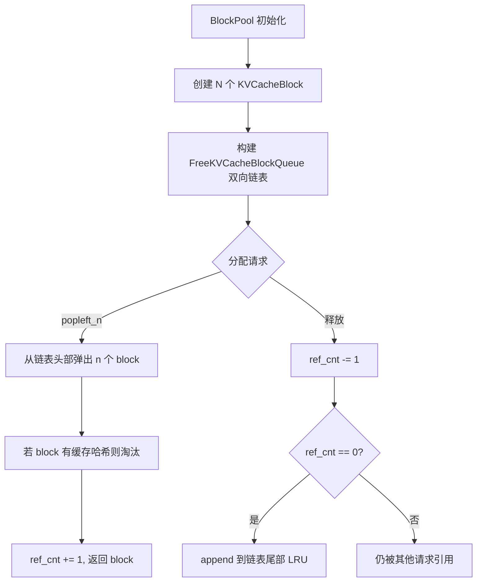
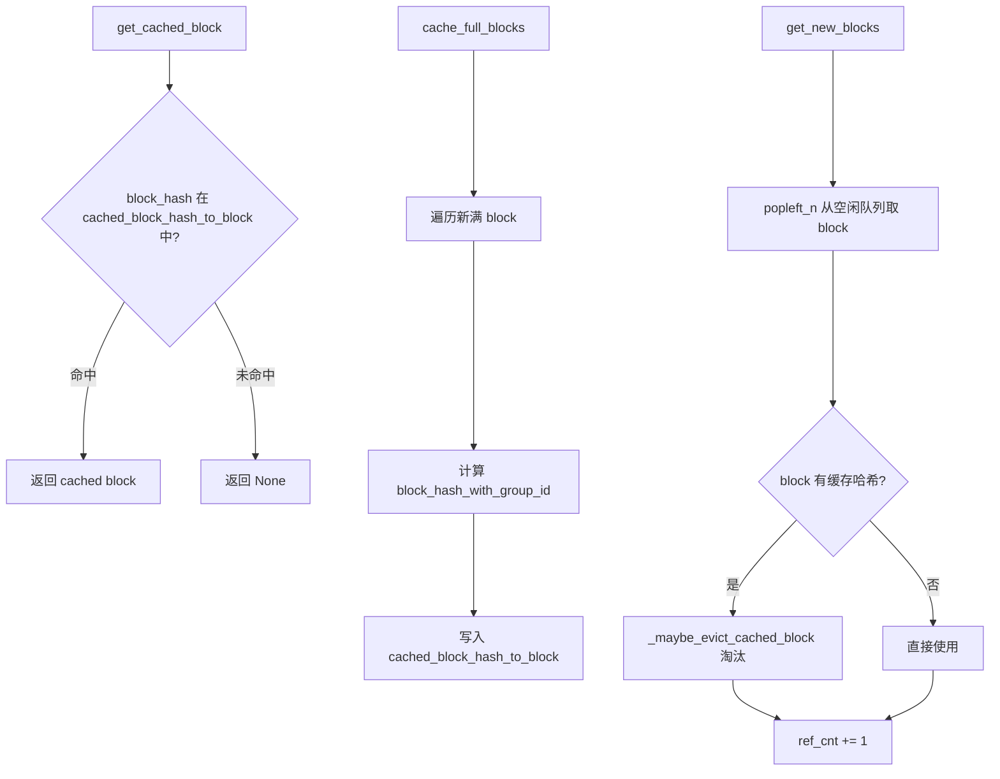
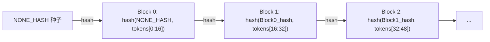
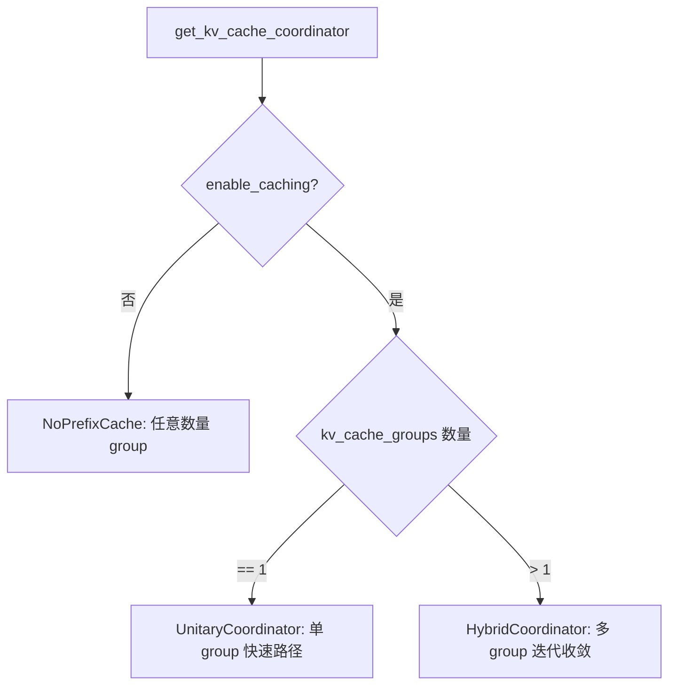

# PD-380.01 vLLM — PagedAttention 分页 KV Cache 管理

> 文档编号：PD-380.01
> 来源：vLLM `vllm/v1/core/kv_cache_manager.py`, `vllm/v1/core/block_pool.py`, `vllm/v1/core/kv_cache_coordinator.py`
> GitHub：https://github.com/vllm-project/vllm.git
> 问题域：PD-380 KV Cache 分页管理 KV Cache Paged Management
> 状态：可复用方案

---

## 第 1 章 问题与动机

### 1.1 核心问题

LLM 推理中，KV Cache 是内存消耗的主要来源。传统实现为每个请求预分配连续的最大长度内存，导致严重的内部碎片（平均浪费 60-80% GPU 显存）。当并发请求增多时，显存利用率极低，直接限制了吞吐量。

核心挑战：
- **内部碎片**：预分配 max_seq_len 大小的连续内存，实际使用远小于分配量
- **外部碎片**：请求完成后释放的内存块大小不一，难以被新请求复用
- **前缀浪费**：多个请求共享相同 system prompt 时，KV Cache 被重复计算和存储
- **层级异构**：混合模型（如 Gemma3）中不同注意力层（full/sliding window/chunked local）需要不同的 block 管理策略

### 1.2 vLLM 的解法概述

vLLM 首创 PagedAttention，借鉴操作系统虚拟内存分页思想，将 KV Cache 按固定大小的 block 管理：

1. **Block 分页管理**：将 KV Cache 切分为固定大小的 block（默认 16 tokens），通过 `BlockPool` 统一管理分配和回收，消除内部碎片（`vllm/v1/core/block_pool.py:129`）
2. **哈希前缀缓存**：对每个 block 的 token 序列计算链式哈希（parent_hash + token_ids），相同前缀的请求自动共享 block，避免重复计算（`vllm/v1/core/kv_cache_utils.py:532-559`）
3. **LRU 淘汰队列**：空闲 block 组织为双向链表，支持 O(1) 的分配、释放和中间删除，LRU 策略淘汰最久未用的缓存 block（`vllm/v1/core/kv_cache_utils.py:158-366`）
4. **三级 Coordinator 架构**：根据模型注意力类型自动选择 Unitary/Hybrid/NoPrefixCache 协调器，统一管理多种注意力层的 block 分配（`vllm/v1/core/kv_cache_coordinator.py:547-591`）
5. **KV Offload/Transfer 扩展**：通过 `KVConnectorBase_V1` 抽象接口支持 KV Cache 到 CPU/磁盘的 offload 和跨节点 P/D 传输（`vllm/distributed/kv_transfer/kv_connector/v1/base.py:147`）

### 1.3 设计思想

| 设计原则 | 具体实现 | 理由 | 替代方案 |
|----------|----------|------|----------|
| OS 虚拟内存分页 | 固定 block_size 的 KVCacheBlock，block_table 映射逻辑→物理 | 消除碎片，支持非连续存储 | 连续预分配（浪费显存） |
| 链式哈希前缀匹配 | hash(parent_hash, token_ids, extra_keys) 递归计算 | O(1) 前缀查找，支持 LoRA/多模态区分 | Trie 树（内存开销大） |
| 双向链表 LRU | FreeKVCacheBlockQueue 自定义双向链表 | O(1) 中间删除（touch 时移出空闲队列） | Python deque（不支持 O(1) 中间删除） |
| 策略模式 Coordinator | Unitary/Hybrid/NoPrefixCache 三种协调器 | 单类型模型零开销，混合模型自动适配 | 统一复杂逻辑（单类型模型有冗余开销） |
| Connector 抽象 | KVConnectorBase_V1 + Scheduler/Worker 双角色 | 解耦 offload/transfer 策略，支持 NIXL/LMCache/Mooncake 等多后端 | 硬编码 offload 逻辑 |

---

## 第 2 章 源码实现分析

### 2.1 架构概览

vLLM v1 的 KV Cache 管理采用四层架构：

```
┌─────────────────────────────────────────────────────────────┐
│                    KVCacheManager                           │
│  (Scheduler 入口，面向 Request 的高层 API)                    │
│  kv_cache_manager.py:94                                     │
├─────────────────────────────────────────────────────────────┤
│              KVCacheCoordinator                             │
│  (协调多 KV Cache Group，策略选择)                            │
│  Unitary │ Hybrid │ NoPrefixCache                           │
│  kv_cache_coordinator.py:28                                 │
├─────────────────────────────────────────────────────────────┤
│           SingleTypeKVCacheManager                          │
│  (每种注意力类型的 block 分配逻辑)                             │
│  FullAttn │ SlidingWindow │ ChunkedLocal │ Mamba            │
│  single_type_kv_cache_manager.py:28                         │
├─────────────────────────────────────────────────────────────┤
│                    BlockPool                                │
│  (物理 block 池，LRU 淘汰，哈希缓存)                          │
│  block_pool.py:129                                          │
├─────────────────────────────────────────────────────────────┤
│              FreeKVCacheBlockQueue                           │
│  (双向链表，O(1) 分配/释放/中间删除)                           │
│  kv_cache_utils.py:158                                      │
└─────────────────────────────────────────────────────────────┘
```

### 2.2 核心实现

#### 2.2.1 KVCacheBlock 与 FreeKVCacheBlockQueue — 分页基础设施



对应源码 `vllm/v1/core/kv_cache_utils.py:109-155`：

```python
@dataclass
class KVCacheBlock:
    """KV-cache block metadata."""
    block_id: int
    ref_cnt: int = 0
    _block_hash: BlockHashWithGroupId | None = None
    # 双向链表指针，仅由 FreeKVCacheBlockQueue 操作
    prev_free_block: "KVCacheBlock | None" = None
    next_free_block: "KVCacheBlock | None" = None
    is_null: bool = False

    @block_hash.setter
    def block_hash(self, block_hash: BlockHashWithGroupId):
        assert self.block_hash is None
        self._block_hash = block_hash

    def reset_hash(self):
        """淘汰时重置哈希"""
        self._block_hash = None
```

`FreeKVCacheBlockQueue` 的关键设计是使用 fake head/tail 哨兵节点避免分支判断，并且不分配任何 Python 对象来操作链表（直接修改 block 的 prev/next 指针），缩小与 C++ deque 的性能差距。

对应源码 `vllm/v1/core/kv_cache_utils.py:210-245`（popleft 操作）：

```python
def popleft(self) -> KVCacheBlock:
    if (self.fake_free_list_head.next_free_block
            is self.fake_free_list_tail):
        raise ValueError("No free blocks available")
    first_block = self.fake_free_list_head.next_free_block
    # 直接修改指针，零分配
    self.fake_free_list_head.next_free_block = first_block.next_free_block
    first_block.next_free_block.prev_free_block = self.fake_free_list_head
    first_block.prev_free_block = first_block.next_free_block = None
    self.num_free_blocks -= 1
    return first_block
```

#### 2.2.2 BlockPool — 物理 block 管理与前缀缓存



对应源码 `vllm/v1/core/block_pool.py:129-180`：

```python
class BlockPool:
    def __init__(self, num_gpu_blocks, enable_caching, hash_block_size,
                 enable_kv_cache_events=False, metrics_collector=None):
        self.blocks = [KVCacheBlock(idx) for idx in range(num_gpu_blocks)]
        self.free_block_queue = FreeKVCacheBlockQueue(self.blocks)
        self.cached_block_hash_to_block = BlockHashToBlockMap()
        # null_block: 占位 block，block_id=0，永不被缓存
        self.null_block = self.free_block_queue.popleft()
        self.null_block.is_null = True
```

`BlockHashToBlockMap` 使用 `dict[BlockHashWithGroupId, KVCacheBlock | dict[int, KVCacheBlock]]` 的联合类型，单 block 时直接存储避免 dict 开销，多 block 时自动升级为 dict，减少 GC 压力（`block_pool.py:33-127`）。

#### 2.2.3 链式哈希 — 前缀缓存的核心



对应源码 `vllm/v1/core/kv_cache_utils.py:532-559`：

```python
def hash_block_tokens(
    hash_function: Callable[[Any], bytes],
    parent_block_hash: BlockHash | None,
    curr_block_token_ids: Sequence[int],
    extra_keys: tuple[Any, ...] | None = None,
) -> BlockHash:
    if not parent_block_hash:
        parent_block_hash = NONE_HASH
    curr_block_token_ids_tuple = tuple(curr_block_token_ids)
    return BlockHash(
        hash_function((parent_block_hash, curr_block_token_ids_tuple, extra_keys))
    )
```

`extra_keys` 支持 LoRA adapter 名称、多模态特征标识符、cache_salt 和 prompt embeddings 哈希，确保不同上下文的 block 不会错误共享。`NONE_HASH` 使用 `os.urandom(32)` 或 `PYTHONHASHSEED` 初始化，保证跨进程可控。

#### 2.2.4 三级 Coordinator — 混合模型适配



`HybridKVCacheCoordinator.find_longest_cache_hit` 使用迭代定点算法：每种注意力类型要么接受当前候选长度，要么缩短它；若任何类型缩短了长度，则重新检查所有类型。由于长度单调递减且下界为 0，算法保证收敛（`kv_cache_coordinator.py:453-544`）。

### 2.3 实现细节

**KV Offload 架构**：`OffloadingConnector` 分为 Scheduler 侧和 Worker 侧两个角色。Scheduler 侧通过 `OffloadingManager` 管理 offload 元数据（哪些 block 需要 store/load），Worker 侧通过 `OffloadingWorker` 执行实际的 GPU↔CPU 数据传输。Store 操作被延迟到下一个 engine step 开始时提交，避免与 token sampling 竞争 GPU 带宽（`offloading_connector.py:643-646`）。

**Block Table GPU 映射**：`BlockTables` 类使用 Triton kernel 将逻辑 block_id 映射到物理 slot_id，支持 Context Parallelism（DCP/PCP）下的分片映射。每个 KV Cache Group 有独立的 block table，通过 `StagedWriteTensor` 实现 CPU→GPU 的批量写入（`gpu/block_table.py:13-155`）。

**KVCacheSpec 层级体系**：`KVCacheSpec` → `AttentionSpec` → `FullAttentionSpec` / `SlidingWindowSpec` / `ChunkedLocalAttentionSpec` / `MLAAttentionSpec` / `MambaSpec`，每种 spec 定义自己的 `page_size_bytes` 和 `max_memory_usage_bytes`，支持混合模型中不同层的异构内存需求（`kv_cache_interface.py:20-301`）。

---

## 第 3 章 迁移指南

### 3.1 迁移清单

**阶段 1：基础分页（1 周）**
- [ ] 实现 `KVCacheBlock` 数据结构（block_id, ref_cnt, 双向链表指针）
- [ ] 实现 `FreeKVCacheBlockQueue` 双向链表（popleft, append, remove）
- [ ] 实现 `BlockPool`（初始化 block 数组 + 空闲队列）
- [ ] 实现 `BlockTable` 逻辑→物理映射（可先用 Python dict，后优化为 Triton kernel）

**阶段 2：前缀缓存（1 周）**
- [ ] 实现链式哈希函数 `hash_block_tokens`
- [ ] 在 `BlockPool` 中添加 `cached_block_hash_to_block` 映射
- [ ] 实现 `get_cached_block` / `cache_full_blocks` 接口
- [ ] 实现 LRU 淘汰：分配时检查空闲 block 是否有缓存哈希，有则淘汰

**阶段 3：混合模型支持（可选）**
- [ ] 实现 `KVCacheSpec` 层级体系（FullAttention / SlidingWindow / ChunkedLocal）
- [ ] 实现 `SingleTypeKVCacheManager` 子类
- [ ] 实现 `KVCacheCoordinator`（Unitary / Hybrid 策略选择）

**阶段 4：KV Offload（可选）**
- [ ] 实现 `KVConnectorBase_V1` 抽象接口
- [ ] 实现 `OffloadingConnector`（Scheduler + Worker 双角色）
- [ ] 实现 `OffloadingManager` 管理 offload 元数据

### 3.2 适配代码模板

以下是一个可独立运行的简化版 PagedAttention block 管理器：

```python
from __future__ import annotations
from dataclasses import dataclass, field
from collections import OrderedDict
from typing import Sequence
import hashlib

# ---- Block 数据结构 ----
@dataclass
class KVBlock:
    block_id: int
    ref_cnt: int = 0
    block_hash: str | None = None
    prev_free: KVBlock | None = field(default=None, repr=False)
    next_free: KVBlock | None = field(default=None, repr=False)

# ---- 双向链表空闲队列 ----
class FreeBlockQueue:
    def __init__(self, blocks: list[KVBlock]):
        self.head = KVBlock(block_id=-1)  # sentinel
        self.tail = KVBlock(block_id=-2)  # sentinel
        self.head.next_free = self.tail
        self.tail.prev_free = self.head
        self.count = 0
        for b in blocks:
            self.append(b)

    def append(self, block: KVBlock):
        block.prev_free = self.tail.prev_free
        block.next_free = self.tail
        self.tail.prev_free.next_free = block
        self.tail.prev_free = block
        self.count += 1

    def popleft(self) -> KVBlock:
        if self.count == 0:
            raise RuntimeError("No free blocks")
        block = self.head.next_free
        self.head.next_free = block.next_free
        block.next_free.prev_free = self.head
        block.prev_free = block.next_free = None
        self.count -= 1
        return block

    def remove(self, block: KVBlock):
        if block.prev_free is None:
            return  # not in queue
        block.prev_free.next_free = block.next_free
        block.next_free.prev_free = block.prev_free
        block.prev_free = block.next_free = None
        self.count -= 1

# ---- 链式哈希 ----
NONE_HASH = hashlib.sha256(b"seed").hexdigest()

def hash_block_tokens(parent_hash: str | None,
                      token_ids: Sequence[int]) -> str:
    parent = parent_hash or NONE_HASH
    data = f"{parent}:{tuple(token_ids)}"
    return hashlib.sha256(data.encode()).hexdigest()

# ---- Block Pool ----
class BlockPool:
    def __init__(self, num_blocks: int, block_size: int = 16):
        self.block_size = block_size
        self.blocks = [KVBlock(i) for i in range(num_blocks)]
        self.free_queue = FreeBlockQueue(self.blocks)
        self.hash_to_block: dict[str, KVBlock] = {}

    @property
    def num_free_blocks(self) -> int:
        return self.free_queue.count

    def allocate(self, count: int) -> list[KVBlock]:
        result = []
        for _ in range(count):
            block = self.free_queue.popleft()
            if block.block_hash and block.block_hash in self.hash_to_block:
                del self.hash_to_block[block.block_hash]
                block.block_hash = None
            block.ref_cnt += 1
            result.append(block)
        return result

    def free(self, blocks: list[KVBlock]):
        for block in blocks:
            block.ref_cnt -= 1
            if block.ref_cnt == 0:
                self.free_queue.append(block)

    def cache_block(self, block: KVBlock, block_hash: str):
        block.block_hash = block_hash
        self.hash_to_block[block_hash] = block

    def get_cached(self, block_hash: str) -> KVBlock | None:
        block = self.hash_to_block.get(block_hash)
        if block and block.ref_cnt == 0:
            self.free_queue.remove(block)
            block.ref_cnt += 1
            return block
        elif block:
            block.ref_cnt += 1
            return block
        return None

    def touch(self, block: KVBlock):
        """将 block 移到 LRU 尾部（最近使用）"""
        if block.ref_cnt == 0 and block.prev_free is not None:
            self.free_queue.remove(block)
            self.free_queue.append(block)
```

### 3.3 适用场景

| 场景 | 适用度 | 说明 |
|------|--------|------|
| 高并发 LLM 推理服务 | ⭐⭐⭐ | 核心场景，显存利用率提升 2-4x |
| 共享 system prompt 的 API 服务 | ⭐⭐⭐ | prefix caching 避免重复计算 |
| 长上下文模型（128K+） | ⭐⭐⭐ | 分页管理避免连续内存分配失败 |
| 混合注意力模型（Gemma3 等） | ⭐⭐ | 需要 Hybrid Coordinator |
| 单请求低延迟场景 | ⭐ | 分页管理有少量 overhead |
| 非 Transformer 模型（纯 Mamba） | ⭐ | Mamba 状态管理不同于 KV Cache |

---

## 第 4 章 测试用例

```python
import pytest
from typing import Sequence

# 使用第 3 章的适配代码模板
# from kv_cache_pool import BlockPool, KVBlock, hash_block_tokens, NONE_HASH

class TestFreeBlockQueue:
    def test_fifo_order(self):
        """空闲队列应按 FIFO 顺序分配"""
        pool = BlockPool(num_blocks=4, block_size=16)
        blocks = pool.allocate(3)
        assert [b.block_id for b in blocks] == [0, 1, 2]

    def test_free_and_reuse(self):
        """释放的 block 应回到队列尾部（LRU）"""
        pool = BlockPool(num_blocks=3, block_size=16)
        blocks = pool.allocate(3)
        pool.free([blocks[0]])  # block 0 回到尾部
        new_block = pool.allocate(1)[0]
        assert new_block.block_id == 0

    def test_exhaust_raises(self):
        """耗尽 block 应抛出异常"""
        pool = BlockPool(num_blocks=2, block_size=16)
        pool.allocate(2)
        with pytest.raises(RuntimeError, match="No free blocks"):
            pool.allocate(1)

class TestPrefixCaching:
    def test_cache_hit(self):
        """相同前缀应命中缓存"""
        pool = BlockPool(num_blocks=10, block_size=4)
        tokens = [1, 2, 3, 4, 5, 6, 7, 8]
        h0 = hash_block_tokens(None, tokens[:4])
        h1 = hash_block_tokens(h0, tokens[4:8])

        blocks = pool.allocate(2)
        pool.cache_block(blocks[0], h0)
        pool.cache_block(blocks[1], h1)
        pool.free(blocks)

        # 相同前缀应命中
        cached = pool.get_cached(h0)
        assert cached is not None
        assert cached.block_id == blocks[0].block_id

    def test_different_prefix_no_hit(self):
        """不同前缀不应命中"""
        pool = BlockPool(num_blocks=10, block_size=4)
        h_a = hash_block_tokens(None, [1, 2, 3, 4])
        h_b = hash_block_tokens(None, [5, 6, 7, 8])

        blocks = pool.allocate(1)
        pool.cache_block(blocks[0], h_a)
        pool.free(blocks)

        assert pool.get_cached(h_b) is None

    def test_lru_eviction(self):
        """LRU 淘汰：最久未用的缓存 block 应被优先淘汰"""
        pool = BlockPool(num_blocks=3, block_size=4)
        blocks = pool.allocate(3)
        for i, b in enumerate(blocks):
            pool.cache_block(b, f"hash_{i}")
        pool.free(blocks)

        # 触摸 block 0，使其变为最近使用
        pool.touch(blocks[0])

        # 分配 1 个新 block，应淘汰 block 1（最久未用）
        new_blocks = pool.allocate(1)
        assert new_blocks[0].block_id == blocks[1].block_id
        assert new_blocks[0].block_hash is None  # 哈希已被清除

class TestChainedHash:
    def test_deterministic(self):
        """相同输入应产生相同哈希"""
        h1 = hash_block_tokens(None, [1, 2, 3])
        h2 = hash_block_tokens(None, [1, 2, 3])
        assert h1 == h2

    def test_chain_dependency(self):
        """链式哈希应依赖父哈希"""
        h_parent_a = hash_block_tokens(None, [1, 2, 3])
        h_parent_b = hash_block_tokens(None, [4, 5, 6])
        h_child_a = hash_block_tokens(h_parent_a, [7, 8, 9])
        h_child_b = hash_block_tokens(h_parent_b, [7, 8, 9])
        assert h_child_a != h_child_b  # 不同父哈希 → 不同子哈希

    def test_ref_cnt_sharing(self):
        """多个请求共享同一 block 时 ref_cnt 应正确递增"""
        pool = BlockPool(num_blocks=5, block_size=4)
        h = hash_block_tokens(None, [1, 2, 3, 4])
        blocks = pool.allocate(1)
        pool.cache_block(blocks[0], h)

        # 第二个请求命中同一 block
        cached = pool.get_cached(h)
        assert cached.ref_cnt == 2  # 两个请求引用
```

---

## 第 5 章 跨域关联

| 关联域 | 关系类型 | 说明 |
|--------|----------|------|
| PD-01 上下文管理 | 协同 | KV Cache 分页管理直接决定上下文窗口的有效利用率；prefix caching 减少重复计算等价于扩展有效上下文 |
| PD-02 多 Agent 编排 | 协同 | 跨节点 KV Transfer（P/D disaggregation）支持 prefill 和 decode 分离部署，是多 Agent 推理编排的基础设施 |
| PD-03 容错与重试 | 依赖 | KV Offload 到 CPU/磁盘提供了请求被抢占后的恢复能力，避免重新计算；`handle_preemptions` 确保异步 store 完成后才释放 block |
| PD-05 沙箱隔离 | 协同 | Block Pool 的 ref_cnt 机制天然支持多请求共享同一 block 而互不干扰，类似内存页的 COW 隔离 |
| PD-11 可观测性 | 依赖 | `OffloadingConnectorStats` 和 `OffloadPromMetrics` 提供 Prometheus 指标（传输字节数、耗时直方图），是 KV Cache 性能监控的基础 |

---

## 第 6 章 来源文件索引

| 文件 | 行范围 | 关键实现 |
|------|--------|----------|
| `vllm/v1/core/kv_cache_utils.py` | L109-155 | KVCacheBlock 数据结构定义 |
| `vllm/v1/core/kv_cache_utils.py` | L158-366 | FreeKVCacheBlockQueue 双向链表实现 |
| `vllm/v1/core/kv_cache_utils.py` | L532-559 | hash_block_tokens 链式哈希函数 |
| `vllm/v1/core/block_pool.py` | L33-127 | BlockHashToBlockMap 联合类型优化 |
| `vllm/v1/core/block_pool.py` | L129-180 | BlockPool 初始化与核心接口 |
| `vllm/v1/core/kv_cache_manager.py` | L94-200 | KVCacheManager 高层 API |
| `vllm/v1/core/kv_cache_coordinator.py` | L28-100 | KVCacheCoordinator 基类 |
| `vllm/v1/core/kv_cache_coordinator.py` | L453-591 | HybridKVCacheCoordinator 迭代定点算法 |
| `vllm/v1/core/single_type_kv_cache_manager.py` | L28-200 | SingleTypeKVCacheManager 分类型管理 |
| `vllm/v1/kv_cache_interface.py` | L20-301 | KVCacheSpec 层级体系（Full/Sliding/Chunked/MLA/Mamba） |
| `vllm/v1/kv_cache_interface.py` | L374-492 | UniformTypeKVCacheSpecs 与 KVCacheConfig |
| `vllm/v1/worker/gpu/block_table.py` | L13-155 | BlockTables GPU 映射 + Triton kernel |
| `vllm/distributed/kv_transfer/kv_connector/v1/base.py` | L147-608 | KVConnectorBase_V1 抽象接口 |
| `vllm/distributed/kv_transfer/kv_connector/v1/offloading_connector.py` | L116-800 | OffloadingConnector 完整实现 |

---

## 第 7 章 横向对比维度

```json comparison_data
{
  "project": "vLLM",
  "dimensions": {
    "分页策略": "固定 block_size 分页，借鉴 OS 虚拟内存，block_table 逻辑→物理映射",
    "前缀缓存": "链式哈希 hash(parent_hash, token_ids, extra_keys)，支持 LoRA/多模态区分",
    "淘汰策略": "自定义双向链表 LRU，O(1) 分配/释放/中间删除，哨兵节点零分支",
    "混合模型支持": "三级 Coordinator（Unitary/Hybrid/NoPrefixCache）+ KVCacheSpec 层级体系",
    "KV Offload": "Scheduler/Worker 双角色 Connector，延迟 store 避免与 sampling 竞争",
    "GPU 映射": "Triton kernel 计算 slot_mapping，支持 Context Parallelism 分片"
  }
}
```

### 域元数据补充

```json domain_metadata
{
  "solution_summary": "vLLM 用固定 block_size 分页 + 链式哈希前缀缓存 + 双向链表 LRU 淘汰 + 三级 Coordinator 实现异构注意力层的统一 KV Cache 管理",
  "description": "异构注意力层（full/sliding/chunked/MLA/Mamba）的统一分页管理与协调",
  "sub_problems": [
    "混合注意力模型的多 Group 缓存命中长度收敛",
    "Scheduler/Worker 双角色 KV Connector 协调",
    "GPU block_table 到物理 slot 的 Triton kernel 映射"
  ],
  "best_practices": [
    "用哨兵节点双向链表替代 Python deque 实现 O(1) 中间删除",
    "延迟 store 到下一 engine step 避免与 token sampling 竞争 GPU 带宽",
    "链式哈希加入 extra_keys 区分 LoRA/多模态/cache_salt 上下文"
  ]
}
```
