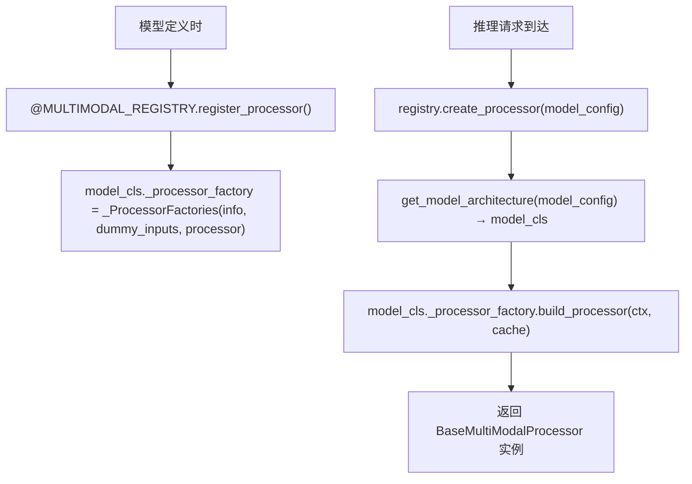
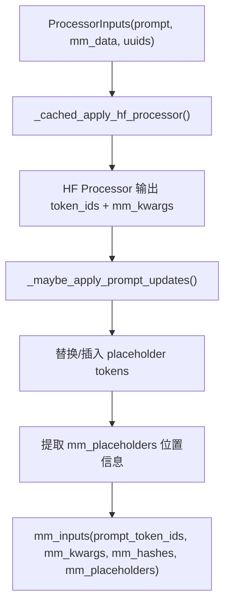
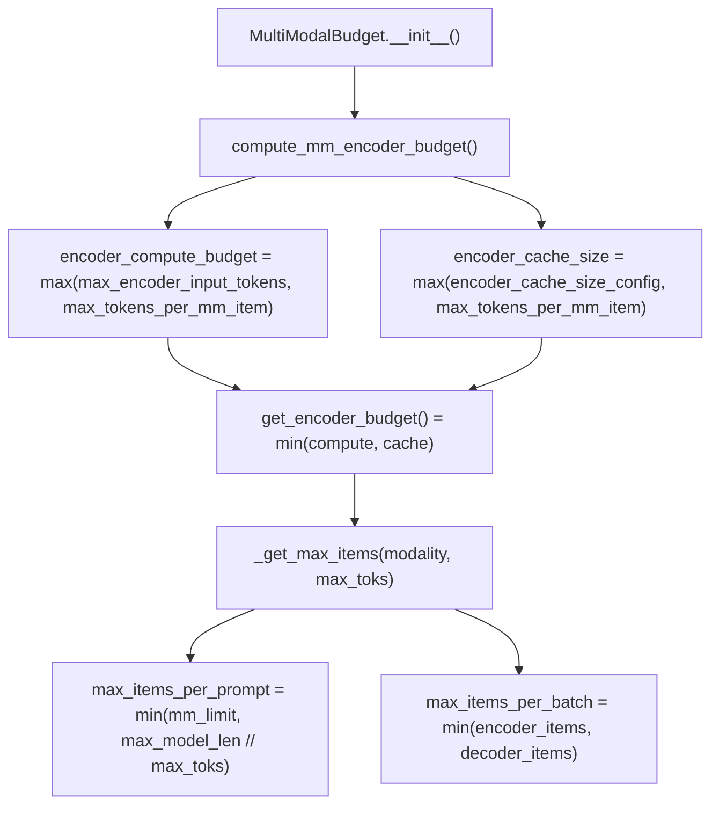

# PD-381.01 vLLM — MultiModalRegistry 统一多模态推理管道

> 文档编号：PD-381.01
> 来源：vLLM `vllm/multimodal/`
> GitHub：https://github.com/vllm-project/vllm.git
> 问题域：PD-381 多模态推理 Multimodal Inference
> 状态：可复用方案

---

## 第 1 章 问题与动机

### 1.1 核心问题

大语言模型推理引擎需要同时处理文本、图像、音频、视频等多种模态输入。核心挑战包括：

1. **模态异构性**：不同模态的预处理管道完全不同（图像需要 resize/normalize、音频需要 resample/channel reduction、视频需要帧提取），但最终都要转化为 token embedding 注入 decoder
2. **encoder 计算预算**：多模态 encoder（如 ViT）的计算开销远大于文本 token，需要精确控制每个 batch 中 encoder 的计算量，避免 OOM 或吞吐量骤降
3. **跨进程缓存一致性**：vLLM 的 API 前端进程（P0）和推理核心进程（P1）分离，多模态处理结果需要在两个进程间高效传递且缓存策略保持同步
4. **placeholder 对齐**：多模态 encoder 输出的 embedding 数量与 prompt 中的 placeholder token 数量必须精确对齐，否则推理结果错乱

### 1.2 vLLM 的解法概述

vLLM 通过一套分层的 Registry + Processor + Budget + Cache 四层架构解决上述问题：

1. **MultiModalRegistry**（`vllm/multimodal/registry.py:98`）：全局单例注册表，通过装饰器将模型类与其多模态处理器工厂绑定，运行时按 model_config 动态分发
2. **BaseMultiModalProcessor**（`vllm/multimodal/processing/processor.py:1670`）：统一的 `apply()` 管道，将 HF Processor 输出 → placeholder 替换 → 特征提取三步串联
3. **MultiModalBudget**（`vllm/multimodal/encoder_budget.py:44`）：双维度预算控制（encoder_compute_budget + encoder_cache_size），按模态分配每 prompt/每 batch 的最大 item 数
4. **三级缓存体系**（`vllm/multimodal/cache.py`）：ProcessorOnlyCache / SenderCache+ReceiverCache(LRU) / ShmObjectStore(共享内存)，根据并行配置自动选择
5. **EncoderCacheManager**（`vllm/v1/core/encoder_cache_manager.py:17`）：引用计数 + 惰性驱逐的 encoder 输出缓存，支持跨请求共享相同多模态数据的 encoder 结果

### 1.3 设计思想

| 设计原则 | 具体实现 | 理由 | 替代方案 |
|----------|----------|------|----------|
| 装饰器注册 | `register_processor` 装饰器绑定模型类与处理器工厂 | 新增模型只需一个装饰器，零侵入 | 配置文件映射（需维护额外文件） |
| 工厂三件套 | ProcessingInfoFactory + DummyInputsBuilderFactory + MultiModalProcessorFactory | 分离关注点：信息查询、dummy 输入生成、实际处理 | 单一工厂（职责过重） |
| 双维度预算 | encoder_compute_budget（计算）+ encoder_cache_size（存储）取 min | 计算和存储瓶颈可能不同，分别控制更精确 | 单一预算（无法区分瓶颈） |
| 惰性驱逐 | free() 只标记 freeable，实际驱逐延迟到 can_allocate() | 避免频繁内存操作，批量回收更高效 | 立即释放（碎片化严重） |
| 缓存分层 | P0 存元数据/P1 存张量数据，共享内存可选 | 减少 IPC 传输量，P0 内存占用最小化 | 全量 IPC（带宽浪费） |

---

## 第 2 章 源码实现分析

### 2.1 架构概览

vLLM 多模态推理的整体架构分为四层：

```
┌─────────────────────────────────────────────────────────────────┐
│                    MultiModalRegistry (全局单例)                  │
│  register_processor() ──→ model_cls._processor_factory          │
│  create_processor()   ──→ BaseMultiModalProcessor               │
│  processor_cache_from_config() ──→ 三级缓存选择                   │
├─────────────────────────────────────────────────────────────────┤
│                BaseMultiModalProcessor.apply()                   │
│  ┌──────────┐   ┌──────────────┐   ┌───────────────────┐       │
│  │ HF Proc  │──→│ Placeholder  │──→│ MultiModalInputs  │       │
│  │ (tokenize│   │ Update       │   │ (token_ids +      │       │
│  │ +feature) │   │ (replace/    │   │  mm_kwargs +      │       │
│  └──────────┘   │  insert)     │   │  mm_placeholders) │       │
│                  └──────────────┘   └───────────────────┘       │
├─────────────────────────────────────────────────────────────────┤
│              MultiModalBudget (预算控制)                          │
│  encoder_compute_budget ←── max(max_encoder_input_tokens,       │
│                                  max_tokens_per_mm_item)        │
│  encoder_cache_size     ←── max(encoder_cache_size_config,      │
│                                  max_tokens_per_mm_item)        │
│  mm_max_items_per_prompt / mm_max_items_per_batch               │
├─────────────────────────────────────────────────────────────────┤
│              EncoderCacheManager (encoder 输出缓存)               │
│  cached: {mm_hash → {request_ids}}                              │
│  freeable: OrderedDict{mm_hash → num_embeds}  (惰性驱逐队列)     │
│  allocate() / free() / can_allocate() (带驱逐)                   │
└─────────────────────────────────────────────────────────────────┘
```

### 2.2 核心实现

#### 2.2.1 Registry 装饰器注册与动态分发



对应源码 `vllm/multimodal/registry.py:134-166`：
```python
def register_processor(
    self,
    processor: MultiModalProcessorFactory[_I],
    *,
    info: ProcessingInfoFactory[_I],
    dummy_inputs: DummyInputsBuilderFactory[_I],
):
    def wrapper(model_cls: N) -> N:
        if "_processor_factory" in model_cls.__dict__:
            logger.warning(
                "Model class %s already has a multi-modal processor "
                "registered to %s. It is overwritten by the new one.",
                model_cls, self,
            )
        model_cls._processor_factory = _ProcessorFactories(
            info=info,
            dummy_inputs=dummy_inputs,
            processor=processor,
        )
        return model_cls
    return wrapper
```

`_ProcessorFactories` 的 `build_processor` 方法（`registry.py:87-95`）串联三个工厂：
```python
@dataclass(frozen=True)
class _ProcessorFactories(Generic[_I]):
    info: ProcessingInfoFactory[_I]
    processor: MultiModalProcessorFactory[_I]
    dummy_inputs: DummyInputsBuilderFactory[_I]

    def build_processor(self, ctx, *, cache=None):
        info = self.info(ctx)
        dummy_inputs_builder = self.dummy_inputs(info)
        return self.processor(info, dummy_inputs_builder, cache=cache)
```

#### 2.2.2 Processor apply() 三阶段管道



对应源码 `vllm/multimodal/processing/processor.py:1670-1714`：
```python
def apply(self, inputs: ProcessorInputs, timing_ctx: TimingContext) -> MultiModalInputs:
    (prompt_ids, mm_info, is_update_applied) = self._cached_apply_hf_processor(
        inputs, timing_ctx
    )
    with timing_ctx.record("apply_prompt_updates"):
        prompt_ids, mm_placeholders = self._maybe_apply_prompt_updates(
            mm_items=inputs.mm_data_items,
            prompt_ids=prompt_ids,
            mm_kwargs=mm_info.kwargs,
            mm_prompt_updates=mm_info.prompt_updates,
            is_update_applied=is_update_applied,
        )
    mm_placeholder_ranges = {
        modality: [item.to_range() for item in placeholders]
        for modality, placeholders in mm_placeholders.items()
    }
    return mm_inputs(
        prompt_token_ids=prompt_ids,
        mm_kwargs=mm_info.kwargs,
        mm_hashes=mm_info.hashes,
        mm_placeholders=mm_placeholder_ranges,
    )
```

#### 2.2.3 MultiModalBudget 双维度预算控制



对应源码 `vllm/multimodal/encoder_budget.py:44-189`：
```python
class MultiModalBudget:
    def __init__(self, vllm_config, mm_registry):
        # ... 初始化 processor 和 cache
        encoder_compute_budget, encoder_cache_size = compute_mm_encoder_budget(
            scheduler_config, active_mm_max_toks_per_item,
        )
        self.encoder_compute_budget = encoder_compute_budget
        self.encoder_cache_size = encoder_cache_size
        # 按模态计算 per-prompt 和 per-batch 限制
        for modality, max_toks_per_item in tower_mm_max_toks_per_item.items():
            (mm_max_items_per_prompt[modality],
             mm_max_items_per_batch[modality]) = self._get_max_items(modality, max_toks_per_item)

    def get_encoder_budget(self) -> int:
        return min(self.encoder_compute_budget, self.encoder_cache_size)
```

### 2.3 实现细节

#### 三级缓存选择逻辑

`registry.py:252-276` 的 `_get_cache_type()` 根据并行配置自动选择缓存策略：

- **processor_only**：多 API 进程或外部负载均衡时，仅在 P0 缓存处理结果
- **lru**：单 API 进程 + 单 DP 时，P0 存元数据 + P1 存张量的 LRU 缓存
- **shm**：共享内存模式，通过 `SingleWriterShmObjectStorage` 实现零拷贝 IPC

#### EncoderCacheManager 惰性驱逐

`encoder_cache_manager.py:119-178` 的 `can_allocate()` 实现了惰性驱逐：

1. 先检查 `num_free_slots` 是否足够
2. 不够则检查 `num_freeable_slots`（含可回收的）
3. 从 `freeable` OrderedDict 按 FIFO 顺序驱逐，直到空间足够
4. 被驱逐的 mm_hash 记录到 `freed` 列表，由 scheduler 通知 worker 释放物理内存

#### MultiModalHasher 内容寻址

`hasher.py:50-163` 支持 blake3/sha256/sha512 三种算法，对不同数据类型有专门的序列化路径：
- PIL Image：优先使用 EXIF ImageID（UUID），否则序列化像素数据
- torch.Tensor：处理 bfloat16 特殊情况（NumPy 不支持），转为 uint8 视图
- MediaWithBytes：使用原始字节避免解码开销

---

## 第 3 章 迁移指南

### 3.1 迁移清单

**阶段 1：核心注册表（1-2 天）**
- [ ] 实现 `MultiModalRegistry` 单例，支持 `register_processor` 装饰器
- [ ] 定义 `ProcessingInfoFactory` / `DummyInputsBuilderFactory` / `MultiModalProcessorFactory` 三个 Protocol
- [ ] 实现 `_ProcessorFactories` dataclass 的 `build_processor` 串联逻辑

**阶段 2：处理器管道（2-3 天）**
- [ ] 实现 `BaseProcessingInfo` 基类，包含 `supported_mm_limits` / `allowed_mm_limits` / `parse_mm_data`
- [ ] 实现 `BaseMultiModalProcessor.apply()` 三阶段管道
- [ ] 定义 `MultiModalInputs` / `PlaceholderRange` / `MultiModalKwargsItems` 数据结构

**阶段 3：预算控制（1 天）**
- [ ] 实现 `MultiModalBudget`，计算 encoder_compute_budget 和 encoder_cache_size
- [ ] 实现 `_get_max_items()` 按模态分配 per-prompt / per-batch 限制

**阶段 4：缓存体系（2-3 天）**
- [ ] 实现 `BaseMultiModalProcessorCache` 抽象基类
- [ ] 实现 `MultiModalProcessorOnlyCache`（最简单，适合单进程）
- [ ] 可选：实现 `SenderCache + ReceiverCache` 的 LRU IPC 缓存
- [ ] 可选：实现 `ShmObjectStore` 共享内存缓存

### 3.2 适配代码模板

#### 最小可用的 Registry + Processor

```python
from abc import abstractmethod
from dataclasses import dataclass
from typing import Any, Mapping, Protocol, TypeVar, Generic
from collections.abc import Sequence

# --- 类型定义 ---
class ProcessingInfo:
    """模型的多模态处理信息"""
    def __init__(self, model_config: dict):
        self.model_config = model_config

    @property
    def supported_mm_limits(self) -> Mapping[str, int | None]:
        """每种模态支持的最大数量"""
        return {"image": 8, "audio": 4, "video": 2}

    @property
    def allowed_mm_limits(self) -> Mapping[str, int]:
        """结合用户配置后的实际限制"""
        user_limits = self.model_config.get("limit_per_prompt", {})
        return {
            mod: min(user_limits.get(mod, sup or 999), sup or 999)
            for mod, sup in self.supported_mm_limits.items()
        }


@dataclass(frozen=True)
class ProcessorFactories:
    info_factory: Any
    processor_factory: Any
    dummy_factory: Any

    def build_processor(self, model_config: dict):
        info = self.info_factory(model_config)
        dummy = self.dummy_factory(info)
        return self.processor_factory(info, dummy)


class MultiModalRegistry:
    """全局多模态处理器注册表"""

    def register_processor(self, *, info, processor, dummy_inputs):
        def wrapper(model_cls):
            model_cls._processor_factory = ProcessorFactories(
                info_factory=info,
                processor_factory=processor,
                dummy_factory=dummy_inputs,
            )
            return model_cls
        return wrapper

    def create_processor(self, model_cls, model_config: dict):
        assert hasattr(model_cls, "_processor_factory")
        return model_cls._processor_factory.build_processor(model_config)


# --- 使用示例 ---
REGISTRY = MultiModalRegistry()

@REGISTRY.register_processor(
    info=lambda cfg: ProcessingInfo(cfg),
    processor=lambda info, dummy: f"Processor({info.model_config['name']})",
    dummy_inputs=lambda info: "DummyBuilder",
)
class MyVisionLanguageModel:
    pass

# 运行时创建处理器
proc = REGISTRY.create_processor(MyVisionLanguageModel, {"name": "llava-v1.5"})
print(proc)  # Processor(llava-v1.5)
```

#### 最小可用的 EncoderBudget

```python
from collections import OrderedDict

class EncoderCacheManager:
    """引用计数 + 惰性驱逐的 encoder 缓存管理器"""

    def __init__(self, cache_size: int):
        self.cache_size = cache_size
        self.num_free_slots = cache_size
        self.num_freeable_slots = cache_size
        self.cached: dict[str, set[str]] = {}       # mm_hash → request_ids
        self.freeable: OrderedDict[str, int] = OrderedDict()  # mm_hash → num_embeds
        self.freed: list[str] = []

    def can_allocate(self, mm_hash: str, num_embeds: int, request_id: str) -> bool:
        # 已缓存且有引用
        if mm_hash in self.cached and self.cached[mm_hash]:
            return True
        # 空间足够
        if num_embeds <= self.num_free_slots:
            return True
        # 可回收空间足够，执行惰性驱逐
        if num_embeds <= self.num_freeable_slots:
            while num_embeds > self.num_free_slots:
                evict_hash, evict_embeds = self.freeable.popitem(last=False)
                del self.cached[evict_hash]
                self.freed.append(evict_hash)
                self.num_free_slots += evict_embeds
            return True
        return False

    def allocate(self, mm_hash: str, num_embeds: int, request_id: str):
        if mm_hash not in self.cached:
            self.cached[mm_hash] = set()
        self.cached[mm_hash].add(request_id)
        self.num_free_slots -= num_embeds
        self.num_freeable_slots -= num_embeds

    def free(self, mm_hash: str, num_embeds: int, request_id: str):
        if mm_hash not in self.cached:
            return
        self.cached[mm_hash].discard(request_id)
        if not self.cached[mm_hash]:
            self.freeable[mm_hash] = num_embeds
            self.num_freeable_slots += num_embeds
```

### 3.3 适用场景

| 场景 | 适用度 | 说明 |
|------|--------|------|
| 多模态 LLM 推理引擎 | ⭐⭐⭐ | 核心场景，Registry+Budget+Cache 全套适用 |
| 单模态图像理解服务 | ⭐⭐⭐ | 简化为单模态，Budget 控制仍然关键 |
| 多模态 Agent 框架 | ⭐⭐ | Registry 模式可复用，Budget 需适配非推理场景 |
| 训练框架数据加载 | ⭐ | 缓存体系可借鉴，但预算控制逻辑不同 |

---

## 第 4 章 测试用例

```python
import pytest
from collections import OrderedDict


class TestEncoderCacheManager:
    """基于 vllm/v1/core/encoder_cache_manager.py 的真实接口设计"""

    def setup_method(self):
        self.manager = EncoderCacheManager(cache_size=1000)

    def test_allocate_within_budget(self):
        """正常分配：空间充足时直接分配"""
        assert self.manager.can_allocate("img_hash_1", 200, "req_1")
        self.manager.allocate("img_hash_1", 200, "req_1")
        assert self.manager.num_free_slots == 800
        assert "req_1" in self.manager.cached["img_hash_1"]

    def test_shared_cache_across_requests(self):
        """跨请求共享：相同 mm_hash 的 encoder 输出被多个请求引用"""
        self.manager.allocate("img_hash_1", 200, "req_1")
        # 第二个请求引用同一图片，不需要额外空间
        self.manager.cached["img_hash_1"].add("req_2")
        assert self.manager.num_free_slots == 800  # 不变

    def test_lazy_eviction_on_allocate(self):
        """惰性驱逐：free 只标记 freeable，can_allocate 时才真正驱逐"""
        self.manager.allocate("img_1", 400, "req_1")
        self.manager.allocate("img_2", 400, "req_2")
        assert self.manager.num_free_slots == 200

        # free req_1 的引用
        self.manager.free("img_1", 400, "req_1")
        assert self.manager.num_free_slots == 200  # 未变！只是标记 freeable
        assert self.manager.num_freeable_slots == 600  # 可回收空间增加

        # 分配新的大 item，触发驱逐
        assert self.manager.can_allocate("img_3", 500, "req_3")
        assert "img_1" in self.manager.freed  # img_1 被驱逐
        assert self.manager.num_free_slots >= 500

    def test_budget_exceeded(self):
        """预算超限：总空间不足时拒绝分配"""
        self.manager.allocate("img_1", 600, "req_1")
        self.manager.allocate("img_2", 300, "req_2")
        # 剩余 100，可回收 0，请求 200 → 拒绝
        assert not self.manager.can_allocate("img_3", 200, "req_3")

    def test_get_freed_clears_list(self):
        """freed 列表在获取后清空"""
        self.manager.allocate("img_1", 500, "req_1")
        self.manager.free("img_1", 500, "req_1")
        self.manager.can_allocate("img_2", 600, "req_2")  # 触发驱逐
        freed = self.manager.freed
        assert "img_1" in freed


class TestMultiModalRegistry:
    """基于 vllm/multimodal/registry.py 的注册与分发逻辑"""

    def test_register_and_create(self):
        """注册处理器后可通过 model_config 创建"""
        registry = MultiModalRegistry()

        @registry.register_processor(
            info=lambda cfg: ProcessingInfo(cfg),
            processor=lambda info, dummy: f"Proc({info.model_config['name']})",
            dummy_inputs=lambda info: "Dummy",
        )
        class TestModel:
            pass

        proc = registry.create_processor(TestModel, {"name": "test"})
        assert proc == "Proc(test)"

    def test_overwrite_warning(self):
        """重复注册同一模型类会覆盖"""
        registry = MultiModalRegistry()

        @registry.register_processor(
            info=lambda cfg: ProcessingInfo(cfg),
            processor=lambda info, dummy: "v1",
            dummy_inputs=lambda info: "Dummy",
        )
        class TestModel:
            pass

        @registry.register_processor(
            info=lambda cfg: ProcessingInfo(cfg),
            processor=lambda info, dummy: "v2",
            dummy_inputs=lambda info: "Dummy",
        )
        class TestModel(TestModel):  # noqa: F811
            pass

        proc = registry.create_processor(TestModel, {"name": "test"})
        assert proc == "v2"


class TestMultiModalBudget:
    """基于 vllm/multimodal/encoder_budget.py 的预算计算逻辑"""

    def test_compute_budget_basic(self):
        """基本预算计算：取 max(config, max_tokens_per_item)"""
        max_encoder_input_tokens = 2048
        encoder_cache_size_config = 4096
        max_tokens_per_mm_item = 576  # 典型 ViT 输出

        compute_budget = max(max_encoder_input_tokens, max_tokens_per_mm_item)
        cache_size = max(encoder_cache_size_config, max_tokens_per_mm_item)
        effective_budget = min(compute_budget, cache_size)

        assert compute_budget == 2048
        assert cache_size == 4096
        assert effective_budget == 2048

    def test_empty_modalities_returns_zero(self):
        """无活跃模态时预算为 0"""
        mm_max_toks = {}
        if not mm_max_toks:
            compute_budget, cache_size = 0, 0
        assert compute_budget == 0
        assert cache_size == 0
```

---

## 第 5 章 跨域关联

| 关联域 | 关系类型 | 说明 |
|--------|----------|------|
| PD-01 上下文管理 | 协同 | 多模态 placeholder tokens 占用上下文窗口，Budget 的 max_model_len 约束直接影响可容纳的多模态 item 数量 |
| PD-04 工具系统 | 协同 | Registry 的装饰器注册模式与工具系统的注册表模式高度相似，可共享设计范式 |
| PD-06 记忆持久化 | 协同 | 三级缓存体系（ProcessorCache / ReceiverCache / ShmObjectStore）是记忆持久化在推理场景的具体实现 |
| PD-11 可观测性 | 依赖 | MultiModalTimingRegistry 提供 per-request 的处理耗时统计，TimingContext 记录每个 stage 的执行时间 |
| PD-375 投机解码 | 协同 | encoder 预算控制影响投机解码的 batch 组成，多模态 item 的 encoder 计算需要在投机验证前完成 |
| PD-379 连续批处理 | 依赖 | MultiModalBudget 的 max_num_batched_tokens 和 chunked_prefill 配置直接来自 scheduler，影响每 batch 可调度的多模态 item 数 |
| PD-380 KV Cache | 协同 | encoder 输出缓存（EncoderCacheManager）与 KV Cache 共享 GPU 显存，两者的预算分配需要协调 |

---

## 第 6 章 来源文件索引

| 文件 | 行范围 | 关键实现 |
|------|--------|----------|
| `vllm/multimodal/__init__.py` | L1-38 | 全局 MULTIMODAL_REGISTRY 单例定义 |
| `vllm/multimodal/registry.py` | L42-96 | ProcessingInfoFactory / _ProcessorFactories 工厂三件套 |
| `vllm/multimodal/registry.py` | L98-363 | MultiModalRegistry 核心类 + MultiModalTimingRegistry |
| `vllm/multimodal/encoder_budget.py` | L15-41 | get_mm_max_toks_per_item() 模态 token 上限计算 |
| `vllm/multimodal/encoder_budget.py` | L44-194 | MultiModalBudget 双维度预算控制 |
| `vllm/multimodal/cache.py` | L42-84 | MultiModalProcessorCacheItem / CacheItemMetadata |
| `vllm/multimodal/cache.py` | L98-169 | MultiModalCache LRU 缓存工具类 |
| `vllm/multimodal/cache.py` | L175-250 | BaseMultiModalCache 抽象基类（P0/P1 缓存协议） |
| `vllm/multimodal/cache.py` | L326-435 | ProcessorOnlyCache + ProcessorSenderCache 实现 |
| `vllm/multimodal/cache.py` | L437-566 | ShmObjectStoreSenderCache 共享内存缓存 |
| `vllm/multimodal/cache.py` | L614-726 | MultiModalReceiverCache + ShmObjectStoreReceiverCache |
| `vllm/multimodal/inputs.py` | L64-99 | ImageItem / VideoItem / AudioItem 类型别名 |
| `vllm/multimodal/inputs.py` | L169-268 | PlaceholderRange 位置信息 + embedding 索引计算 |
| `vllm/multimodal/inputs.py` | L889-1005 | MultiModalKwargsItem / MultiModalKwargsItems 批处理容器 |
| `vllm/multimodal/inputs.py` | L1065-1160 | MultiModalInputs / MultiModalEncDecInputs 输出结构 |
| `vllm/multimodal/processing/context.py` | L46-81 | TimingContext 处理阶段计时 |
| `vllm/multimodal/processing/context.py` | L88-508 | InputProcessingContext + BaseProcessingInfo |
| `vllm/multimodal/processing/processor.py` | L1670-1714 | BaseMultiModalProcessor.apply() 三阶段管道 |
| `vllm/multimodal/processing/processor.py` | L1717-1789 | EncDecMultiModalProcessor encoder-decoder 变体 |
| `vllm/multimodal/hasher.py` | L50-163 | MultiModalHasher 内容寻址哈希（blake3/sha256/sha512） |
| `vllm/multimodal/audio.py` | L28-70 | AudioSpec / ChannelReduction 音频规范化 |
| `vllm/multimodal/image.py` | L1-37 | rescale_image_size / rgba_to_rgb 图像预处理 |
| `vllm/v1/core/encoder_cache_manager.py` | L17-267 | EncoderCacheManager 引用计数 + 惰性驱逐 |
| `vllm/v1/core/encoder_cache_manager.py` | L269-317 | compute_mm_encoder_budget() 预算计算函数 |
| `vllm/v1/core/encoder_cache_manager.py` | L323-382 | EncoderDecoderCacheManager enc-dec 变体 |
| `vllm/model_executor/models/interfaces.py` | L88-118 | SupportsMultiModal Protocol 接口定义 |

---

## 第 7 章 横向对比维度

```json comparison_data
{
  "project": "vLLM",
  "dimensions": {
    "注册方式": "装饰器绑定模型类，工厂三件套延迟构建",
    "预算控制": "双维度 encoder_compute + cache_size 取 min",
    "缓存策略": "三级自适应：ProcessorOnly / LRU-IPC / ShmObjectStore",
    "模态扩展": "TypeAlias 类型别名 + ModalityDataItems 泛型基类",
    "placeholder对齐": "PlaceholderRange + is_embed 掩码精确控制嵌入位置",
    "哈希算法": "blake3/sha256/sha512 可配置，支持 FIPS 合规",
    "encoder缓存驱逐": "引用计数 + OrderedDict FIFO 惰性驱逐"
  }
}
```

### 域元数据补充

```json domain_metadata
{
  "solution_summary": "vLLM通过装饰器Registry绑定模型与处理器工厂，双维度encoder预算控制(compute+cache)，三级自适应缓存(ProcessorOnly/LRU-IPC/ShmObjectStore)，PlaceholderRange精确对齐多模态embedding位置",
  "description": "推理引擎中多模态encoder输出的跨进程缓存一致性与placeholder精确对齐",
  "sub_problems": [
    "跨进程(P0/P1)多模态缓存一致性维护",
    "placeholder token与encoder embedding的精确位置对齐",
    "多模态内容寻址哈希的FIPS合规性",
    "embedding-only模态(预计算嵌入)的旁路处理"
  ],
  "best_practices": [
    "用装饰器将模型类与处理器工厂绑定实现零侵入注册",
    "encoder缓存采用引用计数+惰性驱逐避免频繁内存操作",
    "P0存元数据P1存张量数据减少IPC传输量",
    "PlaceholderRange的is_embed掩码支持部分位置嵌入"
  ]
}
```
