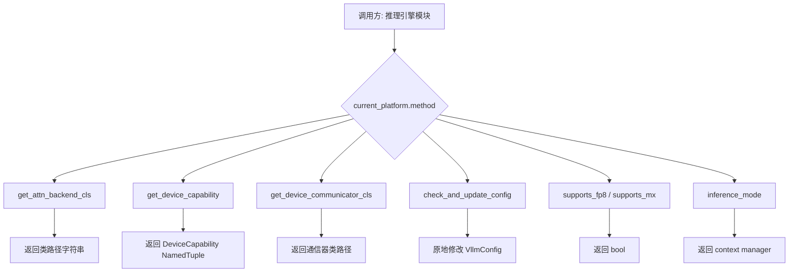
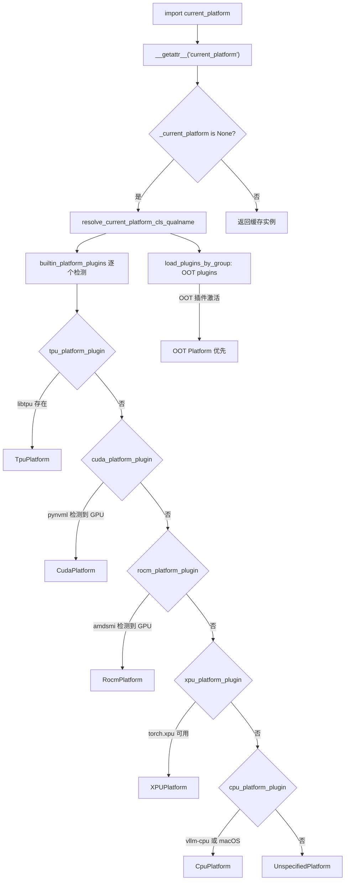
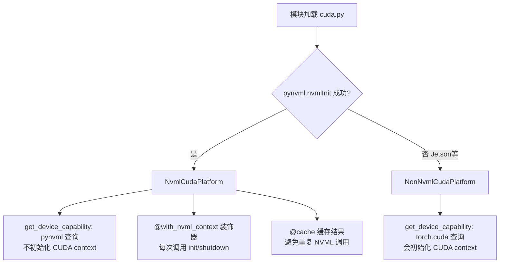

# PD-382.01 vLLM — Platform 抽象层五平台统一适配

> 文档编号：PD-382.01
> 来源：vLLM `vllm/platforms/interface.py`, `vllm/platforms/__init__.py`, `vllm/platforms/cuda.py`, `vllm/platforms/rocm.py`, `vllm/platforms/xpu.py`, `vllm/platforms/cpu.py`, `vllm/plugins/__init__.py`
> GitHub：https://github.com/vllm-project/vllm.git
> 问题域：PD-382 硬件平台抽象 Hardware Platform Abstraction
> 状态：可复用方案

---

## 第 1 章 问题与动机

### 1.1 核心问题

高性能 LLM 推理引擎需要在多种硬件平台上运行：NVIDIA CUDA、AMD ROCm、Google TPU、Intel XPU、纯 CPU，甚至未来的自定义加速器。每种硬件在以下维度存在根本差异：

- **设备管理 API**：CUDA 用 `pynvml`，ROCm 用 `amdsmi`，XPU 用 `torch.xpu`，CPU 无设备概念
- **通信后端**：CUDA/ROCm 用 NCCL，XPU 用 XCCL，CPU 用 Gloo
- **Attention 内核**：CUDA 有 FlashAttention/FlashInfer/FlashMLA 等 10+ 后端，ROCm 有 AITER 系列，XPU 用 Flash/Triton，CPU 只有 CPU_ATTN
- **计算能力查询**：CUDA 用 `(major, minor)` 元组，ROCm 从 GCN arch 字符串解析，XPU/CPU 无此概念
- **量化支持**：不同平台支持的量化方法集合完全不同

如果在推理引擎的每个模块中都用 `if cuda ... elif rocm ... elif tpu ...` 分支，代码将不可维护。

### 1.2 vLLM 的解法概述

vLLM 通过一个 `Platform` 抽象基类 + 懒加载单例 + entry_points 插件机制，实现了设备无关的推理引擎：

1. **Platform 基类定义 40+ 个虚方法**（`vllm/platforms/interface.py:100-718`），覆盖设备能力查询、attention 后端选择、通信器获取、配置校验等全部硬件差异点
2. **5 个内置平台子类**分别实现 CUDA/ROCm/TPU/XPU/CPU 的具体逻辑，每个子类只覆写与自身硬件相关的方法
3. **懒加载 `current_platform` 单例**（`vllm/platforms/__init__.py:236-255`）通过 `__getattr__` 模块级钩子延迟初始化，确保 OOT 插件有机会先注册
4. **自动检测优先级链**（`vllm/platforms/__init__.py:177-226`）：TPU → CUDA → ROCm → XPU → CPU → Unspecified，OOT 插件优先于内置
5. **entry_points 插件扩展**（`vllm/plugins/__init__.py:28-66`）：第三方硬件通过 `vllm.platform_plugins` 组注册自定义 Platform 子类

### 1.3 设计思想

| 设计原则 | 具体实现 | 理由 | 替代方案 |
|----------|----------|------|----------|
| 单一抽象接口 | `Platform` 基类 40+ 个 classmethod | 所有硬件差异收敛到一个接口，调用方无需感知具体平台 | 每个模块自行 if-else 分支（不可维护） |
| 懒加载单例 | `__getattr__` 模块级钩子延迟实例化 | OOT 插件需要在 `import vllm` 时先注册，不能在模块加载时就解析平台 | 模块顶层直接实例化（破坏 OOT 插件时序） |
| 无状态 classmethod | 几乎所有方法都是 `@classmethod`，不依赖实例状态 | 避免 CUDA 上下文初始化副作用，支持 Ray worker 延迟设备绑定 | 实例方法 + 构造函数初始化设备（过早初始化 CUDA） |
| 字符串路径延迟导入 | `get_attn_backend_cls` 返回类路径字符串而非类对象 | 避免循环导入，按需加载重量级依赖 | 直接返回类引用（触发循环导入） |
| entry_points 插件 | `vllm.platform_plugins` 组 + `load_plugins_by_group` | 第三方硬件无需修改 vLLM 源码即可接入 | 硬编码所有平台（不可扩展） |
| NVML 优先无 CUDA 初始化 | `NvmlCudaPlatform` 用 pynvml 查询设备信息 | 避免过早初始化 CUDA context，Ray worker 需要先设置 `CUDA_VISIBLE_DEVICES` | 直接用 `torch.cuda`（过早初始化） |

---

## 第 2 章 源码实现分析

### 2.1 架构概览

vLLM 的平台抽象层由三个核心组件构成：接口定义、平台检测、插件扩展。

```
┌─────────────────────────────────────────────────────────────────┐
│                    vllm.platforms (模块)                         │
│                                                                 │
│  current_platform ← __getattr__ 懒加载                          │
│       │                                                         │
│       ▼                                                         │
│  resolve_current_platform_cls_qualname()                        │
│       │                                                         │
│       ├── OOT plugins (entry_points) ──→ 优先级最高              │
│       │                                                         │
│       ├── builtin_platform_plugins:                             │
│       │   ├── tpu_platform_plugin()   → TpuPlatform             │
│       │   ├── cuda_platform_plugin()  → NvmlCudaPlatform        │
│       │   ├── rocm_platform_plugin()  → RocmPlatform            │
│       │   ├── xpu_platform_plugin()   → XPUPlatform             │
│       │   └── cpu_platform_plugin()   → CpuPlatform             │
│       │                                                         │
│       └── fallback → UnspecifiedPlatform                        │
│                                                                 │
│  ┌──────────────────────────────────────────────────────┐       │
│  │              Platform (基类)                          │       │
│  │  _enum, device_name, device_type, dispatch_key       │       │
│  │  dist_backend, device_control_env_var                │       │
│  │  ─────────────────────────────────────               │       │
│  │  get_attn_backend_cls()                              │       │
│  │  get_device_capability()                             │       │
│  │  get_device_communicator_cls()                       │       │
│  │  check_and_update_config()                           │       │
│  │  verify_quantization()                               │       │
│  │  supports_fp8() / supports_mx()                      │       │
│  │  inference_mode() / set_device()                     │       │
│  │  ... (40+ methods)                                   │       │
│  └──────────┬───────┬───────┬───────┬───────┬───────────┘       │
│             │       │       │       │       │                   │
│    ┌────────┴┐ ┌────┴───┐ ┌─┴──┐ ┌──┴──┐ ┌──┴──┐               │
│    │CudaBase │ │ Rocm   │ │TPU │ │ XPU │ │ CPU │               │
│    │ ├─Nvml  │ │Platform│ │Plat│ │Plat │ │Plat │               │
│    │ └─NonNv │ │        │ │    │ │     │ │     │               │
│    └─────────┘ └────────┘ └────┘ └─────┘ └─────┘               │
└─────────────────────────────────────────────────────────────────┘
```

### 2.2 核心实现

#### 2.2.1 Platform 基类：40+ 虚方法的硬件抽象契约



对应源码 `vllm/platforms/interface.py:100-178`：

```python
class Platform:
    _enum: PlatformEnum
    device_name: str
    device_type: str
    dispatch_key: str = "CPU"
    ray_device_key: str = ""
    device_control_env_var: str = "VLLM_DEVICE_CONTROL_ENV_VAR_PLACEHOLDER"
    ray_noset_device_env_vars: list[str] = []
    simple_compile_backend: str = "inductor"
    dist_backend: str = ""
    supported_quantization: list[str] = []

    def is_cuda(self) -> bool:
        return self._enum == PlatformEnum.CUDA

    def is_rocm(self) -> bool:
        return self._enum == PlatformEnum.ROCM

    def is_cuda_alike(self) -> bool:
        """Stateless version of [torch.cuda.is_available][]."""
        return self._enum in (PlatformEnum.CUDA, PlatformEnum.ROCM)
```

关键设计：所有类属性（`device_name`, `dist_backend`, `dispatch_key` 等）在子类中以类变量覆写，无需构造函数。`DeviceCapability` 是一个 `NamedTuple`（`interface.py:58-98`），支持比较运算符，用于判断硬件代际。

#### 2.2.2 懒加载单例与平台检测链



对应源码 `vllm/platforms/__init__.py:236-255`：

```python
def __getattr__(name: str):
    if name == "current_platform":
        global _current_platform
        if _current_platform is None:
            platform_cls_qualname = resolve_current_platform_cls_qualname()
            _current_platform = resolve_obj_by_qualname(
                platform_cls_qualname
            )()
            global _init_trace
            _init_trace = "".join(traceback.format_stack())
        return _current_platform
```

检测逻辑 `vllm/platforms/__init__.py:186-226` 的关键规则：
- OOT 插件最多只能激活 1 个，否则抛 `RuntimeError`
- 内置插件也最多只能激活 1 个（互斥检测）
- OOT 优先于内置：如果 OOT 和内置同时激活，OOT 胜出

#### 2.2.3 CUDA 平台的双实现策略



对应源码 `vllm/platforms/cuda.py:585-718`：

```python
class NvmlCudaPlatform(CudaPlatformBase):
    @classmethod
    @cache
    @with_nvml_context
    def get_device_capability(cls, device_id: int = 0) -> DeviceCapability | None:
        try:
            physical_device_id = cls.device_id_to_physical_device_id(device_id)
            handle = pynvml.nvmlDeviceGetHandleByIndex(physical_device_id)
            major, minor = pynvml.nvmlDeviceGetCudaComputeCapability(handle)
            return DeviceCapability(major=major, minor=minor)
        except RuntimeError:
            return None

# 模块底部自动选择
nvml_available = False
try:
    pynvml.nvmlInit()
    nvml_available = True
except Exception:
    nvml_available = False
finally:
    if nvml_available:
        pynvml.nvmlShutdown()

CudaPlatform = NvmlCudaPlatform if nvml_available else NonNvmlCudaPlatform
```

这个双实现策略的核心价值：Ray 分布式场景下，worker 进程需要在 `import vllm` 之后才设置 `CUDA_VISIBLE_DEVICES`，如果 import 时就初始化了 CUDA context，设备绑定就会失败。NVML 不受 `CUDA_VISIBLE_DEVICES` 影响，可以安全地在 import 时查询设备信息。

### 2.3 实现细节

#### Attention 后端选择的平台差异化

每个平台子类覆写 `get_attn_backend_cls()` 方法，返回适合该硬件的 attention 后端类路径。以 CUDA 为例（`cuda.py:341-412`），它维护一个按设备代际排序的优先级列表：

- Blackwell (capability 10.x)：FlashInfer → FlashAttn → Triton → Flex
- Hopper/Ampere：FlashAttn → FlashInfer → Triton → Flex
- MLA 模式下有独立的优先级链，区分 dense 和 sparse

ROCm（`rocm.py:353-469`）则有完全不同的后端集合：AITER MLA、AITER FA、Triton、ROCm Attn，并通过环境变量 `VLLM_ROCM_USE_AITER` 控制优先级。

#### OOT 插件的 entry_points 机制

第三方硬件通过 Python 的 `entry_points` 机制注册（`vllm/plugins/__init__.py:28-66`）：

```toml
# 第三方硬件的 pyproject.toml
[project.entry-points."vllm.platform_plugins"]
my_accelerator = "my_package.platform:MyAcceleratorPlatform"
```

`load_plugins_by_group` 函数使用 `importlib.metadata.entry_points(group=group)` 发现所有注册的插件，支持 `VLLM_PLUGINS` 环境变量过滤。

---

## 第 3 章 迁移指南

### 3.1 迁移清单

**阶段 1：定义 Platform 接口（1 个文件）**
- [ ] 创建 `Platform` 抽象基类，定义核心虚方法：`get_device_capability`, `get_attn_backend_cls`, `get_device_communicator_cls`, `check_and_update_config`, `set_device`, `inference_mode`
- [ ] 定义 `PlatformEnum` 枚举和 `DeviceCapability` NamedTuple
- [ ] 所有方法用 `@classmethod`，避免实例状态

**阶段 2：实现具体平台子类（每平台 1 个文件）**
- [ ] 每个子类只覆写与自身硬件相关的方法
- [ ] 类属性覆写：`device_name`, `device_type`, `dispatch_key`, `dist_backend`, `device_control_env_var`
- [ ] CUDA 平台实现 NVML 和非 NVML 双路径

**阶段 3：实现平台检测与懒加载（1 个文件）**
- [ ] 模块级 `__getattr__` 实现 `current_platform` 懒加载
- [ ] 按优先级链逐个检测可用平台
- [ ] 确保检测过程不初始化 CUDA context

**阶段 4：接入 entry_points 插件机制**
- [ ] 定义 `platform_plugins` entry_points 组
- [ ] 实现 `load_plugins_by_group` 函数
- [ ] OOT 插件优先于内置平台

### 3.2 适配代码模板

以下是一个可直接复用的最小化 Platform 抽象层实现：

```python
"""platform/interface.py — 平台抽象接口"""
import enum
from typing import Any, NamedTuple


class PlatformEnum(enum.Enum):
    CUDA = enum.auto()
    ROCM = enum.auto()
    CPU = enum.auto()
    OOT = enum.auto()
    UNSPECIFIED = enum.auto()


class DeviceCapability(NamedTuple):
    major: int
    minor: int

    def __ge__(self, other: Any) -> bool:
        if not isinstance(other, DeviceCapability):
            return NotImplemented
        return (self.major, self.minor) >= (other.major, other.minor)


class Platform:
    """硬件平台抽象基类，所有方法为 classmethod"""
    _enum: PlatformEnum
    device_name: str = ""
    device_type: str = ""
    dist_backend: str = ""

    @classmethod
    def get_device_capability(cls, device_id: int = 0):
        return None

    @classmethod
    def get_backend_cls(cls, config: dict) -> str:
        """返回后端类的全限定路径字符串"""
        raise NotImplementedError

    @classmethod
    def get_communicator_cls(cls) -> str:
        raise NotImplementedError

    @classmethod
    def check_and_update_config(cls, config: dict) -> None:
        pass

    @classmethod
    def set_device(cls, device) -> None:
        raise NotImplementedError
```

```python
"""platform/__init__.py — 懒加载单例 + 自动检测"""
import traceback
from importlib.metadata import entry_points

_current_platform = None
PLUGINS_GROUP = "myproject.platform_plugins"


def _detect_platform() -> str:
    """按优先级检测可用平台，返回类的全限定名"""
    # 1. OOT 插件优先
    for ep in entry_points(group=PLUGINS_GROUP):
        try:
            func = ep.load()
            qualname = func()
            if qualname:
                return qualname
        except Exception:
            pass

    # 2. 内置平台检测
    try:
        import pynvml
        pynvml.nvmlInit()
        count = pynvml.nvmlDeviceGetCount()
        pynvml.nvmlShutdown()
        if count > 0:
            return "platform.cuda.CudaPlatform"
    except Exception:
        pass

    return "platform.cpu.CpuPlatform"


def __getattr__(name: str):
    if name == "current_platform":
        global _current_platform
        if _current_platform is None:
            qualname = _detect_platform()
            # 动态导入并实例化
            module_path, cls_name = qualname.rsplit(".", 1)
            import importlib
            mod = importlib.import_module(module_path)
            _current_platform = getattr(mod, cls_name)()
        return _current_platform
    raise AttributeError(name)
```

### 3.3 适用场景

| 场景 | 适用度 | 说明 |
|------|--------|------|
| 多硬件 LLM 推理引擎 | ⭐⭐⭐ | 核心场景，CUDA/ROCm/TPU/XPU/CPU 全覆盖 |
| 跨平台深度学习训练框架 | ⭐⭐⭐ | 训练框架同样面临多硬件适配问题 |
| 需要 OOT 硬件扩展的系统 | ⭐⭐⭐ | entry_points 插件机制天然支持 |
| 单一硬件的简单推理服务 | ⭐ | 过度设计，直接硬编码即可 |
| 非 Python 技术栈 | ⭐ | 依赖 Python entry_points 和 classmethod 模式 |

---

## 第 4 章 测试用例

```python
"""test_platform_abstraction.py"""
import pytest
from unittest.mock import patch, MagicMock
from typing import NamedTuple


# ---- 模拟 vLLM 的核心类型 ----
class DeviceCapability(NamedTuple):
    major: int
    minor: int

    def to_int(self) -> int:
        return self.major * 10 + self.minor


class PlatformEnum:
    CUDA = "CUDA"
    ROCM = "ROCM"
    CPU = "CPU"
    OOT = "OOT"
    UNSPECIFIED = "UNSPECIFIED"


class TestDeviceCapability:
    """测试 DeviceCapability 比较运算"""

    def test_comparison_operators(self):
        ampere = DeviceCapability(major=8, minor=0)
        hopper = DeviceCapability(major=9, minor=0)
        blackwell = DeviceCapability(major=10, minor=0)

        assert ampere < hopper
        assert hopper < blackwell
        assert blackwell >= ampere
        assert ampere == DeviceCapability(8, 0)

    def test_to_int(self):
        cap = DeviceCapability(major=8, minor=9)
        assert cap.to_int() == 89

    def test_fp8_capability_check(self):
        """FP8 需要 compute capability >= 8.9"""
        ada = DeviceCapability(major=8, minor=9)
        ampere = DeviceCapability(major=8, minor=0)
        assert ada.to_int() >= 89  # 支持 FP8
        assert ampere.to_int() < 89  # 不支持 FP8


class TestPlatformDetection:
    """测试平台检测优先级链"""

    def test_oot_plugin_takes_priority(self):
        """OOT 插件应优先于内置平台"""
        builtin_activated = ["cuda"]
        oot_activated = ["my_accelerator"]

        # 模拟 vLLM 的检测逻辑
        if len(oot_activated) == 1:
            selected = "oot"
        elif len(builtin_activated) == 1:
            selected = builtin_activated[0]
        else:
            selected = "unspecified"

        assert selected == "oot"

    def test_mutual_exclusion(self):
        """同时激活多个 OOT 插件应报错"""
        oot_activated = ["plugin_a", "plugin_b"]
        with pytest.raises(RuntimeError):
            if len(oot_activated) >= 2:
                raise RuntimeError(
                    f"Only one platform plugin can be activated, "
                    f"but got: {oot_activated}"
                )

    def test_fallback_to_unspecified(self):
        """无平台可用时回退到 UnspecifiedPlatform"""
        builtin_activated = []
        oot_activated = []
        if not oot_activated and not builtin_activated:
            selected = "unspecified"
        assert selected == "unspecified"


class TestPlatformClassmethod:
    """测试 Platform 方法的无状态特性"""

    def test_classmethod_no_instance_state(self):
        """Platform 方法应为 classmethod，不依赖实例"""

        class MockPlatform:
            _enum = PlatformEnum.CUDA
            device_name = "cuda"
            dist_backend = "nccl"

            @classmethod
            def supports_fp8(cls) -> bool:
                return True

            @classmethod
            def get_device_communicator_cls(cls) -> str:
                return "mock.CudaCommunicator"

        # 可以直接通过类调用，无需实例化
        assert MockPlatform.supports_fp8() is True
        assert "Communicator" in MockPlatform.get_device_communicator_cls()

    def test_string_path_lazy_import(self):
        """后端选择返回字符串路径而非类引用"""

        class MockCudaPlatform:
            @classmethod
            def get_attn_backend_cls(cls) -> str:
                return "vllm.v1.attention.backends.flash_attn.FlashAttentionBackend"

        path = MockCudaPlatform.get_attn_backend_cls()
        assert isinstance(path, str)
        assert "." in path  # 全限定路径


class TestNvmlVsNonNvml:
    """测试 CUDA 平台的双实现降级"""

    def test_nvml_available_uses_nvml_platform(self):
        nvml_available = True
        selected = "NvmlCudaPlatform" if nvml_available else "NonNvmlCudaPlatform"
        assert selected == "NvmlCudaPlatform"

    def test_nvml_unavailable_falls_back(self):
        """Jetson 等无 NVML 环境降级到 torch.cuda"""
        nvml_available = False
        selected = "NvmlCudaPlatform" if nvml_available else "NonNvmlCudaPlatform"
        assert selected == "NonNvmlCudaPlatform"
```

---

## 第 5 章 跨域关联

| 关联域 | 关系类型 | 说明 |
|--------|----------|------|
| PD-04 工具系统 | 协同 | Platform 的 `get_attn_backend_cls` 本质是一个工具/后端选择系统，与工具注册表模式相似 |
| PD-03 容错与重试 | 协同 | CUDA 平台的 NVML/NonNvml 双实现是一种硬件层面的降级容错策略 |
| PD-10 中间件管道 | 协同 | `check_and_update_config` 和 `apply_config_platform_defaults` 形成配置校验管道 |
| PD-11 可观测性 | 依赖 | 平台层提供 `get_current_memory_usage`、`num_compute_units` 等监控基础数据 |
| PD-05 沙箱隔离 | 协同 | 平台层的 `device_control_env_var` 和 Ray 设备绑定机制与进程隔离密切相关 |

---

## 第 6 章 来源文件索引

| 文件 | 行范围 | 关键实现 |
|------|--------|----------|
| `vllm/platforms/interface.py` | L36-45 | `PlatformEnum` 枚举定义（CUDA/ROCM/TPU/XPU/CPU/OOT） |
| `vllm/platforms/interface.py` | L58-98 | `DeviceCapability` NamedTuple，支持比较运算 |
| `vllm/platforms/interface.py` | L100-718 | `Platform` 基类，40+ 个虚方法定义 |
| `vllm/platforms/__init__.py` | L177-183 | `builtin_platform_plugins` 字典，5 个内置检测函数 |
| `vllm/platforms/__init__.py` | L186-226 | `resolve_current_platform_cls_qualname` 平台检测链 |
| `vllm/platforms/__init__.py` | L236-255 | `__getattr__` 懒加载 `current_platform` 单例 |
| `vllm/platforms/cuda.py` | L112-578 | `CudaPlatformBase` 基类 + attention 后端优先级选择 |
| `vllm/platforms/cuda.py` | L585-660 | `NvmlCudaPlatform` NVML 无 CUDA 初始化查询 |
| `vllm/platforms/cuda.py` | L679-718 | `NonNvmlCudaPlatform` + 自动选择逻辑 |
| `vllm/platforms/rocm.py` | L309-826 | `RocmPlatform` 完整实现，含 GCN arch 解析 |
| `vllm/platforms/rocm.py` | L154-222 | `_capability_from_gcn_arch` GCN 架构字符串解析 |
| `vllm/platforms/xpu.py` | L30-310 | `XPUPlatform` Intel XPU 实现 |
| `vllm/platforms/cpu.py` | L72-510 | `CpuPlatform` CPU 实现，含 NUMA 拓扑发现 |
| `vllm/plugins/__init__.py` | L19 | `PLATFORM_PLUGINS_GROUP = "vllm.platform_plugins"` |
| `vllm/plugins/__init__.py` | L28-66 | `load_plugins_by_group` entry_points 插件加载 |

---

## 第 7 章 横向对比维度

```json comparison_data
{
  "project": "vLLM",
  "dimensions": {
    "抽象层级": "单基类 40+ classmethod，子类覆写差异方法",
    "平台检测": "优先级链自动检测：OOT > TPU > CUDA > ROCm > XPU > CPU",
    "插件扩展": "Python entry_points 注册 OOT 平台，无需修改源码",
    "设备查询策略": "NVML 优先避免 CUDA 初始化，NonNvml 降级兜底",
    "后端选择": "每平台独立优先级列表，按设备代际和 MLA 模式动态选择",
    "通信器适配": "字符串路径延迟导入，NCCL/XCCL/Gloo 按平台切换",
    "配置校验": "check_and_update_config 原地修改 VllmConfig，平台特定默认值"
  }
}
```

### 域元数据补充

```json domain_metadata
{
  "solution_summary": "vLLM 通过 Platform 基类 40+ classmethod + 懒加载单例 + entry_points 插件机制，统一适配 CUDA/ROCm/TPU/XPU/CPU 五大平台，NVML 双路径避免过早 CUDA 初始化",
  "description": "硬件平台抽象需要同时解决设备查询、后端选择、通信适配、配置校验四个维度的差异化",
  "sub_problems": [
    "CUDA context 过早初始化导致 Ray worker 设备绑定失败",
    "Attention 后端按设备代际动态优先级选择",
    "ROCm GCN arch 字符串到 capability 元组的解析映射",
    "平台特定配置默认值的自动注入与校验"
  ],
  "best_practices": [
    "用 NVML/amdsmi 替代 torch.cuda 查询设备信息避免 CUDA 初始化",
    "后端选择返回字符串路径而非类引用避免循环导入",
    "模块级 __getattr__ 实现懒加载确保 OOT 插件注册时序"
  ]
}
```
