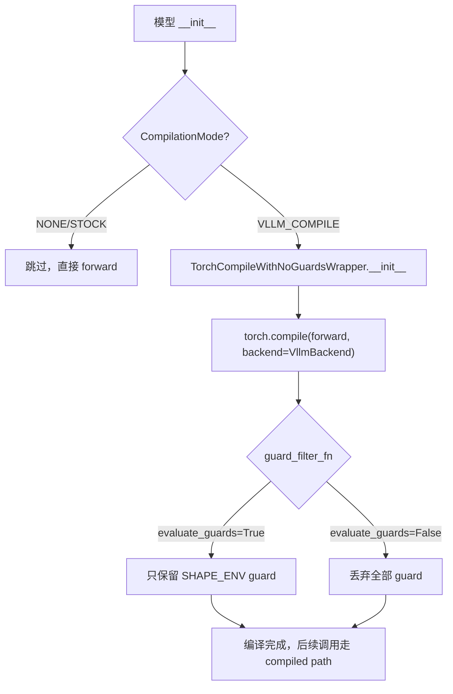
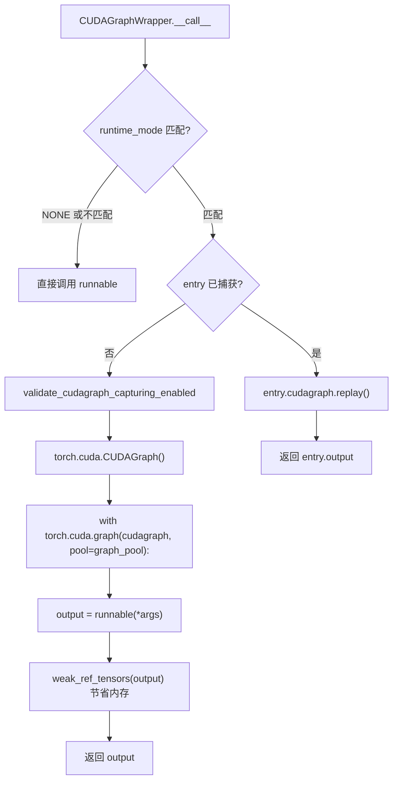
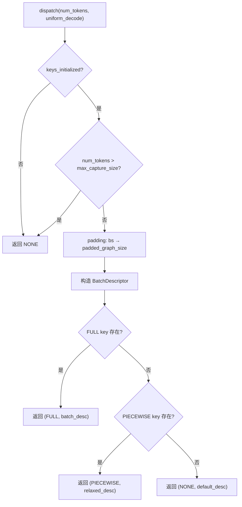

# PD-383.01 vLLM — CUDA Graph 捕获重放与 Piecewise 编译优化

> 文档编号：PD-383.01
> 来源：vLLM `vllm/compilation/cuda_graph.py`, `vllm/v1/cudagraph_dispatcher.py`, `vllm/compilation/wrapper.py`
> GitHub：https://github.com/vllm-project/vllm.git
> 问题域：PD-383 CUDA Graph 编译优化
> 状态：可复用方案

---

## 第 1 章 问题与动机（Problem & Motivation）

### 1.1 核心问题

LLM 推理的每次 forward pass 都需要 CPU 向 GPU 提交大量 CUDA kernel launch 命令。对于 decode 阶段（每次只生成一个 token），kernel launch 的 CPU 开销可能超过 GPU 实际计算时间，成为严重瓶颈。CUDA Graph 通过"录制一次、重放多次"的方式消除了重复的 kernel launch 开销，但面临以下工程挑战：

1. **动态 shape 问题**：LLM 推理的 batch size 和 sequence length 不断变化，而 CUDA Graph 要求固定的 tensor shape
2. **编译与图捕获的协调**：torch.compile（Dynamo + Inductor）的编译流程需要与 CUDA Graph 捕获无缝衔接
3. **Piecewise vs Full 模式选择**：attention 等算子不适合被 Inductor 编译，需要将模型拆分为多个子图分别处理
4. **内存管理**：CUDA Graph 捕获时分配的 GPU 内存需要精细管理，避免内存泄漏和碎片化

### 1.2 vLLM 的解法概述

vLLM 构建了一套完整的 CUDA Graph 编译优化体系：

1. **三层编译架构**：`@support_torch_compile` 装饰器 → `VllmBackend` 自定义后端 → `PiecewiseBackend` 子图编译，实现从模型标注到 Inductor 编译的全链路控制（`vllm/compilation/decorators.py:110`）
2. **双模式 CUDAGraph 调度**：`CudagraphDispatcher` 维护 PIECEWISE 和 FULL 两套 dispatch key 集合，运行时根据 batch 特征动态选择最优执行路径（`vllm/v1/cudagraph_dispatcher.py:15`）
3. **BatchDescriptor padding 策略**：将任意 batch size 向上对齐到预定义的 capture size，用少量预捕获的图覆盖所有可能的 batch size（`vllm/v1/cudagraph_dispatcher.py:71`）
4. **Guard-free 编译**：`TorchCompileWithNoGuardsWrapper` 丢弃所有 Dynamo guard，确保只编译一次不会触发重编译（`vllm/compilation/wrapper.py:90`）
5. **编译缓存体系**：`CompilerManager` 管理编译产物的持久化缓存，支持 AOT 编译和增量加载（`vllm/compilation/backends.py:117`）

### 1.3 设计思想

| 设计原则 | 具体实现 | 理由 | 替代方案 |
|----------|----------|------|----------|
| 录制-重放分离 | CUDAGraphWrapper 将 capture 和 replay 解耦为独立路径 | 捕获只发生一次，后续全部走 replay 快速路径 | 每次 forward 都重新 launch kernel（无优化） |
| Padding 对齐 | batch size 向上对齐到 capture_sizes 列表中的值 | 用有限数量的预捕获图覆盖连续的 batch size 空间 | 为每个 batch size 单独捕获（内存爆炸） |
| Piecewise 拆分 | 按 splitting_ops 将 FX graph 拆分为可编译子图和 attention 子图 | attention 算子有自己的高效实现，不适合 Inductor 编译 | 整图编译（attention 性能下降） |
| Guard 丢弃 | guard_filter_fn 返回全 False，跳过所有 Dynamo guard | vLLM 自己管理 shape 变化，不需要 Dynamo 的 guard 机制 | 保留 guard（频繁重编译） |
| 平台抽象 | AbstractStaticGraphWrapper Protocol + 平台解析 | 支持 CUDA 以外的加速器（如 HPU） | 硬编码 CUDA 实现 |

---

## 第 2 章 源码实现分析（Source Code Analysis）

### 2.1 架构概览

vLLM 的 CUDA Graph 编译优化由以下核心组件构成：

```
┌─────────────────────────────────────────────────────────────────┐
│                    @support_torch_compile                       │
│                    (decorators.py:110)                          │
│  ┌──────────────────────────────────────────────────────────┐   │
│  │  TorchCompileWithNoGuardsWrapper (wrapper.py:90)        │   │
│  │  - Guard-free torch.compile 包装                         │   │
│  │  - Bytecode hook 拦截编译产物                            │   │
│  └──────────────┬───────────────────────────────────────────┘   │
│                 │ torch.compile(backend=VllmBackend)            │
│  ┌──────────────▼───────────────────────────────────────────┐   │
│  │  VllmBackend (backends.py:653)                           │   │
│  │  - FX Graph 拆分 (split_graph)                           │   │
│  │  - PiecewiseCompileInterpreter 驱动子图编译              │   │
│  │  - CompilerManager 管理编译缓存                          │   │
│  └──────────────┬───────────────────────────────────────────┘   │
│                 │                                               │
│  ┌──────────────▼───────────────────────────────────────────┐   │
│  │  PiecewiseBackend (piecewise_backend.py:34)              │   │
│  │  - 按 compile_ranges 分 shape 编译                       │   │
│  │  - 运行时按 shape 分发到对应编译产物                      │   │
│  └──────────────┬───────────────────────────────────────────┘   │
│                 │ wrap_with_cudagraph_if_needed                 │
│  ┌──────────────▼───────────────────────────────────────────┐   │
│  │  CUDAGraphWrapper (cuda_graph.py:140)                    │   │
│  │  - 按 BatchDescriptor 捕获/重放 CUDA Graph               │   │
│  │  - 内存池共享 (graph_pool)                               │   │
│  └──────────────────────────────────────────────────────────┘   │
│                                                                 │
│  ┌──────────────────────────────────────────────────────────┐   │
│  │  CudagraphDispatcher (cudagraph_dispatcher.py:15)        │   │
│  │  - 维护 PIECEWISE/FULL 两套 dispatch key                │   │
│  │  - 运行时 padding + mode 选择                            │   │
│  └──────────────────────────────────────────────────────────┘   │
└─────────────────────────────────────────────────────────────────┘
```

### 2.2 核心实现

#### 2.2.1 Guard-free 编译包装器



对应源码 `vllm/compilation/wrapper.py:90-198`：

```python
class TorchCompileWithNoGuardsWrapper:
    """
    A wrapper class for torch.compile, it ensures that all guards are dropped
    when CompilationMode is not CompilationMode.STOCK_TORCH_COMPILE.
    When guards are dropped, the first time __call__ is invoked, a single
    compilation is triggered. Dynamo should never be traced again after that
    since we drop all guards.
    """

    def __init__(self) -> None:
        self.compiled = False
        vllm_config = get_current_vllm_config()
        self.vllm_config = vllm_config
        mode = vllm_config.compilation_config.mode

        backend = vllm_config.compilation_config.init_backend(vllm_config)
        options = {}

        if isinstance(backend, str) and backend == "inductor":
            options = vllm_config.compilation_config.inductor_compile_config

        if mode != CompilationMode.STOCK_TORCH_COMPILE:
            # Drop all the guards.
            if self.evaluate_guards:
                options["guard_filter_fn"] = lambda x: [
                    entry.guard_type == "SHAPE_ENV" for entry in x
                ]
            else:
                options["guard_filter_fn"] = lambda x: [False for _ in x]

        self._compiled_callable = torch.compile(
            compiled_ptr, fullgraph=True, dynamic=False,
            backend=backend, options=options,
        )
```

关键设计点：
- `fullgraph=True`：强制 Dynamo 捕获完整计算图，不允许 graph break（`wrapper.py:189`）
- `dynamic=False`：不使用 PyTorch 的动态 shape 机制，vLLM 自己管理 shape 变化（`wrapper.py:190`）
- `guard_filter_fn`：核心创新——通过过滤函数丢弃 Dynamo 的 guard，避免重编译（`wrapper.py:154-158`）

#### 2.2.2 CUDAGraphWrapper 捕获与重放



对应源码 `vllm/compilation/cuda_graph.py:208-323`：

```python
class CUDAGraphWrapper:
    def __call__(self, *args: Any, **kwargs: Any) -> Any | None:
        forward_context = get_forward_context()
        batch_descriptor = forward_context.batch_descriptor
        cudagraph_runtime_mode = forward_context.cudagraph_runtime_mode

        if (cudagraph_runtime_mode == CUDAGraphMode.NONE
                or cudagraph_runtime_mode != self.runtime_mode):
            return self.runnable(*args, **kwargs)

        if batch_descriptor not in self.concrete_cudagraph_entries:
            self.concrete_cudagraph_entries[batch_descriptor] = CUDAGraphEntry(
                batch_descriptor=batch_descriptor)

        entry = self.concrete_cudagraph_entries[batch_descriptor]

        if entry.cudagraph is None:
            # 捕获路径
            validate_cudagraph_capturing_enabled()
            cudagraph = torch.cuda.CUDAGraph()
            with ExitStack() as stack:
                if self.cudagraph_options.gc_disable:
                    stack.enter_context(patch("gc.collect", lambda: None))
                    stack.enter_context(patch("torch.cuda.empty_cache", lambda: None))
                with torch.cuda.graph(cudagraph, pool=self.graph_pool,
                                      stream=current_stream()):
                    output = self.runnable(*args, **kwargs)
                    if self.cudagraph_options.weak_ref_output:
                        output = weak_ref_tensors(output)
            entry.output = weak_ref_tensors(output)
            entry.cudagraph = cudagraph
            return output

        # 重放路径
        entry.cudagraph.replay()
        return entry.output
```

关键设计点：
- **GC 禁用优化**：piecewise 模式下每层都会捕获 CUDA Graph，禁用中间层的 GC 避免捕获变慢（`cuda_graph.py:256-263`）
- **弱引用输出**：只有最后一个子图的输出使用弱引用，中间子图的输出会被后续子图使用（`cuda_graph.py:287-294`）
- **全局内存池**：所有 CUDA Graph 共享一个 `graph_pool`，避免内存碎片化（`cuda_graph.py:186`）
- **Debug 模式地址检查**：在 DEBUG 级别下验证 replay 时的输入地址与 capture 时一致（`cuda_graph.py:308-317`）

#### 2.2.3 CudagraphDispatcher 运行时调度



对应源码 `vllm/v1/cudagraph_dispatcher.py:231-320`：

```python
class CudagraphDispatcher:
    def dispatch(self, num_tokens: int, uniform_decode: bool = False,
                 has_lora: bool = False, num_active_loras: int = 0,
                 valid_modes=None, invalid_modes=None,
    ) -> tuple[CUDAGraphMode, BatchDescriptor]:
        allowed_modes = valid_modes or CUDAGraphMode.valid_runtime_modes()
        if invalid_modes:
            allowed_modes -= invalid_modes

        if (not self.keys_initialized
                or self.cudagraph_mode == CUDAGraphMode.NONE
                or num_tokens > self.compilation_config.max_cudagraph_capture_size
                or allowed_modes <= {CUDAGraphMode.NONE}):
            return CUDAGraphMode.NONE, BatchDescriptor(num_tokens)

        batch_desc = self._create_padded_batch_descriptor(
            num_tokens, uniform_decode, has_lora, effective_num_active_loras)

        if CUDAGraphMode.FULL in allowed_modes:
            batch_desc_to_check = batch_desc
            if self.cudagraph_mode == CUDAGraphMode.FULL:
                batch_desc_to_check = replace(batch_desc, uniform=False)
            if batch_desc_to_check in self.cudagraph_keys[CUDAGraphMode.FULL]:
                return CUDAGraphMode.FULL, batch_desc_to_check

        if CUDAGraphMode.PIECEWISE in allowed_modes:
            batch_desc_to_check = replace(batch_desc, num_reqs=None, uniform=False)
            if batch_desc_to_check in self.cudagraph_keys[CUDAGraphMode.PIECEWISE]:
                return CUDAGraphMode.PIECEWISE, batch_desc_to_check

        return CUDAGraphMode.NONE, BatchDescriptor(num_tokens)
```

### 2.3 实现细节

**CUDAGraphMode 枚举设计**（`vllm/config/compilation.py:51-99`）：

vLLM 用一个巧妙的枚举设计支持混合模式：
- `NONE = 0`、`PIECEWISE = 1`、`FULL = 2` 是基础运行时模式
- `FULL_DECODE_ONLY = (FULL, NONE)` 表示 decode 用 FULL，mixed/prefill 不用 CUDAGraph
- `FULL_AND_PIECEWISE = (FULL, PIECEWISE)` 表示 decode 用 FULL，mixed 用 PIECEWISE

通过 `separate_routine()` 判断是否为组合模式，`decode_mode()` 和 `mixed_mode()` 分别提取对应模式。

**CompilationCounter 全局计数器**（`vllm/compilation/counter.py:12-50`）：

```python
@dataclasses.dataclass
class CompilationCounter:
    num_models_seen: int = 0
    num_graphs_seen: int = 0
    num_piecewise_graphs_seen: int = 0
    num_piecewise_capturable_graphs_seen: int = 0
    num_backend_compilations: int = 0
    num_cudagraph_captured: int = 0
    num_inductor_compiles: int = 0
    num_cache_entries_updated: int = 0
```

这个计数器贯穿整个编译流程，用于测试断言和可观测性。`expect()` 上下文管理器可以精确验证编译过程中各阶段的计数增量。

**Padding 策略**（`vllm/v1/cudagraph_dispatcher.py:71-105`）：

`_compute_bs_to_padded_graph_size` 预计算一个查找表，将每个 batch size 映射到最近的 capture size。例如 capture_sizes=[1,2,4,8,16,32]，则 bs=3 会被 pad 到 4，bs=5 会被 pad 到 8。这样只需要捕获 6 个 CUDA Graph 就能覆盖 1-32 的所有 batch size。


---

## 第 3 章 迁移指南（Migration Guide）

### 3.1 迁移清单

**阶段 1：基础 CUDA Graph 捕获/重放**
- [ ] 实现 `StaticGraphWrapper` 接口，支持 capture/replay 两条路径
- [ ] 设计 `BatchDescriptor`（或等价的 key 结构）用于索引不同 shape 的图
- [ ] 实现 padding 策略，将动态 batch size 对齐到预定义的 capture sizes
- [ ] 管理全局 CUDA Graph 内存池，避免碎片化

**阶段 2：编译集成**
- [ ] 集成 torch.compile，实现 guard-free 编译（丢弃 Dynamo guard）
- [ ] 实现 FX Graph 拆分逻辑，将不可编译算子（如 attention）分离
- [ ] 为每个子图创建 PiecewiseBackend，按 shape range 分别编译

**阶段 3：运行时调度**
- [ ] 实现 Dispatcher，维护 PIECEWISE/FULL 两套 key 集合
- [ ] 通过 ForwardContext 传递运行时 mode 和 batch descriptor
- [ ] 支持 LoRA 等特殊场景的 key 特化

### 3.2 适配代码模板

以下是一个简化的 CUDA Graph 捕获/重放包装器，可直接复用：

```python
import dataclasses
from typing import Any, Callable
import torch

@dataclasses.dataclass(frozen=True)
class GraphKey:
    """用于索引不同 shape 的 CUDA Graph"""
    num_tokens: int
    num_reqs: int | None = None

@dataclasses.dataclass
class GraphEntry:
    key: GraphKey
    graph: torch.cuda.CUDAGraph | None = None
    output: Any = None
    input_addresses: list[int] | None = None

class CUDAGraphCaptureReplay:
    """
    简化版 CUDA Graph 捕获/重放包装器。
    参考 vLLM CUDAGraphWrapper 设计。
    """
    def __init__(
        self,
        runnable: Callable[..., Any],
        capture_sizes: list[int],
        graph_pool: torch.cuda.graph_pool_handle | None = None,
    ):
        self.runnable = runnable
        self.graph_pool = graph_pool or torch.cuda.graph_pool_handle()
        self.entries: dict[GraphKey, GraphEntry] = {}

        # 预计算 padding 查找表
        max_size = max(capture_sizes)
        self._pad_table = [0] * (max_size + 1)
        sorted_sizes = sorted(capture_sizes)
        for end, start in zip(
            sorted_sizes + [max_size + 1], [0] + sorted_sizes
        ):
            for bs in range(start, end):
                self._pad_table[bs] = start if bs == start else end

    def pad_batch_size(self, bs: int) -> int:
        if bs >= len(self._pad_table):
            return bs  # 超出范围，不 pad
        return self._pad_table[bs]

    def __call__(self, *args: Any, num_tokens: int, **kwargs: Any) -> Any:
        padded = self.pad_batch_size(num_tokens)
        key = GraphKey(num_tokens=padded)

        if key not in self.entries:
            self.entries[key] = GraphEntry(key=key)

        entry = self.entries[key]

        if entry.graph is None:
            # 捕获路径
            graph = torch.cuda.CUDAGraph()
            with torch.cuda.graph(graph, pool=self.graph_pool):
                output = self.runnable(*args, **kwargs)
            entry.graph = graph
            entry.output = output
            return output

        # 重放路径
        entry.graph.replay()
        return entry.output
```

### 3.3 适用场景

| 场景 | 适用度 | 说明 |
|------|--------|------|
| LLM decode 推理 | ⭐⭐⭐ | 小 batch、重复 kernel launch，CUDA Graph 收益最大 |
| LLM prefill 推理 | ⭐⭐ | batch size 变化大，需要更多 capture sizes |
| 固定 shape 推理 | ⭐⭐⭐ | 只需捕获一个图，最简单的场景 |
| 训练 | ⭐ | 反向传播的动态性使 CUDA Graph 难以应用 |
| 多模态模型 | ⭐⭐ | 视觉编码器部分可用，但需要 skip_compiled 机制 |
| LoRA 推理 | ⭐⭐ | 需要按 num_active_loras 特化 CUDA Graph |

---

## 第 4 章 测试用例（Test Cases）

```python
import dataclasses
import pytest
from unittest.mock import MagicMock, patch
from typing import Any


@dataclasses.dataclass(frozen=True)
class MockBatchDescriptor:
    num_tokens: int
    num_reqs: int | None = None
    uniform: bool = False


class TestPaddingStrategy:
    """测试 batch size padding 策略"""

    def setup_method(self):
        self.capture_sizes = [1, 2, 4, 8, 16, 32]
        max_size = max(self.capture_sizes)
        self.pad_table = [0] * (max_size + 1)
        for end, start in zip(
            self.capture_sizes + [max_size + 1],
            [0] + self.capture_sizes,
        ):
            for bs in range(start, end):
                self.pad_table[bs] = start if bs == start else end

    def test_exact_match(self):
        """capture size 本身不需要 padding"""
        for size in self.capture_sizes:
            assert self.pad_table[size] == size

    def test_pad_up(self):
        """非 capture size 向上对齐"""
        assert self.pad_table[3] == 4
        assert self.pad_table[5] == 8
        assert self.pad_table[10] == 16
        assert self.pad_table[20] == 32

    def test_boundary(self):
        """边界值测试"""
        assert self.pad_table[0] == 0
        assert self.pad_table[1] == 1


class TestCUDAGraphDispatchLogic:
    """测试 dispatch 逻辑（不依赖 GPU）"""

    def test_dispatch_none_when_uninitialized(self):
        """未初始化时返回 NONE"""
        # 模拟 dispatcher 未初始化状态
        keys_initialized = False
        num_tokens = 8
        assert not keys_initialized  # 应返回 NONE

    def test_dispatch_none_when_exceeds_max(self):
        """超过 max_capture_size 时返回 NONE"""
        max_capture_size = 32
        num_tokens = 64
        assert num_tokens > max_capture_size  # 应返回 NONE

    def test_batch_descriptor_frozen(self):
        """BatchDescriptor 是 frozen dataclass，可作为 dict key"""
        desc1 = MockBatchDescriptor(num_tokens=8, num_reqs=4)
        desc2 = MockBatchDescriptor(num_tokens=8, num_reqs=4)
        assert desc1 == desc2
        assert hash(desc1) == hash(desc2)

        cache = {desc1: "graph_1"}
        assert desc2 in cache

    def test_piecewise_key_relaxation(self):
        """PIECEWISE 模式下 key 放松 num_reqs 和 uniform"""
        from dataclasses import replace
        desc = MockBatchDescriptor(num_tokens=16, num_reqs=8, uniform=True)
        relaxed = replace(desc, num_reqs=None, uniform=False)
        assert relaxed.num_reqs is None
        assert relaxed.uniform is False
        assert relaxed.num_tokens == 16


class TestCompilationCounter:
    """测试编译计数器"""

    def test_counter_increments(self):
        """计数器正确递增"""
        @dataclasses.dataclass
        class Counter:
            num_cudagraph_captured: int = 0
            num_backend_compilations: int = 0

        counter = Counter()
        counter.num_cudagraph_captured += 1
        counter.num_backend_compilations += 3
        assert counter.num_cudagraph_captured == 1
        assert counter.num_backend_compilations == 3

    def test_counter_expect_context(self):
        """expect 上下文管理器验证增量"""
        import copy

        @dataclasses.dataclass
        class Counter:
            value: int = 0
            def clone(self):
                return copy.deepcopy(self)

        counter = Counter()
        old = counter.clone()
        counter.value += 5
        assert counter.value - old.value == 5
```


---

## 第 5 章 跨域关联

| 关联域 | 关系类型 | 说明 |
|--------|----------|------|
| PD-11 可观测性 | 协同 | `CompilationCounter` 提供编译全流程的计数指标，`CUDAGraphLogging` 聚合 padding 统计表，`monitor.py` 追踪编译耗时 |
| PD-03 容错与重试 | 协同 | `validate_cudagraph_capturing_enabled()` 在非法时机捕获时抛出 RuntimeError；bytecode hook 检测 nn.Module buffer 修改并报错；AOT 编译加载失败时 fallback 到重新编译 |
| PD-02 多 Agent 编排 | 依赖 | CUDA Graph 的 capture/replay 依赖 `ForwardContext` 传递的 `batch_descriptor` 和 `cudagraph_runtime_mode`，这些由上层 model runner 编排设置 |
| PD-04 工具系统 | 协同 | `@support_torch_compile` 装饰器是模型接入编译系统的"工具注册"机制，`AbstractStaticGraphWrapper` Protocol 是平台扩展接口 |
| PD-10 中间件管道 | 协同 | `PiecewiseCompileInterpreter` 作为 FX Interpreter 遍历拆分后的子图，逐个替换为 PiecewiseBackend + CUDAGraphWrapper 的包装链，形成编译管道 |

---

## 第 6 章 来源文件索引

| 文件 | 行范围 | 关键实现 |
|------|--------|----------|
| `vllm/compilation/wrapper.py` | L90-L238 | `TorchCompileWithNoGuardsWrapper`：guard-free torch.compile 包装器，bytecode hook 拦截 |
| `vllm/compilation/cuda_graph.py` | L140-L323 | `CUDAGraphWrapper`：CUDA Graph 捕获/重放核心，内存池管理，GC 禁用优化 |
| `vllm/compilation/cuda_graph.py` | L27-L119 | `CUDAGraphStat` + `CUDAGraphLogging`：padding 统计与指标聚合 |
| `vllm/v1/cudagraph_dispatcher.py` | L15-L344 | `CudagraphDispatcher`：双模式 dispatch key 管理，padding 策略，LoRA 特化 |
| `vllm/compilation/backends.py` | L457-L508 | `wrap_with_cudagraph_if_needed`：按 piecewise 位置配置 CUDAGraphOptions |
| `vllm/compilation/backends.py` | L511-L609 | `PiecewiseCompileInterpreter`：FX Interpreter 驱动子图编译与 CUDAGraph 包装 |
| `vllm/compilation/backends.py` | L653-L1131 | `VllmBackend`：自定义 torch.compile 后端，FX Graph 拆分，编译缓存管理 |
| `vllm/compilation/decorators.py` | L110-L598 | `@support_torch_compile`：模型编译装饰器，动态 shape 标注，AOT 编译支持 |
| `vllm/compilation/piecewise_backend.py` | L34-L120 | `PiecewiseBackend`：按 shape range 分别编译，运行时 shape 分发 |
| `vllm/compilation/counter.py` | L12-L50 | `CompilationCounter`：全局编译计数器，`expect()` 断言上下文 |
| `vllm/compilation/monitor.py` | L15-L64 | 编译监控：计时、depyf 调试输出、cudagraph 捕获合法性校验 |
| `vllm/compilation/base_static_graph.py` | L10-L57 | `AbstractStaticGraphWrapper`：平台无关的静态图包装器 Protocol |
| `vllm/config/compilation.py` | L51-L99 | `CUDAGraphMode` 枚举：支持 NONE/PIECEWISE/FULL 及组合模式 |
| `vllm/forward_context.py` | L29-L58 | `BatchDescriptor`：frozen dataclass，CUDA Graph dispatch key |

---

## 第 7 章 横向对比维度

```json comparison_data
{
  "project": "vLLM",
  "dimensions": {
    "Graph捕获模式": "Piecewise（按splitting_ops拆分子图）+ Full（整图）双模式，CudagraphDispatcher运行时动态选择",
    "Padding策略": "预计算查找表，batch size向上对齐到capture_sizes列表值，支持LoRA count特化",
    "编译集成": "torch.compile + VllmBackend自定义后端，guard-free单次编译，Inductor/Eager双适配器",
    "缓存管理": "CompilerManager三级缓存（内存→磁盘→AOT），SHA-256 hash key，支持增量加载",
    "内存优化": "全局graph_pool共享，weak_ref_tensors释放中间输出，GC禁用减少捕获延迟",
    "平台抽象": "AbstractStaticGraphWrapper Protocol + 平台解析，支持CUDA/HPU等多加速器"
  }
}
```

### 域元数据补充

```json domain_metadata
{
  "solution_summary": "vLLM用CudagraphDispatcher双模式调度+guard-free torch.compile+PiecewiseCompileInterpreter子图拆分，实现CUDA Graph捕获重放与Inductor编译的全链路优化",
  "description": "CUDA Graph编译优化需要解决动态shape、编译协调、内存管理和平台抽象的综合工程问题",
  "sub_problems": [
    "Guard丢弃与重编译防护",
    "Piecewise子图间GC与内存池协调",
    "AOT编译产物的持久化与增量加载",
    "LoRA等条件特化的Graph key设计"
  ],
  "best_practices": [
    "用frozen dataclass作为Graph dispatch key确保可哈希",
    "Piecewise模式下禁用中间子图的GC加速捕获",
    "通过CompilationCounter全局计数器实现编译流程可观测",
    "用bytecode hook拦截编译产物避免Dynamo重入"
  ]
}
```

