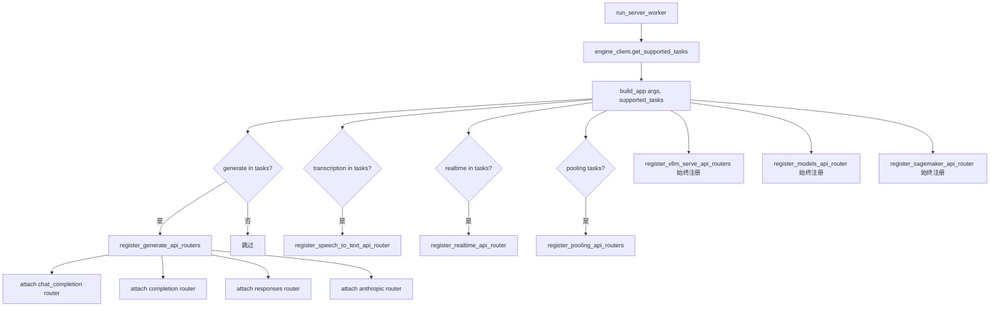
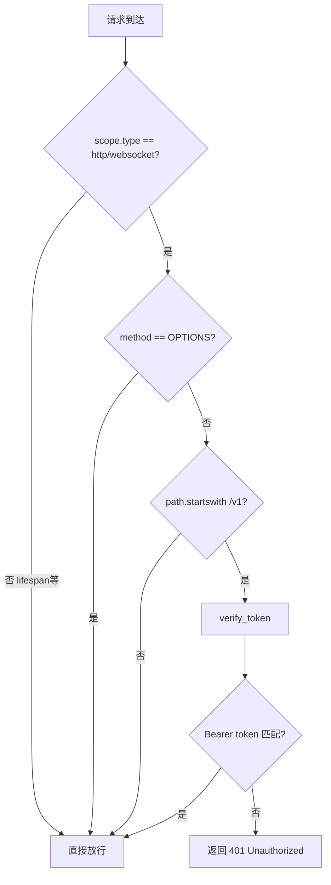
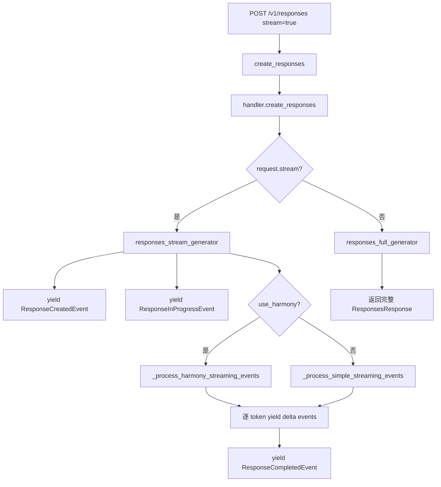

# PD-384.01 vLLM — FastAPI 模块化路由与任务感知端点注册

> 文档编号：PD-384.01
> 来源：vLLM `vllm/entrypoints/openai/api_server.py`
> GitHub：https://github.com/vllm-project/vllm.git
> 问题域：PD-384 OpenAI兼容API OpenAI-Compatible API
> 状态：可复用方案

---

## 第 1 章 问题与动机（Problem & Motivation）

### 1.1 核心问题

LLM 推理引擎需要对外暴露与 OpenAI SDK 完全兼容的 HTTP API，使得用户只需将 `base_url` 指向自部署服务即可无缝切换。这要求：

1. **协议精确对齐**：请求/响应 schema 必须与 OpenAI 官方 SDK 的 Pydantic 模型一一对应，包括 Chat Completion、Completion、Embedding、Responses（新 API）、Realtime（WebSocket）、Speech-to-Text 等全部端点
2. **流式 SSE 输出**：Chat Completion 和 Responses API 均需支持 `stream=true`，以 `text/event-stream` 格式逐 token 推送，且事件类型（`response.output_text.delta` 等）必须与 OpenAI 一致
3. **多端点按需注册**：不同模型支持不同任务（generate / embed / classify / score / transcription / realtime），API 路由必须根据模型能力动态注册，避免暴露不支持的端点
4. **认证与中间件可插拔**：生产部署需要 Bearer Token 认证、CORS、请求 ID 追踪、自定义中间件等，且需支持 SageMaker 等云平台的特殊协议适配
5. **多协议支持**：除 HTTP/REST 外，还需支持 gRPC 用于内部高效通信，以及 Anthropic Messages API 兼容

### 1.2 vLLM 的解法概述

vLLM 采用 **FastAPI + 模块化 APIRouter + 任务感知动态注册** 架构：

1. **模块化路由注册**：每个 API 端点（chat_completion、completion、responses、models、sagemaker 等）独立定义 `APIRouter`，通过 `attach_router(app)` 函数挂载到主 FastAPI 实例（`api_server.py:181-240`）
2. **任务感知条件注册**：`build_app()` 根据引擎返回的 `supported_tasks` 元组，有条件地注册路由——只有模型支持 `generate` 时才注册 Chat/Completion/Responses，支持 `transcription` 才注册 Speech-to-Text（`api_server.py:197-239`）
3. **Serving 层继承体系**：所有端点共享 `OpenAIServing` 基类（`engine/serving.py`），提供统一的模型检查、错误响应构造、请求预处理、LoRA 适配等能力，各端点（`OpenAIServingChat`、`OpenAIServingResponses`、`OpenAIServingCompletion`）继承并实现特定逻辑
4. **ASGI 中间件栈**：认证（`AuthenticationMiddleware`）、请求 ID（`XRequestIdMiddleware`）、弹性伸缩（`ScalingMiddleware`）、CORS 以及用户自定义中间件通过 `--middleware` 参数动态加载（`api_server.py:242-285`）
5. **SSE 流式输出**：Responses API 通过 `_convert_stream_to_sse_events()` 将 AsyncGenerator 转为标准 SSE 格式（`responses/api_router.py:34-44`），Chat Completion 直接返回 `StreamingResponse`

### 1.3 设计思想

| 设计原则 | 具体实现 | 理由 | 替代方案 |
|----------|----------|------|----------|
| 模块化路由 | 每个端点独立 `APIRouter` + `attach_router()` | 端点可独立开发/测试，新增端点零侵入 | 单文件集中定义所有路由（难维护） |
| 任务感知注册 | `build_app()` 按 `supported_tasks` 条件注册 | 避免暴露模型不支持的端点，返回清晰错误 | 注册所有路由，运行时返回 501（用户体验差） |
| Serving 继承体系 | `OpenAIServing` 基类 + 端点子类 | 复用模型检查、错误处理、LoRA 等通用逻辑 | 每个端点独立实现（大量重复代码） |
| ASGI 原生中间件 | `AuthenticationMiddleware` 直接实现 ASGI 协议 | 比 FastAPI Depends 更高效，支持 WebSocket | FastAPI Depends（不支持 WebSocket 认证） |
| 动态中间件加载 | `--middleware` 参数 + `importlib.import_module` | 用户可注入自定义中间件无需改源码 | 硬编码中间件列表（不灵活） |

---

## 第 2 章 源码实现分析（Source Code Analysis）

### 2.1 架构概览

vLLM 的 OpenAI 兼容 API 层采用三层架构：路由层（APIRouter）→ 服务层（Serving）→ 引擎层（EngineClient）。

```
┌─────────────────────────────────────────────────────────────────┐
│                        FastAPI Application                       │
│  ┌──────────────────────────────────────────────────────────┐   │
│  │              Middleware Stack (ASGI)                       │   │
│  │  Auth → XRequestId → Scaling → CORS → Custom Middleware   │   │
│  └──────────────────────────────────────────────────────────┘   │
│                              │                                   │
│  ┌──────────┬──────────┬──────────┬──────────┬──────────────┐   │
│  │ /v1/chat │ /v1/     │ /v1/     │ /v1/     │ /v1/         │   │
│  │ /complet │ complet  │ responses│ models   │ embeddings   │   │
│  │ ions     │ ions     │          │          │              │   │
│  │ (Router) │ (Router) │ (Router) │ (Router) │ (Router)     │   │
│  └────┬─────┴────┬─────┴────┬─────┴────┬─────┴──────┬───────┘   │
│       │          │          │          │            │             │
│  ┌────▼─────┬────▼─────┬────▼──────┬───▼────┬───────▼────────┐   │
│  │Serving   │Serving   │Serving    │Serving │Serving         │   │
│  │Chat      │Completion│Responses  │Models  │Embedding       │   │
│  └────┬─────┴────┬─────┴────┬──────┴───┬────┴───────┬────────┘   │
│       └──────────┴──────────┴──────────┴────────────┘             │
│                         │                                         │
│                    OpenAIServing (基类)                            │
│                         │                                         │
│                    EngineClient                                    │
│                    (AsyncLLM)                                      │
└─────────────────────────────────────────────────────────────────┘
```

### 2.2 核心实现

#### 2.2.1 任务感知路由注册



对应源码 `vllm/entrypoints/openai/api_server.py:158-288`：

```python
def build_app(
    args: Namespace, supported_tasks: tuple["SupportedTask", ...] | None = None
) -> FastAPI:
    if args.disable_fastapi_docs:
        app = FastAPI(openapi_url=None, docs_url=None, redoc_url=None, lifespan=lifespan)
    elif args.enable_offline_docs:
        app = FastAPI(docs_url=None, redoc_url=None, lifespan=lifespan)
    else:
        app = FastAPI(lifespan=lifespan)
    app.state.args = args

    # 始终注册的基础路由
    register_vllm_serve_api_routers(app)  # health, lora, profile, sleep, rpc, cache, tokenize
    register_models_api_router(app)        # /v1/models
    register_sagemaker_api_router(app, supported_tasks)  # SageMaker /invocations

    # 按任务条件注册
    if "generate" in supported_tasks:
        register_generate_api_routers(app)  # chat, completion, responses, anthropic
        attach_disagg_router(app)           # disaggregated serving
        attach_rlhf_router(app)             # RLHF endpoints
        elastic_ep_attach_router(app)       # elastic expert parallelism

    if "transcription" in supported_tasks:
        register_speech_to_text_api_router(app)

    if "realtime" in supported_tasks:
        register_realtime_api_router(app)

    if any(task in POOLING_TASKS for task in supported_tasks):
        register_pooling_api_routers(app, supported_tasks)
    # ... 中间件注册 ...
```

#### 2.2.2 ASGI 认证中间件



对应源码 `vllm/entrypoints/openai/server_utils.py:32-77`：

```python
class AuthenticationMiddleware:
    def __init__(self, app: ASGIApp, tokens: list[str]) -> None:
        self.app = app
        # 安全：存储 SHA-256 哈希而非明文 token
        self.api_tokens = [hashlib.sha256(t.encode("utf-8")).digest() for t in tokens]

    def verify_token(self, headers: Headers) -> bool:
        authorization_header_value = headers.get("Authorization")
        if not authorization_header_value:
            return False
        scheme, _, param = authorization_header_value.partition(" ")
        if scheme.lower() != "bearer":
            return False
        param_hash = hashlib.sha256(param.encode("utf-8")).digest()
        # 时间安全比较，防止 timing attack
        token_match = False
        for token_hash in self.api_tokens:
            token_match |= secrets.compare_digest(param_hash, token_hash)
        return token_match

    def __call__(self, scope, receive, send):
        if scope["type"] not in ("http", "websocket") or scope["method"] == "OPTIONS":
            return self.app(scope, receive, send)
        url_path = URL(scope=scope).path.removeprefix(scope.get("root_path", ""))
        if url_path.startswith("/v1") and not self.verify_token(Headers(scope=scope)):
            response = JSONResponse(content={"error": "Unauthorized"}, status_code=401)
            return response(scope, receive, send)
        return self.app(scope, receive, send)
```

#### 2.2.3 Responses API 流式 SSE 输出



对应源码 `vllm/entrypoints/openai/responses/api_router.py:34-80`：

```python
async def _convert_stream_to_sse_events(
    generator: AsyncGenerator[StreamingResponsesResponse, None],
) -> AsyncGenerator[str, None]:
    """Convert the generator to a stream of events in SSE format"""
    async for event in generator:
        event_type = getattr(event, "type", "unknown")
        # 标准 SSE 格式：event: <type>\ndata: <json>\n\n
        event_data = (
            f"event: {event_type}\ndata: {event.model_dump_json(indent=None)}\n\n"
        )
        yield event_data
```

### 2.3 实现细节

**动态中间件加载机制**（`api_server.py:275-285`）：

vLLM 支持通过 `--middleware` CLI 参数注入自定义中间件，支持两种形式：
- ASGI 中间件类（`inspect.isclass`）→ `app.add_middleware(imported)`
- HTTP 中间件函数（`inspect.iscoroutinefunction`）→ `app.middleware("http")(imported)`

```python
for middleware in args.middleware:
    module_path, object_name = middleware.rsplit(".", 1)
    imported = getattr(importlib.import_module(module_path), object_name)
    if inspect.isclass(imported):
        app.add_middleware(imported)
    elif inspect.iscoroutinefunction(imported):
        app.middleware("http")(imported)
    else:
        raise ValueError(f"Invalid middleware {middleware}.")
```

**Serving 状态初始化**（`api_server.py:291-380`）：

`init_app_state()` 将所有 Serving 实例挂载到 `app.state`，每个端点通过 `request.app.state.openai_serving_xxx` 获取对应 handler。这种模式避免了全局变量，支持多 worker 隔离：

- `state.openai_serving_models` — 模型列表服务
- `state.openai_serving_tokenization` — 分词服务
- `state.openai_serving_chat` — Chat Completion 服务
- `state.openai_serving_responses` — Responses API 服务
- `state.openai_serving_completion` — Completion 服务

**SageMaker 协议适配**（`sagemaker/api_router.py`）：

vLLM 通过 `model_hosting_container_standards` 库自动适配 SageMaker 的 `/invocations` 端点和 `/ping` 健康检查，根据请求体自动路由到对应的 OpenAI 端点处理器。


---

## 第 3 章 迁移指南（Migration Guide）

### 3.1 迁移清单

**阶段 1：基础框架搭建**
- [ ] 创建 FastAPI 应用，配置 lifespan 管理引擎生命周期
- [ ] 定义 `OpenAIServing` 基类，封装模型检查、错误响应、请求预处理
- [ ] 实现 `AuthenticationMiddleware`（ASGI 级别，支持 HTTP + WebSocket）

**阶段 2：端点模块化**
- [ ] 为每个 API 端点创建独立目录：`api_router.py`（路由）+ `serving.py`（业务）+ `protocol.py`（Pydantic 模型）
- [ ] 实现 `attach_router(app)` 模式，每个模块暴露统一挂载接口
- [ ] 实现任务感知条件注册：`build_app(args, supported_tasks)`

**阶段 3：流式输出**
- [ ] 实现 SSE 事件转换器：`AsyncGenerator[Event] → AsyncGenerator[str]`
- [ ] 实现 `sequence_number` 自增机制用于事件排序
- [ ] 支持 background 模式：请求入队后立即返回，后台异步生成

**阶段 4：云平台适配**
- [ ] 实现 SageMaker `/invocations` 端点自动路由
- [ ] 支持 `--middleware` 动态加载自定义中间件

### 3.2 适配代码模板

以下是一个可直接运行的最小化 OpenAI 兼容 API 服务器框架：

```python
"""Minimal OpenAI-compatible API server inspired by vLLM's architecture."""
import hashlib
import importlib
import inspect
import secrets
from argparse import Namespace
from collections.abc import AsyncGenerator
from contextlib import asynccontextmanager
from typing import Any

from fastapi import APIRouter, FastAPI, Request
from fastapi.middleware.cors import CORSMiddleware
from fastapi.responses import JSONResponse, StreamingResponse
from pydantic import BaseModel
from starlette.datastructures import Headers, URL
from starlette.types import ASGIApp, Receive, Scope, Send


# ── 1. Serving 基类 ──────────────────────────────────────────────
class BaseServing:
    """Shared logic for all OpenAI-compatible endpoints."""

    def __init__(self, engine: Any, model_name: str):
        self.engine = engine
        self.model_name = model_name

    def create_error_response(self, message: str, status_code: int = 500) -> dict:
        return {
            "error": {
                "message": message,
                "type": "server_error",
                "code": status_code,
            }
        }

    async def check_model(self, request_model: str) -> dict | None:
        if request_model != self.model_name:
            return self.create_error_response(
                f"Model '{request_model}' not found", 404
            )
        return None


# ── 2. ASGI 认证中间件（vLLM 模式） ─────────────────────────────
class AuthMiddleware:
    """Bearer token auth at ASGI level — works for HTTP and WebSocket."""

    def __init__(self, app: ASGIApp, tokens: list[str]):
        self.app = app
        self.hashes = [hashlib.sha256(t.encode()).digest() for t in tokens]

    async def __call__(self, scope: Scope, receive: Receive, send: Send):
        if scope["type"] not in ("http", "websocket"):
            return await self.app(scope, receive, send)
        path = URL(scope=scope).path
        if not path.startswith("/v1"):
            return await self.app(scope, receive, send)
        auth = Headers(scope=scope).get("Authorization", "")
        if auth.startswith("Bearer "):
            token_hash = hashlib.sha256(auth[7:].encode()).digest()
            if any(secrets.compare_digest(token_hash, h) for h in self.hashes):
                return await self.app(scope, receive, send)
        resp = JSONResponse({"error": "Unauthorized"}, status_code=401)
        return await resp(scope, receive, send)


# ── 3. 模块化路由（Chat Completion 示例） ────────────────────────
chat_router = APIRouter()


class ChatRequest(BaseModel):
    model: str
    messages: list[dict]
    stream: bool = False


@chat_router.post("/v1/chat/completions")
async def create_chat_completion(request: ChatRequest, raw_request: Request):
    handler: BaseServing = raw_request.app.state.chat_serving
    error = await handler.check_model(request.model)
    if error:
        return JSONResponse(error, status_code=error["error"]["code"])

    if request.stream:
        return StreamingResponse(
            content=_stream_chat(handler, request),
            media_type="text/event-stream",
        )
    # Non-streaming: return full response
    result = await handler.engine.generate(request.messages)
    return JSONResponse({"choices": [{"message": {"content": result}}]})


async def _stream_chat(
    handler: BaseServing, request: ChatRequest
) -> AsyncGenerator[str, None]:
    async for token in handler.engine.stream_generate(request.messages):
        chunk = {"choices": [{"delta": {"content": token}}]}
        yield f"data: {JSONResponse(chunk).body.decode()}\n\n"
    yield "data: [DONE]\n\n"


def attach_chat_router(app: FastAPI):
    app.include_router(chat_router)


# ── 4. 任务感知应用构建（vLLM 模式） ────────────────────────────
def build_app(
    args: Namespace,
    supported_tasks: tuple[str, ...],
) -> FastAPI:
    @asynccontextmanager
    async def lifespan(app: FastAPI):
        yield

    app = FastAPI(lifespan=lifespan)

    # 始终注册的路由
    # attach_models_router(app)
    # attach_health_router(app)

    # 按任务条件注册
    if "generate" in supported_tasks:
        attach_chat_router(app)
        # attach_completion_router(app)
        # attach_responses_router(app)

    # 中间件栈
    if api_key := getattr(args, "api_key", None):
        app.add_middleware(AuthMiddleware, tokens=[api_key])

    app.add_middleware(
        CORSMiddleware,
        allow_origins=["*"],
        allow_methods=["*"],
        allow_headers=["*"],
    )

    # 动态中间件加载
    for mw_path in getattr(args, "middleware", []):
        module_path, obj_name = mw_path.rsplit(".", 1)
        imported = getattr(importlib.import_module(module_path), obj_name)
        if inspect.isclass(imported):
            app.add_middleware(imported)
        elif inspect.iscoroutinefunction(imported):
            app.middleware("http")(imported)

    return app
```

### 3.3 适用场景

| 场景 | 适用度 | 说明 |
|------|--------|------|
| 自建 LLM 推理服务 | ⭐⭐⭐ | 核心场景，直接复用全部架构 |
| API 网关/代理层 | ⭐⭐⭐ | 路由注册 + 中间件栈模式可直接迁移 |
| 多模型统一 API | ⭐⭐⭐ | 任务感知注册天然支持不同模型暴露不同端点 |
| 云平台部署适配 | ⭐⭐ | SageMaker 适配模式可参考，其他云需自行实现 |
| 微服务 API 设计 | ⭐⭐ | 模块化路由模式通用，但 Serving 继承体系偏 LLM 特化 |

---

## 第 4 章 测试用例（Test Cases）

```python
"""Tests for OpenAI-compatible API server architecture patterns."""
import hashlib
import secrets
from unittest.mock import AsyncMock, MagicMock

import pytest
from fastapi import FastAPI
from fastapi.testclient import TestClient
from starlette.datastructures import Headers


# ── AuthenticationMiddleware Tests ────────────────────────────────

class FakeAuthMiddleware:
    """Simplified version of vLLM's AuthenticationMiddleware for testing."""

    def __init__(self, app, tokens: list[str]):
        self.app = app
        self.api_tokens = [hashlib.sha256(t.encode()).digest() for t in tokens]

    def verify_token(self, headers: dict) -> bool:
        auth = headers.get("authorization", "")
        if not auth.startswith("Bearer "):
            return False
        param_hash = hashlib.sha256(auth[7:].encode()).digest()
        return any(
            secrets.compare_digest(param_hash, h) for h in self.api_tokens
        )

    async def __call__(self, scope, receive, send):
        if scope["type"] != "http":
            return await self.app(scope, receive, send)
        from starlette.datastructures import URL
        path = URL(scope=scope).path
        if path.startswith("/v1"):
            headers = dict(Headers(scope=scope))
            if not self.verify_token(headers):
                from fastapi.responses import JSONResponse
                resp = JSONResponse({"error": "Unauthorized"}, status_code=401)
                return await resp(scope, receive, send)
        return await self.app(scope, receive, send)


class TestAuthMiddleware:
    def setup_method(self):
        self.app = FastAPI()
        self.app.add_middleware(FakeAuthMiddleware, tokens=["test-key-123"])

        @self.app.get("/v1/models")
        async def models():
            return {"data": []}

        @self.app.get("/health")
        async def health():
            return {"status": "ok"}

        self.client = TestClient(self.app)

    def test_valid_token_passes(self):
        resp = self.client.get(
            "/v1/models",
            headers={"Authorization": "Bearer test-key-123"},
        )
        assert resp.status_code == 200

    def test_invalid_token_rejected(self):
        resp = self.client.get(
            "/v1/models",
            headers={"Authorization": "Bearer wrong-key"},
        )
        assert resp.status_code == 401

    def test_missing_token_rejected(self):
        resp = self.client.get("/v1/models")
        assert resp.status_code == 401

    def test_non_v1_path_bypasses_auth(self):
        resp = self.client.get("/health")
        assert resp.status_code == 200

    def test_timing_safe_comparison(self):
        """Verify SHA-256 hashing prevents timing attacks."""
        middleware = FakeAuthMiddleware(None, tokens=["secret"])
        # Both should take similar time regardless of token length
        assert not middleware.verify_token({"authorization": "Bearer x"})
        assert not middleware.verify_token({"authorization": "Bearer " + "x" * 1000})


# ── Task-Aware Route Registration Tests ──────────────────────────

class TestTaskAwareRegistration:
    def _build_app(self, supported_tasks: tuple[str, ...]) -> FastAPI:
        app = FastAPI()

        if "generate" in supported_tasks:
            router = MagicMock()
            router.__class__ = type(MagicMock())

            from fastapi import APIRouter
            gen_router = APIRouter()

            @gen_router.post("/v1/chat/completions")
            async def chat():
                return {"ok": True}

            app.include_router(gen_router)

        if "embed" in supported_tasks:
            from fastapi import APIRouter
            embed_router = APIRouter()

            @embed_router.post("/v1/embeddings")
            async def embed():
                return {"ok": True}

            app.include_router(embed_router)

        return app

    def test_generate_task_registers_chat(self):
        app = self._build_app(("generate",))
        client = TestClient(app)
        resp = client.post("/v1/chat/completions", json={})
        assert resp.status_code != 404

    def test_embed_only_no_chat(self):
        app = self._build_app(("embed",))
        client = TestClient(app)
        resp = client.post("/v1/chat/completions", json={})
        assert resp.status_code == 404  # 405 Method Not Allowed or 404

    def test_multiple_tasks(self):
        app = self._build_app(("generate", "embed"))
        client = TestClient(app)
        assert client.post("/v1/chat/completions", json={}).status_code != 404
        assert client.post("/v1/embeddings", json={}).status_code != 404


# ── SSE Stream Format Tests ──────────────────────────────────────

class TestSSEFormat:
    def test_sse_event_format(self):
        """Verify SSE output matches OpenAI's format."""
        from pydantic import BaseModel

        class FakeEvent(BaseModel):
            type: str = "response.output_text.delta"
            delta: str = "Hello"

            def model_dump_json(self, indent=None):
                return '{"type":"response.output_text.delta","delta":"Hello"}'

        event = FakeEvent()
        event_type = event.type
        sse_line = f"event: {event_type}\ndata: {event.model_dump_json()}\n\n"

        assert sse_line.startswith("event: response.output_text.delta\n")
        assert "data: " in sse_line
        assert sse_line.endswith("\n\n")

    def test_sequence_number_increment(self):
        """Verify sequence numbers auto-increment."""
        sequence_number = 0

        class FakeEvent:
            def __init__(self):
                self.sequence_number = -1

        def increment_and_return(event):
            nonlocal sequence_number
            event.sequence_number = sequence_number
            sequence_number += 1
            return event

        events = [increment_and_return(FakeEvent()) for _ in range(5)]
        assert [e.sequence_number for e in events] == [0, 1, 2, 3, 4]
```


---

## 第 5 章 跨域关联

| 关联域 | 关系类型 | 说明 |
|--------|----------|------|
| PD-10 中间件管道 | 协同 | vLLM 的 ASGI 中间件栈（Auth → XRequestId → Scaling → CORS → Custom）是典型的中间件管道模式，`--middleware` 动态加载机制可作为 PD-10 的参考实现 |
| PD-11 可观测性 | 协同 | `RequestLogger`、`log_response` 中间件、Prometheus metrics、OpenTelemetry tracing（`@instrument` 装饰器）构成完整的可观测性体系 |
| PD-03 容错与重试 | 依赖 | Responses API 的 `finish_reason='error'` 检测（`_raise_if_error`）和 `GenerationError` 异常处理依赖容错机制；`background` 模式下的任务失败状态管理也属于容错范畴 |
| PD-04 工具系统 | 协同 | Responses API 深度集成 MCP 工具服务器（`ToolServer`），支持 `web_search_preview`、`code_interpreter`、`container` 等内置工具，以及自定义 MCP 工具 |
| PD-01 上下文管理 | 依赖 | `_validate_generator_input` 检查 prompt 长度不超过 `max_model_len`，`get_max_tokens` 动态计算可用输出 token 数，属于上下文窗口管理 |

---

## 第 6 章 来源文件索引

| 文件 | 行范围 | 关键实现 |
|------|--------|----------|
| `vllm/entrypoints/openai/api_server.py` | L158-L288 | `build_app()` 任务感知路由注册 + 中间件栈构建 |
| `vllm/entrypoints/openai/api_server.py` | L291-L380 | `init_app_state()` Serving 实例初始化与状态挂载 |
| `vllm/entrypoints/openai/api_server.py` | L464-L531 | `run_server()` / `run_server_worker()` 服务启动流程 |
| `vllm/entrypoints/openai/server_utils.py` | L32-L77 | `AuthenticationMiddleware` ASGI 认证中间件 |
| `vllm/entrypoints/openai/server_utils.py` | L80-L108 | `XRequestIdMiddleware` 请求 ID 追踪中间件 |
| `vllm/entrypoints/openai/server_utils.py` | L187-L238 | `SSEDecoder` 流式响应解码器 |
| `vllm/entrypoints/openai/generate/api_router.py` | L19-L43 | `register_generate_api_routers()` 聚合注册 chat/completion/responses/anthropic |
| `vllm/entrypoints/openai/generate/api_router.py` | L45-L94 | `init_generate_state()` 初始化 Chat/Completion/Responses Serving 实例 |
| `vllm/entrypoints/openai/chat_completion/api_router.py` | L34-L73 | `/v1/chat/completions` 路由定义 + 流式/非流式分发 |
| `vllm/entrypoints/openai/chat_completion/serving.py` | L88-L150 | `OpenAIServingChat` 构造函数，配置 parser/tool/reasoning |
| `vllm/entrypoints/openai/responses/api_router.py` | L34-L44 | `_convert_stream_to_sse_events()` SSE 格式转换 |
| `vllm/entrypoints/openai/responses/api_router.py` | L47-L80 | `/v1/responses` POST 路由 + 流式/非流式/错误分发 |
| `vllm/entrypoints/openai/responses/serving.py` | L160-L269 | `OpenAIServingResponses.__init__()` 初始化 parser/store/harmony |
| `vllm/entrypoints/openai/responses/serving.py` | L326-L594 | `create_responses()` 核心请求处理流程 |
| `vllm/entrypoints/openai/responses/serving.py` | L1654-L1758 | `responses_stream_generator()` 流式事件生成器 |
| `vllm/entrypoints/openai/models/api_router.py` | L20-L29 | `/v1/models` 端点 |
| `vllm/entrypoints/sagemaker/api_router.py` | L27-L80 | SageMaker `/invocations` 自动路由适配 |
| `vllm/entrypoints/serve/__init__.py` | L12-L57 | `register_vllm_serve_api_routers()` 基础服务路由注册 |

---

## 第 7 章 横向对比维度

```json comparison_data
{
  "project": "vLLM",
  "dimensions": {
    "协议兼容性": "直接导入 openai SDK 的 Pydantic 模型，支持 Chat/Completion/Responses/Realtime/Anthropic 全端点",
    "路由架构": "FastAPI + 模块化 APIRouter + attach_router() 挂载，按 supported_tasks 条件注册",
    "流式输出": "AsyncGenerator → SSE event: type\\ndata: json 格式，sequence_number 自增排序",
    "认证机制": "ASGI 级 AuthenticationMiddleware，SHA-256 哈希存储 + secrets.compare_digest 时间安全比较",
    "中间件扩展": "--middleware CLI 参数 + importlib 动态加载，支持 ASGI 类和 HTTP 协程函数两种形式",
    "云平台适配": "SageMaker /invocations 自动路由 + model_hosting_container_standards 库集成",
    "多协议支持": "HTTP/REST + gRPC + WebSocket(Realtime) + Anthropic Messages API 四协议并行"
  }
}
```

### 域元数据补充

```json domain_metadata
{
  "solution_summary": "vLLM 用 FastAPI 模块化 APIRouter + supported_tasks 条件注册实现全端点 OpenAI 兼容，含 ASGI 认证中间件、SSE 流式输出和 SageMaker 适配",
  "description": "推理引擎如何构建生产级 OpenAI 兼容 API 层，含路由、认证、流式和云平台适配",
  "sub_problems": [
    "任务感知动态端点注册",
    "Responses API 后台异步执行与状态管理",
    "多 API 协议并行（OpenAI + Anthropic + gRPC）",
    "自定义中间件动态加载"
  ],
  "best_practices": [
    "用 ASGI 原生中间件替代 FastAPI Depends 实现认证以支持 WebSocket",
    "SHA-256 哈希存储 token + secrets.compare_digest 防止 timing attack",
    "按模型 supported_tasks 条件注册路由避免暴露不支持的端点"
  ]
}
```

