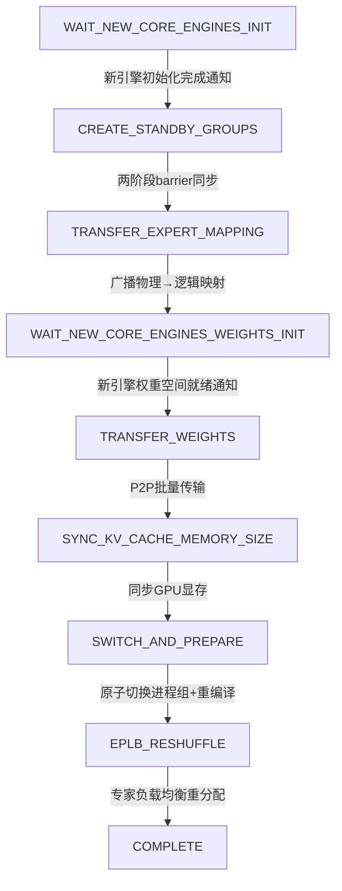
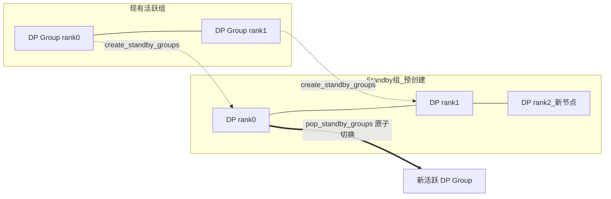
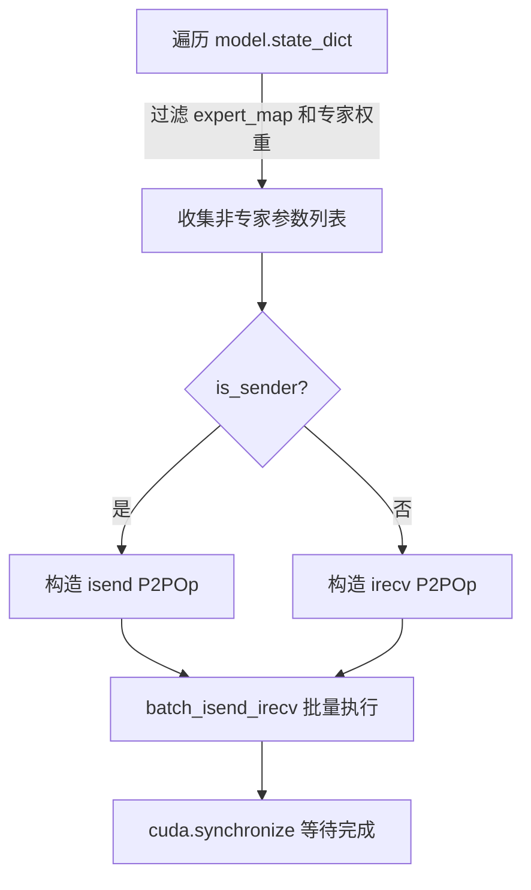

# PD-385.01 vLLM — Elastic Expert Parallelism 弹性伸缩

> 文档编号：PD-385.01
> 来源：vLLM `vllm/distributed/elastic_ep/`
> GitHub：https://github.com/vllm-project/vllm.git
> 问题域：PD-385 弹性伸缩 Elastic Scaling
> 状态：可复用方案

---

## 第 1 章 问题与动机

### 1.1 核心问题

大规模 MoE（Mixture-of-Experts）推理集群面临一个关键挑战：**如何在不中断在线推理服务的前提下，动态增减 Expert Parallelism（EP）节点？**

传统做法是停机重启整个集群，重新分配专家权重。这在生产环境中不可接受——每次扩缩容都意味着服务中断、请求丢失、SLA 违约。核心难点包括：

1. **进程组拓扑变更**：PyTorch 的 `torch.distributed` 进程组一旦创建就不可变，增减节点需要销毁重建
2. **权重在线迁移**：数十 GB 的专家权重需要在节点间 P2P 传输，且不能阻塞正在执行的推理请求
3. **专家映射一致性**：物理专家到逻辑专家的映射表必须在所有节点间保持一致
4. **CUDA 图失效**：拓扑变更后已编译的 CUDA Graph 和 torch.compile 缓存全部失效，需要重新预热

### 1.2 vLLM 的解法概述

vLLM 实现了一套完整的 Elastic EP 系统，核心设计：

1. **Standby Group 双轨通信**：在现有进程组运行的同时，预创建包含新节点的 "standby" 通信组，通过 `StatelessGroupCoordinator` 实现独立于 PyTorch WORLD group 的进程组管理（`standby_state.py:37-94`）
2. **8 阶段状态机编排**：`ElasticEPScalingState` 用 4 种状态机（ScaleUp Existing/New、ScaleDown Remaining/Removing）精确控制每个阶段的执行顺序（`elastic_state.py:33-62`）
3. **批量 P2P 权重传输**：`batch_transfer_weights` 将非专家权重通过 `batch_isend_irecv` 批量传输，专家权重通过 EPLB 重分配（`elastic_execute.py:46-83`）
4. **HTTP 503 流量屏蔽**：ASGI 中间件在伸缩期间拦截所有请求返回 503，保证伸缩过程的原子性（`middleware.py:22-49`）
5. **两阶段 TCPStore Barrier**：解决不同 EngineCore 接收重配置通知时间差的同步问题（`elastic_state.py:168-211`）

### 1.3 设计思想

| 设计原则 | 具体实现 | 理由 | 替代方案 |
|----------|----------|------|----------|
| 无状态进程组 | `StatelessGroupCoordinator` 独立于 WORLD group | PyTorch 原生进程组不支持动态成员变更 | 重启整个 distributed 环境（停机） |
| 双轨切换 | standby group 预建 → 原子切换 → 销毁旧组 | 最小化切换窗口，避免通信中断 | 逐节点滚动更新（复杂度高） |
| 状态机驱动 | IntEnum 状态 + progress() 轮询推进 | 与 EngineCore busy loop 自然集成，非阻塞 | 异步回调链（调试困难） |
| 发送者-接收者配对 | 均匀分配：每个旧节点发送给 k 或 k+1 个新节点 | 避免单节点成为传输瓶颈 | 广播（带宽浪费） |
| 流量屏蔽 | 全局 bool flag + ASGI middleware | 简单可靠，避免伸缩期间请求进入不一致状态 | 请求排队（增加延迟和内存） |

---

## 第 2 章 源码实现分析

### 2.1 架构概览

vLLM Elastic EP 的整体架构分为 4 层：

```
┌─────────────────────────────────────────────────────────────┐
│                    API Layer (FastAPI)                       │
│  /scale_elastic_ep → ScalingMiddleware (503 guard)          │
├─────────────────────────────────────────────────────────────┤
│              State Machine Layer (Engine Core)               │
│  ElasticEPScalingState: 4 种状态机 × progress() 轮询        │
│  ScaleUpExisting(8态) / ScaleUpNew(3态)                     │
│  ScaleDownRemaining(4态) / ScaleDownRemoving(3态)           │
├─────────────────────────────────────────────────────────────┤
│              Execution Layer (Worker)                        │
│  ElasticEPScalingExecutor: 权重传输 / 专家映射 / MoE重配    │
│  batch_transfer_weights / broadcast_expert_mapping           │
├─────────────────────────────────────────────────────────────┤
│           Communication Layer (Distributed)                  │
│  StatelessGroupCoordinator: 独立进程组管理                   │
│  standby_state: WORLD/DP/EP/EPLB 四组 standby 通信组        │
└─────────────────────────────────────────────────────────────┘
```

### 2.2 核心实现

#### 2.2.1 Scale-Up 状态机（8 阶段）



对应源码 `elastic_state.py:33-42`（状态定义）和 `elastic_state.py:213-291`（状态推进）：

```python
class ScaleUpExistingEngineState(enum.IntEnum):
    WAIT_NEW_CORE_ENGINES_INIT = 0
    CREATE_STANDBY_GROUPS = 1
    TRANSFER_EXPERT_MAPPING = 2
    WAIT_NEW_CORE_ENGINES_WEIGHTS_INIT = 3
    TRANSFER_WEIGHTS = 4
    SYNC_KV_CACHE_MEMORY_SIZE = 5
    SWITCH_AND_PREPARE = 6
    EPLB_RESHUFFLE = 7
    COMPLETE = 8
```

`progress()` 方法在 EngineCore 的 busy loop 中被每轮调用，非阻塞地推进状态（`elastic_state.py:125-136`）：

```python
def progress(self) -> bool:
    if self.scale_type == "scale_up":
        return (
            self._progress_new_engine()
            if self.worker_type == "new"
            else self._progress_existing_engine()
        )
    return (
        self._progress_removing_engine()
        if self.worker_type == "removing"
        else self._progress_remaining_engine()
    )
```

#### 2.2.2 Standby Group 双轨通信



对应源码 `standby_state.py:37-94`，`create_standby_groups` 为新拓扑预建 4 类通信组：

```python
def create_standby_groups(
    new_dp_size: int,
    new_world_size_across_dp: int,
    master_ip: str,
    world_group_ports: list[list[int]],
    dp_group_ports: list[list[int]],
    ep_group_ports: list[list[int]],
    eplb_group_ports: list[list[int]] | None = None,
    backend: str | None = None,
) -> None:
    # ... 创建 WORLD / DP / EP / EPLB 四组 standby 通信组
    all_ranks = torch.arange(new_world_size_across_dp).reshape(
        -1, new_dp_size, pp_size, tp_size
    )
    standby_dp_ranks = all_ranks.transpose(1, 3).reshape(-1, new_dp_size).unbind(0)
    _STANDBY_DP = _init_stateless_group(
        standby_dp_ranks, "dp", dp_group_ports, master_ip, backend
    )
```

切换时通过 `pop_standby_groups()` 一次性取出所有 standby 组并清空状态（`standby_state.py:96-117`），然后 `_replace_active_groups()` 原子替换活跃组。

#### 2.2.3 批量权重传输



对应源码 `elastic_execute.py:46-83`：

```python
def batch_transfer_weights(
    model: nn.Module,
    is_sender: bool,
    peer_rank: int,
    dp_group: StatelessGroupCoordinator,
    expert_weights: Sequence[Iterable[torch.Tensor]],
) -> None:
    # 过滤掉专家权重和 expert_map，只传输共享参数
    expert_weights_set = set()
    for weight_group in expert_weights:
        for weight in weight_group:
            expert_weights_set.add(weight.data_ptr())

    state_dict = model.state_dict()
    all_params = []
    for name, param in state_dict.items():
        if name.endswith("expert_map"):
            continue
        if param.data_ptr() not in expert_weights_set:
            all_params.append(param.data)

    # 构造 P2P 操作列表并批量执行
    p2p_ops = []
    for param in all_params:
        op = object.__new__(P2POp)
        op.op = torch.distributed.isend if is_sender else torch.distributed.irecv
        op.tensor = param
        op.group_peer = peer_rank
        p2p_ops.append(op)
    device_comm.batch_isend_irecv(p2p_ops)
```

发送者-接收者配对算法（`elastic_execute.py:193-209`）确保负载均匀：每个旧节点发送给 `num_new / old_dp_size` 个新节点，余数分配给前 `remainder` 个发送者。

### 2.3 实现细节

**两阶段 TCPStore Barrier**（`elastic_state.py:168-211`）：

不同 EngineCore 可能在不同时间收到重配置通知。已进入伸缩流程的 EngineCore 如果直接等待 barrier，会阻塞 busy loop 导致其他 EngineCore 的 forward 步骤无法完成。解决方案：

1. 第一次执行 barrier 时设置 5 秒超时
2. 超时则设置 `sync_key` 标记，返回 `False`，让 EngineCore 继续执行一轮 forward
3. 下一轮 progress() 检测到 `sync_key` 存在，执行无超时 barrier（此时所有 EngineCore 都已就绪）

**MoE 模块重配置**（`elastic_execute.py:277-304`）：

切换后需要更新所有 FusedMoE 模块的 `num_experts`、`moe_parallel_config`，并强制重建 modular kernel 和 all2all manager。

**CUDA Graph 清理**（`elastic_execute.py:389-414`）：

拓扑变更后，已捕获的 CUDA Graph 全部失效。代码清空 `concrete_cudagraph_entries`，重置 `torch.compiler`，执行 `gc.collect()` + `torch.cuda.empty_cache()`，然后重新 warm up。


---

## 第 3 章 迁移指南

### 3.1 迁移清单

**阶段 1：通信层抽象（必须）**

- [ ] 实现 `StatelessGroupCoordinator`：独立于 PyTorch WORLD group 的进程组管理器
- [ ] 支持 device（NCCL）、CPU（Gloo）、TCPStore 三种通信后端
- [ ] 实现 `create_standby_groups` / `pop_standby_groups` 双轨切换机制
- [ ] 实现 `_replace_active_groups` 原子替换活跃通信组

**阶段 2：状态机编排（必须）**

- [ ] 定义 Scale-Up / Scale-Down 状态枚举
- [ ] 实现 `progress()` 非阻塞轮询推进
- [ ] 实现两阶段 TCPStore barrier 同步
- [ ] 处理 notification 驱动的状态转换

**阶段 3：权重迁移（必须）**

- [ ] 实现 `batch_transfer_weights`：P2P 批量传输非专家参数
- [ ] 实现发送者-接收者均匀配对算法
- [ ] 实现 `broadcast_expert_mapping`：广播物理→逻辑专家映射

**阶段 4：API 与流量管理（推荐）**

- [ ] 添加 `/scale` HTTP 端点
- [ ] 实现 ASGI 中间件在伸缩期间返回 503
- [ ] 支持 drain_timeout 参数

**阶段 5：运行时重配置（按需）**

- [ ] MoE 模块 num_experts / parallel_config 热更新
- [ ] CUDA Graph 清理与重新预热
- [ ] torch.compile 缓存重置
- [ ] KV Cache 显存同步

### 3.2 适配代码模板

以下是一个简化的弹性伸缩状态机框架，可直接复用：

```python
import enum
import weakref
from typing import Literal

class ScaleState(enum.IntEnum):
    IDLE = 0
    CREATE_STANDBY = 1
    TRANSFER_WEIGHTS = 2
    SWITCH_GROUPS = 3
    REBALANCE = 4
    COMPLETE = 5

class ElasticScalingOrchestrator:
    """弹性伸缩编排器 — 从 vLLM ElasticEPScalingState 提炼"""

    def __init__(self, executor, worker_type: Literal["existing", "new"]):
        self.executor_ref = weakref.ref(executor)
        self.worker_type = worker_type
        self.state = ScaleState.IDLE
        self._standby_groups = None

    def progress(self) -> bool:
        """在主循环中每轮调用，非阻塞推进状态。返回 True 表示有进展。"""
        if self.state == ScaleState.IDLE:
            return False

        if self.state == ScaleState.CREATE_STANDBY:
            self._standby_groups = self._create_standby_groups()
            self.state = ScaleState.TRANSFER_WEIGHTS
            return True

        if self.state == ScaleState.TRANSFER_WEIGHTS:
            self._transfer_weights()
            self.state = ScaleState.SWITCH_GROUPS
            return True

        if self.state == ScaleState.SWITCH_GROUPS:
            self._atomic_switch(self._standby_groups)
            self._standby_groups = None
            self.state = ScaleState.REBALANCE
            return True

        if self.state == ScaleState.REBALANCE:
            self._rebalance()
            self.state = ScaleState.COMPLETE
            return True

        return self.state == ScaleState.COMPLETE

    def start_scale(self, new_size: int):
        """触发伸缩流程"""
        self._new_size = new_size
        self.state = ScaleState.CREATE_STANDBY

    def _create_standby_groups(self):
        """预创建新拓扑的通信组（不影响现有组）"""
        raise NotImplementedError

    def _transfer_weights(self):
        """P2P 批量传输模型权重到新节点"""
        raise NotImplementedError

    def _atomic_switch(self, standby_groups):
        """原子切换：standby → active，销毁旧组"""
        raise NotImplementedError

    def _rebalance(self):
        """专家/负载重新均衡"""
        raise NotImplementedError
```

### 3.3 适用场景

| 场景 | 适用度 | 说明 |
|------|--------|------|
| MoE 模型推理集群弹性伸缩 | ⭐⭐⭐ | 直接适用，vLLM 的核心场景 |
| Dense 模型 DP 动态扩缩容 | ⭐⭐⭐ | 去掉专家相关逻辑，保留通信组切换和权重传输 |
| 训练集群弹性伸缩 | ⭐⭐ | 需额外处理优化器状态和学习率调度器 |
| 微服务动态扩缩容 | ⭐ | 过于重量级，微服务场景用 K8s HPA 更合适 |
| 多租户推理资源调度 | ⭐⭐⭐ | standby group 机制可复用于租户间资源迁移 |

---

## 第 4 章 测试用例

```python
import pytest
import torch
import enum
from unittest.mock import MagicMock, patch


class ScaleUpState(enum.IntEnum):
    WAIT_INIT = 0
    CREATE_STANDBY = 1
    TRANSFER = 2
    SWITCH = 3
    COMPLETE = 4


class TestElasticEPScaling:
    """基于 vLLM elastic_state.py 和 elastic_execute.py 的测试"""

    def test_sender_receiver_pairing_even(self):
        """测试均匀配对：4 个旧节点扩到 8 个，每个旧节点发送给 1 个新节点"""
        old_dp_size = 4
        new_dp_size = 8
        num_new = new_dp_size - old_dp_size
        num_per_sender = num_new // old_dp_size  # 1
        remainder = num_new % old_dp_size  # 0

        for dp_rank in range(old_dp_size):
            recv_begin = dp_rank * num_per_sender
            recv_end = recv_begin + num_per_sender
            ranks = list(range(old_dp_size + recv_begin, old_dp_size + recv_end))
            assert len(ranks) == 1
            assert ranks[0] == old_dp_size + dp_rank

    def test_sender_receiver_pairing_uneven(self):
        """测试不均匀配对：2 个旧节点扩到 5 个，rank0 发 2 个，rank1 发 1 个"""
        old_dp_size = 2
        new_dp_size = 5
        num_new = 3
        num_per_sender = num_new // old_dp_size  # 1
        remainder = num_new % old_dp_size  # 1

        # rank 0: remainder=1, 所以 recv_begin=0, recv_end=2
        dp_rank = 0
        recv_begin = dp_rank * (num_per_sender + 1)
        recv_end = recv_begin + num_per_sender + 1
        ranks_0 = list(range(old_dp_size + recv_begin, old_dp_size + recv_end))
        assert ranks_0 == [2, 3]

        # rank 1: recv_begin=2, recv_end=3
        dp_rank = 1
        recv_begin = remainder * (num_per_sender + 1) + (dp_rank - remainder) * num_per_sender
        recv_end = recv_begin + num_per_sender
        ranks_1 = list(range(old_dp_size + recv_begin, old_dp_size + recv_end))
        assert ranks_1 == [4]

    def test_standby_groups_lifecycle(self):
        """测试 standby group 创建→取出→清空的生命周期"""
        # 模拟 standby state 模块的全局变量行为
        standby = {"world": "group_w", "dp": "group_dp", "ep": "group_ep",
                   "eplb": "group_eplb", "node_count": 2}

        # pop 后应返回所有组并清空
        result = standby.copy()
        standby = {k: None for k in standby}

        assert result["world"] == "group_w"
        assert result["dp"] == "group_dp"
        assert all(v is None for v in standby.values())

    def test_state_machine_progression(self):
        """测试状态机按顺序推进"""
        states_visited = []
        state = ScaleUpState.CREATE_STANDBY

        while state != ScaleUpState.COMPLETE:
            states_visited.append(state)
            state = ScaleUpState(state + 1)

        assert states_visited == [
            ScaleUpState.CREATE_STANDBY,
            ScaleUpState.TRANSFER,
            ScaleUpState.SWITCH,
        ]

    def test_scaling_middleware_blocks_requests(self):
        """测试伸缩期间中间件返回 503"""
        scaling_flag = False

        def check_request():
            if scaling_flag:
                return 503, "scaling in progress"
            return 200, "ok"

        assert check_request() == (200, "ok")
        scaling_flag = True
        assert check_request() == (503, "scaling in progress")
        scaling_flag = False
        assert check_request() == (200, "ok")

    def test_expert_mapping_expansion(self):
        """测试扩容时物理→逻辑映射表的扩展"""
        num_moe_layers = 4
        old_ep_size = 2
        new_ep_size = 4
        num_local_experts = 8

        old_map = torch.randint(0, 16, (num_moe_layers, num_local_experts * old_ep_size))
        expanded = torch.full(
            (num_moe_layers, num_local_experts * new_ep_size), -1, dtype=old_map.dtype
        )
        expanded[:, :num_local_experts * old_ep_size] = old_map

        assert expanded.shape == (4, 32)
        assert (expanded[:, :16] == old_map).all()
        assert (expanded[:, 16:] == -1).all()
```


---

## 第 5 章 跨域关联

| 关联域 | 关系类型 | 说明 |
|--------|----------|------|
| PD-02 多 Agent 编排 | 协同 | 弹性伸缩的状态机编排模式可复用于多 Agent 协调场景，progress() 轮询模式适合事件循环集成 |
| PD-03 容错与重试 | 依赖 | 两阶段 TCPStore barrier 本质是一种容错同步机制，处理节点间时序不一致；权重传输失败需要重试 |
| PD-04 工具系统 | 协同 | StatelessGroupCoordinator 可作为分布式工具调用的通信基础设施 |
| PD-11 可观测性 | 依赖 | 伸缩过程的每个阶段都有 logger.info 日志，生产环境需要更完善的指标追踪（传输耗时、显存变化等） |

---

## 第 6 章 来源文件索引

| 文件 | 行范围 | 关键实现 |
|------|--------|----------|
| `vllm/distributed/elastic_ep/elastic_state.py` | L33-L62 | 4 种状态机枚举定义（ScaleUp/ScaleDown × Existing/New/Remaining/Removing） |
| `vllm/distributed/elastic_ep/elastic_state.py` | L73-L136 | `ElasticEPScalingState` 类：状态机初始化与 progress() 分发 |
| `vllm/distributed/elastic_ep/elastic_state.py` | L138-L211 | 两阶段 TCPStore barrier 实现 |
| `vllm/distributed/elastic_ep/elastic_state.py` | L213-L291 | Scale-Up Existing Engine 8 阶段状态推进 |
| `vllm/distributed/elastic_ep/elastic_state.py` | L331-L401 | Scale-Down Remaining/Removing 状态推进 |
| `vllm/distributed/elastic_ep/elastic_execute.py` | L46-L83 | `batch_transfer_weights`：P2P 批量权重传输 |
| `vllm/distributed/elastic_ep/elastic_execute.py` | L86-L127 | `broadcast_expert_mapping`：专家映射广播 |
| `vllm/distributed/elastic_ep/elastic_execute.py` | L130-L530 | `ElasticEPScalingExecutor`：Worker 级执行器（standby 创建、权重传输、MoE 重配置、CUDA Graph 清理） |
| `vllm/distributed/elastic_ep/standby_state.py` | L37-L94 | `create_standby_groups`：预创建 WORLD/DP/EP/EPLB 四组 standby 通信组 |
| `vllm/distributed/elastic_ep/standby_state.py` | L96-L117 | `pop_standby_groups`：原子取出 standby 组并清空 |
| `vllm/distributed/stateless_coordinator.py` | L27-L142 | `StatelessGroupCoordinator`：独立于 WORLD group 的无状态进程组协调器 |
| `vllm/entrypoints/serve/elastic_ep/api_router.py` | L32-L97 | `/scale_elastic_ep` REST API 端点 + drain_timeout |
| `vllm/entrypoints/serve/elastic_ep/middleware.py` | L22-L49 | `ScalingMiddleware`：伸缩期间 503 流量屏蔽 |
| `vllm/v1/engine/__init__.py` | L241-L260 | `ReconfigureDistributedRequest` / `ReconfigureRankType` 数据结构 |
| `examples/online_serving/elastic_ep/scale.py` | L1-L53 | 弹性伸缩 API 调用示例脚本 |

---

## 第 7 章 横向对比维度

```json comparison_data
{
  "project": "vLLM",
  "dimensions": {
    "伸缩触发": "HTTP API /scale_elastic_ep，支持 drain_timeout",
    "状态机模型": "4 种 IntEnum 状态机（ScaleUp/Down × Existing/New），progress() 轮询推进",
    "通信组管理": "StatelessGroupCoordinator 独立于 WORLD group，standby 双轨预建+原子切换",
    "权重迁移": "batch_isend_irecv P2P 批量传输，发送者-接收者均匀配对",
    "流量保护": "ASGI 中间件全局 bool flag，伸缩期间 503 拒绝所有请求",
    "同步机制": "两阶段 TCPStore barrier，5 秒超时后退让一轮 forward 再重试",
    "专家重均衡": "EPLB reshuffle，支持 rank_mapping 指定缩容后专家迁移目标"
  }
}
```

### 域元数据补充

```json domain_metadata
{
  "solution_summary": "vLLM 用 StatelessGroupCoordinator 双轨通信组 + 8 阶段状态机 + P2P 批量权重传输实现 MoE 推理集群运行时弹性 EP 伸缩",
  "description": "MoE 推理场景下 Expert Parallelism 节点的运行时动态增减与专家重均衡",
  "sub_problems": [
    "CUDA Graph 与 torch.compile 缓存在拓扑变更后的失效重建",
    "EngineCore 间伸缩通知时序不一致的同步协调",
    "KV Cache 显存在新旧拓扑间的同步与对齐"
  ],
  "best_practices": [
    "用两阶段 TCPStore barrier 解决异步通知的时序差问题",
    "伸缩期间通过 ASGI 中间件返回 503 保证操作原子性",
    "发送者-接收者均匀配对避免单节点传输瓶颈"
  ]
}
```
