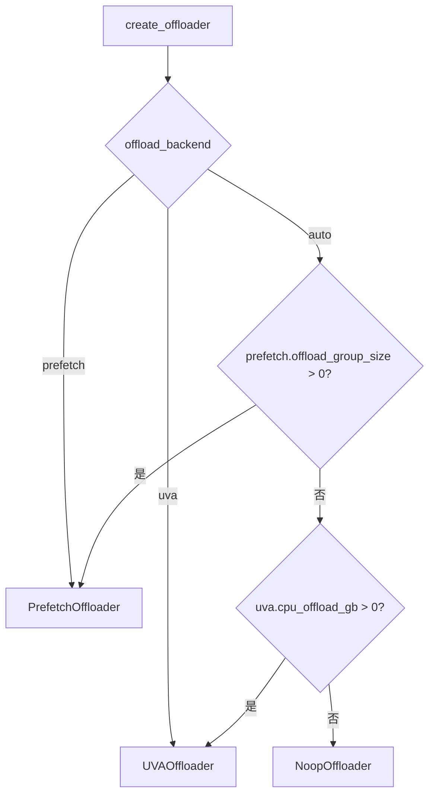
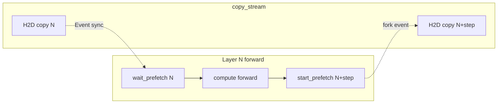
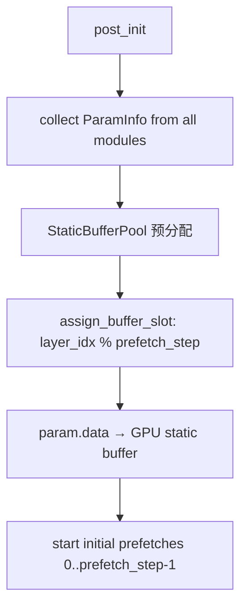

# PD-386.01 vLLM — BaseOffloader 双策略权重卸载与预取流水线

> 文档编号：PD-386.01
> 来源：vLLM `vllm/model_executor/offloader/`
> GitHub：https://github.com/vllm-project/vllm.git
> 问题域：PD-386 权重卸载与预取 Weight Offloading & Prefetch
> 状态：可复用方案

---

## 第 1 章 问题与动机

### 1.1 核心问题

大型语言模型的参数量远超单卡 GPU 显存容量。以 70B 参数的 BF16 模型为例，仅权重就需要 ~140 GB 显存，而单张 A100/H100 仅有 80 GB。在不使用张量并行（TP）的情况下，必须将部分权重卸载到 CPU 内存，在推理时按需加载到 GPU。

核心挑战在于：CPU→GPU 的 PCIe 传输带宽（~32 GB/s for PCIe 4.0 x16）远低于 GPU HBM 带宽（~2 TB/s for H100），如何在有限带宽下最小化传输延迟对推理吞吐的影响？

### 1.2 vLLM 的解法概述

vLLM 通过 `BaseOffloader` 抽象基类定义统一接口，实现两种互补的卸载策略：

1. **UVA 模式**（`UVAOffloader`）：利用 CUDA 统一虚拟寻址，将 pinned CPU 内存映射为 GPU 可直接访问的地址空间，零拷贝按需读取，实现简单但受 PCIe 带宽限制（`vllm/model_executor/offloader/uva.py:21`）
2. **Prefetch 模式**（`PrefetchOffloader`）：基于分组策略选择卸载层，使用独立 CUDA copy stream 异步预取下一层权重到 GPU 静态缓冲区，通过计算-传输流水线隐藏传输延迟（`vllm/model_executor/offloader/prefetch.py:127`）
3. **全局单例 + 工厂模式**：`create_offloader()` 根据配置自动选择策略，`get_offloader()/set_offloader()` 管理全局实例（`vllm/model_executor/offloader/base.py:109`）
4. **torch.compile + CUDA Graph 兼容**：通过自定义 op（`wait_prefetch`/`start_prefetch`）的 `mutates_args` 声明创建数据依赖，防止编译器重排序（`vllm/model_executor/offloader/prefetch_ops.py:72`）
5. **Pydantic 配置驱动**：`OffloadConfig` 用 Pydantic model_validator 校验参数合法性，支持 `auto/uva/prefetch` 三种后端选择（`vllm/config/offload.py:80`）

### 1.3 设计思想

| 设计原则 | 具体实现 | 理由 | 替代方案 |
|----------|----------|------|----------|
| 策略模式 | `BaseOffloader` ABC + `UVAOffloader`/`PrefetchOffloader` | 不同硬件拓扑适合不同策略，抽象接口允许运行时切换 | 单一策略硬编码 |
| 静态缓冲池 | `StaticBufferPool` 预分配 GPU buffer，循环复用 | 避免动态分配导致显存碎片和 CUDA Graph 不兼容 | 每次 malloc/free |
| 事件驱动同步 | `torch.cuda.Event` 实现 per-layer 精细同步 | 比 `wait_stream` 更精确，允许多层预取并发 | 全局 stream sync |
| 自定义 Op 编译兼容 | `direct_register_custom_op` + `mutates_args` | torch.compile 需要显式数据依赖防止重排序 | 手动 barrier |
| 分组卸载 | `group_size` + `num_in_group` 选择性卸载 | 不是所有层都需要卸载，保留热点层在 GPU 上 | 全部卸载或按大小排序 |

---

## 第 2 章 源码实现分析

### 2.1 架构概览

```
┌─────────────────────────────────────────────────────────────┐
│                    OffloadConfig (Pydantic)                  │
│  offload_backend: auto | uva | prefetch                     │
│  ├── UVAOffloadConfig (cpu_offload_gb, cpu_offload_params)  │
│  └── PrefetchOffloadConfig (group_size, num_in_group, ...)  │
└──────────────────────┬──────────────────────────────────────┘
                       │ create_offloader()
                       ▼
┌─────────────────────────────────────────────────────────────┐
│              BaseOffloader (ABC) — 全局单例                  │
│  wrap_modules() / post_init() / sync_prev_onload()          │
│  _wait_for_layer() / _start_prefetch()                      │
├──────────────────┬──────────────────────────────────────────┤
│  NoopOffloader   │  UVAOffloader    │  PrefetchOffloader    │
│  (透传)          │  (零拷贝 UVA)    │  (异步预取流水线)      │
│                  │  functional_call │  StaticBufferPool     │
│                  │  UVA view        │  _ModuleOffloader     │
│                  │                  │  _CpuParamOffloader   │
└──────────────────┴──────────────────┴───────────────────────┘
                                           │
                                           ▼
┌─────────────────────────────────────────────────────────────┐
│  prefetch_ops.py — torch.compile 兼容自定义 Op               │
│  wait_prefetch(input_tensor, layer_idx)                     │
│  start_prefetch(output_tensor, layer_idx)                   │
└─────────────────────────────────────────────────────────────┘
```

### 2.2 核心实现

#### 2.2.1 工厂方法与策略选择



对应源码 `vllm/model_executor/offloader/base.py:109-145`：

```python
def create_offloader(offload_config: "OffloadConfig") -> BaseOffloader:
    backend = offload_config.offload_backend
    uva = offload_config.uva
    prefetch = offload_config.prefetch

    if backend == "auto":
        if prefetch.offload_group_size > 0:
            backend = "prefetch"
        elif uva.cpu_offload_gb > 0:
            backend = "uva"
        else:
            return NoopOffloader()

    if backend == "prefetch":
        return PrefetchOffloader(
            group_size=prefetch.offload_group_size,
            num_in_group=prefetch.offload_num_in_group,
            prefetch_step=prefetch.offload_prefetch_step,
            offload_params=prefetch.offload_params,
            mode="cpu",
        )
    elif backend == "uva":
        return UVAOffloader(
            cpu_offload_max_bytes=int(uva.cpu_offload_gb * 1024**3),
            cpu_offload_params=uva.cpu_offload_params,
        )
    else:
        return NoopOffloader()
```

全局单例通过 `set_offloader()` 在 `GPUModelRunner.__init__()` 中初始化（`vllm/v1/worker/gpu_model_runner.py:754`），`post_init()` 在模型加载完成后调用（`gpu_model_runner.py:4349`）。

#### 2.2.2 Prefetch 模式：异步预取流水线



对应源码 `vllm/model_executor/offloader/prefetch.py:209-241`：

```python
def _hook_module_forward(self, index: int, module: nn.Module):
    original_forward = module.forward

    def forward(*args, **kwargs):
        module.forward = original_forward

        # Wait for this layer's prefetch to complete
        input_tensor = args[0] if args else kwargs.get("hidden_states")
        torch.ops.vllm.wait_prefetch(input_tensor, index)

        output = original_forward(*args, **kwargs)

        # Start prefetch for next layer (circular)
        next_index = (index + self.prefetch_step) % len(self.module_offloaders)
        if isinstance(output, tuple):
            torch.ops.vllm.start_prefetch(output[0], next_index)
        else:
            torch.ops.vllm.start_prefetch(output, next_index)

        module.forward = forward
        return output

    module.forward = forward
```

关键设计：forward hook 中先 `wait_prefetch` 等待当前层权重就绪，计算完成后 `start_prefetch` 触发下一层的异步 H2D 拷贝。`prefetch_step` 控制预取深度，形成计算-传输流水线。

#### 2.2.3 静态缓冲池与循环复用



对应源码 `vllm/model_executor/offloader/prefetch.py:60-124`：

```python
class StaticBufferPool:
    def __init__(self, param_infos, slot_capacity, device):
        self.slot_capacity = slot_capacity
        unique_params: dict[tuple, ParamInfo] = {}
        for info in param_infos:
            if info.key not in unique_params:
                unique_params[info.key] = info

        self._buffers: dict[tuple, list[torch.Tensor]] = {}
        for key, info in unique_params.items():
            slot_tensors = []
            for _ in range(slot_capacity):
                buf = torch.empty_strided(
                    size=info.shape, stride=info.stride,
                    dtype=info.dtype, device=device,
                )
                slot_tensors.append(buf)
            self._buffers[key] = slot_tensors

    def get_buffer(self, name, shape, stride, dtype, slot_idx):
        key = (name, shape, stride, dtype)
        return self._buffers[key][slot_idx % self.slot_capacity]
```

`slot_capacity = prefetch_step`，每个 unique (name, shape, stride, dtype) 分配 `prefetch_step` 个 slot。Layer N 使用 slot `N % prefetch_step`，实现循环复用。这意味着 GPU 上只需要 `prefetch_step` 份权重副本的显存，而非全部卸载层。


### 2.3 实现细节

#### UVA 零拷贝模式

UVA 模式的核心在 `vllm/model_executor/offloader/uva.py:67-140`。当 UVA 可用时，通过 `get_accelerator_view_from_cpu_tensor()` 将 pinned CPU tensor 映射为 GPU 可见的虚拟地址：

```python
# uva.py:100-108
cpu_data = p.data.to(device="cpu")
if self.pin_memory:
    cpu_data = cpu_data.pin_memory()

if not self.uva_offloading:
    p.data = cpu_data  # fallback: functional_call 按需搬运
else:
    p.data = get_accelerator_view_from_cpu_tensor(cpu_data)  # UVA 零拷贝
    p._vllm_is_uva_offloaded = True
```

当 UVA 不可用时，退化为 `functional_call` 模式（`uva.py:113-138`）：每次 forward 时将 `state_dict()` 中的 CPU 参数 `.to(device, non_blocking=True)` 搬到 GPU，通过 `torch.func.functional_call` 执行前向传播。这种模式性能较差但兼容性更好。

UVA 模式支持按字节预算卸载（`cpu_offload_max_bytes`），逐参数检查是否超出预算（`uva.py:84-87`），实现细粒度的显存-内存平衡。

#### Prefetch 事件同步与 CUDA Graph 兼容

`_wait_for_layer()` 的同步策略区分 CUDA Graph 捕获期和正常执行期（`prefetch.py:243-273`）：

```python
def _wait_for_layer(self, layer_idx: int):
    offloader = self.module_offloaders[layer_idx]
    if torch.cuda.is_current_stream_capturing():
        if not offloader._prefetch_in_capture:
            return  # pre-capture prefetch 已由 sync_before_graph_capture 保证
        torch.cuda.current_stream().wait_event(offloader._copy_done_event)
        offloader._prefetch_in_capture = False
    else:
        if offloader._event_valid_for_eager:
            torch.cuda.current_stream().wait_event(offloader._copy_done_event)
        else:
            torch.cuda.current_stream().wait_stream(self.copy_stream)
```

三个关键状态标志：
- `_prefetch_in_capture`：标记预取是否在 CUDA Graph 捕获期间发起
- `_event_valid_for_eager`：标记事件是否可用于 eager 模式的 `wait_event`（捕获期间录制的事件在捕获结束后失效）
- `_copy_done_event`：per-layer 的完成事件，比全局 `wait_stream` 更精确

#### 自定义 Op 防重排序

`prefetch_ops.py` 注册两个自定义 op，通过 `mutates_args` 声明创建假数据依赖（`prefetch_ops.py:78-90`）：

- `wait_prefetch` 声明 mutates `input_tensor` → 编译器不会将后续计算提前到 wait 之前
- `start_prefetch` 声明 mutates `output_tensor` → 编译器不会将 prefetch 提前到计算完成之前

这是 torch.compile 兼容的关键技巧：不改变实际数据，但通过声明副作用阻止编译器优化破坏同步语义。

#### 分组卸载策略

`wrap_modules()` 中的分组逻辑（`prefetch.py:180`）：

```python
if module_index % self.group_size >= self.group_size - self.num_in_group:
    # 卸载该层
```

例如 `group_size=8, num_in_group=2`：每 8 层中卸载最后 2 层（index 6,7,14,15,...）。这允许将计算密集的前几层保留在 GPU 上，只卸载相对不那么关键的层。

#### Pinned Memory 保证

`_CpuParamOffloader` 在 `_offload_to_cpu_internal()` 中使用 `pin_memory=True` 创建 CPU 存储（`prefetch.py:608-614`），并在 `_update_cpu_storage_from_param()` 中确保经过 `process_weights_after_loading` 后的权重仍然是 pinned 的（`prefetch.py:626-658`）。非 pinned 内存的 `non_blocking=True` H2D 拷贝会触发隐式流同步，破坏事件驱动的 fork 同步机制。

---

## 第 3 章 迁移指南

### 3.1 迁移清单

**阶段 1：基础抽象（1-2 天）**
- [ ] 定义 `BaseOffloader` ABC，包含 `wrap_modules()`、`post_init()`、`sync_prev_onload()` 接口
- [ ] 实现 `NoopOffloader` 作为默认透传
- [ ] 实现全局单例 `get_offloader()`/`set_offloader()`
- [ ] 实现 `create_offloader()` 工厂方法

**阶段 2：UVA 模式（1 天）**
- [ ] 实现 `UVAOffloader`，支持按字节预算逐参数卸载
- [ ] 集成 `get_accelerator_view_from_cpu_tensor()` UVA 映射
- [ ] 实现 `functional_call` 降级路径

**阶段 3：Prefetch 模式（2-3 天）**
- [ ] 实现 `StaticBufferPool` 静态缓冲池
- [ ] 实现 `_ModuleOffloader` + `_CpuParamOffloader` 层级
- [ ] 实现 forward hook 注入 wait/start prefetch
- [ ] 实现 CUDA Event 同步逻辑
- [ ] 注册 torch.compile 兼容的自定义 op

**阶段 4：配置与集成（1 天）**
- [ ] 定义 Pydantic 配置模型（`OffloadConfig`）
- [ ] 在模型加载流程中集成 offloader 初始化
- [ ] 在模型 forward 后调用 `post_init()`

### 3.2 适配代码模板

以下是一个可直接复用的最小化 Prefetch Offloader 实现：

```python
import torch
import torch.nn as nn
from abc import ABC, abstractmethod
from collections.abc import Generator
from dataclasses import dataclass


class BaseOffloader(ABC):
    """权重卸载抽象基类"""

    @abstractmethod
    def wrap_modules(
        self, modules: Generator[nn.Module, None, None]
    ) -> list[nn.Module]:
        pass

    def post_init(self):
        pass


class NoopOffloader(BaseOffloader):
    def wrap_modules(self, modules):
        return list(modules)


_instance: BaseOffloader = NoopOffloader()


def get_offloader() -> BaseOffloader:
    return _instance


def set_offloader(inst: BaseOffloader):
    global _instance
    _instance = inst


@dataclass
class ParamInfo:
    name: str
    shape: tuple
    stride: tuple
    dtype: torch.dtype

    @property
    def key(self):
        return (self.name, self.shape, self.stride, self.dtype)


class StaticBufferPool:
    """预分配 GPU 缓冲池，slot_capacity 个槽位循环复用"""

    def __init__(self, param_infos: list[ParamInfo],
                 slot_capacity: int, device: torch.device):
        self.slot_capacity = slot_capacity
        unique = {}
        for info in param_infos:
            if info.key not in unique:
                unique[info.key] = info

        self._buffers = {}
        for key, info in unique.items():
            self._buffers[key] = [
                torch.empty_strided(info.shape, info.stride,
                                    dtype=info.dtype, device=device)
                for _ in range(slot_capacity)
            ]

    def get(self, name, shape, stride, dtype, slot_idx):
        return self._buffers[(name, shape, stride, dtype)][
            slot_idx % self.slot_capacity
        ]


class PrefetchOffloader(BaseOffloader):
    """异步预取卸载器 — 最小化实现"""

    def __init__(self, group_size: int, num_in_group: int,
                 prefetch_step: int = 1):
        self.group_size = group_size
        self.num_in_group = num_in_group
        self.prefetch_step = prefetch_step
        self.copy_stream = torch.cuda.Stream()
        self._offloaders: list[dict] = []
        self.pool: StaticBufferPool | None = None

    def wrap_modules(self, modules):
        all_mods = []
        for idx, mod in enumerate(modules):
            all_mods.append(mod)
            if idx % self.group_size >= self.group_size - self.num_in_group:
                cpu_store = {}
                for name, p in mod.named_parameters():
                    cpu = torch.empty_strided(
                        p.data.size(), p.data.stride(),
                        dtype=p.dtype, device="cpu", pin_memory=True)
                    cpu.copy_(p.data)
                    cpu_store[name] = cpu
                self._offloaders.append({
                    "module": mod, "cpu": cpu_store,
                    "event": torch.cuda.Event(), "idx": len(self._offloaders)
                })
        return all_mods

    def post_init(self):
        # 收集 ParamInfo，分配缓冲池，挂载 hook
        # （完整实现参考 vLLM prefetch.py:310-365）
        pass
```

### 3.3 适用场景

| 场景 | 适用度 | 说明 |
|------|--------|------|
| 单卡运行超大模型 | ⭐⭐⭐ | 核心场景：70B+ 模型在单张 80GB GPU 上推理 |
| 高吞吐在线服务 | ⭐⭐ | Prefetch 模式可隐藏延迟，但仍有 PCIe 带宽瓶颈 |
| 离线批量推理 | ⭐⭐⭐ | 对延迟不敏感，UVA 模式简单有效 |
| 多卡张量并行 | ⭐ | 通常 TP 已解决显存问题，卸载意义不大 |
| 训练场景 | ⭐ | 本方案面向推理，训练需要 DeepSpeed ZeRO-Offload |
| 量化 + 卸载组合 | ⭐⭐⭐ | 量化降低传输量，与 Prefetch 协同效果好 |


---

## 第 4 章 测试用例

```python
import pytest
import torch
import torch.nn as nn
from unittest.mock import MagicMock, patch
from dataclasses import dataclass


# --- 测试 ParamInfo ---

class TestParamInfo:
    def test_key_uniqueness(self):
        """同名同形状参数 key 相同，不同名参数 key 不同"""
        info1 = ParamInfo(name="weight", shape=(768, 768),
                          stride=(768, 1), dtype=torch.bfloat16)
        info2 = ParamInfo(name="weight", shape=(768, 768),
                          stride=(768, 1), dtype=torch.bfloat16)
        info3 = ParamInfo(name="bias", shape=(768,),
                          stride=(1,), dtype=torch.bfloat16)
        assert info1.key == info2.key
        assert info1.key != info3.key

    def test_num_bytes(self):
        """BF16 768x768 = 768*768*2 bytes"""
        info = ParamInfo(name="w", shape=(768, 768),
                         stride=(768, 1), dtype=torch.bfloat16)
        assert info.num_bytes == 768 * 768 * 2


# --- 测试 StaticBufferPool ---

class TestStaticBufferPool:
    @pytest.fixture
    def pool(self):
        infos = [
            ParamInfo("weight", (64, 64), (64, 1), torch.float32),
            ParamInfo("bias", (64,), (1,), torch.float32),
        ]
        return StaticBufferPool(infos, slot_capacity=2,
                                device=torch.device("cuda:0"))

    def test_slot_circular_reuse(self, pool):
        """slot_idx=0 和 slot_idx=2 应返回同一 buffer"""
        buf0 = pool.get_buffer("weight", (64, 64), (64, 1),
                               torch.float32, slot_idx=0)
        buf2 = pool.get_buffer("weight", (64, 64), (64, 1),
                               torch.float32, slot_idx=2)
        assert buf0.data_ptr() == buf2.data_ptr()

    def test_different_slots_different_buffers(self, pool):
        """slot 0 和 slot 1 应是不同 buffer"""
        buf0 = pool.get_buffer("weight", (64, 64), (64, 1),
                               torch.float32, slot_idx=0)
        buf1 = pool.get_buffer("weight", (64, 64), (64, 1),
                               torch.float32, slot_idx=1)
        assert buf0.data_ptr() != buf1.data_ptr()


# --- 测试 create_offloader 工厂 ---

class TestCreateOffloader:
    def test_auto_noop(self):
        """默认配置应返回 NoopOffloader"""
        config = MagicMock()
        config.offload_backend = "auto"
        config.prefetch.offload_group_size = 0
        config.uva.cpu_offload_gb = 0
        offloader = create_offloader(config)
        assert isinstance(offloader, NoopOffloader)

    def test_auto_selects_prefetch(self):
        """group_size > 0 时 auto 应选择 PrefetchOffloader"""
        config = MagicMock()
        config.offload_backend = "auto"
        config.prefetch.offload_group_size = 8
        config.prefetch.offload_num_in_group = 2
        config.prefetch.offload_prefetch_step = 1
        config.prefetch.offload_params = set()
        config.uva.cpu_offload_gb = 0
        offloader = create_offloader(config)
        assert isinstance(offloader, PrefetchOffloader)

    def test_auto_selects_uva(self):
        """cpu_offload_gb > 0 且 group_size=0 时应选择 UVAOffloader"""
        config = MagicMock()
        config.offload_backend = "auto"
        config.prefetch.offload_group_size = 0
        config.uva.cpu_offload_gb = 10.0
        config.uva.cpu_offload_params = set()
        offloader = create_offloader(config)
        assert isinstance(offloader, UVAOffloader)


# --- 测试分组选择逻辑 ---

class TestGroupSelection:
    def test_group_pattern(self):
        """group_size=4, num_in_group=1 应卸载 index 3,7,11,..."""
        group_size, num_in_group = 4, 1
        offloaded = []
        for i in range(12):
            if i % group_size >= group_size - num_in_group:
                offloaded.append(i)
        assert offloaded == [3, 7, 11]

    def test_group_pattern_multi(self):
        """group_size=8, num_in_group=2 应卸载 index 6,7,14,15,..."""
        group_size, num_in_group = 8, 2
        offloaded = []
        for i in range(16):
            if i % group_size >= group_size - num_in_group:
                offloaded.append(i)
        assert offloaded == [6, 7, 14, 15]
```

---

## 第 5 章 跨域关联

| 关联域 | 关系类型 | 说明 |
|--------|----------|------|
| PD-377 模型量化 | 协同 | 量化降低参数精度（BF16→INT4），直接减少 H2D 传输量 4x，与 Prefetch 模式协同效果显著。vLLM 的 `process_weights_after_loading` 在量化后触发 `sync_cpu_storage()` 确保 CPU 存储与量化后权重一致 |
| PD-380 KV Cache 分页管理 | 协同 | 权重卸载释放的 GPU 显存可用于更大的 KV Cache 分页池，提升可服务的并发请求数。两者共同决定 GPU 显存分配策略 |
| PD-375 推测解码 | 互斥 | `gpu_model_runner.py:5717` 明确断言 UVA 卸载与推测解码不兼容，因为推测解码需要频繁访问所有层权重 |
| PD-383 CUDA Graph 编译 | 依赖 | Prefetch 模式通过自定义 Op + Event 同步实现 CUDA Graph 兼容。`prefetch_ops.py` 的 `mutates_args` 和 `_wait_for_layer` 的捕获期/非捕获期分支都是为此设计 |
| PD-382 硬件平台抽象 | 依赖 | UVA 可用性依赖 `is_uva_available()`，`get_accelerator_view_from_cpu_tensor()` 区分 CUDA/ROCm/XPU 平台实现 |
| PD-379 连续批处理调度 | 协同 | 卸载降低单请求显存占用，允许调度器容纳更多并发请求 |

---

## 第 6 章 来源文件索引

| 文件 | 行范围 | 关键实现 |
|------|--------|----------|
| `vllm/model_executor/offloader/base.py` | L33-L76 | `BaseOffloader` ABC 定义，5 个抽象/虚方法 |
| `vllm/model_executor/offloader/base.py` | L82-L91 | `NoopOffloader` 透传实现 |
| `vllm/model_executor/offloader/base.py` | L93-L145 | 全局单例 + `create_offloader()` 工厂 |
| `vllm/model_executor/offloader/uva.py` | L21-L141 | `UVAOffloader` 完整实现，UVA 映射 + functional_call 降级 |
| `vllm/model_executor/offloader/prefetch.py` | L29-L57 | `ParamInfo` 数据类，buffer pool 分组 key |
| `vllm/model_executor/offloader/prefetch.py` | L60-L124 | `StaticBufferPool` 预分配缓冲池 |
| `vllm/model_executor/offloader/prefetch.py` | L127-L366 | `PrefetchOffloader` 核心实现 |
| `vllm/model_executor/offloader/prefetch.py` | L368-L521 | `_ModuleOffloader` 单模块卸载管理 |
| `vllm/model_executor/offloader/prefetch.py` | L524-L705 | `_BaseParamOffloader` + `_CpuParamOffloader` 参数级卸载 |
| `vllm/model_executor/offloader/prefetch_ops.py` | L19-L94 | 自定义 Op 注册，torch.compile 兼容 |
| `vllm/config/offload.py` | L16-L154 | Pydantic 配置模型，三层嵌套 + 校验器 |
| `vllm/v1/worker/gpu_model_runner.py` | L754 | `set_offloader(create_offloader(...))` 初始化点 |
| `vllm/v1/worker/gpu_model_runner.py` | L4349 | `get_offloader().post_init()` 后初始化 |
| `vllm/utils/torch_utils.py` | L677-L692 | `get_accelerator_view_from_cpu_tensor()` UVA 平台适配 |
| `vllm/utils/platform_utils.py` | L50-L54 | `is_uva_available()` 可用性检测 |

---

## 第 7 章 横向对比维度

```json comparison_data
{
  "project": "vLLM",
  "dimensions": {
    "卸载策略": "双策略：UVA 零拷贝 + Prefetch 异步预取，工厂方法自动选择",
    "缓冲管理": "StaticBufferPool 预分配 + slot 循环复用，避免动态分配",
    "同步机制": "per-layer CUDA Event + 捕获期/非捕获期双路径同步",
    "编译兼容": "自定义 Op mutates_args 声明假数据依赖，兼容 torch.compile + CUDA Graph",
    "粒度控制": "group_size/num_in_group 分组选择 + offload_params 参数级白名单",
    "平台适配": "CUDA/ROCm/XPU 三平台 UVA 实现，环境变量控制降级"
  }
}
```

### 域元数据补充

```json domain_metadata
{
  "solution_summary": "vLLM 通过 BaseOffloader ABC 实现 UVA 零拷贝与 Prefetch 异步预取双策略，StaticBufferPool 循环复用 GPU 缓冲，自定义 Op 保证 torch.compile/CUDA Graph 兼容",
  "description": "推理引擎中权重卸载需兼顾编译器优化与 CUDA Graph 捕获的同步正确性",
  "sub_problems": [
    "torch.compile 重排序导致同步语义破坏",
    "CUDA Graph 捕获期与非捕获期的事件有效性差异",
    "process_weights_after_loading 后 CPU 存储与量化权重的一致性"
  ],
  "best_practices": [
    "用 mutates_args 自定义 Op 创建假数据依赖防止编译器重排序",
    "pinned memory 必须全程保证，否则 non_blocking H2D 会触发隐式流同步",
    "静态缓冲池 slot 数等于 prefetch_step，循环复用避免显存碎片"
  ]
}
```
