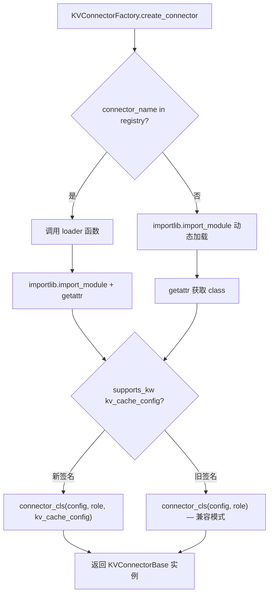
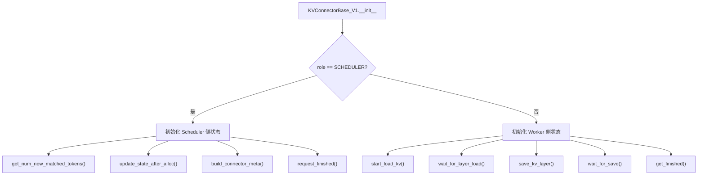
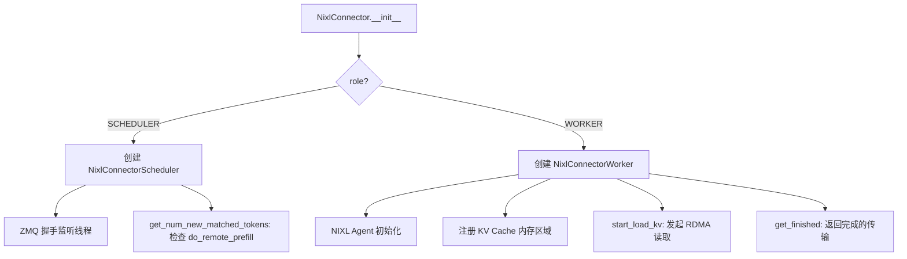
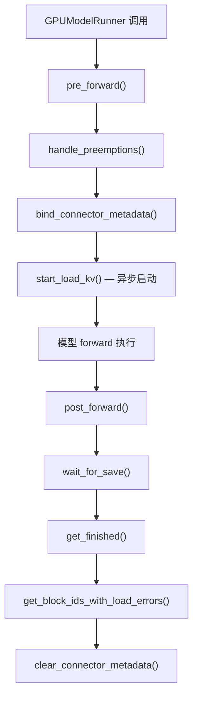

# PD-387.01 vLLM — KV Connector 分层抽象与 Disaggregated Prefill-Decode 分离推理

> 文档编号：PD-387.01
> 来源：vLLM `vllm/distributed/kv_transfer/`
> GitHub：https://github.com/vllm-project/vllm.git
> 问题域：PD-387 Disaggregated 推理 Disaggregated Serving
> 状态：可复用方案

---

## 第 1 章 问题与动机

### 1.1 核心问题

大模型推理分为两个计算特征截然不同的阶段：

- **Prefill 阶段**：计算密集型，对所有 prompt token 并行计算 KV Cache，GPU 利用率高
- **Decode 阶段**：内存带宽密集型，逐 token 自回归生成，GPU 利用率低

在传统单实例部署中，两个阶段共享同一组 GPU，导致：
1. Prefill 的长计算阻塞 Decode 的低延迟需求（Head-of-Line blocking）
2. Decode 阶段 GPU 算力大量闲置，资源利用率低
3. 无法针对两个阶段分别优化硬件配置（如 Prefill 用高算力 GPU，Decode 用高带宽 GPU）

Disaggregated Serving 将 Prefill 和 Decode 部署到不同的 vLLM 实例上，核心挑战在于：**如何高效地将 Prefill 节点计算好的 KV Cache 传输到 Decode 节点**。

### 1.2 vLLM 的解法概述

vLLM 通过三层抽象架构实现 disaggregated serving：

1. **KVConnectorBase_V1 抽象基类**（`vllm/distributed/kv_transfer/kv_connector/v1/base.py:147`）：定义 Scheduler 侧和 Worker 侧的标准接口，所有 connector 实现此基类
2. **KVConnectorFactory 工厂注册表**（`vllm/distributed/kv_transfer/kv_connector/factory.py:27`）：懒加载注册 + 动态模块导入，支持 10+ 种 connector 实现
3. **Scheduler/Worker 角色分离**（`vllm/distributed/kv_transfer/kv_connector/v1/base.py:121-127`）：同一 connector 类根据 `KVConnectorRole` 枚举分裂为调度侧和执行侧两个独立实例
4. **KVTransferConfig 配置驱动**（`vllm/config/kv_transfer.py:17`）：通过 `kv_role`（producer/consumer/both）、`kv_connector`、`kv_buffer_device` 等参数声明式配置
5. **Tokens-only API**（`vllm/entrypoints/serve/disagg/serving.py:41`）：`ServingTokens` 类提供 token-in/token-out 的 disagg 专用 HTTP 端点

### 1.3 设计思想

| 设计原则 | 具体实现 | 理由 | 替代方案 |
|----------|----------|------|----------|
| 接口与实现分离 | KVConnectorBase_V1 定义 15+ 抽象/虚方法，具体传输由 NIXL/P2P-NCCL/LMCache 等实现 | 传输协议差异巨大（RDMA vs NCCL vs 共享存储），统一接口屏蔽差异 | 硬编码传输方式 |
| Scheduler/Worker 角色分裂 | 同一 connector 类通过 KVConnectorRole 枚举在构造时分裂为两个独立实例 | Scheduler 进程不应持有 GPU 资源，Worker 进程不应做调度决策 | 单一实例同时承担两个角色 |
| 懒加载注册 | KVConnectorFactory 用 `importlib.import_module` 延迟加载 connector 模块 | 避免加载不需要的 NIXL/NCCL 等重量级依赖 | 启动时全量导入 |
| 异步传输流水线 | `start_load_kv()` 在 forward 前启动异步加载，`wait_for_layer_load()` 在 attention 层内等待 | KV 传输与模型计算重叠，隐藏传输延迟 | 同步阻塞传输 |
| 配置声明式角色 | `kv_role: kv_producer / kv_consumer / kv_both` 三种角色 | 同一代码库支持 P、D、P+D 三种部署模式 | 不同代码分支 |

---

## 第 2 章 源码实现分析

### 2.1 架构概览

vLLM 的 disaggregated serving 架构分为三层：

```
┌─────────────────────────────────────────────────────────────────┐
│                    API Layer (Disagg Endpoints)                  │
│  ServingTokens ← GenerateRequest(token_ids, kv_transfer_params) │
│  POST /inference/v1/generate                                    │
└──────────────────────────┬──────────────────────────────────────┘
                           │
┌──────────────────────────▼──────────────────────────────────────┐
│                  Scheduler Side (KVConnector)                    │
│  get_num_new_matched_tokens() → 判断远程 KV 可用量              │
│  update_state_after_alloc()   → 分配 block 后更新状态           │
│  build_connector_meta()       → 构建传输元数据                  │
│  request_finished()           → 请求完成后异步发送 KV           │
└──────────────────────────┬──────────────────────────────────────┘
                           │ KVConnectorMetadata
┌──────────────────────────▼──────────────────────────────────────┐
│                   Worker Side (KVConnector)                      │
│  start_load_kv()      → 异步启动 KV 加载                       │
│  wait_for_layer_load() → 逐层等待加载完成                       │
│  save_kv_layer()       → 逐层保存 KV                           │
│  wait_for_save()       → 等待所有保存完成                       │
│  get_finished()        → 返回已完成传输的请求 ID                │
└──────────────────────────┬──────────────────────────────────────┘
                           │
┌──────────────────────────▼──────────────────────────────────────┐
│              Transport Backends (Pluggable)                      │
│  NixlConnector (RDMA/UCX) │ P2pNcclConnector │ LMCacheConnector │
│  MooncakeConnector │ OffloadingConnector │ MultiConnector        │
└─────────────────────────────────────────────────────────────────┘
```

### 2.2 核心实现

#### 2.2.1 KVConnectorFactory — 懒加载工厂注册



对应源码 `vllm/distributed/kv_transfer/kv_connector/factory.py:27-131`：

```python
class KVConnectorFactory:
    _registry: dict[str, Callable[[], type[KVConnectorBase]]] = {}

    @classmethod
    def register_connector(cls, name: str, module_path: str,
                           class_name: str) -> None:
        if name in cls._registry:
            raise ValueError(f"Connector '{name}' is already registered.")
        def loader() -> type[KVConnectorBase]:
            module = importlib.import_module(module_path)
            return getattr(module, class_name)
        cls._registry[name] = loader

    @classmethod
    def create_connector(cls, config: "VllmConfig",
                         role: KVConnectorRole,
                         kv_cache_config=None) -> KVConnectorBase:
        connector_cls, compat_sig = cls._get_connector_class_with_compat(
            config.kv_transfer_config)
        # 兼容旧签名（2参数）和新签名（3参数）
        if compat_sig:
            return connector_cls(config, role)
        else:
            return connector_cls(config, role, kv_cache_config)
```

工厂在模块底部注册了 10 种 connector（`factory.py:146-203`），包括 NixlConnector、P2pNcclConnector、LMCacheConnectorV1、MooncakeConnector、OffloadingConnector 等。

#### 2.2.2 KVConnectorBase_V1 — Scheduler/Worker 双角色基类



对应源码 `vllm/distributed/kv_transfer/kv_connector/v1/base.py:121-127, 147-184`：

```python
class KVConnectorRole(enum.Enum):
    SCHEDULER = 0  # 调度进程中运行
    WORKER = 1     # Worker 进程中运行

class KVConnectorBase_V1(ABC):
    def __init__(self, vllm_config: "VllmConfig",
                 role: KVConnectorRole,
                 kv_cache_config: "KVCacheConfig | None" = None):
        self._connector_metadata: KVConnectorMetadata | None = None
        self._vllm_config = vllm_config
        self._kv_transfer_config = vllm_config.kv_transfer_config
        self._kv_cache_config = kv_cache_config
        self._role = role

    # Worker 侧：异步加载 KV
    @abstractmethod
    def start_load_kv(self, forward_context, **kwargs) -> None: ...
    @abstractmethod
    def wait_for_layer_load(self, layer_name: str) -> None: ...
    @abstractmethod
    def save_kv_layer(self, layer_name, kv_layer, attn_metadata, **kwargs): ...
    @abstractmethod
    def wait_for_save(self): ...

    # Scheduler 侧：调度决策
    @abstractmethod
    def get_num_new_matched_tokens(self, request, num_computed_tokens): ...
    @abstractmethod
    def update_state_after_alloc(self, request, blocks, num_external_tokens): ...
    @abstractmethod
    def build_connector_meta(self, scheduler_output): ...
```

#### 2.2.3 NixlConnector — RDMA 零拷贝传输实现

NixlConnector 是生产级 disagg connector，使用 NIXL 库（基于 UCX/RDMA）实现跨节点零拷贝 KV 传输。



对应源码 `vllm/distributed/kv_transfer/kv_connector/v1/nixl_connector.py:301-341`：

```python
class NixlConnector(KVConnectorBase_V1):
    def __init__(self, vllm_config, role, kv_cache_config=None):
        super().__init__(vllm_config, role, kv_cache_config)
        self.engine_id = vllm_config.kv_transfer_config.engine_id
        if role == KVConnectorRole.SCHEDULER:
            self.connector_scheduler = NixlConnectorScheduler(
                vllm_config, self.engine_id)
            self.connector_worker = None
        elif role == KVConnectorRole.WORKER:
            self.connector_scheduler = None
            self.connector_worker = NixlConnectorWorker(
                vllm_config, self.engine_id)
```

NixlConnector 的兼容性校验机制（`nixl_connector.py:175-233`）通过 `compute_nixl_compatibility_hash()` 对 vLLM 版本、模型架构、KV Cache dtype、attention backend 等因素计算 SHA-256 哈希，确保 P/D 节点间的二进制兼容性。

#### 2.2.4 ActiveKVConnector — Worker 侧生命周期管理



对应源码 `vllm/v1/worker/gpu/kv_connector.py:48-122`：

```python
class ActiveKVConnector(KVConnector):
    def __init__(self, vllm_config, kv_caches_dict):
        self.kv_connector = get_kv_transfer_group()
        self.kv_connector.register_kv_caches(kv_caches_dict)
        self.kv_connector.set_host_xfer_buffer_ops(copy_kv_blocks)

    def pre_forward(self, scheduler_output):
        if scheduler_output.preempted_req_ids:
            self.kv_connector.handle_preemptions(
                scheduler_output.preempted_req_ids)
        self.kv_connector.bind_connector_metadata(
            scheduler_output.kv_connector_metadata)
        self.kv_connector.start_load_kv(get_forward_context())

    def post_forward(self, scheduler_output, wait_for_save=True):
        output = KVConnectorOutput()
        if wait_for_save:
            self.kv_connector.wait_for_save()
        output.finished_sending, output.finished_recving = \
            self.kv_connector.get_finished(scheduler_output.finished_req_ids)
        output.invalid_block_ids = \
            self.kv_connector.get_block_ids_with_load_errors()
        self.kv_connector.clear_connector_metadata()
        return output
```

### 2.3 实现细节

**KV Cache 内存布局优化**：NixlConnector 强制使用 HND（Head-Num-Dim）布局而非默认的 NHD，因为 HND 布局下同一 head 的数据在内存中连续，RDMA 传输效率更高（`nixl_connector.py:347-363`）。

**兼容性哈希**：P/D 节点握手时通过 `NixlHandshakePayload.compatibility_hash` 进行两阶段解码——先校验哈希，再解码元数据，避免 schema 不兼容时的解码错误（`nixl_connector.py:157-173`）。

**KV 加载失败策略**：`KVTransferConfig.kv_load_failure_policy` 支持 `recompute`（重新调度请求重算失败的 block）和 `fail`（直接失败）两种策略（`kv_transfer.py:64-67`）。

**MultiConnector 组合模式**：`MultiConnector` 允许同时使用多个 connector（如 NIXL + Offloading），通过 `MultiKVConnectorMetadata` 聚合多个 connector 的元数据（`multi_connector.py:43-45`）。

---

## 第 3 章 迁移指南

### 3.1 迁移清单

**阶段 1：定义 Connector 接口**

- [ ] 定义 `KVConnectorRole` 枚举（SCHEDULER / WORKER）
- [ ] 实现 `KVConnectorBase` 抽象基类，包含 Scheduler 侧方法（`get_num_new_matched_tokens`、`update_state_after_alloc`、`build_connector_meta`）和 Worker 侧方法（`start_load_kv`、`wait_for_layer_load`、`save_kv_layer`、`wait_for_save`）
- [ ] 定义 `KVConnectorMetadata` 基类用于 Scheduler→Worker 元数据传递

**阶段 2：实现工厂注册**

- [ ] 实现 `KVConnectorFactory`，支持 `register_connector(name, module_path, class_name)` 懒加载注册
- [ ] 实现 `create_connector(config, role)` 工厂方法
- [ ] 支持通过 `kv_connector_module_path` 动态加载外部 connector

**阶段 3：实现具体 Connector**

- [ ] 实现至少一种传输后端（如基于共享存储的 ExampleConnector）
- [ ] 实现 Scheduler 侧逻辑：判断远程 KV 可用性、构建传输元数据
- [ ] 实现 Worker 侧逻辑：异步加载/保存 KV Cache

**阶段 4：集成到推理引擎**

- [ ] 在 ModelRunner 中集成 `ActiveKVConnector`，在 `pre_forward` / `post_forward` 中调用
- [ ] 实现 `KVOutputAggregator` 聚合多 Worker 的传输完成状态
- [ ] 添加 disagg 专用 API 端点（token-in/token-out）

### 3.2 适配代码模板

以下是一个最小化的 KV Connector 实现模板：

```python
import enum
from abc import ABC, abstractmethod
from dataclasses import dataclass
from typing import Any

import torch


class ConnectorRole(enum.Enum):
    SCHEDULER = 0
    WORKER = 1


@dataclass
class ConnectorMetadata:
    """Scheduler → Worker 传递的元数据"""
    reqs_to_load: dict[str, list[int]]  # req_id → block_ids
    reqs_to_save: dict[str, list[int]]


class KVConnectorBase(ABC):
    def __init__(self, config: Any, role: ConnectorRole):
        self._role = role
        self._metadata: ConnectorMetadata | None = None

    # ---- Scheduler 侧 ----
    @abstractmethod
    def get_num_matched_tokens(
        self, request_id: str, num_computed: int
    ) -> tuple[int, bool]:
        """返回 (可从远程加载的 token 数, 是否异步加载)"""
        ...

    @abstractmethod
    def build_metadata(self, scheduled_reqs: list) -> ConnectorMetadata:
        """构建本轮调度的传输元数据"""
        ...

    # ---- Worker 侧 ----
    @abstractmethod
    def start_load(self, kv_caches: dict[str, torch.Tensor]) -> None:
        """异步启动 KV 加载（在 forward 前调用）"""
        ...

    @abstractmethod
    def wait_for_load(self, layer_name: str) -> None:
        """等待指定层的 KV 加载完成（在 attention 层内调用）"""
        ...

    @abstractmethod
    def save_layer(self, layer_name: str, kv: torch.Tensor) -> None:
        """保存指定层的 KV（在 attention 层内调用）"""
        ...

    @abstractmethod
    def wait_for_save(self) -> None:
        """等待所有保存完成（在 forward 后调用）"""
        ...

    def get_finished(self) -> tuple[set[str], set[str]]:
        """返回 (已完成发送的 req_ids, 已完成接收的 req_ids)"""
        return set(), set()


class ConnectorFactory:
    """懒加载工厂"""
    _registry: dict[str, tuple[str, str]] = {}

    @classmethod
    def register(cls, name: str, module_path: str, class_name: str):
        cls._registry[name] = (module_path, class_name)

    @classmethod
    def create(cls, name: str, config: Any,
               role: ConnectorRole) -> KVConnectorBase:
        import importlib
        module_path, class_name = cls._registry[name]
        module = importlib.import_module(module_path)
        connector_cls = getattr(module, class_name)
        return connector_cls(config, role)
```

### 3.3 适用场景

| 场景 | 适用度 | 说明 |
|------|--------|------|
| 高 QPS 在线推理服务 | ⭐⭐⭐ | Prefill/Decode 分离可独立扩缩容，消除 HoL blocking |
| 长 prompt + 短输出 | ⭐⭐⭐ | Prefill 计算量大，分离后 Decode 不被阻塞 |
| 异构 GPU 集群 | ⭐⭐⭐ | Prefill 用高算力 GPU（A100），Decode 用高带宽 GPU（H100） |
| 低 QPS / 单用户场景 | ⭐ | 传输开销大于收益，单实例更简单 |
| 无高速互联的集群 | ⭐ | KV 传输带宽受限，disagg 收益有限 |

---

## 第 4 章 测试用例

```python
import enum
import pytest
from dataclasses import dataclass
from typing import Any
from unittest.mock import MagicMock, patch


class ConnectorRole(enum.Enum):
    SCHEDULER = 0
    WORKER = 1


class TestKVConnectorFactory:
    """测试工厂注册与创建"""

    def test_register_and_create(self):
        """正常注册和创建 connector"""
        factory_registry = {}

        def register(name, module_path, class_name):
            factory_registry[name] = (module_path, class_name)

        register("TestConnector", "test.module", "TestConnector")
        assert "TestConnector" in factory_registry
        assert factory_registry["TestConnector"] == (
            "test.module", "TestConnector")

    def test_duplicate_registration_raises(self):
        """重复注册应抛出异常"""
        registry = {}
        registry["Dup"] = ("m", "c")
        with pytest.raises(KeyError):
            if "Dup" in registry:
                raise KeyError("Connector 'Dup' is already registered.")

    def test_unknown_connector_raises(self):
        """未注册的 connector 应抛出异常"""
        registry = {}
        with pytest.raises(KeyError):
            _ = registry["NonExistent"]


class TestKVConnectorRole:
    """测试角色分离"""

    def test_scheduler_role(self):
        role = ConnectorRole.SCHEDULER
        assert role.value == 0
        assert role != ConnectorRole.WORKER

    def test_worker_role(self):
        role = ConnectorRole.WORKER
        assert role.value == 1


class TestKVTransferConfig:
    """测试配置验证"""

    def test_kv_role_validation(self):
        """无效的 kv_role 应被拒绝"""
        valid_roles = {"kv_producer", "kv_consumer", "kv_both"}
        assert "kv_producer" in valid_roles
        assert "invalid_role" not in valid_roles

    def test_connector_without_role_raises(self):
        """设置 kv_connector 但不设置 kv_role 应报错"""
        config = {"kv_connector": "NixlConnector", "kv_role": None}
        if config["kv_connector"] is not None and config["kv_role"] is None:
            with pytest.raises(ValueError):
                raise ValueError(
                    "Please specify kv_role when kv_connector is set")

    def test_load_failure_policy(self):
        """加载失败策略应为 recompute 或 fail"""
        valid_policies = {"recompute", "fail"}
        assert "recompute" in valid_policies
        assert "fail" in valid_policies
        assert "retry" not in valid_policies


class TestConnectorMetadata:
    """测试元数据传递"""

    def test_metadata_bind_and_clear(self):
        """元数据绑定和清除"""
        metadata_holder = {"metadata": None}

        @dataclass
        class FakeMetadata:
            reqs: dict

        meta = FakeMetadata(reqs={"req1": [0, 1, 2]})
        metadata_holder["metadata"] = meta
        assert metadata_holder["metadata"] is not None
        assert metadata_holder["metadata"].reqs["req1"] == [0, 1, 2]

        metadata_holder["metadata"] = None
        assert metadata_holder["metadata"] is None


class TestCompatibilityHash:
    """测试兼容性哈希"""

    def test_same_config_same_hash(self):
        """相同配置应产生相同哈希"""
        import hashlib
        factors = "model=llama,dtype=fp16,heads=32"
        h1 = hashlib.sha256(factors.encode()).hexdigest()
        h2 = hashlib.sha256(factors.encode()).hexdigest()
        assert h1 == h2

    def test_different_config_different_hash(self):
        """不同配置应产生不同哈希"""
        import hashlib
        h1 = hashlib.sha256(b"model=llama,dtype=fp16").hexdigest()
        h2 = hashlib.sha256(b"model=llama,dtype=bf16").hexdigest()
        assert h1 != h2
```

---

## 第 5 章 跨域关联

| 关联域 | 关系类型 | 说明 |
|--------|----------|------|
| PD-01 上下文管理 | 协同 | Disagg 传输的 KV Cache 本质是上下文的物理载体，KV 传输量直接受上下文窗口大小影响 |
| PD-02 多 Agent 编排 | 协同 | Prefill/Decode 节点可视为两个协作 Agent，需要编排层（如 proxy/router）协调请求分发 |
| PD-03 容错与重试 | 依赖 | `kv_load_failure_policy` 的 recompute 策略依赖容错机制；NIXL 兼容性哈希校验是防御性设计 |
| PD-04 工具系统 | 协同 | KVConnectorFactory 的懒加载注册模式与工具注册表设计理念一致 |
| PD-11 可观测性 | 协同 | `KVConnectorStats`、`KVConnectorPromMetrics` 提供传输吞吐量、延迟等 Prometheus 指标 |

---

## 第 6 章 来源文件索引

| 文件 | 行范围 | 关键实现 |
|------|--------|----------|
| `vllm/distributed/kv_transfer/kv_connector/v1/base.py` | L121-L608 | KVConnectorRole 枚举、KVConnectorBase_V1 抽象基类（15+ 方法） |
| `vllm/distributed/kv_transfer/kv_connector/factory.py` | L27-L203 | KVConnectorFactory 懒加载工厂 + 10 种 connector 注册 |
| `vllm/distributed/kv_transfer/kv_connector/v1/nixl_connector.py` | L84-L539 | NixlConnector RDMA 传输实现、兼容性哈希、Scheduler/Worker 分裂 |
| `vllm/config/kv_transfer.py` | L17-L117 | KVTransferConfig 配置类（kv_role/kv_connector/kv_buffer_device） |
| `vllm/v1/worker/gpu/kv_connector.py` | L30-L135 | ActiveKVConnector Worker 侧生命周期管理（pre_forward/post_forward） |
| `vllm/entrypoints/serve/disagg/serving.py` | L41-L287 | ServingTokens token-in/token-out API 实现 |
| `vllm/entrypoints/serve/disagg/protocol.py` | L19-L99 | GenerateRequest/GenerateResponse 协议定义（含 kv_transfer_params） |
| `vllm/entrypoints/serve/disagg/api_router.py` | L46-L110 | FastAPI 路由 /inference/v1/generate + /abort_requests |
| `vllm/distributed/kv_transfer/kv_connector/v1/example_connector.py` | L84-L443 | ExampleConnector 基于 safetensors 的调试实现 |
| `vllm/distributed/kv_transfer/kv_connector/v1/p2p/p2p_nccl_connector.py` | L74-L106 | P2pNcclConnector NCCL 点对点传输 |
| `vllm/distributed/kv_transfer/kv_connector/v1/multi_connector.py` | L43-L100 | MultiConnector 多 connector 组合模式 |
| `vllm/distributed/kv_transfer/kv_connector/v1/offloading_connector.py` | L1-L100 | OffloadingConnector KV 卸载到 CPU/SSD |
| `vllm/distributed/kv_transfer/kv_connector/utils.py` | L26-L80 | KVOutputAggregator 多 Worker 输出聚合 |
| `vllm/distributed/kv_transfer/kv_transfer_state.py` | L16-L79 | 全局 KV Connector 单例管理（初始化/获取/关闭） |

---

## 第 7 章 横向对比维度

```json comparison_data
{
  "project": "vLLM",
  "dimensions": {
    "传输协议": "NIXL(RDMA/UCX) + P2P-NCCL + LMCache + Mooncake 等 10 种可插拔后端",
    "角色分离": "Scheduler/Worker 双角色枚举，同一 connector 类构造时分裂为两个独立实例",
    "异步流水线": "start_load_kv 在 forward 前异步启动，wait_for_layer_load 逐层等待，传输与计算重叠",
    "兼容性校验": "SHA-256 兼容性哈希（模型架构+dtype+backend），两阶段握手解码防 schema 不兼容",
    "失败策略": "kv_load_failure_policy 支持 recompute（重算失败 block）和 fail（直接失败）",
    "内存布局优化": "NixlConnector 强制 HND 布局提升 RDMA 传输效率，MLA 模型自动回退",
    "组合模式": "MultiConnector 支持同时使用多个 connector（如 NIXL + Offloading）"
  }
}
```

### 域元数据补充

```json domain_metadata
{
  "solution_summary": "vLLM 通过 KVConnectorBase_V1 抽象基类 + KVConnectorFactory 懒加载工厂实现 10 种可插拔传输后端（NIXL/NCCL/LMCache/Mooncake），Scheduler/Worker 双角色分裂 + 异步流水线隐藏传输延迟",
  "description": "推理引擎级别的 prefill-decode 分离架构，含传输协议抽象、角色分裂、兼容性校验",
  "sub_problems": [
    "P/D 节点间 schema 兼容性校验与版本协商",
    "KV 加载失败后的 recompute 降级策略",
    "多 connector 组合使用时的元数据聚合与统计合并",
    "异构 TP 并行度下的 KV block 映射与重排"
  ],
  "best_practices": [
    "用 SHA-256 兼容性哈希做两阶段握手，避免 schema 不兼容时的解码崩溃",
    "Scheduler/Worker 角色在构造时分裂为独立实例，强制隔离调度逻辑与 GPU 操作",
    "KV 传输与模型 forward 异步流水线化，start_load 在 forward 前启动，逐层 wait 隐藏延迟"
  ]
}
```
