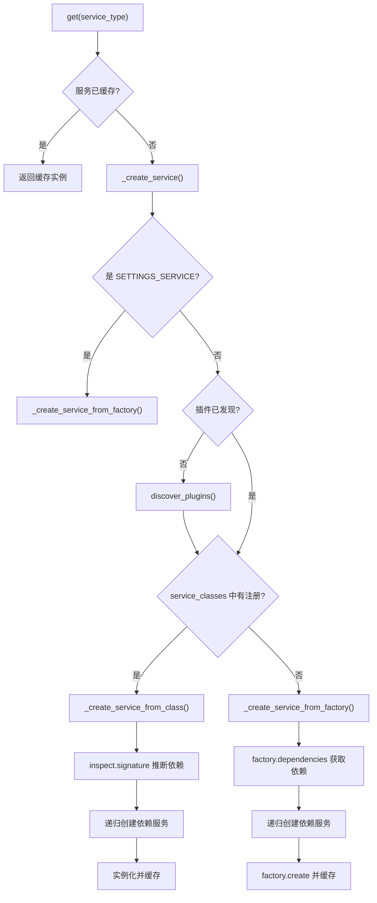
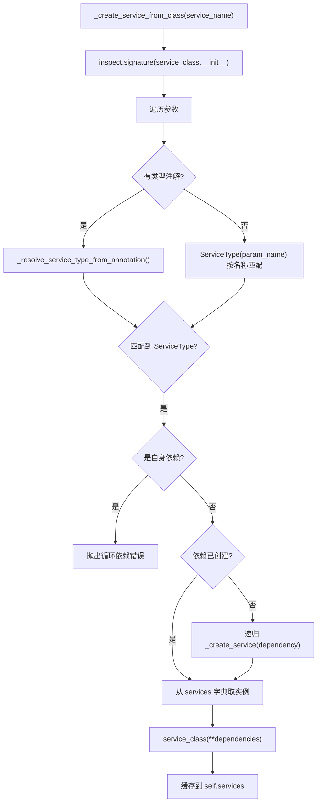

# PD-388.01 Langflow — ServiceManager 双轨 IoC 容器与三源服务发现

> 文档编号：PD-388.01
> 来源：Langflow `src/lfx/src/lfx/services/manager.py`, `src/backend/base/langflow/services/factory.py`
> GitHub：https://github.com/langflow-ai/langflow.git
> 问题域：PD-388 服务注册与依赖注入 Service Registry & Dependency Injection
> 状态：可复用方案

---

## 第 1 章 问题与动机

### 1.1 核心问题

大型 Agent 平台（如 Langflow 的 17 种服务：Auth、Database、Cache、Storage、Tracing 等）面临三个工程挑战：

1. **服务间依赖复杂** — DatabaseService 依赖 SettingsService，AuthService 依赖 DatabaseService + SettingsService，手动管理初始化顺序极易出错
2. **可插拔性需求** — 核心框架（lfx）需要提供默认实现（如 no-op AuthService），但宿主应用（Langflow）需要用完整实现（JWT AuthService）覆盖默认
3. **多种集成场景** — 内部开发用装饰器注册、外部插件用 Entry Points、运维配置用 TOML 文件，三种注册方式需要统一管理

### 1.2 Langflow 的解法概述

Langflow 实现了一个**双轨 IoC 容器**（ServiceManager），同时支持 Factory 模式（旧系统）和直接类注册（新插件系统），并通过三种服务发现机制实现可插拔：

1. **ServiceManager 单例** — 线程安全的双重检查锁懒初始化，`KeyedMemoryLockManager` 保证每个服务类型的创建互斥（`manager.py:469-483`）
2. **双轨创建路径** — 新系统通过 `service_classes` 字典 + `inspect.signature` 自动推断依赖；旧系统通过 `ServiceFactory.dependencies` 显式声明依赖（`manager.py:121-148`）
3. **三源服务发现** — Entry Points → Config File（lfx.toml / pyproject.toml）→ Decorator，按优先级覆盖（`manager.py:323-360`）
4. **Protocol 接口契约** — 8 个 `runtime_checkable` Protocol 定义服务边界，消费者只依赖接口不依赖实现（`interfaces.py:1-207`）
5. **Settings 服务保护** — SettingsService 不可被插件覆盖，始终使用内置 Factory 创建，防止配置被篡改（`manager.py:90-94`）

### 1.3 设计思想

| 设计原则 | 具体实现 | 理由 | 替代方案 |
|----------|----------|------|----------|
| 依赖反转 | Protocol 接口 + ServiceManager 中介 | 消费者不直接 import 实现类，可替换 | 直接 import（耦合） |
| 懒初始化 | `get()` 时才创建服务，递归解析依赖 | 避免启动时加载全部 17 个服务 | 启动时全量初始化 |
| 双轨兼容 | Factory 旧路径 + Class 新路径并存 | 渐进式迁移，不破坏已有代码 | 一次性重写 |
| 防御性设计 | SettingsService 不可被插件覆盖 | 配置是信任根，被篡改会导致全局故障 | 无保护（危险） |
| 约定优于配置 | 类名 → ServiceType 自动映射 | 减少样板代码，`AuthService` 自动映射到 `auth_service` | 手动声明映射 |

---

## 第 2 章 源码实现分析

### 2.1 架构概览

Langflow 的服务架构分为两层：`lfx`（核心框架）和 `langflow`（宿主应用），通过 ServiceManager 统一管理。

```
┌─────────────────────────────────────────────────────────────────┐
│                     Consumer Layer (FastAPI)                     │
│  get_db_service() → get_service(DATABASE_SERVICE) → Manager.get │
├─────────────────────────────────────────────────────────────────┤
│                      deps.py (Service Locator)                  │
│  get_service() → ServiceManager.get() → 懒创建 + 缓存           │
├─────────────────────────────────────────────────────────────────┤
│                    ServiceManager (IoC Container)                │
│  ┌──────────────┐  ┌───────────────┐  ┌──────────────────────┐ │
│  │ services{}   │  │ factories{}   │  │ service_classes{}    │ │
│  │ (实例缓存)    │  │ (旧Factory)   │  │ (新Class注册)        │ │
│  └──────────────┘  └───────────────┘  └──────────────────────┘ │
├─────────────────────────────────────────────────────────────────┤
│                   Service Discovery (三源)                       │
│  ┌──────────────┐  ┌───────────────┐  ┌──────────────────────┐ │
│  │ Entry Points │  │ Config File   │  │ @register_service    │ │
│  │ (pip 包)     │  │ (lfx.toml)    │  │ (装饰器)             │ │
│  └──────────────┘  └───────────────┘  └──────────────────────┘ │
├─────────────────────────────────────────────────────────────────┤
│                   Service Implementations                        │
│  ┌──────────┐ ┌──────────┐ ┌──────────┐ ┌──────────┐          │
│  │ Settings │ │ Database │ │   Auth   │ │  Cache   │ ... ×17  │
│  │ (lfx)   │ │(langflow)│ │(pluggable)│ │(langflow)│          │
│  └──────────┘ └──────────┘ └──────────┘ └──────────┘          │
└─────────────────────────────────────────────────────────────────┘
```

### 2.2 核心实现

#### 2.2.1 双轨服务创建

ServiceManager 的 `_create_service` 方法是核心调度器，决定走新路径（Class）还是旧路径（Factory）。



对应源码 `src/lfx/src/lfx/services/manager.py:121-148`：

```python
def _create_service(self, service_name: ServiceType, default: ServiceFactory | None = None) -> None:
    """Create a new service given its name, handling dependencies."""
    logger.debug(f"Create service {service_name}")

    # Settings service is special - always use factory, never from plugins
    if service_name == ServiceType.SETTINGS_SERVICE:
        self._create_service_from_factory(service_name, default)
        return

    # Try plugin discovery first (if not already done)
    if not self._plugins_discovered:
        config_dir = None
        if ServiceType.SETTINGS_SERVICE in self.services:
            settings_service = self.services[ServiceType.SETTINGS_SERVICE]
            if hasattr(settings_service, "settings") and settings_service.settings.config_dir:
                config_dir = Path(settings_service.settings.config_dir)
        self.discover_plugins(config_dir)

    # Check if we have a direct service class registration (new system)
    if service_name in self.service_classes:
        self._create_service_from_class(service_name)
        return

    # Fall back to factory-based creation (old system)
    self._create_service_from_factory(service_name, default)
```

#### 2.2.2 新系统：inspect 自动依赖推断

新插件系统的核心创新是通过 `inspect.signature` 分析 `__init__` 参数的类型注解，自动推断服务依赖，无需手动声明。



对应源码 `src/lfx/src/lfx/services/manager.py:149-199`：

```python
def _create_service_from_class(self, service_name: ServiceType) -> None:
    """Create a service from a registered service class (new plugin system)."""
    service_class = self.service_classes[service_name]
    init_signature = inspect.signature(service_class.__init__)
    dependencies = {}

    for param_name, param in init_signature.parameters.items():
        if param_name == "self":
            continue
        # Try to resolve dependency from type hint first
        dependency_type = None
        if param.annotation != inspect.Parameter.empty:
            dependency_type = self._resolve_service_type_from_annotation(param.annotation)
        # If type hint didn't work, try to resolve from parameter name
        if not dependency_type:
            try:
                dependency_type = ServiceType(param_name)
            except ValueError:
                if param.default == inspect.Parameter.empty:
                    pass
                continue

        if dependency_type:
            if dependency_type == service_name:
                msg = f"Circular dependency detected: {service_name.value} depends on itself"
                raise RuntimeError(msg)
            if dependency_type not in self.services:
                self._create_service(dependency_type)
            dependencies[param_name] = self.services[dependency_type]

    service_instance = service_class(**dependencies)
    self.services[service_name] = service_instance
```

#### 2.2.3 旧系统：Factory + 类型推断依赖

旧系统通过 `ServiceFactory` 基类 + `infer_service_types` 函数，在 Factory 构造时就确定依赖列表。

对应源码 `src/backend/base/langflow/services/factory.py:12-63`：

```python
class ServiceFactory:
    def __init__(self, service_class: type[Service] | None = None) -> None:
        if service_class is None:
            msg = "service_class is required"
            raise ValueError(msg)
        self.service_class = service_class
        self.dependencies = infer_service_types(self, import_all_services_into_a_dict())

    def create(self, *args, **kwargs) -> "Service":
        return self.service_class(*args, **kwargs)

@cached(cache=LRUCache(maxsize=10), key=hash_infer_service_types_args)
def infer_service_types(factory: ServiceFactory, available_services=None) -> list["ServiceType"]:
    create_method = factory.create
    type_hints = get_type_hints(create_method, globalns=available_services)
    service_types = []
    for param_name, param_type in type_hints.items():
        if param_name == "return":
            continue
        type_name = param_type.__name__.upper().replace("SERVICE", "_SERVICE")
        try:
            service_type = ServiceType[type_name]
            service_types.append(service_type)
        except KeyError as e:
            msg = f"No matching ServiceType for parameter type: {param_type.__name__}"
            raise ValueError(msg) from e
    return service_types
```

关键设计：`infer_service_types` 使用 `LRUCache` 缓存推断结果，避免重复反射开销。`import_all_services_into_a_dict()` 同样用 `LRUCache(maxsize=1)` 缓存全局服务字典（`factory.py:66-103`）。

### 2.3 实现细节

#### 三源服务发现优先级

`discover_plugins` 方法（`manager.py:323-360`）按以下顺序发现服务，后发现的覆盖先发现的：

1. **Entry Points** — `importlib.metadata.entry_points(group="lfx.services")`，pip 安装的包通过 `pyproject.toml` 的 `[project.entry-points."lfx.services"]` 声明
2. **Config File** — 先查 `lfx.toml`，再查 `pyproject.toml` 的 `[tool.lfx.services]` 节，格式为 `service_key = "module:class"`
3. **Decorator** — `@register_service(ServiceType.AUTH_SERVICE)` 在模块导入时自动注册到 `service_classes` 字典

#### 线程安全设计

- **全局单例**：`get_service_manager()` 使用 `threading.Lock` + 双重检查锁（`manager.py:464-483`）
- **服务创建**：`KeyedMemoryLockManager` 为每个 `ServiceType` 维护独立锁，不同服务可并行创建（`concurrency.py:10-30`）
- **插件发现**：`_plugins_discovered` 标志 + `threading.RLock` 保证只执行一次（`manager.py:340-341`）

#### Protocol 接口体系

`interfaces.py` 定义了 8 个 Protocol（`interfaces.py:30-207`），消费者通过 `deps.py` 的 `get_xxx_service()` 函数获取服务，返回类型标注为 Protocol：

```python
# lfx/services/deps.py:133-140
def get_auth_service() -> AuthServiceProtocol | None:
    return get_service(ServiceType.AUTH_SERVICE)
```

这使得 lfx 核心框架完全不依赖 Langflow 的具体实现，实现了真正的依赖反转。

---

## 第 3 章 迁移指南

### 3.1 迁移清单

**阶段 1：基础设施（1-2 天）**
- [ ] 定义 `ServiceType` 枚举，列出所有服务类型
- [ ] 实现 `Service` 抽象基类（name 属性 + teardown 方法 + ready 状态）
- [ ] 实现 `ServiceFactory` 抽象基类（service_class + dependencies + create）
- [ ] 实现 `ServiceManager`（services 缓存 + factories 注册 + service_classes 注册）

**阶段 2：依赖解析（1 天）**
- [ ] 实现 `_create_service_from_class` 的 inspect 自动推断
- [ ] 实现 `_create_service_from_factory` 的显式依赖解析
- [ ] 添加循环依赖检测
- [ ] 实现 `KeyedMemoryLockManager` 保证线程安全

**阶段 3：服务发现（1 天）**
- [ ] 实现 `@register_service` 装饰器
- [ ] 实现 Entry Points 发现（`importlib.metadata.entry_points`）
- [ ] 实现 Config File 发现（TOML 解析）
- [ ] 实现 `discover_plugins` 统一调度

**阶段 4：消费者层（1 天）**
- [ ] 定义 Protocol 接口
- [ ] 实现 `deps.py` 的 `get_xxx_service()` 便捷函数
- [ ] 集成到 FastAPI 依赖注入

### 3.2 适配代码模板

以下是一个最小可运行的 ServiceManager 实现：

```python
"""Minimal ServiceManager — 可直接复用的 IoC 容器模板"""
import inspect
import threading
from abc import ABC, abstractmethod
from enum import Enum
from typing import Any


class ServiceType(str, Enum):
    """服务类型枚举 — 根据项目需求扩展"""
    SETTINGS = "settings"
    DATABASE = "database"
    CACHE = "cache"
    AUTH = "auth"


class Service(ABC):
    """服务基类"""
    def __init__(self):
        self._ready = False

    @property
    @abstractmethod
    def name(self) -> str: ...

    def set_ready(self) -> None:
        self._ready = True

    @property
    def ready(self) -> bool:
        return self._ready

    async def teardown(self) -> None:
        pass


class ServiceManager:
    """双轨 IoC 容器 — 支持 Class 注册 + Factory 注册"""

    def __init__(self):
        self.services: dict[ServiceType, Service] = {}
        self.service_classes: dict[ServiceType, type[Service]] = {}
        self._lock = threading.RLock()
        self._discovered = False

    def register_class(self, stype: ServiceType, cls: type[Service], *, override=True):
        if stype in self.service_classes and not override:
            return
        self.service_classes[stype] = cls

    def get(self, stype: ServiceType) -> Service:
        with self._lock:
            if stype not in self.services:
                self._create(stype)
            return self.services[stype]

    def _create(self, stype: ServiceType):
        if stype not in self.service_classes:
            raise KeyError(f"No service registered for {stype}")
        cls = self.service_classes[stype]
        deps = self._resolve_deps(cls, stype)
        instance = cls(**deps)
        instance.set_ready()
        self.services[stype] = instance

    def _resolve_deps(self, cls: type, current: ServiceType) -> dict[str, Any]:
        sig = inspect.signature(cls.__init__)
        deps = {}
        for name, param in sig.parameters.items():
            if name == "self":
                continue
            try:
                dep_type = ServiceType(name)
            except ValueError:
                continue
            if dep_type == current:
                raise RuntimeError(f"Circular: {current} -> {current}")
            deps[name] = self.get(dep_type)
        return deps

    async def teardown(self):
        for svc in self.services.values():
            await svc.teardown()
        self.services.clear()


# 单例
_manager: ServiceManager | None = None
_lock = threading.Lock()

def get_manager() -> ServiceManager:
    global _manager
    if _manager is None:
        with _lock:
            if _manager is None:
                _manager = ServiceManager()
    return _manager
```

### 3.3 适用场景

| 场景 | 适用度 | 说明 |
|------|--------|------|
| 多服务 Agent 平台 | ⭐⭐⭐ | 17+ 服务的依赖管理，Langflow 的核心场景 |
| 插件化架构 | ⭐⭐⭐ | 三源发现机制天然支持第三方扩展 |
| 微服务内部 DI | ⭐⭐ | 单进程内有效，跨进程需额外 RPC 层 |
| 小型 CLI 工具 | ⭐ | 过度设计，直接实例化即可 |
| 需要 AOP 的场景 | ⭐ | 无拦截器/代理机制，需自行扩展 |

---

## 第 4 章 测试用例

```python
"""基于 Langflow ServiceManager 真实接口的测试用例"""
import inspect
import threading
from unittest.mock import MagicMock, patch

import pytest


class TestServiceManagerCreation:
    """测试 ServiceManager 双轨创建"""

    def test_class_registration_and_get(self, manager, mock_service_class):
        """新系统：注册 Class 后 get 应返回实例"""
        from lfx.services.schema import ServiceType
        manager.register_service_class(ServiceType.CACHE_SERVICE, mock_service_class)
        service = manager.get(ServiceType.CACHE_SERVICE)
        assert service is not None
        assert isinstance(service, mock_service_class)

    def test_settings_service_cannot_be_overridden(self, manager):
        """SettingsService 不可被插件覆盖"""
        from lfx.services.schema import ServiceType
        with pytest.raises(ValueError, match="Settings service cannot be registered"):
            manager.register_service_class(ServiceType.SETTINGS_SERVICE, MagicMock)

    def test_circular_dependency_detection(self, manager):
        """循环依赖应抛出 RuntimeError"""
        # 构造一个 __init__ 参数名与自身 ServiceType 相同的类
        class SelfDepService:
            def __init__(self, cache_service=None): ...
            name = "cache_service"
        from lfx.services.schema import ServiceType
        manager.service_classes[ServiceType.CACHE_SERVICE] = SelfDepService
        with pytest.raises(RuntimeError, match="Circular dependency"):
            manager._create_service_from_class(ServiceType.CACHE_SERVICE)


class TestServiceDiscovery:
    """测试三源服务发现"""

    def test_entry_points_discovery(self, manager):
        """Entry Points 发现应注册服务"""
        mock_ep = MagicMock()
        mock_ep.name = "cache_service"
        mock_ep.load.return_value = MagicMock
        with patch("importlib.metadata.entry_points", return_value=[mock_ep]):
            manager._discover_from_entry_points()
        from lfx.services.schema import ServiceType
        assert ServiceType.CACHE_SERVICE in manager.service_classes

    def test_config_file_discovery(self, manager, tmp_path):
        """TOML 配置文件发现应注册服务"""
        config = tmp_path / "lfx.toml"
        config.write_text('[services]\ncache_service = "my.module:CacheImpl"\n')
        with patch.object(manager, "_register_service_from_path") as mock_reg:
            manager._discover_from_config(tmp_path)
            mock_reg.assert_called_once_with("cache_service", "my.module:CacheImpl")

    def test_decorator_registration(self):
        """@register_service 装饰器应注册到 service_classes"""
        from lfx.services.registry import register_service
        from lfx.services.schema import ServiceType
        with patch("lfx.services.manager.get_service_manager") as mock_mgr:
            mock_mgr.return_value = MagicMock()
            @register_service(ServiceType.CACHE_SERVICE)
            class MyCache:
                name = "cache_service"
            mock_mgr.return_value.register_service_class.assert_called_once()


class TestThreadSafety:
    """测试线程安全"""

    def test_singleton_thread_safety(self):
        """并发调用 get_service_manager 应返回同一实例"""
        from lfx.services.manager import get_service_manager
        results = []
        def get_mgr():
            results.append(id(get_service_manager()))
        threads = [threading.Thread(target=get_mgr) for _ in range(10)]
        for t in threads:
            t.start()
        for t in threads:
            t.join()
        assert len(set(results)) == 1  # 所有线程拿到同一实例
```

---

## 第 5 章 跨域关联

| 关联域 | 关系类型 | 说明 |
|--------|----------|------|
| PD-01 上下文管理 | 协同 | SettingsService 提供 token 限制等配置，上下文管理器通过 DI 获取 |
| PD-06 记忆持久化 | 依赖 | DatabaseService 和 CacheService 通过 ServiceManager 注入，记忆系统依赖这两个服务 |
| PD-10 中间件管道 | 协同 | 中间件可通过 `get_service()` 获取任意服务，ServiceManager 是中间件的服务提供者 |
| PD-11 可观测性 | 依赖 | TelemetryService 和 TracingService 作为 ServiceManager 管理的服务，可观测性依赖 DI 体系 |
| PD-03 容错与重试 | 协同 | ServiceManager 的 `teardown()` 提供优雅关闭，Factory 的 `default` 参数提供降级创建 |

---

## 第 6 章 来源文件索引

| 文件 | 行范围 | 关键实现 |
|------|--------|----------|
| `src/lfx/src/lfx/services/manager.py` | L36-484 | ServiceManager 核心：双轨创建、三源发现、线程安全单例 |
| `src/lfx/src/lfx/services/base.py` | L1-29 | Service 抽象基类：name + ready + teardown |
| `src/lfx/src/lfx/services/factory.py` | L1-20 | ServiceFactory 抽象基类（lfx 层） |
| `src/lfx/src/lfx/services/schema.py` | L1-24 | ServiceType 枚举：17 种服务类型定义 |
| `src/lfx/src/lfx/services/registry.py` | L1-52 | @register_service 装饰器 |
| `src/lfx/src/lfx/services/interfaces.py` | L1-207 | 8 个 Protocol 接口定义 |
| `src/lfx/src/lfx/services/deps.py` | L1-216 | 服务定位器：get_xxx_service() 便捷函数 |
| `src/lfx/src/lfx/utils/concurrency.py` | L10-30 | KeyedMemoryLockManager：按 key 加锁 |
| `src/backend/base/langflow/services/factory.py` | L12-103 | Langflow 层 ServiceFactory：infer_service_types + LRU 缓存 |
| `src/backend/base/langflow/services/utils.py` | L220-267 | register_all_service_factories：17 个 Factory 批量注册 |
| `src/backend/base/langflow/services/deps.py` | L34-266 | Langflow 层服务定位器：带 default Factory 的 get_service |
| `src/lfx/src/lfx/services/auth/service.py` | L15-16 | @register_service 装饰器实际使用示例 |

---

## 第 7 章 横向对比维度

```json comparison_data
{
  "project": "Langflow",
  "dimensions": {
    "注册方式": "三源：@register_service 装饰器 + lfx.toml 配置 + Entry Points",
    "依赖解析": "双轨：新系统 inspect.signature 自动推断 + 旧系统 get_type_hints 显式声明",
    "生命周期": "懒初始化 + async teardown 逐服务关闭 + ready 状态标记",
    "线程安全": "双重检查锁单例 + KeyedMemoryLockManager 按服务类型加锁",
    "接口契约": "8 个 Protocol 接口 + runtime_checkable，消费者只依赖协议",
    "保护机制": "SettingsService 不可被插件覆盖，始终使用内置 Factory"
  }
}
```

### 域元数据补充

```json domain_metadata
{
  "solution_summary": "Langflow 通过 ServiceManager 双轨 IoC 容器（Factory 旧路径 + inspect 自动推断新路径）管理 17 种服务，支持 Entry Points / lfx.toml / @register_service 三源发现",
  "description": "IoC 容器如何在保持向后兼容的同时渐进式迁移到新注册机制",
  "sub_problems": [
    "双轨兼容：新旧注册系统并存的路由决策",
    "关键服务保护：防止插件覆盖信任根服务"
  ],
  "best_practices": [
    "inspect.signature 自动推断依赖，减少手动声明样板代码",
    "Protocol 接口契约实现框架层与应用层的依赖反转"
  ]
}
```
