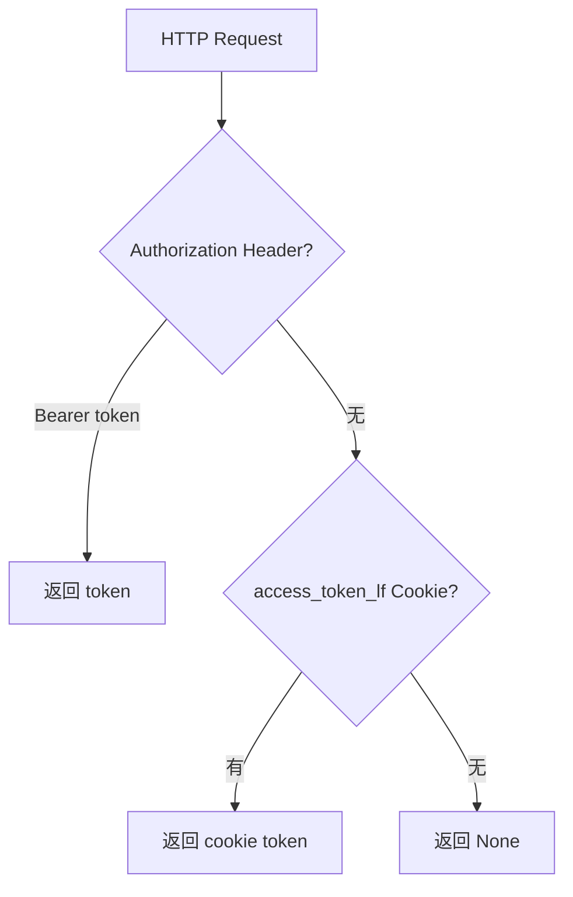
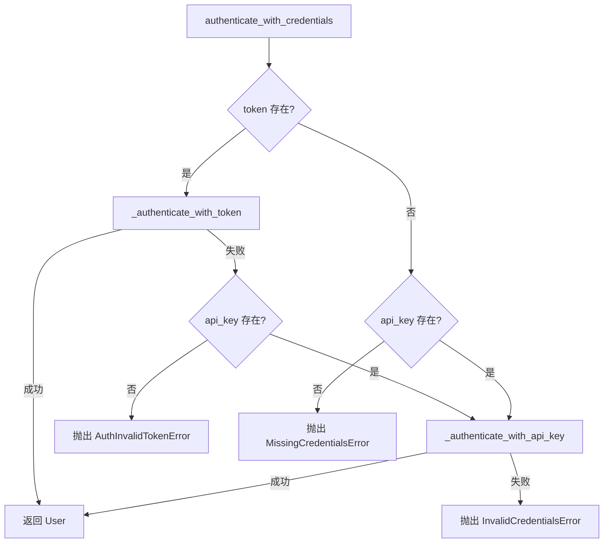
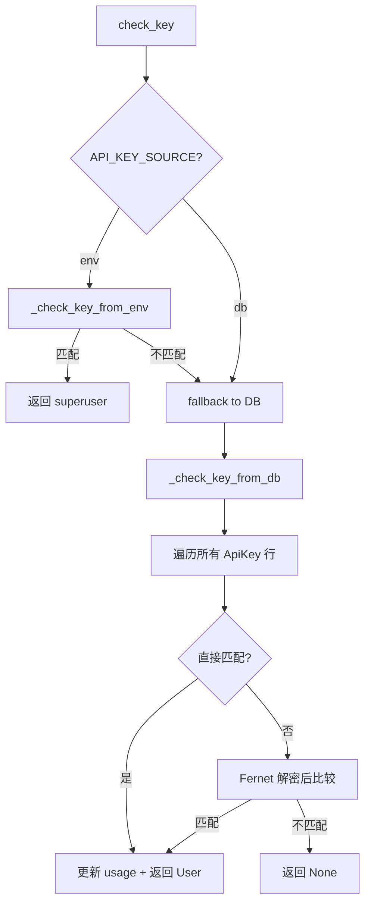

# PD-389.01 Langflow — JWT + API Key + SSO 三层认证体系

> 文档编号：PD-389.01
> 来源：Langflow `src/backend/base/langflow/services/auth/`
> GitHub：https://github.com/langflow-ai/langflow.git
> 问题域：PD-389 认证授权 Authentication & Authorization
> 状态：可复用方案

---

## 第 1 章 问题与动机

### 1.1 核心问题

低代码 AI 工作流平台需要同时服务三类消费者：浏览器用户（交互式 UI）、程序化调用方（API 集成）、企业 SSO 用户（OIDC/SAML/LDAP）。每类消费者的凭证传递方式、安全要求和生命周期管理截然不同。核心挑战在于：

- **多通道凭证传递**：浏览器依赖 HttpOnly Cookie 防 XSS，API 客户端依赖 Bearer Token 或 x-api-key Header，WebSocket/SSE 需要从 query param 或 cookie 中提取凭证
- **凭证存储安全**：用户在平台上配置的第三方 API Key（OpenAI、Anthropic 等）必须加密存储，且支持 Kubernetes Secrets 等云原生存储后端
- **SSO 企业集成**：需要支持 OIDC/SAML/LDAP 多协议，且 SSO 配置本身（client_secret）也需要加密持久化
- **JWT 算法灵活性**：不同部署环境可能需要对称（HS256）或非对称（RS256/RS512）签名算法

### 1.2 Langflow 的解法概述

Langflow 构建了一个三层认证体系，通过 `BaseAuthService` 抽象基类 + `AuthService` 默认实现 + `AuthServiceFactory` 工厂模式实现可插拔认证：

1. **OAuth2PasswordBearerCookie 双通道**：自定义 FastAPI Security scheme，先检查 Authorization Header，再 fallback 到 `access_token_lf` Cookie（`utils.py:31-53`）
2. **API Key 双源验证**：支持 `db`（数据库存储加密 Key）和 `env`（环境变量 `LANGFLOW_API_KEY`）两种来源，env 模式 fallback 到 db（`crud.py:82-98`）
3. **Fernet 对称加密**：所有敏感凭证（API Key、OAuth client_secret）使用 Fernet 加密存储，短密钥通过确定性种子扩展到 32 字节（`service.py:651-658`）
4. **SSO 插件化**：`SSOConfig` 和 `SSOUserProfile` 表由 OSS 层管理迁移，SSO 插件通过这些表实现 JIT 用户配置（`sso.py:21-77`）
5. **框架无关认证核心**：`authenticate_with_credentials()` 方法将 Token 和 API Key 认证统一为框架无关的入口，HTTP/WebSocket/SSE/MCP 各端点均委托到此方法（`service.py:62-133`）

### 1.3 设计思想

| 设计原则 | 具体实现 | 理由 | 替代方案 |
|----------|----------|------|----------|
| 凭证通道优先级 | Header > Cookie > Query Param | Header 显式传递最安全，Cookie 为浏览器兜底 | 仅支持 Header（会破坏浏览器 SSR 场景） |
| 加密存储一致性 | 所有 CREDENTIAL 类型变量统一 Fernet 加密 | 避免明文泄露，密钥轮换只需改 SECRET_KEY | 每种凭证独立加密方案（维护成本高） |
| 认证逻辑与框架解耦 | `authenticate_with_credentials()` 不依赖 FastAPI | 支持 MCP、WebSocket 等非 HTTP 协议复用 | 直接在 Depends 中写认证逻辑（耦合 FastAPI） |
| SSO 表由 OSS 管理 | 插件只读写数据，不管迁移 | 避免插件与 OSS 迁移冲突 | 插件自带迁移（版本冲突风险） |
| JWT 算法可配置 | `ALGORITHM.is_asymmetric()` 分支选择签名/验证密钥 | 支持对称和非对称算法切换 | 硬编码 HS256（无法满足企业 PKI 需求） |

---

## 第 2 章 源码实现分析

### 2.1 架构概览

```
┌─────────────────────────────────────────────────────────────────┐
│                        FastAPI Endpoints                         │
│  /login  /refresh  /session  /logout  /auto_login               │
└──────┬──────────────────────────────────────────────────────────┘
       │ Depends()
       ▼
┌──────────────────────────────────────────────────────────────────┐
│                    utils.py (Security Schemes)                    │
│  OAuth2PasswordBearerCookie ─── api_key_header ─── api_key_query │
│  get_current_user() ─── get_current_active_user()                │
│  get_current_user_for_websocket() ─── get_current_user_for_sse() │
└──────┬──────────────────────────────────────────────────────────┘
       │ _auth_service() 委托
       ▼
┌──────────────────────────────────────────────────────────────────┐
│              AuthService (service.py)                             │
│  authenticate_with_credentials(token, api_key, db)               │
│    ├── _authenticate_with_token(token, db) ── JWT decode + verify│
│    └── _authenticate_with_api_key(api_key, db) ── check_key()    │
│  create_token() / create_user_tokens() / create_refresh_token()  │
│  encrypt_api_key() / decrypt_api_key() ── Fernet                 │
└──────┬──────────────────────────────────────────────────────────┘
       │
       ▼
┌──────────────────────────────────────────────────────────────────┐
│                    Storage Layer                                  │
│  ┌─────────────┐  ┌──────────────┐  ┌────────────────────────┐  │
│  │ User Model  │  │ ApiKey Model │  │ Variable Model         │  │
│  │ (SQLModel)  │  │ (Fernet加密) │  │ (Credential/Generic)   │  │
│  └─────────────┘  └──────────────┘  └────────────────────────┘  │
│  ┌──────────────────────┐  ┌─────────────────────────────────┐  │
│  │ SSOConfig            │  │ KubernetesSecretManager         │  │
│  │ SSOUserProfile       │  │ (云原生凭证存储)                 │  │
│  └──────────────────────┘  └─────────────────────────────────┘  │
└──────────────────────────────────────────────────────────────────┘
```

### 2.2 核心实现

#### 2.2.1 OAuth2PasswordBearerCookie 双通道认证



对应源码 `src/backend/base/langflow/services/auth/utils.py:31-53`：

```python
class OAuth2PasswordBearerCookie(OAuth2PasswordBearer):
    """Custom OAuth2 scheme that checks Authorization header first, then cookies."""

    async def __call__(self, request: Request) -> str | None:
        # First, check for explicit Authorization header
        authorization = request.headers.get("Authorization")
        scheme, param = get_authorization_scheme_param(authorization)
        if scheme.lower() == "bearer" and param:
            return param

        # Fall back to cookie (for HttpOnly cookie support)
        token = request.cookies.get("access_token_lf")
        if token:
            return token

        return None
```

#### 2.2.2 框架无关认证核心 — authenticate_with_credentials



对应源码 `src/backend/base/langflow/services/auth/service.py:62-133`：

```python
async def authenticate_with_credentials(
    self, token: str | None, api_key: str | None, db: AsyncSession,
) -> User | UserRead:
    # Try token authentication first (if token provided)
    if token:
        try:
            return await self._authenticate_with_token(token, db)
        except (AuthInvalidTokenError, TokenExpiredError, InactiveUserError):
            raise
        except Exception as e:
            # Token auth failed; fall back to API key if provided
            if api_key:
                try:
                    user = await self._authenticate_with_api_key(api_key, db)
                    if user:
                        return user
                    raise InvalidCredentialsError("Invalid API key")
                except InvalidCredentialsError:
                    raise
    # Try API key authentication
    if api_key:
        user = await self._authenticate_with_api_key(api_key, db)
        if user:
            return user
        raise InvalidCredentialsError("Invalid API key")
    raise MissingCredentialsError("No authentication credentials provided")
```

#### 2.2.3 API Key 双源验证（DB + ENV）



对应源码 `src/backend/base/langflow/services/database/models/api_key/crud.py:82-98`：

```python
async def check_key(session: AsyncSession, api_key: str) -> User | None:
    settings_service = get_settings_service()
    api_key_source = settings_service.auth_settings.API_KEY_SOURCE

    if api_key_source == "env":
        user = await _check_key_from_env(session, api_key, settings_service)
        if user is not None:
            return user
        # Fallback to database if env validation fails
    return await _check_key_from_db(session, api_key, settings_service)
```

### 2.3 实现细节

#### Fernet 密钥扩展策略

当 `SECRET_KEY` 长度不足 32 字节时，Langflow 使用确定性随机种子扩展密钥（`service.py:651-658`）：

```python
def _ensure_valid_key(self, raw_key: str) -> bytes:
    if len(raw_key) < MINIMUM_KEY_LENGTH:
        random.seed(raw_key)  # 确定性种子，相同密钥总是生成相同扩展
        key = bytes(random.getrandbits(8) for _ in range(32))
        key = base64.urlsafe_b64encode(key)
    else:
        key = self._add_padding(raw_key).encode()
    return key
```

#### Cookie 安全配置

登录端点 `login.py:51-77` 设置三个 Cookie，每个都有独立的安全策略：

| Cookie | 用途 | HttpOnly | SameSite | Secure | 过期 |
|--------|------|----------|----------|--------|------|
| `access_token_lf` | JWT 访问令牌 | 可配置 | 可配置 | 可配置 | ACCESS_TOKEN_EXPIRE_SECONDS |
| `refresh_token_lf` | JWT 刷新令牌 | 可配置 | 可配置 | 可配置 | REFRESH_TOKEN_EXPIRE_SECONDS |
| `apikey_tkn_lflw` | Store API Key | 可配置 | 可配置 | 可配置 | Session Cookie |

#### MCP 加密工具

`mcp_encryption.py` 提供 `encrypt_auth_settings()` / `decrypt_auth_settings()` 对 MCP 连接的 `oauth_client_secret` 和 `api_key` 字段进行透明加密，支持幂等操作（已加密的值不会重复加密）。

#### WebSocket 认证

`utils.py:190-206` 从 WebSocket 的 cookie、query param、header 三个位置提取凭证：

```python
async def get_current_user_for_websocket(websocket: WebSocket, db: AsyncSession) -> User | UserRead:
    token = websocket.cookies.get("access_token_lf") or websocket.query_params.get("token")
    api_key = (
        websocket.query_params.get("x-api-key")
        or websocket.query_params.get("api_key")
        or websocket.headers.get("x-api-key")
        or websocket.headers.get("api_key")
    )
    return await _auth_service().get_current_user_for_websocket(token, api_key, db)
```


---

## 第 3 章 迁移指南

### 3.1 迁移清单

**阶段 1：基础 JWT + Cookie 双通道（1-2 天）**

- [ ] 实现 `OAuth2PasswordBearerCookie` 自定义 Security scheme
- [ ] 配置 JWT 签名/验证密钥（支持 HS256 和 RS256）
- [ ] 实现 `/login` 端点，同时设置 access_token 和 refresh_token Cookie
- [ ] 实现 `/refresh` 端点，从 Cookie 读取 refresh_token
- [ ] 实现 `/logout` 端点，清除所有认证 Cookie

**阶段 2：API Key 系统（1 天）**

- [ ] 创建 `ApiKey` 数据模型（SQLModel/SQLAlchemy）
- [ ] 实现 Fernet 加密/解密 API Key
- [ ] 实现 `check_key()` 双源验证（DB + ENV fallback）
- [ ] 添加 API Key 使用量追踪（`total_uses`, `last_used_at`）

**阶段 3：凭证加密存储（1 天）**

- [ ] 实现 `VariableService` 抽象基类
- [ ] 实现 `DatabaseVariableService`，CREDENTIAL 类型自动 Fernet 加密
- [ ] 可选：实现 `KubernetesSecretManager` 云原生存储后端

**阶段 4：SSO 插件化（可选）**

- [ ] 创建 `SSOConfig` 和 `SSOUserProfile` 数据表
- [ ] 实现 SSO 插件接口（OIDC/SAML/LDAP）
- [ ] 实现 JIT 用户配置（首次 SSO 登录自动创建用户）

### 3.2 适配代码模板

#### 双通道 OAuth2 Scheme（可直接复用）

```python
from fastapi import Request
from fastapi.security import OAuth2PasswordBearer
from fastapi.security.utils import get_authorization_scheme_param


class OAuth2PasswordBearerCookie(OAuth2PasswordBearer):
    """Header-first, Cookie-fallback OAuth2 scheme."""

    async def __call__(self, request: Request) -> str | None:
        authorization = request.headers.get("Authorization")
        scheme, param = get_authorization_scheme_param(authorization)
        if scheme.lower() == "bearer" and param:
            return param
        token = request.cookies.get("access_token")
        if token:
            return token
        return None


oauth2_scheme = OAuth2PasswordBearerCookie(tokenUrl="/api/v1/login", auto_error=False)
```

#### Fernet 密钥扩展 + 加解密（可直接复用）

```python
import base64
import random
from cryptography.fernet import Fernet

MINIMUM_KEY_LENGTH = 32


def ensure_valid_fernet_key(raw_key: str) -> bytes:
    """将任意长度密钥扩展为有效的 Fernet key。"""
    if len(raw_key) < MINIMUM_KEY_LENGTH:
        random.seed(raw_key)
        key = bytes(random.getrandbits(8) for _ in range(32))
        return base64.urlsafe_b64encode(key)
    padding_needed = 4 - len(raw_key) % 4
    return (raw_key + "=" * padding_needed).encode()


def encrypt_value(value: str, secret_key: str) -> str:
    fernet = Fernet(ensure_valid_fernet_key(secret_key))
    return fernet.encrypt(value.encode()).decode()


def decrypt_value(encrypted: str, secret_key: str) -> str:
    if not encrypted or not encrypted.startswith("gAAAAA"):
        return encrypted  # 明文直接返回
    fernet = Fernet(ensure_valid_fernet_key(secret_key))
    return fernet.decrypt(encrypted.encode()).decode()
```

#### 框架无关认证核心（可直接复用）

```python
from dataclasses import dataclass
from enum import Enum


class AuthError(Exception):
    def __init__(self, message: str, code: str):
        self.message = message
        self.code = code


class AuthErrorCode(str, Enum):
    MISSING = "missing_credentials"
    INVALID = "invalid_credentials"
    EXPIRED = "token_expired"
    INACTIVE = "inactive_user"


@dataclass
class AuthResult:
    user_id: str
    is_superuser: bool = False


async def authenticate(
    token: str | None,
    api_key: str | None,
    verify_token_fn,
    verify_api_key_fn,
) -> AuthResult:
    """Framework-agnostic authentication entry point."""
    if token:
        try:
            return await verify_token_fn(token)
        except Exception:
            if api_key:
                result = await verify_api_key_fn(api_key)
                if result:
                    return result
            raise
    if api_key:
        result = await verify_api_key_fn(api_key)
        if result:
            return result
        raise AuthError("Invalid API key", AuthErrorCode.INVALID)
    raise AuthError("No credentials provided", AuthErrorCode.MISSING)
```

### 3.3 适用场景

| 场景 | 适用度 | 说明 |
|------|--------|------|
| 低代码 AI 平台 | ⭐⭐⭐ | 完美匹配：浏览器 + API + SSO 三类消费者 |
| 纯 API 服务 | ⭐⭐ | Cookie 双通道可简化，API Key 系统直接复用 |
| 企业内部工具 | ⭐⭐⭐ | SSO 插件化 + 凭证加密存储是刚需 |
| 单用户 CLI 工具 | ⭐ | 过度设计，简单 API Key 即可 |
| 多租户 SaaS | ⭐⭐ | 需额外添加租户隔离层，但认证核心可复用 |

---

## 第 4 章 测试用例

```python
import base64
import random
from datetime import timedelta, datetime, timezone
from unittest.mock import AsyncMock, MagicMock, patch
from uuid import uuid4

import jwt
import pytest
from cryptography.fernet import Fernet


# ── Fernet 密钥扩展测试 ──

class TestFernetKeyExpansion:
    def _ensure_valid_key(self, raw_key: str) -> bytes:
        if len(raw_key) < 32:
            random.seed(raw_key)
            key = bytes(random.getrandbits(8) for _ in range(32))
            return base64.urlsafe_b64encode(key)
        padding_needed = 4 - len(raw_key) % 4
        return (raw_key + "=" * padding_needed).encode()

    def test_short_key_deterministic(self):
        """相同短密钥总是生成相同的 Fernet key。"""
        key1 = self._ensure_valid_key("short")
        key2 = self._ensure_valid_key("short")
        assert key1 == key2

    def test_short_key_produces_valid_fernet(self):
        """短密钥扩展后可以正常加解密。"""
        key = self._ensure_valid_key("mykey")
        fernet = Fernet(key)
        encrypted = fernet.encrypt(b"secret")
        assert fernet.decrypt(encrypted) == b"secret"

    def test_long_key_padding(self):
        """长密钥正确添加 base64 padding。"""
        raw = "a" * 40
        key = self._ensure_valid_key(raw)
        assert len(key) % 4 == 0


# ── 双通道认证测试 ──

class TestOAuth2PasswordBearerCookie:
    @pytest.mark.asyncio
    async def test_header_takes_precedence(self):
        """Authorization Header 优先于 Cookie。"""
        request = MagicMock()
        request.headers = {"Authorization": "Bearer header_token"}
        request.cookies = {"access_token_lf": "cookie_token"}

        # 模拟 OAuth2PasswordBearerCookie.__call__
        authorization = request.headers.get("Authorization")
        scheme, param = authorization.split(" ", 1)
        assert scheme.lower() == "bearer"
        assert param == "header_token"

    @pytest.mark.asyncio
    async def test_cookie_fallback(self):
        """无 Header 时 fallback 到 Cookie。"""
        request = MagicMock()
        request.headers = {}
        request.cookies = {"access_token_lf": "cookie_token"}

        authorization = request.headers.get("Authorization")
        assert authorization is None
        token = request.cookies.get("access_token_lf")
        assert token == "cookie_token"


# ── API Key 加密存储测试 ──

class TestApiKeyEncryption:
    def setup_method(self):
        self.secret = "a" * 40
        padding = 4 - len(self.secret) % 4
        self.key = (self.secret + "=" * padding).encode()
        self.fernet = Fernet(self.key)

    def test_encrypt_decrypt_roundtrip(self):
        """API Key 加密后可以正确解密。"""
        original = "sk-abc123def456"
        encrypted = self.fernet.encrypt(original.encode()).decode()
        assert encrypted.startswith("gAAAAA")
        decrypted = self.fernet.decrypt(encrypted.encode()).decode()
        assert decrypted == original

    def test_plaintext_passthrough(self):
        """非 Fernet 格式的值直接返回（向后兼容）。"""
        plaintext = "sk-plaintext-key"
        assert not plaintext.startswith("gAAAAA")


# ── JWT Token 生命周期测试 ──

class TestJWTTokenLifecycle:
    def setup_method(self):
        self.secret = "test-secret-key-for-jwt-signing"
        self.algorithm = "HS256"
        self.user_id = str(uuid4())

    def test_create_access_token(self):
        """创建 access token 包含正确的 payload。"""
        expire = datetime.now(timezone.utc) + timedelta(seconds=3600)
        payload = {"sub": self.user_id, "type": "access", "exp": expire}
        token = jwt.encode(payload, self.secret, algorithm=self.algorithm)
        decoded = jwt.decode(token, self.secret, algorithms=[self.algorithm])
        assert decoded["sub"] == self.user_id
        assert decoded["type"] == "access"

    def test_refresh_token_type_validation(self):
        """refresh token 不能用作 access token。"""
        expire = datetime.now(timezone.utc) + timedelta(seconds=86400)
        payload = {"sub": self.user_id, "type": "refresh", "exp": expire}
        token = jwt.encode(payload, self.secret, algorithm=self.algorithm)
        decoded = jwt.decode(token, self.secret, algorithms=[self.algorithm])
        assert decoded["type"] != "access"

    def test_expired_token_rejected(self):
        """过期 token 被拒绝。"""
        expire = datetime.now(timezone.utc) - timedelta(seconds=1)
        payload = {"sub": self.user_id, "type": "access", "exp": expire}
        token = jwt.encode(payload, self.secret, algorithm=self.algorithm)
        with pytest.raises(jwt.ExpiredSignatureError):
            jwt.decode(token, self.secret, algorithms=[self.algorithm])
```


---

## 第 5 章 跨域关联

| 关联域 | 关系类型 | 说明 |
|--------|----------|------|
| PD-04 工具系统 | 协同 | MCP 工具连接的 OAuth client_secret 通过 `mcp_encryption.py` 加密存储，工具系统依赖认证层的 Fernet 加密能力 |
| PD-06 记忆持久化 | 协同 | `DatabaseVariableService` 将用户凭证（第三方 API Key）作为加密变量持久化，是记忆系统的安全子集 |
| PD-09 Human-in-the-Loop | 依赖 | WebSocket/SSE 认证（`get_current_user_for_websocket`）是实时交互的前置条件 |
| PD-11 可观测性 | 协同 | API Key 使用量追踪（`total_uses`, `last_used_at`）为成本追踪提供认证维度的数据 |

---

## 第 6 章 来源文件索引

| 文件 | 行范围 | 关键实现 |
|------|--------|----------|
| `src/backend/base/langflow/services/auth/utils.py` | L31-L53 | OAuth2PasswordBearerCookie 双通道 scheme |
| `src/backend/base/langflow/services/auth/utils.py` | L96-L129 | JWT 签名/验证密钥选择（对称/非对称） |
| `src/backend/base/langflow/services/auth/utils.py` | L156-L165 | get_current_user 统一入口 |
| `src/backend/base/langflow/services/auth/utils.py` | L190-L206 | WebSocket 多源凭证提取 |
| `src/backend/base/langflow/services/auth/service.py` | L49-L56 | AuthService 初始化 |
| `src/backend/base/langflow/services/auth/service.py` | L62-L133 | authenticate_with_credentials 框架无关核心 |
| `src/backend/base/langflow/services/auth/service.py` | L135-L197 | _authenticate_with_token JWT 验证 |
| `src/backend/base/langflow/services/auth/service.py` | L199-L212 | _authenticate_with_api_key 验证 |
| `src/backend/base/langflow/services/auth/service.py` | L458-L472 | create_token JWT 签名 |
| `src/backend/base/langflow/services/auth/service.py` | L651-L658 | _ensure_valid_key Fernet 密钥扩展 |
| `src/backend/base/langflow/services/auth/service.py` | L665-L711 | decrypt_api_key 双重解密尝试 |
| `src/backend/base/langflow/services/auth/exceptions.py` | L6-L54 | 6 类框架无关认证异常 |
| `src/backend/base/langflow/services/auth/factory.py` | L20-L43 | AuthServiceFactory 工厂模式 |
| `src/backend/base/langflow/services/auth/mcp_encryption.py` | L11-L114 | MCP 敏感字段加密/解密 |
| `src/backend/base/langflow/services/database/models/auth/sso.py` | L21-L77 | SSOUserProfile + SSOConfig 数据模型 |
| `src/backend/base/langflow/services/database/models/api_key/model.py` | L18-L67 | ApiKey 模型 + 掩码读取 |
| `src/backend/base/langflow/services/database/models/api_key/crud.py` | L48-L68 | create_api_key Fernet 加密存储 |
| `src/backend/base/langflow/services/database/models/api_key/crud.py` | L82-L98 | check_key 双源验证 |
| `src/backend/base/langflow/services/variable/service.py` | L24-L412 | DatabaseVariableService 凭证加密存储 |
| `src/backend/base/langflow/services/variable/kubernetes_secrets.py` | L10-L193 | KubernetesSecretManager 云原生存储 |
| `src/backend/base/langflow/api/v1/login.py` | L27-L93 | 登录端点 + Cookie 设置 |
| `src/backend/base/langflow/api/v1/login.py` | L145-L181 | refresh_token 端点 |

---

## 第 7 章 横向对比维度

> **重要：** 本章用于自动填充 Butcher Wiki 的横向对比表。

```json comparison_data
{
  "project": "Langflow",
  "dimensions": {
    "认证协议": "JWT + API Key + SSO(OIDC/SAML/LDAP) 三层体系",
    "凭证传递": "OAuth2PasswordBearerCookie: Header > Cookie > Query 三级优先级",
    "密钥管理": "Fernet 对称加密 + 确定性种子短密钥扩展",
    "API Key验证": "双源验证(DB加密存储 + ENV环境变量 fallback)",
    "凭证存储": "DatabaseVariableService + KubernetesSecretManager 双后端",
    "SSO架构": "插件化: OSS管迁移, 插件管业务, SSOConfig持久化到DB",
    "JWT算法": "可配置对称(HS256)/非对称(RS256/RS512), is_asymmetric()分支",
    "异常体系": "6类框架无关异常 + _auth_error_to_http 统一映射"
  }
}
```

### 域元数据补充

```json domain_metadata
{
  "solution_summary": "Langflow 用 OAuth2PasswordBearerCookie 实现 Header>Cookie>Query 三级凭证优先级，authenticate_with_credentials() 将 JWT/API Key 认证统一为框架无关入口，Fernet 加密所有 CREDENTIAL 类型变量，SSO 通过插件化 SSOConfig 表支持 OIDC/SAML/LDAP",
  "description": "低代码AI平台的多消费者多协议认证统一抽象",
  "sub_problems": [
    "WebSocket/SSE 非 HTTP 协议的凭证提取与认证",
    "MCP 工具连接的 OAuth 凭证加密存储",
    "API Key 使用量追踪与审计",
    "短密钥的确定性扩展与 Fernet 兼容"
  ],
  "best_practices": [
    "认证逻辑与 Web 框架解耦为框架无关方法",
    "API Key 支持 DB 和 ENV 双源验证并自动 fallback",
    "SSO 表迁移由 OSS 层管理避免插件冲突",
    "Fernet 加密值以 gAAAAA 前缀识别实现明文兼容"
  ]
}
```

