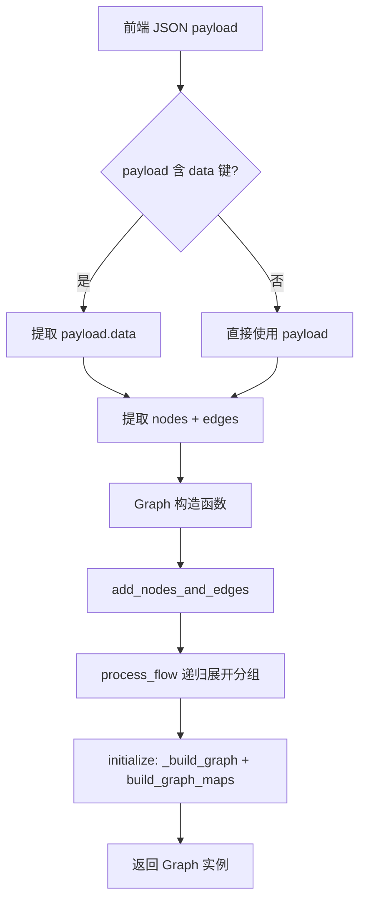
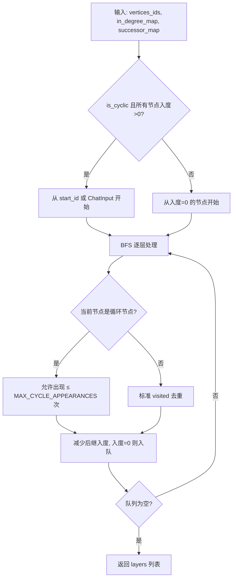
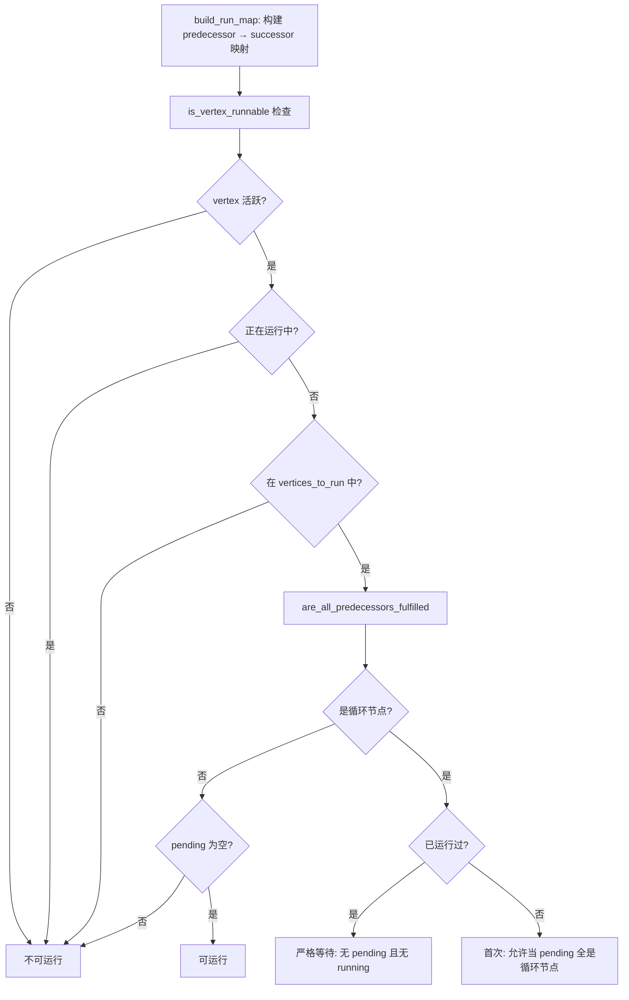

# PD-390.01 Langflow — Graph-Vertex-Edge 可视化工作流引擎

> 文档编号：PD-390.01
> 来源：Langflow `src/lfx/src/lfx/graph/graph/base.py`, `src/lfx/src/lfx/graph/graph/utils.py`, `src/lfx/src/lfx/graph/edge/base.py`
> GitHub：https://github.com/langflow-ai/langflow.git
> 问题域：PD-390 可视化工作流引擎 Visual Workflow Engine
> 状态：可复用方案

---

## 第 1 章 问题与动机（≥ 30 行）

### 1.1 核心问题

低代码 AI 应用编排面临三个核心挑战：

1. **图结构解析**：前端 React Flow 拖拽生成的 JSON 需要在后端还原为可执行的有向图，包括节点分组展开、代理节点解引用、边类型校验等
2. **循环与条件路由**：AI 工作流不是简单 DAG——Loop 组件需要循环执行，条件路由需要动态激活/停用分支，这要求图引擎同时支持 DAG 和有环图
3. **层级并行执行**：同一层级的无依赖节点应并行构建，跨层级按拓扑序串行，且需要处理循环节点的重复出现（MAX_CYCLE_APPEARANCES=2）

### 1.2 Langflow 的解法概述

Langflow 构建了一套完整的 Graph-Vertex-Edge 三层抽象：

1. **Graph.from_payload 解析入口**：接收前端 JSON `{nodes, edges}`，通过 `process_flow` 递归展开分组节点，然后 `_build_graph` 构建 Vertex/Edge 对象（`base.py:1145-1181`）
2. **layered_topological_sort 层级排序**：基于 Kahn 算法的分层拓扑排序，支持循环图的特殊处理——循环节点允许出现最多 2 次（`utils.py:463-604`）
3. **RunnableVerticesManager 运行时调度**：维护 predecessor_map / vertices_to_run / vertices_being_run 三个状态集合，通过 `is_vertex_runnable` 判断节点是否可执行（`runnable_vertices_manager.py:1-134`）
4. **CycleEdge 循环边契约**：继承 Edge 的特殊边类型，通过 `honor()` 方法在循环迭代间传递数据，实现 Loop 组件的数据流转（`edge/base.py:249-296`）
5. **条件路由双系统**：ACTIVE/INACTIVE 状态用于循环管理（每轮重置），conditionally_excluded_vertices 用于条件路由（持久排除），两套系统互不干扰（`base.py:107-109`）

### 1.3 设计思想

| 设计原则 | 具体实现 | 理由 | 替代方案 |
|----------|----------|------|----------|
| 前后端统一数据模型 | JSON `{nodes, edges}` 双向序列化，`from_payload` / `dump` 对称 | React Flow 原生格式，零转换成本 | Protobuf 序列化（增加前端复杂度） |
| 分组节点递归展开 | `process_flow` + `ungroup_node` 递归展平嵌套 Flow | 支持子图复用和模块化编排 | 运行时动态展开（增加执行复杂度） |
| 循环与 DAG 统一引擎 | `is_cyclic` 属性 + `cycle_vertices` 集合 + `MAX_CYCLE_APPEARANCES` | 一套引擎同时处理 DAG 和有环图 | 分离两套执行引擎（代码重复） |
| 类型安全的边校验 | Edge.__init__ 中 `validate_handles` + `validate_edge` 双重校验 | 构建时 fail-fast，避免运行时类型错误 | 运行时延迟校验（错误难定位） |
| 惰性初始化 | asyncio.Lock / tracing_service / state_model 均 lazy init | 避免事件循环绑定问题，减少启动开销 | 构造函数中初始化（可能抛异常） |

---

## 第 2 章 源码实现分析（≥ 60 行，核心章节）

### 2.1 架构概览

Langflow 的工作流引擎分为三层：解析层、调度层、执行层。

```
┌─────────────────────────────────────────────────────────────┐
│                    前端 React Flow                           │
│         拖拽编排 → JSON {nodes, edges} payload               │
└──────────────────────┬──────────────────────────────────────┘
                       │ POST /api/v1/run
                       ▼
┌─────────────────────────────────────────────────────────────┐
│  解析层 Graph.from_payload                                   │
│  ┌──────────────┐  ┌──────────────┐  ┌──────────────────┐  │
│  │ process_flow │→ │ _build_graph │→ │ build_graph_maps │  │
│  │ 递归展开分组  │  │ 构建V/E对象  │  │ 邻接表+入度表    │  │
│  └──────────────┘  └──────────────┘  └──────────────────┘  │
└──────────────────────┬──────────────────────────────────────┘
                       ▼
┌─────────────────────────────────────────────────────────────┐
│  调度层 prepare → sort_vertices                              │
│  ┌────────────────────────┐  ┌───────────────────────────┐  │
│  │ layered_topological_   │→ │ sort_layer_by_dependency  │  │
│  │ sort (Kahn + 循环处理) │  │ + sort_chat_inputs_first  │  │
│  └────────────────────────┘  └───────────────────────────┘  │
│  输出: vertices_layers = [[layer0], [layer1], ...]          │
└──────────────────────┬──────────────────────────────────────┘
                       ▼
┌─────────────────────────────────────────────────────────────┐
│  执行层 process / async_start                                │
│  ┌──────────────────┐  ┌─────────────────────────────────┐  │
│  │ build_vertex     │→ │ get_next_runnable_vertices      │  │
│  │ (构建+缓存+事件) │  │ (RunnableVerticesManager调度)   │  │
│  └──────────────────┘  └─────────────────────────────────┘  │
│  同层并行 asyncio.create_task，跨层串行 while to_process     │
└─────────────────────────────────────────────────────────────┘
```

### 2.2 核心实现

#### 2.2.1 Graph.from_payload — JSON 到图的解析



对应源码 `src/lfx/src/lfx/graph/graph/base.py:1145-1181`：

```python
@classmethod
def from_payload(
    cls,
    payload: dict,
    flow_id: str | None = None,
    flow_name: str | None = None,
    user_id: str | None = None,
    context: dict | None = None,
) -> Graph:
    if "data" in payload:
        payload = payload["data"]
    try:
        vertices = payload["nodes"]
        edges = payload["edges"]
        graph = cls(flow_id=flow_id, flow_name=flow_name, user_id=user_id, context=context)
        graph.add_nodes_and_edges(vertices, edges)
    except KeyError as exc:
        if "nodes" not in payload and "edges" not in payload:
            msg = f"Invalid payload. Expected keys 'nodes' and 'edges'. Found {list(payload.keys())}"
            raise ValueError(msg) from exc
        msg = f"Error while creating graph from payload: {exc}"
        raise ValueError(msg) from exc
    else:
        return graph
```

`add_nodes_and_edges` 内部调用 `process_flow` 递归展开分组节点（`base.py:256-270`），然后 `initialize` 触发 `_build_graph` 构建 Vertex/Edge 对象并建立邻接表。

#### 2.2.2 layered_topological_sort — 支持循环的分层拓扑排序



对应源码 `src/lfx/src/lfx/graph/graph/utils.py:463-604`：

```python
def layered_topological_sort(
    vertices_ids: set[str],
    in_degree_map: dict[str, int],
    successor_map: dict[str, list[str]],
    predecessor_map: dict[str, list[str]],
    start_id: str | None = None,
    cycle_vertices: set[str] | None = None,
    is_input_vertex: Callable[[str], bool] | None = None,
    *,
    is_cyclic: bool = False,
) -> list[list[str]]:
    cycle_vertices = cycle_vertices or set()
    in_degree_map = in_degree_map.copy()

    if is_cyclic and all(in_degree_map.values()):
        # 全部节点有入度 → 纯循环图，从 start_id 开始
        if start_id is not None:
            queue = deque([start_id])
            in_degree_map[start_id] = 0
        else:
            chat_input = find_start_component_id(vertices_ids)
            if chat_input is None:
                queue = deque([next(iter(vertices_ids))])
            else:
                queue = deque([chat_input])
    else:
        queue = deque(
            vertex_id for vertex_id in vertices_ids
            if in_degree_map[vertex_id] == 0
        )
    # ... BFS 逐层处理，循环节点允许 cycle_counts < MAX_CYCLE_APPEARANCES
```

关键设计：`MAX_CYCLE_APPEARANCES = 2`（`utils.py:11`），循环节点最多出现 2 次，防止无限循环。NetworkX 的 `strongly_connected_components` 用于发现循环节点集合（`utils.py:449-460`）。

#### 2.2.3 RunnableVerticesManager — 运行时调度器



对应源码 `src/lfx/src/lfx/graph/graph/runnable_vertices_manager.py:56-100`：

```python
def is_vertex_runnable(self, vertex_id: str, *, is_active: bool, is_loop: bool = False) -> bool:
    if not is_active:
        return False
    if vertex_id in self.vertices_being_run:
        return False
    if vertex_id not in self.vertices_to_run:
        return False
    return self.are_all_predecessors_fulfilled(vertex_id, is_loop=is_loop)

def are_all_predecessors_fulfilled(self, vertex_id: str, *, is_loop: bool) -> bool:
    pending = self.run_predecessors.get(vertex_id, [])
    if not pending:
        return True
    if vertex_id in self.cycle_vertices:
        pending_set = set(pending)
        running_predecessors = pending_set & self.vertices_being_run
        if vertex_id in self.ran_at_least_once:
            return not (pending_set or running_predecessors)
        return is_loop and pending_set <= self.cycle_vertices
    return False
```

### 2.3 实现细节

#### Edge 类型系统与 CycleEdge 契约

Edge 在构造时执行双重校验：`validate_handles`（检查 source/target 的类型兼容性）和 `validate_edge`（检查输出类型是否匹配目标输入需求）。支持 legacy 和新版两套校验路径（`edge/base.py:77-122`）。

CycleEdge 继承 Edge，增加 `is_fulfilled` 状态和 `honor()` 方法（`edge/base.py:249-281`）：

```python
class CycleEdge(Edge):
    def __init__(self, source: Vertex, target: Vertex, raw_edge: EdgeData):
        super().__init__(source, target, raw_edge)
        self.is_fulfilled = False
        self.result: Any = None
        self.is_cycle = True
        source.has_cycle_edges = True
        target.has_cycle_edges = True

    async def honor(self, source: Vertex, target: Vertex) -> None:
        if self.is_fulfilled:
            return
        if not source.built:
            raise ValueError(f"Source vertex {source.id} is not built.")
        if self.matched_type == "Text":
            self.result = source.built_result
        else:
            self.result = source.built_object
        target.params[self.target_param] = self.result
        self.is_fulfilled = True
```

#### 条件路由双系统

Graph 维护两套独立的节点排除机制（`base.py:107-109`）：

- `inactivated_vertices` + `VertexStates.INACTIVE`：用于循环管理，每轮迭代后通过 `reset_inactivated_vertices` 重置
- `conditionally_excluded_vertices` + `conditional_exclusion_sources`：用于条件路由，由源节点显式设置，持久生效直到同一源节点清除

#### 并行执行模型

`process` 方法（`base.py:1651-1712`）实现同层并行、跨层串行：

```python
async def process(self, *, fallback_to_env_vars, start_component_id=None, event_manager=None):
    first_layer = self.sort_vertices(start_component_id=start_component_id)
    to_process = deque(first_layer)
    while to_process:
        current_batch = list(to_process)
        to_process.clear()
        tasks = []
        for vertex_id in current_batch:
            task = asyncio.create_task(
                self.build_vertex(vertex_id=vertex_id, ...)
            )
            tasks.append(task)
        next_runnable_vertices = await self._execute_tasks(tasks, lock=lock, ...)
        if not next_runnable_vertices:
            break
        to_process.extend(next_runnable_vertices)
```


---

## 第 3 章 迁移指南（≥ 40 行）

### 3.1 迁移清单

**阶段 1：核心数据模型（1-2 天）**

- [ ] 定义 `Vertex` 基类：id、state（ACTIVE/INACTIVE/ERROR）、inputs/outputs 类型声明、built 状态
- [ ] 定义 `Edge` 基类：source_id、target_id、source_handle、target_handle、类型校验
- [ ] 定义 `Graph` 容器：vertex_map、predecessor_map、successor_map、in_degree_map

**阶段 2：图解析与构建（2-3 天）**

- [ ] 实现 `from_payload(json)` 解析前端 JSON 为 Graph 对象
- [ ] 实现分组节点展开（如果需要子图/模块化）
- [ ] 实现 `_build_graph`：从原始数据构建 Vertex/Edge 对象
- [ ] 实现 `build_graph_maps`：构建邻接表和入度表

**阶段 3：拓扑排序与调度（2-3 天）**

- [ ] 实现 `layered_topological_sort`：Kahn 算法分层排序
- [ ] 实现循环检测：NetworkX `strongly_connected_components` 或自定义 DFS
- [ ] 实现 `RunnableVerticesManager`：predecessor 追踪 + runnable 判断
- [ ] 实现 `CycleEdge`：循环边数据传递契约

**阶段 4：执行引擎（1-2 天）**

- [ ] 实现 `process`：同层并行 `asyncio.create_task`，跨层串行
- [ ] 实现 `build_vertex`：单节点构建 + 缓存 + 事件通知
- [ ] 实现条件路由：`mark_branch` + `exclude_branch_conditionally`

### 3.2 适配代码模板

以下是一个精简的 Graph-Vertex-Edge 引擎骨架，可直接运行：

```python
from __future__ import annotations
import asyncio
from collections import defaultdict, deque
from enum import Enum
from typing import Any, Callable


class VertexState(str, Enum):
    ACTIVE = "ACTIVE"
    INACTIVE = "INACTIVE"
    ERROR = "ERROR"


class Vertex:
    def __init__(self, vertex_id: str, data: dict):
        self.id = vertex_id
        self.data = data
        self.state = VertexState.ACTIVE
        self.built = False
        self.result: Any = None
        self.outputs: list[dict] = data.get("outputs", [])

    async def build(self, **kwargs) -> Any:
        """Override in subclass to implement actual build logic."""
        self.built = True
        self.result = {"status": "ok", "id": self.id}
        return self.result


class Edge:
    def __init__(self, source_id: str, target_id: str, data: dict):
        self.source_id = source_id
        self.target_id = target_id
        self.data = data
        self.is_cycle = False

    def validate(self, source: Vertex, target: Vertex) -> bool:
        """Validate type compatibility between source output and target input."""
        return True  # Implement type checking based on your schema


class Graph:
    def __init__(self):
        self.vertices: list[Vertex] = []
        self.edges: list[Edge] = []
        self.vertex_map: dict[str, Vertex] = {}
        self.predecessor_map: dict[str, list[str]] = defaultdict(list)
        self.successor_map: dict[str, list[str]] = defaultdict(list)
        self.in_degree_map: dict[str, int] = defaultdict(int)
        self.cycle_vertices: set[str] = set()

    @classmethod
    def from_payload(cls, payload: dict) -> Graph:
        data = payload.get("data", payload)
        graph = cls()
        for node in data["nodes"]:
            v = Vertex(node["id"], node)
            graph.vertices.append(v)
            graph.vertex_map[v.id] = v
        for edge_data in data["edges"]:
            e = Edge(edge_data["source"], edge_data["target"], edge_data)
            graph.edges.append(e)
        graph._build_maps()
        return graph

    def _build_maps(self):
        for edge in self.edges:
            self.predecessor_map[edge.target_id].append(edge.source_id)
            self.successor_map[edge.source_id].append(edge.target_id)
            self.in_degree_map[edge.target_id] += 1
        # Ensure all vertices have entries
        for v in self.vertices:
            self.in_degree_map.setdefault(v.id, 0)

    def layered_topological_sort(self) -> list[list[str]]:
        in_degree = self.in_degree_map.copy()
        queue = deque(vid for vid, deg in in_degree.items() if deg == 0)
        layers: list[list[str]] = []
        visited: set[str] = set()

        while queue:
            layer = []
            for _ in range(len(queue)):
                vid = queue.popleft()
                if vid in visited:
                    continue
                visited.add(vid)
                layer.append(vid)
                for succ in self.successor_map[vid]:
                    in_degree[succ] -= 1
                    if in_degree[succ] == 0:
                        queue.append(succ)
            if layer:
                layers.append(layer)
        return layers

    async def execute(self) -> list[Any]:
        layers = self.layered_topological_sort()
        results = []
        for layer in layers:
            tasks = [self.vertex_map[vid].build() for vid in layer]
            layer_results = await asyncio.gather(*tasks)
            results.extend(layer_results)
        return results
```

### 3.3 适用场景

| 场景 | 适用度 | 说明 |
|------|--------|------|
| 低代码 AI 应用编排 | ⭐⭐⭐ | Langflow 的核心场景，React Flow + Graph 引擎 |
| ETL 数据管道 | ⭐⭐⭐ | DAG 拓扑排序 + 并行执行天然适合 |
| CI/CD 流水线引擎 | ⭐⭐ | 需要额外的制品传递和环境管理 |
| 游戏行为树 | ⭐ | 行为树更适合树结构，非通用图 |
| 循环迭代工作流 | ⭐⭐⭐ | CycleEdge + MAX_CYCLE_APPEARANCES 专门设计 |

---

## 第 4 章 测试用例（≥ 20 行）

```python
import asyncio
import pytest
from collections import defaultdict


class TestLayeredTopologicalSort:
    """基于 Langflow utils.py 中 layered_topological_sort 的真实签名。"""

    def _build_maps(self, vertices, edges):
        predecessor_map = defaultdict(list)
        successor_map = defaultdict(list)
        in_degree_map = defaultdict(int)
        for v in vertices:
            in_degree_map.setdefault(v, 0)
        for src, tgt in edges:
            predecessor_map[tgt].append(src)
            successor_map[src].append(tgt)
            in_degree_map[tgt] += 1
        return predecessor_map, successor_map, in_degree_map

    def test_linear_chain(self):
        """A -> B -> C 应产生 3 层。"""
        vertices = {"A", "B", "C"}
        edges = [("A", "B"), ("B", "C")]
        pred, succ, in_deg = self._build_maps(vertices, edges)
        from lfx.graph.graph.utils import layered_topological_sort
        layers = layered_topological_sort(
            vertices_ids=vertices, in_degree_map=in_deg,
            successor_map=succ, predecessor_map=pred,
        )
        assert len(layers) == 3
        assert layers[0] == ["A"]
        assert layers[-1] == ["C"]

    def test_parallel_branches(self):
        """A -> B, A -> C, B -> D, C -> D 应有 B/C 并行层。"""
        vertices = {"A", "B", "C", "D"}
        edges = [("A", "B"), ("A", "C"), ("B", "D"), ("C", "D")]
        pred, succ, in_deg = self._build_maps(vertices, edges)
        from lfx.graph.graph.utils import layered_topological_sort
        layers = layered_topological_sort(
            vertices_ids=vertices, in_degree_map=in_deg,
            successor_map=succ, predecessor_map=pred,
        )
        # B 和 C 应在同一层
        parallel_layer = [l for l in layers if len(l) == 2]
        assert len(parallel_layer) == 1
        assert set(parallel_layer[0]) == {"B", "C"}

    def test_cycle_detection(self):
        """A -> B -> C -> A 应检测为循环。"""
        from lfx.graph.graph.utils import has_cycle
        vertices = ["A", "B", "C"]
        edges = [("A", "B"), ("B", "C"), ("C", "A")]
        assert has_cycle(vertices, edges) is True

    def test_no_cycle(self):
        """A -> B -> C 无循环。"""
        from lfx.graph.graph.utils import has_cycle
        vertices = ["A", "B", "C"]
        edges = [("A", "B"), ("B", "C")]
        assert has_cycle(vertices, edges) is False


class TestRunnableVerticesManager:
    """基于 runnable_vertices_manager.py 的真实接口。"""

    def test_vertex_runnable_when_no_predecessors(self):
        from lfx.graph.graph.runnable_vertices_manager import RunnableVerticesManager
        mgr = RunnableVerticesManager()
        mgr.vertices_to_run = {"A"}
        mgr.run_predecessors = {"A": []}
        assert mgr.is_vertex_runnable("A", is_active=True) is True

    def test_vertex_not_runnable_when_inactive(self):
        from lfx.graph.graph.runnable_vertices_manager import RunnableVerticesManager
        mgr = RunnableVerticesManager()
        mgr.vertices_to_run = {"A"}
        mgr.run_predecessors = {"A": []}
        assert mgr.is_vertex_runnable("A", is_active=False) is False

    def test_vertex_not_runnable_when_being_run(self):
        from lfx.graph.graph.runnable_vertices_manager import RunnableVerticesManager
        mgr = RunnableVerticesManager()
        mgr.vertices_to_run = {"A"}
        mgr.vertices_being_run = {"A"}
        mgr.run_predecessors = {"A": []}
        assert mgr.is_vertex_runnable("A", is_active=True) is False

    def test_cycle_vertex_first_run_allowed(self):
        from lfx.graph.graph.runnable_vertices_manager import RunnableVerticesManager
        mgr = RunnableVerticesManager()
        mgr.vertices_to_run = {"A", "B"}
        mgr.cycle_vertices = {"A", "B"}
        mgr.run_predecessors = {"A": ["B"]}
        # First run: pending are all cycle vertices → allowed for loop
        assert mgr.are_all_predecessors_fulfilled("A", is_loop=True) is True


class TestEdgeValidation:
    """基于 edge/base.py 的 Edge 构造校验。"""

    def test_cycle_edge_honor(self):
        """CycleEdge.honor 应将 source 结果传递到 target.params。"""
        # 这是一个概念测试，实际需要 mock Vertex 对象
        # CycleEdge 的核心契约：honor() 设置 target.params[target_param] = result
        pass
```


---

## 第 5 章 跨域关联

| 关联域 | 关系类型 | 说明 |
|--------|----------|------|
| PD-02 多 Agent 编排 | 协同 | Graph 的 layered_topological_sort 本质是多 Agent 编排的底层调度器，每个 Vertex 可以是一个 Agent |
| PD-03 容错与重试 | 依赖 | `build_vertex` 中的 try/except + 缓存回退机制依赖容错设计，frozen 节点跳过重建 |
| PD-04 工具系统 | 协同 | 每个 Vertex 内部的 `custom_component` 就是工具实例，Graph 引擎负责编排工具的执行顺序 |
| PD-09 Human-in-the-Loop | 协同 | 条件路由 `exclude_branch_conditionally` 可用于实现人工审批分支 |
| PD-10 中间件管道 | 协同 | Vertex 的 `steps` 列表（`vertex/base.py:88`）本质是单节点内的中间件管道 |
| PD-11 可观测性 | 依赖 | Graph 的 tracing_service 惰性初始化，`initialize_run` 启动追踪，`end_all_traces` 结束追踪 |

---

## 第 6 章 来源文件索引

| 文件 | 行范围 | 关键实现 |
|------|--------|----------|
| `src/lfx/src/lfx/graph/graph/base.py` | L59-L147 | Graph 类定义、构造函数、核心属性 |
| `src/lfx/src/lfx/graph/graph/base.py` | L1145-L1181 | `from_payload` 类方法，JSON 解析入口 |
| `src/lfx/src/lfx/graph/graph/base.py` | L1314-L1328 | `_build_graph`：构建 Vertex/Edge 对象 |
| `src/lfx/src/lfx/graph/graph/base.py` | L1417-L1475 | `astep`：单步执行 + 调度下一批可运行节点 |
| `src/lfx/src/lfx/graph/graph/base.py` | L1513-L1621 | `build_vertex`：单节点构建 + 缓存 + 事件 |
| `src/lfx/src/lfx/graph/graph/base.py` | L1651-L1712 | `process`：同层并行执行引擎 |
| `src/lfx/src/lfx/graph/graph/base.py` | L2120-L2143 | `prepare`：初始化 + 排序 + 运行队列 |
| `src/lfx/src/lfx/graph/graph/base.py` | L2204-L2233 | `sort_vertices`：调用 get_sorted_vertices |
| `src/lfx/src/lfx/graph/graph/base.py` | L994-L1000 | `exclude_branch_conditionally`：条件路由 |
| `src/lfx/src/lfx/graph/graph/utils.py` | L10-L11 | `MAX_CYCLE_APPEARANCES = 2` 常量 |
| `src/lfx/src/lfx/graph/graph/utils.py` | L88-L114 | `process_flow`：递归展开分组节点 |
| `src/lfx/src/lfx/graph/graph/utils.py` | L333-L366 | `has_cycle`：DFS 循环检测 |
| `src/lfx/src/lfx/graph/graph/utils.py` | L406-L440 | `find_all_cycle_edges`：发现所有循环边 |
| `src/lfx/src/lfx/graph/graph/utils.py` | L449-L460 | `find_cycle_vertices`：NetworkX 强连通分量 |
| `src/lfx/src/lfx/graph/graph/utils.py` | L463-L604 | `layered_topological_sort`：分层拓扑排序 |
| `src/lfx/src/lfx/graph/graph/utils.py` | L676-L737 | `sort_layer_by_dependency`：层内依赖排序 |
| `src/lfx/src/lfx/graph/graph/utils.py` | L795-L932 | `get_sorted_vertices`：完整排序管线 |
| `src/lfx/src/lfx/graph/edge/base.py` | L13-L72 | Edge 类：构造 + 双重校验 |
| `src/lfx/src/lfx/graph/edge/base.py` | L83-L108 | `_validate_handles`：类型兼容性校验 |
| `src/lfx/src/lfx/graph/edge/base.py` | L146-L202 | `_validate_edge`：输出→输入类型匹配 |
| `src/lfx/src/lfx/graph/edge/base.py` | L249-L296 | CycleEdge：循环边 + honor 契约 |
| `src/lfx/src/lfx/graph/vertex/base.py` | L40-L46 | VertexStates 枚举 |
| `src/lfx/src/lfx/graph/vertex/base.py` | L48-L114 | Vertex 类：构造 + 状态管理 |
| `src/lfx/src/lfx/graph/vertex/base.py` | L124-L128 | `is_loop` 属性：检查输出是否允许循环 |
| `src/lfx/src/lfx/graph/graph/runnable_vertices_manager.py` | L4-L11 | RunnableVerticesManager：五个状态集合 |
| `src/lfx/src/lfx/graph/graph/runnable_vertices_manager.py` | L56-L100 | `is_vertex_runnable` + `are_all_predecessors_fulfilled` |

---

## 第 7 章 横向对比维度

```json comparison_data
{
  "project": "Langflow",
  "dimensions": {
    "图数据模型": "Graph-Vertex-Edge 三层抽象，JSON {nodes,edges} 双向序列化",
    "拓扑排序": "Kahn 分层拓扑排序 + NetworkX 强连通分量循环检测",
    "循环处理": "CycleEdge 契约 + MAX_CYCLE_APPEARANCES=2 限制重复出现",
    "并行执行": "asyncio.create_task 同层并行，deque 跨层串行",
    "条件路由": "双系统：ACTIVE/INACTIVE 循环管理 + conditionally_excluded 持久排除",
    "边校验": "构造时 validate_handles + validate_edge 双重 fail-fast 校验",
    "分组展开": "process_flow 递归展平嵌套 Flow，支持子图模块化复用"
  }
}
```

### 域元数据补充

```json domain_metadata
{
  "solution_summary": "Langflow 用 Graph-Vertex-Edge 三层抽象 + Kahn 分层拓扑排序 + CycleEdge 契约实现支持循环和条件路由的可视化工作流引擎",
  "description": "可视化工作流引擎需要同时处理 DAG 和有环图的统一调度",
  "sub_problems": [
    "分组节点递归展开与子图复用",
    "同层并行与跨层串行的混合执行模型",
    "边类型校验与 fail-fast 构建时验证"
  ],
  "best_practices": [
    "CycleEdge 契约模式：循环边通过 honor() 方法在迭代间传递数据",
    "条件路由双系统：循环管理与条件排除互不干扰",
    "RunnableVerticesManager 集中调度：predecessor 追踪 + runnable 判断解耦"
  ]
}
```

