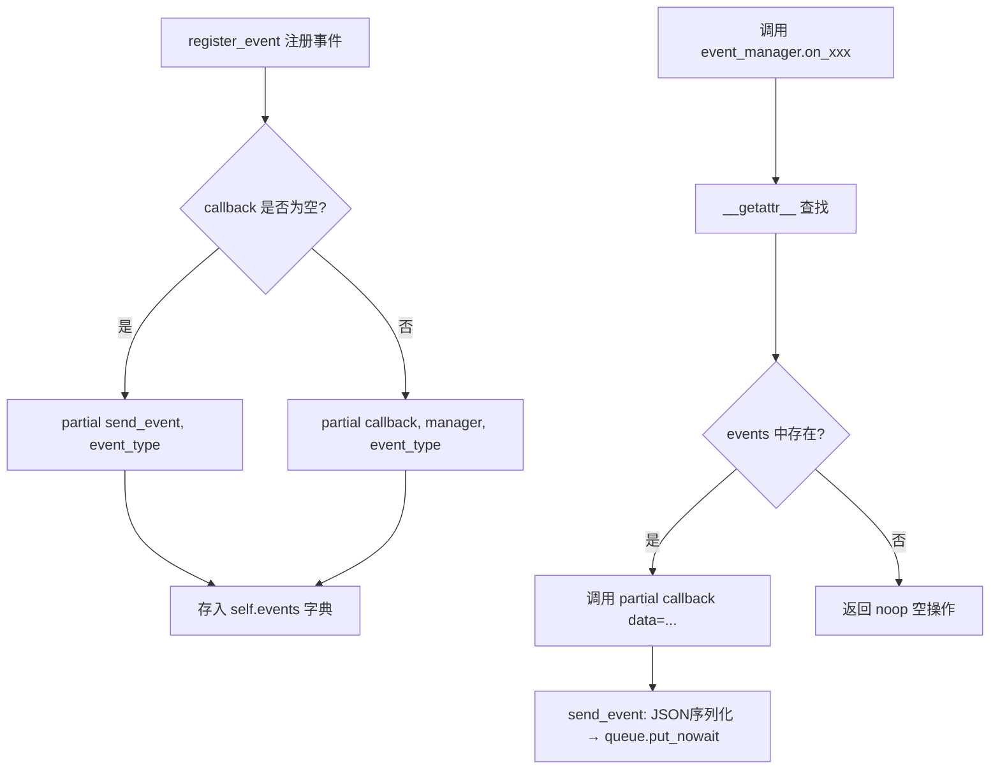
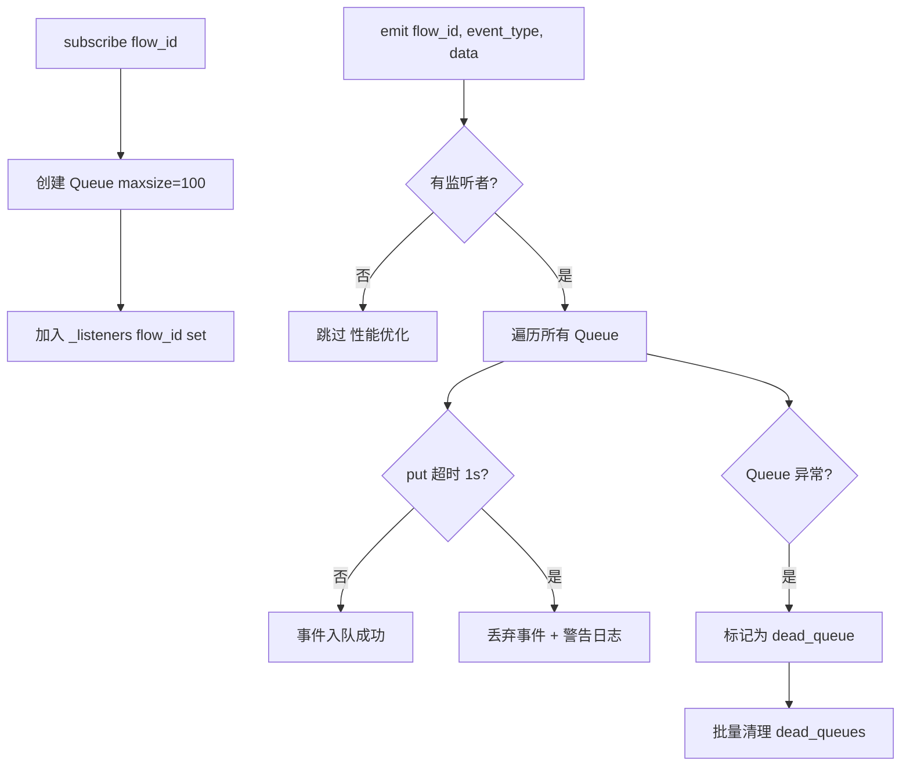
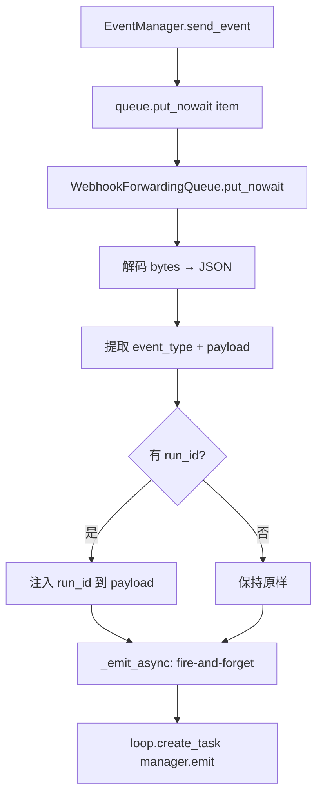

# PD-391.01 Langflow — 双层 EventManager 与 Webhook SSE 事件驱动架构

> 文档编号：PD-391.01
> 来源：Langflow `src/lfx/src/lfx/events/event_manager.py` `src/backend/base/langflow/services/event_manager.py`
> GitHub：https://github.com/langflow-ai/langflow.git
> 问题域：PD-391 事件驱动架构 Event-Driven Architecture
> 状态：可复用方案

---

## 第 1 章 问题与动机（≥ 30 行）

### 1.1 核心问题

在可视化 Flow 编排系统中，用户需要实时看到每个节点（Vertex）的构建进度、成功/失败状态和耗时信息。同时，外部 Webhook 触发的 Flow 执行也需要将构建事件推送到已打开该 Flow 的 UI 客户端。这带来三个核心挑战：

1. **内部事件传递**：Graph 构建引擎在深层调用栈中产生事件（token 流、vertex 构建完成、错误），需要一种非阻塞机制将事件传递到 HTTP 响应层
2. **外部事件广播**：Webhook 触发的后台执行没有直接的 HTTP 连接，但 UI 上可能有多个 SSE 订阅者需要接收实时反馈
3. **生命周期管理**：Job 队列中的事件管理器需要与 asyncio Task 绑定，支持优雅取消、超时清理和资源回收

### 1.2 Langflow 的解法概述

Langflow 采用**双层 EventManager 架构**解决上述问题：

1. **内层 EventManager**（`lfx/events/event_manager.py:28`）：轻量级事件注册器，通过 `asyncio.Queue.put_nowait()` 将事件序列化为 JSON 字节推入队列，支持 `__getattr__` 魔法方法实现 `event_manager.on_xxx(data=...)` 的优雅调用语法
2. **外层 WebhookEventManager**（`services/event_manager.py:26`）：Flow 级别的发布-订阅系统，维护 `flow_id → Set[asyncio.Queue]` 的监听器映射，支持多客户端并发订阅
3. **WebhookForwardingQueue**（`services/event_manager.py:173`）：桥接适配器，将内层 EventManager 的 `put_nowait` 调用转发为外层 WebhookEventManager 的 `emit` 广播
4. **JobQueueService**（`services/job_queue/service.py:19`）：Job 级别的队列-事件管理器-Task 三元组注册表，支持两阶段清理（标记 + 宽限期）
5. **DisconnectHandlerStreamingResponse**（`api/disconnect.py:10`）：SSE 断连检测，客户端断开时自动取消构建任务

### 1.3 设计思想

| 设计原则 | 具体实现 | 理由 | 替代方案 |
|----------|----------|------|----------|
| 队列解耦 | EventManager 通过 asyncio.Queue 将生产者（Graph 构建）与消费者（HTTP 响应）解耦 | 构建引擎不需要知道事件如何被消费，支持 SSE/Polling/NDJSON 多种交付模式 | 直接回调（耦合度高） |
| 协议适配 | WebhookForwardingQueue 实现 Queue 接口但转发到广播系统 | 让 EventManager 无需修改即可同时支持直连队列和广播两种模式 | 修改 EventManager 支持多种输出（违反单一职责） |
| 两阶段清理 | 标记时间戳 → 等待 300s 宽限期 → 实际清理 | 允许关联系统完成收尾工作，支持异常检查和恢复 | 立即清理（可能丢失未处理事件） |
| 事件命名约定 | 所有事件名必须以 `on_` 前缀开头，注册时校验 | 统一命名规范，通过 `__getattr__` 实现属性式调用 | 字符串 key 查找（易拼写错误） |
| 背压控制 | WebhookEventManager 使用 maxsize=100 的有界队列 + 1s 超时 | 慢消费者不会阻塞事件广播，超时后丢弃事件并记录警告 | 无界队列（内存泄漏风险） |

---

## 第 2 章 源码实现分析（≥ 60 行，核心章节）

### 2.1 架构概览

```
┌─────────────────────────────────────────────────────────────────────┐
│                        Langflow 事件驱动架构                         │
├─────────────────────────────────────────────────────────────────────┤
│                                                                     │
│  ┌──────────────┐    put_nowait     ┌──────────────┐    consume     │
│  │ EventManager │ ───────────────→  │ asyncio.Queue│ ──────────→   │
│  │  (内层核心)   │                   │  (直连模式)   │   SSE/NDJSON  │
│  └──────┬───────┘                   └──────────────┘               │
│         │                                                           │
│         │ put_nowait (适配)                                          │
│         ▼                                                           │
│  ┌──────────────────────┐   emit    ┌──────────────────────┐       │
│  │WebhookForwardingQueue│ ────────→ │ WebhookEventManager  │       │
│  │    (桥接适配器)       │           │  (外层广播系统)       │       │
│  └──────────────────────┘           └──────────┬───────────┘       │
│                                                 │                   │
│                                    subscribe/   │  emit             │
│                                    unsubscribe  │                   │
│                                                 ▼                   │
│                                     ┌─────────────────────┐        │
│                                     │ SSE Client Queues   │        │
│                                     │ (flow_id → Set[Q])  │        │
│                                     └─────────────────────┘        │
│                                                                     │
│  ┌──────────────────────────────────────────────────────────┐      │
│  │ JobQueueService                                          │      │
│  │  _queues: {job_id: (Queue, EventManager, Task, cleanup)} │      │
│  │  _periodic_cleanup: 60s 扫描 + 300s 宽限期                │      │
│  └──────────────────────────────────────────────────────────┘      │
└─────────────────────────────────────────────────────────────────────┘
```

### 2.2 核心实现

#### 2.2.1 内层 EventManager：事件注册与分发



对应源码 `src/lfx/src/lfx/events/event_manager.py:28-88`：

```python
class EventManager:
    def __init__(self, queue):
        self.queue = queue
        self.events: dict[str, PartialEventCallback] = {}

    def register_event(
        self, name: str, event_type: str,
        callback: EventCallback | None = None,
    ) -> None:
        if not name.startswith("on_"):
            msg = "Event name must start with 'on_'"
            raise ValueError(msg)
        if callback is None:
            callback_ = partial(self.send_event, event_type=event_type)
        else:
            callback_ = partial(callback, manager=self, event_type=event_type)
        self.events[name] = callback_

    def send_event(self, *, event_type: str, data: LoggableType):
        jsonable_data = jsonable_encoder(data)
        json_data = {"event": event_type, "data": jsonable_data}
        event_id = f"{event_type}-{uuid.uuid4()}"
        str_data = json.dumps(json_data) + "\n\n"
        if self.queue:
            self.queue.put_nowait((event_id, str_data.encode("utf-8"), time.time()))

    def __getattr__(self, name: str) -> PartialEventCallback:
        return self.events.get(name, self.noop)
```

关键设计点：
- **`partial` 绑定**（L61）：注册时通过 `functools.partial` 预绑定 `event_type`，调用时只需传 `data`
- **`__getattr__` 魔法**（L87-88）：未找到的属性自动查找 `events` 字典，未注册事件返回 `noop` 而非抛异常
- **三元组格式**（L80）：`(event_id, bytes, timestamp)` 携带唯一 ID 和时间戳，支持消费端计算延迟

#### 2.2.2 WebhookEventManager：发布-订阅广播



对应源码 `src/backend/base/langflow/services/event_manager.py:26-149`：

```python
class WebhookEventManager:
    def __init__(self) -> None:
        self._listeners: dict[str, set[asyncio.Queue]] = defaultdict(set)
        self._vertex_start_times: dict[str, dict[str, float]] = defaultdict(dict)
        self._lock = asyncio.Lock()

    async def subscribe(self, flow_id: str) -> asyncio.Queue:
        queue: asyncio.Queue = asyncio.Queue(maxsize=SSE_QUEUE_MAX_SIZE)  # 100
        async with self._lock:
            self._listeners[flow_id].add(queue)
        return queue

    async def emit(self, flow_id: str, event_type: str, data: Any) -> None:
        async with self._lock:
            listeners = self._listeners.get(flow_id, set()).copy()
        if not listeners:
            return  # 无监听者时短路返回
        event = {"event": event_type, "data": data, "timestamp": time.time()}
        dead_queues: set[asyncio.Queue] = set()
        for queue in listeners:
            try:
                await asyncio.wait_for(queue.put(event), timeout=SSE_EMIT_TIMEOUT_SECONDS)  # 1.0s
            except asyncio.TimeoutError:
                logger.warning(f"Queue full for flow {flow_id}, dropping event {event_type}")
            except Exception as e:
                dead_queues.add(queue)
        if dead_queues:
            async with self._lock:
                if flow_id in self._listeners:
                    self._listeners[flow_id] -= dead_queues
```

关键设计点：
- **有界队列 + 超时丢弃**（L76, L130-131）：`maxsize=100` 防止内存泄漏，`timeout=1.0s` 防止慢消费者阻塞广播
- **copy-on-read**（L112）：`emit` 时先复制监听器集合再遍历，避免迭代中修改
- **dead queue 自动清理**（L126-145）：异常队列标记后批量移除，保持监听器集合干净

#### 2.2.3 WebhookForwardingQueue：桥接适配器



对应源码 `src/backend/base/langflow/services/event_manager.py:173-217`：

```python
class WebhookForwardingQueue:
    def __init__(self, flow_id: str, run_id: str | None = None):
        self.flow_id = flow_id
        self.run_id = run_id
        self._manager = get_webhook_event_manager()

    def put_nowait(self, item: tuple[str, bytes, float]) -> None:
        _event_id, data_bytes, _timestamp = item
        event_data = json.loads(data_bytes.decode("utf-8").strip())
        event_type = event_data.get("event")
        event_payload = event_data.get("data", {})
        if self.run_id and isinstance(event_payload, dict):
            event_payload["run_id"] = self.run_id
        self._emit_async(event_type, event_payload)

    def _emit_async(self, event_type: str, event_payload: Any) -> None:
        try:
            loop = asyncio.get_running_loop()
            task = loop.create_task(self._manager.emit(self.flow_id, event_type, event_payload))
            task.add_done_callback(lambda t: t.exception() if not t.cancelled() else None)
        except RuntimeError:
            pass  # No running loop
```

关键设计点：
- **鸭子类型适配**：实现 `put_nowait` 方法即可替代 `asyncio.Queue`，EventManager 无需修改
- **fire-and-forget**（L212-214）：`create_task` + `add_done_callback` 抑制异常，不阻塞调用方
- **run_id 注入**（L201-202）：在转发时自动附加 `run_id`，让 UI 能区分不同次 Webhook 执行

### 2.3 实现细节

#### SSE 端点与心跳机制

SSE 端点 `webhook_events_stream`（`api/v1/endpoints.py:672-730`）实现了完整的 SSE 协议：

```python
async def event_generator() -> AsyncGenerator[str, None]:
    flow_id_str = str(flow.id)
    queue = await webhook_event_manager.subscribe(flow_id_str)
    try:
        yield f"event: connected\ndata: {json.dumps({'flow_id': flow_id_str})}\n\n"
        while True:
            if await request.is_disconnected():
                break
            try:
                event = await asyncio.wait_for(queue.get(), timeout=SSE_HEARTBEAT_TIMEOUT_SECONDS)  # 30s
                yield f"event: {event_type}\ndata: {event_data}\n\n"
            except asyncio.TimeoutError:
                yield f"event: heartbeat\ndata: {json.dumps({'timestamp': time.time()})}\n\n"
    finally:
        await webhook_event_manager.unsubscribe(flow_id_str, queue)
```

- **30s 心跳**：防止代理/负载均衡器因空闲超时断开连接
- **断连检测**：`request.is_disconnected()` 主动检查，避免向已断开的客户端写入
- **finally 清理**：确保 unsubscribe 在任何退出路径都执行

#### JobQueueService 两阶段清理

`services/job_queue/service.py:286-325` 实现了两阶段清理策略：

1. **标记阶段**：发现 Task 完成/取消/失败时，记录当前时间戳到四元组的第 4 位
2. **清理阶段**：下一轮扫描时，检查 `current_time - cleanup_time >= 300s`，满足后执行实际清理
3. **扫描频率**：每 60s 执行一次 `_periodic_cleanup`

这种设计允许：
- 其他系统在宽限期内检查 Task 异常
- 未消费的队列事件有时间被处理
- 避免竞态条件导致的资源泄漏


---

## 第 3 章 迁移指南（≥ 40 行）

### 3.1 迁移清单

**阶段 1：内层事件系统（1 个文件）**
- [ ] 实现 `EventManager` 类：队列注入、事件注册（`on_` 前缀校验）、`send_event`（JSON 序列化 + `put_nowait`）、`__getattr__` 魔法方法
- [ ] 实现工厂函数 `create_default_event_manager`，预注册业务事件

**阶段 2：广播系统（1 个文件）**
- [ ] 实现 `BroadcastEventManager` 类：`subscribe`（创建有界队列加入监听器集合）、`unsubscribe`（移除 + 清理空集合）、`emit`（copy-on-read + 超时丢弃 + dead queue 清理）
- [ ] 实现 `ForwardingQueue` 适配器：`put_nowait` → `emit` 桥接

**阶段 3：Job 生命周期（1 个文件）**
- [ ] 实现 `JobQueueService`：`create_queue`（创建队列 + EventManager 三元组）、`start_job`（绑定 asyncio.Task）、`cleanup_job`（取消 Task + 清空队列）
- [ ] 实现两阶段清理：`_periodic_cleanup`（60s 扫描）+ `_cleanup_old_queues`（标记 + 300s 宽限期）

**阶段 4：SSE 端点（1 个文件）**
- [ ] 实现 SSE 端点：`subscribe` → 事件生成器（心跳 + 断连检测）→ `StreamingResponse`
- [ ] 实现 `DisconnectHandlerStreamingResponse`：监听 `http.disconnect` 消息触发回调

### 3.2 适配代码模板

以下是一个可直接运行的最小化事件系统实现：

```python
"""Minimal event-driven architecture inspired by Langflow."""
import asyncio
import json
import time
import uuid
from collections import defaultdict
from functools import partial
from typing import Any

# ── 内层 EventManager ──────────────────────────────────────────────
class EventManager:
    """Queue-backed event dispatcher with attribute-style invocation."""

    def __init__(self, queue):
        self.queue = queue
        self.events: dict[str, Any] = {}

    def register_event(self, name: str, event_type: str) -> None:
        assert name.startswith("on_"), "Event name must start with 'on_'"
        self.events[name] = partial(self._send, event_type=event_type)

    def _send(self, *, event_type: str, data: Any) -> None:
        payload = json.dumps({"event": event_type, "data": data}) + "\n\n"
        event_id = f"{event_type}-{uuid.uuid4()}"
        if self.queue:
            self.queue.put_nowait((event_id, payload.encode(), time.time()))

    def __getattr__(self, name: str):
        return self.events.get(name, lambda **_: None)


# ── 外层广播系统 ────────────────────────────────────────────────────
QUEUE_MAX_SIZE = 100
EMIT_TIMEOUT = 1.0

class BroadcastManager:
    """Pub-sub broadcaster for flow-level event distribution."""

    def __init__(self):
        self._listeners: dict[str, set[asyncio.Queue]] = defaultdict(set)
        self._lock = asyncio.Lock()

    async def subscribe(self, topic: str) -> asyncio.Queue:
        q: asyncio.Queue = asyncio.Queue(maxsize=QUEUE_MAX_SIZE)
        async with self._lock:
            self._listeners[topic].add(q)
        return q

    async def unsubscribe(self, topic: str, q: asyncio.Queue) -> None:
        async with self._lock:
            if topic in self._listeners:
                self._listeners[topic].discard(q)
                if not self._listeners[topic]:
                    del self._listeners[topic]

    async def emit(self, topic: str, event_type: str, data: Any) -> None:
        async with self._lock:
            listeners = self._listeners.get(topic, set()).copy()
        if not listeners:
            return
        event = {"event": event_type, "data": data, "timestamp": time.time()}
        dead: set[asyncio.Queue] = set()
        for q in listeners:
            try:
                await asyncio.wait_for(q.put(event), timeout=EMIT_TIMEOUT)
            except asyncio.TimeoutError:
                pass  # Drop event for slow consumer
            except Exception:
                dead.add(q)
        if dead:
            async with self._lock:
                if topic in self._listeners:
                    self._listeners[topic] -= dead


# ── 桥接适配器 ──────────────────────────────────────────────────────
class ForwardingQueue:
    """Adapts EventManager's put_nowait to BroadcastManager's emit."""

    def __init__(self, topic: str, broadcaster: BroadcastManager):
        self.topic = topic
        self._broadcaster = broadcaster

    def put_nowait(self, item: tuple[str, bytes, float]) -> None:
        _, data_bytes, _ = item
        parsed = json.loads(data_bytes.decode().strip())
        try:
            loop = asyncio.get_running_loop()
            loop.create_task(
                self._broadcaster.emit(self.topic, parsed["event"], parsed.get("data", {}))
            )
        except RuntimeError:
            pass


# ── 使用示例 ────────────────────────────────────────────────────────
async def main():
    # 直连模式：EventManager → Queue → Consumer
    queue: asyncio.Queue = asyncio.Queue()
    em = EventManager(queue)
    em.register_event("on_build_start", "build_start")
    em.register_event("on_end_vertex", "end_vertex")
    em.register_event("on_end", "end")

    em.on_build_start(data={"flow_id": "abc"})
    em.on_end_vertex(data={"vertex_id": "v1", "status": "success"})
    em.on_end(data={"duration": 1.23})

    while not queue.empty():
        event_id, payload, ts = queue.get_nowait()
        print(f"[{event_id}] {payload.decode().strip()}")

    # 广播模式：EventManager → ForwardingQueue → BroadcastManager → SSE Clients
    broadcaster = BroadcastManager()
    client_q = await broadcaster.subscribe("flow-123")
    fwd = ForwardingQueue("flow-123", broadcaster)
    em2 = EventManager(fwd)
    em2.register_event("on_token", "token")
    em2.on_token(data={"chunk": "Hello"})
    await asyncio.sleep(0.1)  # Let fire-and-forget task complete
    event = client_q.get_nowait()
    print(f"Broadcast received: {event}")

if __name__ == "__main__":
    asyncio.run(main())
```

### 3.3 适用场景

| 场景 | 适用度 | 说明 |
|------|--------|------|
| 可视化 DAG 构建进度推送 | ⭐⭐⭐ | 核心场景，vertex 级别的实时状态反馈 |
| Webhook 触发的后台任务实时反馈 | ⭐⭐⭐ | WebhookForwardingQueue 桥接模式完美适配 |
| 多客户端同时观察同一任务 | ⭐⭐⭐ | BroadcastManager 的 pub-sub 天然支持 |
| 高吞吐量事件流（>1000 events/s） | ⭐⭐ | asyncio.Queue 单线程模型有上限，需考虑 Redis Pub/Sub |
| 跨进程/跨服务事件分发 | ⭐ | 纯内存实现，跨进程需引入消息中间件 |

---

## 第 4 章 测试用例（≥ 20 行）

```python
import asyncio
import json
import pytest

from event_system import EventManager, BroadcastManager, ForwardingQueue


class TestEventManager:
    """Tests for the inner EventManager."""

    def test_register_event_requires_on_prefix(self):
        em = EventManager(asyncio.Queue())
        with pytest.raises(AssertionError):
            em.register_event("build_start", "build_start")

    def test_send_event_puts_json_tuple_in_queue(self):
        queue = asyncio.Queue()
        em = EventManager(queue)
        em.register_event("on_token", "token")
        em.on_token(data={"chunk": "hello"})
        event_id, payload, ts = queue.get_nowait()
        assert event_id.startswith("token-")
        parsed = json.loads(payload.decode().strip())
        assert parsed == {"event": "token", "data": {"chunk": "hello"}}
        assert isinstance(ts, float)

    def test_unregistered_event_returns_noop(self):
        em = EventManager(asyncio.Queue())
        # Should not raise, returns noop
        em.on_nonexistent(data={"x": 1})

    def test_none_queue_does_not_raise(self):
        em = EventManager(None)
        em.register_event("on_end", "end")
        em.on_end(data={})  # Should not raise


class TestBroadcastManager:
    """Tests for the outer BroadcastManager."""

    @pytest.mark.asyncio
    async def test_subscribe_and_emit(self):
        bm = BroadcastManager()
        q = await bm.subscribe("flow-1")
        await bm.emit("flow-1", "build_start", {"vertex": "v1"})
        event = q.get_nowait()
        assert event["event"] == "build_start"
        assert event["data"]["vertex"] == "v1"
        assert "timestamp" in event

    @pytest.mark.asyncio
    async def test_emit_no_listeners_is_noop(self):
        bm = BroadcastManager()
        await bm.emit("no-flow", "test", {})  # Should not raise

    @pytest.mark.asyncio
    async def test_slow_consumer_drops_event(self):
        bm = BroadcastManager()
        q = await bm.subscribe("flow-2")
        # Fill the queue to capacity
        for i in range(100):
            await bm.emit("flow-2", "token", {"i": i})
        # Next emit should timeout and drop (not block)
        await bm.emit("flow-2", "token", {"i": 100})
        assert q.qsize() == 100  # Still 100, overflow was dropped

    @pytest.mark.asyncio
    async def test_unsubscribe_removes_listener(self):
        bm = BroadcastManager()
        q = await bm.subscribe("flow-3")
        await bm.unsubscribe("flow-3", q)
        assert not bm._listeners.get("flow-3")

    @pytest.mark.asyncio
    async def test_multiple_subscribers_receive_same_event(self):
        bm = BroadcastManager()
        q1 = await bm.subscribe("flow-4")
        q2 = await bm.subscribe("flow-4")
        await bm.emit("flow-4", "end", {"ok": True})
        e1 = q1.get_nowait()
        e2 = q2.get_nowait()
        assert e1["data"] == e2["data"] == {"ok": True}


class TestForwardingQueue:
    """Tests for the bridge adapter."""

    @pytest.mark.asyncio
    async def test_put_nowait_forwards_to_broadcast(self):
        bm = BroadcastManager()
        client_q = await bm.subscribe("flow-5")
        fwd = ForwardingQueue("flow-5", bm)
        payload = json.dumps({"event": "token", "data": {"chunk": "hi"}}) + "\n\n"
        fwd.put_nowait(("token-123", payload.encode(), 1.0))
        await asyncio.sleep(0.1)  # Let fire-and-forget complete
        event = client_q.get_nowait()
        assert event["event"] == "token"
        assert event["data"]["chunk"] == "hi"
```


---

## 第 5 章 跨域关联

| 关联域 | 关系类型 | 说明 |
|--------|----------|------|
| PD-02 多 Agent 编排 | 协同 | `generate_flow_events` 中 vertex 并行构建通过 `asyncio.gather` 编排，每个 vertex 构建完成后通过 EventManager 发送 `end_vertex` 事件驱动下一层 vertex 启动 |
| PD-03 容错与重试 | 协同 | JobQueueService 的两阶段清理（标记 + 300s 宽限期）是容错设计的一部分；`cleanup_job` 区分 `LANGFLOW_USER_CANCELLED` 和 `LANGFLOW_SYSTEM_CANCELLED` 两种取消原因 |
| PD-09 Human-in-the-Loop | 协同 | SSE 端点 `webhook_events_stream` 让 UI 用户实时观察 Webhook 触发的构建过程，`cancel_flow_build` 支持用户主动中断 |
| PD-10 中间件管道 | 依赖 | EventManager 的 9 种预注册事件（`on_token`, `on_build_start`, `on_end_vertex` 等）构成了构建管道的事件协议，中间件可以通过自定义 callback 拦截事件 |
| PD-11 可观测性 | 协同 | `create_flow_response` 中计算 `get_time - put_time` 事件延迟；`WebhookEventManager.record_build_start` / `get_build_duration` 追踪 vertex 构建耗时 |

---

## 第 6 章 来源文件索引

| 文件 | 行范围 | 关键实现 |
|------|--------|----------|
| `src/lfx/src/lfx/events/event_manager.py` | L28-L88 | EventManager 核心类：事件注册、send_event、`__getattr__` 魔法 |
| `src/lfx/src/lfx/events/event_manager.py` | L91-L114 | `create_default_event_manager` / `create_stream_tokens_event_manager` 工厂函数 |
| `src/backend/base/langflow/services/event_manager.py` | L26-L149 | WebhookEventManager：subscribe/unsubscribe/emit 发布-订阅系统 |
| `src/backend/base/langflow/services/event_manager.py` | L173-L217 | WebhookForwardingQueue 桥接适配器 |
| `src/backend/base/langflow/services/event_manager.py` | L219-L248 | `create_webhook_event_manager` 工厂函数 |
| `src/backend/base/langflow/services/job_queue/service.py` | L19-L74 | JobQueueService 类定义与初始化 |
| `src/backend/base/langflow/services/job_queue/service.py` | L125-L151 | `create_queue`：创建队列 + EventManager 三元组 |
| `src/backend/base/langflow/services/job_queue/service.py` | L266-L325 | `_periodic_cleanup` / `_cleanup_old_queues`：两阶段清理 |
| `src/backend/base/langflow/services/job_queue/service.py` | L327-L351 | `_create_default_event_manager`：9 种预注册事件 |
| `src/backend/base/langflow/api/build.py` | L59-L98 | `start_flow_build`：创建队列 → 启动构建任务 |
| `src/backend/base/langflow/api/build.py` | L167-L196 | `create_flow_response`：SSE 流式响应 + 断连处理 |
| `src/backend/base/langflow/api/build.py` | L446-L533 | `build_vertices` / `generate_flow_events`：vertex 并行构建 + 事件发射 |
| `src/backend/base/langflow/api/v1/endpoints.py` | L672-L730 | `webhook_events_stream`：SSE 端点 + 30s 心跳 |
| `src/backend/base/langflow/api/v1/endpoints.py` | L216-L295 | `simple_run_flow_task`：Webhook 执行 + 事件转发 |
| `src/backend/base/langflow/api/disconnect.py` | L10-L31 | `DisconnectHandlerStreamingResponse`：断连回调 |
| `src/backend/base/langflow/agentic/services/helpers/event_consumer.py` | L21-L79 | `consume_streaming_events`：队列消费 + 断连检测 + 取消信号 |

---

## 第 7 章 横向对比维度

> **重要：** 本章用于自动填充 Butcher Wiki 的横向对比表。

```json comparison_data
{
  "project": "Langflow",
  "dimensions": {
    "事件分发模型": "双层架构：内层 Queue 直连 + 外层 Pub-Sub 广播，通过 ForwardingQueue 适配器桥接",
    "背压控制": "有界队列 maxsize=100 + 1s emit 超时丢弃 + dead queue 自动清理",
    "SSE 协议实现": "标准 SSE text/event-stream + 30s 心跳 + request.is_disconnected 主动检测",
    "生命周期管理": "JobQueueService 两阶段清理：60s 扫描标记 + 300s 宽限期后实际清理",
    "事件注册方式": "on_ 前缀约定 + functools.partial 预绑定 + __getattr__ 属性式调用",
    "Webhook 集成": "WebhookForwardingQueue 鸭子类型适配，fire-and-forget create_task 转发"
  }
}
```

### 域元数据补充

```json domain_metadata
{
  "solution_summary": "Langflow 用双层 EventManager（内层 Queue 直连 + 外层 Pub-Sub 广播）+ WebhookForwardingQueue 适配器桥接，实现 vertex 构建进度的 SSE 实时推送与 Webhook 事件转发",
  "description": "事件驱动架构中的多模式交付（SSE/Polling/NDJSON）与生命周期管理",
  "sub_problems": [
    "同步 put_nowait 到异步 emit 的桥接适配",
    "Job 级别的队列-事件管理器-Task 三元组生命周期",
    "SSE 连接的心跳保活与断连检测"
  ],
  "best_practices": [
    "用鸭子类型 ForwardingQueue 桥接直连队列与广播系统",
    "两阶段清理（标记+宽限期）避免竞态条件下的资源泄漏",
    "emit 时 copy-on-read 监听器集合避免迭代中修改"
  ]
}
```
