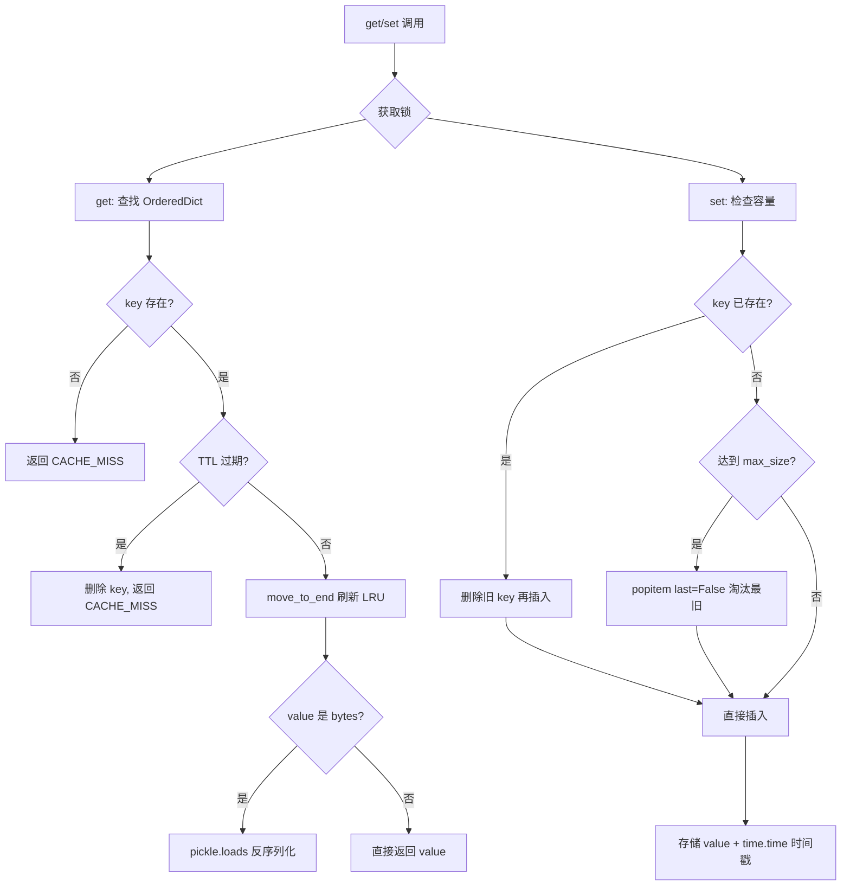
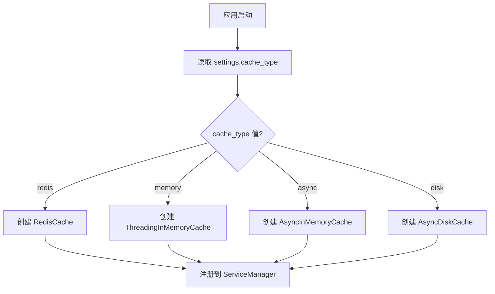
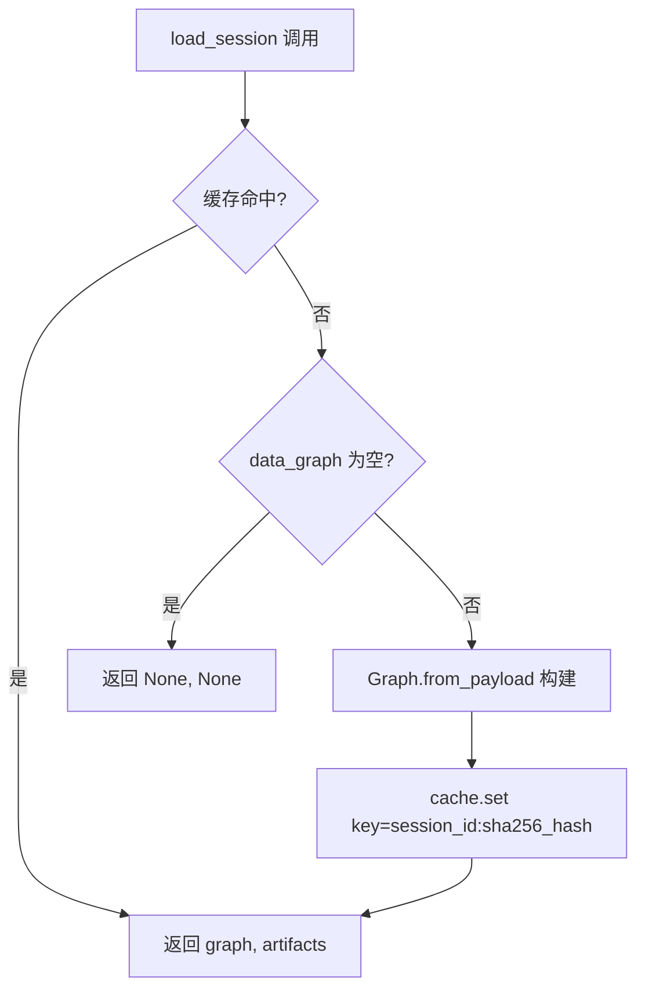

# PD-392.01 Langflow — 多层 OrderedDict LRU 缓存与工厂策略切换

> 文档编号：PD-392.01
> 来源：Langflow `services/cache/service.py` `services/session/service.py`
> GitHub：https://github.com/langflow-ai/langflow.git
> 问题域：PD-392 缓存策略 Caching Strategy
> 状态：可复用方案

---

## 第 1 章 问题与动机

### 1.1 核心问题

Langflow 是一个可视化 LLM 应用构建平台，用户通过拖拽组件构建 Flow（工作流图）。每次执行 Flow 时需要：

1. **Graph 实例复用** — 同一 Flow 的 Graph 对象构建成本高（解析 JSON → 实例化组件 → 连接边），重复构建浪费资源
2. **跨组件数据共享** — Flow 中多个组件可能需要共享中间计算结果，避免重复计算
3. **LLM 响应缓存** — 相同 prompt 的 LLM 调用结果可缓存，降低 API 成本和延迟
4. **多部署环境适配** — 单机开发用内存缓存，生产环境可能需要 Redis 或磁盘缓存

核心矛盾：缓存层需要同时满足**低延迟**（内存）、**持久性**（磁盘/Redis）、**线程安全**（多用户并发）三个维度，且不同部署场景的最优解不同。

### 1.2 Langflow 的解法概述

Langflow 构建了一个四层缓存体系，通过工厂模式实现后端可切换：

1. **抽象基类层** — `CacheService`（同步）和 `AsyncBaseCacheService`（异步）定义统一接口（`services/cache/base.py:12`）
2. **内存 LRU 缓存** — `ThreadingInMemoryCache` 基于 `OrderedDict` 实现 LRU 淘汰 + TTL 过期（`services/cache/service.py:22`）
3. **Session 级缓存** — `SessionService` 包装 CacheService，以 `session_id + graph_hash` 为 key 缓存 Graph 实例（`services/session/service.py:14`）
4. **共享组件缓存** — `SharedComponentCacheService` 继承 ThreadingInMemoryCache，跨组件共享数据（`services/shared_component_cache/service.py:4`）
5. **LLM 响应缓存** — 通过 `setup_llm_caching()` 委托 LangChain 的 `set_llm_cache` 机制（`lfx/interface/utils.py:86`）

### 1.3 设计思想

| 设计原则 | 具体实现 | 理由 | 替代方案 |
|----------|----------|------|----------|
| 接口与实现分离 | `CacheService` 抽象基类 + 4 种实现 | 部署环境不同，缓存后端需可切换 | 硬编码单一缓存实现 |
| LRU + TTL 双淘汰 | `OrderedDict.move_to_end()` + `time.time()` 时间戳 | 兼顾热点数据保留和过期数据清理 | 仅 LRU 或仅 TTL |
| 哨兵对象模式 | `CacheMiss` 单例替代 `None` 返回值 | `None` 可能是合法缓存值，需要区分"未命中"和"值为 None" | 返回 `(found, value)` 元组 |
| 工厂模式切换后端 | `CacheServiceFactory.create()` 根据配置选择实现 | 运行时一次性决策，避免 if-else 散落各处 | 依赖注入容器 |
| 锁可注入 | `get(key, lock=None)` 允许外部传入锁 | 调用方可能已持有更粗粒度的锁，避免死锁 | 内部锁不可覆盖 |

---

## 第 2 章 源码实现分析

### 2.1 架构概览

Langflow 的缓存体系由服务注册表（`ServiceType` 枚举）统一管理，通过工厂模式在启动时创建：

```
┌─────────────────────────────────────────────────────────────────┐
│                     ServiceManager                               │
│  ┌──────────────┐  ┌──────────────────────┐  ┌───────────────┐  │
│  │ CACHE_SERVICE│  │SHARED_COMPONENT_CACHE│  │SESSION_SERVICE│  │
│  │  (工厂创建)   │  │  (继承 InMemory)      │  │ (包装 Cache)  │  │
│  └──────┬───────┘  └──────────┬───────────┘  └───────┬───────┘  │
│         │                     │                      │          │
│  ┌──────▼───────────────────────────────────────────▼───────┐  │
│  │              CacheService (抽象基类)                        │  │
│  │  get() / set() / upsert() / delete() / clear()            │  │
│  └──────┬──────────┬──────────┬──────────┬──────────────────┘  │
│         │          │          │          │                      │
│  ┌──────▼──┐ ┌─────▼────┐ ┌──▼─────┐ ┌──▼──────┐              │
│  │InMemory │ │AsyncMem  │ │ Redis  │ │DiskCache│              │
│  │(Thread) │ │(asyncio) │ │(async) │ │(diskcache)│            │
│  └─────────┘ └──────────┘ └────────┘ └─────────┘              │
└─────────────────────────────────────────────────────────────────┘
         ↑                                    ↑
         │                                    │
  CacheServiceFactory                  setup_llm_caching()
  (配置驱动选择)                        (LangChain 全局缓存)
```

关键服务注册在 `services/schema.py:4-23`，包含 `CACHE_SERVICE`、`SHARED_COMPONENT_CACHE_SERVICE`、`SESSION_SERVICE` 三个缓存相关服务类型。

### 2.2 核心实现

#### 2.2.1 ThreadingInMemoryCache — LRU + TTL 双淘汰



对应源码 `services/cache/service.py:22-98`：

```python
class ThreadingInMemoryCache(CacheService, Generic[LockType]):
    def __init__(self, max_size=None, expiration_time=60 * 60) -> None:
        self._cache: OrderedDict = OrderedDict()
        self._lock = threading.RLock()
        self.max_size = max_size
        self.expiration_time = expiration_time

    def _get_without_lock(self, key):
        if item := self._cache.get(key):
            if self.expiration_time is None or time.time() - item["time"] < self.expiration_time:
                self._cache.move_to_end(key)
                return pickle.loads(item["value"]) if isinstance(item["value"], bytes) else item["value"]
            self.delete(key)
        return CACHE_MISS

    def set(self, key, value, lock=None) -> None:
        with lock or self._lock:
            if key in self._cache:
                self.delete(key)
            elif self.max_size and len(self._cache) >= self.max_size:
                self._cache.popitem(last=False)  # LRU 淘汰最旧
            self._cache[key] = {"value": value, "time": time.time()}
```

关键设计点：
- **RLock 而非 Lock** — 使用 `threading.RLock()`（`service.py:54`），允许同一线程重入，`upsert()` 内部调用 `get()` + `set()` 不会死锁
- **惰性过期** — 不启动后台清理线程，仅在 `get()` 时检查 TTL，过期则删除（`service.py:74-79`）
- **锁可注入** — 每个方法接受可选 `lock` 参数（`service.py:58`），调用方可传入外部锁实现更粗粒度的同步

#### 2.2.2 CacheServiceFactory — 配置驱动后端切换



对应源码 `services/cache/factory.py:16-44`：

```python
class CacheServiceFactory(ServiceFactory):
    def __init__(self) -> None:
        super().__init__(CacheService)

    @override
    def create(self, settings_service: SettingsService):
        if settings_service.settings.cache_type == "redis":
            return RedisCache(
                host=settings_service.settings.redis_host,
                port=settings_service.settings.redis_port,
                db=settings_service.settings.redis_db,
                url=settings_service.settings.redis_url,
                expiration_time=settings_service.settings.redis_cache_expire,
            )
        if settings_service.settings.cache_type == "memory":
            return ThreadingInMemoryCache(expiration_time=settings_service.settings.cache_expire)
        if settings_service.settings.cache_type == "async":
            return AsyncInMemoryCache(expiration_time=settings_service.settings.cache_expire)
        if settings_service.settings.cache_type == "disk":
            return AsyncDiskCache(
                cache_dir=settings_service.settings.config_dir,
                expiration_time=settings_service.settings.cache_expire,
            )
        return None
```

#### 2.2.3 SessionService — Graph 实例缓存与 Hash Key 生成



对应源码 `services/session/service.py:14-53`：

```python
class SessionService(Service):
    name = "session_service"

    def __init__(self, cache_service) -> None:
        self.cache_service: CacheService | AsyncBaseCacheService = cache_service

    async def load_session(self, key, flow_id: str, data_graph: dict | None = None):
        if isinstance(self.cache_service, AsyncBaseCacheService):
            value = await self.cache_service.get(key)
        else:
            value = await asyncio.to_thread(self.cache_service.get, key)
        if not isinstance(value, CacheMiss):
            return value
        # ... 构建 Graph 并缓存
        graph = Graph.from_payload(data_graph, flow_id=flow_id)
        artifacts: dict = {}
        await self.cache_service.set(key, (graph, artifacts))
        return graph, artifacts
```

Session key 生成策略（`services/session/utils.py:9-18`）：先用 `filter_json()` 过滤掉 viewport/position 等 UI 状态字段，再对清洗后的 JSON 做 SHA-256 哈希，拼接 `session_id:hash` 作为缓存 key。这确保了同一 Flow 结构的不同 UI 布局不会产生不同的缓存 key。

### 2.3 实现细节

**CacheMiss 哨兵对象**（`lfx/services/cache/utils.py:21-26`）：

```python
class CacheMiss:
    def __repr__(self) -> str:
        return "<CACHE_MISS>"
    def __bool__(self) -> bool:
        return False

CACHE_MISS = CacheMiss()
```

`__bool__` 返回 `False` 使得 `if not value` 可以同时处理 `None` 和 `CACHE_MISS`，但精确判断用 `isinstance(value, CacheMiss)` 或 `value is not CACHE_MISS`。

**RedisCache 的 dill 序列化**（`services/cache/service.py:243-252`）：Redis 实现使用 `dill.dumps(value, recurse=True)` 而非标准 `pickle`，因为 dill 能序列化 lambda、闭包等 pickle 无法处理的对象。`setex` 原子性地设置值和 TTL。

**AsyncDiskCache 的 diskcache 集成**（`services/cache/disk.py:13-96`）：使用 `diskcache.Cache` 库实现磁盘持久化，通过 `asyncio.to_thread()` 将同步磁盘 I/O 包装为异步操作。启动时清空缓存（`disk.py:20-21`），保持与内存缓存一致的行为语义。

**LLM 响应缓存**（`lfx/interface/utils.py:86-111`）：通过环境变量 `LANGFLOW_LANGCHAIN_CACHE` 指定 LangChain 缓存类名（如 `InMemoryCache`、`SQLiteCache`），动态导入并调用 `set_llm_cache()` 全局设置。这是一个独立于 Langflow 自身缓存体系的第四层缓存。

---

## 第 3 章 迁移指南

### 3.1 迁移清单

**阶段 1：核心缓存层（必须）**

- [ ] 实现 `CacheMiss` 哨兵类（区分"未命中"和"值为 None"）
- [ ] 实现 `CacheService` 抽象基类（定义 get/set/upsert/delete/clear/contains 接口）
- [ ] 实现 `ThreadingInMemoryCache`（OrderedDict + RLock + TTL）
- [ ] 注册为全局服务（依赖注入或服务定位器）

**阶段 2：Session 缓存层（推荐）**

- [ ] 实现 `SessionService`，包装 CacheService
- [ ] 实现 key 生成策略：`session_id:content_hash`
- [ ] 实现 JSON 过滤（去除 UI 状态字段后再 hash）

**阶段 3：后端可切换（按需）**

- [ ] 实现 `CacheServiceFactory`，根据配置创建不同后端
- [ ] 添加 Redis 后端（dill 序列化 + setex 原子 TTL）
- [ ] 添加磁盘后端（diskcache + asyncio.to_thread 包装）

**阶段 4：LLM 缓存（可选）**

- [ ] 集成 LangChain `set_llm_cache()` 或自定义 LLM 响应缓存

### 3.2 适配代码模板

以下是一个可直接复用的多后端缓存系统实现：

```python
"""可复用的多后端 LRU 缓存系统，移植自 Langflow 设计"""
import abc
import pickle
import threading
import time
from collections import OrderedDict
from typing import Any, Generic, TypeVar

T = TypeVar("T")


class CacheMiss:
    """哨兵对象，区分缓存未命中和值为 None 的情况"""
    _instance = None

    def __new__(cls):
        if cls._instance is None:
            cls._instance = super().__new__(cls)
        return cls._instance

    def __repr__(self) -> str:
        return "<CACHE_MISS>"

    def __bool__(self) -> bool:
        return False


CACHE_MISS = CacheMiss()


class BaseCacheService(abc.ABC):
    """缓存服务抽象基类"""

    @abc.abstractmethod
    def get(self, key: str) -> Any: ...

    @abc.abstractmethod
    def set(self, key: str, value: Any) -> None: ...

    @abc.abstractmethod
    def delete(self, key: str) -> None: ...

    @abc.abstractmethod
    def clear(self) -> None: ...


class InMemoryLRUCache(BaseCacheService):
    """基于 OrderedDict 的线程安全 LRU 缓存，支持 TTL 过期"""

    def __init__(self, max_size: int = 256, ttl_seconds: int = 3600) -> None:
        self._cache: OrderedDict = OrderedDict()
        self._lock = threading.RLock()
        self.max_size = max_size
        self.ttl_seconds = ttl_seconds

    def get(self, key: str) -> Any:
        with self._lock:
            if item := self._cache.get(key):
                if self.ttl_seconds is None or time.time() - item["ts"] < self.ttl_seconds:
                    self._cache.move_to_end(key)
                    return item["value"]
                del self._cache[key]
            return CACHE_MISS

    def set(self, key: str, value: Any) -> None:
        with self._lock:
            if key in self._cache:
                del self._cache[key]
            elif self.max_size and len(self._cache) >= self.max_size:
                self._cache.popitem(last=False)
            self._cache[key] = {"value": value, "ts": time.time()}

    def upsert(self, key: str, value: Any) -> None:
        """字典值合并更新，非字典值直接覆盖"""
        with self._lock:
            existing = self.get(key)
            if existing is not CACHE_MISS and isinstance(existing, dict) and isinstance(value, dict):
                existing.update(value)
                value = existing
            self.set(key, value)

    def delete(self, key: str) -> None:
        with self._lock:
            self._cache.pop(key, None)

    def clear(self) -> None:
        with self._lock:
            self._cache.clear()


class CacheFactory:
    """工厂模式：根据配置创建缓存后端"""

    @staticmethod
    def create(backend: str = "memory", **kwargs) -> BaseCacheService:
        if backend == "memory":
            return InMemoryLRUCache(
                max_size=kwargs.get("max_size", 256),
                ttl_seconds=kwargs.get("ttl_seconds", 3600),
            )
        # 扩展点：添加 redis / disk 后端
        raise ValueError(f"Unknown cache backend: {backend}")
```

### 3.3 适用场景

| 场景 | 适用度 | 说明 |
|------|--------|------|
| LLM 应用的 Session/Graph 缓存 | ⭐⭐⭐ | 核心场景，Graph 构建成本高，缓存收益大 |
| 多组件共享中间结果 | ⭐⭐⭐ | SharedComponentCache 直接继承即可 |
| 单机开发/测试环境 | ⭐⭐⭐ | InMemoryCache 零依赖，开箱即用 |
| 生产环境多实例部署 | ⭐⭐ | 需切换 Redis 后端，Langflow 的 Redis 实现标记为实验性 |
| 高并发写入场景 | ⭐⭐ | RLock 粒度为整个缓存，高并发下可能成为瓶颈 |
| 需要缓存预热/持久化恢复 | ⭐ | DiskCache 启动时清空，不支持跨重启恢复 |

---

## 第 4 章 测试用例

```python
"""基于 Langflow 缓存系统真实接口的测试用例"""
import threading
import time
import pytest


class TestThreadingInMemoryCache:
    """测试 ThreadingInMemoryCache 核心行为"""

    def test_basic_get_set(self):
        """正常路径：set 后 get 返回正确值"""
        from langflow.services.cache.service import ThreadingInMemoryCache
        cache = ThreadingInMemoryCache(max_size=10, expiration_time=60)
        cache.set("key1", {"data": "value1"})
        result = cache.get("key1")
        assert result == {"data": "value1"}

    def test_cache_miss_returns_sentinel(self):
        """未命中返回 CACHE_MISS 哨兵而非 None"""
        from langflow.services.cache.service import ThreadingInMemoryCache
        from lfx.services.cache.utils import CACHE_MISS, CacheMiss
        cache = ThreadingInMemoryCache()
        result = cache.get("nonexistent")
        assert isinstance(result, CacheMiss)
        assert result is CACHE_MISS
        assert not result  # __bool__ 返回 False

    def test_lru_eviction(self):
        """LRU 淘汰：超过 max_size 时淘汰最久未访问的 key"""
        from langflow.services.cache.service import ThreadingInMemoryCache
        from lfx.services.cache.utils import CACHE_MISS
        cache = ThreadingInMemoryCache(max_size=2, expiration_time=60)
        cache.set("a", 1)
        cache.set("b", 2)
        cache.get("a")  # 刷新 a 的访问时间
        cache.set("c", 3)  # 应淘汰 b（最久未访问）
        assert cache.get("a") == 1
        assert cache.get("b") is CACHE_MISS
        assert cache.get("c") == 3

    def test_ttl_expiration(self):
        """TTL 过期：超过 expiration_time 后返回 CACHE_MISS"""
        from langflow.services.cache.service import ThreadingInMemoryCache
        from lfx.services.cache.utils import CACHE_MISS
        cache = ThreadingInMemoryCache(expiration_time=1)
        cache.set("key", "value")
        assert cache.get("key") == "value"
        time.sleep(1.1)
        assert cache.get("key") is CACHE_MISS

    def test_upsert_merges_dicts(self):
        """upsert 对字典值做合并而非覆盖"""
        from langflow.services.cache.service import ThreadingInMemoryCache
        cache = ThreadingInMemoryCache()
        cache.set("key", {"a": 1, "b": 2})
        cache.upsert("key", {"b": 3, "c": 4})
        result = cache.get("key")
        assert result == {"a": 1, "b": 3, "c": 4}

    def test_thread_safety(self):
        """并发安全：多线程同时读写不会崩溃"""
        from langflow.services.cache.service import ThreadingInMemoryCache
        cache = ThreadingInMemoryCache(max_size=100, expiration_time=60)
        errors = []

        def writer(start):
            try:
                for i in range(100):
                    cache.set(f"key-{start + i}", i)
            except Exception as e:
                errors.append(e)

        def reader():
            try:
                for i in range(100):
                    cache.get(f"key-{i}")
            except Exception as e:
                errors.append(e)

        threads = [threading.Thread(target=writer, args=(i * 100,)) for i in range(5)]
        threads += [threading.Thread(target=reader) for _ in range(5)]
        for t in threads:
            t.start()
        for t in threads:
            t.join()
        assert len(errors) == 0


class TestSessionService:
    """测试 SessionService 的 key 生成和缓存委托"""

    def test_build_key_deterministic(self):
        """相同 graph 数据生成相同 key"""
        from langflow.services.session.service import SessionService
        graph_data = {"nodes": [{"id": "1", "type": "llm"}], "edges": []}
        key1 = SessionService.build_key("sess1", graph_data)
        key2 = SessionService.build_key("sess1", graph_data)
        assert key1 == key2
        assert key1.startswith("sess1:")

    def test_build_key_ignores_ui_state(self):
        """UI 状态字段（position/viewport）不影响 key"""
        from langflow.services.session.service import SessionService
        graph1 = {"nodes": [{"id": "1", "position": {"x": 0}}], "edges": []}
        graph2 = {"nodes": [{"id": "1", "position": {"x": 999}}], "edges": []}
        key1 = SessionService.build_key("s", graph1)
        key2 = SessionService.build_key("s", graph2)
        assert key1 == key2


class TestCacheServiceFactory:
    """测试工厂模式创建不同后端"""

    def test_factory_creates_memory_cache(self):
        """配置 memory 时创建 ThreadingInMemoryCache"""
        from langflow.services.cache.service import ThreadingInMemoryCache
        from langflow.services.cache.factory import CacheServiceFactory
        from unittest.mock import MagicMock
        factory = CacheServiceFactory()
        settings = MagicMock()
        settings.settings.cache_type = "memory"
        settings.settings.cache_expire = 300
        result = factory.create(settings)
        assert isinstance(result, ThreadingInMemoryCache)
        assert result.expiration_time == 300
```

---

## 第 5 章 跨域关联

| 关联域 | 关系类型 | 说明 |
|--------|----------|------|
| PD-01 上下文管理 | 协同 | Session 缓存复用 Graph 实例，减少重复构建带来的上下文开销 |
| PD-04 工具系统 | 协同 | SharedComponentCacheService 为工具组件提供跨调用数据共享 |
| PD-06 记忆持久化 | 互补 | 缓存是短期热数据（TTL 过期），记忆是长期持久化；DiskCache 介于两者之间 |
| PD-10 中间件管道 | 依赖 | SessionService 在请求处理管道中被调用，依赖缓存层提供 Graph 实例 |
| PD-11 可观测性 | 协同 | 缓存命中率是关键可观测指标，CacheMiss 哨兵便于统计 |

---

## 第 6 章 来源文件索引

| 文件 | 行范围 | 关键实现 |
|------|--------|----------|
| `src/backend/base/langflow/services/cache/base.py` | L1-L184 | CacheService / AsyncBaseCacheService / ExternalAsyncBaseCacheService 抽象基类 |
| `src/backend/base/langflow/services/cache/service.py` | L22-L98 | ThreadingInMemoryCache — OrderedDict LRU + TTL |
| `src/backend/base/langflow/services/cache/service.py` | L178-L292 | RedisCache — dill 序列化 + async StrictRedis |
| `src/backend/base/langflow/services/cache/service.py` | L294-L356 | AsyncInMemoryCache — asyncio.Lock 版本 |
| `src/backend/base/langflow/services/cache/disk.py` | L13-L96 | AsyncDiskCache — diskcache + asyncio.to_thread |
| `src/backend/base/langflow/services/cache/factory.py` | L16-L44 | CacheServiceFactory — 配置驱动后端选择 |
| `src/backend/base/langflow/services/cache/utils.py` | L14-L159 | CACHE 全局字典、文件缓存工具、filter_json |
| `src/lfx/src/lfx/services/cache/utils.py` | L21-L26 | CacheMiss 哨兵类定义 |
| `src/backend/base/langflow/services/session/service.py` | L14-L65 | SessionService — Graph 实例缓存与 hash key 生成 |
| `src/backend/base/langflow/services/session/utils.py` | L9-L18 | session_id_generator + compute_dict_hash |
| `src/backend/base/langflow/services/shared_component_cache/service.py` | L1-L8 | SharedComponentCacheService — 继承 ThreadingInMemoryCache |
| `src/lfx/src/lfx/interface/utils.py` | L86-L111 | setup_llm_caching + set_langchain_cache |
| `src/backend/base/langflow/services/schema.py` | L4-L24 | ServiceType 枚举（含 CACHE_SERVICE / SESSION_SERVICE） |

---

## 第 7 章 横向对比维度

```json comparison_data
{
  "project": "Langflow",
  "dimensions": {
    "缓存架构": "四层体系：InMemory/Redis/Disk/LLM，工厂模式配置切换",
    "淘汰策略": "OrderedDict LRU + TTL 惰性过期双淘汰",
    "并发模型": "threading.RLock 可重入锁，锁可注入覆盖",
    "序列化方式": "InMemory 用 pickle，Redis 用 dill（支持 lambda/闭包）",
    "缓存未命中处理": "CacheMiss 哨兵单例，__bool__=False 兼容 falsy 检查",
    "后端可切换": "CacheServiceFactory 根据 settings.cache_type 创建 4 种后端"
  }
}
```

### 域元数据补充

```json domain_metadata
{
  "solution_summary": "Langflow 用 OrderedDict LRU + TTL 双淘汰内存缓存为核心，通过 CacheServiceFactory 工厂模式支持 Memory/Redis/Disk/Async 四后端切换，SessionService 以 SHA-256 content hash 为 key 缓存 Graph 实例",
  "description": "工厂模式驱动的多后端缓存切换与哨兵对象未命中处理",
  "sub_problems": [
    "缓存后端运行时切换与工厂模式",
    "Graph 实例缓存的 content-hash key 生成",
    "同步/异步缓存接口统一抽象"
  ],
  "best_practices": [
    "CacheMiss 哨兵对象区分未命中与 None 值",
    "RLock 可重入锁 + 锁可注入避免死锁",
    "JSON 过滤 UI 状态字段后再 hash 保证缓存稳定性"
  ]
}
```
