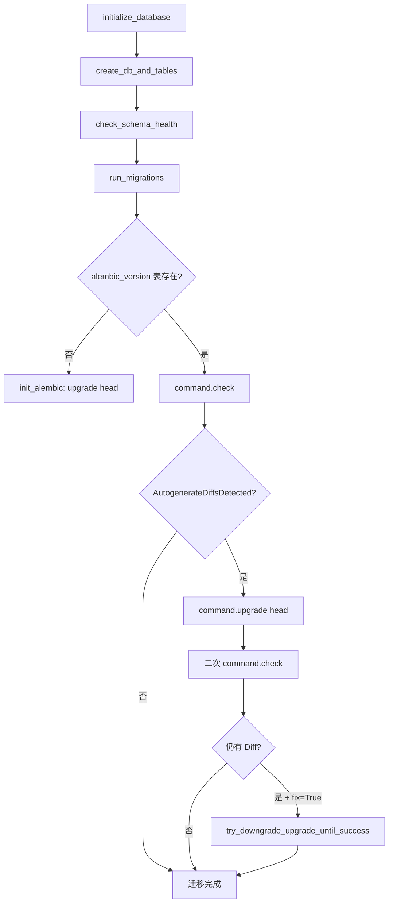
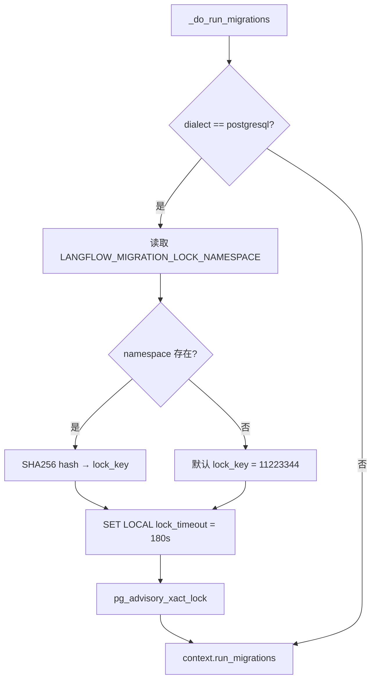

# PD-393.01 Langflow — Alembic 三阶段 Expand-Contract 数据库迁移体系

> 文档编号：PD-393.01
> 来源：Langflow `src/backend/base/langflow/services/database/service.py`
> GitHub：https://github.com/langflow-ai/langflow.git
> 问题域：PD-393 数据库迁移 Database Migration
> 状态：可复用方案

---

## 第 1 章 问题与动机（≥ 30 行）

### 1.1 核心问题

在多服务共享数据库的架构中，数据库 Schema 变更是高风险操作。Langflow 作为一个持续迭代的 LLM 工作流平台，面临以下挑战：

1. **57 个迁移版本的线性链管理** — 从 2023 年至今积累了 57 个 Alembic 迁移文件，需要保证任意版本间的升降级路径畅通
2. **SQLite + PostgreSQL 双引擎兼容** — 开发环境用 SQLite，生产环境用 PostgreSQL，同一迁移脚本必须适配两种 DDL 语法差异（如 SQLite 不支持 `ALTER TABLE DROP COLUMN`）
3. **零停机部署** — 多个服务版本可能同时运行，Schema 变更不能破坏旧版本服务
4. **数据迁移安全** — 涉及加密字段迁移（如 MCP auth_settings 加密）、类型变更（如 TIMESTAMP → DateTime(timezone=True)）等需要数据转换的场景
5. **并发迁移冲突** — 多实例同时启动时可能并发执行迁移，需要分布式锁保护

### 1.2 Langflow 的解法概述

Langflow 构建了一套完整的数据库迁移体系，核心要点：

1. **Expand-Contract 三阶段模式** — 所有 Schema 变更分为 EXPAND（添加）→ MIGRATE（数据迁移）→ CONTRACT（清理）三个阶段，确保 N-1 版本兼容（`alembic/DB-MIGRATION-GUIDE.MD:32-60`）
2. **AST 级迁移验证器** — `migration_validator.py` 用 Python AST 解析迁移文件，静态检查 11 类违规模式（如非空列缺默认值、CONTRACT 阶段添加列等）（`alembic/migration_validator.py:28-44`）
3. **双引擎方言分支** — 每个迁移脚本内部通过 `conn.dialect.name` 分支处理 SQLite 和 PostgreSQL 的 DDL 差异（`versions/d37bc4322900:39-138`）
4. **PostgreSQL Advisory Lock** — 在线迁移时使用 `pg_advisory_xact_lock` 防止并发迁移冲突，支持自定义 namespace（`alembic/env.py:106-118`）
5. **幂等性保障** — 所有迁移操作前通过 `inspector.get_columns()` / `inspector.get_table_names()` 检查存在性，确保重复执行安全（`versions/182e5471b900:22-29`）

### 1.3 设计思想

| 设计原则 | 具体实现 | 理由 | 替代方案 |
|----------|----------|------|----------|
| N-1 版本兼容 | Expand-Contract 三阶段分离 | 多服务共享 DB 时旧版本不能崩溃 | 停机迁移（不可接受） |
| 幂等迁移 | 每个 op 前 inspector 检查存在性 | 迁移可能被重复执行（崩溃恢复） | 依赖 Alembic 版本号（不够安全） |
| 静态验证 | AST 解析 + 11 类违规检测 | 在 CI 阶段拦截危险迁移 | 人工 Code Review（易遗漏） |
| 双引擎适配 | dialect.name 分支 + batch_alter_table | SQLite 不支持部分 ALTER 操作 | 只支持 PostgreSQL（限制开发体验） |
| 并发安全 | pg_advisory_xact_lock + 可配置 namespace | 多 Pod 同时启动时防止迁移冲突 | 外部分布式锁（增加依赖） |

---

## 第 2 章 源码实现分析（≥ 60 行，核心章节）

### 2.1 架构概览

Langflow 的数据库迁移体系由四个核心组件构成：

```
┌─────────────────────────────────────────────────────────────────┐
│                    DatabaseService (service.py)                  │
│  ┌──────────────┐  ┌──────────────┐  ┌───────────────────────┐  │
│  │ _create_engine│  │run_migrations│  │check_schema_health    │  │
│  │ (AsyncEngine) │  │ (Alembic CLI)│  │(inspector 逐表校验)   │  │
│  └──────┬───────┘  └──────┬───────┘  └───────────────────────┘  │
│         │                 │                                      │
│         ▼                 ▼                                      │
│  ┌──────────────┐  ┌──────────────┐                             │
│  │ SQLite+aio   │  │ env.py       │                             │
│  │ PostgreSQL+  │  │ (online/     │                             │
│  │ psycopg      │  │  offline)    │                             │
│  └──────────────┘  └──────┬───────┘                             │
│                           │                                      │
│                    ┌──────▼───────┐                              │
│                    │ 57 versions/ │                              │
│                    │ (线性迁移链) │                              │
│                    └──────────────┘                              │
├─────────────────────────────────────────────────────────────────┤
│  migration_validator.py (AST 静态分析)                          │
│  DB-MIGRATION-GUIDE.MD (Expand-Contract 规范文档)               │
└─────────────────────────────────────────────────────────────────┘
```

### 2.2 核心实现

#### 2.2.1 迁移执行入口：双阶段检测 + 自动修复



对应源码 `service.py:350-398`：

```python
def _run_migrations(self, should_initialize_alembic, fix) -> None:
    buffer_context = (
        nullcontext(sys.stdout) if self.alembic_log_to_stdout
        else self.alembic_log_path.open("w", encoding="utf-8")
    )
    with buffer_context as buffer:
        alembic_cfg = Config(stdout=buffer)
        alembic_cfg.set_main_option("script_location", str(self.script_location))
        alembic_cfg.set_main_option("sqlalchemy.url", self.database_url.replace("%", "%%"))

        if should_initialize_alembic:
            try:
                self.init_alembic(alembic_cfg)
            except Exception as exc:
                msg = f"Error initializing alembic: {exc}"
                logger.exception(msg)
                raise RuntimeError(msg) from exc

        try:
            command.check(alembic_cfg)
        except Exception as exc:
            if isinstance(exc, util.exc.CommandError | util.exc.AutogenerateDiffsDetected):
                command.upgrade(alembic_cfg, "head")
                time.sleep(3)

        # 二次检查确认迁移成功
        try:
            command.check(alembic_cfg)
        except util.exc.AutogenerateDiffsDetected as exc:
            if not fix:
                raise RuntimeError(f"Mismatch between models and database.\n{exc}")

        if fix:
            self.try_downgrade_upgrade_until_success(alembic_cfg)
```

#### 2.2.2 PostgreSQL Advisory Lock 并发保护



对应源码 `alembic/env.py:93-118`：

```python
def _do_run_migrations(connection):
    configure_kwargs = {
        "connection": connection,
        "target_metadata": target_metadata,
        "render_as_batch": True,  # SQLite 兼容关键配置
    }
    if connection.dialect.name == "postgresql":
        configure_kwargs["prepare_threshold"] = None  # PgBouncer 兼容

    context.configure(**configure_kwargs)
    with context.begin_transaction():
        if connection.dialect.name == "postgresql":
            namespace = os.getenv("LANGFLOW_MIGRATION_LOCK_NAMESPACE")
            if namespace:
                lock_key = int(hashlib.sha256(namespace.encode()).hexdigest()[:16], 16) % (2**63 - 1)
            else:
                lock_key = 11223344
            connection.execute(text("SET LOCAL lock_timeout = '180s';"))
            connection.execute(text(f"SELECT pg_advisory_xact_lock({lock_key});"))
        context.run_migrations()
```

### 2.3 实现细节

#### 2.3.1 MigrationValidator — AST 级静态分析

`migration_validator.py:28-44` 定义了 11 类违规检测规则：

| 违规类型 | 说明 | 严重度 |
|----------|------|--------|
| BREAKING_ADD_COLUMN | 添加非空列缺默认值 | error |
| DIRECT_RENAME | 直接重命名列/表 | error |
| DIRECT_TYPE_CHANGE | 直接修改列类型 | error |
| IMMEDIATE_DROP | 非 CONTRACT 阶段删列 | error |
| MISSING_IDEMPOTENCY | 缺少幂等检查 | error |
| NO_PHASE_MARKER | 缺少阶段标记文档 | error |
| UNSAFE_ROLLBACK | 降级可能丢数据 | warning |
| MISSING_DOWNGRADE | 缺少 downgrade 函数 | error |
| INVALID_PHASE_OPERATION | 阶段不允许的操作 | error |
| NO_EXISTENCE_CHECK | 缺少存在性检查 | error |
| MISSING_DATA_CHECK | CONTRACT 阶段缺数据验证 | warning |

验证器通过 `ast.walk` 遍历 AST 节点，检测 `op.add_column`、`op.drop_column`、`op.alter_column` 等调用的参数合规性（`migration_validator.py:114-195`）。

#### 2.3.2 双引擎方言分支 — SQLite 表重建模式

SQLite 不支持 `ALTER TABLE DROP COLUMN`（旧版本）和部分约束操作。Langflow 的解法是"表重建"：创建新表 → 复制数据 → 删旧表 → 重命名。

`versions/d37bc4322900:39-82` 展示了完整的 SQLite 表重建流程，包含列验证防护：

```python
# Guard against schema drift
res = conn.execute(sa.text('PRAGMA table_info("file")'))
cols = [row[1] for row in res]
expected = ['id', 'user_id', 'name', 'path', 'size', 'provider', 'created_at', 'updated_at']
if set(cols) != set(expected):
    raise RuntimeError(f"Unexpected columns: {cols}. Aborting to avoid data loss.")
```

#### 2.3.3 Schema 健康检查

`service.py:305-337` 的 `_check_schema_health` 方法在迁移前验证所有 SQLModel 模型与数据库表的列映射一致性，同时检测遗留表（如 `flowstyle`）的存在。

#### 2.3.4 错误版本自愈

`utils.py:40-54` 处理了 Alembic 版本表损坏的场景：当检测到 `overlaps with other requested revisions` 或 `Can't locate revision` 错误时，自动 DROP `alembic_version` 表并重新执行迁移。


---

## 第 3 章 迁移指南（≥ 40 行）

### 3.1 迁移清单

**阶段 1：基础设施搭建**

- [ ] 安装依赖：`alembic`, `sqlalchemy[asyncio]`, `sqlmodel`, `aiosqlite`（SQLite）, `psycopg[binary]`（PostgreSQL）
- [ ] 创建 Alembic 目录结构：`alembic/`, `alembic/versions/`, `alembic.ini`
- [ ] 配置 `env.py`：设置 `render_as_batch=True`（SQLite 兼容）、`target_metadata = SQLModel.metadata`
- [ ] 定义命名约定（`NAMING_CONVENTION`）确保约束名跨引擎一致

**阶段 2：迁移服务集成**

- [ ] 实现 `DatabaseService` 类，封装引擎创建、迁移执行、Schema 健康检查
- [ ] 实现 `_sanitize_database_url()` 自动适配异步驱动（`sqlite` → `sqlite+aiosqlite`，`postgresql` → `postgresql+psycopg`）
- [ ] 实现 `run_migrations()` 双阶段检测逻辑（check → upgrade → re-check）
- [ ] 添加 `try_downgrade_upgrade_until_success()` 自动修复机制

**阶段 3：安全保障**

- [ ] 移植 `MigrationValidator`，集成到 CI/CD pre-commit hook
- [ ] 为 PostgreSQL 添加 Advisory Lock 并发保护
- [ ] 实现 SQLite `BEGIN EXCLUSIVE` + `busy_timeout` 串行化保护
- [ ] 添加 Schema 健康检查（模型 ↔ 数据库列映射验证）

### 3.2 适配代码模板

以下是可直接复用的 DatabaseService 迁移核心逻辑：

```python
import asyncio
from pathlib import Path
from contextlib import nullcontext
from alembic import command, util
from alembic.config import Config
from sqlalchemy.ext.asyncio import AsyncEngine, create_async_engine

class MigrationService:
    """可复用的 Alembic 迁移服务封装。"""

    def __init__(self, database_url: str, script_location: Path):
        self.database_url = self._sanitize_url(database_url)
        self.script_location = script_location
        self.engine: AsyncEngine = create_async_engine(self.database_url)

    @staticmethod
    def _sanitize_url(url: str) -> str:
        """自动适配异步驱动。"""
        driver, rest = url.split("://", maxsplit=1)
        driver_map = {
            "sqlite": "sqlite+aiosqlite",
            "postgresql": "postgresql+psycopg",
            "postgres": "postgresql+psycopg",
        }
        return f"{driver_map.get(driver, driver)}://{rest}"

    def _build_alembic_config(self) -> Config:
        cfg = Config()
        cfg.set_main_option("script_location", str(self.script_location))
        cfg.set_main_option("sqlalchemy.url", self.database_url.replace("%", "%%"))
        return cfg

    async def run_migrations(self, *, fix: bool = False) -> None:
        """执行迁移：检测 → 升级 → 二次验证。"""
        should_init = await self._check_needs_init()
        await asyncio.to_thread(self._run_migrations_sync, should_init, fix)

    async def _check_needs_init(self) -> bool:
        from sqlmodel import text
        async with self.engine.connect() as conn:
            try:
                await conn.execute(text("SELECT * FROM alembic_version"))
                return False
            except Exception:
                return True

    def _run_migrations_sync(self, should_init: bool, fix: bool) -> None:
        cfg = self._build_alembic_config()
        if should_init:
            command.ensure_version(cfg)
            command.upgrade(cfg, "head")
            return

        try:
            command.check(cfg)
        except (util.exc.CommandError, util.exc.AutogenerateDiffsDetected):
            command.upgrade(cfg, "head")

        try:
            command.check(cfg)
        except util.exc.AutogenerateDiffsDetected as exc:
            if not fix:
                raise RuntimeError(f"Schema mismatch: {exc}") from exc

        if fix:
            self._downgrade_upgrade_retry(cfg, retries=5)

    @staticmethod
    def _downgrade_upgrade_retry(cfg: Config, retries: int = 5) -> None:
        import time
        for i in range(1, retries + 1):
            try:
                command.check(cfg)
                break
            except util.exc.AutogenerateDiffsDetected:
                command.downgrade(cfg, f"-{i}")
                time.sleep(3)
                command.upgrade(cfg, "head")
```

### 3.3 适用场景

| 场景 | 适用度 | 说明 |
|------|--------|------|
| 多服务共享数据库 | ⭐⭐⭐ | Expand-Contract 模式的核心价值场景 |
| SQLite + PostgreSQL 双引擎 | ⭐⭐⭐ | batch_alter_table + 方言分支完美适配 |
| 单数据库单服务 | ⭐⭐ | 体系偏重，但 validator 和幂等性仍有价值 |
| NoSQL 数据库 | ⭐ | 不适用，Alembic 仅支持关系型数据库 |
| 高频 Schema 变更（日级） | ⭐⭐⭐ | 57 个版本的实战验证了长链管理能力 |

---

## 第 4 章 测试用例（≥ 20 行）

```python
import ast
import pytest
from pathlib import Path
from unittest.mock import AsyncMock, MagicMock, patch

class TestMigrationValidator:
    """测试 MigrationValidator 的 11 类违规检测。"""

    def setup_method(self):
        from langflow.alembic.migration_validator import MigrationValidator
        self.validator = MigrationValidator(strict_mode=True)

    def test_detect_breaking_add_column(self, tmp_path):
        """非空列缺默认值应报 BREAKING_ADD_COLUMN。"""
        migration = tmp_path / "test.py"
        migration.write_text('''
"""Phase: EXPAND"""
revision = "abc123"
down_revision = None
from alembic import op
import sqlalchemy as sa
def upgrade():
    op.add_column("user", sa.Column("email", sa.String(), nullable=False))
def downgrade():
    op.drop_column("user", "email")
''')
        result = self.validator.validate_migration_file(migration)
        violations = [v["type"] for v in result["violations"]]
        assert "BREAKING_ADD_COLUMN" in violations

    def test_detect_direct_rename(self, tmp_path):
        """直接重命名应报 DIRECT_RENAME。"""
        migration = tmp_path / "test.py"
        migration.write_text('''
"""Phase: EXPAND"""
revision = "abc123"
down_revision = None
from alembic import op
def upgrade():
    op.rename_column("user", "name", "full_name")
def downgrade():
    op.rename_column("user", "full_name", "name")
''')
        result = self.validator.validate_migration_file(migration)
        violations = [v["type"] for v in result["violations"]]
        assert "DIRECT_RENAME" in violations

    def test_detect_drop_in_non_contract_phase(self, tmp_path):
        """非 CONTRACT 阶段删列应报 IMMEDIATE_DROP。"""
        migration = tmp_path / "test.py"
        migration.write_text('''
"""Phase: EXPAND"""
revision = "abc123"
down_revision = None
from alembic import op
def upgrade():
    op.drop_column("user", "legacy_field")
def downgrade():
    pass
''')
        result = self.validator.validate_migration_file(migration)
        violations = [v["type"] for v in result["violations"]]
        assert "IMMEDIATE_DROP" in violations

    def test_valid_expand_migration(self, tmp_path):
        """合规的 EXPAND 迁移应通过验证。"""
        migration = tmp_path / "test.py"
        migration.write_text('''
"""Phase: EXPAND"""
revision = "abc123"
down_revision = None
from alembic import op
import sqlalchemy as sa
def upgrade():
    bind = op.get_bind()
    inspector = sa.inspect(bind)
    columns = [col["name"] for col in inspector.get_columns("user")]
    if "context_id" not in columns:
        op.add_column("user", sa.Column("context_id", sa.String(), nullable=True))
def downgrade():
    op.drop_column("user", "context_id")
''')
        result = self.validator.validate_migration_file(migration)
        assert result["valid"] is True


class TestDatabaseServiceMigration:
    """测试 DatabaseService 的迁移执行逻辑。"""

    @pytest.mark.asyncio
    async def test_schema_health_check_detects_missing_column(self):
        """Schema 健康检查应检测缺失列。"""
        mock_inspector = MagicMock()
        mock_inspector.get_columns.return_value = [{"name": "id"}]  # 缺少其他列
        mock_inspector.get_table_names.return_value = ["flow", "user", "apikey", "job"]

        with patch("sqlalchemy.inspect", return_value=mock_inspector):
            from langflow.services.database.service import DatabaseService
            result = DatabaseService._check_schema_health(MagicMock())
            assert result is False

    @pytest.mark.asyncio
    async def test_alembic_version_table_corruption_recovery(self):
        """alembic_version 表损坏时应自动恢复。"""
        from langflow.services.database.utils import initialize_database
        # 模拟 CommandError: overlaps with other requested revisions
        with patch("langflow.services.deps.get_db_service") as mock_db:
            mock_service = MagicMock()
            mock_service.settings_service.settings.database_connection_retry = False
            mock_service.create_db_and_tables = AsyncMock()
            mock_service.check_schema_health = AsyncMock()
            mock_service.run_migrations = AsyncMock(
                side_effect=[Exception("overlaps with other requested revisions"), None]
            )
            mock_db.return_value = mock_service
            # 验证会尝试 DROP alembic_version 并重试
```


---

## 第 5 章 跨域关联

| 关联域 | 关系类型 | 说明 |
|--------|----------|------|
| PD-03 容错与重试 | 协同 | `try_downgrade_upgrade_until_success` 实现了迁移级别的重试降级策略；`_create_engine_with_retry` 用 tenacity 实现连接重试 |
| PD-05 沙箱隔离 | 协同 | `NoopSession` 提供了数据库层面的 Noop 隔离模式，用于测试和无数据库场景 |
| PD-07 质量检查 | 依赖 | `MigrationValidator` 是迁移专用的质量门控，AST 静态分析 11 类违规模式 |
| PD-10 中间件管道 | 协同 | SQLite PRAGMA 设置通过 `event.listen(Engine, "connect")` 事件钩子注入，类似中间件模式 |
| PD-11 可观测性 | 协同 | 迁移日志支持 stdout 和文件两种输出模式，`alembic_log_file` 可配置 |

---

## 第 6 章 来源文件索引

| 文件 | 行范围 | 关键实现 |
|------|--------|----------|
| `src/backend/base/langflow/services/database/service.py` | L42-530 | DatabaseService 核心类：引擎创建、迁移执行、Schema 健康检查 |
| `src/backend/base/langflow/services/database/utils.py` | L16-62 | initialize_database 入口：三阶段初始化 + 版本表损坏自愈 |
| `src/backend/base/langflow/services/database/session.py` | L1-66 | NoopSession：无数据库模式的完整 Session 模拟 |
| `src/backend/base/langflow/alembic/env.py` | L1-162 | Alembic 环境配置：双模式运行 + Advisory Lock + SQLite 串行化 |
| `src/backend/base/langflow/alembic/migration_validator.py` | L1-378 | 迁移验证器：AST 解析 + 11 类违规检测 + CLI 入口 |
| `src/backend/base/langflow/alembic/DB-MIGRATION-GUIDE.MD` | L1-514 | Expand-Contract 模式完整规范文档 |
| `src/backend/base/langflow/alembic/script.py.mako` | L1-32 | 迁移文件模板：预置 inspector + migration utils 导入 |
| `src/backend/base/langflow/alembic/versions/182e5471b900_add_context_message.py` | L1-41 | 典型 EXPAND 迁移：幂等 add_column |
| `src/backend/base/langflow/alembic/versions/d37bc4322900_drop_single_constraint_on_files_name_.py` | L1-223 | 复杂双引擎迁移：SQLite 表重建 + PostgreSQL 约束查询 |
| `src/backend/base/langflow/alembic/versions/79e675cb6752_change_datetime_type.py` | L1-124 | 类型变更迁移：TIMESTAMP → DateTime(timezone=True) |
| `src/backend/base/langflow/alembic/versions/0882f9657f22_encrypt_existing_mcp_auth_settings_.py` | L1-123 | 数据迁移：MCP auth_settings 字段加密 |
| `src/backend/base/langflow/alembic/versions/c187c3b9bb94_merge_job_asset_and_sso_heads.py` | L1-25 | 分支合并迁移：多 head 合并 |
| `src/backend/base/langflow/helpers/windows_postgres_helper.py` | L1-46 | Windows + PostgreSQL 事件循环适配 |

---

## 第 7 章 横向对比维度

> **重要：** 本章用于自动填充 Butcher Wiki 的横向对比表。

```json comparison_data
{
  "project": "Langflow",
  "dimensions": {
    "迁移框架": "Alembic + SQLModel，57 版本线性链 + 分支合并",
    "多引擎适配": "SQLite(aiosqlite) + PostgreSQL(psycopg) 双引擎方言分支",
    "并发保护": "PostgreSQL pg_advisory_xact_lock + 可配置 namespace，SQLite BEGIN EXCLUSIVE",
    "迁移验证": "AST 级 MigrationValidator，11 类违规检测 + CLI 工具",
    "迁移模式": "Expand-Contract 三阶段，N-1 版本兼容",
    "幂等保障": "inspector 存在性检查 + batch_alter_table",
    "自愈机制": "版本表损坏自动 DROP + 重建，downgrade-upgrade 循环重试"
  }
}
```

### 域元数据补充

```json domain_metadata
{
  "solution_summary": "Langflow 用 Alembic 管理 57 版本迁移链，MigrationValidator 做 AST 级 11 类违规检测，pg_advisory_xact_lock 防并发，Expand-Contract 三阶段保证 N-1 兼容",
  "description": "迁移脚本的静态分析与并发安全保障",
  "sub_problems": [
    "迁移脚本静态违规检测（AST 级）",
    "并发迁移的分布式锁协调",
    "迁移版本表损坏自愈",
    "SQLite 表重建模式的数据安全防护"
  ],
  "best_practices": [
    "用 AST 解析器在 CI 阶段拦截危险迁移操作",
    "PostgreSQL 用 pg_advisory_xact_lock 防止多实例并发迁移",
    "SQLite 迁移前用 PRAGMA table_info 验证列结构防止数据丢失",
    "迁移文件模板预置 inspector 导入强制幂等习惯"
  ]
}
```

