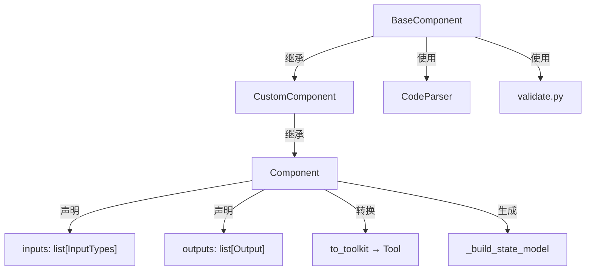
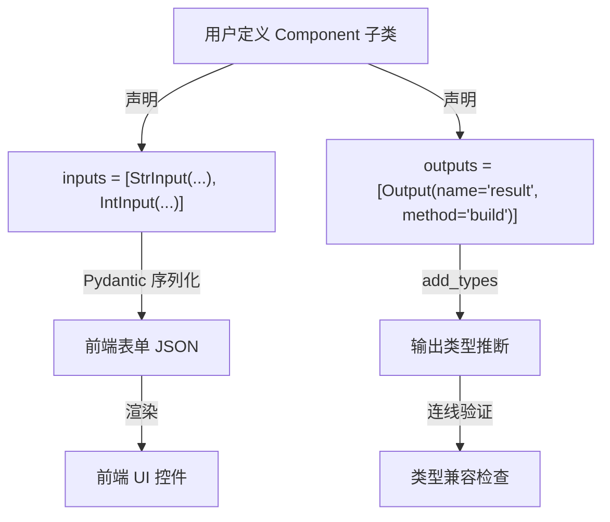
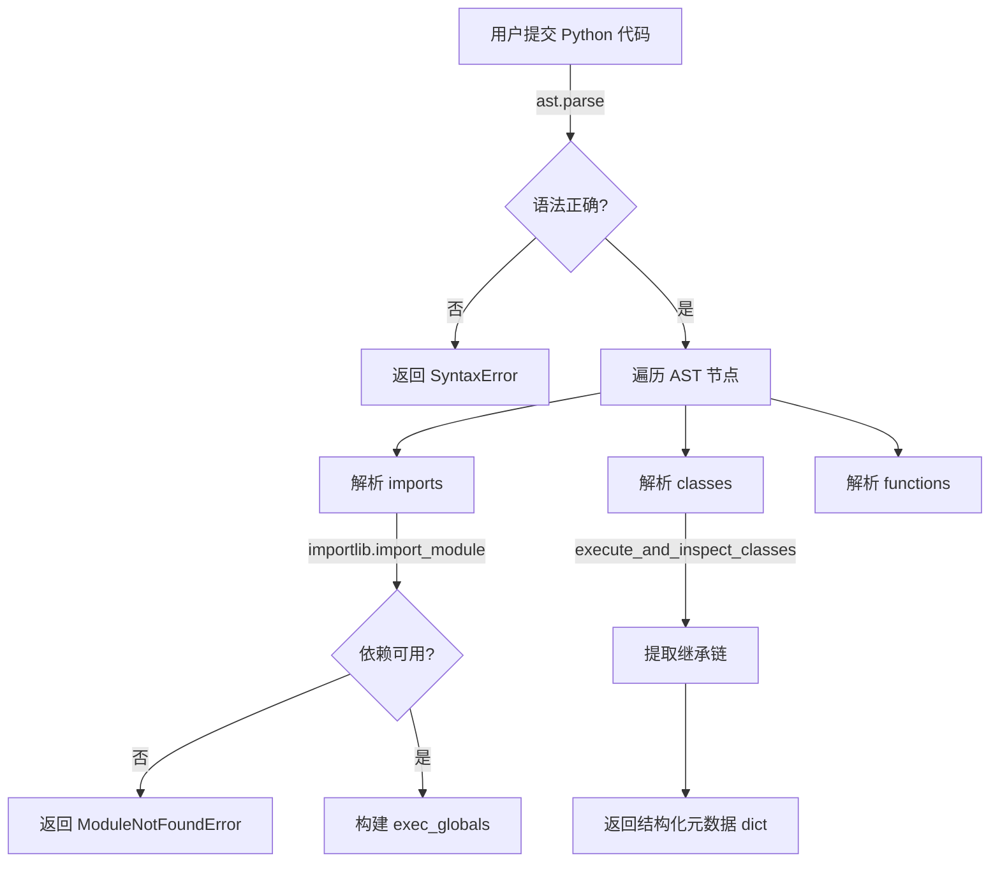

# PD-394.01 Langflow — Component 基类声明式扩展与热加载验证

> 文档编号：PD-394.01
> 来源：Langflow `src/lfx/src/lfx/custom/custom_component/component.py`
> GitHub：https://github.com/langflow-ai/langflow.git
> 问题域：PD-394 组件化扩展体系 Component Extension System
> 状态：可复用方案

---

## 第 1 章 问题与动机

### 1.1 核心问题

低代码/可视化 Agent 平台需要让用户在不修改核心框架的前提下扩展功能。核心挑战包括：

1. **组件定义的一致性** — 每个组件需要统一的输入/输出声明，前端 UI 才能自动渲染表单、连线和类型检查
2. **用户代码的安全验证** — 用户提交的 Python 代码必须经过 AST 解析和语法验证，不能直接 exec 未检查的代码
3. **组件发现与热加载** — 用户把 `.py` 文件放到指定目录后，系统需要自动发现、解析、注册，无需重启
4. **组件到工具的自动转换** — 组件需要能自动转换为 LangChain Tool，供 Agent 调用，无需手动编写 Tool wrapper

### 1.2 Langflow 的解法概述

Langflow 通过四层架构解决上述问题：

1. **三层继承基类** — `BaseComponent → CustomComponent → Component`，逐层叠加能力：代码解析 → 流程管理 → 声明式 I/O（`base_component.py:27`, `custom_component.py:43`, `component.py:112`）
2. **Pydantic 驱动的 Input/Output 声明** — 用 Pydantic BaseModel 定义 `Input` 和 `Output` 类，字段属性直接映射前端表单控件（`template/field/base.py:34-260`）
3. **AST 级代码验证管线** — `CodeParser` 解析用户代码为结构化元数据，`validate.py` 通过 `ast.parse` + `importlib` 验证语法和依赖（`code_parser.py:59-362`, `validate.py:31-72`）
4. **目录扫描热加载** — `DirectoryReader` 递归扫描指定目录的 `.py` 文件，异步并行处理，自动构建组件菜单（`directory_reader.py:41-363`）
5. **Template Method 工具转换** — `to_toolkit()` 定义骨架，`_get_tools()` 可被子类覆写，通过 `ComponentToolkit` 自动生成 `StructuredTool`（`component.py:1358-1395`）

### 1.3 设计思想

| 设计原则 | 具体实现 | 理由 | 替代方案 |
|----------|----------|------|----------|
| 声明式优于命令式 | Input/Output 用 Pydantic 字段声明，自动生成 UI 和 Schema | 减少样板代码，保证前后端一致 | 手动编写 JSON Schema |
| AST 优于 exec | CodeParser 用 ast.parse 提取元数据，不直接执行用户代码 | 安全性：在执行前验证语法和依赖 | 直接 exec + try/catch |
| 模板方法模式 | to_toolkit() 定义骨架，_get_tools() 可覆写 | 子类可定制工具生成，同时保留元数据更新逻辑 | 每个组件手写 Tool wrapper |
| 异步优先 | DirectoryReader.abuild_component_menu_list 用 asyncio.gather 并行 | 大量组件文件时显著提升加载速度 | 同步逐文件处理 |
| 惰性初始化 | tracing_service、template_config 首次访问时才创建 | 避免不必要的服务初始化开销 | 构造函数中全部初始化 |
| 缓存代码解析 | BaseComponent.get_code_tree 用 TTLCache(60s, 1024) 缓存 | 同一代码多次解析时避免重复 AST 开销 | 每次重新解析 |

---

## 第 2 章 源码实现分析

### 2.1 架构概览

Langflow 的组件化扩展体系由五个核心模块组成：

```
┌─────────────────────────────────────────────────────────────────┐
│                    Component Extension System                    │
├─────────────────────────────────────────────────────────────────┤
│                                                                  │
│  ┌──────────────┐    ┌──────────────┐    ┌──────────────────┐   │
│  │ BaseComponent │───→│CustomComponent│───→│    Component     │   │
│  │  (代码解析)   │    │  (流程管理)   │    │ (声明式 I/O)    │   │
│  └──────┬───────┘    └──────────────┘    └────────┬─────────┘   │
│         │                                          │             │
│         ▼                                          ▼             │
│  ┌──────────────┐    ┌──────────────┐    ┌──────────────────┐   │
│  │  CodeParser   │    │DirectoryReader│    │ ComponentToolkit │   │
│  │  (AST 解析)   │    │  (热加载)     │    │  (工具转换)     │   │
│  └──────┬───────┘    └──────┬───────┘    └──────────────────┘   │
│         │                    │                                    │
│         ▼                    ▼                                    │
│  ┌──────────────┐    ┌──────────────┐                           │
│  │  validate.py  │    │ Input/Output │                           │
│  │ (代码验证)    │    │ (Pydantic)   │                           │
│  └──────────────┘    └──────────────┘                           │
│                                                                  │
│  ┌──────────────────────────────────────────────────────────┐   │
│  │           FrontendNode (UI 节点序列化)                     │   │
│  └──────────────────────────────────────────────────────────┘   │
└─────────────────────────────────────────────────────────────────┘
```

### 2.2 核心实现

#### 2.2.1 三层继承基类



对应源码 `base_component.py:27-68`、`custom_component.py:43-63`、`component.py:112-180`：

```python
# base_component.py:27 — 最底层：代码解析 + 缓存
class BaseComponent:
    def __init__(self, **data) -> None:
        self._code: str | None = None
        self._function_entrypoint_name: str = "build"
        self.cache: TTLCache = TTLCache(maxsize=1024, ttl=60)

    @cachedmethod(cache=operator.attrgetter("cache"))
    def get_code_tree(self, code: str):
        parser = CodeParser(code)
        return parser.parse_code()

# custom_component.py:43 — 中间层：流程管理 + 变量服务
class CustomComponent(BaseComponent):
    _code_class_base_inheritance: ClassVar[str] = "CustomComponent"
    function_entrypoint_name: ClassVar[str] = "build"
    name: str | None = None
    display_name: str | None = None

# component.py:112 — 最上层：声明式 I/O + 工具转换
class Component(CustomComponent):
    inputs: list[InputTypes] = []
    outputs: list[Output] = []
    code_class_base_inheritance: ClassVar[str] = "Component"
```

#### 2.2.2 Pydantic 驱动的 Input/Output 声明



对应源码 `template/field/base.py:34-173`（Input）和 `base.py:181-260`（Output）：

```python
# template/field/base.py:34 — Input 声明
class Input(BaseModel):
    model_config = ConfigDict(arbitrary_types_allowed=True)
    field_type: str | type | None = Field(default=str, serialization_alias="type")
    required: bool = False
    placeholder: str = ""
    is_list: bool = Field(default=False, serialization_alias="list")
    show: bool = True
    multiline: bool = False
    value: Any = None
    password: bool | None = None
    options: list[str] | Callable | None = None
    name: str | None = None
    display_name: str | None = None
    advanced: bool = False
    input_types: list[str] | None = None
    dynamic: bool = False
    real_time_refresh: bool | None = None

    @model_serializer(mode="wrap")
    def serialize_model(self, handler):
        result = handler(self)
        if self.field_type in {"str", "Text"} and "input_types" not in result:
            result["input_types"] = ["Text"]
        return result

# template/field/base.py:181 — Output 声明
class Output(BaseModel):
    types: list[str] = Field(default=[])
    name: str = Field(description="The name of the field.")
    method: str | None = Field(default=None)
    value: Any | None = Field(default=UNDEFINED)
    cache: bool = Field(default=True)
    required_inputs: list[str] | None = Field(default=None)
    tool_mode: bool = Field(default=True)

    def add_types(self, type_: list[Any]) -> None:
        if self.types is None:
            self.types = []
        self.types.extend([t for t in type_ if t not in self.types])
```

#### 2.2.3 AST 级代码验证管线



对应源码 `code_parser.py:59-175` 和 `validate.py:31-72`：

```python
# code_parser.py:59 — AST 解析器
class CodeParser:
    def __init__(self, code: str | type) -> None:
        self.cache: TTLCache = TTLCache(maxsize=1024, ttl=60)
        self.code = code
        self.data: dict[str, Any] = {
            "imports": [], "functions": [], "classes": [], "global_vars": [],
        }
        self.handlers = {
            ast.Import: self.parse_imports,
            ast.ImportFrom: self.parse_imports,
            ast.FunctionDef: self.parse_functions,
            ast.ClassDef: self.parse_classes,
            ast.Assign: self.parse_global_vars,
        }

    def parse_code(self) -> dict[str, Any]:
        tree = self.get_tree()
        for node in ast.walk(tree):
            self.parse_node(node)
        return self.data

# validate.py:31 — 代码验证
def validate_code(code):
    errors = {"imports": {"errors": []}, "function": {"errors": []}}
    try:
        tree = ast.parse(code)
    except Exception as e:
        errors["function"]["errors"].append(str(e))
        return errors
    # 验证 import 可用性
    for node in tree.body:
        if isinstance(node, ast.Import):
            for alias in node.names:
                try:
                    importlib.import_module(alias.name)
                except ModuleNotFoundError as e:
                    errors["imports"]["errors"].append(str(e))
    return errors
```

### 2.3 实现细节

**目录扫描热加载**（`directory_reader.py:130-149, 304-353`）：

DirectoryReader 递归扫描指定目录，最大深度 2 层，跳过 `deactivated` 文件夹和 `__` 开头的文件。异步版本用 `asyncio.gather` 并行处理所有文件：

```python
# directory_reader.py:130 — 文件发现
def get_files(self):
    file_list = []
    safe_path_obj = Path(safe_path)
    for file_path in safe_path_obj.rglob("*.py"):
        if "deactivated" in file_path.parent.name:
            continue
        relative_depth = len(file_path.relative_to(safe_path_obj).parts)
        if relative_depth <= MAX_DEPTH and file_path.is_file() \
           and not file_path.name.startswith("__"):
            file_list.append(str(file_path))
    return file_list

# directory_reader.py:304 — 异步并行构建菜单
async def abuild_component_menu_list(self, file_paths):
    tasks = [self.process_file_async(fp) for fp in file_paths]
    results = await asyncio.gather(*tasks)
```

**状态模型自动生成**（`component.py:355-376`）：

Component 可以根据 outputs 自动生成 Pydantic 状态模型，用于图执行时的状态管理：

```python
# component.py:355
def _build_state_model(self):
    if self._state_model:
        return self._state_model
    name = self.name or self.__class__.__name__
    model_name = f"{name}StateModel"
    fields = {}
    for output in self._outputs_map.values():
        fields[output.name] = getattr(self, output.method)
    from lfx.graph.state.model import create_state_model
    self._state_model = create_state_model(model_name=model_name, **fields)
    return self._state_model
```

**RequiredInputsVisitor**（`tree_visitor.py:7-21`）：

通过 AST Visitor 模式分析组件方法中实际引用了哪些 `self.xxx` 输入，自动推断每个 Output 的必需输入依赖：

```python
# tree_visitor.py:7
class RequiredInputsVisitor(ast.NodeVisitor):
    def __init__(self, inputs: dict[str, Any]):
        self.inputs = inputs
        self.required_inputs: set[str] = set()

    def visit_Attribute(self, node) -> None:
        if (isinstance(node.value, ast.Name)
            and node.value.id == "self"
            and node.attr in self.inputs
            and self.inputs[node.attr].required):
            self.required_inputs.add(node.attr)
        self.generic_visit(node)
```

**to_toolkit 工具转换**（`component.py:1358-1395`）：

```python
# component.py:1358
async def to_toolkit(self) -> list[Tool]:
    if asyncio.iscoroutinefunction(self._get_tools):
        tools = await self._get_tools()
    else:
        tools = self._get_tools()
    if hasattr(self, TOOLS_METADATA_INPUT_NAME):
        tools = self._filter_tools_by_status(tools=tools, metadata=self.tools_metadata)
        return self._update_tools_with_metadata(tools=tools, metadata=self.tools_metadata)
    return self._filter_tools_by_status(tools=tools, metadata=None)

async def _get_tools(self) -> list[Tool]:
    component_toolkit = get_component_toolkit()
    return component_toolkit(component=self).get_tools(
        callbacks=self.get_langchain_callbacks()
    )
```

---

## 第 3 章 迁移指南

### 3.1 迁移清单

**阶段 1：组件基类（1-2 天）**
- [ ] 定义 `BaseComponent` 基类，包含代码解析和缓存能力
- [ ] 实现 `CodeParser`，用 AST 提取类/函数/导入元数据
- [ ] 实现 `validate_code()`，验证语法和依赖可用性

**阶段 2：声明式 I/O（1-2 天）**
- [ ] 定义 `Input` Pydantic 模型，包含 field_type、required、display_name 等字段
- [ ] 定义 `Output` Pydantic 模型，包含 types、method、cache 等字段
- [ ] 实现 `map_inputs()` 和 `map_outputs()` 映射逻辑
- [ ] 实现 `_set_output_types()` 自动推断输出类型

**阶段 3：组件发现（0.5-1 天）**
- [ ] 实现 `DirectoryReader`，递归扫描 `.py` 文件
- [ ] 实现异步并行处理 `abuild_component_menu_list()`
- [ ] 实现 `process_file()` 验证管线（语法检查 → 类型提示检查 → 压缩）

**阶段 4：工具转换（0.5-1 天）**
- [ ] 实现 `to_toolkit()` 模板方法
- [ ] 实现 `ComponentToolkit` 将组件转为 `StructuredTool`
- [ ] 实现工具元数据过滤和状态管理

### 3.2 适配代码模板

以下是一个可直接运行的最小组件系统实现：

```python
"""minimal_component_system.py — 可移植的组件化扩展框架"""
import ast
import importlib
import inspect
from pathlib import Path
from typing import Any, ClassVar
from pydantic import BaseModel, Field
from cachetools import TTLCache, cachedmethod
import operator


# ---- 1. Input/Output 声明 ----

class Input(BaseModel):
    name: str
    field_type: str = "str"
    required: bool = False
    display_name: str | None = None
    value: Any = None
    advanced: bool = False

    def model_post_init(self, __context):
        if self.display_name is None:
            self.display_name = self.name.replace("_", " ").title()


class Output(BaseModel):
    name: str
    types: list[str] = Field(default_factory=list)
    method: str | None = None
    cache: bool = True


# ---- 2. 代码解析器 ----

class CodeParser:
    def __init__(self, code: str):
        self.code = code

    def parse(self) -> dict:
        tree = ast.parse(self.code)
        classes = []
        for node in ast.walk(tree):
            if isinstance(node, ast.ClassDef):
                methods = [
                    {"name": m.name, "args": [a.arg for a in m.args.args]}
                    for m in node.body if isinstance(m, ast.FunctionDef)
                ]
                classes.append({
                    "name": node.name,
                    "bases": [b.id for b in node.bases if isinstance(b, ast.Name)],
                    "methods": methods,
                })
        return {"classes": classes}


# ---- 3. 组件基类 ----

class BaseComponent:
    inputs: ClassVar[list[Input]] = []
    outputs: ClassVar[list[Output]] = []

    def __init__(self, **kwargs):
        self._cache = TTLCache(maxsize=256, ttl=60)
        for key, value in kwargs.items():
            setattr(self, key, value)

    @cachedmethod(cache=operator.attrgetter("_cache"))
    def get_code_tree(self, code: str) -> dict:
        return CodeParser(code).parse()

    def build(self, **kwargs) -> Any:
        raise NotImplementedError


# ---- 4. 目录扫描器 ----

class DirectoryScanner:
    def __init__(self, base_path: str, max_depth: int = 2):
        self.base_path = Path(base_path)
        self.max_depth = max_depth

    def scan(self) -> list[dict]:
        components = []
        for py_file in self.base_path.rglob("*.py"):
            if py_file.name.startswith("__"):
                continue
            depth = len(py_file.relative_to(self.base_path).parts)
            if depth > self.max_depth:
                continue
            code = py_file.read_text(encoding="utf-8")
            try:
                ast.parse(code)
            except SyntaxError:
                continue
            components.append({
                "file": str(py_file),
                "name": py_file.stem,
                "code": code,
            })
        return components


# ---- 5. 工具转换 ----

def component_to_tool(component: BaseComponent) -> dict:
    """将组件转换为工具描述（可对接 LangChain StructuredTool）"""
    input_schema = {}
    for inp in component.inputs:
        input_schema[inp.name] = {
            "type": inp.field_type,
            "required": inp.required,
            "description": inp.display_name,
        }
    return {
        "name": component.__class__.__name__,
        "description": getattr(component, "description", ""),
        "input_schema": input_schema,
        "function": component.build,
    }
```

### 3.3 适用场景

| 场景 | 适用度 | 说明 |
|------|--------|------|
| 低代码 Agent 平台 | ⭐⭐⭐ | 完美匹配：声明式 I/O + 自动 UI 生成 |
| 插件化 CLI 工具 | ⭐⭐⭐ | 目录扫描 + 代码验证可直接复用 |
| 可视化工作流引擎 | ⭐⭐⭐ | Input/Output 类型系统支持连线验证 |
| MCP Server 工具注册 | ⭐⭐ | to_toolkit 模式可适配 MCP 工具协议 |
| 纯后端 Agent 框架 | ⭐ | 声明式 UI 部分不需要，但基类设计可借鉴 |

---

## 第 4 章 测试用例

```python
"""test_component_extension.py — 基于 Langflow 真实接口的测试"""
import ast
import pytest
from unittest.mock import MagicMock, patch


class TestCodeParser:
    """测试 CodeParser AST 解析能力"""

    def test_parse_simple_component(self):
        """验证能正确解析组件类的方法和继承"""
        code = '''
class MyComponent(Component):
    inputs = []
    outputs = []

    def build(self, text: str) -> str:
        return text.upper()
'''
        # 模拟 CodeParser 的核心逻辑
        tree = ast.parse(code)
        classes = []
        for node in ast.walk(tree):
            if isinstance(node, ast.ClassDef):
                methods = [m.name for m in node.body if isinstance(m, ast.FunctionDef)]
                bases = [b.id for b in node.bases if isinstance(b, ast.Name)]
                classes.append({"name": node.name, "bases": bases, "methods": methods})

        assert len(classes) == 1
        assert classes[0]["name"] == "MyComponent"
        assert "Component" in classes[0]["bases"]
        assert "build" in classes[0]["methods"]

    def test_parse_syntax_error(self):
        """验证语法错误代码被正确拒绝"""
        bad_code = "def build(self:\n    pass"
        with pytest.raises(SyntaxError):
            ast.parse(bad_code)

    def test_parse_return_type_extraction(self):
        """验证返回类型提取"""
        code = '''
def build(self, x: int) -> str:
    return str(x)
'''
        tree = ast.parse(code)
        for node in ast.walk(tree):
            if isinstance(node, ast.FunctionDef) and node.name == "build":
                assert node.returns is not None
                assert ast.unparse(node.returns) == "str"


class TestInputOutput:
    """测试 Input/Output Pydantic 模型"""

    def test_input_display_name_auto_generation(self):
        """验证 display_name 从 name 自动生成"""
        from pydantic import BaseModel, Field

        class TestInput(BaseModel):
            name: str
            display_name: str | None = None

            def model_post_init(self, __context):
                if self.display_name is None:
                    self.display_name = self.name.replace("_", " ").title()

        inp = TestInput(name="api_key")
        assert inp.display_name == "Api Key"

    def test_output_type_accumulation(self):
        """验证 Output.add_types 不重复添加"""
        from pydantic import BaseModel, Field

        class TestOutput(BaseModel):
            types: list[str] = Field(default_factory=list)

            def add_types(self, new_types: list[str]):
                self.types.extend([t for t in new_types if t not in self.types])

        out = TestOutput()
        out.add_types(["str", "int"])
        out.add_types(["str", "float"])
        assert out.types == ["str", "int", "float"]


class TestDirectoryScanner:
    """测试目录扫描与热加载"""

    def test_skip_dunder_files(self, tmp_path):
        """验证跳过 __ 开头的文件"""
        (tmp_path / "__init__.py").write_text("# init")
        (tmp_path / "my_component.py").write_text("class Foo: pass")

        py_files = [
            f for f in tmp_path.rglob("*.py")
            if not f.name.startswith("__")
        ]
        assert len(py_files) == 1
        assert py_files[0].name == "my_component.py"

    def test_skip_deactivated_folder(self, tmp_path):
        """验证跳过 deactivated 目录"""
        deactivated = tmp_path / "deactivated"
        deactivated.mkdir()
        (deactivated / "old.py").write_text("class Old: pass")
        (tmp_path / "active.py").write_text("class Active: pass")

        py_files = [
            f for f in tmp_path.rglob("*.py")
            if "deactivated" not in f.parent.name
            and not f.name.startswith("__")
        ]
        assert len(py_files) == 1

    def test_max_depth_limit(self, tmp_path):
        """验证最大深度限制"""
        deep = tmp_path / "a" / "b" / "c"
        deep.mkdir(parents=True)
        (deep / "too_deep.py").write_text("class Deep: pass")
        (tmp_path / "shallow.py").write_text("class Shallow: pass")

        MAX_DEPTH = 2
        py_files = [
            f for f in tmp_path.rglob("*.py")
            if len(f.relative_to(tmp_path).parts) <= MAX_DEPTH
        ]
        assert len(py_files) == 1


class TestValidateCode:
    """测试代码验证管线"""

    def test_validate_valid_code(self):
        """验证合法代码通过检查"""
        code = "import os\ndef build(): return 42"
        errors = {"imports": {"errors": []}, "function": {"errors": []}}
        try:
            ast.parse(code)
        except SyntaxError as e:
            errors["function"]["errors"].append(str(e))
        assert len(errors["function"]["errors"]) == 0

    def test_validate_missing_import(self):
        """验证缺失依赖被检测"""
        import importlib
        try:
            importlib.import_module("nonexistent_module_xyz_123")
            found = True
        except ModuleNotFoundError:
            found = False
        assert not found
```

---

## 第 5 章 跨域关联

| 关联域 | 关系类型 | 说明 |
|--------|----------|------|
| PD-04 工具系统 | 强协同 | Component.to_toolkit() 将组件自动转换为 LangChain Tool，是工具注册的上游 |
| PD-10 中间件管道 | 协同 | Component 的 map_inputs/map_outputs 是管道节点的基础，FrontendNode 序列化驱动 UI 管道 |
| PD-03 容错与重试 | 依赖 | validate_code 和 CodeParser 的错误处理为组件加载提供容错基础 |
| PD-11 可观测性 | 协同 | Component 内置 tracing_service 惰性初始化，_output_logs 记录每个输出的执行日志 |
| PD-06 记忆持久化 | 弱关联 | Component 通过 graph.context 共享状态，_build_state_model 生成可序列化的状态模型 |
| PD-05 沙箱隔离 | 互补 | validate.py 的 AST 验证是代码安全的第一道防线，但不替代运行时沙箱 |

---

## 第 6 章 来源文件索引

| 文件 | 行范围 | 关键实现 |
|------|--------|----------|
| `src/lfx/src/lfx/custom/custom_component/base_component.py` | L27-L128 | BaseComponent 基类，代码解析缓存 |
| `src/lfx/src/lfx/custom/custom_component/custom_component.py` | L43-L653 | CustomComponent 中间层，流程管理 |
| `src/lfx/src/lfx/custom/custom_component/component.py` | L112-L180 | Component 声明式 I/O 初始化 |
| `src/lfx/src/lfx/custom/custom_component/component.py` | L355-L376 | _build_state_model 状态模型生成 |
| `src/lfx/src/lfx/custom/custom_component/component.py` | L504-L573 | map_inputs/map_outputs 映射 |
| `src/lfx/src/lfx/custom/custom_component/component.py` | L1358-L1461 | to_toolkit 工具转换 + 元数据过滤 |
| `src/lfx/src/lfx/template/field/base.py` | L34-L173 | Input Pydantic 模型 |
| `src/lfx/src/lfx/template/field/base.py` | L181-L260 | Output Pydantic 模型 |
| `src/lfx/src/lfx/custom/code_parser/code_parser.py` | L59-L362 | CodeParser AST 解析器 |
| `src/lfx/src/lfx/custom/validate.py` | L31-L524 | 代码验证 + 动态类创建 |
| `src/lfx/src/lfx/custom/directory_reader/directory_reader.py` | L41-L363 | DirectoryReader 热加载扫描 |
| `src/lfx/src/lfx/custom/tree_visitor.py` | L7-L21 | RequiredInputsVisitor 依赖分析 |
| `src/lfx/src/lfx/template/frontend_node/custom_components.py` | L55-L80 | ComponentFrontendNode UI 序列化 |

---

## 第 7 章 横向对比维度

```json comparison_data
{
  "project": "Langflow",
  "dimensions": {
    "组件基类设计": "三层继承 BaseComponent→CustomComponent→Component，逐层叠加能力",
    "注册方式": "DirectoryReader 目录扫描 + asyncio.gather 并行加载",
    "声明机制": "Pydantic Input/Output 模型，自动序列化为前端 JSON Schema",
    "代码验证": "AST 解析 + importlib 依赖检查 + RequiredInputsVisitor 依赖推断",
    "工具转换": "to_toolkit 模板方法 + ComponentToolkit 自动生成 StructuredTool",
    "热更新": "目录级 rglob 扫描，deactivated 文件夹停用，MAX_DEPTH=2 层级限制",
    "状态管理": "_build_state_model 从 outputs 自动生成 Pydantic 状态模型",
    "缓存策略": "TTLCache(60s, 1024) 缓存 AST 解析结果"
  }
}
```

### 域元数据补充

```json domain_metadata
{
  "solution_summary": "Langflow 通过三层继承基类(BaseComponent→CustomComponent→Component) + Pydantic Input/Output 声明 + AST 代码验证管线 + DirectoryReader 异步热加载实现组件化扩展",
  "description": "组件到工具的自动转换与运行时状态模型生成",
  "sub_problems": [
    "组件到 Agent Tool 的自动转换",
    "运行时状态模型自动生成",
    "AST 级依赖推断与必需输入分析",
    "异步并行组件加载与菜单构建"
  ],
  "best_practices": [
    "三层继承逐层叠加能力，避免单一基类过于臃肿",
    "TTLCache 缓存 AST 解析结果避免重复开销",
    "Template Method 模式让子类可定制工具生成逻辑",
    "deactivated 目录约定实现组件软停用"
  ]
}
```
