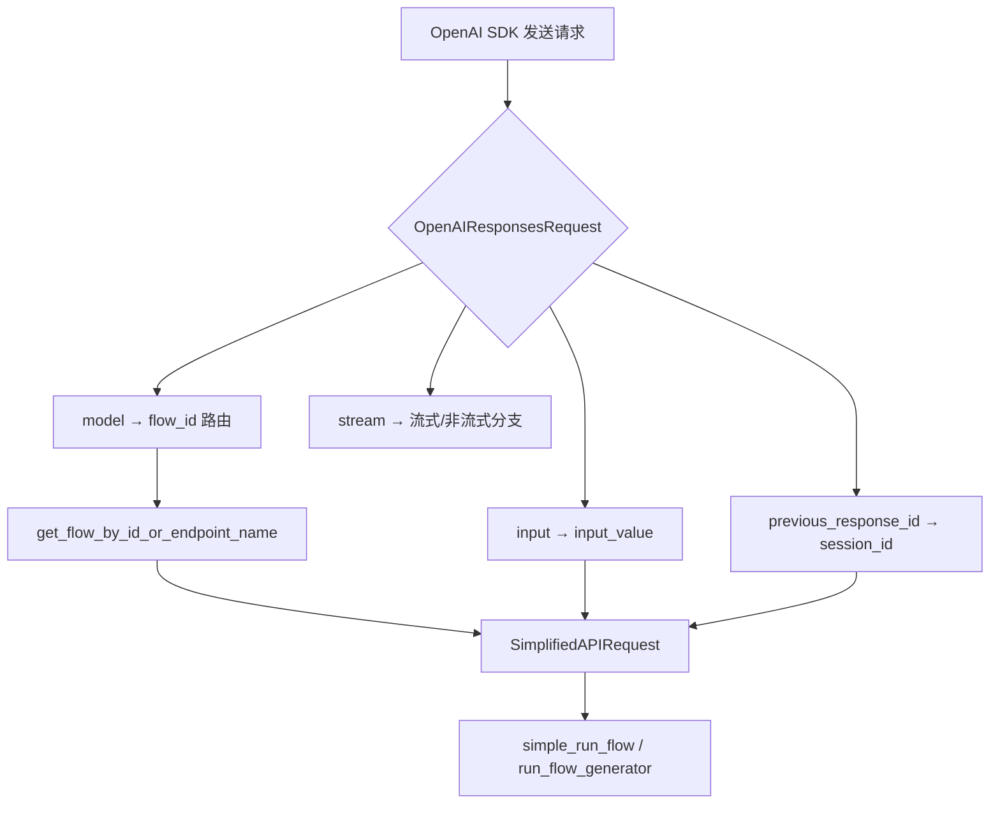
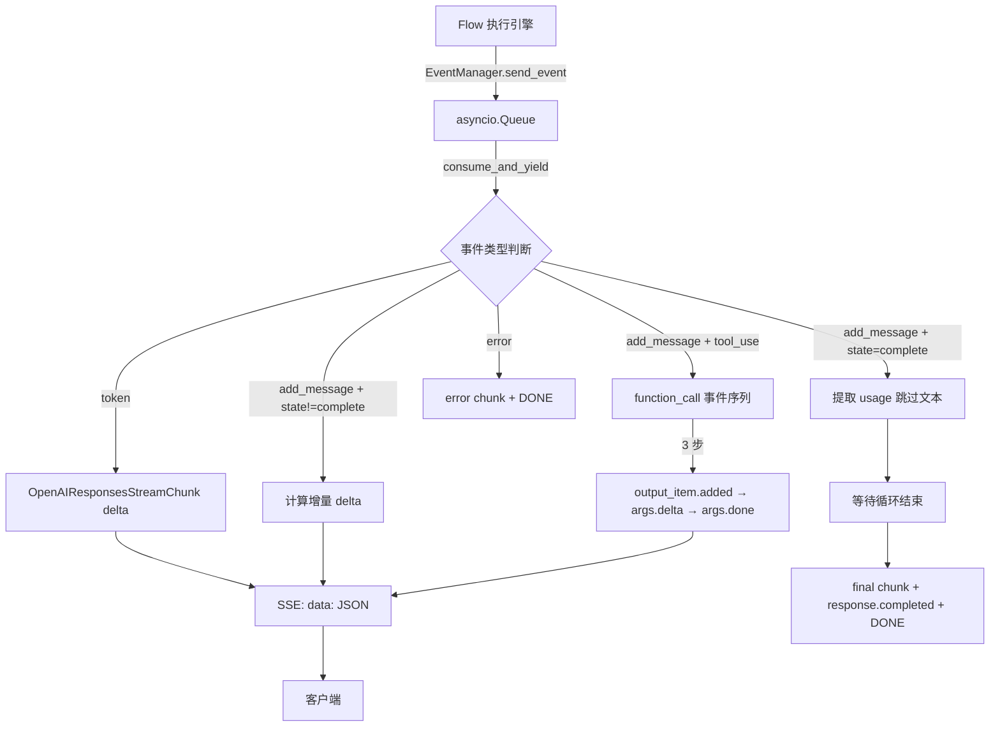

# PD-395.01 Langflow — OpenAI Responses API 兼容层与双协议流式转换

> 文档编号：PD-395.01
> 来源：Langflow `src/backend/base/langflow/api/v1/openai_responses.py`
> GitHub：https://github.com/langflow-ai/langflow.git
> 问题域：PD-395 API兼容层 API Compatibility Layer
> 状态：可复用方案

---

## 第 1 章 问题与动机（≥ 30 行）

### 1.1 核心问题

Langflow 是一个可视化工作流编排平台，用户通过拖拽组件构建 Flow（工作流）。但外部应用（如 ChatGPT 插件、LangChain Agent、OpenAI SDK 客户端）期望的是标准 OpenAI API 格式。如果每个外部调用方都需要理解 Langflow 的内部 RunResponse 结构，集成成本极高。

核心矛盾：**Langflow 内部的 Flow 执行模型（DAG 图执行 → 多组件输出 → 事件流）与 OpenAI Responses API 的请求/响应模型（单一 input → 单一 output + tool_calls）之间存在结构性不匹配**。

具体挑战：
1. **请求映射**：OpenAI 的 `model` 字段需要映射为 Langflow 的 `flow_id`
2. **流式协议转换**：Langflow 内部使用 asyncio.Queue + EventManager 事件流，需要转换为 SSE `data:` 格式
3. **工具调用映射**：Langflow 的 `ToolContent`（content_blocks 中的 tool_use 类型）需要转换为 OpenAI 的 `function_call` 格式
4. **会话连续性**：OpenAI 的 `previous_response_id` 需要映射为 Langflow 的 `session_id`
5. **双版本 API 共存**：V1 提供 OpenAI 兼容端点，V2 提供原生 Workflow API，两者共享底层执行引擎

### 1.2 Langflow 的解法概述

Langflow 采用**适配器模式 + 双队列流式桥接**的方案：

1. **Pydantic Schema 对齐**：在 `lfx/schema/openai_responses_schemas.py:6-60` 定义 4 个 Pydantic 模型（Request/Response/StreamChunk/ErrorResponse），字段与 OpenAI Responses API 一一对应
2. **model→flow_id 路由**：在 `openai_responses.py:634-635` 通过 `get_flow_by_id_or_endpoint_name(request.model)` 将 OpenAI 的 model 字段解析为 Langflow 的 flow_id
3. **双队列流式桥接**：在 `openai_responses.py:99-101` 创建 asyncio.Queue + client_consumed_queue，通过 `consume_and_yield` 消费内部事件并转换为 OpenAI SSE 格式
4. **ToolContent→function_call 映射**：在 `openai_responses.py:232-348` 遍历 content_blocks 中的 tool_use 类型，转换为 OpenAI 的 `response.output_item.added` + `response.function_call_arguments.delta/done` 事件序列
5. **统一错误格式**：在 `openai_responses_schemas.py:66-105` 提供 `create_openai_error` 和 `create_openai_error_chunk` 工厂函数，确保错误响应也符合 OpenAI 格式

### 1.3 设计思想

| 设计原则 | 具体实现 | 理由 | 替代方案 |
|----------|----------|------|----------|
| 适配器模式 | OpenAI Schema ↔ SimplifiedAPIRequest 双向转换 | 不侵入内部执行引擎，兼容层可独立演进 | 在执行引擎中直接支持 OpenAI 格式（耦合度高） |
| 双队列背压控制 | asyncio.Queue + client_consumed_queue | 生产者（Flow 执行）和消费者（SSE 输出）解耦，防止内存溢出 | 单队列无背压（可能 OOM） |
| Schema 分层导出 | lfx.schema → langflow.schema 二次导出 | lfx 是核心包，langflow 是应用层，分层便于独立部署 | 单一 schema 包（无法独立部署 lfx） |
| 增量 Delta 计算 | `text[len(previous_content):]` 差量发送 | 避免重复发送已流式输出的内容 | 每次发送全量文本（浪费带宽） |
| 工具调用去重 | `tool_signature = f"{tool_name}:{hash(...)}"` | 同一工具调用可能在多个 add_message 事件中重复出现 | 不去重（客户端收到重复 tool_call） |

---

## 第 2 章 源码实现分析（≥ 60 行，核心章节）

### 2.1 架构概览

Langflow 的 OpenAI 兼容层由 4 层组成：Schema 定义层、路由注册层、请求转换层、流式桥接层。

```
┌─────────────────────────────────────────────────────────────────┐
│                    外部 OpenAI SDK 客户端                         │
│              POST /api/v1/responses                              │
└──────────────────────────┬──────────────────────────────────────┘
                           │
┌──────────────────────────▼──────────────────────────────────────┐
│  openai_responses.py :: create_response()                       │
│  ┌─────────────────┐  ┌──────────────────┐  ┌───────────────┐  │
│  │ Schema 验证      │→│ model→flow_id    │→│ 权限校验       │  │
│  │ (Pydantic)      │  │ 路由解析         │  │ (api_key)     │  │
│  └─────────────────┘  └──────────────────┘  └───────┬───────┘  │
│                                                      │          │
│  ┌───────────────────────────────────────────────────▼───────┐  │
│  │ run_flow_for_openai_responses()                           │  │
│  │  ┌─────────────┐    ┌──────────────────────────────────┐  │  │
│  │  │ stream=false│    │ stream=true                      │  │  │
│  │  │ simple_run  │    │ asyncio.Queue + EventManager     │  │  │
│  │  │ _flow()     │    │ → openai_stream_generator()      │  │  │
│  │  └──────┬──────┘    └──────────────┬───────────────────┘  │  │
│  │         │                          │                      │  │
│  │  ┌──────▼──────┐    ┌──────────────▼───────────────────┐  │  │
│  │  │ 提取 output │    │ 事件类型分发:                     │  │  │
│  │  │ + tool_calls│    │  token → delta chunk             │  │  │
│  │  │ + usage     │    │  add_message → tool_call 映射    │  │  │
│  │  └──────┬──────┘    │  error → error chunk             │  │  │
│  │         │           │  complete → [DONE]               │  │  │
│  │         │           └──────────────┬───────────────────┘  │  │
│  └─────────┼──────────────────────────┼──────────────────────┘  │
│            │                          │                          │
│  ┌─────────▼──────────────────────────▼───────────────────────┐ │
│  │ OpenAIResponsesResponse / StreamingResponse (SSE)          │ │
│  └────────────────────────────────────────────────────────────┘ │
└─────────────────────────────────────────────────────────────────┘
```

### 2.2 核心实现

#### 2.2.1 Schema 定义与字段映射



对应源码 `lfx/schema/openai_responses_schemas.py:6-60`：

```python
class OpenAIResponsesRequest(BaseModel):
    """OpenAI-compatible responses request with flow_id as model parameter."""
    model: str = Field(..., description="The flow ID to execute (used instead of OpenAI model)")
    input: str = Field(..., description="The input text to process")
    stream: bool = Field(default=False, description="Whether to stream the response")
    background: bool = Field(default=False, description="Whether to process in background")
    tools: list[Any] | None = Field(default=None, description="Tools are not supported yet")
    previous_response_id: str | None = Field(
        default=None, description="ID of previous response to continue conversation"
    )
    include: list[str] | None = Field(
        default=None, description="Additional response data to include, e.g., ['tool_call.results']"
    )

class OpenAIResponsesResponse(BaseModel):
    """OpenAI-compatible responses response."""
    id: str
    object: Literal["response"] = "response"
    created_at: int
    status: Literal["completed", "in_progress", "failed"] = "completed"
    model: str
    output: list[dict]
    previous_response_id: str | None = None
    usage: dict | None = None
    # ... 其余字段与 OpenAI 规范对齐
```

关键映射关系：`model` 字段在 OpenAI 中是模型名称，在 Langflow 中被复用为 `flow_id`，通过 `get_flow_by_id_or_endpoint_name()` 解析（`openai_responses.py:634-635`）。

#### 2.2.2 流式事件转换引擎



对应源码 `openai_responses.py:103-444`（流式生成器核心逻辑）：

```python
async def openai_stream_generator() -> AsyncGenerator[str, None]:
    main_task = asyncio.create_task(
        run_flow_generator(
            flow=flow, input_request=simplified_request,
            api_key_user=api_key_user, event_manager=event_manager,
            client_consumed_queue=asyncio_queue_client_consumed, context=context,
        )
    )
    try:
        # 初始空 chunk 建立连接
        initial_chunk = OpenAIResponsesStreamChunk(
            id=response_id, created=created_timestamp,
            model=request.model, delta={"content": ""},
        )
        yield f"data: {initial_chunk.model_dump_json()}\n\n"

        tool_call_counter = 0
        processed_tools = set()  # 去重集合
        previous_content = ""    # 增量计算基准

        async for event_data in consume_and_yield(asyncio_queue, asyncio_queue_client_consumed):
            if event_data is None:
                break
            # ... 事件解析与转换
    finally:
        if not main_task.done():
            main_task.cancel()
```

增量 Delta 计算（`openai_responses.py:356-373`）：当 `add_message` 事件的 text 以 `previous_content` 开头时，只发送新增部分 `text[len(previous_content):]`；否则发送全量文本（处理内容重置场景）。

#### 2.2.3 ToolContent 到 function_call 的三步映射

工具调用转换是最复杂的部分。Langflow 内部的 `ToolContent`（`content_types.py:81-91`）包含 `name`、`tool_input`、`output` 三个字段，需要转换为 OpenAI Responses API 的三步事件序列：

1. `response.output_item.added` — 声明新的 function_call 项
2. `response.function_call_arguments.delta` — 发送参数 JSON
3. `response.function_call_arguments.done` — 参数发送完成

去重机制（`openai_responses.py:247-255`）：

```python
tool_signature = f"{tool_name}:{hash(str(sorted(tool_input.items())))}"
if tool_signature in processed_tools:
    continue
processed_tools.add(tool_signature)
```

### 2.3 实现细节

#### V1 与 V2 双协议共存

Langflow 同时维护两套 API：

- **V1 OpenAI 兼容端点**（`/api/v1/responses`）：面向 OpenAI SDK 客户端，使用 `OpenAIResponsesRequest/Response` schema
- **V2 Workflow 原生端点**（`/api/v2/workflows`）：面向 Langflow 原生客户端，使用 `WorkflowExecutionRequest/Response` schema

两者共享底层执行引擎 `simple_run_flow()` 和 `run_flow_generator()`，区别仅在于请求/响应的 schema 转换层。

路由注册（`router.py:58`）：
```python
router_v1.include_router(openai_responses_router)  # V1: OpenAI 兼容
router_v2.include_router(workflow_router_v2)        # V2: 原生 Workflow
```

#### V2 Converter 的终端节点处理

V2 的 `converters.py:306-380` 实现了终端节点（terminal vertex）的智能内容提取：
- **Output 节点**（`is_output=True`）：完整暴露内容
- **Data/DataFrame 节点**：无论 is_output 标志，都暴露内容
- **Message 节点**（非 Output）：仅暴露元数据（model source、file_path）

这种分层策略确保 V2 API 返回的信息既不过多（避免泄露中间节点数据）也不过少（保留有用的元数据）。

#### 错误处理的双模式

- **非流式错误**：返回 `OpenAIErrorResponse`（`openai_responses.py:686-691`），HTTP 200 + error body（与 OpenAI 行为一致）
- **流式错误**：通过 `create_openai_error_chunk()` 发送带 `finish_reason="error"` 的 chunk（`openai_responses.py:178-187`），然后发送 `[DONE]`


---

## 第 3 章 迁移指南（≥ 40 行）

### 3.1 迁移清单

**阶段 1：Schema 定义（1-2 天）**
- [ ] 定义 OpenAI 兼容的 Request/Response Pydantic 模型
- [ ] 实现 `model` 字段到内部资源 ID 的路由解析
- [ ] 定义 StreamChunk 模型（含 delta、status、finish_reason）
- [ ] 实现 `create_openai_error` / `create_openai_error_chunk` 工厂函数

**阶段 2：非流式适配（1-2 天）**
- [ ] 实现请求转换：OpenAI Request → 内部执行请求
- [ ] 实现响应转换：内部执行结果 → OpenAI Response
- [ ] 实现工具调用提取：内部 tool 结果 → OpenAI `function_call` 格式
- [ ] 实现 usage 提取：从内部 Message properties 中提取 token 用量

**阶段 3：流式适配（2-3 天）**
- [ ] 搭建双队列桥接：asyncio.Queue + client_consumed_queue
- [ ] 实现事件类型分发：token/add_message/error → 对应 SSE 格式
- [ ] 实现增量 delta 计算（避免重复发送）
- [ ] 实现工具调用的三步事件序列
- [ ] 实现流式错误处理（error chunk + [DONE]）

**阶段 4：路由注册与测试（1 天）**
- [ ] 注册 FastAPI router 到 API 版本前缀下
- [ ] 添加 API Key 认证中间件
- [ ] 端到端测试：OpenAI Python SDK → 你的兼容端点

### 3.2 适配代码模板

以下是一个可直接复用的最小化 OpenAI Responses API 兼容层模板：

```python
"""OpenAI Responses API 兼容层 — 最小化可运行模板"""
import asyncio
import json
import time
import uuid
from collections.abc import AsyncGenerator
from typing import Any, Literal

from fastapi import APIRouter, Depends, HTTPException
from fastapi.responses import StreamingResponse
from pydantic import BaseModel, Field

router = APIRouter(tags=["OpenAI Responses API"])

# ── Schema 定义 ──────────────────────────────────────────────

class OpenAIRequest(BaseModel):
    model: str = Field(..., description="内部资源 ID，复用 OpenAI 的 model 字段")
    input: str
    stream: bool = False
    previous_response_id: str | None = None
    include: list[str] | None = None

class OpenAIStreamChunk(BaseModel):
    id: str
    object: Literal["response.chunk"] = "response.chunk"
    created: int
    model: str
    delta: dict
    status: str | None = None
    finish_reason: str | None = None

class OpenAIResponse(BaseModel):
    id: str
    object: Literal["response"] = "response"
    created_at: int
    model: str
    output: list[dict]
    usage: dict | None = None

# ── 流式桥接 ─────────────────────────────────────────────────

async def stream_bridge(
    execute_fn,  # 你的内部执行函数（接受 queue 参数）
    request: OpenAIRequest,
    response_id: str,
) -> AsyncGenerator[str, None]:
    """双队列流式桥接：内部事件 → OpenAI SSE 格式"""
    queue: asyncio.Queue = asyncio.Queue()
    task = asyncio.create_task(execute_fn(queue=queue))

    created = int(time.time())
    previous_content = ""

    # 初始 chunk 建立连接
    init = OpenAIStreamChunk(id=response_id, created=created, model=request.model, delta={"content": ""})
    yield f"data: {init.model_dump_json()}\n\n"

    try:
        while True:
            event = await queue.get()
            if event is None:
                break

            event_type = event.get("type", "")
            data = event.get("data", {})

            if event_type == "token":
                token = data.get("chunk", "")
                if token:
                    chunk = OpenAIStreamChunk(
                        id=response_id, created=created,
                        model=request.model, delta={"content": token},
                    )
                    yield f"data: {chunk.model_dump_json()}\n\n"

            elif event_type == "error":
                err_msg = data.get("text", "Unknown error")
                err_chunk = OpenAIStreamChunk(
                    id=response_id, created=created, model=request.model,
                    delta={"content": err_msg}, status="failed", finish_reason="error",
                )
                yield f"data: {err_chunk.model_dump_json()}\n\n"
                yield "data: [DONE]\n\n"
                return

        # 完成
        final = OpenAIStreamChunk(
            id=response_id, created=created, model=request.model,
            delta={}, status="completed", finish_reason="stop",
        )
        yield f"data: {final.model_dump_json()}\n\n"
        yield "data: [DONE]\n\n"
    finally:
        if not task.done():
            task.cancel()

# ── 路由 ─────────────────────────────────────────────────────

@router.post("/responses")
async def create_response(request: OpenAIRequest):
    # 1. model → 内部资源路由
    resource = await resolve_resource(request.model)
    if not resource:
        return {"error": {"message": f"Resource '{request.model}' not found", "type": "invalid_request_error"}}

    response_id = request.previous_response_id or str(uuid.uuid4())

    if request.stream:
        return StreamingResponse(
            stream_bridge(resource.execute, request, response_id),
            media_type="text/event-stream",
            headers={"Cache-Control": "no-cache", "Connection": "keep-alive"},
        )

    # 2. 非流式：执行 → 转换
    result = await resource.execute_sync(input_text=request.input)
    return OpenAIResponse(
        id=response_id, created_at=int(time.time()),
        model=request.model,
        output=[{"type": "message", "role": "assistant",
                 "content": [{"type": "output_text", "text": result.text}]}],
        usage=result.usage,
    )
```

### 3.3 适用场景

| 场景 | 适用度 | 说明 |
|------|--------|------|
| 工作流平台对外暴露 OpenAI 兼容 API | ⭐⭐⭐ | 核心场景，Langflow 的原始设计目标 |
| 自建 LLM 服务提供 OpenAI 兼容接口 | ⭐⭐⭐ | Schema 定义和流式桥接可直接复用 |
| 多模型网关统一 API 格式 | ⭐⭐ | 需要扩展 model 路由逻辑支持多后端 |
| 已有 REST API 包装为 OpenAI 格式 | ⭐⭐ | 非流式部分简单，流式需要事件源适配 |
| 纯前端 Chat UI 对接 | ⭐ | 通常直接用 OpenAI SDK，不需要自建兼容层 |

---

## 第 4 章 测试用例（≥ 20 行）

```python
import asyncio
import json
import pytest
from unittest.mock import AsyncMock, MagicMock, patch
from pydantic import BaseModel


# ── 测试 Schema 字段映射 ──────────────────────────────────────

class TestOpenAIResponsesRequest:
    """测试 OpenAI 请求 Schema 的字段映射"""

    def test_model_field_as_flow_id(self):
        """model 字段应接受任意字符串作为 flow_id"""
        from lfx.schema.openai_responses_schemas import OpenAIResponsesRequest
        req = OpenAIResponsesRequest(model="flow-abc-123", input="hello")
        assert req.model == "flow-abc-123"
        assert req.stream is False  # 默认非流式

    def test_previous_response_id_for_session(self):
        """previous_response_id 用于会话连续性"""
        from lfx.schema.openai_responses_schemas import OpenAIResponsesRequest
        req = OpenAIResponsesRequest(
            model="flow-1", input="hi",
            previous_response_id="session-xyz"
        )
        assert req.previous_response_id == "session-xyz"

    def test_include_tool_call_results(self):
        """include 参数控制工具调用结果的详细程度"""
        from lfx.schema.openai_responses_schemas import OpenAIResponsesRequest
        req = OpenAIResponsesRequest(
            model="flow-1", input="search",
            include=["tool_call.results"]
        )
        assert "tool_call.results" in req.include


# ── 测试错误格式化 ────────────────────────────────────────────

class TestOpenAIErrorFormatting:
    """测试 OpenAI 兼容错误响应格式"""

    def test_create_openai_error(self):
        from lfx.schema.openai_responses_schemas import create_openai_error
        err = create_openai_error("Flow not found", type_="invalid_request_error", code="flow_not_found")
        assert err["error"]["message"] == "Flow not found"
        assert err["error"]["type"] == "invalid_request_error"
        assert err["error"]["code"] == "flow_not_found"

    def test_create_openai_error_chunk(self):
        from lfx.schema.openai_responses_schemas import create_openai_error_chunk
        chunk = create_openai_error_chunk(
            response_id="resp-1", created_timestamp=1700000000,
            model="flow-1", error_message="timeout"
        )
        assert chunk.finish_reason == "error"
        assert chunk.status == "failed"
        assert chunk.delta == {"content": "timeout"}


# ── 测试流式 Delta 计算 ───────────────────────────────────────

class TestStreamDeltaCalculation:
    """测试增量内容计算逻辑"""

    def test_incremental_delta(self):
        """新内容以旧内容开头时，只发送增量部分"""
        previous = "Hello"
        current = "Hello, world!"
        if current.startswith(previous):
            delta = current[len(previous):]
        else:
            delta = current
        assert delta == ", world!"

    def test_content_reset(self):
        """内容重置时发送全量"""
        previous = "Hello"
        current = "Goodbye"
        if current.startswith(previous):
            delta = current[len(previous):]
        else:
            delta = current
        assert delta == "Goodbye"


# ── 测试工具调用去重 ──────────────────────────────────────────

class TestToolCallDeduplication:
    """测试工具调用签名去重机制"""

    def test_same_tool_call_deduped(self):
        processed = set()
        tool_input = {"query": "test"}
        sig = f"search:{hash(str(sorted(tool_input.items())))}"
        processed.add(sig)
        # 相同调用应被跳过
        assert sig in processed

    def test_different_input_not_deduped(self):
        processed = set()
        sig1 = f"search:{hash(str(sorted({'query': 'a'}.items())))}"
        sig2 = f"search:{hash(str(sorted({'query': 'b'}.items())))}"
        processed.add(sig1)
        assert sig2 not in processed


# ── 测试 V2 Converter ────────────────────────────────────────

class TestV2Converters:
    """测试 V2 API 的请求/响应转换"""

    def test_parse_flat_inputs(self):
        from langflow.api.v2.converters import parse_flat_inputs
        inputs = {
            "ChatInput-abc.input_value": "hello",
            "ChatInput-abc.session_id": "sess-1",
            "LLM-xyz.temperature": 0.7,
        }
        tweaks, session_id = parse_flat_inputs(inputs)
        assert tweaks["ChatInput-abc"]["input_value"] == "hello"
        assert tweaks["LLM-xyz"]["temperature"] == 0.7
        assert session_id == "sess-1"

    def test_extract_text_from_message(self):
        from langflow.api.v2.converters import _extract_text_from_message
        assert _extract_text_from_message({"message": "hi"}) == "hi"
        assert _extract_text_from_message({"message": {"message": "nested"}}) == "nested"
        assert _extract_text_from_message({"text": "plain"}) == "plain"
```


---

## 第 5 章 跨域关联

| 关联域 | 关系类型 | 说明 |
|--------|----------|------|
| PD-01 上下文管理 | 协同 | `previous_response_id → session_id` 映射实现会话连续性，依赖底层的会话上下文管理 |
| PD-02 多 Agent 编排 | 依赖 | OpenAI 兼容层的 `run_flow_generator()` 底层调用 Flow DAG 执行引擎，编排结果通过事件流传递 |
| PD-03 容错与重试 | 协同 | 流式错误处理（error chunk + [DONE]）确保客户端能正确识别和处理执行失败 |
| PD-04 工具系统 | 依赖 | `ToolContent` 类型定义了内部工具调用格式，兼容层负责将其转换为 OpenAI `function_call` 格式 |
| PD-10 中间件管道 | 协同 | EventManager 事件管道是流式桥接的数据源，`create_stream_tokens_event_manager` 注册了 7 种事件类型 |
| PD-11 可观测性 | 协同 | 遥测服务 `TelemetryService` 在请求完成/失败时记录 `RunPayload`，包含耗时和错误信息 |

---

## 第 6 章 来源文件索引

| 文件 | 行范围 | 关键实现 |
|------|--------|----------|
| `src/lfx/src/lfx/schema/openai_responses_schemas.py` | L6-L105 | OpenAI 兼容 Schema 定义（Request/Response/StreamChunk/Error） |
| `src/backend/base/langflow/api/v1/openai_responses.py` | L32-L693 | OpenAI Responses API 路由、请求转换、流式生成器 |
| `src/backend/base/langflow/api/v1/openai_responses.py` | L103-L444 | `openai_stream_generator()` 流式事件转换核心 |
| `src/backend/base/langflow/api/v1/openai_responses.py` | L232-L348 | ToolContent → function_call 三步映射 |
| `src/backend/base/langflow/api/v1/openai_responses.py` | L456-L586 | 非流式响应：output/tool_calls/usage 提取 |
| `src/backend/base/langflow/schema/content_types.py` | L81-L91 | `ToolContent` 类型定义（tool_use 内容块） |
| `src/backend/base/langflow/api/v2/converters.py` | L44-L92 | `parse_flat_inputs()` V2 请求格式转换 |
| `src/backend/base/langflow/api/v2/converters.py` | L383-L462 | `run_response_to_workflow_response()` V1→V2 响应转换 |
| `src/backend/base/langflow/api/router.py` | L58 | OpenAI 兼容路由注册 |
| `src/lfx/src/lfx/events/event_manager.py` | L105-L114 | `create_stream_tokens_event_manager()` 流式事件管理器 |
| `src/lfx/src/lfx/schema/workflow.py` | L41-L47 | `ComponentOutput` V2 组件输出 Schema |
| `src/backend/base/langflow/schema/__init__.py` | L5-L10 | Schema 二次导出（lfx → langflow） |

---

## 第 7 章 横向对比维度

> **重要：** 本章用于自动填充 Butcher Wiki 的横向对比表。

```json comparison_data
{
  "project": "Langflow",
  "dimensions": {
    "兼容协议": "OpenAI Responses API（非 Chat Completions），支持 function_call 事件序列",
    "请求路由": "model 字段复用为 flow_id，通过 get_flow_by_id_or_endpoint_name 解析",
    "流式实现": "双 asyncio.Queue 背压桥接 + EventManager 事件分发 → SSE data: 格式",
    "工具调用映射": "ToolContent → 三步事件序列（output_item.added → args.delta → args.done）",
    "错误格式": "非流式返回 OpenAIErrorResponse，流式发送 error chunk + finish_reason=error",
    "多版本共存": "V1 OpenAI 兼容 + V2 原生 Workflow，共享 simple_run_flow 执行引擎",
    "增量计算": "previous_content 前缀匹配 + 差量发送，处理内容重置场景"
  }
}
```

### 域元数据补充

```json domain_metadata
{
  "solution_summary": "Langflow 用 Pydantic Schema 对齐 + 双 asyncio.Queue 背压桥接 + ToolContent 三步事件映射，将内部 Flow DAG 执行结果转换为 OpenAI Responses API 格式的流式/非流式响应",
  "description": "将内部异构执行引擎的事件流转换为标准 API 协议的适配器架构",
  "sub_problems": [
    "工具调用的流式事件序列化（added→delta→done 三步协议）",
    "增量 Delta 内容计算与内容重置检测",
    "双版本 API 共存与执行引擎共享"
  ],
  "best_practices": [
    "用双 asyncio.Queue 实现生产者-消费者背压控制",
    "工具调用签名哈希去重防止重复事件",
    "Schema 分层导出（核心包→应用包）支持独立部署"
  ]
}
```

