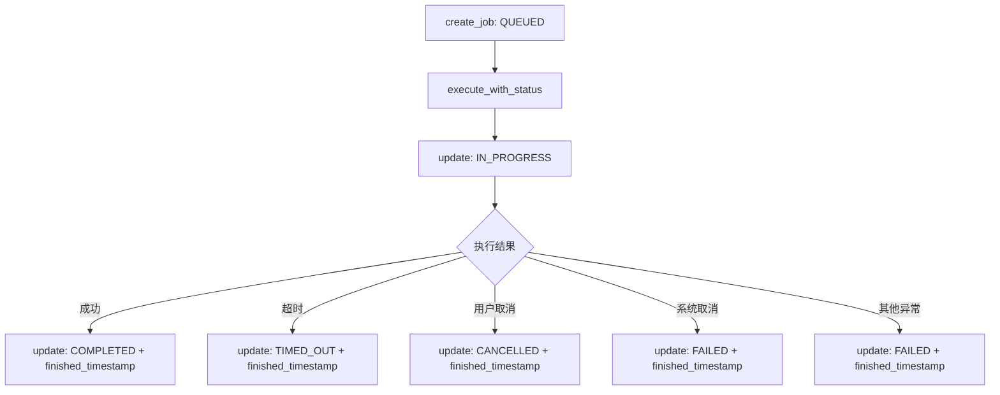
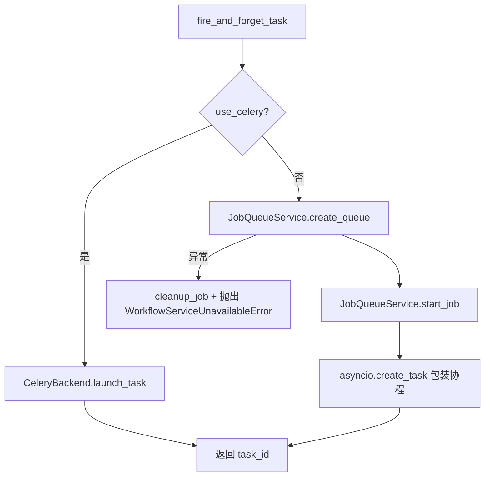
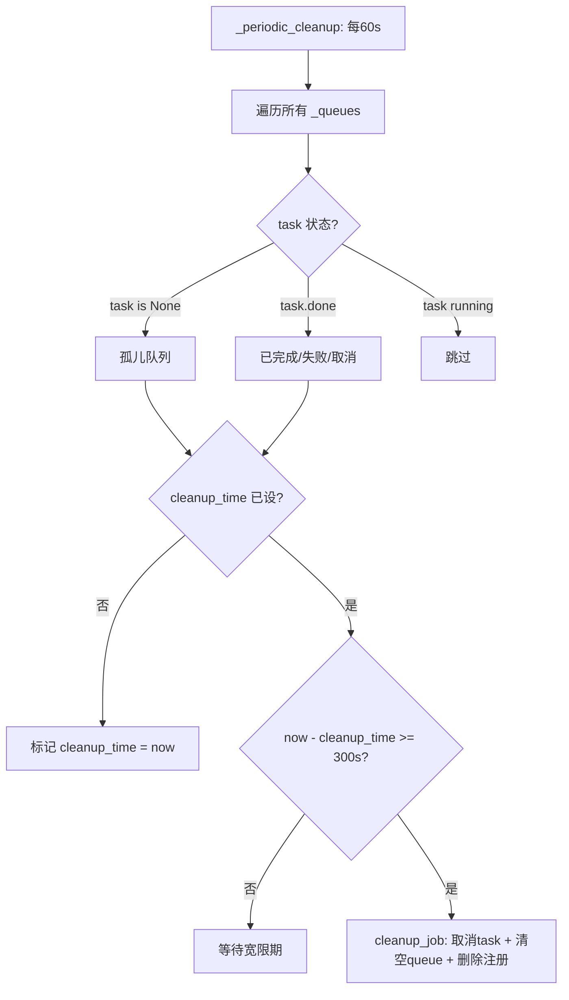

# PD-396.01 Langflow — 三层异步任务队列与双后端执行引擎

> 文档编号：PD-396.01
> 来源：Langflow `services/job_queue/service.py` `services/jobs/service.py` `api/v2/workflow.py`
> GitHub：https://github.com/langflow-ai/langflow.git
> 问题域：PD-396 异步任务队列 Async Task Queue
> 状态：可复用方案

---

## 第 1 章 问题与动机

### 1.1 核心问题

工作流引擎需要支持多种执行模式：用户可能希望同步等待结果、通过 SSE 流式获取进度、或提交后台任务稍后轮询。这三种模式对任务生命周期管理提出了不同要求：

- **同步模式**需要超时保护，防止长时间阻塞 HTTP 连接
- **后台模式**需要任务状态持久化，支持跨请求查询进度
- **所有模式**都需要优雅取消、资源清理、错误分类

更深层的问题是：本地开发用 asyncio 就够了，但生产环境可能需要 Celery 分布式队列。如何让同一套 API 代码无感切换底层执行引擎？

### 1.2 Langflow 的解法概述

Langflow 设计了三层分离的任务管理架构：

1. **API 层（V2 Workflow API）**：路由 sync/stream/background 三种执行模式，统一错误响应格式（`api/v2/workflow.py:109-258`）
2. **状态持久化层（JobService）**：将任务状态机（6 态）持久化到数据库，`execute_with_status` 包装器自动管理状态转换（`services/jobs/service.py:140-207`）
3. **执行引擎层（TaskService + JobQueueService）**：双后端抽象——本地用 asyncio Queue + CancelScope，生产用 Celery（`services/task/service.py:37-78`）

关键设计：JobQueueService 的两阶段清理（标记 + 宽限期），避免过早回收仍有消费者的队列资源。

### 1.3 设计思想

| 设计原则 | 具体实现 | 理由 | 替代方案 |
|----------|----------|------|----------|
| 执行模式与引擎解耦 | API 层只关心 sync/background 分支，不关心底层是 asyncio 还是 Celery | 同一 API 代码适配开发/生产环境 | 硬编码 Celery 依赖 |
| 状态机持久化 | 6 态枚举（QUEUED→IN_PROGRESS→COMPLETED/FAILED/CANCELLED/TIMED_OUT）写入 SQL | 支持跨请求查询、崩溃恢复 | 内存字典（重启丢失） |
| 两阶段清理 | 先标记 cleanup_time，等 300s 宽限期后再真正删除 | 防止消费者还在读取时资源被回收 | 立即删除（竞态风险） |
| 取消语义区分 | CancelledError.args 携带 USER/SYSTEM 标记码 | 用户主动取消 → CANCELLED，系统取消 → FAILED | 统一标记为 CANCELLED |
| 结构化错误响应 | 所有 HTTP 错误返回 `{error, code, message}` JSON | 客户端可按 code 编程处理 | 纯文本 detail |

---

## 第 2 章 源码实现分析

### 2.1 架构概览

```
┌─────────────────────────────────────────────────────────┐
│                   V2 Workflow API                        │
│  POST /workflows  GET /workflows  POST /workflows/stop  │
│         ┌──────────┬──────────┬──────────┐              │
│         │  sync    │  stream  │background│              │
│         └────┬─────┴────┬─────┴────┬─────┘              │
│              │          │          │                     │
│    wait_for(300s)    (501)    fire_and_forget            │
└──────────────┼──────────┼──────────┼────────────────────┘
               │          │          │
┌──────────────▼──────────▼──────────▼────────────────────┐
│              JobService (状态持久化层)                     │
│  create_job → execute_with_status → update_job_status   │
│  QUEUED → IN_PROGRESS → COMPLETED/FAILED/CANCELLED/TIMED_OUT │
│                    ↕ SQL Database                        │
└──────────────┬──────────────────────────────────────────┘
               │
┌──────────────▼──────────────────────────────────────────┐
│              TaskService (执行引擎抽象层)                  │
│         ┌────────────┬────────────────┐                 │
│         │ use_celery │ !use_celery    │                 │
│         │ CeleryBack │ JobQueueService│                 │
│         │ end        │ + asyncio.Queue│                 │
│         └────────────┴────────────────┘                 │
│                                                         │
│  JobQueueService:                                       │
│    _queues: {job_id → (Queue, EventManager, Task, ts)} │
│    _periodic_cleanup: 60s 轮询 + 300s 宽限期             │
└─────────────────────────────────────────────────────────┘
```

### 2.2 核心实现

#### 2.2.1 任务状态机与 execute_with_status 包装器



对应源码 `services/jobs/service.py:140-207`：

```python
async def execute_with_status(self, job_id: UUID, run_coro_func, *args, **kwargs):
    try:
        await self.update_job_status(job_id, JobStatus.IN_PROGRESS)
        result = await run_coro_func(*args, **kwargs)
    except asyncio.TimeoutError as e:
        await self.update_job_status(job_id, JobStatus.TIMED_OUT, finished_timestamp=True)
        raise
    except asyncio.CancelledError as exc:
        if exc.args and exc.args[0] == "LANGFLOW_USER_CANCELLED":
            await self.update_job_status(job_id, JobStatus.CANCELLED, finished_timestamp=True)
        else:
            await self.update_job_status(job_id, JobStatus.FAILED, finished_timestamp=True)
        raise
    except Exception as e:
        await self.update_job_status(job_id, JobStatus.FAILED, finished_timestamp=True)
        raise
    else:
        await self.update_job_status(job_id, JobStatus.COMPLETED, finished_timestamp=True)
        return result
```

这个包装器的精妙之处在于：它通过 `CancelledError.args` 的消息码区分用户取消和系统取消，映射到不同的终态。

#### 2.2.2 双后端 fire_and_forget 任务分发



对应源码 `services/task/service.py:37-78`：

```python
async def fire_and_forget_task(self, task_func, *args, **kwargs) -> str:
    if self.use_celery:
        task_id, _ = self.backend.launch_task(task_func, *args, **kwargs)
        return task_id

    graph = kwargs.get("graph")
    task_id = graph.run_id if graph and hasattr(graph, "run_id") else str(uuid4())
    job_queue_service = get_queue_service()
    try:
        job_queue_service.create_queue(task_id)
        job_queue_service.start_job(task_id, task_func(*args, **kwargs))
    except (RuntimeError, ValueError) as e:
        await job_queue_service.cleanup_job(task_id)
        raise WorkflowServiceUnavailableError(f"Local task queue error: {e!s}") from e
    except MemoryError as e:
        await job_queue_service.cleanup_job(task_id)
        raise WorkflowResourceError(f"Memory exhaustion: {e!s}") from e
    return task_id
```

注意本地模式下 `task_id` 优先使用 `graph.run_id`（即 job_id），保证 API 层返回的 job_id 与队列内部 task_id 一致，可以直接用 job_id 取消任务。

#### 2.2.3 两阶段队列清理



对应源码 `services/job_queue/service.py:286-325`：

```python
async def _cleanup_old_queues(self) -> None:
    current_time = asyncio.get_running_loop().time()
    for job_id in list(self._queues.keys()):
        _, _, task, cleanup_time = self._queues[job_id]
        should_cleanup = False
        if task is None:
            should_cleanup = True
            cleanup_reason = "Orphaned queue (no task associated)"
        elif task.done():
            should_cleanup = True
            if task.cancelled():
                cleanup_reason = "Task cancelled"
            elif task.exception() is not None:
                cleanup_reason = "Task failed with exception"
            else:
                cleanup_reason = "Task completed successfully"
        if should_cleanup:
            if cleanup_time is None:
                # Phase 1: 标记
                self._queues[job_id] = (*self._queues[job_id][:3], current_time)
            elif current_time - cleanup_time >= self.CLEANUP_GRACE_PERIOD:
                # Phase 2: 宽限期后真正清理
                await self.cleanup_job(job_id)
```

### 2.3 实现细节

**EventManager 与队列的绑定**：每个 job 创建时会同时创建一个 `asyncio.Queue` 和绑定的 `EventManager`（`service.py:125-151`）。EventManager 注册了 9 种事件类型（token、error、end、build_start 等），工作流执行过程中的所有事件通过 `queue.put_nowait()` 推送，SSE 端点可以从 queue 消费。

**取消传播链**：`stop_workflow` API → `task_service.revoke_task` → `job_queue_service.cleanup_job` → `task.cancel()` → `CancelledError("LANGFLOW_USER_CANCELLED")` → `execute_with_status` 捕获并写入 CANCELLED 状态。

**Job 模型的多态设计**：`JobType` 枚举支持 WORKFLOW/INGESTION/EVALUATION 三种任务类型，`asset_id` + `asset_type` 字段实现多态关联，同一张表服务多种业务场景。


---

## 第 3 章 迁移指南

### 3.1 迁移清单

**阶段 1：任务状态模型**
- [ ] 定义 JobStatus 枚举（至少 QUEUED/IN_PROGRESS/COMPLETED/FAILED）
- [ ] 创建 Job 数据库模型（job_id, flow_id, status, timestamps）
- [ ] 实现 CRUD 操作（create, update_status, get_by_id）

**阶段 2：状态包装器**
- [ ] 实现 `execute_with_status` 协程包装器
- [ ] 处理 TimeoutError → TIMED_OUT
- [ ] 处理 CancelledError → 区分 USER/SYSTEM 取消
- [ ] 确保所有终态都设置 finished_timestamp

**阶段 3：执行引擎**
- [ ] 实现 JobQueueService（asyncio.Queue + Task 注册表）
- [ ] 实现周期清理（两阶段：标记 + 宽限期）
- [ ] 实现 TaskService 抽象层（本地/Celery 双后端）

**阶段 4：API 集成**
- [ ] 实现 sync 模式（asyncio.wait_for 超时保护）
- [ ] 实现 background 模式（fire_and_forget + 返回 job_id）
- [ ] 实现 GET 状态查询端点
- [ ] 实现 POST stop 取消端点

### 3.2 适配代码模板

以下是一个可独立运行的最小化实现，包含状态机、双后端和超时保护：

```python
"""Minimal async task queue with status tracking — adapted from Langflow."""
import asyncio
from enum import Enum
from dataclasses import dataclass, field
from datetime import datetime, timezone
from uuid import UUID, uuid4
from typing import Any, Callable, Coroutine


class JobStatus(str, Enum):
    QUEUED = "queued"
    IN_PROGRESS = "in_progress"
    COMPLETED = "completed"
    FAILED = "failed"
    CANCELLED = "cancelled"
    TIMED_OUT = "timed_out"


@dataclass
class Job:
    job_id: UUID
    status: JobStatus = JobStatus.QUEUED
    created_at: datetime = field(default_factory=lambda: datetime.now(timezone.utc))
    finished_at: datetime | None = None
    result: Any = None
    error: str | None = None


class JobStore:
    """In-memory job store (replace with DB in production)."""
    def __init__(self):
        self._jobs: dict[UUID, Job] = {}

    def create(self, job_id: UUID) -> Job:
        job = Job(job_id=job_id)
        self._jobs[job_id] = job
        return job

    def update_status(self, job_id: UUID, status: JobStatus,
                      finished: bool = False) -> Job | None:
        job = self._jobs.get(job_id)
        if job:
            job.status = status
            if finished:
                job.finished_at = datetime.now(timezone.utc)
        return job

    def get(self, job_id: UUID) -> Job | None:
        return self._jobs.get(job_id)


class TaskQueue:
    """Local async task queue with two-phase cleanup."""
    CLEANUP_GRACE = 300  # seconds

    def __init__(self):
        self._tasks: dict[str, tuple[asyncio.Task, float | None]] = {}
        self._closed = False

    def submit(self, task_id: str, coro: Coroutine) -> None:
        task = asyncio.create_task(coro)
        self._tasks[task_id] = (task, None)

    async def cancel(self, task_id: str) -> bool:
        entry = self._tasks.pop(task_id, None)
        if entry and not entry[0].done():
            entry[0].cancel()
            try:
                await entry[0]
            except asyncio.CancelledError:
                pass
            return True
        return False


async def execute_with_status(
    store: JobStore, job_id: UUID,
    coro_func: Callable[..., Coroutine], *args, **kwargs
) -> Any:
    """Wraps a coroutine with automatic job status management."""
    store.update_status(job_id, JobStatus.IN_PROGRESS)
    try:
        result = await coro_func(*args, **kwargs)
    except asyncio.TimeoutError:
        store.update_status(job_id, JobStatus.TIMED_OUT, finished=True)
        raise
    except asyncio.CancelledError:
        store.update_status(job_id, JobStatus.CANCELLED, finished=True)
        raise
    except Exception:
        store.update_status(job_id, JobStatus.FAILED, finished=True)
        raise
    else:
        store.update_status(job_id, JobStatus.COMPLETED, finished=True)
        return result


# Usage example
async def run_workflow(data: dict) -> dict:
    await asyncio.sleep(2)  # simulate work
    return {"output": "done", "input": data}


async def main():
    store = JobStore()
    queue = TaskQueue()
    job_id = uuid4()

    # Background mode
    store.create(job_id)
    queue.submit(str(job_id),
                 execute_with_status(store, job_id, run_workflow, {"x": 1}))

    # Poll status
    await asyncio.sleep(0.1)
    print(store.get(job_id))  # IN_PROGRESS

    # Sync mode with timeout
    job_id2 = uuid4()
    store.create(job_id2)
    try:
        result = await asyncio.wait_for(
            execute_with_status(store, job_id2, run_workflow, {"x": 2}),
            timeout=5.0
        )
        print(result)
    except asyncio.TimeoutError:
        print("Timed out")
```

### 3.3 适用场景

| 场景 | 适用度 | 说明 |
|------|--------|------|
| 工作流/Pipeline 执行引擎 | ⭐⭐⭐ | 核心场景，三种执行模式完美匹配 |
| LLM 推理任务队列 | ⭐⭐⭐ | 长时间推理需要后台执行 + 超时保护 |
| 数据处理批任务 | ⭐⭐ | 适合，但大规模场景建议直接用 Celery |
| 实时交互式 Agent | ⭐ | 更适合 WebSocket，不需要任务队列 |
| 微服务间异步通信 | ⭐⭐ | 可用，但缺少消息确认和死信队列 |

---

## 第 4 章 测试用例

```python
"""Tests for async task queue — based on Langflow's JobService/JobQueueService patterns."""
import asyncio
import pytest
from uuid import uuid4


# --- Fixtures (using the migration template above) ---

@pytest.fixture
def store():
    return JobStore()

@pytest.fixture
def queue():
    return TaskQueue()


class TestJobStatusLifecycle:
    """Test the 6-state job status machine."""

    @pytest.mark.asyncio
    async def test_successful_execution(self, store):
        job_id = uuid4()
        store.create(job_id)

        async def work():
            return "result"

        result = await execute_with_status(store, job_id, work)
        assert result == "result"
        job = store.get(job_id)
        assert job.status == JobStatus.COMPLETED
        assert job.finished_at is not None

    @pytest.mark.asyncio
    async def test_timeout_sets_timed_out(self, store):
        job_id = uuid4()
        store.create(job_id)

        async def slow_work():
            await asyncio.sleep(10)

        with pytest.raises(asyncio.TimeoutError):
            await asyncio.wait_for(
                execute_with_status(store, job_id, slow_work),
                timeout=0.1
            )
        assert store.get(job_id).status == JobStatus.TIMED_OUT

    @pytest.mark.asyncio
    async def test_exception_sets_failed(self, store):
        job_id = uuid4()
        store.create(job_id)

        async def failing_work():
            raise ValueError("boom")

        with pytest.raises(ValueError):
            await execute_with_status(store, job_id, failing_work)
        assert store.get(job_id).status == JobStatus.FAILED

    @pytest.mark.asyncio
    async def test_cancellation_sets_cancelled(self, store):
        job_id = uuid4()
        store.create(job_id)

        async def blocking_work():
            await asyncio.sleep(100)

        task = asyncio.create_task(
            execute_with_status(store, job_id, blocking_work)
        )
        await asyncio.sleep(0.05)
        task.cancel()
        with pytest.raises(asyncio.CancelledError):
            await task
        assert store.get(job_id).status == JobStatus.CANCELLED


class TestTaskQueue:
    """Test queue submission and cancellation."""

    @pytest.mark.asyncio
    async def test_submit_and_complete(self, queue):
        completed = asyncio.Event()

        async def work():
            completed.set()

        queue.submit("t1", work())
        await asyncio.wait_for(completed.wait(), timeout=1.0)

    @pytest.mark.asyncio
    async def test_cancel_running_task(self, queue):
        async def long_work():
            await asyncio.sleep(100)

        queue.submit("t2", long_work())
        await asyncio.sleep(0.05)
        result = await queue.cancel("t2")
        assert result is True

    @pytest.mark.asyncio
    async def test_cancel_nonexistent_task(self, queue):
        result = await queue.cancel("nonexistent")
        assert result is False
```


---

## 第 5 章 跨域关联

| 关联域 | 关系类型 | 说明 |
|--------|----------|------|
| PD-03 容错与重试 | 协同 | `execute_with_status` 的异常分类处理（Timeout/Cancelled/Failed）是容错体系的一部分，两阶段清理防止资源泄漏 |
| PD-10 中间件管道 | 协同 | EventManager 注册 9 种事件类型，工作流执行中的事件通过 Queue 推送，可作为中间件管道的事件源 |
| PD-11 可观测性 | 依赖 | Job 模型记录 created_timestamp/finished_timestamp，支持执行耗时统计；结构化错误码支持监控告警 |
| PD-02 多 Agent 编排 | 协同 | 后台模式的 fire_and_forget 可用于启动多个并行工作流，通过 job_id 分别追踪状态 |
| PD-09 Human-in-the-Loop | 协同 | stop_workflow API 提供用户主动取消能力，CANCELLED 状态区分于系统 FAILED |

---

## 第 6 章 来源文件索引

| 文件 | 行范围 | 关键实现 |
|------|--------|----------|
| `src/backend/base/langflow/services/job_queue/service.py` | L19-L74 | JobQueueService 类定义与初始化，_queues 四元组注册表 |
| `src/backend/base/langflow/services/job_queue/service.py` | L125-L184 | create_queue / start_job：队列创建与任务启动 |
| `src/backend/base/langflow/services/job_queue/service.py` | L210-L264 | cleanup_job：取消任务 + 清空队列 + USER/SYSTEM 取消区分 |
| `src/backend/base/langflow/services/job_queue/service.py` | L266-L325 | _periodic_cleanup / _cleanup_old_queues：两阶段清理（标记 + 300s 宽限期） |
| `src/backend/base/langflow/services/jobs/service.py` | L65-L102 | create_job：创建 QUEUED 状态的 Job 记录 |
| `src/backend/base/langflow/services/jobs/service.py` | L140-L207 | execute_with_status：6 态状态机包装器，异常分类映射 |
| `src/backend/base/langflow/services/task/service.py` | L37-L78 | fire_and_forget_task：双后端分发（Celery / JobQueueService） |
| `src/backend/base/langflow/services/task/service.py` | L93-L104 | revoke_task：任务取消，本地模式通过 cleanup_job 传播 |
| `src/backend/base/langflow/services/task/backends/anyio.py` | L15-L51 | AnyIOTaskResult：CancelScope 包装的本地任务执行 |
| `src/backend/base/langflow/api/v2/workflow.py` | L109-L258 | execute_workflow：三模式路由 + 结构化错误响应 |
| `src/backend/base/langflow/api/v2/workflow.py` | L261-L300 | execute_sync_workflow_with_timeout：asyncio.wait_for 超时保护 |
| `src/backend/base/langflow/api/v2/workflow.py` | L424-L491 | execute_workflow_background：后台模式，先创建 Job 再 fire_and_forget |
| `src/backend/base/langflow/api/v2/workflow.py` | L642-L726 | stop_workflow：取消端点，revoke_task + 状态更新 |
| `src/backend/base/langflow/services/database/models/jobs/model.py` | L10-L69 | JobStatus 6 态枚举 + JobType 3 类枚举 + Job SQLModel |

---

## 第 7 章 横向对比维度

```json comparison_data
{
  "project": "Langflow",
  "dimensions": {
    "队列架构": "三层分离：API路由层 + JobService状态持久化层 + TaskService双后端执行层",
    "状态模型": "6态枚举（QUEUED/IN_PROGRESS/COMPLETED/FAILED/CANCELLED/TIMED_OUT）持久化到SQL",
    "执行后端": "双后端抽象：本地asyncio.Queue + CancelScope，生产Celery，配置切换",
    "超时保护": "asyncio.wait_for(300s) 包装同步执行，TimeoutError映射TIMED_OUT状态",
    "清理策略": "两阶段清理：60s轮询标记 + 300s宽限期后真正删除，防止竞态回收",
    "取消语义": "CancelledError.args携带USER/SYSTEM标记码，区分用户取消与系统取消",
    "事件系统": "EventManager绑定asyncio.Queue，9种预注册事件类型支持SSE推送"
  }
}
```

### 域元数据补充

```json domain_metadata
{
  "solution_summary": "Langflow用三层分离架构（API路由/JobService状态持久化/TaskService双后端引擎）管理异步工作流，支持6态状态机、两阶段宽限期清理和CancelledError语义区分",
  "description": "异步任务队列需要解决执行引擎可替换性和资源安全回收问题",
  "sub_problems": [
    "双后端引擎切换（本地asyncio vs 分布式Celery）",
    "取消语义区分（用户主动取消 vs 系统异常取消）",
    "孤儿队列检测与回收"
  ],
  "best_practices": [
    "两阶段清理（标记+宽限期）防止消费者竞态",
    "CancelledError.args携带语义标记码区分取消来源",
    "后台模式先持久化Job再fire_and_forget确保状态可查"
  ]
}
```

