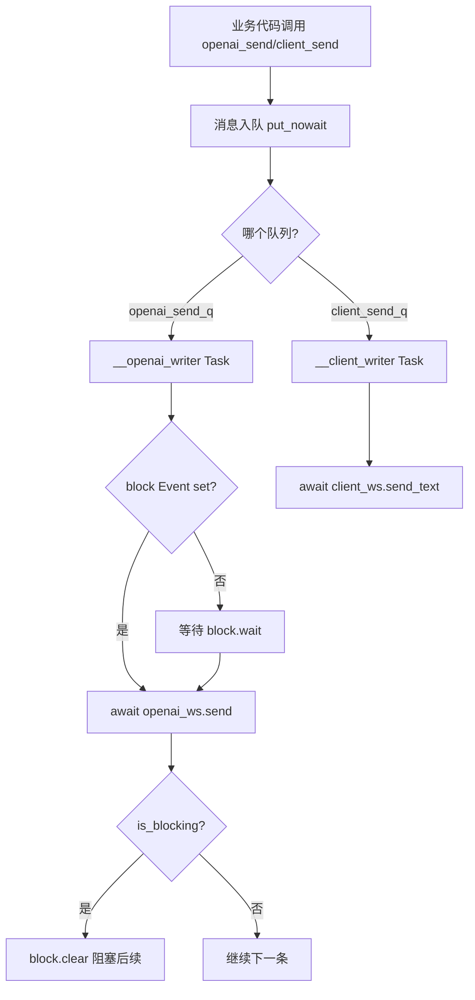
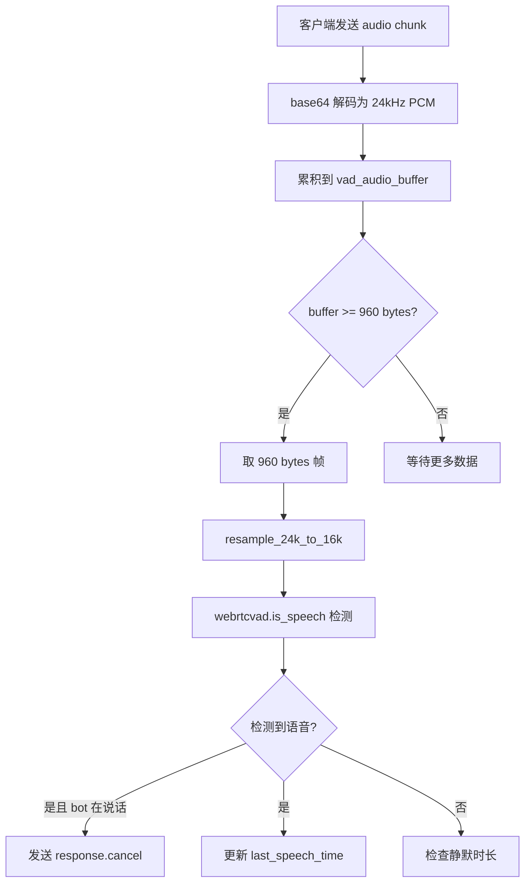

# PD-397.01 Langflow — WebSocket 双端语音交互与 Flow 执行桥接

> 文档编号：PD-397.01
> 来源：Langflow `src/backend/base/langflow/api/v1/voice_mode.py`
> GitHub：https://github.com/langflow-ai/langflow.git
> 问题域：PD-397 多模态交互 Multimodal Interaction
> 状态：可复用方案

---

## 第 1 章 问题与动机

### 1.1 核心问题

低代码/可视化 Agent 平台需要将语音交互能力嫁接到已有的 Flow（工作流）执行引擎上。核心挑战：

1. **双向实时音频流**：浏览器麦克风采集的 PCM16 音频需要实时送达后端，后端生成的语音回复需要实时回传前端播放，延迟必须控制在人类可感知的对话节奏内（< 500ms）。
2. **三方 WebSocket 桥接**：后端同时维护与浏览器客户端和 OpenAI Realtime API 的两条 WebSocket 连接，需要在两条连接之间做事件路由、协议转换和状态同步。
3. **语音驱动 Flow 执行**：语音对话中的 function_call 需要触发 Langflow 的 Flow 构建与执行，执行结果再注入回语音对话上下文。
4. **多 TTS 供应商切换**：运行时在 OpenAI 原生音频和 ElevenLabs TTS 之间动态切换，需要改变 OpenAI session 的 modalities 配置。
5. **VAD 打断（Barge-in）**：用户说话时需要检测语音活动并取消正在播放的 AI 回复，实现自然的对话打断。

### 1.2 Langflow 的解法概述

1. **双 WebSocket 桥接架构**：后端作为中间人，用 `websockets` 库连接 OpenAI Realtime API，用 FastAPI WebSocket 接收浏览器客户端，通过 `SendQueues` 双队列异步写入器实现非阻塞消息转发（`voice_mode.py:330-392`）。
2. **Flow-as-Tool 模式**：将 Langflow Flow 注册为 OpenAI Realtime session 的 function tool，语音对话中 AI 自动调用 `execute_flow` 触发 Flow 构建（`voice_mode.py:736-746`）。
3. **三层会话指令分层**：Permanent / Default / Additional 三级指令优先级体系，确保 Flow 工具调用规则不被用户指令覆盖（`voice_mode.py:44-72`）。
4. **客户端 AudioWorklet 流处理**：前端使用 Web Audio API 的 AudioWorkletProcessor 实现 128 样本帧的低延迟音频采集与播放（`streamProcessor.ts:2-91`）。
5. **webrtcvad 本地 VAD**：后端用 `webrtcvad` 库在 16kHz 采样率下做语音活动检测，检测到用户说话时发送 `response.cancel` 实现打断（`voice_mode.py:777-807`）。

### 1.3 设计思想

| 设计原则 | 具体实现 | 理由 | 替代方案 |
|----------|----------|------|----------|
| 中间人桥接 | 后端同时持有 client_ws 和 openai_ws | 可在中间层注入 Flow 执行、TTS 切换等业务逻辑 | 客户端直连 OpenAI（无法注入 Flow） |
| 异步队列写入 | SendQueues 双队列 + asyncio.Task writer | 避免 WebSocket 写入阻塞事件循环 | 直接 await send（可能阻塞） |
| 指令分层 | Permanent > Additional > Default | 防止用户 prompt 注入覆盖工具调用规则 | 单一 system prompt（易被覆盖） |
| 懒加载 VAD | `@lru_cache(maxsize=1)` 延迟导入 webrtcvad | VAD 是可选功能，不影响无 barge-in 场景启动 | 启动时全量加载 |
| 双模式 TTS | ElevenLabs 时 modalities=["text"]，OpenAI 时 modalities=["audio","text"] | ElevenLabs 需要文本输入再转语音，OpenAI 直接输出音频 | 统一走文本再转语音（延迟高） |

---

## 第 2 章 源码实现分析

### 2.1 架构概览

Langflow 语音模式的整体架构是一个三方 WebSocket 桥接系统：

```
┌──────────────────┐         ┌──────────────────────┐         ┌──────────────────┐
│   Browser Client  │◄──WS──►│   Langflow Backend    │◄──WS──►│  OpenAI Realtime  │
│                   │         │                       │         │       API         │
│  AudioWorklet     │         │  SendQueues           │         │                   │
│  (24kHz PCM16)    │         │  ├─ openai_send_q     │         │  gpt-4o-mini      │
│                   │         │  └─ client_send_q     │         │  -realtime        │
│  VoiceStore       │         │                       │         │                   │
│  (Zustand)        │         │  VoiceConfig          │         │  server_vad       │
│                   │         │  TTSConfig            │         │  whisper-1        │
│                   │         │  FunctionCall         │         │                   │
│                   │         │  ├─ execute_flow()    │         │                   │
│                   │         │  └─ progress msg      │         │                   │
│                   │         │                       │         │                   │
│                   │         │  ElevenLabsClient     │         │                   │
│                   │         │  (Singleton Manager)  │         │                   │
└──────────────────┘         └──────────────────────┘         └──────────────────┘
         │                              │
         │                    ┌─────────┴─────────┐
         │                    │  Flow Engine       │
         │                    │  build_flow_and_   │
         │                    │  stream()          │
         │                    └───────────────────┘
```

两个 WebSocket 端点：
- `/ws/flow_as_tool/{flow_id}` — 全功能语音模式，Flow 作为 OpenAI function tool
- `/ws/flow_tts/{flow_id}` — 轻量 TTS 模式，语音转文字后直接执行 Flow

### 2.2 核心实现

#### 2.2.1 SendQueues 双队列异步写入器



对应源码 `voice_mode.py:330-392`：

```python
class SendQueues:
    def __init__(self, openai_ws, client_ws, log_event):
        self.openai_ws = openai_ws
        self.openai_send_q: asyncio.Queue[tuple] = asyncio.Queue()
        self.openai_writer_task = asyncio.create_task(self.__openai_writer())
        self.block: asyncio.Event = asyncio.Event()
        self.block.set()
        self.client_ws = client_ws
        self.client_send_q: asyncio.Queue[dict] = asyncio.Queue()
        self.client_writer_task = asyncio.create_task(self.__client_writer())

    def openai_send(self, payload, *, is_blocking=False):
        self.openai_send_q.put_nowait([payload, is_blocking])

    async def __openai_writer(self):
        while True:
            msg, is_blocking = await self.openai_send_q.get()
            if msg is None:
                break
            await self.block.wait()
            await self.openai_ws.send(json.dumps(msg))
            if is_blocking:
                self.block.clear()
```

关键设计：`is_blocking` 参数用于 `response.create` 调用——发送后阻塞队列，等待 OpenAI 返回 `response.done` 后调用 `openai_unblock()` 恢复，防止并发请求导致 OpenAI API 报错。

#### 2.2.2 VAD 语音活动检测与 Barge-in



对应源码 `voice_mode.py:777-807` 和 `voice_utils.py:18-43`：

```python
# voice_utils.py:18-43
def resample_24k_to_16k(frame_24k_bytes):
    if len(frame_24k_bytes) != BYTES_PER_24K_FRAME:  # 960 bytes
        raise ValueError(f"Expected {BYTES_PER_24K_FRAME} bytes, got {len(frame_24k_bytes)}")
    frame_24k = np.frombuffer(frame_24k_bytes, dtype=np.int16)
    frame_16k = resample(frame_24k, int(len(frame_24k) * 2 / 3))  # 480→320 samples
    return frame_16k.astype(np.int16).tobytes()

# voice_mode.py:789-797 (VAD 核心循环)
while len(vad_audio_buffer) >= BYTES_PER_24K_FRAME:
    frame_24k = vad_audio_buffer[:BYTES_PER_24K_FRAME]
    del vad_audio_buffer[:BYTES_PER_24K_FRAME]
    frame_16k = resample_24k_to_16k(frame_24k)
    is_speech = vad.is_speech(frame_16k, VAD_SAMPLE_RATE_16K)
    if is_speech and bot_speaking_flag[0]:
        msg_handler.openai_send({"type": "response.cancel"})
        bot_speaking_flag[0] = False
```

### 2.3 实现细节

#### Flow-as-Tool 注册与执行

Flow 被动态注册为 OpenAI Realtime session 的 function tool（`voice_mode.py:736-746`）：

```python
flow_tool = {
    "name": "execute_flow",
    "type": "function",
    "description": flow_description or "Execute the flow with the given input",
    "parameters": {
        "type": "object",
        "properties": {"input": {"type": "string", "description": "The input to send to the flow"}},
        "required": ["input"],
    },
}
```

当 OpenAI 返回 `response.function_call_arguments.done` 时，`FunctionCall.execute()` 异步调用 `build_flow_and_stream()`（`voice_mode.py:427-432`），Flow 执行结果通过 `conversation.item.create` 注入回 OpenAI 对话上下文。

#### 前端 AudioWorklet 流处理

`streamProcessor.ts` 实现了一个双向音频处理器：
- **输入方向**：128 样本帧采集 → Float32 转 Int16 → postMessage 发送到主线程 → base64 编码 → WebSocket 发送
- **输出方向**：主线程 postMessage 音频数据 → outputBuffers 队列 → process() 中逐帧播放 → 0.8 增益控制

前端 AudioContext 固定 24kHz 采样率（`use-initialize-audio.ts:14`），与 OpenAI Realtime API 的 PCM16 格式对齐。

#### 消息持久化与交替序列

`add_message_to_db()` 强制消息交替序列（`voice_mode.py:256-286`）：如果连续两条消息来自同一发送方（如 AI/AI），会等待最多 5 秒让另一方的消息先入库，避免对话历史中出现连续同方消息。

#### ElevenLabs 单例管理

`ElevenLabsClientManager` 使用类级单例模式（`voice_mode.py:166-196`），API key 从用户变量服务或环境变量获取，客户端实例全局复用。


---

## 第 3 章 迁移指南

### 3.1 迁移清单

**阶段 1：WebSocket 双端桥接（核心）**
- [ ] 实现 FastAPI WebSocket 端点接收客户端连接
- [ ] 用 `websockets` 库建立到 OpenAI Realtime API 的上游连接
- [ ] 实现 SendQueues 双队列异步写入器（含 blocking 机制）
- [ ] 实现 `forward_to_openai()` 和 `forward_to_client()` 双向转发协程
- [ ] 用 `asyncio.gather()` 并发运行双向转发

**阶段 2：语音活动检测（可选）**
- [ ] 安装 `webrtcvad` + `scipy` + `numpy`
- [ ] 实现 24kHz → 16kHz 重采样函数
- [ ] 实现 VAD 检测循环 + barge-in 取消逻辑

**阶段 3：业务集成**
- [ ] 将业务逻辑注册为 OpenAI function tool
- [ ] 实现 function_call 处理与结果注入
- [ ] 实现多 TTS 供应商切换（OpenAI / ElevenLabs）

**阶段 4：前端音频**
- [ ] 实现 AudioWorklet 流处理器（采集 + 播放）
- [ ] 实现 WebSocket 连接管理与重连
- [ ] 实现音频队列播放与打断

### 3.2 适配代码模板

#### 最小可用的 WebSocket 桥接服务器

```python
import asyncio
import json
from fastapi import APIRouter, WebSocket
from starlette.websockets import WebSocketDisconnect
import websockets

router = APIRouter(prefix="/voice")

OPENAI_REALTIME_URL = "wss://api.openai.com/v1/realtime?model=gpt-4o-mini-realtime-preview"

class SendQueues:
    """双队列异步写入器，防止 WebSocket 写入阻塞事件循环。"""
    def __init__(self, openai_ws, client_ws):
        self.openai_ws = openai_ws
        self.client_ws = client_ws
        self.openai_q: asyncio.Queue = asyncio.Queue()
        self.client_q: asyncio.Queue = asyncio.Queue()
        self.block = asyncio.Event()
        self.block.set()
        self._openai_task = asyncio.create_task(self._openai_writer())
        self._client_task = asyncio.create_task(self._client_writer())

    def to_openai(self, payload: dict, *, blocking: bool = False):
        self.openai_q.put_nowait((payload, blocking))

    def to_client(self, payload: dict):
        self.client_q.put_nowait(payload)

    def unblock(self):
        self.block.set()

    async def _openai_writer(self):
        while True:
            msg, blocking = await self.openai_q.get()
            if msg is None:
                break
            await self.block.wait()
            await self.openai_ws.send(json.dumps(msg))
            if blocking:
                self.block.clear()

    async def _client_writer(self):
        while True:
            msg = await self.client_q.get()
            if msg is None:
                break
            await self.client_ws.send_text(json.dumps(msg))

    async def close(self):
        self.openai_q.put_nowait((None, False))
        self.client_q.put_nowait(None)
        await self._openai_task
        await self._client_task


@router.websocket("/ws/{session_id}")
async def voice_ws(client_ws: WebSocket, session_id: str):
    await client_ws.accept()
    openai_key = "YOUR_KEY"  # 从用户服务获取

    headers = {"Authorization": f"Bearer {openai_key}", "OpenAI-Beta": "realtime=v1"}
    async with websockets.connect(OPENAI_REALTIME_URL, extra_headers=headers) as openai_ws:
        queues = SendQueues(openai_ws, client_ws)

        # 初始化 session
        queues.to_openai({
            "type": "session.update",
            "session": {
                "modalities": ["text", "audio"],
                "voice": "echo",
                "input_audio_format": "pcm16",
                "output_audio_format": "pcm16",
                "turn_detection": {"type": "server_vad", "threshold": 0.1},
                "tools": [],  # 在此注册你的业务 function tools
            }
        })

        async def forward_to_openai():
            try:
                while True:
                    text = await client_ws.receive_text()
                    msg = json.loads(text)
                    queues.to_openai(msg)
            except WebSocketDisconnect:
                pass

        async def forward_to_client():
            try:
                while True:
                    data = await openai_ws.recv()
                    event = json.loads(data)
                    queues.to_client(event)
                    if event.get("type") == "response.done":
                        queues.unblock()
            except websockets.ConnectionClosed:
                pass

        try:
            await asyncio.gather(
                asyncio.create_task(forward_to_openai()),
                asyncio.create_task(forward_to_client()),
            )
        finally:
            await queues.close()
```

#### 前端 AudioWorklet 最小模板

```typescript
// streamProcessor.ts — 注册为 AudioWorklet
const workletCode = `
class StreamProcessor extends AudioWorkletProcessor {
  constructor() {
    super();
    this.outputBuffers = [];
    this.isPlaying = false;
    this.port.onmessage = (event) => {
      if (event.data.type === 'playback') {
        this.outputBuffers.push(event.data.audio);
        this.isPlaying = true;
      } else if (event.data.type === 'stop_playback') {
        this.outputBuffers = [];
        this.isPlaying = false;
      }
    };
  }
  process(inputs, outputs) {
    const input = inputs[0];
    if (input?.[0]) {
      // 采集：Float32 → Int16 → 发送到主线程
      const pcm16 = new Int16Array(input[0].length);
      for (let i = 0; i < input[0].length; i++) {
        pcm16[i] = Math.max(-1, Math.min(1, input[0][i])) * 0x7FFF;
      }
      this.port.postMessage({ type: 'input', audio: pcm16 });
    }
    // 播放：从 outputBuffers 取数据写入 output
    const output = outputs[0];
    if (output?.[0] && this.isPlaying && this.outputBuffers.length > 0) {
      const buf = this.outputBuffers[0];
      const len = Math.min(output[0].length, buf.length);
      for (let ch = 0; ch < output.length; ch++) {
        for (let i = 0; i < len; i++) output[ch][i] = buf[i] * 0.8;
      }
      if (len === buf.length) this.outputBuffers.shift();
      else this.outputBuffers[0] = buf.slice(len);
      if (!this.outputBuffers.length) {
        this.isPlaying = false;
        this.port.postMessage({ type: 'done' });
      }
    }
    return true;
  }
}
registerProcessor('stream_processor', StreamProcessor);
`;
```

### 3.3 适用场景

| 场景 | 适用度 | 说明 |
|------|--------|------|
| 低代码平台语音交互 | ⭐⭐⭐ | 完美匹配：Flow/工作流作为 function tool |
| 客服/助手语音对话 | ⭐⭐⭐ | 双端桥接 + 多 TTS 供应商切换 |
| 语音驱动 Agent 执行 | ⭐⭐ | 需要适配 Agent 框架的 function_call 协议 |
| 纯语音转文字场景 | ⭐ | 过度设计，直接用 Whisper API 更简单 |
| 多人语音会议 | ⭐ | 架构不支持多路音频混合 |

---

## 第 4 章 测试用例

```python
import asyncio
import json
import pytest
import numpy as np
from unittest.mock import AsyncMock, MagicMock, patch


class TestResample24kTo16k:
    """测试 voice_utils.resample_24k_to_16k"""

    def test_normal_960_bytes(self):
        """正常 20ms 帧：960 bytes (24kHz) → 640 bytes (16kHz)"""
        from langflow.utils.voice_utils import resample_24k_to_16k, BYTES_PER_24K_FRAME
        # 生成 480 个 int16 样本 = 960 bytes
        samples = np.sin(np.linspace(0, 2 * np.pi, 480)).astype(np.float32)
        pcm16 = (samples * 32767).astype(np.int16)
        frame_24k = pcm16.tobytes()
        assert len(frame_24k) == BYTES_PER_24K_FRAME

        result = resample_24k_to_16k(frame_24k)
        # 16kHz 20ms = 320 samples = 640 bytes
        assert len(result) == 640

    def test_wrong_size_raises(self):
        """非 960 bytes 输入应抛出 ValueError"""
        from langflow.utils.voice_utils import resample_24k_to_16k
        with pytest.raises(ValueError, match="Expected exactly"):
            resample_24k_to_16k(b"\x00" * 100)

    def test_silence_input(self):
        """全零输入应输出接近全零"""
        from langflow.utils.voice_utils import resample_24k_to_16k
        silence = b"\x00" * 960
        result = resample_24k_to_16k(silence)
        samples = np.frombuffer(result, dtype=np.int16)
        assert np.max(np.abs(samples)) < 10  # 接近零


class TestSendQueues:
    """测试 SendQueues 双队列写入器"""

    @pytest.mark.asyncio
    async def test_openai_send_forwards_message(self):
        """消息应通过队列转发到 OpenAI WebSocket"""
        openai_ws = AsyncMock()
        client_ws = AsyncMock()
        log_event = MagicMock()

        from langflow.api.v1.voice_mode import SendQueues
        queues = SendQueues(openai_ws, client_ws, log_event)
        queues.openai_send({"type": "test"})
        await asyncio.sleep(0.1)
        openai_ws.send.assert_called_once()
        await queues.close()

    @pytest.mark.asyncio
    async def test_blocking_prevents_next_send(self):
        """is_blocking=True 应阻塞后续消息直到 unblock"""
        openai_ws = AsyncMock()
        client_ws = AsyncMock()
        log_event = MagicMock()

        from langflow.api.v1.voice_mode import SendQueues
        queues = SendQueues(openai_ws, client_ws, log_event)
        queues.openai_send({"type": "first"}, is_blocking=True)
        queues.openai_send({"type": "second"})
        await asyncio.sleep(0.1)
        # 第一条发送后阻塞，第二条不应发送
        assert openai_ws.send.call_count == 1
        queues.openai_unblock()
        await asyncio.sleep(0.1)
        assert openai_ws.send.call_count == 2
        await queues.close()


class TestVoiceConfig:
    """测试 VoiceConfig 配置管理"""

    def test_default_session_dict(self):
        from langflow.api.v1.voice_mode import VoiceConfig
        config = VoiceConfig(session_id="test-123")
        session = config.get_session_dict()
        assert session["modalities"] == ["text", "audio"]
        assert session["voice"] == "echo"
        assert session["turn_detection"]["type"] == "server_vad"
        assert "tools" in session

    def test_elevenlabs_disabled_by_default(self):
        from langflow.api.v1.voice_mode import VoiceConfig
        config = VoiceConfig(session_id="test-456")
        assert config.use_elevenlabs is False
        assert config.barge_in_enabled is False


class TestSessionInstructions:
    """测试三层指令分层"""

    def test_permanent_section_exists(self):
        from langflow.api.v1.voice_mode import SESSION_INSTRUCTIONS
        assert "[PERMANENT]" in SESSION_INSTRUCTIONS
        assert "execute_flow" in SESSION_INSTRUCTIONS

    def test_instruction_priority_order(self):
        from langflow.api.v1.voice_mode import SESSION_INSTRUCTIONS
        perm_idx = SESSION_INSTRUCTIONS.index("[PERMANENT]")
        default_idx = SESSION_INSTRUCTIONS.index("[DEFAULT]")
        additional_idx = SESSION_INSTRUCTIONS.index("[ADDITIONAL]")
        assert perm_idx < default_idx < additional_idx
```


---

## 第 5 章 跨域关联

| 关联域 | 关系类型 | 说明 |
|--------|----------|------|
| PD-04 工具系统 | 依赖 | Flow 被注册为 OpenAI Realtime 的 function tool，工具注册/调用机制是语音交互的核心桥梁 |
| PD-03 容错与重试 | 协同 | WebSocket 断连处理、function_call 异常捕获（JSON 解析错误、连接错误、Flow 执行错误）需要分层容错 |
| PD-09 Human-in-the-Loop | 协同 | VAD barge-in 本质是一种实时的人类干预机制，用户可以随时打断 AI 回复 |
| PD-10 中间件管道 | 协同 | SendQueues 的 blocking 机制类似中间件管道的流控，`forward_to_openai` / `forward_to_client` 是事件路由管道 |
| PD-06 记忆持久化 | 依赖 | `add_message_to_db()` 将语音对话的转录文本持久化到数据库，支持对话历史回溯 |
| PD-11 可观测性 | 协同 | `create_event_logger()` 实现事件去重日志，追踪 4 个方向的消息流（LF→OpenAI, OpenAI→LF, Client→LF, LF→Client） |

---

## 第 6 章 来源文件索引

| 文件 | 行范围 | 关键实现 |
|------|--------|----------|
| `src/backend/base/langflow/api/v1/voice_mode.py` | L38-77 | 路由定义、常量、SESSION_INSTRUCTIONS 三层指令 |
| `src/backend/base/langflow/api/v1/voice_mode.py` | L82-85 | `get_vad()` 懒加载 webrtcvad |
| `src/backend/base/langflow/api/v1/voice_mode.py` | L126-163 | `VoiceConfig` 配置类与 OpenAI session 默认参数 |
| `src/backend/base/langflow/api/v1/voice_mode.py` | L166-196 | `ElevenLabsClientManager` 单例管理 |
| `src/backend/base/langflow/api/v1/voice_mode.py` | L208-253 | `TTSConfig` TTS 配置与 OpenAI TTS 客户端 |
| `src/backend/base/langflow/api/v1/voice_mode.py` | L256-327 | 消息持久化：交替序列强制、队列处理 |
| `src/backend/base/langflow/api/v1/voice_mode.py` | L330-392 | `SendQueues` 双队列异步写入器 |
| `src/backend/base/langflow/api/v1/voice_mode.py` | L410-506 | `handle_function_call` Flow 执行与结果注入 |
| `src/backend/base/langflow/api/v1/voice_mode.py` | L622-694 | `FunctionCall` 类：进度消息 + 异步执行 |
| `src/backend/base/langflow/api/v1/voice_mode.py` | L698-1124 | `flow_as_tool_websocket` 主端点：双向转发、VAD、事件路由 |
| `src/backend/base/langflow/api/v1/voice_mode.py` | L1126-1326 | `flow_tts_websocket` TTS 模式端点 |
| `src/backend/base/langflow/utils/voice_utils.py` | L1-43 | 音频常量、`resample_24k_to_16k` 重采样 |
| `src/backend/base/langflow/utils/voice_utils.py` | L77-91 | `write_audio_to_file` 异步音频写入 |
| `src/backend/base/langflow/api/router.py` | L26 | voice_mode_router 注册到 v1 路由 |
| `src/frontend/src/stores/voiceStore.ts` | L1-38 | Zustand 语音状态管理 |
| `src/frontend/src/modals/.../voice-assistant.tsx` | L1-488 | VoiceAssistant 组件：音频初始化、录音控制、设置面板 |
| `src/frontend/src/modals/.../streamProcessor.ts` | L1-91 | AudioWorklet 双向流处理器 |
| `src/frontend/src/modals/.../use-start-conversation.ts` | L1-86 | WebSocket 连接建立与初始配置发送 |
| `src/frontend/src/modals/.../use-handle-websocket-message.ts` | L1-142 | WebSocket 消息处理：音频播放、Flow 构建进度、错误处理 |
| `src/frontend/src/modals/.../use-interrupt-playback.ts` | L1-13 | 音频播放打断：清空队列 + stop_playback |
| `src/frontend/src/modals/.../use-initialize-audio.ts` | L1-30 | AudioContext 初始化（24kHz 采样率） |

---

## 第 7 章 横向对比维度

```json comparison_data
{
  "project": "Langflow",
  "dimensions": {
    "通信协议": "WebSocket 双端桥接，后端中间人转发 OpenAI Realtime API",
    "音频格式": "PCM16 24kHz，scipy resample 降采样到 16kHz 供 VAD",
    "VAD 实现": "webrtcvad mode=3 + 20ms 帧检测 + barge-in 取消",
    "TTS 供应商": "OpenAI Realtime 原生音频 / ElevenLabs 双供应商运行时切换",
    "业务集成": "Flow-as-Tool 模式，工作流注册为 OpenAI function tool",
    "指令管理": "Permanent/Default/Additional 三层优先级指令分层",
    "前端音频": "AudioWorklet 128 样本帧双向流处理器"
  }
}
```

### 域元数据补充

```json domain_metadata
{
  "solution_summary": "Langflow 用 WebSocket 双端桥接架构连接浏览器与 OpenAI Realtime API，通过 SendQueues 双队列异步写入器实现非阻塞消息转发，将 Flow 工作流注册为 function tool 实现语音驱动执行",
  "description": "后端中间人桥接模式下的语音-工作流集成与多供应商 TTS 切换",
  "sub_problems": [
    "三方 WebSocket 桥接与事件路由",
    "语音对话中的工作流触发与结果注入",
    "多 TTS 供应商运行时动态切换",
    "消息持久化交替序列保证"
  ],
  "best_practices": [
    "双队列异步写入器防止 WebSocket 写入阻塞事件循环",
    "三层指令分层防止用户 prompt 注入覆盖系统规则",
    "AudioWorklet 128 样本帧实现低延迟前端音频采集播放"
  ]
}
```

