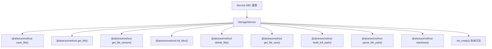
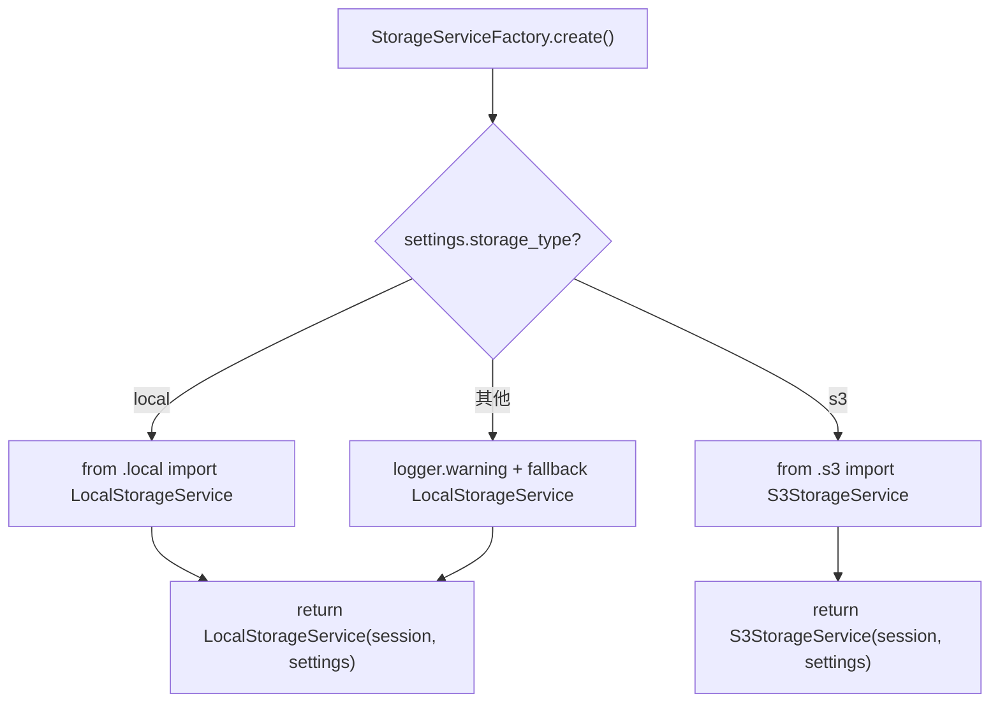
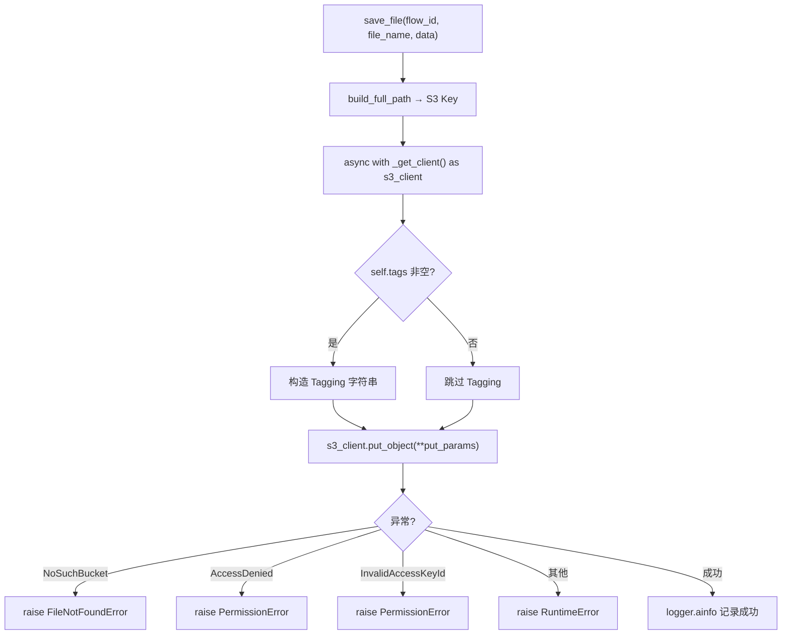

# PD-398.01 Langflow — StorageService 抽象层与双后端工厂切换

> 文档编号：PD-398.01
> 来源：Langflow `services/storage/`
> GitHub：https://github.com/langflow-ai/langflow.git
> 问题域：PD-398 对象存储抽象 Object Storage Abstraction
> 状态：可复用方案

---

## 第 1 章 问题与动机

### 1.1 核心问题

Agent 应用在处理用户上传文件、生成产物（图片、文档、中间数据）时，需要一个统一的文件存储接口。开发阶段用本地文件系统足够，但生产环境需要 S3/OSS 等对象存储来支撑水平扩展、持久化和多实例共享。

如果存储逻辑散落在业务代码中，切换后端就意味着全量改代码。Langflow 面临的具体场景是：每个 Flow（工作流）会产生上传文件、中间产物、导出结果，这些文件需要按 `flow_id` 隔离存储，且在本地开发和云端部署之间无缝切换。

### 1.2 Langflow 的解法概述

1. **ABC 抽象基类** — `StorageService` 定义 7 个抽象方法（save/get/get_stream/list/delete/get_size/teardown），所有业务代码只依赖抽象接口（`service.py:19-91`）
2. **双后端实现** — `LocalStorageService` 基于 `anyio.Path` + `aiofile` 异步文件 IO（`local.py:23-241`），`S3StorageService` 基于 `aioboto3` 异步 S3 客户端（`s3.py:24-354`）
3. **工厂模式切换** — `StorageServiceFactory` 读取 `settings.storage_type` 配置项，按 `"local"` / `"s3"` 字符串分发实例化（`factory.py:10-30`）
4. **DI 容器集成** — 通过 `ServiceManager` + `get_storage_service()` 全局单例注入，业务代码零感知后端类型（`deps.py:92-100`）
5. **storage_utils 桥接层** — 提供 `read_file_bytes/read_file_text/get_file_size/file_exists` 等便捷函数，自动根据 `storage_type` 选择本地路径读取或 S3 API 调用（`storage_utils.py:49-174`）

### 1.3 设计思想

| 设计原则 | 具体实现 | 理由 | 替代方案 |
|----------|----------|------|----------|
| 接口隔离 | ABC 基类 7 个 `@abstractmethod` | 强制子类实现完整契约，编译期发现遗漏 | Protocol（运行时鸭子类型，无强制约束） |
| 配置驱动 | `storage_type` 字符串 + 工厂 if/elif | 部署时改环境变量即可切换，零代码改动 | 注册表模式（更灵活但过度设计） |
| 全异步 IO | `aiofile` + `aioboto3` | 文件操作不阻塞事件循环，适合高并发 Web 服务 | 同步 IO + 线程池（额外线程开销） |
| flow_id 命名空间 | 所有方法第一参数 `flow_id: str` | 天然多租户隔离，S3 用前缀、本地用子目录 | 全局扁平存储（需额外隔离层） |
| 懒加载依赖 | `aioboto3` 在 S3 实现的 `__init__` 中 import | 本地模式不需要安装 S3 SDK | 顶层 import（本地模式也要装 aioboto3） |

---

## 第 2 章 源码实现分析

### 2.1 架构概览

```
┌─────────────────────────────────────────────────────────┐
│                    业务层 (Components)                    │
│  base_file.py / storage_utils.py / API endpoints        │
└──────────────────────┬──────────────────────────────────┘
                       │ get_storage_service()
                       ▼
┌─────────────────────────────────────────────────────────┐
│              StorageService (ABC 抽象基类)                │
│  save_file / get_file / get_file_stream / list_files    │
│  delete_file / get_file_size / build_full_path          │
│  parse_file_path / teardown                             │
└──────────┬──────────────────────────┬───────────────────┘
           │                          │
           ▼                          ▼
┌─────────────────────┐  ┌──────────────────────────────┐
│ LocalStorageService  │  │    S3StorageService           │
│ anyio.Path + aiofile │  │ aioboto3 + async context mgr │
│ 本地文件系统          │  │ S3 Bucket + Prefix + Tags    │
└─────────────────────┘  └──────────────────────────────┘
           ▲                          ▲
           │                          │
┌─────────────────────────────────────────────────────────┐
│           StorageServiceFactory.create()                 │
│  settings.storage_type == "local" → LocalStorageService  │
│  settings.storage_type == "s3"    → S3StorageService     │
│  fallback                         → LocalStorageService  │
└─────────────────────────────────────────────────────────┘
           ▲
           │ ServiceManager.get(STORAGE_SERVICE)
┌─────────────────────────────────────────────────────────┐
│              SettingsService (Pydantic)                   │
│  storage_type: str = "local"                             │
│  object_storage_bucket_name: str = "langflow-bucket"     │
│  object_storage_prefix: str = "files"                    │
│  object_storage_tags: dict[str, str] | None = None       │
└─────────────────────────────────────────────────────────┘
```

### 2.2 核心实现

#### 2.2.1 抽象基类定义



对应源码 `src/backend/base/langflow/services/storage/service.py:19-91`：

```python
class StorageService(Service):
    """Storage service for langflow."""
    name = "storage_service"

    def __init__(self, session_service: SessionService, settings_service: SettingsService):
        self.settings_service = settings_service
        self.session_service = session_service
        self.data_dir: anyio.Path = anyio.Path(settings_service.settings.config_dir)
        self.set_ready()

    @abstractmethod
    def build_full_path(self, flow_id: str, file_name: str) -> str:
        raise NotImplementedError

    @abstractmethod
    async def save_file(self, flow_id: str, file_name: str, data: bytes, *, append: bool = False) -> None:
        raise NotImplementedError

    @abstractmethod
    async def get_file(self, flow_id: str, file_name: str) -> bytes:
        raise NotImplementedError

    @abstractmethod
    def get_file_stream(self, flow_id: str, file_name: str, chunk_size: int = 8192) -> AsyncIterator[bytes]:
        raise NotImplementedError
```

关键设计点：
- 基类 `__init__` 统一接收 `session_service` 和 `settings_service`，从 settings 中提取 `config_dir` 作为 `data_dir`（`service.py:27`）
- `build_full_path` 和 `parse_file_path` 是路径管理的核心抽象——本地实现拼文件系统路径，S3 实现拼 Key 前缀（`service.py:31-47`）
- `get_file_stream` 返回 `AsyncIterator[bytes]`，支持大文件流式读取而非一次性加载到内存（`service.py:61-75`）

#### 2.2.2 工厂模式与配置驱动切换



对应源码 `src/backend/base/langflow/services/storage/factory.py:10-30`：

```python
class StorageServiceFactory(ServiceFactory):
    def __init__(self) -> None:
        super().__init__(StorageService)

    @override
    def create(self, session_service: SessionService, settings_service: SettingsService):
        storage_type = settings_service.settings.storage_type
        if storage_type.lower() == "local":
            from .local import LocalStorageService
            return LocalStorageService(session_service, settings_service)
        if storage_type.lower() == "s3":
            from .s3 import S3StorageService
            return S3StorageService(session_service, settings_service)
        logger.warning(f"Storage type {storage_type} not supported. Using local storage.")
        from .local import LocalStorageService
        return LocalStorageService(session_service, settings_service)
```

关键设计点：
- 延迟 import（`from .local import`）在工厂方法内部执行，避免未使用的后端被加载（`factory.py:21-26`）
- 未知 `storage_type` 不抛异常，而是 warning + fallback 到 local，保证系统可用性（`factory.py:27-30`）
- `ServiceFactory` 基类通过 `infer_service_types()` 自动从 `create()` 的类型注解推断依赖的 ServiceType 枚举，实现自动 DI 解析（`factory.py:42-63`）

#### 2.2.3 S3 实现的错误分类与标签支持



对应源码 `src/backend/base/langflow/services/storage/s3.py:129-185`：

```python
async def save_file(self, flow_id: str, file_name: str, data: bytes, *, append: bool = False) -> None:
    if append:
        msg = "Append mode is not supported for S3 storage"
        raise NotImplementedError(msg)

    key = self.build_full_path(flow_id, file_name)
    try:
        async with self._get_client() as s3_client:
            put_params: dict[str, Any] = {
                "Bucket": self.bucket_name,
                "Key": key,
                "Body": data,
            }
            if self.tags:
                tag_string = "&".join([f"{k}={v}" for k, v in self.tags.items()])
                put_params["Tagging"] = tag_string
            await s3_client.put_object(**put_params)
    except Exception as e:
        error_code = None
        if hasattr(e, "response") and isinstance(e.response, dict):
            error_info = e.response.get("Error", {})
            error_code = error_info.get("Code")
        if error_code == "NoSuchBucket":
            raise FileNotFoundError(...) from e
        if error_code == "AccessDenied":
            raise PermissionError(...) from e
        raise RuntimeError(...) from e
```

关键设计点：
- S3 不支持 append 模式，显式 `raise NotImplementedError` 而非静默失败（`s3.py:142-144`）
- AWS 错误码被映射为 Python 标准异常（`FileNotFoundError`/`PermissionError`/`RuntimeError`），上层代码无需了解 AWS SDK 细节（`s3.py:168-185`）
- S3 标签通过 `object_storage_tags` 配置注入，用于成本归因和生命周期管理（`s3.py:50,156-158`）

### 2.3 实现细节

#### storage_utils 桥接层

`storage_utils.py` 是业务代码和 StorageService 之间的便捷桥接层，提供了不需要手动获取 service 实例的静态函数：

- `read_file_bytes()` — 根据 `storage_type` 自动选择 S3 API 或本地 `Path.read_bytes()`（`storage_utils.py:49-91`）
- `read_file_text()` — 在 `read_file_bytes` 基础上增加编码解码和换行符归一化（`storage_utils.py:94-136`）
- `get_file_size()` — 同步包装器，S3 用 `head_object`，本地用 `stat()`（`storage_utils.py:139-174`）
- `file_exists()` — 基于 `get_file_size` 的存在性检查（`storage_utils.py:177-192`）
- `validate_image_content_type()` — 通过 magic bytes 检测图片实际格式与扩展名是否匹配（`storage_utils.py:236-301`）

数据流：

```
Component.process_file()
    → storage_utils.read_file_bytes(path)
        → get_settings_service().settings.storage_type
            → "s3" → parse_storage_path() → storage_service.get_file(flow_id, filename)
            → "local" → resolve_path() → Path(file_path).read_bytes()
```

---

## 第 3 章 迁移指南

### 3.1 迁移清单

**阶段 1：定义抽象接口**
- [ ] 创建 `StorageService` ABC 基类，定义 `save_file/get_file/get_file_stream/list_files/delete_file/get_file_size/teardown` 7 个抽象方法
- [ ] 所有方法第一参数为 `namespace: str`（对应 Langflow 的 `flow_id`），实现天然隔离
- [ ] `get_file_stream` 返回 `AsyncIterator[bytes]`，支持大文件流式传输

**阶段 2：实现本地后端**
- [ ] 基于 `aiofile` 实现 `LocalStorageService`，目录结构 `{data_dir}/{namespace}/{filename}`
- [ ] `save_file` 支持 `append` 模式（追加写入）
- [ ] `list_files` 使用 `anyio.Path.iterdir()` 异步遍历

**阶段 3：实现 S3 后端**
- [ ] 基于 `aioboto3` 实现 `S3StorageService`，Key 格式 `{prefix}{namespace}/{filename}`
- [ ] AWS 错误码映射为标准 Python 异常（`NoSuchBucket → FileNotFoundError`，`AccessDenied → PermissionError`）
- [ ] `list_files` 使用 S3 Paginator 处理超过 1000 个对象的场景
- [ ] `get_file_stream` 使用 `body.iter_chunks()` 流式读取

**阶段 4：工厂 + DI 集成**
- [ ] 创建 `StorageServiceFactory`，根据配置项 `storage_type` 分发实例
- [ ] 注册到 ServiceManager / DI 容器，业务代码通过 `get_storage_service()` 获取

**阶段 5：便捷工具层（可选）**
- [ ] 创建 `storage_utils.py`，提供 `read_file_bytes/read_file_text/file_exists` 等无需手动获取 service 的便捷函数

### 3.2 适配代码模板

```python
"""可直接复用的存储抽象层模板"""
from abc import ABC, abstractmethod
from typing import AsyncIterator
import anyio
from aiofile import async_open


class StorageService(ABC):
    """存储服务抽象基类"""

    @abstractmethod
    async def save_file(self, namespace: str, filename: str, data: bytes, *, append: bool = False) -> None: ...

    @abstractmethod
    async def get_file(self, namespace: str, filename: str) -> bytes: ...

    @abstractmethod
    async def get_file_stream(self, namespace: str, filename: str, chunk_size: int = 8192) -> AsyncIterator[bytes]: ...

    @abstractmethod
    async def list_files(self, namespace: str) -> list[str]: ...

    @abstractmethod
    async def delete_file(self, namespace: str, filename: str) -> None: ...

    @abstractmethod
    async def get_file_size(self, namespace: str, filename: str) -> int: ...


class LocalStorageService(StorageService):
    """本地文件系统存储实现"""

    def __init__(self, base_dir: str):
        self.base_dir = anyio.Path(base_dir)

    async def save_file(self, namespace: str, filename: str, data: bytes, *, append: bool = False) -> None:
        folder = self.base_dir / namespace
        await folder.mkdir(parents=True, exist_ok=True)
        mode = "ab" if append else "wb"
        async with async_open(str(folder / filename), mode) as f:
            await f.write(data)

    async def get_file(self, namespace: str, filename: str) -> bytes:
        file_path = self.base_dir / namespace / filename
        if not await file_path.exists():
            raise FileNotFoundError(f"File {filename} not found in {namespace}")
        async with async_open(str(file_path), "rb") as f:
            return await f.read()

    async def get_file_stream(self, namespace: str, filename: str, chunk_size: int = 8192) -> AsyncIterator[bytes]:
        file_path = self.base_dir / namespace / filename
        if not await file_path.exists():
            raise FileNotFoundError(f"File {filename} not found in {namespace}")
        async with async_open(str(file_path), "rb") as f:
            while True:
                chunk = await f.read(chunk_size)
                if not chunk:
                    break
                yield chunk

    async def list_files(self, namespace: str) -> list[str]:
        folder = self.base_dir / namespace
        if not await folder.exists():
            return []
        return [p.name async for p in folder.iterdir() if await p.is_file()]

    async def delete_file(self, namespace: str, filename: str) -> None:
        file_path = self.base_dir / namespace / filename
        if await file_path.exists():
            await file_path.unlink()

    async def get_file_size(self, namespace: str, filename: str) -> int:
        file_path = self.base_dir / namespace / filename
        if not await file_path.exists():
            raise FileNotFoundError(f"File {filename} not found in {namespace}")
        stat = await file_path.stat()
        return stat.st_size


class S3StorageService(StorageService):
    """S3 对象存储实现"""

    def __init__(self, bucket: str, prefix: str = "", tags: dict[str, str] | None = None):
        import aioboto3
        self.bucket = bucket
        self.prefix = f"{prefix}/" if prefix and not prefix.endswith("/") else prefix
        self.tags = tags or {}
        self.session = aioboto3.Session()

    def _build_key(self, namespace: str, filename: str) -> str:
        return f"{self.prefix}{namespace}/{filename}"

    async def save_file(self, namespace: str, filename: str, data: bytes, *, append: bool = False) -> None:
        if append:
            raise NotImplementedError("S3 does not support append mode")
        key = self._build_key(namespace, filename)
        params = {"Bucket": self.bucket, "Key": key, "Body": data}
        if self.tags:
            params["Tagging"] = "&".join(f"{k}={v}" for k, v in self.tags.items())
        async with self.session.client("s3") as client:
            await client.put_object(**params)

    async def get_file(self, namespace: str, filename: str) -> bytes:
        key = self._build_key(namespace, filename)
        try:
            async with self.session.client("s3") as client:
                resp = await client.get_object(Bucket=self.bucket, Key=key)
                return await resp["Body"].read()
        except Exception as e:
            if hasattr(e, "response") and e.response.get("Error", {}).get("Code") == "NoSuchKey":
                raise FileNotFoundError(f"File not found: {filename}") from e
            raise

    async def get_file_stream(self, namespace: str, filename: str, chunk_size: int = 8192) -> AsyncIterator[bytes]:
        key = self._build_key(namespace, filename)
        async with self.session.client("s3") as client:
            resp = await client.get_object(Bucket=self.bucket, Key=key)
            async for chunk in resp["Body"].iter_chunks(chunk_size):
                yield chunk

    async def list_files(self, namespace: str) -> list[str]:
        prefix = self._build_key(namespace, "")
        files = []
        async with self.session.client("s3") as client:
            paginator = client.get_paginator("list_objects_v2")
            async for page in paginator.paginate(Bucket=self.bucket, Prefix=prefix):
                for obj in page.get("Contents", []):
                    name = obj["Key"][len(prefix):]
                    if name:
                        files.append(name)
        return files

    async def delete_file(self, namespace: str, filename: str) -> None:
        key = self._build_key(namespace, filename)
        async with self.session.client("s3") as client:
            await client.delete_object(Bucket=self.bucket, Key=key)

    async def get_file_size(self, namespace: str, filename: str) -> int:
        key = self._build_key(namespace, filename)
        try:
            async with self.session.client("s3") as client:
                resp = await client.head_object(Bucket=self.bucket, Key=key)
                return resp["ContentLength"]
        except Exception as e:
            if hasattr(e, "response") and e.response.get("Error", {}).get("Code") in ["NoSuchKey", "404"]:
                raise FileNotFoundError(f"File not found: {filename}") from e
            raise


def create_storage_service(config: dict) -> StorageService:
    """工厂函数：根据配置创建存储服务实例"""
    storage_type = config.get("storage_type", "local")
    if storage_type == "s3":
        return S3StorageService(
            bucket=config["s3_bucket"],
            prefix=config.get("s3_prefix", ""),
            tags=config.get("s3_tags"),
        )
    return LocalStorageService(base_dir=config.get("data_dir", "./data"))
```

### 3.3 适用场景

| 场景 | 适用度 | 说明 |
|------|--------|------|
| Agent 应用文件管理 | ⭐⭐⭐ | flow_id 命名空间天然适合多工作流隔离 |
| SaaS 多租户文件存储 | ⭐⭐⭐ | namespace 参数可映射为 tenant_id |
| 本地开发 → 云端部署 | ⭐⭐⭐ | 改一个配置项即可切换，零代码改动 |
| 需要 GCS/Azure Blob | ⭐⭐ | 需新增实现类，但抽象层已就绪 |
| 大文件处理（>1GB） | ⭐⭐ | 有 stream API，但 S3 multipart upload 未实现 |
| 需要版本控制/审计 | ⭐ | 未内置版本管理，需额外封装 S3 versioning |

---

## 第 4 章 测试用例

```python
"""基于 Langflow StorageService 真实接口签名的测试用例"""
import pytest
from unittest.mock import AsyncMock, MagicMock, patch
from pathlib import Path
import tempfile
import os


class TestLocalStorageService:
    """测试本地存储实现"""

    @pytest.fixture
    def storage(self, tmp_path):
        """创建临时目录的本地存储服务"""
        session_service = MagicMock()
        settings_service = MagicMock()
        settings_service.settings.config_dir = str(tmp_path)

        from langflow.services.storage.local import LocalStorageService
        return LocalStorageService(session_service, settings_service)

    @pytest.mark.anyio
    async def test_save_and_get_file(self, storage):
        """正常路径：保存后能读取到相同内容"""
        data = b"hello world"
        await storage.save_file("flow_123", "test.txt", data)
        result = await storage.get_file("flow_123", "test.txt")
        assert result == data

    @pytest.mark.anyio
    async def test_save_append_mode(self, storage):
        """追加模式：多次写入内容拼接"""
        await storage.save_file("flow_123", "log.txt", b"line1\n")
        await storage.save_file("flow_123", "log.txt", b"line2\n", append=True)
        result = await storage.get_file("flow_123", "log.txt")
        assert result == b"line1\nline2\n"

    @pytest.mark.anyio
    async def test_get_nonexistent_file(self, storage):
        """边界情况：读取不存在的文件抛 FileNotFoundError"""
        with pytest.raises(FileNotFoundError):
            await storage.get_file("flow_123", "nonexistent.txt")

    @pytest.mark.anyio
    async def test_list_files(self, storage):
        """列出命名空间下所有文件"""
        await storage.save_file("flow_123", "a.txt", b"a")
        await storage.save_file("flow_123", "b.txt", b"b")
        files = await storage.list_files("flow_123")
        assert sorted(files) == ["a.txt", "b.txt"]

    @pytest.mark.anyio
    async def test_list_files_empty_namespace(self, storage):
        """空命名空间返回空列表"""
        files = await storage.list_files("nonexistent_flow")
        assert files == []

    @pytest.mark.anyio
    async def test_delete_file(self, storage):
        """删除文件后无法再读取"""
        await storage.save_file("flow_123", "temp.txt", b"temp")
        await storage.delete_file("flow_123", "temp.txt")
        with pytest.raises(FileNotFoundError):
            await storage.get_file("flow_123", "temp.txt")

    @pytest.mark.anyio
    async def test_get_file_size(self, storage):
        """获取文件大小"""
        data = b"12345"
        await storage.save_file("flow_123", "sized.txt", data)
        size = await storage.get_file_size("flow_123", "sized.txt")
        assert size == 5

    def test_build_full_path(self, storage):
        """路径构建：data_dir/flow_id/filename"""
        path = storage.build_full_path("flow_123", "image.png")
        assert "flow_123" in path
        assert path.endswith("image.png")

    def test_parse_file_path(self, storage):
        """路径解析：从完整路径提取 flow_id 和 filename"""
        full_path = storage.build_full_path("flow_123", "image.png")
        flow_id, file_name = storage.parse_file_path(full_path)
        assert flow_id == "flow_123"
        assert file_name == "image.png"


class TestS3StorageService:
    """测试 S3 存储实现（mock aioboto3）"""

    @pytest.mark.anyio
    async def test_save_file_with_tags(self):
        """S3 保存文件时附带标签"""
        with patch("aioboto3.Session") as mock_session:
            mock_client = AsyncMock()
            mock_session.return_value.client.return_value.__aenter__ = AsyncMock(return_value=mock_client)
            mock_session.return_value.client.return_value.__aexit__ = AsyncMock(return_value=False)

            session_service = MagicMock()
            settings_service = MagicMock()
            settings_service.settings.config_dir = "/tmp"
            settings_service.settings.object_storage_bucket_name = "test-bucket"
            settings_service.settings.object_storage_prefix = "files"
            settings_service.settings.object_storage_tags = {"env": "test", "team": "ml"}

            from langflow.services.storage.s3 import S3StorageService
            service = S3StorageService(session_service, settings_service)

            await service.save_file("flow_1", "data.json", b'{"key": "value"}')
            mock_client.put_object.assert_called_once()
            call_kwargs = mock_client.put_object.call_args[1]
            assert "Tagging" in call_kwargs
            assert "env=test" in call_kwargs["Tagging"]

    @pytest.mark.anyio
    async def test_append_not_supported(self):
        """S3 不支持 append 模式"""
        session_service = MagicMock()
        settings_service = MagicMock()
        settings_service.settings.config_dir = "/tmp"
        settings_service.settings.object_storage_bucket_name = "bucket"
        settings_service.settings.object_storage_prefix = ""
        settings_service.settings.object_storage_tags = None

        with patch("aioboto3.Session"):
            from langflow.services.storage.s3 import S3StorageService
            service = S3StorageService(session_service, settings_service)
            with pytest.raises(NotImplementedError, match="Append mode"):
                await service.save_file("flow_1", "log.txt", b"data", append=True)


class TestStorageServiceFactory:
    """测试工厂切换逻辑"""

    def test_local_type(self):
        """storage_type=local 返回 LocalStorageService"""
        settings_service = MagicMock()
        settings_service.settings.storage_type = "local"
        settings_service.settings.config_dir = "/tmp"
        session_service = MagicMock()

        from langflow.services.storage.factory import StorageServiceFactory
        from langflow.services.storage.local import LocalStorageService
        factory = StorageServiceFactory()
        service = factory.create(session_service, settings_service)
        assert isinstance(service, LocalStorageService)

    def test_unknown_type_fallback(self):
        """未知 storage_type fallback 到 local"""
        settings_service = MagicMock()
        settings_service.settings.storage_type = "gcs"
        settings_service.settings.config_dir = "/tmp"
        session_service = MagicMock()

        from langflow.services.storage.factory import StorageServiceFactory
        from langflow.services.storage.local import LocalStorageService
        factory = StorageServiceFactory()
        service = factory.create(session_service, settings_service)
        assert isinstance(service, LocalStorageService)
```

---

## 第 5 章 跨域关联

| 关联域 | 关系类型 | 说明 |
|--------|----------|------|
| PD-03 容错与重试 | 协同 | S3 实现中的 AWS 错误码分类映射（NoSuchBucket/AccessDenied/InvalidAccessKeyId）是容错设计的一部分，上层可基于异常类型决定重试策略 |
| PD-05 沙箱隔离 | 协同 | `flow_id` 命名空间隔离与沙箱隔离互补——存储层按 flow_id 隔离文件，沙箱层按 flow_id 隔离执行环境 |
| PD-06 记忆持久化 | 依赖 | 记忆系统的文件型持久化（如 JSONL 追加写入）可直接复用 StorageService 的 `save_file(append=True)` 接口 |
| PD-10 中间件管道 | 协同 | storage_utils 桥接层的设计模式（根据配置自动路由到不同后端）与中间件管道的条件激活思路一致 |
| PD-11 可观测性 | 协同 | S3 标签（`object_storage_tags`）可用于成本归因追踪，与可观测性系统的成本追踪能力互补 |

---

## 第 6 章 来源文件索引

| 文件 | 行范围 | 关键实现 |
|------|--------|----------|
| `src/backend/base/langflow/services/storage/service.py` | L1-L92 | StorageService ABC 抽象基类，7 个抽象方法定义 |
| `src/backend/base/langflow/services/storage/local.py` | L23-L241 | LocalStorageService 本地文件系统实现，anyio.Path + aiofile |
| `src/backend/base/langflow/services/storage/s3.py` | L24-L354 | S3StorageService 云存储实现，aioboto3 + 错误码映射 + 标签 |
| `src/backend/base/langflow/services/storage/factory.py` | L10-L30 | StorageServiceFactory 工厂模式，配置驱动后端切换 |
| `src/backend/base/langflow/services/storage/__init__.py` | L1-L5 | 模块导出：LocalStorageService, S3StorageService, StorageService |
| `src/backend/base/langflow/services/base.py` | L1-L28 | Service ABC 基类，name/ready/teardown/set_ready |
| `src/backend/base/langflow/services/factory.py` | L12-L63 | ServiceFactory 基类，自动 DI 依赖推断 |
| `src/backend/base/langflow/services/deps.py` | L92-L100 | get_storage_service() 全局单例获取 |
| `src/lfx/src/lfx/services/settings/base.py` | L193-L200 | 存储配置字段：storage_type, bucket_name, prefix, tags |
| `src/lfx/src/lfx/base/data/storage_utils.py` | L1-L302 | 桥接工具层：read_file_bytes/text, get_file_size, file_exists, validate_image |

---

## 第 7 章 横向对比维度

```json comparison_data
{
  "project": "Langflow",
  "dimensions": {
    "接口设计": "ABC 基类 7 个 @abstractmethod，全异步签名",
    "后端实现": "Local（anyio.Path + aiofile）+ S3（aioboto3）双后端",
    "切换机制": "StorageServiceFactory 读取 settings.storage_type 字符串分发",
    "命名空间": "flow_id 参数贯穿所有方法，S3 用前缀、本地用子目录",
    "流式支持": "get_file_stream 返回 AsyncIterator[bytes]，S3 用 iter_chunks",
    "错误处理": "S3 错误码映射为 Python 标准异常（FileNotFoundError/PermissionError）",
    "标签与元数据": "S3 支持 object_storage_tags 配置注入 Tagging",
    "依赖管理": "aioboto3 懒加载 import，本地模式无需安装 S3 SDK"
  }
}
```

### 域元数据补充

```json domain_metadata
{
  "solution_summary": "Langflow 用 ABC 抽象基类 + StorageServiceFactory 工厂模式实现 Local/S3 双后端存储切换，全异步 API 含流式读取，S3 错误码映射为标准异常",
  "description": "统一文件存储接口的工厂模式切换与异步流式传输设计",
  "sub_problems": [
    "S3 错误码到标准异常的语义映射",
    "S3 对象标签与成本归因",
    "便捷工具层桥接（无需手动获取 service 实例）"
  ],
  "best_practices": [
    "S3 SDK 懒加载 import，本地模式零额外依赖",
    "未知 storage_type 不抛异常而 fallback 到 local，保证可用性",
    "AWS 错误码映射为 FileNotFoundError/PermissionError 等标准异常"
  ]
}
```
