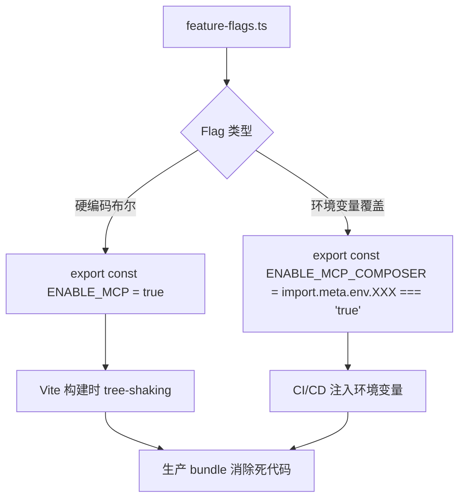
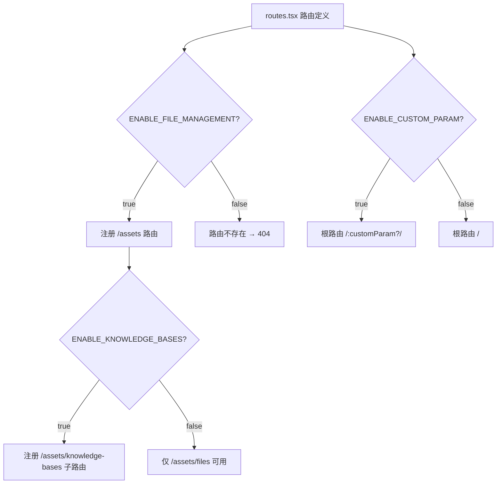
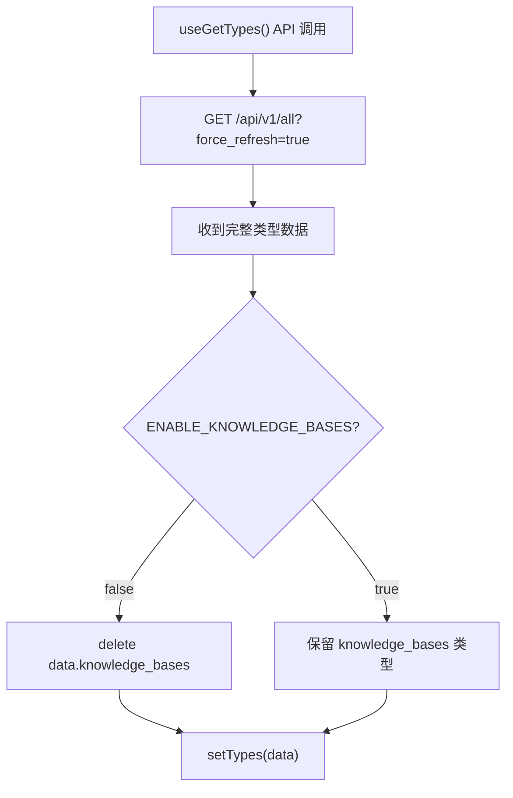

# PD-399.01 Langflow — 前端 Feature Flag 集中管理与渐进式发布

> 文档编号：PD-399.01
> 来源：Langflow `src/frontend/src/customization/feature-flags.ts`
> GitHub：https://github.com/langflow-ai/langflow.git
> 问题域：PD-399 Feature Flag 系统 Feature Flag System
> 状态：可复用方案

---

## 第 1 章 问题与动机

### 1.1 核心问题

大型前端应用在迭代过程中面临一个关键矛盾：新功能需要尽早合入主干以减少合并冲突，但又不能在未就绪时暴露给所有用户。Feature Flag 系统解决的就是"代码已部署但功能未发布"的解耦问题。

对于 Langflow 这样同时维护开源版（OSS）和商业版（DataStax Langflow）的项目，问题更加突出：
- 同一代码库需要为不同产品形态启用/禁用不同功能集
- MCP Server、语音助手、知识库等实验性功能需要渐进式发布
- 环境变量需要在构建时覆盖默认值，支持 CI/CD 差异化部署

### 1.2 Langflow 的解法概述

1. **单文件集中定义** — 所有 26 个 Feature Flag 集中在 `feature-flags.ts:1-26` 一个文件中，每个 flag 是一个 `export const ENABLE_*` 布尔常量
2. **编译时常量消除** — 使用 `export const` 而非运行时配置，Vite/esbuild 在生产构建时通过 tree-shaking 直接消除 `false` 分支的死代码
3. **环境变量覆盖** — 关键 flag（如 `ENABLE_MCP_COMPOSER`）支持 `import.meta.env` 覆盖，实现同一代码库的差异化构建（`feature-flags.ts:22-23`）
4. **多层消费模式** — flag 在路由层（条件路由注册）、组件层（条件渲染）、数据层（API 响应过滤）、行为层（Zustand store 初始值）四个层面被消费
5. **OSS/商业版分叉** — `ENABLE_DATASTAX_LANGFLOW` 作为"元 flag"控制整个商业版功能集的启用

### 1.3 设计思想

| 设计原则 | 具体实现 | 理由 | 替代方案 |
|----------|----------|------|----------|
| 编译时确定性 | `export const` 布尔常量 | Vite tree-shaking 可消除死代码，零运行时开销 | 运行时 config 对象（增加 bundle 体积） |
| 单一事实源 | 所有 flag 集中在一个文件 | 避免 flag 散落各处导致不一致 | 分散在各模块的局部 flag |
| 显式命名约定 | `ENABLE_` 前缀 + 功能名 | grep 友好，一眼可知用途 | 通用 config key（如 `features.mcp`） |
| 最小环境变量 | 仅 1 个 flag 使用 env 覆盖 | 大多数 flag 通过代码修改切换，减少配置复杂度 | 所有 flag 都支持 env 覆盖 |
| 产品形态分叉 | `ENABLE_DATASTAX_LANGFLOW` 元 flag | 一个开关控制整个商业版差异 | 独立的构建配置文件 |

---

## 第 2 章 源码实现分析

### 2.1 架构概览

Langflow 的 Feature Flag 系统采用"编译时常量 + 四层消费"架构：

```
┌─────────────────────────────────────────────────────────┐
│                  feature-flags.ts                        │
│  ENABLE_MCP = true                                      │
│  ENABLE_KNOWLEDGE_BASES = true                          │
│  ENABLE_DATASTAX_LANGFLOW = false                       │
│  ENABLE_MCP_COMPOSER = import.meta.env.XXX === "true"   │
│  ... (26 flags total)                                   │
└──────────┬──────────┬──────────┬──────────┬─────────────┘
           │          │          │          │
     ┌─────▼────┐ ┌───▼───┐ ┌───▼───┐ ┌───▼────┐
     │ 路由层   │ │组件层 │ │数据层 │ │行为层  │
     │routes.tsx│ │ JSX   │ │ API   │ │ Store  │
     │条件注册  │ │条件渲染│ │响应过滤│ │初始值  │
     └──────────┘ └───────┘ └───────┘ └────────┘
```

### 2.2 核心实现

#### Flag 定义层



对应源码 `src/frontend/src/customization/feature-flags.ts:1-26`：

```typescript
// 硬编码布尔常量 — 大多数 flag 的形式
export const ENABLE_DARK_MODE = true;
export const ENABLE_API = true;
export const ENABLE_LANGFLOW_STORE = false;
export const ENABLE_PROFILE_ICONS = true;
export const ENABLE_SOCIAL_LINKS = true;
export const ENABLE_BRANDING = true;
export const ENABLE_MVPS = false;
export const ENABLE_CUSTOM_PARAM = false;
export const ENABLE_INTEGRATIONS = false;
export const ENABLE_DATASTAX_LANGFLOW = false;
export const ENABLE_FILE_MANAGEMENT = true;
export const ENABLE_PUBLISH = true;
export const ENABLE_WIDGET = true;
export const LANGFLOW_AGENTIC_EXPERIENCE = false;
export const ENABLE_VOICE_ASSISTANT = true;
export const ENABLE_IMAGE_ON_PLAYGROUND = false;
export const ENABLE_MCP = true;
export const ENABLE_MCP_NOTICE = false;
export const ENABLE_KNOWLEDGE_BASES = true;
export const ENABLE_INSPECTION_PANEL = true;

// 唯一的环境变量覆盖 flag
export const ENABLE_MCP_COMPOSER =
  import.meta.env.LANGFLOW_MCP_COMPOSER_ENABLED === "true";
export const ENABLE_NEW_SIDEBAR = true;
export const ENABLE_FETCH_CREDENTIALS = false;
```

#### 路由层消费 — 条件路由注册



对应源码 `src/frontend/src/routes.tsx:64-108`：

```typescript
// 路由层：flag 直接控制路由树结构
<Route
  path={ENABLE_CUSTOM_PARAM ? "/:customParam?" : "/"}
  element={<ContextWrapper key={2}><Outlet /></ContextWrapper>}
>
  {/* ... */}
  {ENABLE_FILE_MANAGEMENT && (
    <Route path="assets">
      <Route index element={<CustomNavigate replace to="files" />} />
      <Route path="files" element={<FilesPage />} />
      {ENABLE_KNOWLEDGE_BASES && (
        <>
          <Route path="knowledge-bases" element={<KnowledgePage />} />
          <Route path="knowledge-bases/:sourceId/chunks"
                 element={<SourceChunksPage />} />
        </>
      )}
    </Route>
  )}
```

#### 数据层消费 — API 响应过滤



对应源码 `src/frontend/src/controllers/API/queries/flows/use-get-types.ts:30-38`：

```typescript
const response = await api.get<APIObjectType>(
  `${getURL("ALL")}?force_refresh=true`,
);
const data = response?.data;

// 数据层：flag 过滤 API 响应中的类型定义
if (!ENABLE_KNOWLEDGE_BASES) {
  delete data.knowledge_bases;
}
setTypes(data);
```

#### 行为层消费 — Zustand Store 初始值与逻辑门控

对应源码 `src/frontend/src/stores/storeStore.ts:1-14`：

```typescript
import { ENABLE_LANGFLOW_STORE } from "@/customization/feature-flags";

export const useStoreStore = create<StoreStoreType>((set) => ({
  // flag 作为 store 初始值
  hasStore: ENABLE_LANGFLOW_STORE,
  // flag 参与运行时逻辑门控
  checkHasStore: () => {
    checkHasStore().then((res) => {
      set({
        hasStore: ENABLE_LANGFLOW_STORE && (res?.enabled ?? false),
      });
    });
  },
}));
```

### 2.3 实现细节

**组件层消费模式** — flag 在 JSX 中通过 `&&` 短路求值控制渲染：

`src/frontend/src/components/core/folderSidebarComponent/components/sideBarFolderButtons/index.tsx:471-502`：

```typescript
// 组件层：多个 flag 嵌套控制 UI 元素
{ENABLE_MCP_NOTICE && !isDismissedMcpDialog && (
  <div className="p-2">
    <MCPServerNotice handleDismissDialog={handleDismissMcpDialog} />
  </div>
)}
{ENABLE_FILE_MANAGEMENT && (
  <SidebarFooter className="border-t">
    {ENABLE_DATASTAX_LANGFLOW && <CustomStoreButton />}
    {ENABLE_KNOWLEDGE_BASES && (
      <SidebarMenuButton onClick={handleKnowledgeNavigation}>
        <ForwardedIconComponent name="Library" />
        Knowledge
      </SidebarMenuButton>
    )}
  </SidebarFooter>
)}
```

**Tab 切换门控** — `ENABLE_MCP` 控制主页 tab 类型（`src/frontend/src/pages/MainPage/components/header/index.tsx:40-77`）：

```typescript
const isMCPEnabled = ENABLE_MCP;

// flag 决定 tab 集合
const tabTypes = isMCPEnabled ? ["mcp", "flows"] : ["components", "flows"];

// 自动纠正无效的 flowType
useEffect(() => {
  if (
    (flowType === "mcp" && !isMCPEnabled) ||
    (flowType === "components" && isMCPEnabled)
  ) {
    setFlowType("flows");
  }
}, [flowType, isMCPEnabled, setFlowType]);
```

**Sidebar 分类名动态化** — flag 影响 UI 文案（`src/frontend/src/utils/styleUtils.ts:289`）：

```typescript
{
  display_name: ENABLE_KNOWLEDGE_BASES ? "Files & Knowledge" : "Files",
  name: "files_and_knowledge",
  icon: "Layers",
}
```

**凭证策略门控** — `ENABLE_FETCH_CREDENTIALS` 控制跨域请求行为（`src/frontend/src/customization/utils/get-fetch-credentials.ts:1-23`）：

```typescript
export function getFetchCredentials(): RequestCredentials | undefined {
  return ENABLE_FETCH_CREDENTIALS ? "include" : undefined;
}
export function getAxiosWithCredentials(): boolean {
  return ENABLE_FETCH_CREDENTIALS;
}
```

**OSS/商业版分叉** — `ENABLE_DATASTAX_LANGFLOW` 作为元 flag 控制设置页侧边栏（`src/frontend/src/pages/SettingsPage/index.tsx:95-98`）：

```typescript
// 商业版不显示 OSS 的 Store 侧边栏
if (!ENABLE_DATASTAX_LANGFLOW) {
  const langflowItems = CustomStoreSidebar(true, ENABLE_LANGFLOW_STORE);
  sidebarNavItems.splice(2, 0, ...langflowItems);
}
```

**自定义组件占位模式** — Feature Flag Dialog 和 Menu Items 在 OSS 版中返回空 Fragment，为商业版预留扩展点（`src/frontend/src/customization/components/custom-feature-flag-dialog.tsx:1-11`）：

```typescript
const CustomFeatureFlagDialog = ({
  isOpen, setIsOpen,
}: { isOpen: boolean; setIsOpen: (isOpen: boolean) => void }) => {
  return <></>;  // OSS 版空实现，商业版覆盖
};
```

---

## 第 3 章 迁移指南

### 3.1 迁移清单

**阶段 1：基础设施（1 个文件）**
- [ ] 创建 `src/config/feature-flags.ts`，定义所有 flag 为 `export const ENABLE_*` 布尔常量
- [ ] 确保构建工具（Vite/webpack）支持 `import.meta.env` 或 `process.env` 注入

**阶段 2：路由层集成**
- [ ] 在路由定义中用 `{FLAG && <Route .../>}` 模式条件注册路由
- [ ] 为禁用的路由添加 fallback（重定向到首页或 404）

**阶段 3：组件层集成**
- [ ] 在 JSX 中用 `{FLAG && <Component />}` 模式条件渲染
- [ ] 对于复杂的 flag 组合，提取为 `useFeatureEnabled()` hook

**阶段 4：数据层集成**
- [ ] 在 API 响应处理中根据 flag 过滤数据
- [ ] 在 Zustand/Redux store 初始值中引用 flag

**阶段 5：CI/CD 集成**
- [ ] 在 `.env.production` / `.env.staging` 中设置环境变量覆盖
- [ ] 在 CI pipeline 中注入构建时变量

### 3.2 适配代码模板

```typescript
// feature-flags.ts — 可直接复用的模板
// ============================================

// 1. 硬编码 flag（大多数场景）
export const ENABLE_DARK_MODE = true;
export const ENABLE_EXPERIMENTAL_FEATURE = false;

// 2. 环境变量覆盖（需要 CI/CD 差异化的场景）
export const ENABLE_PREMIUM_FEATURES =
  import.meta.env.VITE_PREMIUM_ENABLED === "true";

// 3. 产品形态元 flag
export const IS_ENTERPRISE_EDITION =
  import.meta.env.VITE_EDITION === "enterprise";

// ============================================
// 路由层消费模板
// ============================================
import { ENABLE_EXPERIMENTAL_FEATURE } from "@/config/feature-flags";

const router = createBrowserRouter(
  createRoutesFromElements([
    <Route path="/" element={<Layout />}>
      <Route index element={<Home />} />
      {ENABLE_EXPERIMENTAL_FEATURE && (
        <Route path="experimental" element={<ExperimentalPage />} />
      )}
    </Route>,
  ]),
);

// ============================================
// 数据层消费模板
// ============================================
import { ENABLE_EXPERIMENTAL_FEATURE } from "@/config/feature-flags";

export const useGetModules = () => {
  return useQuery(["modules"], async () => {
    const { data } = await api.get("/api/modules");
    if (!ENABLE_EXPERIMENTAL_FEATURE) {
      delete data.experimental_modules;
    }
    return data;
  });
};

// ============================================
// Store 层消费模板
// ============================================
import { ENABLE_EXPERIMENTAL_FEATURE } from "@/config/feature-flags";

export const useAppStore = create((set) => ({
  experimentalEnabled: ENABLE_EXPERIMENTAL_FEATURE,
  checkExperimental: () => {
    fetchExperimentalStatus().then((res) => {
      set({
        experimentalEnabled: ENABLE_EXPERIMENTAL_FEATURE && res.enabled,
      });
    });
  },
}));
```

### 3.3 适用场景

| 场景 | 适用度 | 说明 |
|------|--------|------|
| 同一代码库多产品形态（OSS/商业版） | ⭐⭐⭐ | Langflow 的核心场景，元 flag 模式直接可用 |
| 渐进式功能发布（灰度） | ⭐⭐ | 编译时 flag 适合全量开关，不适合百分比灰度 |
| A/B 测试 | ⭐ | 需要运行时动态切换，编译时常量不适用 |
| 微前端模块按需加载 | ⭐⭐⭐ | flag 控制路由注册 + tree-shaking 消除未用模块 |
| 环境差异化部署（staging/prod） | ⭐⭐⭐ | `import.meta.env` 覆盖模式完美适配 |

---

## 第 4 章 测试用例

```typescript
import { describe, it, expect, vi } from "vitest";

// ============================================
// 测试 Feature Flag 定义层
// ============================================
describe("Feature Flags Definition", () => {
  it("should export all flags as boolean constants", async () => {
    const flags = await import("@/customization/feature-flags");
    const flagNames = Object.keys(flags).filter((k) => k.startsWith("ENABLE_"));

    for (const name of flagNames) {
      expect(typeof flags[name]).toBe("boolean");
    }
    // Langflow 当前有 24 个 ENABLE_ flag + 1 个 LANGFLOW_ flag
    expect(flagNames.length).toBeGreaterThanOrEqual(20);
  });

  it("should follow ENABLE_ naming convention", async () => {
    const flags = await import("@/customization/feature-flags");
    const exportedNames = Object.keys(flags);

    for (const name of exportedNames) {
      expect(
        name.startsWith("ENABLE_") || name.startsWith("LANGFLOW_"),
      ).toBe(true);
    }
  });
});

// ============================================
// 测试路由层消费
// ============================================
describe("Route Registration with Feature Flags", () => {
  it("should not register knowledge-bases route when ENABLE_KNOWLEDGE_BASES is false", () => {
    // Mock feature flag
    vi.doMock("@/customization/feature-flags", () => ({
      ENABLE_KNOWLEDGE_BASES: false,
      ENABLE_FILE_MANAGEMENT: true,
      ENABLE_CUSTOM_PARAM: false,
    }));

    // Verify route tree does not contain knowledge-bases path
    // (Implementation depends on router inspection API)
  });

  it("should register assets route only when ENABLE_FILE_MANAGEMENT is true", () => {
    vi.doMock("@/customization/feature-flags", () => ({
      ENABLE_FILE_MANAGEMENT: false,
      ENABLE_CUSTOM_PARAM: false,
    }));
    // /assets should 404
  });
});

// ============================================
// 测试数据层消费
// ============================================
describe("API Response Filtering with Feature Flags", () => {
  it("should remove knowledge_bases from types when flag is disabled", async () => {
    vi.doMock("@/customization/feature-flags", () => ({
      ENABLE_KNOWLEDGE_BASES: false,
    }));

    const mockData = {
      inputs: {},
      outputs: {},
      knowledge_bases: { kb1: {} },
    };

    // Simulate the filtering logic from use-get-types.ts
    if (!false) { // ENABLE_KNOWLEDGE_BASES = false
      delete mockData.knowledge_bases;
    }

    expect(mockData).not.toHaveProperty("knowledge_bases");
    expect(mockData).toHaveProperty("inputs");
  });
});

// ============================================
// 测试 Store 层消费
// ============================================
describe("Store Initialization with Feature Flags", () => {
  it("should initialize hasStore based on ENABLE_LANGFLOW_STORE flag", () => {
    // When ENABLE_LANGFLOW_STORE = false
    vi.doMock("@/customization/feature-flags", () => ({
      ENABLE_LANGFLOW_STORE: false,
    }));

    // Store's hasStore should be false regardless of API response
    const hasStore = false && true; // ENABLE_LANGFLOW_STORE && apiResponse
    expect(hasStore).toBe(false);
  });

  it("should gate store check with flag AND api response", () => {
    // When ENABLE_LANGFLOW_STORE = true but API says disabled
    const hasStore = true && false; // flag=true, api=false
    expect(hasStore).toBe(false);

    // When both are true
    const hasStore2 = true && true;
    expect(hasStore2).toBe(true);
  });
});

// ============================================
// 测试环境变量覆盖
// ============================================
describe("Environment Variable Override", () => {
  it("ENABLE_MCP_COMPOSER should read from import.meta.env", () => {
    // When env var is "true"
    const result1 = "true" === "true";
    expect(result1).toBe(true);

    // When env var is undefined
    const result2 = undefined === "true";
    expect(result2).toBe(false);

    // When env var is "false"
    const result3 = "false" === "true";
    expect(result3).toBe(false);
  });
});
```

---

## 第 5 章 跨域关联

| 关联域 | 关系类型 | 说明 |
|--------|----------|------|
| PD-04 工具系统 | 协同 | `ENABLE_MCP` 和 `ENABLE_MCP_COMPOSER` 控制 MCP 工具系统的前端可见性，flag 是工具系统对用户暴露的门控层 |
| PD-09 Human-in-the-Loop | 协同 | `ENABLE_MCP_NOTICE` 控制 MCP 引导对话框的显示，是 HITL 交互的入口开关 |
| PD-10 中间件管道 | 依赖 | `ENABLE_FETCH_CREDENTIALS` 通过 `getFetchCredentials()` 工具函数影响所有 HTTP 请求的凭证策略，类似请求中间件的行为 |
| PD-11 可观测性 | 协同 | Flag 的启用状态直接影响哪些功能模块的遥测数据会被采集，flag 变更应纳入可观测性追踪 |

---

## 第 6 章 来源文件索引

| 文件 | 行范围 | 关键实现 |
|------|--------|----------|
| `src/frontend/src/customization/feature-flags.ts` | L1-L26 | 全部 26 个 Feature Flag 定义，含 1 个 env 覆盖 |
| `src/frontend/src/routes.tsx` | L16-L20, L64-L108 | 路由层消费：条件路由注册（FILE_MANAGEMENT, KNOWLEDGE_BASES, CUSTOM_PARAM） |
| `src/frontend/src/stores/storeStore.ts` | L2, L7, L14 | Store 层消费：flag 作为初始值 + 逻辑门控 |
| `src/frontend/src/controllers/API/queries/flows/use-get-types.ts` | L1, L35-L37 | 数据层消费：API 响应过滤 knowledge_bases 类型 |
| `src/frontend/src/pages/SettingsPage/index.tsx` | L6-L9, L19, L95-L98 | 组件层消费：设置页侧边栏条件渲染 |
| `src/frontend/src/components/core/folderSidebarComponent/components/sideBarFolderButtons/index.tsx` | L24-L30, L471-L502 | 组件层消费：侧边栏多 flag 嵌套条件渲染 |
| `src/frontend/src/pages/MainPage/components/header/index.tsx` | L10, L40, L63-L77 | 行为层消费：ENABLE_MCP 控制 tab 类型集合 |
| `src/frontend/src/customization/utils/get-fetch-credentials.ts` | L1-L23 | 行为层消费：ENABLE_FETCH_CREDENTIALS 控制跨域凭证策略 |
| `src/frontend/src/utils/styleUtils.ts` | L5, L289 | 组件层消费：ENABLE_KNOWLEDGE_BASES 影响 sidebar 分类名 |
| `src/frontend/src/pages/MainPage/pages/homePage/hooks/useMcpServer.ts` | L13, L62-L66, L83, L214, L249, L297 | 行为层消费：ENABLE_MCP_COMPOSER 控制 OAuth/Composer 逻辑分支 |
| `src/frontend/src/customization/components/custom-feature-flag-dialog.tsx` | L1-L11 | 扩展点：OSS 版空实现，商业版覆盖 |
| `src/frontend/src/customization/components/custom-feature-flag-menu-items.tsx` | L1-L5 | 扩展点：OSS 版空实现，商业版覆盖 |
| `src/frontend/src/customization/config-constants.ts` | L1-L19 | 配套配置常量（BASENAME, PORT, API_ROUTES 等） |

---

## 第 7 章 横向对比维度

```json comparison_data
{
  "project": "Langflow",
  "dimensions": {
    "Flag 定义方式": "单文件 export const 布尔常量，26 个 ENABLE_* flag",
    "环境变量覆盖": "仅 1 个 flag 使用 import.meta.env 覆盖，其余硬编码",
    "运行时切换": "不支持，编译时确定，依赖 Vite tree-shaking 消除死代码",
    "消费层级": "四层消费：路由注册、JSX 渲染、API 响应过滤、Store 初始值",
    "产品形态分叉": "ENABLE_DATASTAX_LANGFLOW 元 flag 控制 OSS/商业版差异",
    "扩展点预留": "custom-feature-flag-dialog/menu-items 空组件占位，商业版覆盖"
  }
}
```

```json domain_metadata
{
  "solution_summary": "Langflow 用单文件 26 个 export const 布尔常量实现编译时 Feature Flag，通过路由注册/JSX 渲染/API 过滤/Store 初始值四层消费，Vite tree-shaking 消除禁用功能的死代码",
  "description": "编译时常量 Feature Flag 与构建工具 tree-shaking 协同实现零运行时开销的功能门控",
  "sub_problems": [
    "多产品形态（OSS/商业版）的元 Flag 分叉控制",
    "Flag 在路由树中的条件注册与 fallback 处理",
    "Flag 对 API 响应数据的过滤与类型裁剪",
    "空组件占位模式实现商业版扩展点预留"
  ],
  "best_practices": [
    "使用 export const 而非运行时配置，利用 tree-shaking 消除死代码",
    "Flag 在 Store 初始值中使用 AND 门控（flag && apiResponse）实现双重确认",
    "Tab/路由切换时自动纠正因 flag 变更导致的无效状态"
  ]
}
```
