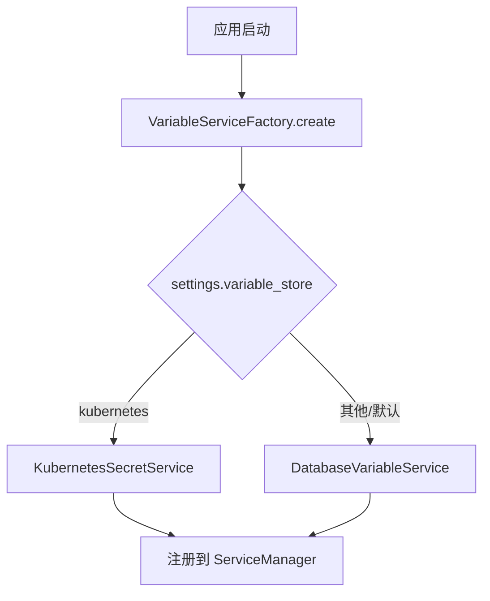
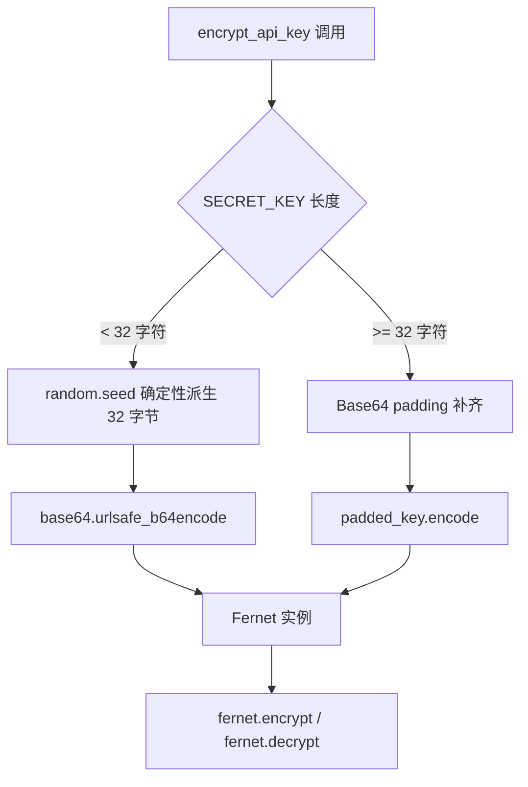
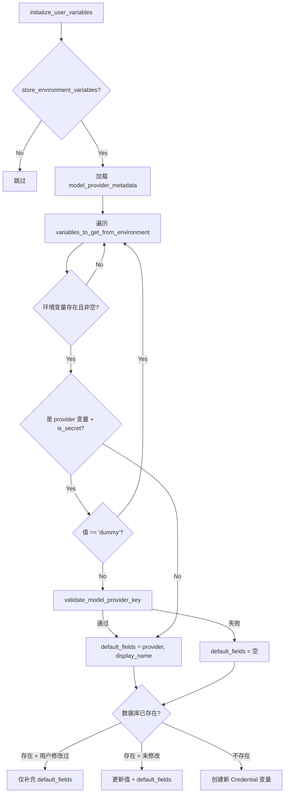
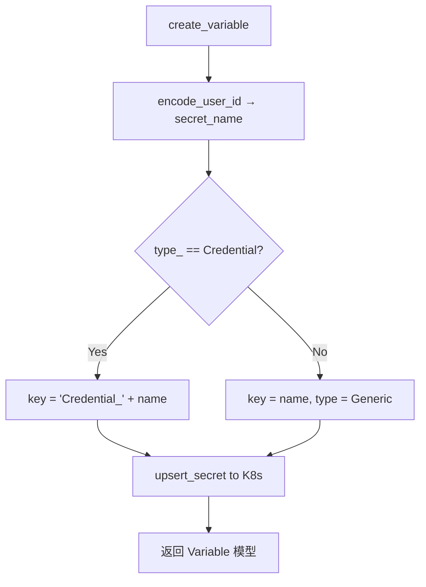

# PD-400.01 Langflow — VariableService 双后端凭证管理与 Fernet 加密

> 文档编号：PD-400.01
> 来源：Langflow `src/backend/base/langflow/services/variable/`
> GitHub：https://github.com/langflow-ai/langflow.git
> 问题域：PD-400 凭证管理 Credential & Secret Management
> 状态：可复用方案

---

## 第 1 章 问题与动机

### 1.1 核心问题

低代码/可视化 Agent 平台中，用户需要配置大量第三方 API Key（OpenAI、Anthropic、Google 等）来驱动 LLM 组件。这些凭证面临三个核心挑战：

1. **存储安全**：API Key 不能明文存储在数据库中，泄露即意味着经济损失
2. **多部署环境适配**：开发环境用 SQLite/PostgreSQL，生产 Kubernetes 环境应使用原生 Secrets
3. **跨组件共享**：一个 API Key 可能被多个 Flow 中的多个节点引用，需要统一管理而非各组件自行存储
4. **环境变量自动导入**：运维人员通过环境变量注入凭证，系统需自动识别并持久化，同时尊重用户手动修改

### 1.2 Langflow 的解法概述

Langflow 通过 **策略模式 + 工厂模式** 实现了一套完整的凭证管理系统：

1. **抽象基类 `VariableService`**（`services/variable/base.py:10`）定义 10 个抽象方法，统一 CRUD + 初始化接口
2. **双后端实现**：`DatabaseVariableService`（Fernet 对称加密存储到 SQL）和 `KubernetesSecretService`（K8s 原生 Secrets）
3. **工厂切换**（`services/variable/factory.py:19-28`）：通过 `settings.variable_store` 配置项在启动时选择后端
4. **类型分离**：`Credential` 类型强制加密 + 禁止暴露，`Generic` 类型明文存储
5. **环境变量智能导入**（`services/variable/service.py:28-177`）：启动时自动从环境变量导入 API Key，关联模型提供商元数据，并验证密钥有效性

### 1.3 设计思想

| 设计原则 | 具体实现 | 理由 | 替代方案 |
|----------|----------|------|----------|
| 策略模式解耦存储后端 | `VariableService` 抽象基类 + 两个具体实现 | 不同部署环境对安全性要求不同，K8s 有原生 Secret 管理 | 单一后端 + 配置开关（灵活性差） |
| 类型驱动的加密策略 | `Credential` 类型 Fernet 加密，`Generic` 类型明文 | 非敏感配置（如模型列表）无需加密开销 | 全量加密（性能浪费） |
| Fernet 签名前缀防护 | Generic 变量禁止以 `gAAAAA` 开头 | 防止明文值被误判为已加密值导致解密失败 | 额外的 is_encrypted 标记字段 |
| 用户修改优先 | `updated_at > created_at` 判断是否用户手动修改过 | 环境变量导入不应覆盖用户在 UI 上的手动配置 | 额外的 source 字段标记来源 |
| 模型提供商元数据关联 | `default_fields = [provider_name, var_display_name]` | 让 UI 知道哪个 API Key 对应哪个提供商，自动启用/禁用 | 手动配置提供商映射 |

---

## 第 2 章 源码实现分析

### 2.1 架构概览

```
┌─────────────────────────────────────────────────────────────┐
│                    API Layer (FastAPI)                       │
│  POST/GET/PATCH/DELETE /api/v1/variables                    │
│  + validate_model_provider_key() 创建/更新时验证            │
└──────────────────────┬──────────────────────────────────────┘
                       │ get_variable_service()
                       ▼
┌─────────────────────────────────────────────────────────────┐
│              VariableServiceFactory                          │
│  settings.variable_store == "kubernetes" ?                   │
│    → KubernetesSecretService                                │
│    → DatabaseVariableService (default)                      │
└──────────┬──────────────────────────────┬───────────────────┘
           │                              │
           ▼                              ▼
┌─────────────────────┐    ┌──────────────────────────────┐
│ DatabaseVariable     │    │ KubernetesSecretService      │
│ Service              │    │                              │
│                      │    │ KubernetesSecretManager      │
│ Fernet encrypt/      │    │ → CoreV1Api                  │
│ decrypt via          │    │ → Namespace: "langflow"      │
│ auth_utils           │    │ → Secret per user (uuid-xxx) │
│                      │    │ → Key prefix: Credential_    │
│ SQLModel Variable    │    │                              │
│ table (user_id FK)   │    │ asyncio.to_thread() 包装     │
└─────────────────────┘    └──────────────────────────────┘
           │                              │
           ▼                              ▼
┌─────────────────────┐    ┌──────────────────────────────┐
│ PostgreSQL/SQLite    │    │ Kubernetes Secrets API       │
│ + Fernet AES-128     │    │ (etcd 后端加密)              │
└─────────────────────┘    └──────────────────────────────┘
```

### 2.2 核心实现

#### 2.2.1 工厂模式：运行时后端选择



对应源码 `services/variable/factory.py:14-28`：

```python
class VariableServiceFactory(ServiceFactory):
    def __init__(self) -> None:
        super().__init__(VariableService)

    @override
    def create(self, settings_service: SettingsService):
        if settings_service.settings.variable_store == "kubernetes":
            from langflow.services.variable.kubernetes import KubernetesSecretService
            return KubernetesSecretService(settings_service)
        return DatabaseVariableService(settings_service)
```

注意 Kubernetes 后端使用延迟导入（`from ... import`），避免非 K8s 环境下因缺少 `kubernetes` 包而报错。

#### 2.2.2 Fernet 加密核心：密钥派生与加解密



对应源码 `services/auth/utils.py:292-318`：

```python
def get_fernet(settings_service: SettingsService) -> Fernet:
    secret_key: str = settings_service.auth_settings.SECRET_KEY.get_secret_value()
    MINIMUM_KEY_LENGTH = 32
    if len(secret_key) < MINIMUM_KEY_LENGTH:
        # Generate deterministic key from seed for short keys
        random.seed(secret_key)
        key = bytes(random.getrandbits(8) for _ in range(32))
        key = base64.urlsafe_b64encode(key)
    else:
        # Add padding for longer keys
        padding_needed = 4 - len(secret_key) % 4
        padded_key = secret_key + "=" * padding_needed
        key = padded_key.encode()
    return Fernet(key)
```

`encrypt_api_key` 和 `decrypt_api_key` 委托给 `_auth_service()` 单例（`services/auth/utils.py:321-330`），最终调用 Fernet 实例。

#### 2.2.3 环境变量智能导入与提供商关联



对应源码 `services/variable/service.py:28-177`，核心逻辑：

```python
# 跳过 dummy 占位值（测试环境保护）
if is_provider_variable and is_secret_variable and value.lower() == "dummy":
    continue

# 验证 API Key 有效性后才设置 default_fields
if is_secret_variable:
    validate_model_provider_key(provider_name, {var_name: value})
    default_fields = [provider_name, var_display_name]

# 用户修改优先：updated_at > created_at 表示用户手动改过
is_user_modified = (
    existing.updated_at is not None
    and existing.created_at is not None
    and existing.updated_at > existing.created_at
)
if is_user_modified:
    # 不覆盖用户配置，仅补充 default_fields
    pass
```

#### 2.2.4 Kubernetes 后端：用户隔离与类型前缀



对应源码 `services/variable/kubernetes.py:144-171`：

```python
async def create_variable(self, user_id, name, value, *, default_fields, type_, session):
    secret_name = encode_user_id(user_id)
    secret_key = name
    if type_ == CREDENTIAL_TYPE:
        secret_key = CREDENTIAL_TYPE + "_" + name
    else:
        type_ = GENERIC_TYPE
    await asyncio.to_thread(
        self.kubernetes_secrets.upsert_secret,
        secret_name=secret_name, data={secret_key: value}
    )
```

`encode_user_id`（`kubernetes_secrets.py:159-192`）将 UUID/邮箱转换为 K8s 合法名称（小写字母数字 + 连字符，≤253 字符）。

### 2.3 实现细节

**MCP 认证加密**（`services/auth/mcp_encryption.py`）是凭证管理的延伸：对 OAuth client_secret 和 api_key 字段进行选择性加密，使用 `is_encrypted()` 检测避免重复加密，并支持明文向后兼容。

**Fernet 签名防护**：`DatabaseVariableService` 在 `create_variable`、`update_variable`、`update_variable_fields` 三处都检查 Generic 类型变量值不能以 `gAAAAA`（Fernet token 前缀）开头（`service.py:306`, `service.py:340`, `service.py:393`），防止类型混淆导致的解密错误。

**API 层验证**：创建和更新凭证时，API 路由层（`api/v1/variable.py:127-130`）通过 `validate_model_provider_key()` 实际调用提供商 API 验证密钥有效性，无效密钥直接拒绝存储。

**Session 健壮性**：环境变量导入循环中，每次操作前检查 `session.is_active`（`service.py:53`, `service.py:110`, `service.py:173`），数据库异常导致 session 回滚时优雅中断而非崩溃。

---

## 第 3 章 迁移指南

### 3.1 迁移清单

**阶段 1：基础凭证存储（1 个后端）**

- [ ] 定义 `VariableService` 抽象基类，包含 CRUD + `initialize_user_variables` 方法
- [ ] 实现 `DatabaseVariableService`，使用 Fernet 对称加密
- [ ] 定义 `Variable` SQLModel/ORM 模型（name, value, type, user_id, default_fields, created_at, updated_at）
- [ ] 定义类型常量：`CREDENTIAL_TYPE = "Credential"`, `GENERIC_TYPE = "Generic"`
- [ ] 实现 `encrypt_api_key` / `decrypt_api_key` 工具函数
- [ ] 添加 Fernet 签名前缀防护（Generic 变量禁止 `gAAAAA` 开头）

**阶段 2：多后端支持**

- [ ] 实现 `KubernetesSecretService`，使用 K8s CoreV1Api
- [ ] 实现 `VariableServiceFactory`，根据配置选择后端
- [ ] 实现 `encode_user_id` 将用户标识转为 K8s 合法 Secret 名称
- [ ] K8s 后端使用 `asyncio.to_thread()` 包装同步 API 调用

**阶段 3：环境变量自动导入**

- [ ] 实现 `initialize_user_variables`，从环境变量导入已知 API Key
- [ ] 关联模型提供商元数据（provider_name + display_name → default_fields）
- [ ] 添加用户修改检测（updated_at > created_at），避免覆盖手动配置
- [ ] 添加 dummy 值跳过逻辑（测试环境保护）

### 3.2 适配代码模板

以下是一个可直接复用的最小凭证服务实现：

```python
"""Minimal credential service based on Langflow's VariableService pattern."""
import abc
import base64
import os
from cryptography.fernet import Fernet
from dataclasses import dataclass, field
from typing import Protocol


# --- 类型常量 ---
CREDENTIAL_TYPE = "Credential"
GENERIC_TYPE = "Generic"


# --- Fernet 加密工具 ---
class CredentialEncryptor:
    """Fernet-based encryption for credential values."""

    def __init__(self, secret_key: str):
        # Langflow 的密钥派生逻辑：短密钥用 seed 扩展，长密钥 base64 padding
        if len(secret_key) < 32:
            import random
            random.seed(secret_key)
            key_bytes = bytes(random.getrandbits(8) for _ in range(32))
            self._fernet = Fernet(base64.urlsafe_b64encode(key_bytes))
        else:
            padding = 4 - len(secret_key) % 4
            padded = secret_key + "=" * padding
            self._fernet = Fernet(padded.encode())

    def encrypt(self, plaintext: str) -> str:
        return self._fernet.encrypt(plaintext.encode()).decode()

    def decrypt(self, ciphertext: str) -> str:
        return self._fernet.decrypt(ciphertext.encode()).decode()


# --- 抽象基类 ---
class VariableService(abc.ABC):
    @abc.abstractmethod
    async def get_variable(self, user_id: str, name: str) -> str: ...

    @abc.abstractmethod
    async def create_variable(self, user_id: str, name: str, value: str,
                              type_: str = CREDENTIAL_TYPE) -> dict: ...

    @abc.abstractmethod
    async def delete_variable(self, user_id: str, name: str) -> None: ...

    @abc.abstractmethod
    async def initialize_from_env(self, user_id: str,
                                  env_vars: list[str]) -> None: ...


# --- 数据库后端实现 ---
class DatabaseVariableService(VariableService):
    def __init__(self, encryptor: CredentialEncryptor, db_session_factory):
        self._enc = encryptor
        self._db = db_session_factory

    async def create_variable(self, user_id, name, value, type_=CREDENTIAL_TYPE):
        # Fernet 签名防护
        if type_ == GENERIC_TYPE and value.startswith("gAAAAA"):
            raise ValueError(f"Generic variable '{name}' cannot start with 'gAAAAA'")
        stored_value = self._enc.encrypt(value) if type_ == CREDENTIAL_TYPE else value
        # ... INSERT INTO variables (user_id, name, value, type) ...
        return {"name": name, "type": type_, "value": stored_value}

    async def get_variable(self, user_id, name):
        # ... SELECT FROM variables WHERE user_id=? AND name=? ...
        row = ...  # fetch from DB
        if row["type"] == CREDENTIAL_TYPE:
            return self._enc.decrypt(row["value"])
        return row["value"]

    # ... 其他方法类似 ...


# --- 工厂 ---
def create_variable_service(config: dict) -> VariableService:
    if config.get("variable_store") == "kubernetes":
        from .kubernetes_backend import KubernetesVariableService
        return KubernetesVariableService(config)
    return DatabaseVariableService(
        encryptor=CredentialEncryptor(config["secret_key"]),
        db_session_factory=config["db_session_factory"],
    )
```

### 3.3 适用场景

| 场景 | 适用度 | 说明 |
|------|--------|------|
| 低代码/可视化 Agent 平台 | ⭐⭐⭐ | 完美匹配：多用户 + 多 LLM 提供商 + 跨组件共享 |
| 多租户 SaaS 后端 | ⭐⭐⭐ | user_id 隔离 + Fernet 加密 + K8s 原生支持 |
| CLI Agent 工具 | ⭐⭐ | 可简化为单后端（数据库），去掉 K8s 支持 |
| 单用户本地应用 | ⭐ | 过度设计，直接用 keyring 或 .env 文件即可 |
| 需要密钥轮换的场景 | ⭐ | Fernet 不原生支持密钥轮换，需额外实现 MultiFernet |

---

## 第 4 章 测试用例

基于 Langflow 真实测试（`tests/unit/services/variable/test_service.py`）的模式：

```python
"""Tests for credential management service."""
import pytest
from unittest.mock import patch, AsyncMock
from uuid import uuid4


class TestDatabaseVariableService:
    """Tests based on Langflow's DatabaseVariableService patterns."""

    @pytest.fixture
    def encryptor(self):
        from credential_service import CredentialEncryptor
        return CredentialEncryptor("test-secret-key-for-unit-tests")

    # --- 正常路径 ---
    async def test_create_and_get_credential(self, service, session):
        """Credential 类型变量应加密存储、解密返回。"""
        user_id = uuid4()
        await service.create_variable(user_id, "OPENAI_API_KEY", "sk-test123",
                                      type_="Credential", session=session)
        result = await service.get_variable(user_id, "OPENAI_API_KEY", "", session=session)
        assert result == "sk-test123"

    async def test_generic_variable_stored_plaintext(self, service, session):
        """Generic 类型变量应明文存储。"""
        user_id = uuid4()
        await service.create_variable(user_id, "MODEL_LIST", '["gpt-4"]',
                                      type_="Generic", session=session)
        result = await service.get_variable(user_id, "MODEL_LIST", "", session=session)
        assert result == '["gpt-4"]'

    # --- 边界情况 ---
    async def test_credential_cannot_be_used_as_session_id(self, service, session):
        """Credential 类型变量不能用于 session_id 字段（防泄露）。"""
        user_id = uuid4()
        await service.create_variable(user_id, "API_KEY", "secret",
                                      type_="Credential", session=session)
        with pytest.raises(TypeError, match="prevent the exposure"):
            await service.get_variable(user_id, "API_KEY", "session_id", session=session)

    async def test_generic_rejects_fernet_prefix(self, service, session):
        """Generic 变量值不能以 gAAAAA 开头（Fernet 签名防护）。"""
        user_id = uuid4()
        with pytest.raises(ValueError, match="cannot start with 'gAAAAA'"):
            await service.create_variable(user_id, "VAR", "gAAAAABfake",
                                          type_="Generic", session=session)

    # --- 降级行为 ---
    async def test_env_import_skips_dummy_values(self, service, session):
        """环境变量导入应跳过 'dummy' 占位值。"""
        user_id = uuid4()
        with patch.dict("os.environ", {"OPENAI_API_KEY": "dummy"}):
            await service.initialize_user_variables(user_id, session=session)
        variables = await service.list_variables(user_id, session=session)
        assert "OPENAI_API_KEY" not in variables

    async def test_env_import_respects_user_modification(self, service, session):
        """用户手动修改过的变量不应被环境变量覆盖。"""
        user_id = uuid4()
        # 创建并手动更新（模拟 updated_at > created_at）
        await service.create_variable(user_id, "OPENAI_API_KEY", "user-set-key",
                                      session=session)
        await service.update_variable(user_id, "OPENAI_API_KEY", "user-updated",
                                      session=session)
        # 环境变量导入不应覆盖
        with patch.dict("os.environ", {"OPENAI_API_KEY": "env-value"}):
            await service.initialize_user_variables(user_id, session=session)
        result = await service.get_variable(user_id, "OPENAI_API_KEY", "", session=session)
        assert result == "user-updated"

    async def test_decryption_failure_skips_variable(self, service, session):
        """解密失败时应跳过该变量而非崩溃。"""
        user_id = uuid4()
        await service.create_variable(user_id, "KEY", "value", session=session)
        with patch("langflow.services.auth.utils.decrypt_api_key",
                   side_effect=Exception("wrong key")):
            result = await service.get_all_decrypted_variables(user_id, session=session)
        assert "KEY" not in result
```

---

## 第 5 章 跨域关联

| 关联域 | 关系类型 | 说明 |
|--------|----------|------|
| PD-04 工具系统 | 依赖 | LLM 工具节点通过 `get_variable()` 获取 API Key，凭证管理是工具系统的基础设施 |
| PD-05 沙箱隔离 | 协同 | K8s 后端天然与容器隔离协同，每个用户的 Secret 独立于 Pod 命名空间 |
| PD-09 Human-in-the-Loop | 协同 | API 层在创建/更新凭证时调用 `validate_model_provider_key()` 验证有效性，相当于自动化的人工审核 |
| PD-11 可观测性 | 协同 | `VariableRead` 模型包含 `is_valid` 和 `validation_error` 字段，支持 UI 展示凭证健康状态 |
| PD-06 记忆持久化 | 类比 | 凭证存储与记忆持久化共享"多后端抽象 + 工厂切换"的架构模式 |

---

## 第 6 章 来源文件索引

| 文件 | 行范围 | 关键实现 |
|------|--------|----------|
| `src/backend/base/langflow/services/variable/base.py` | L10-L162 | `VariableService` 抽象基类，10 个抽象方法定义 |
| `src/backend/base/langflow/services/variable/service.py` | L24-L413 | `DatabaseVariableService` 完整实现，Fernet 加密 + 环境变量导入 |
| `src/backend/base/langflow/services/variable/kubernetes.py` | L25-L268 | `KubernetesSecretService` 完整实现，K8s Secrets 后端 |
| `src/backend/base/langflow/services/variable/kubernetes_secrets.py` | L10-L193 | `KubernetesSecretManager` K8s API 封装 + `encode_user_id` |
| `src/backend/base/langflow/services/variable/factory.py` | L14-L28 | `VariableServiceFactory` 工厂模式后端选择 |
| `src/backend/base/langflow/services/variable/constants.py` | L1-L2 | `CREDENTIAL_TYPE` / `GENERIC_TYPE` 常量 |
| `src/backend/base/langflow/services/auth/utils.py` | L292-L330 | `get_fernet` 密钥派生 + `encrypt_api_key` / `decrypt_api_key` |
| `src/backend/base/langflow/services/auth/mcp_encryption.py` | L1-L115 | MCP OAuth 字段选择性加密 + `is_encrypted` 检测 |
| `src/backend/base/langflow/services/database/models/variable/model.py` | L18-L79 | `Variable` SQLModel + `VariableRead` 自动脱敏验证器 |
| `src/backend/base/langflow/api/v1/variable.py` | L100-L270 | REST API 路由，含提供商密钥验证 + 删除时自动清理模型列表 |
| `src/backend/tests/unit/services/variable/test_service.py` | L1-L367 | 完整单元测试套件 |

---

## 第 7 章 横向对比维度

```json comparison_data
{
  "project": "Langflow",
  "dimensions": {
    "加密方案": "Fernet AES-128-CBC 对称加密，短密钥 seed 派生",
    "多后端支持": "Database(Fernet) + Kubernetes Secrets 双后端工厂切换",
    "类型系统": "Credential(强制加密+禁暴露) vs Generic(明文) 双类型",
    "环境变量导入": "启动时自动导入 + 提供商元数据关联 + dummy 值跳过 + 用户修改优先",
    "密钥验证": "创建/更新时调用提供商 API 实时验证密钥有效性",
    "用户隔离": "user_id 外键(DB) / per-user Secret(K8s) 双模式隔离"
  }
}
```

### 域元数据补充

```json domain_metadata
{
  "solution_summary": "Langflow 用 VariableService 策略模式 + Fernet 加密实现 Database/Kubernetes 双后端凭证存储，启动时自动从环境变量导入 API Key 并关联模型提供商元数据",
  "description": "凭证的类型分级存储与运行时提供商密钥验证",
  "sub_problems": [
    "Fernet 签名前缀与明文值混淆防护",
    "环境变量导入与用户手动修改的优先级冲突",
    "提供商密钥有效性实时验证"
  ],
  "best_practices": [
    "Generic 变量禁止 gAAAAA 前缀防止类型混淆",
    "updated_at > created_at 判断用户修改优先级",
    "创建/更新时调用提供商 API 验证密钥有效性"
  ]
}
```
