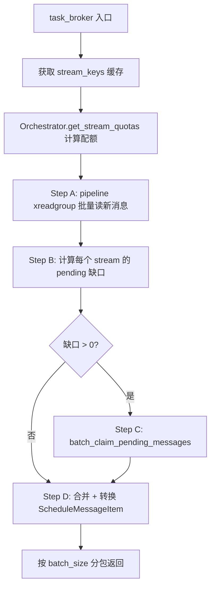
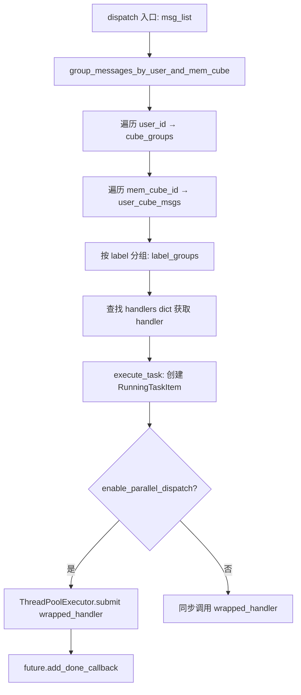

# PD-401.01 MemOS — Redis Stream 任务调度与线程池并行分发

> 文档编号：PD-401.01
> 来源：MemOS `src/memos/mem_scheduler/task_schedule_modules/`
> GitHub：https://github.com/MemTensor/MemOS.git
> 问题域：PD-401 任务调度系统 Task Scheduling System
> 状态：可复用方案

---

## 第 1 章 问题与动机

### 1.1 核心问题

在多用户、多任务类型的 Agent 记忆系统中，任务调度面临三个核心挑战：

1. **可靠性**：任务消息不能丢失，消费者崩溃后需要自动回收未完成任务
2. **公平性**：不同用户、不同优先级的任务需要按权重公平分配执行资源
3. **并行性**：同一时刻可能有数十种不同类型的任务（add、query、organize、archive 等），需要按 label 路由到对应 handler 并行执行

传统的 Python `queue.Queue` 或 RabbitMQ 方案要么缺乏持久化和消费组语义，要么引入过重的中间件依赖。MemOS 选择 Redis Stream 作为任务队列的核心基础设施，配合线程池分发器实现了一套完整的调度系统。

### 1.2 MemOS 的解法概述

MemOS 的任务调度系统由三层组件构成：

1. **SchedulerRedisQueue**（`redis_queue.py:34`）：Redis Stream 封装层，负责消息的生产（xadd）、消费（xreadgroup）、确认（xack+xdel）、pending 回收（xautoclaim/xclaim），以及后台 stream key 刷新和非活跃 stream 自动清理
2. **SchedulerOrchestrator**（`orchestrator.py:30`）：编排层，按用户维度的优先级权重计算每个 stream 的消费配额（quota），并管理每种任务类型的 pending claim 超时阈值
3. **SchedulerDispatcher**（`dispatcher.py:35`）：分发层，基于 `ContextThreadPoolExecutor` 线程池将消息按 `(user_id, mem_cube_id, label)` 三维分组后路由到注册的 handler，支持竞争执行（race）和多任务并行

### 1.3 设计思想

| 设计原则 | 具体实现 | 理由 | 替代方案 |
|----------|----------|------|----------|
| Stream-per-user 隔离 | stream key 格式 `{prefix}:{user_id}:{mem_cube_id}:{task_label}` | 用户间任务互不干扰，支持按用户维度的优先级和配额 | 单一 stream + consumer group 分区 |
| Consumer Group 消费组 | xreadgroup + xack + xdel 三步确认 | 支持多消费者并行消费，消息不丢失 | Pub/Sub（无持久化） |
| Pending 超时回收 | xautoclaim（Redis 6.2+）/ 手动 xpending+xclaim 降级 | 消费者崩溃后自动回收超时任务 | 定时扫描 + 重新入队 |
| 线程池 + Handler 注册表 | ContextThreadPoolExecutor + handlers dict | 按 label 路由，线程池控制并发度 | asyncio / Celery |
| 后台 stream key 刷新 | daemon 线程定期 SCAN + 非活跃 stream 自动删除 | 避免 zombie stream 堆积，保持 key 缓存新鲜 | 手动清理 |

---

## 第 2 章 源码实现分析

### 2.1 架构概览

```
┌─────────────────────────────────────────────────────────────────┐
│                        BaseScheduler                            │
│  ┌──────────────┐  ┌──────────────────┐  ┌──────────────────┐  │
│  │ RedisQueue   │  │  Orchestrator    │  │   Dispatcher     │  │
│  │              │  │                  │  │                  │  │
│  │ put()        │→ │ get_stream_      │→ │ dispatch()       │  │
│  │ task_broker()│  │   quotas()       │  │ execute_task()   │  │
│  │ get_messages()│ │ get_task_        │  │ register_handler()│ │
│  │ ack_message()│  │   idle_min()     │  │ run_competitive_ │  │
│  │              │  │ set_task_config()│  │   tasks()        │  │
│  └──────┬───────┘  └────────┬─────────┘  └────────┬─────────┘  │
│         │                   │                      │            │
│         ▼                   ▼                      ▼            │
│  ┌──────────────┐  ┌──────────────────┐  ┌──────────────────┐  │
│  │ Redis Stream │  │ TaskPriorityLevel│  │ ThreadManager    │  │
│  │ (per-user    │  │ (LEVEL_1/2/3)    │  │ (race + multi)   │  │
│  │  per-label)  │  │                  │  │                  │  │
│  └──────────────┘  └──────────────────┘  └──────────────────┘  │
│                                                                 │
│  ┌──────────────────────────────────────────────────────────┐   │
│  │ TaskStatusTracker (Redis Hash: task lifecycle tracking)  │   │
│  └──────────────────────────────────────────────────────────┘   │
└─────────────────────────────────────────────────────────────────┘
```

数据流：

```
Producer (API) → put() → Redis Stream (xadd)
                              ↓
Background loop → get_messages() → task_broker()
                              ↓
                  Orchestrator.get_stream_quotas() → 按用户权重分配配额
                              ↓
                  xreadgroup (new) + xautoclaim (pending) → 批量拉取
                              ↓
                  Dispatcher.dispatch() → 按 (user, cube, label) 分组
                              ↓
                  ThreadPoolExecutor.submit(wrapped_handler)
                              ↓
                  handler 执行 → ack_message() → xack + xdel
```

### 2.2 核心实现

#### 2.2.1 task_broker：四步批量消费流水线



对应源码 `redis_queue.py:295-347`：

```python
def task_broker(
    self,
    consume_batch_size: int,
) -> list[list[ScheduleMessageItem]]:
    stream_keys = self.get_stream_keys(stream_key_prefix=self.stream_key_prefix)
    if not stream_keys:
        return []

    # Determine per-stream quotas for this cycle
    stream_quotas = self.orchestrator.get_stream_quotas(
        stream_keys=stream_keys, consume_batch_size=consume_batch_size
    )

    # Step A: batch-read new messages across streams (non-blocking)
    new_messages_map = self._read_new_messages_batch(
        stream_keys=stream_keys, stream_quotas=stream_quotas
    )

    # Step B: compute pending needs per stream
    claims_spec: list[tuple[str, int, str]] = []
    for stream_key in stream_keys:
        need_pending_count = self._compute_pending_need(
            new_messages=new_messages_map.get(stream_key),
            batch_size=stream_quotas[stream_key],
        )
        if need_pending_count:
            task_label = stream_key.rsplit(":", 1)[1]
            claims_spec.append((stream_key, need_pending_count, task_label))

    # Step C: batch claim pending messages across streams
    claimed_messages = []
    if claims_spec:
        claimed_messages = self._batch_claim_pending_messages(claims_spec=claims_spec)

    # Step D: assemble and convert to ScheduleMessageItem
    messages = []
    for stream_key in stream_keys:
        nm = new_messages_map.get(stream_key)
        if nm:
            messages.extend(nm)
    if claimed_messages:
        messages.extend(claimed_messages)

    cache = self._convert_messages(messages)
    packed = []
    for i in range(0, len(cache), consume_batch_size):
        packed.append(cache[i : i + consume_batch_size])
    return packed
```

关键设计点：
- **pipeline 批量读取**（`redis_queue.py:587-643`）：用 Redis pipeline 一次性对所有 stream 发起 xreadgroup，减少网络往返
- **pending 缺口计算**（`redis_queue.py:645-653`）：`need_pending = max(0, batch_size - new_count)`，新消息不足时从 pending 中补充
- **双路径 claim**（`redis_queue.py:923-940`）：Redis 6.2+ 用 xautoclaim pipeline，低版本降级为 xpending + xclaim 两阶段 pipeline

#### 2.2.2 Dispatcher 三维分组分发



对应源码 `dispatcher.py:643-674`：

```python
def dispatch(self, msg_list: list[ScheduleMessageItem]):
    if not msg_list:
        return

    # Group messages by user_id and mem_cube_id first
    user_cube_groups = group_messages_by_user_and_mem_cube(msg_list)

    for user_id, cube_groups in user_cube_groups.items():
        for mem_cube_id, user_cube_msgs in cube_groups.items():
            label_groups = defaultdict(list)
            for message in user_cube_msgs:
                label_groups[message.label].append(message)

            for label, msgs in label_groups.items():
                handler = self.handlers.get(label, self._default_message_handler)
                self.execute_task(
                    user_id=user_id,
                    mem_cube_id=mem_cube_id,
                    task_label=label,
                    msgs=msgs,
                    handler_call_back=handler,
                )
```

### 2.3 实现细节

#### 异步缓存预填充

`get_messages()`（`redis_queue.py:364-387`）实现了一个双层缓存策略：
- 当 `message_pack_cache` 非空时直接 popleft 返回，零延迟
- 当缓存低于 `task_broker_flush_bar`（默认 10）时，启动后台 `ContextThread` 异步 refill
- 当缓存为空时，同步调用 `task_broker()` 填充

#### 非活跃 Stream 自动清理

后台 `_stream_keys_refresh_loop`（`redis_queue.py:259-274`）定期执行：
1. SCAN 匹配前缀的所有 key
2. pipeline XREVRANGE COUNT 1 获取每个 stream 的最后一条消息时间戳
3. 超过 `DEFAULT_STREAM_INACTIVITY_DELETE_SECONDS`（2 小时）的 stream 自动删除
4. 空 stream 首次发现时记录时间，超过阈值后才删除（防止误删刚创建的 stream）

#### ThreadManager 竞争执行

`ThreadManager.run_race()`（`task_threads.py:262-315`）实现了线程竞争模式：
- 每个任务线程接收一个 `stop_flag: threading.Event`
- 第一个完成的线程通过 `race_finished.set()` 通知其他线程停止
- 用于场景：多个搜索策略竞争，取最快返回的结果

#### 任务状态全生命周期追踪

`TaskStatusTracker`（`status_tracker.py:14`）用 Redis Hash 追踪每个任务的状态流转：
`waiting → in_progress → completed/failed`，支持按 `business_task_id` 聚合多个子任务的状态。

---

## 第 3 章 迁移指南

### 3.1 迁移清单

**阶段 1：Redis Stream 队列层**
- [ ] 安装 redis-py >= 4.5（支持 xautoclaim）
- [ ] 定义 stream key 命名规范：`{prefix}:{tenant_id}:{resource_id}:{task_type}`
- [ ] 实现 `put()` 方法：xadd + consumer group 自动创建
- [ ] 实现 `get()` 方法：xreadgroup + pending claim 双路径
- [ ] 实现 `ack_message()`：xack + 可选 xdel 清理
- [ ] 实现后台 stream key 刷新线程（SCAN + 非活跃清理）

**阶段 2：编排层**
- [ ] 定义 TaskPriorityLevel 枚举（至少 3 级）
- [ ] 实现 `get_stream_quotas()`：按优先级权重分配每个 stream 的消费配额
- [ ] 实现 `get_task_idle_min()`：按任务类型配置 pending claim 超时

**阶段 3：分发层**
- [ ] 创建 handler 注册表（dict[str, Callable]）
- [ ] 实现三维分组分发：tenant → resource → task_type
- [ ] 用 ThreadPoolExecutor 提交任务，控制 max_workers
- [ ] 实现 wrapped_handler：metrics 采集 + Redis ack + 异常处理

**阶段 4：可观测性**
- [ ] 集成 TaskStatusTracker（Redis Hash 状态追踪）
- [ ] 添加 monitor event 埋点（start/finish/fail）
- [ ] 实现 stats() 接口暴露运行时指标

### 3.2 适配代码模板

以下是一个可直接运行的最小化 Redis Stream 任务调度器模板：

```python
import threading
import time
from collections import defaultdict
from concurrent.futures import ThreadPoolExecutor
from enum import Enum
from typing import Any, Callable
from uuid import uuid4

import redis


class TaskPriority(Enum):
    HIGH = 1
    NORMAL = 2
    LOW = 3


class SimpleRedisTaskQueue:
    """最小化 Redis Stream 任务队列，移植自 MemOS SchedulerRedisQueue 核心逻辑。"""

    def __init__(
        self,
        redis_url: str = "redis://localhost:6379",
        stream_prefix: str = "tasks:stream",
        consumer_group: str = "worker_group",
        max_workers: int = 10,
    ):
        self.redis = redis.from_url(redis_url, decode_responses=True)
        self.stream_prefix = stream_prefix
        self.consumer_group = consumer_group
        self.consumer_name = f"worker_{uuid4().hex[:8]}"
        self.handlers: dict[str, Callable] = {}
        self.executor = ThreadPoolExecutor(max_workers=max_workers)
        self._running = False

        # 优先级配置：任务类型 → (priority, pending_idle_ms)
        self.task_config: dict[str, tuple[TaskPriority, int]] = {}

    def _stream_key(self, tenant_id: str, task_type: str) -> str:
        return f"{self.stream_prefix}:{tenant_id}:{task_type}"

    def _ensure_group(self, stream_key: str) -> None:
        try:
            self.redis.xgroup_create(stream_key, self.consumer_group, id="0", mkstream=True)
        except redis.exceptions.ResponseError as e:
            if "BUSYGROUP" not in str(e):
                raise

    def register_handler(
        self,
        task_type: str,
        handler: Callable[[list[dict]], Any],
        priority: TaskPriority = TaskPriority.NORMAL,
        pending_idle_ms: int = 3_600_000,
    ) -> None:
        self.handlers[task_type] = handler
        self.task_config[task_type] = (priority, pending_idle_ms)

    def submit(self, tenant_id: str, task_type: str, payload: dict) -> str:
        """提交任务到 Redis Stream。"""
        stream_key = self._stream_key(tenant_id, task_type)
        self._ensure_group(stream_key)
        msg_id = self.redis.xadd(stream_key, {"payload": str(payload)}, maxlen=10000)
        return msg_id

    def _consume_once(self, stream_key: str, batch_size: int = 10) -> list[tuple[str, dict]]:
        """单次消费：先读新消息，不足则 claim pending。"""
        # Step 1: 读新消息
        result = self.redis.xreadgroup(
            self.consumer_group, self.consumer_name,
            {stream_key: ">"}, count=batch_size, block=None,
        )
        messages = []
        if result:
            for _stream, msgs in result:
                messages.extend(msgs)

        # Step 2: 不足则 claim pending
        need = batch_size - len(messages)
        if need > 0:
            task_type = stream_key.rsplit(":", 1)[-1]
            _, idle_ms = self.task_config.get(task_type, (TaskPriority.NORMAL, 3_600_000))
            try:
                _, claimed, _ = self.redis.xautoclaim(
                    stream_key, self.consumer_group, self.consumer_name,
                    min_idle_time=idle_ms, start_id="0-0", count=need,
                )
                messages.extend(claimed)
            except Exception:
                pass  # Redis < 6.2 降级：跳过 pending claim

        return messages

    def _dispatch(self, stream_key: str, messages: list[tuple[str, dict]]) -> None:
        """分发消息到对应 handler 并 ack。"""
        task_type = stream_key.rsplit(":", 1)[-1]
        handler = self.handlers.get(task_type)
        if not handler:
            return

        try:
            handler([msg_data for _, msg_data in messages])
        finally:
            for msg_id, _ in messages:
                self.redis.xack(stream_key, self.consumer_group, msg_id)
                self.redis.xdel(stream_key, msg_id)

    def run(self, poll_interval: float = 0.5) -> None:
        """主循环：扫描所有 stream，消费并分发。"""
        self._running = True
        while self._running:
            keys = list(self.redis.scan_iter(f"{self.stream_prefix}:*", count=200))
            for stream_key in keys:
                messages = self._consume_once(stream_key)
                if messages:
                    self.executor.submit(self._dispatch, stream_key, messages)
            if not keys:
                time.sleep(poll_interval)

    def stop(self) -> None:
        self._running = False
        self.executor.shutdown(wait=True)
```

### 3.3 适用场景

| 场景 | 适用度 | 说明 |
|------|--------|------|
| 多用户 Agent 记忆系统 | ⭐⭐⭐ | 完美匹配：per-user stream 隔离 + 多任务类型路由 |
| 通用后台任务队列 | ⭐⭐⭐ | Redis Stream 提供可靠消费 + pending 回收 |
| 实时数据处理管道 | ⭐⭐ | 适合中等吞吐量，超高吞吐建议 Kafka |
| 单机简单任务调度 | ⭐ | 过度设计，直接用 `queue.Queue` + 线程池即可 |
| 分布式多节点消费 | ⭐⭐⭐ | Consumer Group 天然支持多消费者水平扩展 |

---

## 第 4 章 测试用例

```python
import threading
import time
from collections import defaultdict
from unittest.mock import MagicMock, patch

import pytest


class TestSchedulerOrchestrator:
    """测试编排器的配额分配和优先级管理。"""

    def test_default_equal_quotas(self):
        """默认情况下所有 stream 获得相同配额。"""
        from memos.mem_scheduler.task_schedule_modules.orchestrator import SchedulerOrchestrator

        orch = SchedulerOrchestrator()
        stream_keys = ["prefix:user1:cube1:add", "prefix:user2:cube1:query"]
        quotas = orch.get_stream_quotas(stream_keys, consume_batch_size=10)

        assert quotas["prefix:user1:cube1:add"] == 10
        assert quotas["prefix:user2:cube1:query"] == 10

    def test_set_task_config_priority_and_idle(self):
        """动态设置任务优先级和 idle 阈值。"""
        from memos.mem_scheduler.schemas.task_schemas import TaskPriorityLevel
        from memos.mem_scheduler.task_schedule_modules.orchestrator import SchedulerOrchestrator

        orch = SchedulerOrchestrator()
        orch.set_task_config("add", priority=TaskPriorityLevel.LEVEL_1, min_idle_ms=300_000)

        assert orch.get_task_priority("add") == TaskPriorityLevel.LEVEL_1
        assert orch.get_task_idle_min("add") == 300_000

    def test_default_idle_min_fallback(self):
        """未配置的任务类型使用默认 idle 阈值（1 小时）。"""
        from memos.mem_scheduler.task_schedule_modules.orchestrator import SchedulerOrchestrator

        orch = SchedulerOrchestrator()
        assert orch.get_task_idle_min("unknown_task") == 3_600_000

    def test_remove_task_config(self):
        """移除任务配置后回退到默认值。"""
        from memos.mem_scheduler.schemas.task_schemas import TaskPriorityLevel
        from memos.mem_scheduler.task_schedule_modules.orchestrator import SchedulerOrchestrator

        orch = SchedulerOrchestrator()
        orch.set_task_config("add", priority=TaskPriorityLevel.LEVEL_1, min_idle_ms=100_000)
        orch.remove_task_config("add")

        assert orch.get_task_priority("add") == TaskPriorityLevel.LEVEL_3  # 默认
        assert orch.get_task_idle_min("add") == 3_600_000  # 默认


class TestSchedulerDispatcher:
    """测试分发器的 handler 注册和任务路由。"""

    def test_register_and_dispatch(self):
        """注册 handler 后消息正确路由。"""
        from memos.mem_scheduler.task_schedule_modules.dispatcher import SchedulerDispatcher

        results = []
        dispatcher = SchedulerDispatcher(
            enable_parallel_dispatch=False,
            metrics=MagicMock(),
            status_tracker=None,
        )
        dispatcher.register_handler("add", lambda msgs: results.extend(msgs))

        mock_msg = MagicMock()
        mock_msg.label = "add"
        mock_msg.user_id = "user1"
        mock_msg.mem_cube_id = "cube1"
        mock_msg.item_id = "item1"
        mock_msg.timestamp = time.time()
        mock_msg.redis_message_id = ""
        mock_msg.info = {}

        dispatcher.dispatch([mock_msg])
        assert len(results) == 1

    def test_unregistered_label_uses_default(self):
        """未注册的 label 使用默认 handler。"""
        from memos.mem_scheduler.task_schedule_modules.dispatcher import SchedulerDispatcher

        dispatcher = SchedulerDispatcher(
            enable_parallel_dispatch=False,
            metrics=MagicMock(),
            status_tracker=None,
        )
        # 不注册任何 handler，dispatch 不应抛异常
        mock_msg = MagicMock()
        mock_msg.label = "unknown"
        mock_msg.user_id = "user1"
        mock_msg.mem_cube_id = "cube1"
        mock_msg.item_id = "item1"
        mock_msg.timestamp = time.time()
        mock_msg.redis_message_id = ""
        mock_msg.info = {}

        dispatcher.dispatch([mock_msg])  # 不抛异常即通过


class TestThreadManager:
    """测试线程竞争执行。"""

    def test_race_returns_fastest(self):
        """竞争执行返回最快完成的任务结果。"""
        from memos.mem_scheduler.general_modules.task_threads import ThreadManager

        tm = ThreadManager()

        def fast_task(stop_flag):
            return "fast_result"

        def slow_task(stop_flag):
            time.sleep(5)
            return "slow_result"

        result = tm.run_race({"fast": fast_task, "slow": slow_task}, timeout=3.0)
        assert result is not None
        assert result[0] == "fast"
        assert result[1] == "fast_result"

    def test_race_timeout_returns_none(self):
        """所有任务超时时返回 None。"""
        from memos.mem_scheduler.general_modules.task_threads import ThreadManager

        tm = ThreadManager()

        def slow_task(stop_flag):
            time.sleep(10)
            return "never"

        result = tm.run_race({"slow": slow_task}, timeout=0.1)
        assert result is None
```

---

## 第 5 章 跨域关联

| 关联域 | 关系类型 | 说明 |
|--------|----------|------|
| PD-02 多 Agent 编排 | 协同 | Dispatcher 的 handler 注册表本质上是一个简化的 Agent 路由器，每个 label 对应一个 Agent handler；ThreadManager.run_race() 实现了多 Agent 竞争执行模式 |
| PD-03 容错与重试 | 依赖 | Redis Stream 的 pending claim 机制（xautoclaim）是任务级容错的核心：消费者崩溃后超时自动回收。wrapped_handler 的 finally 块确保 ack 不丢失 |
| PD-06 记忆持久化 | 协同 | MemOS 的任务调度系统服务于记忆管理（add/query/organize/archive），TaskStatusTracker 用 Redis Hash 持久化任务状态，与记忆操作的事务性紧密关联 |
| PD-10 中间件管道 | 协同 | Dispatcher 的 `_create_task_wrapper` 本质上是一个中间件包装器：在 handler 前后注入 metrics 采集、trace context 传播、Redis ack 等横切关注点 |
| PD-11 可观测性 | 依赖 | emit_monitor_event 在任务 start/finish/fail 时发射事件，metrics.observe_task_duration 记录执行耗时，stats() 暴露运行时指标 |

---

## 第 6 章 来源文件索引

| 文件 | 行范围 | 关键实现 |
|------|--------|----------|
| `src/memos/mem_scheduler/task_schedule_modules/redis_queue.py` | L34-L1386 | SchedulerRedisQueue：Redis Stream 队列封装，task_broker 四步消费流水线，pending claim，后台 stream key 刷新 |
| `src/memos/mem_scheduler/task_schedule_modules/orchestrator.py` | L30-L99 | SchedulerOrchestrator：优先级权重配额分配，per-task idle 阈值管理 |
| `src/memos/mem_scheduler/task_schedule_modules/dispatcher.py` | L35-L779 | SchedulerDispatcher：线程池分发，handler 注册表，三维分组路由，wrapped_handler 生命周期管理 |
| `src/memos/mem_scheduler/general_modules/task_threads.py` | L18-L316 | ThreadManager：线程竞争执行（run_race），多任务并行（run_multiple_tasks），线程池/普通线程双模式 |
| `src/memos/mem_scheduler/schemas/task_schemas.py` | L23-L133 | TaskPriorityLevel 枚举，RunningTaskItem Pydantic 模型，默认常量定义 |
| `src/memos/mem_scheduler/schemas/message_schemas.py` | L38-L157 | ScheduleMessageItem：任务消息 Pydantic 模型，Redis Stream 序列化/反序列化 |
| `src/memos/mem_scheduler/utils/status_tracker.py` | L14-L230 | TaskStatusTracker：Redis Hash 任务状态追踪，business_task_id 聚合查询 |
| `src/memos/mem_scheduler/base_scheduler.py` | L69-L120 | BaseScheduler：调度器基类，组装 RedisQueue + Orchestrator + Dispatcher |

---

## 第 7 章 横向对比维度

```json comparison_data
{
  "project": "MemOS",
  "dimensions": {
    "队列基础设施": "Redis Stream + Consumer Group，per-user per-label 独立 stream",
    "优先级模型": "TaskPriorityLevel 三级枚举 + per-task idle 阈值，Orchestrator 配额分配",
    "并发模型": "ContextThreadPoolExecutor 线程池 + ThreadManager 竞争执行（run_race）",
    "Pending 回收": "xautoclaim（Redis 6.2+）/ xpending+xclaim 两阶段降级，per-task idle 阈值",
    "分发策略": "三维分组路由：user_id → mem_cube_id → task_label → handler 注册表",
    "状态追踪": "TaskStatusTracker Redis Hash 全生命周期追踪 + business_task_id 聚合",
    "Stream 生命周期": "后台 daemon 线程定期 SCAN + XREVRANGE 检测非活跃 stream 自动删除"
  }
}
```

### 域元数据补充

```json domain_metadata
{
  "solution_summary": "MemOS 用 Redis Stream per-user 隔离 + SchedulerOrchestrator 配额分配 + ContextThreadPoolExecutor 三维分组分发实现完整任务调度系统",
  "description": "任务调度系统需要解决消息可靠消费、多租户公平调度和 handler 路由三个核心问题",
  "sub_problems": [
    "非活跃 Stream 自动检测与清理",
    "异步缓存预填充与消费零延迟",
    "线程竞争执行（race）模式选择最快结果"
  ],
  "best_practices": [
    "用 pipeline 批量 xreadgroup 减少 Redis 网络往返",
    "xautoclaim 与 xpending+xclaim 双路径兼容不同 Redis 版本",
    "wrapped_handler 在 finally 中确保 ack 不因异常丢失"
  ]
}
```
