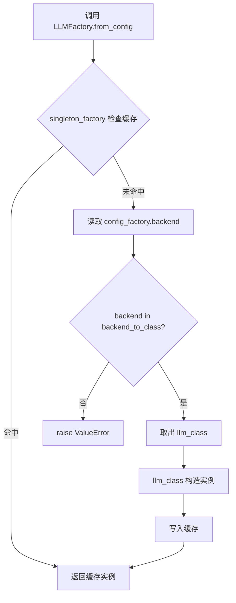
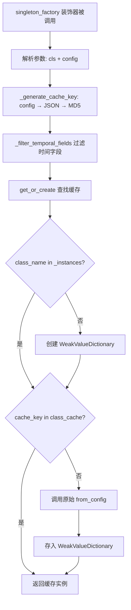

# PD-402.01 MemOS — 14 Factory 全组件可插拔工厂体系

> 文档编号：PD-402.01
> 来源：MemOS `src/memos/*/factory.py` + `src/memos/memos_tools/singleton.py`
> GitHub：https://github.com/MemTensor/MemOS.git
> 问题域：PD-402 工厂模式与组件注册 Factory Pattern & Component Registry
> 状态：可复用方案

---

## 第 1 章 问题与动机

### 1.1 核心问题

一个记忆操作系统（MemOS）需要同时管理 LLM、Embedder、向量数据库、图数据库、解析器、分块器、重排器、记忆存储、调度器、用户管理等十余种组件，每种组件又有多个后端实现（如 LLM 就有 OpenAI/Azure/Ollama/DeepSeek/vLLM/Qwen/HuggingFace 等 9 种）。如果在业务代码中直接 `if/elif` 分支创建实例，会导致：

1. **耦合爆炸** — 业务层必须 import 所有后端实现类，新增后端需要修改所有调用点
2. **重复初始化** — 同一配置的 LLM/Embedder 被多处创建，浪费 GPU 显存和连接资源
3. **配置散落** — 每个调用点自行解析配置，格式不统一，校验缺失
4. **扩展困难** — 社区贡献者添加新后端需要理解整个系统的初始化流程

### 1.2 MemOS 的解法概述

MemOS 用 **14 个 Factory 类 + 双层 ConfigFactory + singleton_factory 装饰器** 构建了一套完整的组件工厂体系：

1. **统一工厂协议** — 每个 Factory 类都有 `backend_to_class: ClassVar[dict]` 映射表和 `from_config(cls, config_factory)` 类方法，形成全项目一致的组件创建协议（`src/memos/llms/factory.py:16-38`）
2. **双层 ConfigFactory** — 配置层也用工厂模式：`LLMConfigFactory` 根据 `backend` 字段自动将 `config: dict` 验证并转换为对应的 Pydantic 模型（`src/memos/configs/llm.py:122-152`）
3. **WeakRef 单例缓存** — `singleton_factory` 装饰器基于配置 MD5 哈希做缓存键，用 `WeakValueDictionary` 自动回收不再引用的实例（`src/memos/memos_tools/singleton.py:18-98`）
4. **时间字段过滤** — 单例缓存键生成时自动过滤 `created_at`/`updated_at` 等时间字段，避免同一逻辑配置因时间戳不同而创建多个实例（`src/memos/memos_tools/singleton.py:51-81`）
5. **零侵入扩展** — 新增后端只需：① 实现 Base 类 ② 在 `backend_to_class` 映射表加一行 ③ 在 ConfigFactory 加对应配置类

### 1.3 设计思想

| 设计原则 | 具体实现 | 理由 | 替代方案 |
|----------|----------|------|----------|
| 映射表集中管理 | `ClassVar[dict[str, Any]]` 静态映射 | 一眼看清所有后端，新增只改一行 | 装饰器自注册（分散在各文件） |
| 配置即校验 | Pydantic `model_validator` 自动转换 config dict | 配置错误在加载时就报错，不会到运行时 | 手动 if/elif 校验 |
| 弱引用单例 | `WeakValueDictionary` + MD5 哈希键 | 同配置不重复创建，无引用时自动 GC | 全局 dict 永不释放 |
| 时间字段免疫 | `_filter_temporal_fields` 递归过滤 | 配置对象常带时间戳，不应影响实例复用 | 要求调用方手动剥离时间字段 |
| Factory 继承 Base | `LLMFactory(BaseLLM)` 继承抽象基类 | 类型系统一致，Factory 可作为类型注解 | 独立工具函数 |

---

## 第 2 章 源码实现分析

### 2.1 架构概览

MemOS 的工厂体系分三层：配置工厂层、组件工厂层、单例缓存层。

```
┌─────────────────────────────────────────────────────────────────┐
│                    MemOSConfigFactory (顶层)                      │
│  config: dict → MOSConfig(chat_model, mem_reader, scheduler...) │
└──────────────────────────┬──────────────────────────────────────┘
                           │ 嵌套 ConfigFactory
        ┌──────────────────┼──────────────────┐
        ▼                  ▼                  ▼
┌──────────────┐  ┌──────────────┐  ┌──────────────┐
│LLMConfigFactory│ │EmbedderConfig│  │GraphDBConfig │  ... (14 种)
│backend→Config │ │Factory       │  │Factory       │
│model_validator│ │              │  │              │
└──────┬───────┘  └──────┬───────┘  └──────┬───────┘
       │                 │                 │
       ▼                 ▼                 ▼
┌──────────────┐  ┌──────────────┐  ┌──────────────┐
│  LLMFactory  │  │EmbedderFactory│ │GraphStoreFactory│
│backend_to_cls│  │backend_to_cls│  │backend_to_cls│
│ from_config()│  │ from_config()│  │ from_config()│
└──────┬───────┘  └──────┬───────┘  └──────┬───────┘
       │                 │                 │
       ▼                 ▼                 ▼
┌──────────────────────────────────────────────┐
│         singleton_factory 装饰器              │
│  FactorySingleton._instances (WeakValueDict) │
│  MD5(config_json) → cached instance          │
└──────────────────────────────────────────────┘
```

14 个 Factory 类完整清单：

| Factory | 文件 | 后端数 | 单例 |
|---------|------|--------|------|
| LLMFactory | `llms/factory.py` | 9 | ✅ |
| EmbedderFactory | `embedders/factory.py` | 4 | ✅ |
| GraphStoreFactory | `graph_dbs/factory.py` | 5 | ✗ |
| VecDBFactory | `vec_dbs/factory.py` | 2 | ✗ |
| MemoryFactory | `memories/factory.py` | 9 | ✗ |
| ParserFactory | `parsers/factory.py` | 1 | ✅ |
| ChunkerFactory | `chunkers/factory.py` | 2 | ✗ |
| RerankerFactory | `reranker/factory.py` | 4 | ✅ |
| RerankerStrategyFactory | `reranker/strategies/factory.py` | 4 | ✗ |
| MemReaderFactory | `mem_reader/factory.py` | 3 | ✅ |
| MemChatFactory | `mem_chat/factory.py` | 1 | ✗ |
| MemAgentFactory | `mem_agent/factory.py` | 1 | ✗ |
| SchedulerFactory | `mem_scheduler/scheduler_factory.py` | 2 | ✗ |
| UserManagerFactory | `mem_user/factory.py` | 2 | ✗ |
| InternetRetrieverFactory | `memories/.../internet_retriever_factory.py` | 4 | ✅ |
| AdderFactory / ExtractorFactory / RetrieverFactory | `memories/.../prefer_text_memory/factory.py` | 各 1 | ✗ |

### 2.2 核心实现

#### 2.2.1 标准工厂模式 — LLMFactory



对应源码 `src/memos/llms/factory.py:16-38`：

```python
class LLMFactory(BaseLLM):
    """Factory class for creating LLM instances."""

    backend_to_class: ClassVar[dict[str, Any]] = {
        "openai": OpenAILLM,
        "azure": AzureLLM,
        "ollama": OllamaLLM,
        "huggingface": HFLLM,
        "huggingface_singleton": HFSingletonLLM,
        "vllm": VLLMLLM,
        "qwen": QwenLLM,
        "deepseek": DeepSeekLLM,
        "openai_new": OpenAIResponsesLLM,
    }

    @classmethod
    @singleton_factory()
    def from_config(cls, config_factory: LLMConfigFactory) -> BaseLLM:
        backend = config_factory.backend
        if backend not in cls.backend_to_class:
            raise ValueError(f"Invalid backend: {backend}")
        llm_class = cls.backend_to_class[backend]
        return llm_class(config_factory.config)
```

关键设计点：
- Factory 继承 `BaseLLM`，使得 `LLMFactory` 本身可以作为 `BaseLLM` 类型注解使用
- `backend_to_class` 用 `ClassVar` 声明，不参与 Pydantic 序列化
- `@singleton_factory()` 装饰在 `@classmethod` 之下，确保 `cls` 参数正确传递

#### 2.2.2 WeakRef 单例缓存 — singleton_factory



对应源码 `src/memos/memos_tools/singleton.py:18-174`：

```python
class FactorySingleton:
    """Factory singleton manager that caches instances based on configuration parameters"""

    def __init__(self):
        self._instances: dict[str, WeakValueDictionary] = {}

    def _generate_cache_key(self, config: Any, *args, **kwargs) -> str:
        if hasattr(config, "model_dump"):
            config_data = config.model_dump()
        elif hasattr(config, "dict"):
            config_data = config.dict()
        elif isinstance(config, dict):
            config_data = config
        else:
            config_data = str(config)
        filtered_config = self._filter_temporal_fields(config_data)
        try:
            cache_str = json.dumps(filtered_config, sort_keys=True,
                                   ensure_ascii=False, default=str)
        except (TypeError, ValueError):
            cache_str = str(filtered_config)
        return hashlib.md5(cache_str.encode("utf-8")).hexdigest()

    def _filter_temporal_fields(self, config_data: Any) -> Any:
        if isinstance(config_data, dict):
            filtered = {}
            for key, value in config_data.items():
                if key.lower() in {
                    "created_at", "updated_at", "timestamp", "time",
                    "date", "created_time", "updated_time", "last_modified",
                    "modified_at", "start_time", "end_time",
                    "execution_time", "run_time",
                }:
                    continue
                filtered[key] = self._filter_temporal_fields(value)
            return filtered
        elif isinstance(config_data, list):
            return [self._filter_temporal_fields(item) for item in config_data]
        return config_data

    def get_or_create(self, factory_class, cache_key, creator_func):
        class_name = factory_class.__name__
        if class_name not in self._instances:
            self._instances[class_name] = WeakValueDictionary()
        class_cache = self._instances[class_name]
        if cache_key in class_cache:
            return class_cache[cache_key]
        instance = creator_func()
        class_cache[cache_key] = instance
        return instance

# 全局单例管理器
_factory_singleton = FactorySingleton()
```

### 2.3 实现细节

#### 双层 ConfigFactory — 配置也用工厂

`LLMConfigFactory` 本身也是一个工厂，它在 Pydantic `model_validator` 中根据 `backend` 字段将原始 `config: dict` 转换为对应的强类型配置类（`src/memos/configs/llm.py:122-152`）：

```python
class LLMConfigFactory(BaseConfig):
    backend: str = Field(..., description="Backend for LLM")
    config: dict[str, Any] = Field(..., description="Configuration for the LLM backend")

    backend_to_class: ClassVar[dict[str, Any]] = {
        "openai": OpenAILLMConfig,
        "ollama": OllamaLLMConfig,
        "azure": AzureLLMConfig,
        "huggingface": HFLLMConfig,
        "vllm": VLLMLLMConfig,
        "qwen": QwenLLMConfig,
        "deepseek": DeepSeekLLMConfig,
        "openai_new": OpenAIResponsesLLMConfig,
    }

    @field_validator("backend")
    @classmethod
    def validate_backend(cls, backend: str) -> str:
        if backend not in cls.backend_to_class:
            raise ValueError(f"Invalid backend: {backend}")
        return backend

    @model_validator(mode="after")
    def create_config(self) -> "LLMConfigFactory":
        config_class = self.backend_to_class[self.backend]
        self.config = config_class(**self.config)
        return self
```

这意味着当用户传入 `{"backend": "openai", "config": {"api_key": "sk-...", "model_name_or_path": "gpt-4"}}` 时，`config` 字段会被自动验证并转换为 `OpenAILLMConfig` 实例。如果缺少必填字段或类型不对，Pydantic 会在加载阶段就抛出明确错误。

#### 变体工厂 — RerankerFactory 的 if/elif 模式

并非所有 Factory 都用纯映射表。`RerankerFactory`（`src/memos/reranker/factory.py:23-72`）因为不同后端的构造参数差异较大，采用了 `if/elif` 分支 + 手动参数映射的方式，同时仍然用 `@singleton_factory("RerankerFactory")` 做单例缓存。这是一种务实的变体——当后端构造签名不统一时，强行统一反而增加复杂度。

#### 依赖注入变体 — MemAgentFactory

`MemAgentFactory`（`src/memos/mem_agent/factory.py:8-36`）的 `from_config` 接受额外的 `llm` 和 `memory_retriever` 参数，实现了简单的依赖注入。这种模式在需要跨组件协作时很常见——Agent 需要 LLM 和 Memory，但不应该自己创建它们。

#### 便捷工厂方法 — UserManagerFactory

`UserManagerFactory`（`src/memos/mem_user/factory.py:8-94`）除了标准 `from_config` 外，还提供了 `create_sqlite()` 和 `create_mysql()` 便捷方法，内部构造 `ConfigFactory` 再调用 `from_config`。这是对高频使用场景的人性化封装。

---

## 第 3 章 迁移指南

### 3.1 迁移清单

**阶段 1：基础工厂骨架（1 个组件）**

- [ ] 选择一个组件类型（如 LLM），定义 `BaseLLM` 抽象基类
- [ ] 创建 `LLMFactory` 类，包含 `backend_to_class` 映射和 `from_config` 类方法
- [ ] 创建 `LLMConfigFactory`（Pydantic BaseModel），用 `model_validator` 自动转换 config dict
- [ ] 实现至少 2 个后端（如 OpenAI + Ollama）验证工厂可切换

**阶段 2：单例缓存层**

- [ ] 实现 `FactorySingleton` 类，使用 `WeakValueDictionary` 做缓存
- [ ] 实现 `singleton_factory` 装饰器，支持 `@classmethod` 和 `@staticmethod`
- [ ] 添加时间字段过滤逻辑（可选，根据项目需要）
- [ ] 在需要单例的 Factory 上添加 `@singleton_factory()` 装饰器

**阶段 3：全组件推广**

- [ ] 按相同模式为其他组件创建 Factory（Embedder、VecDB、GraphDB 等）
- [ ] 创建顶层 `AppConfigFactory`，嵌套所有子 ConfigFactory
- [ ] 统一所有组件的创建入口为 `XxxFactory.from_config(config_factory)`

### 3.2 适配代码模板

#### 模板 1：标准工厂 + 配置工厂

```python
from abc import ABC, abstractmethod
from typing import Any, ClassVar

from pydantic import BaseModel, ConfigDict, Field, field_validator, model_validator


# ---- 抽象基类 ----
class BaseProvider(ABC):
    @abstractmethod
    def __init__(self, config: Any): ...

    @abstractmethod
    def execute(self, input_data: str) -> str: ...


# ---- 具体实现 ----
class ProviderA(BaseProvider):
    def __init__(self, config):
        self.api_key = config.api_key
        self.endpoint = config.endpoint

    def execute(self, input_data: str) -> str:
        return f"ProviderA({self.endpoint}): {input_data}"


class ProviderB(BaseProvider):
    def __init__(self, config):
        self.model_path = config.model_path

    def execute(self, input_data: str) -> str:
        return f"ProviderB({self.model_path}): {input_data}"


# ---- 配置类 ----
class ProviderAConfig(BaseModel):
    model_config = ConfigDict(extra="forbid")
    api_key: str = Field(..., description="API key")
    endpoint: str = Field(default="https://api.example.com", description="API endpoint")


class ProviderBConfig(BaseModel):
    model_config = ConfigDict(extra="forbid")
    model_path: str = Field(..., description="Local model path")


# ---- 配置工厂 ----
class ProviderConfigFactory(BaseModel):
    backend: str = Field(..., description="Backend name")
    config: dict[str, Any] = Field(..., description="Backend config")

    backend_to_class: ClassVar[dict[str, type]] = {
        "provider_a": ProviderAConfig,
        "provider_b": ProviderBConfig,
    }

    @field_validator("backend")
    @classmethod
    def validate_backend(cls, v: str) -> str:
        if v not in cls.backend_to_class:
            raise ValueError(f"Unknown backend: {v}. Available: {list(cls.backend_to_class)}")
        return v

    @model_validator(mode="after")
    def create_config(self) -> "ProviderConfigFactory":
        config_class = self.backend_to_class[self.backend]
        self.config = config_class(**self.config)
        return self


# ---- 组件工厂 ----
class ProviderFactory(BaseProvider):
    backend_to_class: ClassVar[dict[str, type[BaseProvider]]] = {
        "provider_a": ProviderA,
        "provider_b": ProviderB,
    }

    @classmethod
    def from_config(cls, config_factory: ProviderConfigFactory) -> BaseProvider:
        backend = config_factory.backend
        if backend not in cls.backend_to_class:
            raise ValueError(f"Invalid backend: {backend}")
        provider_class = cls.backend_to_class[backend]
        return provider_class(config_factory.config)


# ---- 使用 ----
cfg = ProviderConfigFactory(backend="provider_a", config={"api_key": "sk-xxx"})
provider = ProviderFactory.from_config(cfg)
print(provider.execute("hello"))  # ProviderA(https://api.example.com): hello
```

#### 模板 2：singleton_factory 装饰器

```python
import hashlib
import json
from collections.abc import Callable
from functools import wraps
from typing import Any, TypeVar
from weakref import WeakValueDictionary

T = TypeVar("T")


class FactorySingleton:
    def __init__(self):
        self._instances: dict[str, WeakValueDictionary] = {}

    def _generate_cache_key(self, config: Any) -> str:
        if hasattr(config, "model_dump"):
            config_data = config.model_dump()
        elif isinstance(config, dict):
            config_data = config
        else:
            config_data = str(config)
        cache_str = json.dumps(config_data, sort_keys=True, default=str)
        return hashlib.md5(cache_str.encode()).hexdigest()

    def get_or_create(self, factory_class: type, cache_key: str, creator: Callable) -> Any:
        name = factory_class.__name__
        if name not in self._instances:
            self._instances[name] = WeakValueDictionary()
        cache = self._instances[name]
        if cache_key in cache:
            return cache[cache_key]
        instance = creator()
        cache[cache_key] = instance
        return instance


_singleton = FactorySingleton()


def singleton_factory(factory_class=None):
    def decorator(func):
        @wraps(func)
        def wrapper(*args, **kwargs):
            cls_arg = args[0] if args and hasattr(args[0], "__name__") else None
            config = args[1] if cls_arg and len(args) > 1 else (args[0] if args else None)
            if config is None:
                return func(*args, **kwargs)
            target = factory_class or cls_arg
            key = _singleton._generate_cache_key(config)
            return _singleton.get_or_create(target, key, lambda: func(*args, **kwargs))
        return wrapper
    return decorator
```

### 3.3 适用场景

| 场景 | 适用度 | 说明 |
|------|--------|------|
| 多 LLM 后端切换 | ⭐⭐⭐ | 最典型场景，OpenAI/Ollama/vLLM 等按配置切换 |
| 多数据库后端 | ⭐⭐⭐ | VecDB（Qdrant/Milvus）、GraphDB（Neo4j/Postgres）等 |
| 微服务组件注册 | ⭐⭐ | 适合组件数 < 20 的中型系统，超大规模建议用 DI 框架 |
| 插件系统 | ⭐⭐ | 映射表是静态的，不支持运行时动态注册，需扩展 |
| GPU 资源复用 | ⭐⭐⭐ | singleton_factory 避免同模型重复加载到显存 |

---

## 第 4 章 测试用例

```python
import pytest
from unittest.mock import MagicMock, patch
from typing import Any, ClassVar
from pydantic import BaseModel, Field, field_validator, model_validator


# ---- 测试用最小实现 ----
class FakeConfig(BaseModel):
    api_key: str = "test-key"
    endpoint: str = "http://localhost"


class FakeConfigFactory(BaseModel):
    backend: str
    config: dict[str, Any] = {}

    backend_to_class: ClassVar[dict] = {"fake": FakeConfig}

    @model_validator(mode="after")
    def create_config(self):
        self.config = self.backend_to_class[self.backend](**self.config)
        return self


class FakeBase:
    def __init__(self, config): self.config = config


class FakeImplA(FakeBase): pass
class FakeImplB(FakeBase): pass


class FakeFactory:
    backend_to_class: ClassVar[dict] = {"a": FakeImplA, "b": FakeImplB}

    @classmethod
    def from_config(cls, config_factory):
        backend = config_factory.backend
        if backend not in cls.backend_to_class:
            raise ValueError(f"Invalid backend: {backend}")
        return cls.backend_to_class[backend](config_factory.config)


# ---- 测试 ----
class TestFactoryPattern:
    def test_normal_backend_selection(self):
        """正常路径：根据 backend 选择正确的实现类"""
        cfg = FakeConfigFactory(backend="fake", config={"api_key": "k1"})
        assert isinstance(cfg.config, FakeConfig)
        assert cfg.config.api_key == "k1"

    def test_invalid_backend_raises(self):
        """边界：无效 backend 应抛出 ValueError"""
        cfg = MagicMock()
        cfg.backend = "nonexistent"
        with pytest.raises(ValueError, match="Invalid backend"):
            FakeFactory.from_config(cfg)

    def test_backend_to_class_returns_correct_type(self):
        """验证映射表返回正确的类"""
        cfg_a = MagicMock(backend="a", config=FakeConfig())
        cfg_b = MagicMock(backend="b", config=FakeConfig())
        assert isinstance(FakeFactory.from_config(cfg_a), FakeImplA)
        assert isinstance(FakeFactory.from_config(cfg_b), FakeImplB)

    def test_config_validation_rejects_extra_fields(self):
        """Pydantic strict 模式拒绝多余字段"""
        with pytest.raises(Exception):
            FakeConfig(api_key="k", endpoint="e", unknown_field="x")


class TestSingletonFactory:
    def test_same_config_returns_same_instance(self):
        """同配置应返回同一实例"""
        from memos.memos_tools.singleton import FactorySingleton
        mgr = FactorySingleton()
        key = mgr._generate_cache_key({"model": "gpt-4", "api_key": "sk-1"})
        obj1 = mgr.get_or_create(FakeFactory, key, lambda: FakeImplA(None))
        obj2 = mgr.get_or_create(FakeFactory, key, lambda: FakeImplA(None))
        assert obj1 is obj2

    def test_different_config_returns_different_instance(self):
        """不同配置应返回不同实例"""
        from memos.memos_tools.singleton import FactorySingleton
        mgr = FactorySingleton()
        key1 = mgr._generate_cache_key({"model": "gpt-4"})
        key2 = mgr._generate_cache_key({"model": "gpt-3.5"})
        obj1 = mgr.get_or_create(FakeFactory, key1, lambda: FakeImplA(None))
        obj2 = mgr.get_or_create(FakeFactory, key2, lambda: FakeImplB(None))
        assert obj1 is not obj2

    def test_temporal_fields_ignored_in_cache_key(self):
        """时间字段不影响缓存键"""
        from memos.memos_tools.singleton import FactorySingleton
        mgr = FactorySingleton()
        key1 = mgr._generate_cache_key({"model": "gpt-4", "created_at": "2024-01-01"})
        key2 = mgr._generate_cache_key({"model": "gpt-4", "created_at": "2025-06-15"})
        assert key1 == key2

    def test_clear_cache(self):
        """清除缓存后应创建新实例"""
        from memos.memos_tools.singleton import FactorySingleton
        mgr = FactorySingleton()
        key = mgr._generate_cache_key({"model": "gpt-4"})
        obj1 = mgr.get_or_create(FakeFactory, key, lambda: FakeImplA(None))
        mgr.clear_cache(FakeFactory)
        obj2 = mgr.get_or_create(FakeFactory, key, lambda: FakeImplA(None))
        assert obj1 is not obj2
```

---

## 第 5 章 跨域关联

| 关联域 | 关系类型 | 说明 |
|--------|----------|------|
| PD-01 上下文管理 | 协同 | LLMFactory 创建的 LLM 实例被上下文管理模块消费，单例缓存确保同一 LLM 不被重复创建 |
| PD-03 容错与重试 | 协同 | Factory 的 `from_config` 中 backend 校验是第一道防线，无效配置在创建阶段就被拦截 |
| PD-04 工具系统 | 依赖 | MemOS 的工具系统（MemReader、MemAgent）通过 Factory 获取 LLM 和 Memory 实例 |
| PD-06 记忆持久化 | 依赖 | MemoryFactory 管理 9 种记忆后端（naive_text/tree_text/kv_cache/lora 等），是记忆系统的入口 |
| PD-08 搜索与检索 | 协同 | EmbedderFactory + VecDBFactory + RerankerFactory 共同构成检索管线的组件供给 |
| PD-10 中间件管道 | 互补 | Factory 负责组件创建，中间件管道负责组件间的数据流编排，两者分工明确 |

---

## 第 6 章 来源文件索引

| 文件 | 行范围 | 关键实现 |
|------|--------|----------|
| `src/memos/llms/factory.py` | L1-38 | LLMFactory：9 后端映射 + singleton 缓存 |
| `src/memos/embedders/factory.py` | L1-29 | EmbedderFactory：4 后端映射 + singleton 缓存 |
| `src/memos/graph_dbs/factory.py` | L1-29 | GraphStoreFactory：5 后端映射（Neo4j/Nebula/PolarDB/Postgres） |
| `src/memos/vec_dbs/factory.py` | L1-23 | VecDBFactory：Qdrant + Milvus |
| `src/memos/memories/factory.py` | L1-42 | MemoryFactory：9 种记忆后端（text/kv_cache/lora） |
| `src/memos/parsers/factory.py` | L1-21 | ParserFactory：MarkItDown 解析器 + singleton |
| `src/memos/chunkers/factory.py` | L1-24 | ChunkerFactory：Sentence + Markdown 分块 |
| `src/memos/reranker/factory.py` | L1-72 | RerankerFactory：if/elif 变体 + singleton |
| `src/memos/reranker/strategies/factory.py` | L1-31 | RerankerStrategyFactory：4 种重排策略 |
| `src/memos/mem_reader/factory.py` | L1-58 | MemReaderFactory：3 后端 + 依赖注入 graph_db/searcher |
| `src/memos/mem_chat/factory.py` | L1-21 | MemChatFactory：SimpleMemChat |
| `src/memos/mem_agent/factory.py` | L1-36 | MemAgentFactory：依赖注入 llm + memory_retriever |
| `src/memos/mem_scheduler/scheduler_factory.py` | L1-23 | SchedulerFactory：General + Optimized |
| `src/memos/mem_user/factory.py` | L1-94 | UserManagerFactory：SQLite/MySQL + 便捷方法 |
| `src/memos/memories/textual/tree_text_memory/retrieve/internet_retriever_factory.py` | L1-102 | InternetRetrieverFactory：Google/Bing/Xinyu/Bocha |
| `src/memos/memories/textual/prefer_text_memory/factory.py` | L1-85 | Adder/Extractor/RetrieverFactory：偏好记忆子组件 |
| `src/memos/memos_tools/singleton.py` | L1-174 | FactorySingleton + singleton_factory 装饰器 |
| `src/memos/configs/llm.py` | L122-152 | LLMConfigFactory：双层配置工厂 + Pydantic 校验 |
| `src/memos/configs/base.py` | L1-83 | BaseConfig：JSON/YAML 序列化 + schema 自动设置 |
| `src/memos/configs/mem_os.py` | L75-83 | MemOSConfigFactory：顶层配置嵌套所有子 ConfigFactory |
| `src/memos/llms/base.py` | L1-26 | BaseLLM：ABC 抽象基类定义 generate/generate_stream |

---

## 第 7 章 横向对比维度

```json comparison_data
{
  "project": "MemOS",
  "dimensions": {
    "注册方式": "ClassVar[dict] 静态映射表，14 个 Factory 统一协议",
    "配置校验": "双层 Pydantic ConfigFactory，model_validator 自动转换 config dict 为强类型",
    "单例策略": "WeakValueDictionary + MD5(config_json) 缓存键，时间字段自动过滤",
    "扩展机制": "映射表加一行 + 实现 Base 类，零侵入",
    "工厂变体": "标准映射 / if-elif 分支 / 依赖注入 / 便捷方法四种变体共存"
  }
}
```

### 域元数据补充

```json domain_metadata
{
  "solution_summary": "MemOS 用 14 个 Factory 类 + 双层 Pydantic ConfigFactory + WeakRef singleton_factory 装饰器实现全组件可插拔，覆盖 LLM/Embedder/VecDB/GraphDB/Memory 等 9 大类 50+ 后端",
  "description": "配置层也用工厂模式，实现从 YAML/JSON 到强类型配置的自动校验与转换",
  "sub_problems": [
    "时间字段污染缓存键导致伪重复实例",
    "不同后端构造签名不统一时的工厂变体选择",
    "工厂方法中的跨组件依赖注入"
  ],
  "best_practices": [
    "WeakValueDictionary 自动回收无引用实例避免内存泄漏",
    "Pydantic model_validator 在配置加载阶段完成类型转换和校验",
    "Factory 继承 Base 抽象类使工厂本身可作为类型注解"
  ]
}
```
