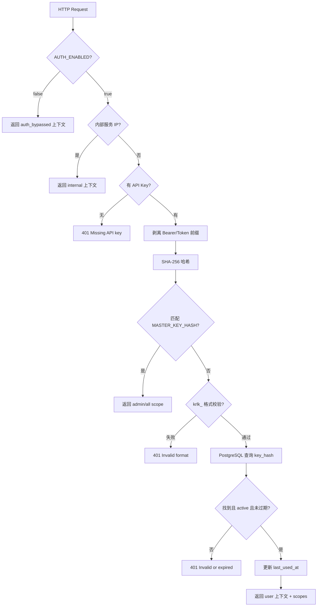
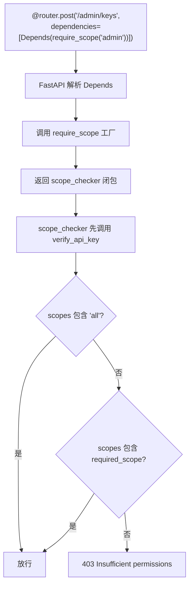

# PD-403.01 MemOS — SHA-256 API Key 认证与 Scope 依赖注入工厂

> 文档编号：PD-403.01
> 来源：MemOS `src/memos/api/middleware/auth.py`
> GitHub：https://github.com/MemTensor/MemOS.git
> 问题域：PD-403 认证授权 Authentication & Authorization
> 状态：可复用方案

---

## 第 1 章 问题与动机

### 1.1 核心问题

MemOS 是一个记忆操作系统（Memory Operating System），通过 REST API 暴露记忆的增删改查和向量检索能力。当部署为多用户服务时，面临三个认证授权挑战：

1. **密钥安全存储**：API Key 不能明文存储在数据库中，泄露数据库即泄露所有用户凭证
2. **细粒度权限控制**：不同用户需要不同的操作权限（只读、读写、管理员），且权限检查需要与业务逻辑解耦
3. **内部服务互信**：微服务架构下，内部服务（MCP server、bot 等）之间的调用不应走完整认证流程

### 1.2 MemOS 的解法概述

MemOS 通过 Krolik 扩展层（`server_api_ext.py:1-16`）在基础 API 之上叠加认证体系，核心设计：

1. **SHA-256 单向哈希存储**：API Key 生成后仅返回一次，数据库只存哈希值（`api_keys.py:37`）
2. **双轨密钥体系**：`krlk_` 前缀普通 Key + `mk_` 前缀 Master Key，Master Key 哈希存环境变量而非数据库（`auth.py:27`）
3. **require_scope 工厂函数**：返回 FastAPI Depends 依赖的闭包，实现声明式权限控制（`auth.py:240-262`）
4. **三层认证豁免**：AUTH_ENABLED 全局开关 → 内部 IP 白名单 → Bearer/Token 前缀兼容（`auth.py:157-237`）
5. **Redis 滑动窗口限流**：按 API Key 或 IP 维度限流，Redis 不可用时降级到进程内存（`rate_limit.py:77-119`）

### 1.3 设计思想

| 设计原则 | 具体实现 | 理由 | 替代方案 |
|----------|----------|------|----------|
| 零信任密钥存储 | SHA-256 哈希，数据库无明文 | 数据库泄露不暴露密钥 | bcrypt（更慢但抗暴力破解） |
| 依赖注入权限 | `require_scope()` 工厂返回 Depends 闭包 | 路由声明式标注，零侵入业务代码 | 装饰器模式（耦合更紧） |
| 双轨密钥分离 | Master Key 存 env，普通 Key 存 DB | Master Key 不受数据库故障影响 | 统一存 DB（单点故障） |
| 渐进式认证 | AUTH_ENABLED 开关 + 内部 IP 白名单 | 开发环境零配置，生产环境逐步启用 | 始终强制认证（开发体验差） |
| 限流前置于认证 | RateLimitMiddleware 在 auth 之前 | 防止暴力破解消耗认证资源 | 认证后限流（已被攻击时无保护） |

---

## 第 2 章 源码实现分析

### 2.1 架构概览

MemOS 的认证授权体系分为四层，通过 FastAPI 中间件栈和依赖注入组合：

```
┌─────────────────────────────────────────────────────┐
│                   HTTP Request                       │
├─────────────────────────────────────────────────────┤
│  Layer 1: SecurityHeadersMiddleware                  │
│           (X-Content-Type-Options, X-Frame-Options)  │
├─────────────────────────────────────────────────────┤
│  Layer 2: RateLimitMiddleware                        │
│           Redis 滑动窗口 → 内存降级                    │
│           按 krlk_ Key 前缀 或 IP 维度限流             │
├─────────────────────────────────────────────────────┤
│  Layer 3: CORSMiddleware                             │
│           白名单域名 + Authorization 头放行             │
├─────────────────────────────────────────────────────┤
│  Layer 4: verify_api_key (Depends 注入)               │
│           AUTH_ENABLED? → 内部IP? → Master Key?       │
│           → krlk_ 格式校验 → DB 查询 → scope 检查      │
├─────────────────────────────────────────────────────┤
│                   Route Handler                      │
└─────────────────────────────────────────────────────┘
```

关键组件关系：
- `server_api_ext.py` 是入口，组装中间件栈和路由（`server_api_ext.py:62-98`）
- `auth.py` 提供 `verify_api_key` 和 `require_scope` 两个核心依赖
- `api_keys.py` 提供密钥生成和数据库 CRUD
- `admin_router.py` 暴露密钥管理 REST API，自身受 `require_scope("admin")` 保护

### 2.2 核心实现

#### 2.2.1 API Key 认证主流程



对应源码 `src/memos/api/middleware/auth.py:157-237`：

```python
async def verify_api_key(
    request: Request,
    api_key: str | None = Security(API_KEY_HEADER),
) -> dict[str, Any]:
    # Skip auth if disabled
    if not AUTH_ENABLED:
        return {
            "user_name": request.headers.get("X-User-Name", "default"),
            "scopes": ["all"],
            "is_master_key": False,
            "auth_bypassed": True,
        }

    # Allow internal services
    if is_internal_request(request):
        return {
            "user_name": "internal",
            "scopes": ["all"],
            "is_master_key": False,
            "is_internal": True,
        }

    # Require API key
    if not api_key:
        raise HTTPException(status_code=401, detail="Missing API key",
                            headers={"WWW-Authenticate": "ApiKey"})

    # Handle "Bearer" or "Token" prefix
    if api_key.lower().startswith("bearer "):
        api_key = api_key[7:]
    elif api_key.lower().startswith("token "):
        api_key = api_key[6:]

    # Check against master key first
    key_hash = hash_api_key(api_key)
    if MASTER_KEY_HASH and key_hash == MASTER_KEY_HASH:
        return {"user_name": "admin", "scopes": ["all"], "is_master_key": True}

    # Validate format for regular API keys
    if not validate_key_format(api_key):
        raise HTTPException(status_code=401, detail="Invalid API key format")

    # Look up in database
    key_data = await lookup_api_key(key_hash)
    if not key_data:
        raise HTTPException(status_code=401, detail="Invalid or expired API key")

    return {
        "user_name": key_data["user_name"],
        "scopes": key_data["scopes"],
        "is_master_key": False,
        "api_key_id": key_data["id"],
    }
```

#### 2.2.2 require_scope 依赖注入工厂



对应源码 `src/memos/api/middleware/auth.py:240-268`：

```python
def require_scope(required_scope: str):
    """Dependency factory to require a specific scope."""
    async def scope_checker(
        auth: dict[str, Any] = Depends(verify_api_key),
    ) -> dict[str, Any]:
        scopes = auth.get("scopes", [])
        # "all" scope grants everything
        if "all" in scopes or required_scope in scopes:
            return auth
        raise HTTPException(
            status_code=403,
            detail=f"Insufficient permissions. Required scope: {required_scope}",
        )
    return scope_checker

# Convenience dependencies
require_read = require_scope("read")
require_write = require_scope("write")
require_admin = require_scope("admin")
```

### 2.3 实现细节

#### API Key 生成与格式

密钥生成使用 `secrets.token_bytes(32)` 产生 256 位随机数，格式为 `krlk_<64-hex>`（`api_keys.py:23-40`）。Master Key 使用 `mk_` 前缀区分（`api_keys.py:71-81`）。格式校验在认证流程中前置于数据库查询，避免无效 Key 消耗 DB 连接。

#### 数据库连接池

认证模块使用独立的 `psycopg2.pool.ThreadedConnectionPool`（`auth.py:34-57`），与业务数据库连接池隔离。懒初始化模式：首次认证请求时才创建连接池，`minconn=1, maxconn=5` 控制资源占用。

#### 内部服务识别

双重判断机制（`auth.py:144-154`）：
1. 客户端 IP 匹配硬编码白名单 `{"127.0.0.1", "::1", "memos-mcp", "moltbot", "clawdbot"}`
2. `X-Internal-Service` 请求头匹配 `INTERNAL_SERVICE_SECRET` 环境变量

#### 限流与认证的协作

`RateLimitMiddleware` 通过 `_get_client_key`（`rate_limit.py:54-74`）识别请求身份：优先用 `krlk_` 前缀的前 20 字符作为限流 Key，否则用客户端 IP。这样同一用户的不同 Key 有独立配额，且限流在认证之前执行（`server_api_ext.py:90-94`），防止暴力破解。


---

## 第 3 章 迁移指南

### 3.1 迁移清单

**阶段 1：基础认证（1 个文件）**
- [ ] 创建 `middleware/auth.py`，实现 `hash_api_key`、`validate_key_format`、`verify_api_key`
- [ ] 配置 `AUTH_ENABLED` 环境变量开关
- [ ] 在 FastAPI app 中通过 `Depends(verify_api_key)` 保护路由

**阶段 2：数据库存储（2 个文件）**
- [ ] 创建 `api_keys` 表（key_hash, key_prefix, user_name, scopes, expires_at, is_active, last_used_at）
- [ ] 实现 `utils/api_keys.py`：generate_api_key、create_api_key_in_db、revoke_api_key、list_api_keys
- [ ] 配置 PostgreSQL 连接池（懒初始化）

**阶段 3：权限控制（1 个文件）**
- [ ] 实现 `require_scope` 工厂函数
- [ ] 创建 `admin_router.py`，暴露密钥 CRUD API
- [ ] 用 `dependencies=[Depends(require_scope("admin"))]` 保护管理端点

**阶段 4：生产加固（可选）**
- [ ] 添加 Master Key 机制（环境变量存哈希）
- [ ] 添加内部服务 IP 白名单
- [ ] 添加 Redis 滑动窗口限流
- [ ] 添加安全响应头中间件

### 3.2 适配代码模板

以下是可直接复用的最小认证模块，基于 MemOS 的设计但简化了数据库依赖：

```python
"""Minimal API Key Auth — 基于 MemOS PD-403 方案的可复用模板"""
import hashlib
import os
import secrets
from dataclasses import dataclass
from typing import Any

from fastapi import Depends, HTTPException, Security
from fastapi.security import APIKeyHeader

# --- 配置 ---
AUTH_ENABLED = os.getenv("AUTH_ENABLED", "false").lower() == "true"
MASTER_KEY_HASH = os.getenv("MASTER_KEY_HASH")
API_KEY_HEADER = APIKeyHeader(name="Authorization", auto_error=False)

# --- 密钥生成 ---
@dataclass
class APIKey:
    key: str
    key_hash: str
    key_prefix: str

def generate_api_key(prefix: str = "myapp_") -> APIKey:
    """生成 API Key：prefix + 64 hex chars"""
    hex_part = secrets.token_bytes(32).hex()
    key = f"{prefix}{hex_part}"
    return APIKey(
        key=key,
        key_hash=hashlib.sha256(key.encode()).hexdigest(),
        key_prefix=key[:12],
    )

# --- 认证依赖 ---
async def verify_api_key(
    api_key: str | None = Security(API_KEY_HEADER),
) -> dict[str, Any]:
    if not AUTH_ENABLED:
        return {"user": "default", "scopes": ["all"]}

    if not api_key:
        raise HTTPException(status_code=401, detail="Missing API key")

    # 剥离 Bearer 前缀
    if api_key.lower().startswith("bearer "):
        api_key = api_key[7:]

    key_hash = hashlib.sha256(api_key.encode()).hexdigest()

    # Master Key 快速路径
    if MASTER_KEY_HASH and key_hash == MASTER_KEY_HASH:
        return {"user": "admin", "scopes": ["all"], "is_master": True}

    # TODO: 替换为你的数据库查询
    key_data = await lookup_key_in_db(key_hash)
    if not key_data:
        raise HTTPException(status_code=401, detail="Invalid API key")

    return key_data

# --- Scope 工厂 ---
def require_scope(scope: str):
    async def checker(auth: dict = Depends(verify_api_key)):
        if "all" in auth.get("scopes", []) or scope in auth.get("scopes", []):
            return auth
        raise HTTPException(status_code=403, detail=f"Required scope: {scope}")
    return checker

# 便捷依赖
require_read = require_scope("read")
require_write = require_scope("write")
require_admin = require_scope("admin")
```

### 3.3 适用场景

| 场景 | 适用度 | 说明 |
|------|--------|------|
| FastAPI 多用户 API 服务 | ⭐⭐⭐ | 完美匹配，Depends 注入零侵入 |
| 微服务内部互信 | ⭐⭐⭐ | IP 白名单 + 共享 Secret 头双重验证 |
| 开发/测试环境 | ⭐⭐⭐ | AUTH_ENABLED=false 一键跳过 |
| 需要 OAuth2/OIDC 的场景 | ⭐ | 本方案是 API Key 模式，不支持第三方登录 |
| 高并发公开 API | ⭐⭐ | 需要将 SHA-256 换为 bcrypt 防暴力破解 |

---

## 第 4 章 测试用例

```python
"""Tests for MemOS-style API Key Authentication — PD-403"""
import hashlib
import pytest
from unittest.mock import AsyncMock, MagicMock, patch


class TestKeyGeneration:
    """测试密钥生成与格式校验"""

    def test_generate_api_key_format(self):
        """生成的 Key 应为 krlk_ + 64 hex chars"""
        from memos.api.utils.api_keys import generate_api_key
        api_key = generate_api_key()
        assert api_key.key.startswith("krlk_")
        assert len(api_key.key) == 69  # 5 + 64
        int(api_key.key[5:], 16)  # 应为合法 hex

    def test_key_hash_is_sha256(self):
        """哈希应为 SHA-256"""
        from memos.api.utils.api_keys import generate_api_key
        api_key = generate_api_key()
        expected = hashlib.sha256(api_key.key.encode()).hexdigest()
        assert api_key.key_hash == expected

    def test_key_prefix_length(self):
        """前缀应为前 12 字符"""
        from memos.api.utils.api_keys import generate_api_key
        api_key = generate_api_key()
        assert api_key.key_prefix == api_key.key[:12]

    def test_master_key_format(self):
        """Master Key 应为 mk_ 前缀"""
        from memos.api.utils.api_keys import generate_master_key
        key, key_hash = generate_master_key()
        assert key.startswith("mk_")
        assert key_hash == hashlib.sha256(key.encode()).hexdigest()


class TestKeyValidation:
    """测试格式校验"""

    def test_valid_key(self):
        from memos.api.middleware.auth import validate_key_format
        key = "krlk_" + "a" * 64
        assert validate_key_format(key) is True

    def test_wrong_prefix(self):
        from memos.api.middleware.auth import validate_key_format
        assert validate_key_format("wrong_" + "a" * 64) is False

    def test_short_hex(self):
        from memos.api.middleware.auth import validate_key_format
        assert validate_key_format("krlk_" + "a" * 32) is False

    def test_non_hex_chars(self):
        from memos.api.middleware.auth import validate_key_format
        assert validate_key_format("krlk_" + "g" * 64) is False

    def test_empty_key(self):
        from memos.api.middleware.auth import validate_key_format
        assert validate_key_format("") is False
        assert validate_key_format(None) is False


class TestVerifyApiKey:
    """测试认证主流程"""

    @pytest.mark.asyncio
    async def test_auth_disabled_bypass(self):
        """AUTH_ENABLED=false 时跳过认证"""
        from memos.api.middleware.auth import verify_api_key
        request = MagicMock()
        request.headers.get.return_value = "testuser"
        with patch("memos.api.middleware.auth.AUTH_ENABLED", False):
            result = await verify_api_key(request, None)
        assert result["auth_bypassed"] is True
        assert result["scopes"] == ["all"]

    @pytest.mark.asyncio
    async def test_internal_ip_bypass(self):
        """内部 IP 跳过认证"""
        from memos.api.middleware.auth import verify_api_key
        request = MagicMock()
        request.client.host = "127.0.0.1"
        with patch("memos.api.middleware.auth.AUTH_ENABLED", True):
            result = await verify_api_key(request, None)
        assert result["is_internal"] is True

    @pytest.mark.asyncio
    async def test_missing_key_raises_401(self):
        """缺少 Key 返回 401"""
        from memos.api.middleware.auth import verify_api_key
        request = MagicMock()
        request.client.host = "1.2.3.4"
        request.headers.get.return_value = None
        with patch("memos.api.middleware.auth.AUTH_ENABLED", True):
            with pytest.raises(Exception) as exc_info:
                await verify_api_key(request, None)
            assert exc_info.value.status_code == 401

    @pytest.mark.asyncio
    async def test_master_key_grants_all(self):
        """Master Key 获得 all scope"""
        from memos.api.middleware.auth import verify_api_key
        master_key = "mk_test123"
        master_hash = hashlib.sha256(master_key.encode()).hexdigest()
        request = MagicMock()
        request.client.host = "1.2.3.4"
        with patch("memos.api.middleware.auth.AUTH_ENABLED", True), \
             patch("memos.api.middleware.auth.MASTER_KEY_HASH", master_hash):
            result = await verify_api_key(request, f"Bearer {master_key}")
        assert result["is_master_key"] is True
        assert result["scopes"] == ["all"]
```


---

## 第 5 章 跨域关联

| 关联域 | 关系类型 | 说明 |
|--------|----------|------|
| PD-10 中间件管道 | 协同 | RateLimitMiddleware 和 SecurityHeadersMiddleware 通过 Starlette 中间件栈与认证层协作，限流前置于认证防暴力破解 |
| PD-06 记忆持久化 | 依赖 | API Key 存储依赖 PostgreSQL，与 MemOS 的记忆存储共享数据库基础设施 |
| PD-11 可观测性 | 协同 | `last_used_at` 追踪和 `key_prefix` 日志记录为密钥使用审计提供可观测数据 |
| PD-05 沙箱隔离 | 协同 | 内部服务 IP 白名单机制与容器网络隔离配合，实现微服务间零信任互访 |

---

## 第 6 章 来源文件索引

| 文件 | 行范围 | 关键实现 |
|------|--------|----------|
| `src/memos/api/middleware/auth.py` | L1-L269 | 认证主流程：verify_api_key、require_scope 工厂、内部 IP 白名单 |
| `src/memos/api/utils/api_keys.py` | L1-L198 | 密钥生成：generate_api_key、create_api_key_in_db、revoke/list |
| `src/memos/api/routers/admin_router.py` | L1-L229 | 管理 API：密钥 CRUD、Master Key 生成、admin scope 保护 |
| `src/memos/api/middleware/rate_limit.py` | L1-L208 | Redis 滑动窗口限流、内存降级、按 Key/IP 维度限流 |
| `src/memos/api/server_api_ext.py` | L1-L125 | 扩展入口：中间件栈组装、CORS、安全头、路由挂载 |
| `src/memos/api/middleware/__init__.py` | L1-L15 | 公共导出：require_read/write/admin 便捷依赖 |

---

## 第 7 章 横向对比维度

```json comparison_data
{
  "project": "MemOS",
  "dimensions": {
    "认证方式": "SHA-256 哈希 API Key + Master Key 双轨体系",
    "权限模型": "scope 列表 + 'all' 超级权限 + require_scope 工厂注入",
    "密钥存储": "PostgreSQL key_hash 列 + 环境变量 MASTER_KEY_HASH",
    "内部互信": "IP 白名单 + X-Internal-Service Secret 双重验证",
    "限流策略": "Redis 滑动窗口 ZSET + 进程内存降级，按 Key/IP 维度",
    "密钥生命周期": "krlk_ 前缀格式校验 + expires_at 过期 + is_active 软撤销 + last_used_at 审计"
  }
}
```

### 域元数据补充

```json domain_metadata
{
  "solution_summary": "MemOS 用 SHA-256 哈希双轨 Key 体系（krlk_ 普通 + mk_ Master）配合 require_scope 闭包工厂实现声明式 FastAPI 权限注入",
  "description": "API Key 全生命周期管理与限流协同防护",
  "sub_problems": [
    "限流与认证的执行顺序协调",
    "Bearer/Token 前缀兼容性处理"
  ],
  "best_practices": [
    "限流中间件前置于认证防暴力破解",
    "密钥格式校验前置于数据库查询节省 DB 连接"
  ]
}
```
