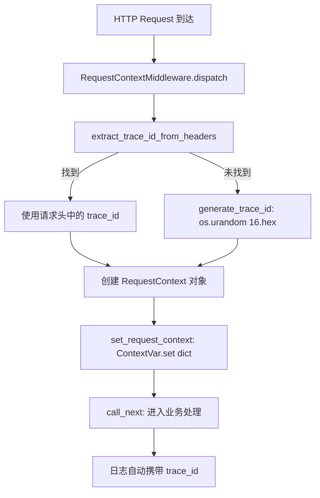
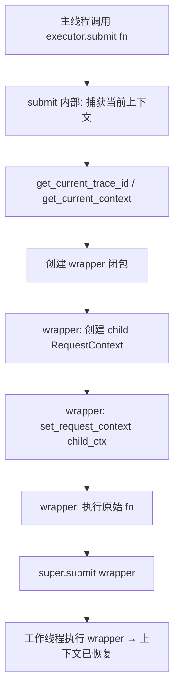

# PD-404.01 MemOS — ContextVar 请求上下文传播与跨线程分布式追踪

> 文档编号：PD-404.01
> 来源：MemOS `src/memos/context/context.py`
> GitHub：https://github.com/MemTensor/MemOS.git
> 问题域：PD-404 请求上下文传播 Request Context Propagation
> 状态：可复用方案

---

## 第 1 章 问题与动机

### 1.1 核心问题

在多线程 Agent 系统中，一个 HTTP 请求触发的处理链路往往跨越多个线程：FastAPI 请求处理线程 → ThreadPoolExecutor 工作线程 → 嵌套的子线程池。每个线程都需要访问请求级元数据（trace_id、user_name、env 等），但 Python 的 `ContextVar` 天然不会自动传播到子线程。

如果不解决这个问题：
- 日志中丢失 trace_id，无法追踪一个请求的完整链路
- 子线程中无法获取当前用户信息，导致权限判断失败或数据隔离泄漏
- 分布式追踪系统（如 Jaeger/Zipkin）无法关联同一请求的所有 span

### 1.2 MemOS 的解法概述

MemOS 构建了一套四层上下文传播体系：

1. **RequestContext 数据载体** — 封装 trace_id/api_path/env/user_type/user_name/source 六大字段 + 可扩展 `_data` 字典（`src/memos/context/context.py:25-88`）
2. **ContextVar 全局存储** — 用 `ContextVar[dict | None]` 存储序列化后的上下文字典，线程安全且请求隔离（`src/memos/context/context.py:22`）
3. **ContextThreadPoolExecutor / ContextThread** — 重写 `submit()` 和 `run()`，在任务提交时捕获主线程上下文，在工作线程执行前恢复（`src/memos/context/context.py:244-313`）
4. **ContextFilter + CustomLoggerRequestHandler** — 日志过滤器自动从 ContextVar 读取 trace_id 注入每条日志记录，远程日志 Handler 将 trace_id 附加到 HTTP 请求头（`src/memos/log.py:44-61, 64-154`）

### 1.3 设计思想

| 设计原则 | 具体实现 | 理由 | 替代方案 |
|----------|----------|------|----------|
| ContextVar 替代 threading.local | `ContextVar[dict]` 存储上下文 | ContextVar 是 Python 3.7+ 官方推荐，与 asyncio 兼容 | threading.local（不支持 async） |
| 序列化存储而非对象引用 | `set_request_context` 存 `context.to_dict()` | 避免跨线程共享可变对象导致竞态 | 直接存 RequestContext 对象 |
| 装饰器包装透明传播 | `functools.wraps(fn)` 包装 submit 的 callable | 调用方无需感知上下文传播，零侵入 | 手动在每个线程函数中 set_context |
| 多头部优先级提取 | `g-trace-id > x-trace-id > trace-id` 三级 fallback | 兼容不同网关/客户端的 header 命名习惯 | 只支持单一 header |
| Flask g 对象兼容层 | `dependencies.py` 提供 `get_g_object()` | 降低从 Flask 迁移到 FastAPI 的成本 | 直接使用 ContextVar API |

---

## 第 2 章 源码实现分析

### 2.1 架构概览

```
┌─────────────────────────────────────────────────────────────────┐
│                        HTTP Request                              │
│  Headers: g-trace-id / x-trace-id / x-env / x-user-name        │
└──────────────────────────┬──────────────────────────────────────┘
                           │
                           ▼
┌──────────────────────────────────────────────────────────────────┐
│  RequestContextMiddleware (Starlette BaseHTTPMiddleware)          │
│  ① extract_trace_id_from_headers() or generate_trace_id()       │
│  ② RequestContext(trace_id, api_path, env, user_type, ...)      │
│  ③ set_request_context(context) → ContextVar.set(dict)          │
└──────────────────────────┬──────────────────────────────────────┘
                           │
              ┌────────────┼────────────┐
              ▼            ▼            ▼
┌──────────────┐ ┌──────────────┐ ┌──────────────────────┐
│  API Handler │ │ ContextFilter│ │ CustomLoggerHandler   │
│  get_g()     │ │ trace_id →   │ │ trace_id → HTTP POST │
│  require_g() │ │ log record   │ │ to remote logger     │
└──────┬───────┘ └──────────────┘ └──────────────────────┘
       │
       ▼
┌──────────────────────────────────────────────────────────────────┐
│  ContextThreadPoolExecutor.submit(fn, *args)                     │
│  ① 捕获: main_trace_id = get_current_trace_id()                 │
│  ② 包装: wrapper() { set_request_context(child_ctx); fn() }     │
│  ③ 提交: super().submit(wrapper, *args)                         │
└──────────────────────────┬──────────────────────────────────────┘
                           │
              ┌────────────┼────────────┐
              ▼            ▼            ▼
        Worker Thread 1  Thread 2   Thread N
        (context restored from main thread)
```

### 2.2 核心实现

#### 2.2.1 RequestContext 与 ContextVar 存储



对应源码 `src/memos/context/context.py:22-100`：

```python
# 全局 ContextVar — 存储序列化后的字典而非对象引用
_request_context: ContextVar[dict[str, Any] | None] = ContextVar(
    "request_context", default=None
)

class RequestContext:
    def __init__(
        self,
        trace_id: str | None = None,
        api_path: str | None = None,
        env: str | None = None,
        user_type: str | None = None,
        user_name: str | None = None,
        source: str | None = None,
    ):
        self.trace_id = trace_id or "trace-id"
        self.api_path = api_path
        self.env = env
        self.user_type = user_type
        self.user_name = user_name
        self.source = source
        self._data: dict[str, Any] = {}

    def to_dict(self) -> dict[str, Any]:
        return {
            "trace_id": self.trace_id,
            "api_path": self.api_path,
            "env": self.env,
            "user_type": self.user_type,
            "user_name": self.user_name,
            "source": self.source,
            "data": self._data.copy(),
        }

def set_request_context(context: RequestContext | None) -> None:
    if context:
        _request_context.set(context.to_dict())
    else:
        _request_context.set(None)
```

关键设计：`set_request_context` 存储的是 `to_dict()` 的副本而非对象本身，确保跨线程传播时不会出现共享可变状态。

#### 2.2.2 ContextThreadPoolExecutor 跨线程传播



对应源码 `src/memos/context/context.py:244-277`：

```python
class ContextThreadPoolExecutor(ThreadPoolExecutor):
    def submit(self, fn: Callable[..., T], *args: Any, **kwargs: Any) -> Any:
        # ① 在主线程中捕获当前上下文的所有字段
        main_trace_id = get_current_trace_id()
        main_api_path = get_current_api_path()
        main_env = get_current_env()
        main_user_type = get_current_user_type()
        main_user_name = get_current_user_name()
        main_context = get_current_context()

        @functools.wraps(fn)
        def wrapper(*args: Any, **kwargs: Any) -> Any:
            if main_context:
                # ② 在工作线程中重建上下文
                child_context = RequestContext(
                    trace_id=main_trace_id,
                    api_path=main_api_path,
                    env=main_env,
                    user_type=main_user_type,
                    user_name=main_user_name,
                )
                child_context._data = main_context._data.copy()
                set_request_context(child_context)
            return fn(*args, **kwargs)

        # ③ 提交包装后的函数
        return super().submit(wrapper, *args, **kwargs)
```

同样的模式也应用于 `map()` 方法（`src/memos/context/context.py:279-313`），确保批量任务也能传播上下文。

### 2.3 实现细节

#### ContextFilter 日志注入

`src/memos/log.py:44-61` 的 `ContextFilter` 在每条日志记录上附加 trace_id 等字段：

```python
class ContextFilter(logging.Filter):
    def filter(self, record):
        try:
            trace_id = get_current_trace_id()
            record.trace_id = trace_id if trace_id else "trace-id"
            record.env = get_current_env()
            record.user_type = get_current_user_type()
            record.user_name = get_current_user_name()
            record.api_path = get_current_api_path()
        except Exception:
            record.api_path = "unknown"
            record.trace_id = "trace-id"
            record.env = "prod"
            record.user_type = "normal"
            record.user_name = "unknown"
        return True
```

日志格式中直接使用这些字段（`src/memos/log.py:177`）：
```
%(asctime)s | %(trace_id)s | path=%(api_path)s | env=%(env)s | user_type=%(user_type)s | user_name=%(user_name)s | ...
```

#### 调度器中的上下文重建

`SchedulerDispatcher` 在处理异步任务时，从消息中提取 trace_id 并重建上下文（`src/memos/mem_scheduler/task_schedule_modules/dispatcher.py:139-146`）：

```python
trace_id = getattr(first_msg, "trace_id", None) or generate_trace_id()
ctx = RequestContext(
    trace_id=trace_id,
    user_name=getattr(first_msg, "user_name", None),
    user_type=None,
)
set_request_context(ctx)
```

这确保了即使任务从消息队列中消费（已脱离原始 HTTP 请求），也能恢复追踪链路。

#### 实际消费场景：MemFeedback 中的嵌套线程池

`src/memos/mem_feedback/feedback.py` 大量使用 `ContextThreadPoolExecutor`，形成嵌套并行：

- L458: `semantics_feedback` 用 `ContextThreadPoolExecutor(max_workers=10)` 并行处理 memory chunks 的 LLM 比较
- L504: 同一方法内第二个线程池并行执行 add/update 操作
- L576: `_feedback_memory` 用 `ContextThreadPoolExecutor(max_workers=3)` 并行处理多条 feedback
- L758: `filter_fault_update` 用线程池并行执行 LLM 判断
- L1003: `process_keyword_replace` 用线程池并行更新记忆
- L1177: `process_feedback` 顶层用线程池并行执行 answer 生成和 core 处理

所有这些嵌套线程池都自动继承了请求的 trace_id，无需任何手动传递。

#### Flask g 对象兼容层

`src/memos/api/context/dependencies.py:1-51` 提供了 Flask 风格的 `get_g_object()` / `require_g()` 接口，底层直接委托给 `get_current_context()`，降低迁移成本。


---

## 第 3 章 迁移指南

### 3.1 迁移清单

**阶段 1：核心上下文层（必须）**
- [ ] 创建 `context.py`：定义 `RequestContext` 数据类 + `ContextVar` 全局变量
- [ ] 实现 `set_request_context()` / `get_current_*()` 系列访问函数
- [ ] 实现 `ContextThreadPoolExecutor`，重写 `submit()` 和 `map()`

**阶段 2：中间件集成（Web 应用必须）**
- [ ] 创建 `RequestContextMiddleware`（Starlette/FastAPI）
- [ ] 配置 trace_id 提取优先级（从请求头）
- [ ] 添加 `generate_trace_id()` 作为 fallback

**阶段 3：日志集成（推荐）**
- [ ] 创建 `ContextFilter`，将 trace_id 注入日志记录
- [ ] 更新日志格式字符串，包含 `%(trace_id)s`
- [ ] 可选：实现远程日志 Handler，将 trace_id 附加到 HTTP 头

**阶段 4：任务队列集成（异步系统需要）**
- [ ] 在消息入队时序列化 trace_id 到消息体
- [ ] 在消息消费时从消息体恢复 `RequestContext`
- [ ] 确保 `ContextThreadPoolExecutor` 用于所有任务调度

### 3.2 适配代码模板

以下是一个可直接运行的最小实现：

```python
"""request_context.py — 最小可复用的请求上下文传播模块"""
import functools
import os
from collections.abc import Callable
from concurrent.futures import ThreadPoolExecutor
from contextvars import ContextVar
from typing import Any, TypeVar

T = TypeVar("T")

# ---- 1. 上下文数据结构 ----
class RequestContext:
    __slots__ = ("trace_id", "user_id", "extra")

    def __init__(self, trace_id: str = "", user_id: str = "", **extra: Any):
        self.trace_id = trace_id or os.urandom(8).hex()
        self.user_id = user_id
        self.extra = extra

    def to_dict(self) -> dict[str, Any]:
        return {"trace_id": self.trace_id, "user_id": self.user_id, **self.extra}

    @classmethod
    def from_dict(cls, d: dict[str, Any]) -> "RequestContext":
        return cls(
            trace_id=d.get("trace_id", ""),
            user_id=d.get("user_id", ""),
            **{k: v for k, v in d.items() if k not in ("trace_id", "user_id")},
        )

# ---- 2. ContextVar 存储 ----
_ctx_var: ContextVar[dict[str, Any] | None] = ContextVar("req_ctx", default=None)

def set_context(ctx: RequestContext | None) -> None:
    _ctx_var.set(ctx.to_dict() if ctx else None)

def get_context() -> RequestContext | None:
    d = _ctx_var.get()
    return RequestContext.from_dict(d) if d else None

def get_trace_id() -> str:
    d = _ctx_var.get()
    return d["trace_id"] if d else "no-trace"

# ---- 3. 线程池传播 ----
class PropagatingExecutor(ThreadPoolExecutor):
    def submit(self, fn: Callable[..., T], *args: Any, **kwargs: Any) -> Any:
        ctx_snapshot = _ctx_var.get()

        @functools.wraps(fn)
        def wrapper(*a: Any, **kw: Any) -> Any:
            if ctx_snapshot:
                _ctx_var.set(ctx_snapshot.copy())
            return fn(*a, **kw)

        return super().submit(wrapper, *args, **kwargs)

# ---- 4. 日志 Filter ----
import logging

class TraceFilter(logging.Filter):
    def filter(self, record: logging.LogRecord) -> bool:
        record.trace_id = get_trace_id()  # type: ignore[attr-defined]
        return True

# ---- 5. FastAPI 中间件 ----
# from starlette.middleware.base import BaseHTTPMiddleware
# class TraceMiddleware(BaseHTTPMiddleware):
#     async def dispatch(self, request, call_next):
#         trace_id = request.headers.get("x-trace-id") or os.urandom(8).hex()
#         set_context(RequestContext(trace_id=trace_id, user_id=request.headers.get("x-user-id", "")))
#         response = await call_next(request)
#         response.headers["x-trace-id"] = trace_id
#         return response
```

### 3.3 适用场景

| 场景 | 适用度 | 说明 |
|------|--------|------|
| FastAPI + ThreadPoolExecutor 多线程服务 | ⭐⭐⭐ | 完美匹配，MemOS 的核心场景 |
| 纯 asyncio 服务（无线程池） | ⭐⭐ | ContextVar 原生支持 asyncio，但不需要 ContextThreadPoolExecutor |
| Django + Celery 异步任务 | ⭐⭐ | 需要额外在 Celery task 序列化/反序列化时传播 context |
| 多进程架构（multiprocessing） | ⭐ | ContextVar 不跨进程，需要通过 IPC 传递 |
| gRPC 服务 | ⭐⭐⭐ | 从 metadata 提取 trace_id，模式完全一致 |

---

## 第 4 章 测试用例

基于 MemOS 真实测试文件 `tests/api/test_thread_context.py` 的模式：

```python
"""test_context_propagation.py — 请求上下文传播测试套件"""
import threading
import time
from concurrent.futures import as_completed

import pytest

# 假设使用上面 3.2 的适配代码
from request_context import (
    PropagatingExecutor,
    RequestContext,
    get_context,
    get_trace_id,
    set_context,
)


class TestContextVarBasics:
    """ContextVar 基础行为"""

    def test_set_and_get(self):
        ctx = RequestContext(trace_id="abc-123", user_id="user-1")
        set_context(ctx)
        assert get_trace_id() == "abc-123"
        retrieved = get_context()
        assert retrieved.user_id == "user-1"

    def test_default_when_unset(self):
        set_context(None)
        assert get_trace_id() == "no-trace"
        assert get_context() is None

    def test_auto_generate_trace_id(self):
        ctx = RequestContext(user_id="u1")
        assert len(ctx.trace_id) == 16  # os.urandom(8).hex()


class TestThreadPoolPropagation:
    """ContextThreadPoolExecutor 跨线程传播"""

    def test_submit_propagates_context(self):
        set_context(RequestContext(trace_id="pool-trace", user_id="pool-user"))

        def worker():
            return get_trace_id()

        with PropagatingExecutor(max_workers=2) as ex:
            future = ex.submit(worker)
            assert future.result() == "pool-trace"

    def test_multiple_workers_isolated(self):
        """验证不同请求的上下文在线程池中互不干扰"""
        results = {}

        def simulate_request(req_id: str):
            set_context(RequestContext(trace_id=f"trace-{req_id}"))
            with PropagatingExecutor(max_workers=2) as ex:
                future = ex.submit(get_trace_id)
                results[req_id] = future.result()

        t1 = threading.Thread(target=simulate_request, args=("A",))
        t2 = threading.Thread(target=simulate_request, args=("B",))
        t1.start(); t2.start()
        t1.join(); t2.join()

        assert results["A"] == "trace-A"
        assert results["B"] == "trace-B"

    def test_nested_thread_pools(self):
        """验证嵌套线程池的上下文传播（MemOS feedback 的真实场景）"""
        set_context(RequestContext(trace_id="nested-trace"))

        def outer_task():
            with PropagatingExecutor(max_workers=2) as inner_ex:
                future = inner_ex.submit(get_trace_id)
                return future.result()

        with PropagatingExecutor(max_workers=2) as outer_ex:
            future = outer_ex.submit(outer_task)
            assert future.result() == "nested-trace"

    def test_context_survives_exception(self):
        """验证异常不会破坏上下文"""
        set_context(RequestContext(trace_id="error-trace"))

        def failing_task():
            tid = get_trace_id()
            raise ValueError("boom")

        with PropagatingExecutor(max_workers=1) as ex:
            future = ex.submit(failing_task)
            with pytest.raises(ValueError):
                future.result()

        # 主线程上下文不受影响
        assert get_trace_id() == "error-trace"


class TestContextFilter:
    """日志 trace_id 注入"""

    def test_filter_injects_trace_id(self):
        import logging
        from request_context import TraceFilter

        set_context(RequestContext(trace_id="log-trace"))
        record = logging.LogRecord("test", logging.INFO, "", 0, "msg", (), None)
        f = TraceFilter()
        f.filter(record)
        assert record.trace_id == "log-trace"  # type: ignore
```


---

## 第 5 章 跨域关联

| 关联域 | 关系类型 | 说明 |
|--------|----------|------|
| PD-11 可观测性 | 强依赖 | trace_id 是可观测性的基础设施；MemOS 的 `CustomLoggerRequestHandler` 将 trace_id 发送到远程日志服务，`ContextFilter` 确保所有日志都携带追踪信息 |
| PD-02 多 Agent 编排 | 协同 | `ContextThreadPoolExecutor` 被 `SchedulerDispatcher` 用作任务调度线程池，确保编排过程中的上下文连续性 |
| PD-06 记忆持久化 | 协同 | `MemFeedback` 的记忆读写操作通过 `ContextThreadPoolExecutor` 并行执行，trace_id 贯穿整个记忆更新链路 |
| PD-03 容错与重试 | 协同 | 上下文传播确保重试操作中的日志仍然关联到原始请求，便于排查重试链路 |
| PD-10 中间件管道 | 依赖 | `RequestContextMiddleware` 是中间件管道的第一环，为后续所有中间件和处理器提供上下文 |

---

## 第 6 章 来源文件索引

| 文件 | 行范围 | 关键实现 |
|------|--------|----------|
| `src/memos/context/context.py` | L1-L356 | 核心模块：RequestContext、ContextVar、ContextThread、ContextThreadPoolExecutor、generate_trace_id |
| `src/memos/log.py` | L44-L61 | ContextFilter：日志 trace_id 自动注入 |
| `src/memos/log.py` | L64-L154 | CustomLoggerRequestHandler：远程日志发送，携带 trace_id |
| `src/memos/log.py` | L172-L224 | LOGGING_CONFIG：日志配置，注册 context_filter |
| `src/memos/api/middleware/request_context.py` | L1-L102 | RequestContextMiddleware：HTTP 请求入口上下文初始化 |
| `src/memos/api/context/dependencies.py` | L1-L51 | Flask g 对象兼容层：get_g_object / require_g |
| `src/memos/mem_scheduler/task_schedule_modules/dispatcher.py` | L139-L146 | SchedulerDispatcher：异步任务上下文重建 |
| `src/memos/mem_feedback/feedback.py` | L458, L504, L576, L758, L1003, L1177 | 6 处 ContextThreadPoolExecutor 嵌套使用 |
| `tests/api/test_thread_context.py` | L1-L180 | 完整测试套件：传播、隔离、map、异常场景 |

---

## 第 7 章 横向对比维度

> **重要：** 本章用于自动填充 Butcher Wiki 的横向对比表。

```json comparison_data
{
  "project": "MemOS",
  "dimensions": {
    "存储机制": "ContextVar[dict] 序列化存储，避免跨线程共享可变对象",
    "传播方式": "ContextThreadPoolExecutor 重写 submit/map，functools.wraps 透明包装",
    "上下文字段": "trace_id + api_path + env + user_type + user_name + source + 可扩展 _data",
    "日志集成": "ContextFilter 自动注入 + CustomLoggerRequestHandler 远程推送",
    "中间件入口": "Starlette BaseHTTPMiddleware，三级 header 优先级提取 trace_id",
    "异步任务恢复": "SchedulerDispatcher 从消息体提取 trace_id 重建 RequestContext"
  }
}
```

### 域元数据补充

```json domain_metadata
{
  "solution_summary": "MemOS 用 ContextVar[dict] + ContextThreadPoolExecutor 重写 submit/map 实现请求上下文跨线程透明传播，配合 ContextFilter 和 CustomLoggerRequestHandler 完成端到端分布式追踪",
  "description": "请求级元数据在多线程和异步任务队列间的自动传播与恢复",
  "sub_problems": [
    "异步任务队列消费时的上下文重建",
    "Flask g 对象到 FastAPI ContextVar 的迁移兼容"
  ],
  "best_practices": [
    "ContextVar 存储序列化 dict 而非对象引用避免竞态",
    "消息队列消费端从消息体恢复 trace_id 重建 RequestContext"
  ]
}
```

