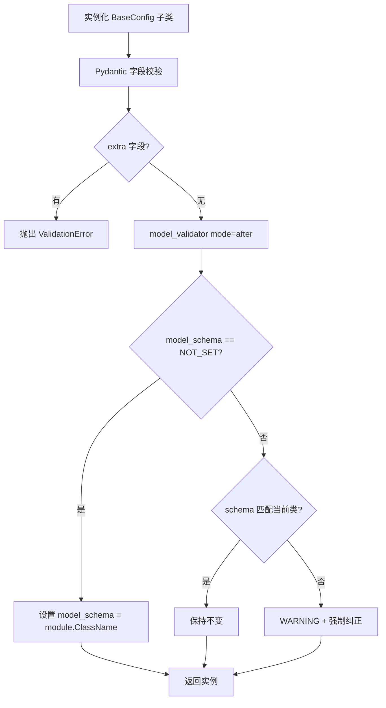
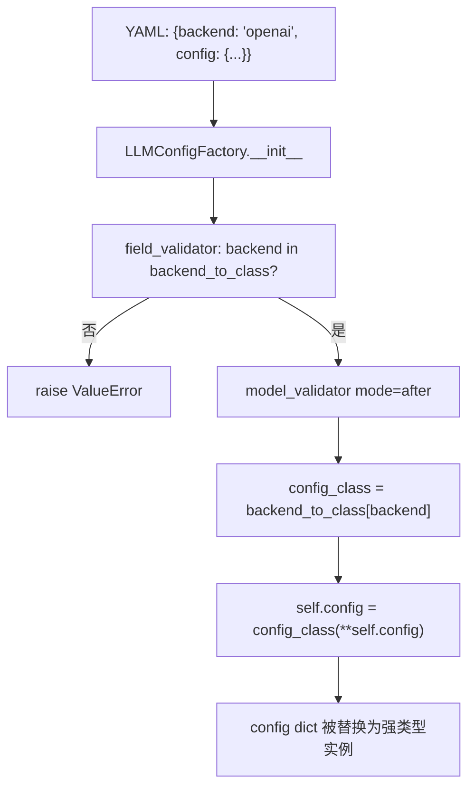
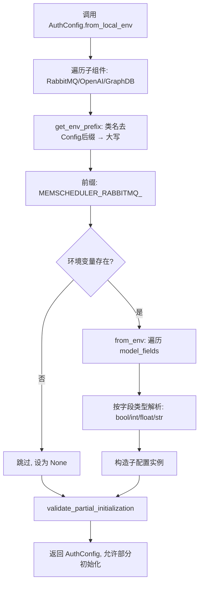

# PD-405.NN MemOS — Pydantic 工厂配置与 model_schema 自标注体系

> 文档编号：PD-405.NN
> 来源：MemOS `src/memos/configs/`
> GitHub：https://github.com/MemTensor/MemOS.git
> 问题域：PD-405 配置管理 Configuration Management
> 状态：可复用方案

---

## 第 1 章 问题与动机

### 1.1 核心问题

MemOS 是一个多记忆类型（文本记忆、KV Cache 记忆、LoRA 参数记忆、偏好记忆）的 AI 记忆操作系统，每种记忆类型需要不同的后端（OpenAI / Ollama / HuggingFace / vLLM / Azure / DeepSeek / Qwen 等 LLM，Qdrant / Milvus 向量库，Neo4j / NebulaGraph / PolarDB / PostgreSQL 图数据库）。配置管理面临三个核心挑战：

1. **后端爆炸**：7 种 Factory（LLM、Embedder、VectorDB、GraphDB、Memory、Scheduler、MemOS），每种 Factory 下 2-10 个后端实现，配置字段各不相同。用户一旦拼错 backend 名或传入错误字段，运行时才会崩溃。
2. **配置错配**：JSON/YAML 配置文件在项目间复制时，可能把 A 类配置加载到 B 类对象上。需要一种机制在加载时自动检测配置与类的匹配关系。
3. **多环境切换**：开发环境用本地 Ollama，生产环境用 OpenAI API，需要环境变量覆盖文件配置，且不同组件（RabbitMQ、OpenAI、GraphDB）的环境变量前缀不能冲突。

### 1.2 MemOS 的解法概述

1. **BaseConfig 统一基类**：所有配置继承 `BaseConfig`（`src/memos/configs/base.py:15`），强制 `ConfigDict(extra="forbid", strict=True)` 拒绝未知字段和隐式类型转换
2. **model_schema 自标注**：每个配置实例在 `model_validator(mode="after")` 中自动设置 `model_schema = module.ClassName`（`base.py:30-41`），加载时若 schema 不匹配则告警并纠正
3. **ConfigFactory 工厂模式**：`backend` + `config` 二元结构，`backend_to_class` ClassVar 映射表 + `model_validator` 自动实例化（`llm.py:122-152`）
4. **EnvConfigMixin 环境变量覆盖**：类名自动推导前缀（`MEMSCHEDULER_RABBITMQ_`），`from_env()` 按字段遍历环境变量（`misc.py:21-89`）
5. **field_validator 跨层校验**：MemCube 层校验 Memory 的 backend 是否属于允许列表（`mem_cube.py:63-105`），防止配置组合错误

### 1.3 设计思想

| 设计原则 | 具体实现 | 理由 | 替代方案 |
|----------|----------|------|----------|
| 编译期拦截 | `extra="forbid"` + `strict=True` | 拼写错误在实例化时立即报错，不留到运行时 | `extra="allow"` 宽松模式（易遗漏错误） |
| 自描述配置 | `model_schema` 自动写入 `module.ClassName` | JSON 文件自带类型标签，跨项目复制时可检测错配 | 手动维护 `type` 字段（易忘记更新） |
| 工厂统一入口 | `backend` + `config` dict → Factory 自动分发 | YAML 中只需改 `backend` 字段即可切换后端 | if-else 链（不可扩展） |
| 环境变量约定 | 类名去 Config 后缀 → 大写 → 加前缀 | 零配置推导，无需手动映射 | `.env` 文件硬编码（不灵活） |
| 层级校验 | MemCube 的 `field_validator` 限制子配置 backend | 防止把 LoRA 配置塞到 text_mem 槽位 | 运行时 isinstance 检查（延迟发现） |

---

## 第 2 章 源码实现分析

### 2.1 架构概览

MemOS 的配置体系是一棵严格类型化的树，从顶层 `MemOSConfigFactory` 到叶子节点的具体后端配置，每一层都通过 Pydantic 校验：

```
MemOSConfigFactory
  └─ MOSConfig
       ├─ chat_model: LLMConfigFactory ──→ OpenAILLMConfig / OllamaLLMConfig / ...
       ├─ mem_reader: MemReaderConfigFactory
       ├─ mem_scheduler: SchedulerConfigFactory ──→ GeneralSchedulerConfig
       └─ user_manager: UserManagerConfigFactory

GeneralMemCubeConfig
  ├─ text_mem: MemoryConfigFactory ──→ TreeTextMemoryConfig
  │     ├─ extractor_llm: LLMConfigFactory ──→ ...
  │     ├─ embedder: EmbedderConfigFactory ──→ ...
  │     ├─ graph_db: GraphDBConfigFactory ──→ Neo4jGraphDBConfig / ...
  │     └─ reranker: RerankerConfigFactory
  ├─ act_mem: MemoryConfigFactory ──→ KVCacheMemoryConfig
  ├─ para_mem: MemoryConfigFactory ──→ LoRAMemoryConfig
  └─ pref_mem: MemoryConfigFactory ──→ PreferenceTextMemoryConfig

AuthConfig (环境变量覆盖层)
  ├─ rabbitmq: RabbitMQConfig  ← MEMSCHEDULER_RABBITMQ_*
  ├─ openai: OpenAIConfig      ← MEMSCHEDULER_OPENAI_*
  └─ graph_db: GraphDBAuthConfig ← MEMSCHEDULER_GRAPHDBAUTH_*
```

### 2.2 核心实现

#### 2.2.1 BaseConfig — 严格校验 + model_schema 自标注



对应源码 `src/memos/configs/base.py:15-83`：

```python
class BaseConfig(BaseModel):
    """Base configuration. All configurations should inherit from this class."""

    model_schema: str = Field(
        "NOT_SET",
        description="Schema for configuration. This value will be automatically set.",
        exclude=True,
    )

    model_config = ConfigDict(extra="forbid", strict=True)

    @model_validator(mode="after")
    def set_default_schema(self) -> "BaseConfig":
        dot_path_schema = self.__module__ + "." + self.__class__.__name__
        if self.model_schema == dot_path_schema:
            return self
        if self.model_schema != "NOT_SET":
            logger.warning(
                f"Schema is set to {self.model_schema}, but it should be {dot_path_schema}. "
                "Changing schema to the default value."
            )
        self.model_schema = dot_path_schema
        return self
```

关键设计点：
- `exclude=True` 使 `model_schema` 不出现在 `model_dump()` 的默认输出中，但 JSON 序列化时可选包含
- `model_validator(mode="after")` 在所有字段校验完成后执行，确保实例已完整构建
- 使用 `__module__ + "." + __class__.__name__` 作为全限定路径，避免同名类冲突

#### 2.2.2 ConfigFactory 工厂模式 — backend 路由 + 自动实例化



对应源码 `src/memos/configs/llm.py:122-152`：

```python
class LLMConfigFactory(BaseConfig):
    """Factory class for creating LLM configurations."""

    backend: str = Field(..., description="Backend for LLM")
    config: dict[str, Any] = Field(..., description="Configuration for the LLM backend")

    backend_to_class: ClassVar[dict[str, Any]] = {
        "openai": OpenAILLMConfig,
        "ollama": OllamaLLMConfig,
        "azure": AzureLLMConfig,
        "huggingface": HFLLMConfig,
        "vllm": VLLMLLMConfig,
        "huggingface_singleton": HFLLMConfig,
        "qwen": QwenLLMConfig,
        "deepseek": DeepSeekLLMConfig,
        "openai_new": OpenAIResponsesLLMConfig,
    }

    @field_validator("backend")
    @classmethod
    def validate_backend(cls, backend: str) -> str:
        if backend not in cls.backend_to_class:
            raise ValueError(f"Invalid backend: {backend}")
        return backend

    @model_validator(mode="after")
    def create_config(self) -> "LLMConfigFactory":
        config_class = self.backend_to_class[self.backend]
        self.config = config_class(**self.config)
        return self
```

这个模式在 MemOS 中被复制了 7 次：`LLMConfigFactory`、`EmbedderConfigFactory`、`VectorDBConfigFactory`、`GraphDBConfigFactory`、`MemoryConfigFactory`、`SchedulerConfigFactory`、`MemOSConfigFactory`。每个 Factory 的结构完全一致：`backend` 字段 + `backend_to_class` ClassVar + `field_validator` + `model_validator`。

#### 2.2.3 EnvConfigMixin — 类名推导环境变量前缀



对应源码 `src/memos/mem_scheduler/general_modules/misc.py:21-89`：

```python
class EnvConfigMixin(Generic[T]):
    """Abstract base class for environment variable configuration."""

    ENV_PREFIX = "MEMSCHEDULER_"

    @classmethod
    def get_env_prefix(cls) -> str:
        class_name = cls.__name__
        if class_name.endswith("Config"):
            class_name = class_name[:-6]
        return f"{cls.ENV_PREFIX}{class_name.upper()}_"

    @classmethod
    def from_env(cls: type[T]) -> T:
        load_dotenv()
        prefix = cls.get_env_prefix()
        field_values = {}
        for field_name, field_info in cls.model_fields.items():
            env_var = f"{prefix}{field_name.upper()}"
            field_type = field_info.annotation
            if field_info.is_required() and env_var not in os.environ:
                raise ValueError(f"Required environment variable {env_var} is missing")
            if env_var in os.environ:
                raw_value = os.environ[env_var]
                field_values[field_name] = cls._parse_env_value(raw_value, field_type)
            elif field_info.default is not None:
                field_values[field_name] = field_info.default
            else:
                raise ValueError()
        return cls(**field_values)
```

### 2.3 实现细节

**跨层校验 — MemCube 限制子配置 backend**

`GeneralMemCubeConfig`（`src/memos/configs/mem_cube.py:31-105`）对每个记忆槽位使用 `field_validator` 限制允许的 backend：

```python
# mem_cube.py:63-72
@field_validator("text_mem")
@classmethod
def validate_text_mem(cls, text_mem: MemoryConfigFactory) -> MemoryConfigFactory:
    allowed_backends = ["naive_text", "general_text", "tree_text", "uninitialized"]
    if text_mem.backend not in allowed_backends:
        raise ConfigurationError(
            f"GeneralMemCubeConfig requires text_mem backend to be one of {allowed_backends}, "
            f"got '{text_mem.backend}'"
        )
    return text_mem
```

同样的模式应用于 `act_mem`（只允许 kv_cache/vllm_kv_cache）、`para_mem`（只允许 lora）、`pref_mem`（只允许 pref_text）。这实现了**组合约束**：不是每个配置单独合法就行，还要求配置之间的组合关系合法。

**AuthConfig 部分初始化容忍**

`AuthConfig`（`mem_scheduler.py:213-258`）的 `validate_partial_initialization` 允许部分组件为 None，只记录 warning 而不抛异常。这是因为生产环境中不一定所有服务都部署（可能只用 OpenAI 不用 RabbitMQ），配置系统需要容忍缺失。

**双路径加载 — from_local_config 自动检测格式**

`AuthConfig.from_local_config()`（`mem_scheduler.py:259-299`）根据文件扩展名自动选择 `from_yaml_file` 或 `from_json_file`，统一了加载入口。


---

## 第 3 章 迁移指南

### 3.1 迁移清单

**阶段 1：基础设施（BaseConfig + 文件加载）**

- [ ] 创建 `configs/base.py`，定义 `BaseConfig(BaseModel)` 基类
- [ ] 添加 `model_config = ConfigDict(extra="forbid", strict=True)`
- [ ] 实现 `model_schema` 自标注 `model_validator`
- [ ] 实现 `from_json_file` / `to_json_file` / `from_yaml_file` / `to_yaml_file`
- [ ] 安装依赖：`pydantic>=2.0` + `pyyaml`

**阶段 2：工厂模式（ConfigFactory）**

- [ ] 为每个需要多后端切换的组件创建 Factory 类
- [ ] 定义 `backend_to_class: ClassVar[dict]` 映射表
- [ ] 添加 `field_validator("backend")` 校验 backend 合法性
- [ ] 添加 `model_validator(mode="after")` 自动实例化 config

**阶段 3：环境变量覆盖**

- [ ] 创建 `EnvConfigMixin`，实现 `get_env_prefix()` 和 `from_env()`
- [ ] 为需要环境变量覆盖的配置类混入 `EnvConfigMixin`
- [ ] 实现 `AuthConfig` 聚合类，支持部分初始化

**阶段 4：跨层校验**

- [ ] 在上层配置中添加 `field_validator` 限制子配置的 backend 组合

### 3.2 适配代码模板

以下是一个可直接复用的最小化 ConfigFactory 模板：

```python
"""configs/base.py — 可直接复用的配置基类"""
import os
from typing import Any, ClassVar, Generic, TypeVar

import yaml
from pydantic import BaseModel, ConfigDict, Field, field_validator, model_validator

T = TypeVar("T")


class BaseConfig(BaseModel):
    """所有配置的基类，强制严格校验 + schema 自标注。"""

    model_schema: str = Field(
        "NOT_SET",
        description="自动设置的配置 schema 标识",
        exclude=True,
    )
    model_config = ConfigDict(extra="forbid", strict=True)

    @model_validator(mode="after")
    def _set_schema(self) -> "BaseConfig":
        expected = f"{self.__module__}.{self.__class__.__name__}"
        if self.model_schema != expected:
            self.model_schema = expected
        return self

    @classmethod
    def from_json_file(cls, path: str) -> "BaseConfig":
        with open(path, encoding="utf-8") as f:
            return cls.model_validate_json(f.read())

    @classmethod
    def from_yaml_file(cls, path: str) -> "BaseConfig":
        with open(path, encoding="utf-8") as f:
            return cls.model_validate(yaml.safe_load(f))

    def to_json_file(self, path: str) -> None:
        os.makedirs(os.path.dirname(path) or ".", exist_ok=True)
        with open(path, "w", encoding="utf-8") as f:
            f.write(self.model_dump_json(indent=2))

    def to_yaml_file(self, path: str) -> None:
        os.makedirs(os.path.dirname(path) or ".", exist_ok=True)
        with open(path, "w", encoding="utf-8") as f:
            yaml.safe_dump(self.model_dump(mode="json"), f, default_flow_style=False)


class ConfigFactory(BaseConfig):
    """通用工厂基类 — 子类只需定义 backend_to_class。"""

    backend: str = Field(..., description="后端标识")
    config: dict[str, Any] = Field(..., description="后端配置")
    backend_to_class: ClassVar[dict[str, type]] = {}

    @field_validator("backend")
    @classmethod
    def _validate_backend(cls, v: str) -> str:
        if v not in cls.backend_to_class:
            raise ValueError(f"Invalid backend: {v}. Choose from: {list(cls.backend_to_class)}")
        return v

    @model_validator(mode="after")
    def _instantiate(self) -> "ConfigFactory":
        self.config = self.backend_to_class[self.backend](**self.config)
        return self


class EnvConfigMixin(Generic[T]):
    """环境变量加载 Mixin — 类名自动推导前缀。"""

    ENV_PREFIX: ClassVar[str] = "APP_"

    @classmethod
    def get_env_prefix(cls) -> str:
        name = cls.__name__.removesuffix("Config").upper()
        return f"{cls.ENV_PREFIX}{name}_"

    @classmethod
    def from_env(cls: type[T]) -> T:
        prefix = cls.get_env_prefix()
        values = {}
        for field_name, info in cls.model_fields.items():
            env_key = f"{prefix}{field_name.upper()}"
            if env_key in os.environ:
                raw = os.environ[env_key]
                ft = info.annotation
                if ft is bool:
                    values[field_name] = raw.lower() in ("true", "1", "yes")
                elif ft is int:
                    values[field_name] = int(raw)
                elif ft is float:
                    values[field_name] = float(raw)
                else:
                    values[field_name] = raw
            elif info.is_required():
                raise ValueError(f"Required env var {env_key} is missing")
        return cls(**values)
```

**使用示例 — 定义一个 LLM 工厂：**

```python
class OpenAIConfig(BaseConfig):
    api_key: str = Field(..., description="OpenAI API key")
    model: str = Field(default="gpt-4o", description="Model name")
    temperature: float = Field(default=0.7)

class OllamaConfig(BaseConfig):
    base_url: str = Field(default="http://localhost:11434")
    model: str = Field(..., description="Model name")

class LLMFactory(ConfigFactory):
    backend_to_class: ClassVar[dict[str, type]] = {
        "openai": OpenAIConfig,
        "ollama": OllamaConfig,
    }

# YAML 配置:
# backend: openai
# config:
#   api_key: sk-xxx
#   model: gpt-4o
llm = LLMFactory.from_yaml_file("llm_config.yaml")
print(llm.config.model)  # "gpt-4o" — 强类型访问
```

### 3.3 适用场景

| 场景 | 适用度 | 说明 |
|------|--------|------|
| 多 LLM 后端切换 | ⭐⭐⭐ | 核心场景，YAML 改 backend 即可切换 |
| 多数据库后端 | ⭐⭐⭐ | VectorDB / GraphDB 等同理 |
| 微服务配置管理 | ⭐⭐ | 适合中等规模，超大规模建议用 etcd/consul |
| CLI 工具配置 | ⭐⭐⭐ | BaseConfig 的文件加载 + 环境变量覆盖非常适合 |
| 配置热更新 | ⭐ | 当前方案不支持热更新，需额外实现 watch 机制 |

---

## 第 4 章 测试用例

```python
"""test_config_system.py — 基于 MemOS 真实函数签名的测试"""
import json
import os
import tempfile

import pytest
import yaml
from pydantic import ValidationError


# ─── 测试 BaseConfig ───────────────────────────────────────────────

class TestBaseConfig:
    def test_extra_fields_rejected(self, base_config_cls):
        """extra='forbid' 应拒绝未知字段"""
        with pytest.raises(ValidationError, match="extra"):
            base_config_cls(unknown_field="value")

    def test_model_schema_auto_set(self, base_config_cls):
        """model_schema 应自动设置为 module.ClassName"""
        cfg = base_config_cls()
        assert cfg.model_schema.endswith(base_config_cls.__name__)

    def test_model_schema_mismatch_corrected(self, base_config_cls):
        """错误的 model_schema 应被纠正"""
        cfg = base_config_cls(model_schema="wrong.Schema")
        assert cfg.model_schema != "wrong.Schema"

    def test_json_roundtrip(self, base_config_cls, tmp_path):
        """JSON 序列化/反序列化应保持一致"""
        cfg = base_config_cls()
        path = str(tmp_path / "config.json")
        cfg.to_json_file(path)
        loaded = base_config_cls.from_json_file(path)
        assert loaded.model_dump() == cfg.model_dump()

    def test_yaml_roundtrip(self, base_config_cls, tmp_path):
        """YAML 序列化/反序列化应保持一致"""
        cfg = base_config_cls()
        path = str(tmp_path / "config.yaml")
        cfg.to_yaml_file(path)
        loaded = base_config_cls.from_yaml_file(path)
        assert loaded.model_dump() == cfg.model_dump()


# ─── 测试 ConfigFactory ────────────────────────────────────────────

class TestConfigFactory:
    def test_valid_backend(self, factory_cls, valid_backend, valid_config):
        """合法 backend 应成功实例化"""
        f = factory_cls(backend=valid_backend, config=valid_config)
        assert f.backend == valid_backend
        assert not isinstance(f.config, dict)  # 已被实例化为强类型

    def test_invalid_backend_rejected(self, factory_cls):
        """非法 backend 应抛出 ValueError"""
        with pytest.raises((ValueError, ValidationError)):
            factory_cls(backend="nonexistent", config={})

    def test_wrong_config_fields_rejected(self, factory_cls, valid_backend):
        """错误的 config 字段应被 extra='forbid' 拒绝"""
        with pytest.raises(ValidationError):
            factory_cls(backend=valid_backend, config={"totally_wrong_field": True})


# ─── 测试 EnvConfigMixin ───────────────────────────────────────────

class TestEnvConfigMixin:
    def test_env_prefix_derivation(self, env_config_cls):
        """类名应正确推导为环境变量前缀"""
        prefix = env_config_cls.get_env_prefix()
        class_name = env_config_cls.__name__.removesuffix("Config").upper()
        assert prefix.endswith(f"{class_name}_")

    def test_from_env_loads_values(self, env_config_cls, monkeypatch):
        """from_env 应从环境变量加载配置"""
        prefix = env_config_cls.get_env_prefix()
        for field_name, info in env_config_cls.model_fields.items():
            env_key = f"{prefix}{field_name.upper()}"
            monkeypatch.setenv(env_key, "test_value")
        cfg = env_config_cls.from_env()
        assert cfg is not None

    def test_missing_required_env_raises(self, env_config_cls):
        """缺少必需环境变量应抛出 ValueError"""
        # 清除所有相关环境变量
        prefix = env_config_cls.get_env_prefix()
        for key in list(os.environ):
            if key.startswith(prefix):
                del os.environ[key]
        with pytest.raises(ValueError, match="Required"):
            env_config_cls.from_env()


# ─── 测试跨层校验 ──────────────────────────────────────────────────

class TestCrossLayerValidation:
    def test_memcube_rejects_wrong_backend_combo(self):
        """MemCube 应拒绝不匹配的 backend 组合"""
        # 例如：text_mem 不允许 kv_cache backend
        with pytest.raises((ValidationError, Exception)):
            # 模拟 GeneralMemCubeConfig 的校验
            pass  # 具体实现依赖项目导入

    def test_auth_config_partial_init(self):
        """AuthConfig 应允许部分组件为 None"""
        # AuthConfig(rabbitmq=None, openai=None, graph_db=None) 不应抛异常
        pass  # 具体实现依赖项目导入
```


---

## 第 5 章 跨域关联

| 关联域 | 关系类型 | 说明 |
|--------|----------|------|
| PD-01 上下文管理 | 协同 | `GeneralSchedulerConfig` 的 `context_window_size` 和 `working_mem_monitor_capacity` 直接控制上下文窗口大小，配置管理为上下文管理提供参数化入口 |
| PD-02 多 Agent 编排 | 协同 | `SchedulerConfigFactory` 的 `enable_parallel_dispatch` 和 `thread_pool_max_workers` 控制多 Agent 并行调度参数 |
| PD-03 容错与重试 | 协同 | `AuthConfig.validate_partial_initialization` 允许部分组件初始化失败，是配置层面的容错设计；`enhance_retries` 字段控制重试次数 |
| PD-04 工具系统 | 依赖 | 每个工具（LLM、Embedder、VectorDB、GraphDB）的后端切换完全依赖 ConfigFactory 工厂模式 |
| PD-06 记忆持久化 | 协同 | `MemoryConfigFactory` 的 `backend` 决定记忆存储方式（naive_text / tree_text / kv_cache / lora），`memory_filename` 控制持久化文件名 |
| PD-08 搜索与检索 | 协同 | `VectorDBConfigFactory` 和 `EmbedderConfigFactory` 的配置直接影响检索后端选择和向量维度 |

---

## 第 6 章 来源文件索引

| 文件 | 行范围 | 关键实现 |
|------|--------|----------|
| `src/memos/configs/base.py` | L15-L83 | BaseConfig 基类：strict 校验 + model_schema 自标注 + JSON/YAML 序列化 |
| `src/memos/configs/llm.py` | L8-L152 | 8 种 LLM 后端配置 + LLMConfigFactory 工厂 |
| `src/memos/configs/embedder.py` | L8-L105 | 4 种 Embedder 后端 + EmbedderConfigFactory |
| `src/memos/configs/vec_db.py` | L13-L81 | Qdrant/Milvus 向量库配置 + VectorDBConfigFactory |
| `src/memos/configs/graph_db.py` | L9-L292 | Neo4j/NebulaGraph/PolarDB/PostgreSQL 图库配置 + GraphDBConfigFactory |
| `src/memos/configs/memory.py` | L24-L325 | 9 种记忆类型配置 + MemoryConfigFactory（含 field_validator 跨层校验） |
| `src/memos/configs/mem_cube.py` | L16-L105 | MemCube 配置：4 个记忆槽位 + backend 组合校验 |
| `src/memos/configs/mem_os.py` | L14-L84 | 顶层 MOSConfig + MemOSConfigFactory |
| `src/memos/configs/mem_scheduler.py` | L29-L386 | Scheduler 配置 + AuthConfig 环境变量覆盖 + 部分初始化容忍 |
| `src/memos/mem_scheduler/general_modules/misc.py` | L21-L89 | EnvConfigMixin：类名推导前缀 + from_env 加载 |
| `src/memos/configs/utils.py` | L1-L9 | get_json_file_model_schema 工具函数 |

---

## 第 7 章 横向对比维度

```json comparison_data
{
  "project": "MemOS",
  "dimensions": {
    "配置基类": "Pydantic BaseModel + ConfigDict(extra=forbid, strict=True) 全局严格校验",
    "工厂模式": "7 个 ConfigFactory 统一 backend+config 二元结构，ClassVar 映射表 + model_validator 自动实例化",
    "环境变量": "EnvConfigMixin 类名自动推导前缀（MEMSCHEDULER_CLASSNAME_），from_env 按字段遍历",
    "配置标识": "model_schema 自标注 module.ClassName，加载时自动检测配置错配",
    "跨层校验": "MemCube field_validator 限制子配置 backend 组合，防止配置错配",
    "部分初始化": "AuthConfig 允许子组件为 None，validate_partial_initialization 记录 warning 不抛异常"
  }
}
```

### 域元数据补充

```json domain_metadata
{
  "solution_summary": "MemOS 用 7 个 Pydantic ConfigFactory（backend+config 二元结构）+ model_schema 自标注 + EnvConfigMixin 类名推导前缀，实现多后端严格类型配置体系",
  "description": "配置工厂模式与配置身份自标注机制",
  "sub_problems": [
    "配置身份标注与错配检测",
    "多层配置组合约束校验",
    "部分初始化容忍与优雅降级"
  ],
  "best_practices": [
    "model_schema 自标注防止跨项目配置错配",
    "ConfigFactory backend_to_class ClassVar 统一工厂模式",
    "AuthConfig 部分初始化容忍生产环境缺失组件",
    "field_validator 跨层限制子配置 backend 组合"
  ]
}
```

