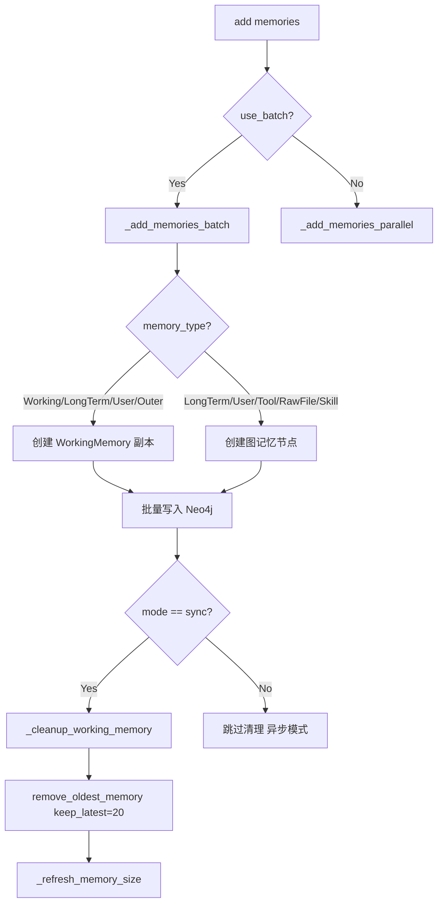
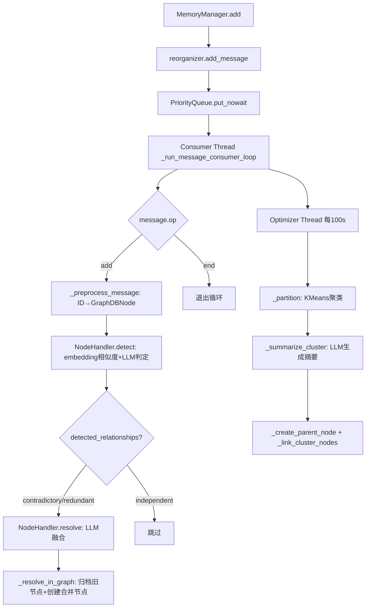

# PD-406.01 MemOS — 三级记忆生命周期管理与图结构异步重组

> 文档编号：PD-406.01
> 来源：MemOS `src/memos/memories/textual/tree_text_memory/organize/manager.py`
> GitHub：https://github.com/MemTensor/MemOS.git
> 问题域：PD-406 记忆生命周期管理 Memory Lifecycle Management
> 状态：可复用方案

---

## 第 1 章 问题与动机

### 1.1 核心问题

Agent 系统中的记忆不是静态数据——它有创建、激活、衰减、归档的完整生命周期。如果不加管理，记忆会无限膨胀导致检索质量下降、存储成本失控。核心挑战包括：

1. **容量控制**：不同类型记忆（工作记忆、长期记忆、用户记忆）需要不同的容量上限和淘汰策略
2. **自动晋升**：临时的工作记忆需要自动晋升为持久的长期记忆，同时清理临时副本
3. **冲突消解**：新记忆与旧记忆语义冲突时，需要 LLM 驱动的融合或硬更新
4. **图结构维护**：记忆以图结构存储时，增删改需要异步重组以避免阻塞主流程
5. **监控与淘汰**：activation memory 和 working memory 需要定时评估重要性并淘汰低价值记忆

### 1.2 MemOS 的解法概述

MemOS 实现了一套完整的三级记忆生命周期管理系统：

1. **MemoryManager** (`manager.py:54`) — 管理 WorkingMemory→LongTermMemory→UserMemory 三级记忆的容量上限、批量写入和 FIFO 淘汰
2. **GraphStructureReorganizer** (`reorganizer.py:81`) — 通过 PriorityQueue 消息队列异步处理图结构的 add/remove/merge 操作，双线程架构（消息消费 + 定时优化）
3. **NodeHandler** (`handler.py:22`) — LLM 驱动的记忆冲突检测与消解，支持 contradictory/redundant/independent 三种关系判定
4. **SchedulerGeneralMonitor** (`general_monitor.py:38`) — 双层监控器（working + activation），基于加权重要性评分的定时淘汰
5. **working_binding 追踪** (`manager.py:23-51`) — 通过 UUID 正则匹配追踪临时 WorkingMemory 与持久记忆的绑定关系

### 1.3 设计思想

| 设计原则 | 具体实现 | 理由 | 替代方案 |
|----------|----------|------|----------|
| 异步不阻塞 | PriorityQueue + 后台消费线程 | 图重组是 LLM 密集操作，阻塞主流程会严重影响响应延迟 | 同步重组（简单但慢） |
| 容量分级 | 四类记忆独立容量上限（Working:20, LongTerm:1500, RawFile:1500, User:480） | 不同记忆类型的生命周期和价值密度不同 | 统一容量池（无法精细控制） |
| LLM 驱动消解 | embedding 相似度筛选 + LLM 判定冲突类型 + LLM 融合 | 语义冲突无法用规则判定，需要理解能力 | 纯规则去重（漏检率高） |
| 双线程重组 | 消息消费线程 + 定时结构优化线程 | 实时响应新增节点 + 周期性全局优化互补 | 单线程（要么实时性差要么全局优化不足） |
| 80% 阈值清理 | `cleanup_threshold = 0.8`，仅在 80% 满时触发清理 | 减少不必要的数据库操作 | 每次写入都清理（IO 浪费） |

---

## 第 2 章 源码实现分析

### 2.1 架构概览

MemOS 的记忆生命周期管理由四个核心组件协作完成：

```
┌─────────────────────────────────────────────────────────────────┐
│                        MemoryManager                            │
│  ┌──────────┐  ┌──────────────┐  ┌──────────────────────────┐  │
│  │ add()    │→│ _process_    │→│ GraphStructureReorganizer │  │
│  │ (sync/   │  │  memory()    │  │  ┌─────────────────────┐ │  │
│  │  async)  │  │ (parallel)   │  │  │ PriorityQueue       │ │  │
│  └──────────┘  └──────────────┘  │  │  ↓                  │ │  │
│       │                          │  │ Consumer Thread     │ │  │
│       ↓                          │  │  ↓                  │ │  │
│  ┌──────────┐                    │  │ NodeHandler         │ │  │
│  │ _cleanup │                    │  │  (detect+resolve)   │ │  │
│  │ _working │                    │  └─────────────────────┘ │  │
│  │ _memory  │                    │  ┌─────────────────────┐ │  │
│  └──────────┘                    │  │ Optimizer Thread    │ │  │
│       │                          │  │  (KMeans partition  │ │  │
│       ↓                          │  │   + LLM summarize)  │ │  │
│  ┌──────────┐                    │  └─────────────────────┘ │  │
│  │ _refresh │                    └──────────────────────────┘  │
│  │ _memory  │                                                   │
│  │ _size    │  ┌──────────────────────────────────────────┐    │
│  └──────────┘  │     SchedulerGeneralMonitor              │    │
│                │  working_memory_monitors (ORM-backed)    │    │
│                │  activation_memory_monitors (ORM-backed) │    │
│                │  importance_score 加权排序 + 定时淘汰     │    │
│                └──────────────────────────────────────────┘    │
└─────────────────────────────────────────────────────────────────┘
                              │
                              ↓
                    ┌──────────────────┐
                    │   Neo4jGraphDB   │
                    │  (图存储后端)     │
                    └──────────────────┘
```

### 2.2 核心实现

#### 2.2.1 三级记忆容量管理与 FIFO 淘汰



对应源码 `manager.py:54-87`（MemoryManager 初始化与容量配置）：

```python
class MemoryManager:
    def __init__(
        self,
        graph_store: Neo4jGraphDB,
        embedder: OllamaEmbedder,
        llm: OpenAILLM | OllamaLLM | AzureLLM,
        memory_size: dict | None = None,
        threshold: float | None = 0.80,
        merged_threshold: float | None = 0.92,
        is_reorganize: bool = False,
    ):
        self.memory_size = memory_size
        self.current_memory_size = {
            "WorkingMemory": 0,
            "LongTermMemory": 0,
            "RawFileMemory": 0,
            "UserMemory": 0,
        }
        if not memory_size:
            self.memory_size = {
                "WorkingMemory": 20,
                "LongTermMemory": 1500,
                "RawFileMemory": 1500,
                "UserMemory": 480,
            }
        self.reorganizer = GraphStructureReorganizer(
            graph_store, llm, embedder, is_reorganize=is_reorganize
        )
```

80% 阈值清理逻辑 `manager.py:519-539`：

```python
def _cleanup_memories_if_needed(self, user_name: str | None = None) -> None:
    cleanup_threshold = 0.8  # Clean up when 80% full
    for memory_type, limit in self.memory_size.items():
        current_count = self.current_memory_size.get(memory_type, 0)
        threshold = int(int(limit) * cleanup_threshold)
        if current_count >= threshold:
            self.graph_store.remove_oldest_memory(
                memory_type=memory_type, keep_latest=limit, user_name=user_name
            )
```

#### 2.2.2 PriorityQueue 异步图重组



对应源码 `reorganizer.py:46-69`（QueueMessage 优先级定义）：

```python
class QueueMessage:
    def __init__(
        self,
        op: Literal["add", "remove", "merge", "update", "end"],
        before_node: list[str] | list[GraphDBNode] | None = None,
        before_edge: list[str] | list[GraphDBEdge] | None = None,
        after_node: list[str] | list[GraphDBNode] | None = None,
        after_edge: list[str] | list[GraphDBEdge] | None = None,
        user_name: str | None = None,
    ):
        self.op = op
        # ...

    def __lt__(self, other: "QueueMessage") -> bool:
        op_priority = {"add": 2, "remove": 2, "merge": 1, "end": 0}
        return op_priority[self.op] < op_priority[other.op]
```

双线程启动 `reorganizer.py:94-106`：

```python
if self.is_reorganize:
    # 1. 消息消费线程
    self.thread = ContextThread(target=self._run_message_consumer_loop)
    self.thread.start()
    # 2. 定时结构优化线程
    self._stop_scheduler = False
    self._is_optimizing = {"LongTermMemory": False, "UserMemory": False}
    self.structure_optimizer_thread = ContextThread(
        target=self._run_structure_organizer_loop
    )
    self.structure_optimizer_thread.start()
```

### 2.3 实现细节

#### 2.3.1 working_binding 追踪机制

MemOS 在 fast 模式下，同时创建 WorkingMemory 副本和 LongTermMemory/UserMemory 节点。通过在 metadata.background 中嵌入 `[working_binding:<uuid>]` 标记，建立临时记忆与持久记忆的绑定关系。后续清理时通过正则提取绑定 ID 批量删除临时节点。

对应源码 `manager.py:23-51`：

```python
def extract_working_binding_ids(mem_items: list[TextualMemoryItem]) -> set[str]:
    bindings: set[str] = set()
    pattern = re.compile(r"\[working_binding:([0-9a-fA-F-]{36})\]")
    for item in mem_items:
        bg = getattr(item.metadata, "background", "") or ""
        if not isinstance(bg, str):
            continue
        match = pattern.search(bg)
        if match:
            bindings.add(match.group(1))
    return bindings
```

#### 2.3.2 LLM 驱动的冲突检测与消解

NodeHandler 实现三步冲突消解流程 (`handler.py:30-74`)：

1. **embedding 相似度筛选**：`search_by_embedding(threshold=0.8)` 找到候选冲突节点
2. **LLM 关系判定**：用 `MEMORY_RELATION_DETECTOR_PROMPT` 判定 contradictory/redundant/independent
3. **LLM 融合或硬更新**：contradictory 时用 `MEMORY_RELATION_RESOLVER_PROMPT` 生成融合记忆，无法融合则按时间戳硬更新

融合后的图操作 (`handler.py:151-187`)：
- 创建合并节点，继承双方所有边
- 将原始节点状态设为 `archived`
- 添加 `MERGED_TO` 边保留溯源链

#### 2.3.3 SchedulerGeneralMonitor 双层监控

监控器维护两层记忆监控 (`general_monitor.py:69-75`)：

- **working_memory_monitors**：跟踪当前活跃的工作记忆，容量上限 = min(DEFAULT_LIMIT, WorkingMemory容量 + partial_retention_number)
- **activation_memory_monitors**：从 working memory 中按 importance_score 排序取 top-k 晋升

重要性评分公式 (`monitor_schemas.py:241-262`)：

```
importance_score = sorting_score × w[0] + normalized_keywords_score × w[1] + normalized_recording_count × w[2]
```

默认权重向量 `[0.9, 0.05, 0.05]`（`general_schemas.py:54`），sorting_score 占绝对主导。

#### 2.3.4 KMeans 递归分区 + LLM 摘要的图结构优化

`optimize_structure` (`reorganizer.py:211-312`) 周期性执行：

1. 加载候选节点 → 2. MiniBatchKMeans 递归分区（max_cluster_size=20）→ 3. LLM 子聚类细分 → 4. LLM 生成聚类摘要 → 5. 创建 PARENT 节点建立层级树 → 6. RelationAndReasoningDetector 添加 INFERS/FOLLOWS/AGGREGATE_TO 边

超时保护：600 秒 deadline watchdog，每步检查是否超时。

---

## 第 3 章 迁移指南

### 3.1 迁移清单

**阶段 1：基础容量管理**
- [ ] 定义记忆类型枚举和容量配置（参考 `memory_size` dict）
- [ ] 实现 FIFO 淘汰：`remove_oldest_memory(memory_type, keep_latest)`
- [ ] 实现 80% 阈值触发清理逻辑
- [ ] 实现 `_refresh_memory_size` 定期同步实际计数

**阶段 2：异步图重组**
- [ ] 定义 QueueMessage 消息协议（op + before/after node/edge）
- [ ] 实现 PriorityQueue 消费线程（merge 优先于 add/remove）
- [ ] 实现定时结构优化线程（KMeans 分区 + LLM 摘要）
- [ ] 实现 `wait_until_current_task_done` 优雅等待

**阶段 3：冲突消解**
- [ ] 实现 embedding 相似度候选筛选
- [ ] 实现 LLM 关系判定（contradictory/redundant/independent）
- [ ] 实现 LLM 融合 + 图边继承 + archived 状态标记

**阶段 4：监控与淘汰**
- [ ] 实现 MemoryMonitorManager（Pydantic 模型 + ORM 持久化）
- [ ] 实现加权重要性评分（sorting × 0.9 + keywords × 0.05 + recording_count × 0.05）
- [ ] 实现 working → activation 晋升（top-k by importance_score）

### 3.2 适配代码模板

以下是一个可独立运行的简化版记忆生命周期管理器：

```python
import re
import time
import threading
from queue import PriorityQueue
from dataclasses import dataclass, field
from typing import Literal
from datetime import datetime


@dataclass
class MemoryItem:
    id: str
    content: str
    memory_type: str  # "working", "long_term", "user"
    status: str = "activated"  # activated, archived, deleted
    importance_score: float = 0.0
    recording_count: int = 1
    created_at: str = field(default_factory=lambda: datetime.now().isoformat())
    binding_id: str | None = None  # working_binding for fast mode


@dataclass(order=True)
class ReorgMessage:
    priority: int
    op: str = field(compare=False)  # add, remove, merge, end
    node_ids: list[str] = field(compare=False, default_factory=list)

    @classmethod
    def add(cls, node_ids: list[str]) -> "ReorgMessage":
        return cls(priority=2, op="add", node_ids=node_ids)

    @classmethod
    def end(cls) -> "ReorgMessage":
        return cls(priority=0, op="end", node_ids=[])


class MemoryLifecycleManager:
    """Simplified memory lifecycle manager inspired by MemOS."""

    CAPACITY = {"working": 20, "long_term": 1500, "user": 480}
    CLEANUP_THRESHOLD = 0.8

    def __init__(self, storage, embedder=None, llm=None):
        self.storage = storage  # Your graph/DB backend
        self.embedder = embedder
        self.llm = llm
        self._counts: dict[str, int] = {k: 0 for k in self.CAPACITY}
        self._queue: PriorityQueue = PriorityQueue()
        self._stop = False
        self._consumer = threading.Thread(target=self._consume_loop, daemon=True)
        self._consumer.start()

    def add(self, items: list[MemoryItem], mode: str = "sync") -> list[str]:
        added_ids = []
        for item in items:
            # Always create working copy
            if item.memory_type in ("working", "long_term", "user"):
                self.storage.add(item.id, item.content, "working")
            # Create persistent copy for non-working types
            if item.memory_type in ("long_term", "user"):
                self.storage.add(item.id, item.content, item.memory_type)
                self._queue.put_nowait(ReorgMessage.add([item.id]))
                added_ids.append(item.id)

        if mode == "sync":
            self._cleanup("working")
            self._refresh_counts()
        return added_ids

    def _cleanup(self, memory_type: str) -> None:
        limit = self.CAPACITY.get(memory_type, 0)
        current = self._counts.get(memory_type, 0)
        if current >= int(limit * self.CLEANUP_THRESHOLD):
            self.storage.remove_oldest(memory_type, keep_latest=limit)

    def _refresh_counts(self) -> None:
        self._counts = self.storage.get_counts_by_type()

    def _consume_loop(self) -> None:
        while True:
            msg = self._queue.get()
            if msg.op == "end":
                break
            try:
                if msg.op == "add":
                    self._handle_add(msg.node_ids)
            except Exception as e:
                print(f"Reorg error: {e}")
            self._queue.task_done()

    def _handle_add(self, node_ids: list[str]) -> None:
        # Detect conflicts via embedding similarity + LLM
        for nid in node_ids:
            candidates = self.storage.search_similar(nid, threshold=0.8, top_k=5)
            for candidate in candidates:
                relation = self._detect_relation(nid, candidate)
                if relation in ("contradictory", "redundant"):
                    self._resolve_conflict(nid, candidate, relation)

    def _detect_relation(self, id_a: str, id_b: str) -> str:
        # LLM-based relation detection
        if self.llm is None:
            return "independent"
        # ... LLM call with MEMORY_RELATION_DETECTOR_PROMPT
        return "independent"

    def _resolve_conflict(self, id_a: str, id_b: str, relation: str) -> None:
        # LLM fusion or hard update by timestamp
        pass

    def close(self) -> None:
        self._queue.put_nowait(ReorgMessage.end())
        self._consumer.join(timeout=30)
```

### 3.3 适用场景

| 场景 | 适用度 | 说明 |
|------|--------|------|
| 长对话 Agent（100+ 轮） | ⭐⭐⭐ | 工作记忆 FIFO 淘汰 + 长期记忆自动晋升是核心需求 |
| 多用户记忆系统 | ⭐⭐⭐ | user_name 参数贯穿全链路，天然支持多租户隔离 |
| 知识图谱维护 | ⭐⭐⭐ | 异步图重组 + KMeans 聚类 + PARENT 层级树适合大规模图 |
| 简单 RAG 系统 | ⭐⭐ | 如果只需向量检索不需要生命周期管理，方案过重 |
| 实时对话（低延迟要求） | ⭐⭐ | 异步重组不阻塞主流程，但 LLM 冲突消解仍有延迟 |
| 嵌入式/边缘设备 | ⭐ | 依赖 Neo4j + LLM，资源需求较高 |

---

## 第 4 章 测试用例

```python
import pytest
import re
import time
from unittest.mock import MagicMock, patch
from queue import PriorityQueue
from dataclasses import dataclass, field
from typing import Literal


# --- Test MemoryManager capacity management ---

class TestMemoryCapacityManagement:
    """Tests for MemoryManager's capacity limits and FIFO cleanup."""

    def test_default_capacity_limits(self):
        """Verify default memory size configuration."""
        default_sizes = {
            "WorkingMemory": 20,
            "LongTermMemory": 1500,
            "RawFileMemory": 1500,
            "UserMemory": 480,
        }
        # MemoryManager uses these defaults when memory_size=None
        assert default_sizes["WorkingMemory"] == 20
        assert default_sizes["LongTermMemory"] == 1500

    def test_cleanup_threshold_80_percent(self):
        """Cleanup should only trigger when 80% full."""
        cleanup_threshold = 0.8
        limit = 1500
        threshold = int(limit * cleanup_threshold)
        assert threshold == 1200

        # Below threshold: no cleanup
        assert 1100 < threshold  # should NOT trigger
        # At threshold: cleanup
        assert 1200 >= threshold  # should trigger

    def test_working_binding_extraction(self):
        """Test UUID extraction from working_binding markers."""
        pattern = re.compile(r"\[working_binding:([0-9a-fA-F-]{36})\]")
        bg = "[working_binding:550e8400-e29b-41d4-a716-446655440000] direct built from raw inputs"
        match = pattern.search(bg)
        assert match is not None
        assert match.group(1) == "550e8400-e29b-41d4-a716-446655440000"

    def test_working_binding_no_match(self):
        """No binding marker should return empty set."""
        pattern = re.compile(r"\[working_binding:([0-9a-fA-F-]{36})\]")
        bg = "normal background text without binding"
        match = pattern.search(bg)
        assert match is None


# --- Test QueueMessage priority ---

class TestQueueMessagePriority:
    """Tests for PriorityQueue message ordering."""

    def test_merge_before_add(self):
        """Merge operations (priority=1) should be processed before add (priority=2)."""
        op_priority = {"add": 2, "remove": 2, "merge": 1, "end": 0}
        assert op_priority["merge"] < op_priority["add"]
        assert op_priority["end"] < op_priority["merge"]

    def test_priority_queue_ordering(self):
        """PriorityQueue should dequeue in priority order."""
        q = PriorityQueue()
        q.put((2, "add"))
        q.put((1, "merge"))
        q.put((0, "end"))
        assert q.get()[1] == "end"
        assert q.get()[1] == "merge"
        assert q.get()[1] == "add"


# --- Test importance score calculation ---

class TestImportanceScore:
    """Tests for weighted importance score calculation."""

    def test_default_weight_vector(self):
        """Default weights should sum to 1.0."""
        weights = [0.9, 0.05, 0.05]
        assert abs(sum(weights) - 1.0) < 1e-6

    def test_importance_score_calculation(self):
        """Verify importance score formula."""
        w = [0.9, 0.05, 0.05]
        sorting_score = 0.8
        keywords_score = 2.0
        recording_count = 3

        normalized_keywords = min(keywords_score * w[1], 5)
        normalized_recording = min(recording_count * w[2], 2)
        score = sorting_score * w[0] + normalized_keywords * w[1] + normalized_recording * w[2]

        assert score == pytest.approx(
            0.8 * 0.9 + min(2.0 * 0.05, 5) * 0.05 + min(3 * 0.05, 2) * 0.05,
            rel=1e-6,
        )

    def test_sorting_score_dominates(self):
        """With w[0]=0.9, sorting_score should dominate the final score."""
        w = [0.9, 0.05, 0.05]
        high_sort = 1.0 * w[0]  # 0.9
        max_keywords_contrib = 5 * w[1]  # 0.25
        max_recording_contrib = 2 * w[2]  # 0.1
        assert high_sort > max_keywords_contrib + max_recording_contrib
```

---

## 第 5 章 跨域关联

| 关联域 | 关系类型 | 说明 |
|--------|----------|------|
| PD-01 上下文管理 | 协同 | WorkingMemory 容量上限（20）直接影响上下文窗口大小，FIFO 淘汰是上下文压缩的一种形式 |
| PD-06 记忆持久化 | 依赖 | 生命周期管理建立在持久化之上——Neo4j 图存储是底层，ORM 是监控器持久化层 |
| PD-02 多 Agent 编排 | 协同 | SchedulerGeneralMonitor 的 user_id + mem_cube_id 双键设计支持多 Agent 各自独立的记忆空间 |
| PD-07 质量检查 | 协同 | LLM 驱动的冲突检测（contradictory/redundant）本质是记忆质量保障机制 |
| PD-08 搜索与检索 | 协同 | KMeans 聚类 + PARENT 层级树优化了图检索的效率，importance_score 排序影响检索结果质量 |
| PD-10 中间件管道 | 互补 | 记忆生命周期事件（add/remove/merge）可作为中间件管道的触发信号 |

---

## 第 6 章 来源文件索引

| 文件 | 行范围 | 关键实现 |
|------|--------|----------|
| `src/memos/memories/textual/tree_text_memory/organize/manager.py` | L23-51 | `extract_working_binding_ids` UUID 正则提取 |
| `src/memos/memories/textual/tree_text_memory/organize/manager.py` | L54-87 | `MemoryManager.__init__` 四类容量配置 |
| `src/memos/memories/textual/tree_text_memory/organize/manager.py` | L89-119 | `MemoryManager.add` sync/async 双模式 |
| `src/memos/memories/textual/tree_text_memory/organize/manager.py` | L139-245 | `_add_memories_batch` 批量写入 + working_binding |
| `src/memos/memories/textual/tree_text_memory/organize/manager.py` | L247-258 | `_cleanup_working_memory` FIFO 淘汰 |
| `src/memos/memories/textual/tree_text_memory/organize/manager.py` | L519-539 | `_cleanup_memories_if_needed` 80% 阈值清理 |
| `src/memos/memories/textual/tree_text_memory/organize/reorganizer.py` | L46-69 | `QueueMessage` 优先级消息定义 |
| `src/memos/memories/textual/tree_text_memory/organize/reorganizer.py` | L81-106 | `GraphStructureReorganizer.__init__` 双线程启动 |
| `src/memos/memories/textual/tree_text_memory/organize/reorganizer.py` | L133-144 | `_run_message_consumer_loop` 消息消费循环 |
| `src/memos/memories/textual/tree_text_memory/organize/reorganizer.py` | L151-171 | `_run_structure_organizer_loop` 定时优化循环 |
| `src/memos/memories/textual/tree_text_memory/organize/reorganizer.py` | L211-312 | `optimize_structure` KMeans 分区 + 超时保护 |
| `src/memos/memories/textual/tree_text_memory/organize/reorganizer.py` | L416-452 | `_local_subcluster` LLM 语义子聚类 |
| `src/memos/memories/textual/tree_text_memory/organize/reorganizer.py` | L550-596 | `_summarize_cluster` LLM 摘要生成 |
| `src/memos/memories/textual/tree_text_memory/organize/handler.py` | L22-74 | `NodeHandler.detect` embedding + LLM 冲突检测 |
| `src/memos/memories/textual/tree_text_memory/organize/handler.py` | L76-130 | `NodeHandler.resolve` LLM 融合消解 |
| `src/memos/memories/textual/tree_text_memory/organize/handler.py` | L151-187 | `_resolve_in_graph` 图边继承 + archived 标记 |
| `src/memos/mem_scheduler/monitors/general_monitor.py` | L38-82 | `SchedulerGeneralMonitor.__init__` 双层监控器 |
| `src/memos/mem_scheduler/monitors/general_monitor.py` | L196-232 | `update_working_memory_monitors` 工作记忆更新 |
| `src/memos/mem_scheduler/monitors/general_monitor.py` | L234-260 | `update_activation_memory_monitors` 激活记忆晋升 |
| `src/memos/mem_scheduler/schemas/monitor_schemas.py` | L189-262 | `MemoryMonitorItem` 重要性评分模型 |
| `src/memos/mem_scheduler/schemas/monitor_schemas.py` | L265-406 | `MemoryMonitorManager` 容量管理 + partial retention |
| `src/memos/mem_scheduler/schemas/general_schemas.py` | L14-15 | 默认容量常量 (working=30, activation=20) |
| `src/memos/mem_scheduler/schemas/general_schemas.py` | L54 | 默认权重向量 `[0.9, 0.05, 0.05]` |
| `src/memos/memories/textual/item.py` | L100 | `status` 字段：activated/resolving/archived/deleted |
| `src/memos/memories/textual/item.py` | L162-174 | `TreeNodeTextualMemoryMetadata.memory_type` 8 种类型枚举 |

---

## 第 7 章 横向对比维度

```json comparison_data
{
  "project": "MemOS",
  "dimensions": {
    "记忆结构": "WorkingMemory→LongTermMemory→UserMemory 三级 + 8 种 memory_type 枚举",
    "容量管理": "四类独立容量上限（20/1500/1500/480）+ 80% 阈值触发 FIFO 淘汰",
    "晋升机制": "working→activation 按 importance_score top-k 晋升，partial_retention 保留高价值旧记忆",
    "冲突消解": "embedding 相似度筛选 + LLM 三分类判定（contradictory/redundant/independent）+ LLM 融合",
    "图重组": "PriorityQueue 双线程异步（消息消费 + 定时 KMeans 聚类优化），600s deadline watchdog",
    "监控持久化": "ORM-backed MemoryMonitorManager + SQLAlchemy Engine，双层 working/activation 监控"
  }
}
```

### 域元数据补充

```json domain_metadata
{
  "solution_summary": "MemOS 用 MemoryManager 四类容量上限 + 80% 阈值 FIFO 淘汰管理三级记忆，GraphStructureReorganizer 双线程（PriorityQueue 消费 + KMeans 定时优化）异步重组图结构，NodeHandler 通过 embedding + LLM 实现冲突检测与融合消解",
  "description": "记忆从创建到归档的全生命周期管理，包含容量控制、冲突消解、图结构维护",
  "sub_problems": [
    "LLM 驱动的语义冲突检测与融合消解",
    "KMeans 递归分区与 LLM 摘要的层级树构建",
    "加权重要性评分与 partial retention 淘汰策略"
  ],
  "best_practices": [
    "80% 阈值触发清理减少不必要的数据库操作",
    "双线程架构分离实时消息响应与周期性全局优化",
    "MERGED_TO 边保留冲突消解的完整溯源链",
    "deadline watchdog 防止图优化超时阻塞"
  ]
}
```
