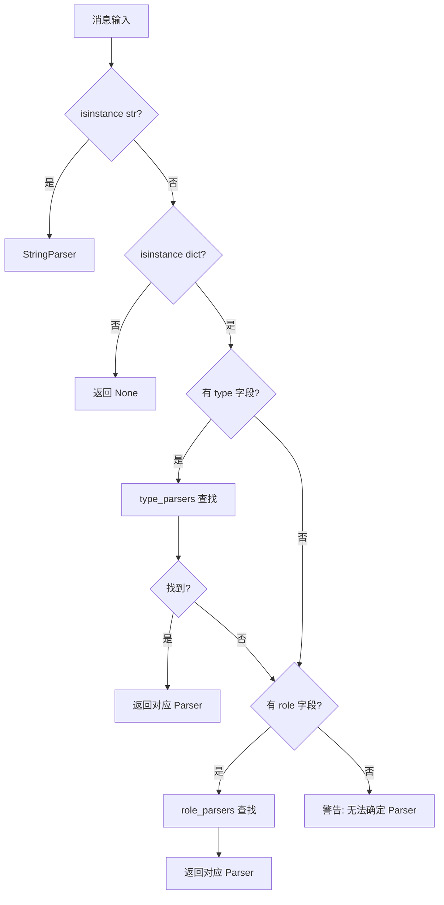
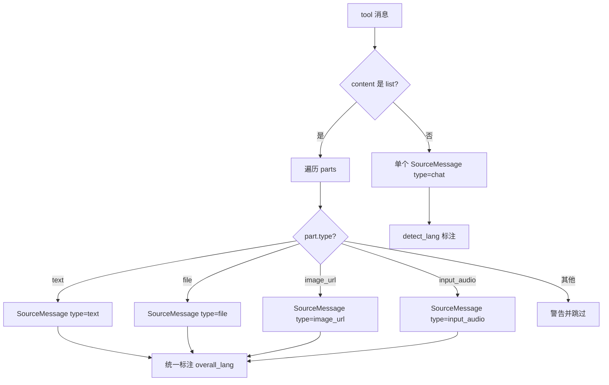
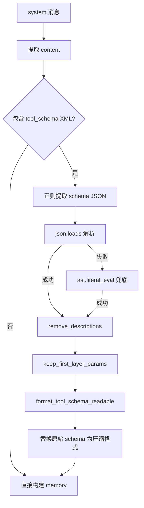
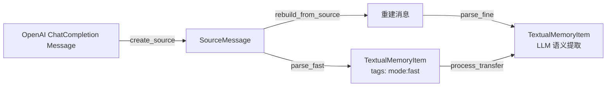

# PD-407.01 MemOS — 多模态消息角色路由与双精度记忆提取

> 文档编号：PD-407.01
> 来源：MemOS `src/memos/mem_reader/read_multi_modal/`
> GitHub：https://github.com/MemTensor/MemOS.git
> 问题域：PD-407 多模态消息解析 Multimodal Message Parsing
> 状态：可复用方案

---

## 第 1 章 问题与动机

### 1.1 核心问题

LLM 对话系统中，消息不再是纯文本。一条用户消息可能同时包含文字、图片 URL、文件附件和音频片段。不同角色（system/user/assistant/tool）的消息结构差异巨大——system 消息内嵌 `<tool_schema>` XML 块，assistant 消息携带 `tool_calls` 和 `refusal` 字段，tool 消息绑定 `tool_call_id`。

要将这些异构消息统一转化为可检索、可持久化的"记忆项"（TextualMemoryItem），需要解决三个子问题：

1. **角色路由**：根据消息的 `role` 或 `type` 字段，自动分发到对应的解析器
2. **内容拆分**：一条多模态消息拆成多个 SourceMessage（每个 part 一个），保留溯源能力
3. **双精度解析**：fast 模式零 LLM 调用、低延迟写入；fine 模式用 LLM 做语义提取和去重

### 1.2 MemOS 的解法概述

MemOS 的 `mem_reader` 模块构建了一套完整的多模态消息解析管线：

1. **MultiModalParser 统一路由器**（`multi_modal_parser.py:31`）：维护 `role_parsers` 和 `type_parsers` 两张路由表，根据消息结构自动选择解析器
2. **BaseMessageParser 抽象基类**（`base.py:81`）：定义 `create_source` / `parse_fast` / `parse_fine` / `rebuild_from_source` 四个抽象方法，所有角色解析器继承此基类
3. **四角色解析器**：SystemParser、UserParser、AssistantParser、ToolParser 分别处理四种 OpenAI ChatCompletion 消息格式
4. **SourceMessage 统一中间表示**（`item.py:16`）：Pydantic 模型，`extra="allow"` 支持任意溯源属性，是 fast→fine 的桥梁
5. **语言自动检测**（`utils.py:330`）：基于 Unicode 中文字符占比的轻量检测，30% 阈值判定中/英文

### 1.3 设计思想

| 设计原则 | 具体实现 | 理由 | 替代方案 |
|----------|----------|------|----------|
| Strategy 模式 | 每个角色一个 Parser 类，继承 BaseMessageParser | 各角色消息结构差异大，硬编码 if-else 不可维护 | 单一 Parser + 大量条件分支 |
| 双路由表 | `role_parsers`（按角色）+ `type_parsers`（按内容类型） | 消息可能是 MessageList（有 role）或 RawMessageList（有 type） | 单一路由表 + 类型推断 |
| fast/fine 双精度 | fast 零 LLM 调用直接写入，fine 用 LLM 提取语义 | 实时场景需要低延迟，离线场景需要高质量 | 只做 fine 模式 |
| SourceMessage 溯源 | 每个 content part 生成独立 SourceMessage，保留 chat_time/message_id | 支持审计、回溯、去重 | 只保留原始消息引用 |
| 语言一致性 | 多模态消息先聚合所有文本检测语言，再统一标注到每个 part | 避免同一消息内不同 part 语言标注不一致 | 每个 part 独立检测 |

---

## 第 2 章 源码实现分析

### 2.1 架构概览

MemOS 的多模态消息解析采用三层架构：

```
┌─────────────────────────────────────────────────────────────┐
│                  MultiModalStructMemReader                   │
│  (multi_modal_struct.py:30)                                  │
│  继承 SimpleStructMemReader，持有 MultiModalParser           │
├─────────────────────────────────────────────────────────────┤
│                     MultiModalParser                         │
│  (multi_modal_parser.py:31)                                  │
│  统一路由器：role_parsers + type_parsers 双路由表            │
├──────────┬──────────┬───────────────┬───────────────────────┤
│ System   │ User     │ Assistant     │ Tool                   │
│ Parser   │ Parser   │ Parser        │ Parser                 │
│          │          │               │                        │
│ 处理:    │ 处理:    │ 处理:         │ 处理:                  │
│ tool_    │ text     │ text          │ text                   │
│ schema   │ file     │ refusal       │ file                   │
│ 压缩     │ image    │ tool_calls    │ image_url              │
│          │ audio    │ audio         │ input_audio            │
├──────────┴──────────┴───────────────┴───────────────────────┤
│              BaseMessageParser (ABC)                          │
│  (base.py:81)                                                │
│  create_source | parse_fast | parse_fine | rebuild_from_source│
├─────────────────────────────────────────────────────────────┤
│  SourceMessage → TextualMemoryItem → TreeNodeTextualMemory   │
│  (item.py:16)    (item.py:284)        Metadata (item.py:162) │
└─────────────────────────────────────────────────────────────┘
```

### 2.2 核心实现

#### 2.2.1 MultiModalParser 双路由表



对应源码 `src/memos/mem_reader/read_multi_modal/multi_modal_parser.py:69-86`：

```python
self.role_parsers = {
    "system": SystemParser(embedder, llm),
    "user": UserParser(embedder, llm),
    "assistant": AssistantParser(embedder, llm),
    "tool": ToolParser(embedder, llm),
}

self.type_parsers = {
    "text": self.text_content_parser,
    "file": self.file_content_parser,
    "image": self.image_parser,
    "image_url": self.image_parser,
    "audio": self.audio_parser,
    "tool_description": self.tool_parser,
    "tool_input": self.tool_parser,
    "tool_output": self.tool_parser,
}
```

路由逻辑 `multi_modal_parser.py:88-122`：

```python
def _get_parser(self, message: Any) -> BaseMessageParser | None:
    if isinstance(message, str):
        return self.string_parser
    if not isinstance(message, dict):
        return None
    # 优先按 type 路由（RawMessageList 场景）
    if "type" in message:
        parser = self.type_parsers.get(message.get("type"))
        if parser:
            return parser
    # 其次按 role 路由（MessageList 场景）
    role = extract_role(message)
    if role:
        return self.role_parsers.get(role)
    return None
```

#### 2.2.2 ToolParser 多模态内容拆分



对应源码 `src/memos/mem_reader/read_multi_modal/tool_parser.py:41-147`：

```python
def create_source(self, message, info) -> SourceMessage | list[SourceMessage]:
    role = message.get("role", "tool")
    raw_content = message.get("content", "")
    sources = []

    if isinstance(raw_content, list):
        # 先聚合所有文本检测语言
        text_contents = []
        for part in raw_content:
            if isinstance(part, dict) and part.get("type") == "text":
                text_contents.append(part.get("text", ""))
        overall_lang = detect_lang(" ".join(text_contents)) if text_contents else "en"

        # 每个 part 生成独立 SourceMessage
        for part in raw_content:
            part_type = part.get("type", "")
            if part_type == "text":
                source = SourceMessage(type="text", role=role, content=part.get("text", ""))
                source.lang = overall_lang
                sources.append(source)
            elif part_type == "file":
                file_info = part.get("file", {})
                source = SourceMessage(type="file", role=role, content=file_info.get("file_data", ""))
                source.lang = overall_lang
                sources.append(source)
            # ... image_url, input_audio 类似
    else:
        source = SourceMessage(type="chat", role=role, content=raw_content)
        sources.append(_add_lang_to_source(source, raw_content))
    return sources
```

#### 2.2.3 SystemParser tool_schema 压缩



对应源码 `src/memos/mem_reader/read_multi_modal/system_parser.py:87-234`：

```python
def parse_fast(self, message, info, **kwargs):
    content = message.get("content", "")
    # 正则提取 <tool_schema>...</tool_schema>
    match = re.search(r"<tool_schema>(.*?)</tool_schema>", content, flags=re.DOTALL)
    if match:
        schema_content = match.group(1)
        tool_schema = json.loads(schema_content)
        # 三步压缩：去嵌套参数 → 去 description → 转可读格式
        simple_tool_schema = keep_first_layer_params(tool_schema)
        simple_tool_schema = remove_descriptions(simple_tool_schema)
        readable_schema = format_tool_schema_readable(simple_tool_schema)
        content = content.replace(original_text,
            f"<tool_schema>{readable_schema}</tool_schema>", 1)
    # ... 构建 TextualMemoryItem
```

### 2.3 实现细节

**数据流：消息 → SourceMessage → TextualMemoryItem**



关键细节：

1. **memory_type 按角色分配**（`base.py:170`）：user 消息 → `UserMemory`，其他角色 → `LongTermMemory`，tool fine 模式 → `ToolSchemaMemory`
2. **文本分块**（`base.py:251-277`）：使用 MarkdownChunker（chunk_size=1280, overlap=200）或 CharacterTextChunker，失败时降级到 SimpleTextSplitter
3. **SHA-256 去重**（`system_parser.py:315-327`）：fine 模式下对 tool schema 做 hash 去重，处理碰撞
4. **滑动窗口聚合**（`multi_modal_struct.py:130-270`）：多个 memory item 按 token 窗口聚合，批量计算 embedding，失败时逐条降级
5. **UserContext 传播**（`tool_parser.py:187-189`）：通过 kwargs 传递 `manager_user_id` 和 `project_id`，支持多租户隔离


---

## 第 3 章 迁移指南

### 3.1 迁移清单

**阶段 1：数据模型（1 个文件）**
- [ ] 定义 `SourceMessage` Pydantic 模型（`extra="allow"`），包含 type/role/content/chat_time/message_id 字段
- [ ] 定义 `MemoryItem` 模型，metadata 中包含 `sources: list[SourceMessage]`

**阶段 2：解析器基类（1 个文件）**
- [ ] 创建 `BaseMessageParser(ABC)`，定义四个抽象方法
- [ ] 实现默认 `parse_fast`（提取文本 → 生成 embedding → 构建 MemoryItem）
- [ ] 实现 `parse()` 路由方法（mode="fast"|"fine"）
- [ ] 实现 `_split_text()` 文本分块

**阶段 3：角色解析器（4 个文件）**
- [ ] SystemParser：处理 tool_schema 压缩
- [ ] UserParser：处理 text/file/image_url/input_audio 多模态
- [ ] AssistantParser：处理 text/refusal/tool_calls/audio
- [ ] ToolParser：处理 tool 消息的多模态内容

**阶段 4：统一路由器（1 个文件）**
- [ ] 创建 `MultiModalParser`，初始化 role_parsers + type_parsers
- [ ] 实现 `_get_parser()` 双路由逻辑
- [ ] 实现 `parse()` / `parse_batch()` / `process_transfer()`

**阶段 5：语言检测（1 个函数）**
- [ ] 实现 `detect_lang()`：Unicode 中文字符占比 > 30% → "zh"，否则 "en"

### 3.2 适配代码模板

```python
"""可直接复用的多模态消息解析框架。"""

from abc import ABC, abstractmethod
from typing import Any, Literal
from pydantic import BaseModel, ConfigDict, Field


# ── 数据模型 ──────────────────────────────────────────────

class SourceMessage(BaseModel):
    """消息溯源：记录记忆项的来源。"""
    type: str | None = "chat"  # chat / file / image / audio / refusal / tool_calls
    role: Literal["user", "assistant", "system", "tool"] | None = None
    content: str | None = None
    chat_time: str | None = None
    message_id: str | None = None
    lang: str | None = None
    model_config = ConfigDict(extra="allow")  # 允许任意溯源属性


class MemoryItem(BaseModel):
    """统一记忆项。"""
    memory: str
    memory_type: str = "LongTermMemory"
    sources: list[SourceMessage] = Field(default_factory=list)
    tags: list[str] = Field(default_factory=list)
    embedding: list[float] | None = None


# ── 语言检测 ──────────────────────────────────────────────

import re

def detect_lang(text: str) -> str:
    """轻量中英文检测：中文字符占比 > 30% 则判定为中文。"""
    if not text:
        return "en"
    chinese_chars = re.findall(r"[\u4e00-\u9fff]", text)
    text_clean = re.sub(r"[\s\d\W]", "", text)
    if text_clean and len(chinese_chars) / len(text_clean) > 0.3:
        return "zh"
    return "en"


# ── 解析器基类 ────────────────────────────────────────────

class BaseMessageParser(ABC):
    """所有角色解析器的基类。"""

    def __init__(self, embedder, llm=None):
        self.embedder = embedder
        self.llm = llm

    @abstractmethod
    def create_source(self, message: dict, info: dict) -> list[SourceMessage]:
        """将消息拆分为 SourceMessage 列表。"""

    @abstractmethod
    def parse_fine(self, message: dict, info: dict, **kw) -> list[MemoryItem]:
        """LLM 精细提取。"""

    def parse_fast(self, message: dict, info: dict, **kw) -> list[MemoryItem]:
        """快速提取：零 LLM 调用。"""
        content = self._extract_text(message.get("content"))
        if not content:
            return []
        sources = self.create_source(message, info)
        role = message.get("role", "")
        return [MemoryItem(
            memory=content,
            memory_type="UserMemory" if role == "user" else "LongTermMemory",
            sources=sources,
            tags=["mode:fast"],
            embedding=self.embedder.embed([content])[0],
        )]

    def parse(self, message: dict, info: dict, mode="fast", **kw) -> list[MemoryItem]:
        if mode == "fast":
            return self.parse_fast(message, info, **kw)
        return self.parse_fine(message, info, **kw)

    @staticmethod
    def _extract_text(content: Any) -> str:
        if isinstance(content, str):
            return content
        if isinstance(content, list):
            return " ".join(
                p.get("text", "") for p in content
                if isinstance(p, dict) and p.get("type") == "text"
            )
        return str(content) if content else ""


# ── 统一路由器 ────────────────────────────────────────────

class MultiModalRouter:
    """根据消息 role/type 自动路由到对应解析器。"""

    def __init__(self, role_parsers: dict[str, BaseMessageParser],
                 type_parsers: dict[str, BaseMessageParser]):
        self.role_parsers = role_parsers
        self.type_parsers = type_parsers

    def get_parser(self, message: Any) -> BaseMessageParser | None:
        if isinstance(message, str):
            return self.role_parsers.get("user")  # 默认当 user 消息
        if not isinstance(message, dict):
            return None
        if "type" in message:
            p = self.type_parsers.get(message["type"])
            if p:
                return p
        role = message.get("role", "")
        return self.role_parsers.get(role)

    def parse(self, message: Any, info: dict, mode="fast", **kw) -> list[MemoryItem]:
        parser = self.get_parser(message)
        if not parser:
            return []
        return parser.parse(message, info, mode=mode, **kw)
```

### 3.3 适用场景

| 场景 | 适用度 | 说明 |
|------|--------|------|
| LLM 对话记忆系统 | ⭐⭐⭐ | 核心场景：将多轮对话转化为可检索记忆 |
| RAG 文档摄入管线 | ⭐⭐⭐ | 通过 type_parsers 路由 file/image 到专用解析器 |
| Agent 工具调用日志 | ⭐⭐ | ToolParser 处理 tool 消息，但 fine 模式为空实现 |
| 实时聊天分析 | ⭐⭐⭐ | fast 模式零 LLM 调用，适合实时场景 |
| 离线记忆精炼 | ⭐⭐ | process_transfer 支持 fast→fine 异步升级 |

---

## 第 4 章 测试用例

```python
import pytest
from unittest.mock import MagicMock


class MockEmbedder:
    def embed(self, texts: list[str]) -> list[list[float]]:
        return [[0.1, 0.2, 0.3] for _ in texts]


class TestToolParserCreateSource:
    """测试 ToolParser.create_source 多模态拆分。"""

    def setup_method(self):
        from memos.mem_reader.read_multi_modal.tool_parser import ToolParser
        self.parser = ToolParser(embedder=MockEmbedder(), llm=None)

    def test_list_content_splits_into_multiple_sources(self):
        message = {
            "role": "tool",
            "content": [
                {"type": "text", "text": "查询结果"},
                {"type": "file", "file": {"filename": "data.csv", "file_data": "a,b\n1,2"}},
                {"type": "image_url", "image_url": {"url": "https://example.com/img.png"}},
            ],
            "tool_call_id": "call_123",
        }
        sources = self.parser.create_source(message, {})
        assert len(sources) == 3
        assert sources[0].type == "text"
        assert sources[1].type == "file"
        assert sources[2].type == "image_url"
        # 所有 part 语言一致
        assert all(s.lang == sources[0].lang for s in sources)

    def test_string_content_single_source(self):
        message = {"role": "tool", "content": "OK", "tool_call_id": "call_456"}
        sources = self.parser.create_source(message, {})
        assert len(sources) == 1
        assert sources[0].type == "chat"
        assert sources[0].content == "OK"

    def test_empty_content_returns_empty(self):
        message = {"role": "tool", "content": "", "tool_call_id": "call_789"}
        sources = self.parser.create_source(message, {})
        assert sources == []


class TestMultiModalParserRouting:
    """测试 MultiModalParser 路由逻辑。"""

    def setup_method(self):
        from memos.mem_reader.read_multi_modal.multi_modal_parser import MultiModalParser
        self.parser = MultiModalParser(embedder=MockEmbedder(), llm=None)

    def test_routes_by_role(self):
        from memos.mem_reader.read_multi_modal.user_parser import UserParser
        from memos.mem_reader.read_multi_modal.system_parser import SystemParser
        p = self.parser._get_parser({"role": "user", "content": "hi"})
        assert isinstance(p, UserParser)
        p = self.parser._get_parser({"role": "system", "content": "you are..."})
        assert isinstance(p, SystemParser)

    def test_routes_by_type(self):
        from memos.mem_reader.read_multi_modal.text_content_parser import TextContentParser
        p = self.parser._get_parser({"type": "text", "text": "hello"})
        assert isinstance(p, TextContentParser)

    def test_string_routes_to_string_parser(self):
        from memos.mem_reader.read_multi_modal.string_parser import StringParser
        p = self.parser._get_parser("plain text message")
        assert isinstance(p, StringParser)


class TestDetectLang:
    """测试语言检测。"""

    def test_chinese_text(self):
        from memos.mem_reader.read_multi_modal.utils import detect_lang
        assert detect_lang("今天天气不错，适合出去走走") == "zh"

    def test_english_text(self):
        from memos.mem_reader.read_multi_modal.utils import detect_lang
        assert detect_lang("The weather is nice today") == "en"

    def test_empty_text(self):
        from memos.mem_reader.read_multi_modal.utils import detect_lang
        assert detect_lang("") == "en"

    def test_mixed_text_chinese_dominant(self):
        from memos.mem_reader.read_multi_modal.utils import detect_lang
        assert detect_lang("这是一段中文 with some English") == "zh"
```


---

## 第 5 章 跨域关联

| 关联域 | 关系类型 | 说明 |
|--------|----------|------|
| PD-01 上下文管理 | 协同 | SystemParser 的 tool_schema 压缩（去 description、只保留首层参数）直接减少上下文 token 消耗 |
| PD-06 记忆持久化 | 依赖 | 解析产出的 TextualMemoryItem 是记忆持久化的输入，SourceMessage 是溯源的基础 |
| PD-04 工具系统 | 协同 | ToolParser 处理 tool 消息，SystemParser 解析 tool_schema，两者共同支撑工具系统的记忆化 |
| PD-08 搜索与检索 | 协同 | fast 模式生成的 embedding 直接用于向量检索，滑动窗口聚合优化检索粒度 |
| PD-10 中间件管道 | 协同 | MultiModalParser 本身是一个路由中间件，process_transfer 实现 fast→fine 的异步管道 |

---

## 第 6 章 来源文件索引

| 文件 | 行范围 | 关键实现 |
|------|--------|----------|
| `src/memos/mem_reader/read_multi_modal/base.py` | L81-L278 | BaseMessageParser 抽象基类、parse_fast 默认实现、_split_text 分块 |
| `src/memos/mem_reader/read_multi_modal/multi_modal_parser.py` | L31-L258 | MultiModalParser 统一路由器、双路由表、process_transfer |
| `src/memos/mem_reader/read_multi_modal/tool_parser.py` | L28-L222 | ToolParser 四种内容类型拆分、parse_fast 实现 |
| `src/memos/mem_reader/read_multi_modal/system_parser.py` | L31-L346 | SystemParser tool_schema 三步压缩、SHA-256 去重 |
| `src/memos/mem_reader/read_multi_modal/user_parser.py` | L26-L235 | UserParser 多模态 SourceMessage 创建 |
| `src/memos/mem_reader/read_multi_modal/assistant_parser.py` | L28-L324 | AssistantParser refusal/tool_calls/audio 处理 |
| `src/memos/mem_reader/read_multi_modal/utils.py` | L330-L358 | detect_lang 语言检测、coerce_scene_data 场景归一化 |
| `src/memos/memories/textual/item.py` | L16-L46 | SourceMessage Pydantic 模型定义 |
| `src/memos/memories/textual/item.py` | L162-L259 | TreeNodeTextualMemoryMetadata 含 sources/embedding/memory_type |
| `src/memos/mem_reader/factory.py` | L16-L59 | MemReaderFactory 工厂 + singleton 模式 |
| `src/memos/mem_reader/multi_modal_struct.py` | L30-L66 | MultiModalStructMemReader 初始化、持有 MultiModalParser |
| `src/memos/mem_reader/multi_modal_struct.py` | L130-L270 | 滑动窗口聚合 + 批量 embedding 计算 |
| `src/memos/mem_reader/read_multi_modal/__init__.py` | L1-L43 | 10 个 Parser 类的统一导出 |

---

## 第 7 章 横向对比维度

```json comparison_data
{
  "project": "MemOS",
  "dimensions": {
    "解析架构": "双路由表（role_parsers + type_parsers）Strategy 模式",
    "内容类型覆盖": "text/file/image_url/input_audio/refusal/tool_calls/audio 七种",
    "精度模式": "fast 零 LLM + fine LLM 语义提取双精度",
    "语言检测": "Unicode 中文字符占比 30% 阈值，消息级统一标注",
    "溯源机制": "SourceMessage extra=allow 每 part 独立溯源",
    "schema 压缩": "tool_schema 三步压缩：去嵌套→去 description→可读格式"
  }
}
```

### 域元数据补充

```json domain_metadata
{
  "solution_summary": "MemOS 用双路由表（role_parsers + type_parsers）Strategy 模式将 4 种角色消息分发到专用 Parser，支持 7 种内容类型拆分为独立 SourceMessage，fast/fine 双精度提取记忆",
  "description": "异构消息到结构化记忆的转换管线，含溯源与语言标注",
  "sub_problems": [
    "tool_schema XML 块的压缩与可读化转换",
    "assistant 消息 refusal/tool_calls/audio 多字段并存处理",
    "fast→fine 异步升级（process_transfer 重建消息再精炼）"
  ],
  "best_practices": [
    "消息级语言检测：先聚合所有 text part 再统一标注，避免 part 间不一致",
    "双路由表优先 type 再 role，兼容 MessageList 和 RawMessageList 两种输入格式",
    "SourceMessage extra=allow 支持任意溯源属性扩展"
  ]
}
```

