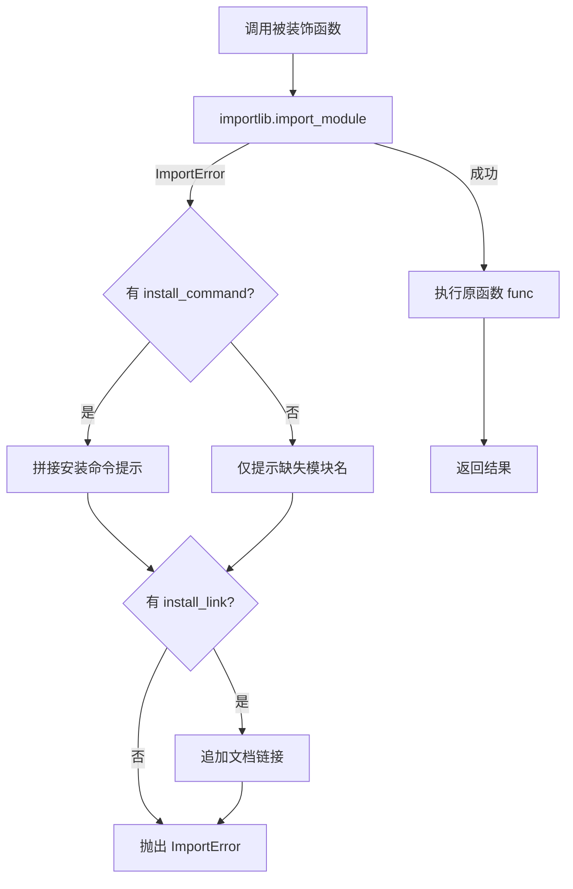
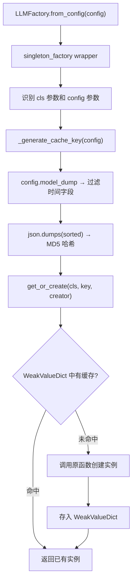

# PD-408.01 MemOS — require_python_package 装饰器与 singleton_factory 懒加载

> 文档编号：PD-408.01
> 来源：MemOS `src/memos/dependency.py`, `src/memos/memos_tools/singleton.py`
> GitHub：https://github.com/MemTensor/MemOS.git
> 问题域：PD-408 依赖管理与懒加载 Dependency Management & Lazy Loading
> 状态：可复用方案

---

## 第 1 章 问题与动机

### 1.1 核心问题

MemOS 是一个记忆操作系统，集成了 LLM、向量数据库（Qdrant/Milvus）、图数据库（Neo4j/Nebula/PolarDB）、Embedder（Sentence Transformer/Ark）、Chunker（chonkie/langchain）、Reranker 等大量异构组件。这些组件各自依赖不同的 Python 包——faiss-cpu、neo4j、torch、redis、rank_bm25、volcenginesdkarkruntime 等。

如果在 `setup.py` 或 `pyproject.toml` 中将所有依赖列为必选，用户安装 MemOS 时会被迫下载数 GB 的包（仅 torch 就超过 2GB），即使他们只需要 OpenAI + Qdrant 这一条路径。

核心矛盾：**框架的组件丰富度 vs 用户的安装轻量化**。

### 1.2 MemOS 的解法概述

MemOS 采用两层防线解决此问题：

1. **`require_python_package` 装饰器**（`src/memos/dependency.py:9`）：运行时拦截，在函数执行前用 `importlib.import_module` 检测依赖是否可用，失败时抛出包含安装命令和文档链接的友好 `ImportError`
2. **`singleton_factory` 装饰器**（`src/memos/memos_tools/singleton.py:115`）：基于配置哈希的 `WeakValueDictionary` 单例缓存，确保 LLM/Embedder/Reranker 等重量级组件不被重复实例化
3. **`check_dependencies.py` CI 脚本**（`scripts/check_dependencies.py:48`）：AST 静态分析，扫描所有 `.py` 文件的顶层 import，发现不可用模块时提示开发者将其移入函数/类作用域并加装饰器
4. **函数体内延迟 import**：真正的 `from xxx import YYY` 放在 `__init__` 或方法体内，而非模块顶层（如 `src/memos/embedders/ark.py:19`）
5. **工厂模式 + 后端映射表**：`LLMFactory.backend_to_class`（`src/memos/llms/factory.py:19`）将字符串映射到类，配合 singleton_factory 实现按需创建 + 单例复用

### 1.3 设计思想

| 设计原则 | 具体实现 | 理由 | 替代方案 |
|----------|----------|------|----------|
| 运行时检测优于安装时强制 | `importlib.import_module` 在函数调用时检查 | 用户只安装实际使用的后端依赖 | extras_require 分组（pip install memos[neo4j]） |
| 装饰器封装横切关注点 | `@require_python_package` 三参数装饰器 | 检测逻辑与业务逻辑分离，20+ 处复用同一装饰器 | 每个类手写 try/except |
| 配置驱动单例 | MD5(config_json) 作为缓存键 | 相同配置复用实例，不同配置各自独立 | 全局变量 / 模块级单例 |
| 弱引用自动回收 | `WeakValueDictionary` 存储实例 | 无外部引用时自动 GC，避免内存泄漏 | 强引用 dict + 手动 clear |
| CI 静态守护 | AST 扫描顶层 import | 防止开发者误将可选依赖放在模块顶层 | 仅靠 code review |

---

## 第 2 章 源码实现分析

### 2.1 架构概览

```
┌─────────────────────────────────────────────────────────┐
│                    MemOS 依赖管理架构                      │
├─────────────────────────────────────────────────────────┤
│                                                         │
│  ┌──────────────────┐    ┌──────────────────────────┐   │
│  │ CI 层            │    │ 运行时层                   │   │
│  │                  │    │                          │   │
│  │ check_deps.py   │    │ require_python_package   │   │
│  │ AST 扫描顶层     │    │ importlib 运行时检测      │   │
│  │ import 违规      │    │ + 友好错误提示            │   │
│  └──────────────────┘    └──────────┬───────────────┘   │
│                                     │                   │
│                          ┌──────────▼───────────────┐   │
│                          │ 函数体内延迟 import        │   │
│                          │ from neo4j import ...     │   │
│                          │ from torch import ...     │   │
│                          └──────────┬───────────────┘   │
│                                     │                   │
│                          ┌──────────▼───────────────┐   │
│                          │ singleton_factory         │   │
│                          │ WeakValueDict + MD5 key  │   │
│                          │ 配置相同 → 复用实例        │   │
│                          └──────────┬───────────────┘   │
│                                     │                   │
│                          ┌──────────▼───────────────┐   │
│                          │ Factory 工厂层             │   │
│                          │ LLMFactory               │   │
│                          │ EmbedderFactory           │   │
│                          │ RerankerFactory           │   │
│                          └──────────────────────────┘   │
└─────────────────────────────────────────────────────────┘
```

### 2.2 核心实现

#### 2.2.1 require_python_package 装饰器



对应源码 `src/memos/dependency.py:9-52`：

```python
def require_python_package(
    import_name: str, install_command: str | None = None, install_link: str | None = None
):
    def decorator(func):
        @functools.wraps(func)
        def wrapper(*args, **kwargs):
            try:
                importlib.import_module(import_name)
            except ImportError:
                error_msg = f"Missing required module - '{import_name}'\n"
                error_msg += f"💡 Install command: {install_command}\n" if install_command else ""
                error_msg += f"💡 Install guide:   {install_link}\n" if install_link else ""
                raise ImportError(error_msg) from None
            return func(*args, **kwargs)
        return wrapper
    return decorator
```

该装饰器在项目中被 **20+ 个类/函数** 使用，覆盖：
- 图数据库：Neo4j（`src/memos/graph_dbs/neo4j.py:78`）、Nebula（`nebular.py:309`）、PolarDB（`polardb.py:103`）
- 向量数据库：Qdrant（`src/memos/vec_dbs/qdrant.py:16`）、Milvus（`milvus.py:16`）
- Embedder：Ark（`src/memos/embedders/ark.py:13`）、SentenceTransformer（`sentence_transformer.py:13`）
- Chunker：Sentence/Character/Markdown（`src/memos/chunkers/sentence_chunker.py:14`）
- 基础设施：Redis（`mem_scheduler/utils/status_tracker.py:15`）、RabbitMQ（`rabbitmq_service.py:23`）
- 深度学习：torch（`src/memos/memories/activation/kv.py:22`）

#### 2.2.2 singleton_factory 装饰器与 FactorySingleton 管理器



对应源码 `src/memos/memos_tools/singleton.py:18-98`：

```python
class FactorySingleton:
    def __init__(self):
        self._instances: dict[str, WeakValueDictionary] = {}

    def _generate_cache_key(self, config: Any, *args, **kwargs) -> str:
        if hasattr(config, "model_dump"):       # Pydantic v2
            config_data = config.model_dump()
        elif hasattr(config, "dict"):           # Pydantic v1
            config_data = config.dict()
        elif isinstance(config, dict):
            config_data = config
        else:
            config_data = str(config)
        filtered_config = self._filter_temporal_fields(config_data)
        cache_str = json.dumps(filtered_config, sort_keys=True, ensure_ascii=False, default=str)
        return hashlib.md5(cache_str.encode("utf-8")).hexdigest()

    def get_or_create(self, factory_class: type, cache_key: str, creator_func: Callable) -> Any:
        class_name = factory_class.__name__
        if class_name not in self._instances:
            self._instances[class_name] = WeakValueDictionary()
        class_cache = self._instances[class_name]
        if cache_key in class_cache:
            return class_cache[cache_key]
        instance = creator_func()
        class_cache[cache_key] = instance
        return instance
```

### 2.3 实现细节

**时间字段过滤**（`singleton.py:51-81`）：缓存键生成时自动排除 `created_at`、`updated_at`、`timestamp` 等 12 个时间相关字段名，避免因时间戳变化导致缓存失效。这是一个精巧的设计——同一个 LLM 配置在不同时间创建不应产生不同实例。

**双模式支持**：`singleton_factory` 同时支持 `@classmethod`（如 `LLMFactory.from_config`，`src/memos/llms/factory.py:32`）和 `@staticmethod`（如 `RerankerFactory.from_config`，`src/memos/reranker/factory.py:25`，需显式传入工厂类名字符串 `"RerankerFactory"`）。

**延迟 import 模式**：装饰器只检测模块是否可导入，真正的 import 放在函数体内。例如 `ArkEmbedder.__init__`（`src/memos/embedders/ark.py:19`）中 `from volcenginesdkarkruntime import Ark` 在装饰器检测通过后才执行。

**CI 守护脚本**（`scripts/check_dependencies.py:12-24`）：用 `ast.parse` 提取每个 `.py` 文件的顶层 `import` 和 `from ... import`，尝试 `importlib.import_module`，失败则报错并建议使用 `@require_python_package`。这确保了开发者不会意外在模块顶层引入可选依赖。

**工厂覆盖范围**：singleton_factory 被 6 个工厂使用：
- `LLMFactory`（`src/memos/llms/factory.py:32`）— 9 种后端
- `EmbedderFactory`（`src/memos/embedders/factory.py:23`）— 4 种后端
- `RerankerFactory`（`src/memos/reranker/factory.py:25`）— 4 种后端
- `MemReaderFactory`（`src/memos/mem_reader/factory.py:26`）
- `ParserFactory`（`src/memos/parsers/factory.py:15`）
- `InternetRetrieverFactory`（`internet_retriever_factory.py:27`）

---

## 第 3 章 迁移指南

### 3.1 迁移清单

**阶段 1：基础设施（1 个文件）**
- [ ] 创建 `dependency.py`，实现 `require_python_package` 装饰器
- [ ] 将可选依赖从 `requirements.txt` 主列表移至 `extras_require` 分组

**阶段 2：改造现有代码（逐模块）**
- [ ] 将可选依赖的顶层 `import` 移入函数/方法体内
- [ ] 在对应函数上添加 `@require_python_package` 装饰器
- [ ] 为每个可选依赖提供 `install_command` 和 `install_link`

**阶段 3：单例工厂（如有重量级组件）**
- [ ] 创建 `singleton.py`，实现 `FactorySingleton` + `singleton_factory` 装饰器
- [ ] 在工厂类的 `from_config` 方法上叠加 `@singleton_factory()`

**阶段 4：CI 守护**
- [ ] 创建 `check_dependencies.py` 脚本，AST 扫描顶层 import 违规
- [ ] 加入 CI pipeline（pre-commit 或 GitHub Actions）

### 3.2 适配代码模板

#### 模板 1：require_python_package 装饰器（可直接复用）

```python
"""dependency.py — 可选依赖运行时检测装饰器"""
import functools
import importlib


def require_python_package(
    import_name: str,
    install_command: str | None = None,
    install_link: str | None = None,
):
    """运行时检测可选依赖，失败时提供友好安装提示。

    用法：
        @require_python_package(
            import_name="faiss",
            install_command="pip install faiss-cpu",
            install_link="https://github.com/facebookresearch/faiss",
        )
        def create_index(self):
            from faiss import IndexFlatL2  # 真正的 import 放在函数体内
            return IndexFlatL2(128)
    """
    def decorator(func):
        @functools.wraps(func)
        def wrapper(*args, **kwargs):
            try:
                importlib.import_module(import_name)
            except ImportError:
                parts = [f"Missing required package: '{import_name}'"]
                if install_command:
                    parts.append(f"  Install: {install_command}")
                if install_link:
                    parts.append(f"  Guide:   {install_link}")
                raise ImportError("\n".join(parts)) from None
            return func(*args, **kwargs)
        return wrapper
    return decorator
```

#### 模板 2：singleton_factory 装饰器（可直接复用）

```python
"""singleton.py — 配置驱动的工厂单例管理器"""
import hashlib
import json
from collections.abc import Callable
from functools import wraps
from typing import Any, TypeVar
from weakref import WeakValueDictionary

T = TypeVar("T")

# 需要从缓存键中排除的时间字段
_TEMPORAL_FIELDS = {
    "created_at", "updated_at", "timestamp", "time", "date",
    "created_time", "updated_time", "last_modified",
}


class FactorySingleton:
    """基于配置哈希的弱引用单例管理器。"""

    def __init__(self):
        self._instances: dict[str, WeakValueDictionary] = {}

    def _make_key(self, config: Any) -> str:
        if hasattr(config, "model_dump"):
            data = config.model_dump()
        elif isinstance(config, dict):
            data = config
        else:
            data = str(config)
        data = self._strip_temporal(data)
        raw = json.dumps(data, sort_keys=True, default=str)
        return hashlib.md5(raw.encode()).hexdigest()

    def _strip_temporal(self, obj: Any) -> Any:
        if isinstance(obj, dict):
            return {k: self._strip_temporal(v) for k, v in obj.items()
                    if k.lower() not in _TEMPORAL_FIELDS}
        if isinstance(obj, list):
            return [self._strip_temporal(i) for i in obj]
        return obj

    def get_or_create(self, ns: str, key: str, creator: Callable) -> Any:
        if ns not in self._instances:
            self._instances[ns] = WeakValueDictionary()
        cache = self._instances[ns]
        if key not in cache:
            cache[key] = creator()
        return cache[key]

    def clear(self, ns: str | None = None):
        if ns:
            self._instances.pop(ns, None)
        else:
            self._instances.clear()


_singleton = FactorySingleton()


def singleton_factory(factory_class: type | str | None = None):
    """工厂单例装饰器，相同配置只创建一次实例。"""
    def decorator(func: Callable[..., T]) -> Callable[..., T]:
        @wraps(func)
        def wrapper(*args, **kwargs) -> T:
            cls = factory_class
            config = None
            if args and hasattr(args[0], "__name__"):
                # @classmethod: args[0] 是 cls
                if cls is None:
                    cls = args[0]
                config = args[1] if len(args) > 1 else None
            elif args:
                config = args[0]
            if config is None:
                return func(*args, **kwargs)
            ns = cls.__name__ if hasattr(cls, "__name__") else str(cls)
            key = _singleton._make_key(config)
            return _singleton.get_or_create(ns, key, lambda: func(*args, **kwargs))
        return wrapper
    return decorator
```

### 3.3 适用场景

| 场景 | 适用度 | 说明 |
|------|--------|------|
| 多后端框架（LLM/DB/Embedder 可选） | ⭐⭐⭐ | 核心场景，避免用户安装全部依赖 |
| CLI 工具（按子命令加载依赖） | ⭐⭐⭐ | 如 `mycli serve` 需要 uvicorn，`mycli train` 需要 torch |
| 插件系统（第三方扩展） | ⭐⭐ | 插件自带依赖，宿主不预装 |
| 单体应用（依赖固定） | ⭐ | 所有依赖都是必选的，装饰器增加无意义开销 |
| 高频调用热路径 | ⭐ | 每次调用都执行 importlib 检测，有微小性能损耗（可缓存优化） |

---

## 第 4 章 测试用例

```python
"""test_dependency.py — require_python_package + singleton_factory 测试"""
import importlib
import pytest
from unittest.mock import patch, MagicMock


# ---- require_python_package 测试 ----

def test_require_package_available():
    """已安装的包应正常执行函数"""
    from dependency import require_python_package

    @require_python_package(import_name="json")
    def do_work():
        return "ok"

    assert do_work() == "ok"


def test_require_package_missing_with_hints():
    """缺失包应抛出 ImportError 并包含安装提示"""
    from dependency import require_python_package

    @require_python_package(
        import_name="nonexistent_pkg_xyz",
        install_command="pip install nonexistent_pkg_xyz",
        install_link="https://example.com/install",
    )
    def do_work():
        return "ok"

    with pytest.raises(ImportError, match="nonexistent_pkg_xyz"):
        do_work()

    with pytest.raises(ImportError, match="pip install"):
        do_work()

    with pytest.raises(ImportError, match="https://example.com"):
        do_work()


def test_require_package_missing_no_hints():
    """缺失包但无安装提示时，仅显示模块名"""
    from dependency import require_python_package

    @require_python_package(import_name="nonexistent_pkg_xyz")
    def do_work():
        return "ok"

    with pytest.raises(ImportError, match="nonexistent_pkg_xyz"):
        do_work()


def test_require_package_preserves_function_metadata():
    """装饰器应保留原函数的 __name__ 和 __doc__"""
    from dependency import require_python_package

    @require_python_package(import_name="json")
    def my_function():
        """My docstring"""
        pass

    assert my_function.__name__ == "my_function"
    assert my_function.__doc__ == "My docstring"


# ---- singleton_factory 测试 ----

def test_singleton_same_config_returns_same_instance():
    """相同配置应返回同一实例"""
    from singleton import singleton_factory

    class MyFactory:
        @classmethod
        @singleton_factory()
        def create(cls, config: dict):
            return object()

    cfg = {"model": "gpt-4", "temperature": 0.7}
    a = MyFactory.create(cfg)
    b = MyFactory.create(cfg)
    assert a is b


def test_singleton_different_config_returns_different_instance():
    """不同配置应返回不同实例"""
    from singleton import singleton_factory

    class MyFactory:
        @classmethod
        @singleton_factory()
        def create(cls, config: dict):
            return object()

    a = MyFactory.create({"model": "gpt-4"})
    b = MyFactory.create({"model": "gpt-3.5"})
    assert a is not b


def test_singleton_ignores_temporal_fields():
    """时间字段不同不应影响缓存命中"""
    from singleton import singleton_factory

    class MyFactory:
        @classmethod
        @singleton_factory()
        def create(cls, config: dict):
            return object()

    a = MyFactory.create({"model": "gpt-4", "created_at": "2024-01-01"})
    b = MyFactory.create({"model": "gpt-4", "created_at": "2025-06-01"})
    assert a is b


def test_singleton_weak_reference_cleanup():
    """无外部引用时实例应被 GC 回收"""
    import gc
    from singleton import singleton_factory, _singleton

    class MyFactory:
        @classmethod
        @singleton_factory()
        def create(cls, config: dict):
            return {"data": "heavy"}  # dict 不支持弱引用，此测试需用自定义类

    # 注意：WeakValueDictionary 要求值支持弱引用
    # 实际使用中 LLM/Embedder 实例都是自定义类，支持弱引用
```

---

## 第 5 章 跨域关联

| 关联域 | 关系类型 | 说明 |
|--------|----------|------|
| PD-04 工具系统 | 协同 | 工具注册时可用 require_python_package 检测工具依赖是否可用，未安装的工具自动跳过注册 |
| PD-03 容错与重试 | 协同 | require_python_package 的 ImportError 是一种"快速失败"容错——在调用链最早期就阻断，避免深层报错 |
| PD-10 中间件管道 | 协同 | singleton_factory 可作为中间件管道中的缓存层，确保管道中多次引用同一组件时不重复创建 |
| PD-11 可观测性 | 扩展 | 可在 singleton_factory 的 get_or_create 中添加缓存命中率指标，追踪组件复用效率 |

---

## 第 6 章 来源文件索引

| 文件 | 行范围 | 关键实现 |
|------|--------|----------|
| `src/memos/dependency.py` | L1-L52 | `require_python_package` 装饰器完整实现 |
| `src/memos/memos_tools/singleton.py` | L18-L98 | `FactorySingleton` 类：WeakValueDict 缓存 + MD5 键生成 + 时间字段过滤 |
| `src/memos/memos_tools/singleton.py` | L115-L174 | `singleton_factory` 装饰器：classmethod/staticmethod 双模式支持 |
| `src/memos/llms/factory.py` | L16-L38 | `LLMFactory`：9 种后端映射 + singleton_factory 单例 |
| `src/memos/embedders/factory.py` | L12-L29 | `EmbedderFactory`：4 种后端映射 + singleton_factory 单例 |
| `src/memos/reranker/factory.py` | L23-L72 | `RerankerFactory`：staticmethod + 字符串工厂名模式 |
| `src/memos/embedders/ark.py` | L10-L36 | `ArkEmbedder`：require_python_package + 函数体内延迟 import 典型用法 |
| `src/memos/graph_dbs/neo4j.py` | L75-L83 | `Neo4jGraphDB`：require_python_package 装饰 `__init__` |
| `src/memos/memories/activation/kv.py` | L22-L26 | `KVCacheMemory`：torch 依赖的运行时检测 |
| `src/memos/chunkers/sentence_chunker.py` | L14-L20 | `SentenceChunker`：chonkie 依赖检测 + 版本兼容 |
| `scripts/check_dependencies.py` | L12-L80 | CI 脚本：AST 扫描顶层 import 违规 |

---

## 第 7 章 横向对比维度

```json comparison_data
{
  "project": "MemOS",
  "dimensions": {
    "检测机制": "require_python_package 装饰器 + importlib 运行时检测",
    "错误提示": "install_command + install_link 双字段友好提示",
    "单例策略": "WeakValueDictionary + MD5(config_json) 配置驱动缓存",
    "CI 守护": "AST 静态扫描顶层 import 违规，强制函数体内延迟导入",
    "覆盖范围": "20+ 类使用装饰器，6 个工厂使用 singleton_factory",
    "时间字段过滤": "缓存键自动排除 12 种时间字段名，避免无效缓存失效"
  }
}
```

### 域元数据补充

```json domain_metadata
{
  "solution_summary": "MemOS 用 require_python_package 装饰器 + importlib 运行时检测 20+ 可选依赖，配合 WeakValueDictionary 单例工厂缓存 6 类重量级组件，CI 层 AST 扫描防止顶层 import 泄漏",
  "description": "CI 静态分析与运行时装饰器双层防线确保可选依赖不污染核心安装",
  "sub_problems": [
    "CI 层防止开发者误将可选依赖放在模块顶层",
    "配置哈希中时间字段导致缓存失效"
  ],
  "best_practices": [
    "AST 扫描顶层 import 作为 CI 门控",
    "WeakValueDictionary 自动回收无引用实例",
    "缓存键生成时过滤时间字段避免无效失效"
  ]
}
```
