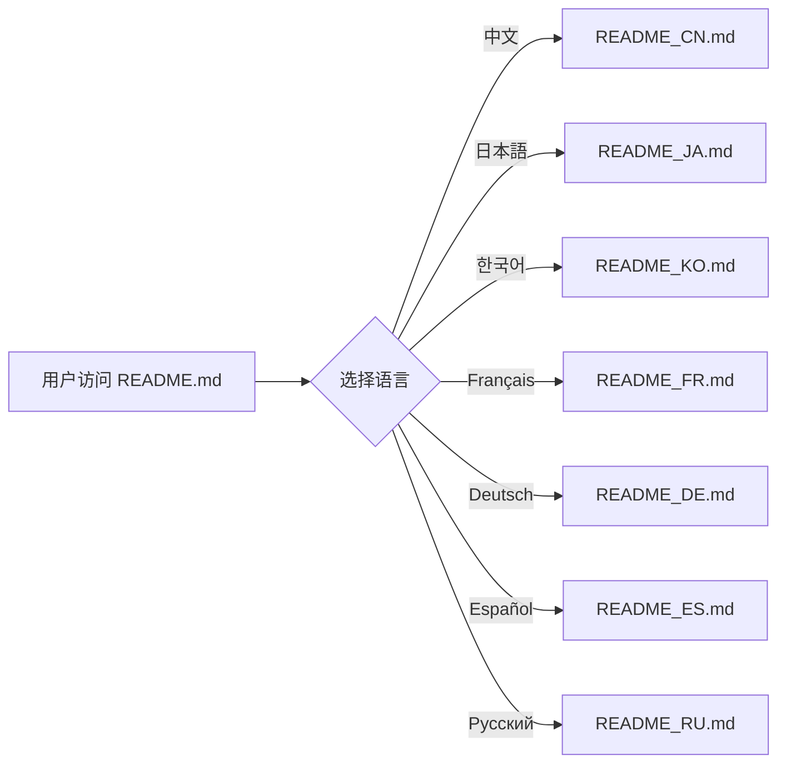
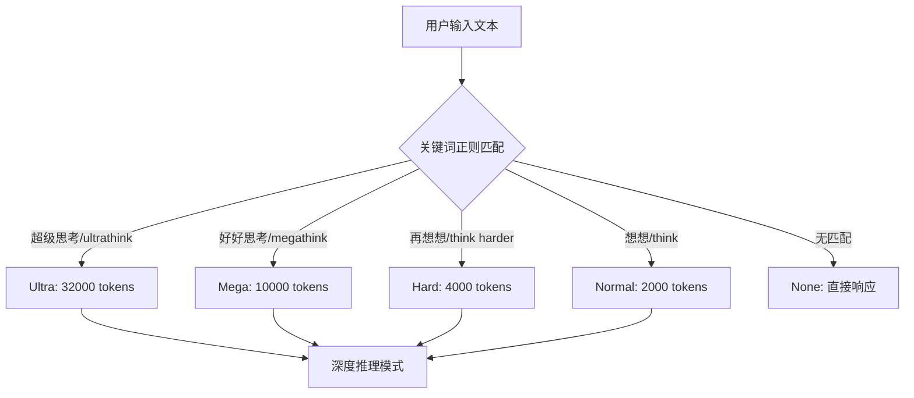

# PD-409.01 iflow-cli — 8 语言 README 与双语文档体系国际化

> 文档编号：PD-409.01
> 来源：iflow-cli `README*.md`, `docs_cn/`, `docs_en/`, `docs_cn/features/thinking.md`
> GitHub：https://github.com/iflow-ai/iflow-cli.git
> 问题域：PD-409 国际化 Internationalization
> 状态：可复用方案

---

## 第 1 章 问题与动机（≥ 30 行）

### 1.1 核心问题

CLI 工具面向全球开发者，需要解决以下国际化挑战：

1. **入口文档多语言覆盖**：README 是用户接触项目的第一入口，需要覆盖主流语言市场
2. **深度文档双语维护**：功能文档、配置文档、术语表等需要中英文完整对照
3. **功能层面的语言适配**：思考触发词（thinking trigger words）需要同时支持中英文自然语言
4. **运行时语言切换**：用户需要在使用过程中动态切换界面语言
5. **文档结构一致性**：多语言文档之间的目录结构、章节编号、内容覆盖度必须保持同步

### 1.2 iflow-cli 的解法概述

iflow-cli 采用**三层国际化架构**：

1. **README 层（8 语言）**：根目录 8 个独立 README 文件（EN/CN/JA/KO/FR/DE/ES/RU），通过语言切换导航栏互相链接（`README.md:7`）
2. **文档层（双语镜像）**：`docs_cn/` 和 `docs_en/` 两个完全镜像的文档目录，每个功能文档都有中英文对照版本（如 `docs_cn/features/thinking.md` 与 `docs_en/features/thinking.md`）
3. **功能层（双语触发词）**：思考能力系统内置中英文两套触发词正则匹配，5 级推理强度每级都有中英文关键词（`docs_cn/features/thinking.md:50-86`）
4. **运行时层**：通过 `LANGUAGE` 环境变量和 `/language` 斜杠命令实现界面语言动态切换（`docs_en/features/thinking.md:144`）

### 1.3 设计思想

| 设计原则 | 具体实现 | 理由 | 替代方案 |
|----------|----------|------|----------|
| 文件级隔离 | 每种语言独立 README 文件 | 避免单文件膨胀，Git diff 友好 | 单文件多语言折叠（GitHub 不支持） |
| 目录级镜像 | docs_cn/ 与 docs_en/ 完全对称 | 结构清晰，翻译遗漏一目了然 | i18n JSON 资源文件（不适合长文档） |
| 功能内嵌双语 | 思考触发词中英文并列定义 | 用户无需配置即可用母语触发 | 仅支持英文触发词（排斥非英语用户） |
| 环境变量控制 | LANGUAGE 环境变量 + /language 命令 | 兼容 CI/CD 和交互式两种场景 | 仅配置文件控制（不够灵活） |
| 导航栏互链 | 每个 README 顶部 8 语言切换栏 | 用户可一键切换到熟悉语言 | 仅在主 README 列出链接 |

---

## 第 2 章 源码实现分析（≥ 60 行，核心章节）

### 2.1 架构概览

```
iflow-cli/
├── README.md          ← 英文主入口
├── README_CN.md       ← 中文
├── README_JA.md       ← 日本語
├── README_KO.md       ← 한국어
├── README_FR.md       ← Français
├── README_DE.md       ← Deutsch
├── README_ES.md       ← Español
├── README_RU.md       ← Русский
├── docs_cn/           ← 中文深度文档（镜像结构）
│   ├── features/
│   │   ├── thinking.md
│   │   ├── slash-commands.md
│   │   ├── interactive.md
│   │   ├── output-style.md
│   │   └── ...
│   ├── configuration/
│   │   ├── settings.md
│   │   └── ...
│   ├── glossary.md
│   └── quickstart.md
├── docs_en/           ← 英文深度文档（镜像结构）
│   ├── features/
│   │   ├── thinking.md
│   │   ├── slash-commands.md
│   │   ├── interactive.md
│   │   ├── output-style.md
│   │   └── ...
│   ├── configuration/
│   │   ├── settings.md
│   │   └── ...
│   ├── glossary.md
│   └── quickstart.md
└── IFLOW.md           ← 项目上下文（英文）
```

### 2.2 核心实现

#### 2.2.1 README 多语言导航栏



对应源码 `README.md:7`：
```markdown
**English** | [中文](README_CN.md) | [日本語](README_JA.md) | [한국어](README_KO.md) | [Français](README_FR.md) | [Deutsch](README_DE.md) | [Español](README_ES.md) | [Русский](README_RU.md)
```

每个翻译版本的导航栏中，当前语言用粗体标记，其余为链接。例如 `README_CN.md:7`：
```markdown
[English](README.md) | **中文** | [日本語](README_JA.md) | [한국어](README_KO.md) | [Français](README_FR.md) | [Deutsch](README_DE.md) | [Español](README_ES.md) | [Русский](README_RU.md)
```

#### 2.2.2 双语思考触发词系统



对应源码 `docs_cn/features/thinking.md:50-86`：
```markdown
#### 中文触发词

**超级思考（Ultra）**：
- 超级思考、极限思考、深度思考
- 全力思考、超强思考
- 认真仔细思考

**强力思考（Mega）**：
- 强力思考、大力思考、用力思考
- 努力思考、好好思考、仔细思考

**中级思考（Hard）**：
- 再想想、多想想
- 想清楚、想明白、考虑清楚

**基础思考（Normal）**：
- 想想、思考、考虑

#### 英文触发词

**超级思考（Ultra）**：
- `ultrathink`
- `think really super hard`
- `think intensely`

**强力思考（Mega）**：
- `megathink`
- `think really hard`
- `think a lot`
```

#### 2.2.3 运行时语言切换机制

```mermaid
graph TD
    A[语言切换入口] --> B{切换方式}
    B -->|环境变量| C[export LANGUAGE=en]
    B -->|斜杠命令| D[/language]
    C --> E[CLI 启动时读取]
    D --> F[运行时即时切换]
    E --> G[界面语言确定]
    F --> G
    G --> H[思考中/Thinking]
    G --> I[展开/expand]
    G --> J[折叠/collapse]
```

对应源码 `docs_en/features/thinking.md:136-144`：
```markdown
## Internationalization Support

Thinking capability fully supports Chinese and English interface display:

- **Chinese Interface**: Displays "思考中", "展开", "折叠" and other Chinese prompts
- **English Interface**: Displays "Thinking", "expand", "collapse" and other English prompts
- **Auto Switch**: Automatically displays corresponding language interface based on system language settings

You can switch interface language by setting the `LANGUAGE` environment variable or using the `/language` command.
```

### 2.3 实现细节

#### 文档镜像一致性

docs_cn/ 和 docs_en/ 的目录结构完全对称，每个文件都有对应的翻译版本：

| docs_cn/ | docs_en/ | 内容 |
|----------|----------|------|
| `features/thinking.md` | `features/thinking.md` | 思考能力 |
| `features/slash-commands.md` | `features/slash-commands.md` | 斜杠命令 |
| `features/interactive.md` | `features/interactive.md` | 交互模式 |
| `features/output-style.md` | `features/output-style.md` | 输出样式 |
| `configuration/settings.md` | `configuration/settings.md` | CLI 配置 |
| `glossary.md` | `glossary.md` | 术语词汇表 |
| `quickstart.md` | `quickstart.md` | 快速开始 |

每个文档使用 Docusaurus 风格的 frontmatter（`sidebar_position`, `hide_title`），表明文档系统支持静态站点生成。

#### 术语表双语对照

术语表（`glossary.md`）在中英文版本中保持相同的表格结构，但内容完全本地化。例如中文版 `docs_cn/glossary.md:34` 使用"自然语言指令"和"直接用中文与AI对话"，英文版 `docs_en/glossary.md:34` 使用"Natural Language Instructions"和"Instructions for direct conversation with AI in natural language"。

#### 配置文档的完整翻译

`docs_cn/configuration/settings.md` 和 `docs_en/configuration/settings.md` 都是 640+ 行的完整配置文档，覆盖了环境变量、settings.json、命令行参数、上下文文件等所有配置项。两个版本的代码示例保持一致（如 JSON 配置片段），仅描述文字做了翻译。

#### README 内容本地化策略

8 个 README 不是简单的机器翻译，而是针对目标市场做了适配：
- 中文版（`README_CN.md:85-93`）包含中国大陆特有的 nvm 镜像安装指南
- 英文版（`README.md:85-93`）同样包含中国大陆安装指南但用英文描述
- 日文版（`README_JA.md:84-92`）保留了中国大陆安装说明的日文翻译
- 所有版本的功能对比表保持一致的 emoji 和 ✅/❌ 标记

---

## 第 3 章 迁移指南（≥ 40 行）

### 3.1 迁移清单

#### 阶段 1：README 多语言化（1-2 天）

- [ ] 确定目标语言列表（建议至少 EN + CN + 1-2 个高优先级语言）
- [ ] 创建 `README_{LANG}.md` 文件，从主 README 翻译
- [ ] 在每个 README 顶部添加语言切换导航栏
- [ ] 当前语言用粗体，其余用 Markdown 链接
- [ ] 验证所有语言间的交叉链接正确

#### 阶段 2：文档目录镜像（2-3 天）

- [ ] 创建 `docs_{lang}/` 镜像目录结构
- [ ] 逐文件翻译，保持 frontmatter 一致
- [ ] 代码示例保持原样，仅翻译描述文字
- [ ] 术语表双语对照，确保术语一致性

#### 阶段 3：功能层双语支持（1-2 天）

- [ ] 识别需要本地化的功能触发词（如思考关键词、命令提示）
- [ ] 为每个触发词定义多语言正则匹配规则
- [ ] 实现 `LANGUAGE` 环境变量读取
- [ ] 实现 `/language` 运行时切换命令
- [ ] UI 提示文本（如"思考中"/"Thinking"）根据语言设置动态切换

### 3.2 适配代码模板

#### README 语言导航栏生成器

```python
"""README 多语言导航栏生成器"""
from dataclasses import dataclass
from pathlib import Path

@dataclass
class LangConfig:
    code: str        # 语言代码
    name: str        # 显示名称
    filename: str    # 文件名

LANGUAGES = [
    LangConfig("en", "English", "README.md"),
    LangConfig("cn", "中文", "README_CN.md"),
    LangConfig("ja", "日本語", "README_JA.md"),
    LangConfig("ko", "한국어", "README_KO.md"),
    LangConfig("fr", "Français", "README_FR.md"),
    LangConfig("de", "Deutsch", "README_DE.md"),
    LangConfig("es", "Español", "README_ES.md"),
    LangConfig("ru", "Русский", "README_RU.md"),
]

def generate_nav_bar(current_lang: str) -> str:
    """生成语言切换导航栏，当前语言粗体，其余为链接"""
    parts = []
    for lang in LANGUAGES:
        if lang.code == current_lang:
            parts.append(f"**{lang.name}**")
        else:
            parts.append(f"[{lang.name}]({lang.filename})")
    return " | ".join(parts)

def inject_nav_bar(readme_path: Path, lang_code: str) -> None:
    """在 README 文件顶部注入导航栏"""
    content = readme_path.read_text(encoding="utf-8")
    nav = generate_nav_bar(lang_code)
    # 替换已有导航栏或在标题后插入
    lines = content.split("\n")
    for i, line in enumerate(lines):
        if line.startswith("**") and "|" in line and "README" in line:
            lines[i] = nav
            break
        if line.startswith("[") and "|" in line and "README" in line:
            lines[i] = nav
            break
    readme_path.write_text("\n".join(lines), encoding="utf-8")

# 使用示例
if __name__ == "__main__":
    for lang in LANGUAGES:
        path = Path(lang.filename)
        if path.exists():
            inject_nav_bar(path, lang.code)
            print(f"Updated nav bar in {lang.filename}")
```

#### 双语触发词匹配器

```python
"""双语关键词触发匹配器 — 参考 iflow-cli 思考触发词系统"""
import re
from enum import IntEnum
from typing import Optional

class ThinkingLevel(IntEnum):
    NONE = 0
    NORMAL = 1    # 2000 tokens
    HARD = 2      # 4000 tokens
    MEGA = 3      # 10000 tokens
    ULTRA = 4     # 32000 tokens

TOKEN_BUDGETS = {
    ThinkingLevel.NONE: 0,
    ThinkingLevel.NORMAL: 2_000,
    ThinkingLevel.HARD: 4_000,
    ThinkingLevel.MEGA: 10_000,
    ThinkingLevel.ULTRA: 32_000,
}

# 中英文双语触发词（按优先级从高到低排列）
TRIGGER_PATTERNS: list[tuple[ThinkingLevel, re.Pattern]] = [
    (ThinkingLevel.ULTRA, re.compile(
        r"超级思考|极限思考|深度思考|全力思考|超强思考|认真仔细思考"
        r"|ultrathink|think really super hard|think intensely",
        re.IGNORECASE
    )),
    (ThinkingLevel.MEGA, re.compile(
        r"强力思考|大力思考|用力思考|努力思考|好好思考|仔细思考"
        r"|megathink|think really hard|think a lot",
        re.IGNORECASE
    )),
    (ThinkingLevel.HARD, re.compile(
        r"再想想|多想想|想清楚|想明白|考虑清楚"
        r"|think about it|think more|think harder",
        re.IGNORECASE
    )),
    (ThinkingLevel.NORMAL, re.compile(
        r"想想|思考|考虑|think",
        re.IGNORECASE
    )),
]

def detect_thinking_level(user_input: str) -> tuple[ThinkingLevel, int]:
    """检测用户输入中的思考触发词，返回推理等级和 token 预算"""
    for level, pattern in TRIGGER_PATTERNS:
        if pattern.search(user_input):
            return level, TOKEN_BUDGETS[level]
    return ThinkingLevel.NONE, 0
```

### 3.3 适用场景

| 场景 | 适用度 | 说明 |
|------|--------|------|
| CLI 工具国际化 | ⭐⭐⭐ | 完全匹配：文件级隔离 + 环境变量控制 |
| 开源项目 README 多语言 | ⭐⭐⭐ | 8 语言导航栏模式可直接复用 |
| 文档站点双语化 | ⭐⭐⭐ | docs_cn/docs_en 镜像结构 + Docusaurus frontmatter |
| NLP 功能多语言触发 | ⭐⭐⭐ | 双语正则触发词系统可直接移植 |
| Web 应用 i18n | ⭐⭐ | 适合文档层，但 UI 层建议用 i18next 等框架 |
| 移动端 App 本地化 | ⭐ | 文件级隔离不适合，建议用平台原生 i18n |

---

## 第 4 章 测试用例（≥ 20 行）

```python
import pytest
from pathlib import Path

class TestReadmeNavigation:
    """测试 README 多语言导航栏"""

    LANGUAGES = ["en", "cn", "ja", "ko", "fr", "de", "es", "ru"]
    README_FILES = {
        "en": "README.md", "cn": "README_CN.md", "ja": "README_JA.md",
        "ko": "README_KO.md", "fr": "README_FR.md", "de": "README_DE.md",
        "es": "README_ES.md", "ru": "README_RU.md",
    }

    def test_all_readme_files_exist(self, repo_root: Path):
        """所有 8 个 README 文件都存在"""
        for lang, filename in self.README_FILES.items():
            assert (repo_root / filename).exists(), f"Missing {filename}"

    def test_nav_bar_present_in_all_readmes(self, repo_root: Path):
        """每个 README 都包含语言切换导航栏"""
        for lang, filename in self.README_FILES.items():
            content = (repo_root / filename).read_text(encoding="utf-8")
            # 导航栏应包含所有其他语言的链接
            for other_lang, other_file in self.README_FILES.items():
                if other_lang != lang:
                    assert other_file in content, \
                        f"{filename} missing link to {other_file}"

    def test_current_lang_is_bold(self, repo_root: Path):
        """当前语言在导航栏中用粗体标记"""
        lang_names = {"en": "English", "cn": "中文", "ja": "日本語",
                      "ko": "한국어", "fr": "Français", "de": "Deutsch",
                      "es": "Español", "ru": "Русский"}
        for lang, filename in self.README_FILES.items():
            content = (repo_root / filename).read_text(encoding="utf-8")
            bold_marker = f"**{lang_names[lang]}**"
            assert bold_marker in content, \
                f"{filename} should bold {lang_names[lang]}"


class TestDocsMirrorStructure:
    """测试 docs_cn 和 docs_en 的镜像一致性"""

    def test_directory_structure_matches(self, repo_root: Path):
        """中英文文档目录结构完全对称"""
        cn_files = {p.relative_to(repo_root / "docs_cn")
                    for p in (repo_root / "docs_cn").rglob("*.md")}
        en_files = {p.relative_to(repo_root / "docs_en")
                    for p in (repo_root / "docs_en").rglob("*.md")}
        assert cn_files == en_files, \
            f"Mismatch: cn_only={cn_files - en_files}, en_only={en_files - cn_files}"

    def test_frontmatter_sidebar_position_matches(self, repo_root: Path):
        """中英文文档的 sidebar_position 保持一致"""
        import yaml
        for cn_path in (repo_root / "docs_cn").rglob("*.md"):
            en_path = repo_root / "docs_en" / cn_path.relative_to(repo_root / "docs_cn")
            cn_fm = extract_frontmatter(cn_path)
            en_fm = extract_frontmatter(en_path)
            if cn_fm and en_fm:
                assert cn_fm.get("sidebar_position") == en_fm.get("sidebar_position")


class TestThinkingTriggerWords:
    """测试双语思考触发词"""

    @pytest.mark.parametrize("input_text,expected_level", [
        ("请超级思考这个问题", "ULTRA"),
        ("ultrathink this design", "ULTRA"),
        ("好好思考一下", "MEGA"),
        ("think really hard about this", "MEGA"),
        ("再想想", "HARD"),
        ("think harder", "HARD"),
        ("想想看", "NORMAL"),
        ("let me think", "NORMAL"),
        ("hello world", "NONE"),
    ])
    def test_bilingual_trigger_detection(self, input_text, expected_level):
        """中英文触发词都能正确匹配到对应推理等级"""
        level, budget = detect_thinking_level(input_text)
        assert level.name == expected_level

    def test_token_budgets_increase_with_level(self):
        """token 预算随推理等级递增"""
        budgets = [TOKEN_BUDGETS[level] for level in ThinkingLevel]
        for i in range(1, len(budgets)):
            assert budgets[i] > budgets[i-1]
```

---

## 第 5 章 跨域关联

| 关联域 | 关系类型 | 说明 |
|--------|----------|------|
| PD-01 上下文管理 | 协同 | IFLOW.md 上下文文件支持多语言加载，`contextFileName` 可配置为不同语言的上下文文件 |
| PD-04 工具系统 | 协同 | `/language` 斜杠命令是工具系统的一部分，思考触发词匹配是工具调用前的预处理 |
| PD-09 Human-in-the-Loop | 协同 | 界面提示语（"思考中"/"Thinking"、"展开"/"expand"）的多语言化直接影响人机交互体验 |
| PD-10 中间件管道 | 依赖 | 思考触发词检测可作为输入预处理中间件，在消息进入 LLM 前完成语言检测和推理等级设定 |

---

## 第 6 章 来源文件索引

| 文件 | 行范围 | 关键实现 |
|------|--------|----------|
| `README.md` | L1-L246 | 英文主入口，8 语言导航栏 |
| `README_CN.md` | L1-L240 | 中文版 README，含中国大陆安装指南 |
| `README_JA.md` | L1-L239 | 日文版 README，完整功能翻译 |
| `README_KO.md` | L1-L30+ | 韩文版 README |
| `README_FR.md` | L1-L30+ | 法文版 README |
| `README_DE.md` | L1-L30+ | 德文版 README |
| `README_ES.md` | L1-L30+ | 西班牙文版 README |
| `README_RU.md` | L1-L30+ | 俄文版 README |
| `docs_cn/features/thinking.md` | L50-L86 | 中文思考触发词定义（4 级 × 中英文） |
| `docs_en/features/thinking.md` | L50-L86 | 英文思考触发词定义 |
| `docs_en/features/thinking.md` | L136-L144 | 国际化支持说明：LANGUAGE 环境变量 + /language 命令 |
| `docs_cn/features/slash-commands.md` | L1-L206 | 中文斜杠命令文档 |
| `docs_en/features/slash-commands.md` | L1-L206 | 英文斜杠命令文档 |
| `docs_cn/configuration/settings.md` | L1-L643 | 中文配置文档（完整翻译） |
| `docs_en/configuration/settings.md` | L1-L645 | 英文配置文档 |
| `docs_cn/glossary.md` | L1-L180 | 中文术语词汇表 |
| `docs_en/glossary.md` | L1-L180 | 英文术语词汇表 |
| `IFLOW.md` | L80 | 项目上下文提及 i18 目录结构 |

---

## 第 7 章 横向对比维度

```json comparison_data
{
  "project": "iflow-cli",
  "dimensions": {
    "语言覆盖": "8 语言 README（EN/CN/JA/KO/FR/DE/ES/RU）+ 双语深度文档",
    "资源组织": "文件级隔离：独立 README 文件 + docs_cn/docs_en 镜像目录",
    "运行时切换": "LANGUAGE 环境变量 + /language 斜杠命令双入口",
    "触发词本地化": "思考系统 5 级推理强度 × 中英文双语正则触发词",
    "文档同步机制": "Docusaurus frontmatter 对齐 + 目录结构完全镜像"
  }
}
```

### 域元数据补充

```json domain_metadata
{
  "solution_summary": "iflow-cli 用 8 语言独立 README + docs_cn/docs_en 镜像目录 + 中英文思考触发词正则 + LANGUAGE 环境变量实现三层国际化架构",
  "description": "CLI 工具的文档级与功能级多语言协同设计",
  "sub_problems": [
    "README 多语言导航栏一致性维护",
    "深度文档镜像目录结构同步检测",
    "NLP 功能触发词的多语言正则匹配"
  ],
  "best_practices": [
    "每个 README 顶部嵌入全语言切换导航栏并粗体标记当前语言",
    "功能触发词按推理强度分级定义中英文并列正则",
    "配置文档代码示例保持原样仅翻译描述文字"
  ]
}
```
