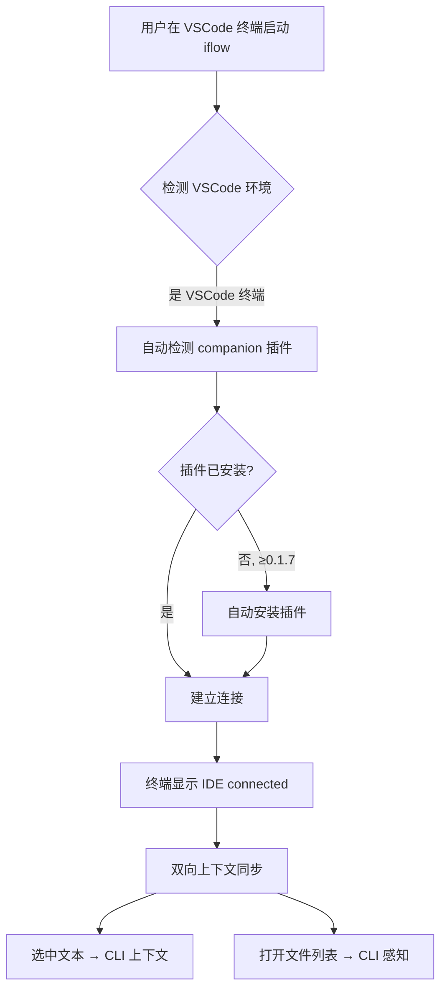
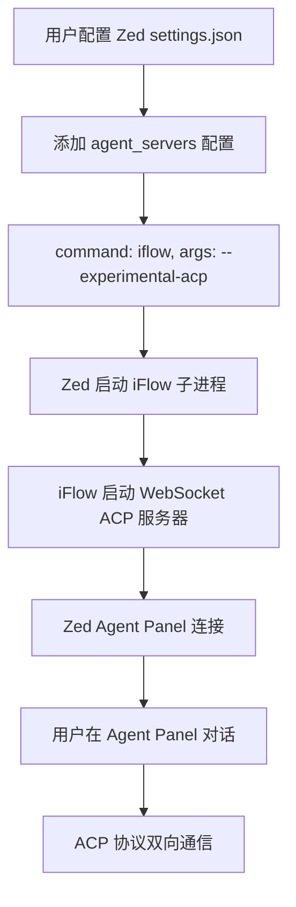

# PD-410.01 iflow-cli — 三协议 IDE 双向集成

> 文档编号：PD-410.01
> 来源：iflow-cli `docs_en/features/ide.md` `docs_en/features/slash-commands.md` `docs_en/sdk/sdk-python.md`
> GitHub：https://github.com/iflow-ai/iflow-cli.git
> 问题域：PD-410 IDE 集成 IDE Integration
> 状态：可复用方案

---

## 第 1 章 问题与动机（≥ 30 行）

### 1.1 核心问题

终端 AI 助手与 IDE 之间存在天然的信息鸿沟：终端只能看到命令行输出，无法感知开发者在编辑器中正在编辑的文件、选中的代码片段、打开的标签页。这导致终端 AI 给出的建议缺乏编辑器上下文，开发者需要反复复制粘贴代码片段来提供上下文。

更深层的问题是：不同 IDE 使用完全不同的扩展协议（VSCode 用 Extension API，JetBrains 用 IntelliJ Plugin SDK，Zed 用 ACP 协议），一个终端 AI 工具要同时支持多个 IDE 家族，需要设计统一的抽象层来屏蔽协议差异。

### 1.2 iflow-cli 的解法概述

iflow-cli 采用"终端为主、IDE 为辅"的架构，通过三种不同的集成协议覆盖三大 IDE 家族：

1. **VSCode Companion 插件**：通过 `iflow-cli-vscode-ide-companion` 扩展实现，发布在 VSCode Marketplace 和 Open VSX Registry，支持自动检测终端中的 iFlow 进程并建立连接（`docs_en/features/ide.md:15-17`）
2. **JetBrains 插件**：通过 `iflow-idea` zip 包分发，支持 IntelliJ 2024.1+ 全家族 IDE（`docs_en/features/ide.md:19-20`）
3. **Zed ACP 协议**：通过 `--experimental-acp` 参数启动 WebSocket 服务器，Zed 通过 `agent_servers` 配置直接连接（`docs_en/features/ide.md:84-89`）
4. **统一 /ide 命令**：CLI 侧提供 `/ide`、`/ide-status`、`/ide-tool` 三个斜杠命令管理所有 IDE 连接（`docs_en/features/slash-commands.md:73-75`）
5. **自动检测连接**：在 VSCode 终端中启动 iFlow 时自动检测并连接，≥0.1.7 版本还能自动安装插件（`docs_en/features/ide.md:53`）

### 1.3 设计思想

| 设计原则 | 具体实现 | 理由 | 替代方案 |
|----------|----------|------|----------|
| 终端优先 | CLI 是主进程，IDE 插件是 companion | 终端是 AI 编码的主战场，IDE 提供辅助上下文 | IDE 插件为主（如 Cursor），但限制了终端灵活性 |
| 协议适配 | VSCode/JetBrains 用原生插件，Zed 用 ACP | 每个 IDE 生态有最佳实践，不强行统一 | 全部走 MCP/ACP 统一协议，但 VSCode/JetBrains 生态不支持 |
| 零配置连接 | VSCode 终端自动检测 iFlow 进程 | 降低使用门槛，开箱即用 | 手动配置端口和地址 |
| 双向上下文 | 编辑器选中文本 → CLI 上下文；CLI 可感知打开文件 | 消除终端与编辑器的信息鸿沟 | 单向：只从 IDE 发送到终端 |
| 渐进式集成 | 从 v0.1.7 VSCode → v0.2.0 JetBrains → v0.2.23 Zed ACP | 按用户量优先级逐步覆盖 | 一次性支持所有 IDE |

---

## 第 2 章 源码实现分析（≥ 60 行，核心章节）

### 2.1 架构概览

iflow-cli 的 IDE 集成采用"Hub-Spoke"架构，CLI 进程作为 Hub，各 IDE 插件作为 Spoke 连接：

```
┌─────────────────────────────────────────────────────────┐
│                    iFlow CLI (Hub)                       │
│                                                         │
│  ┌──────────┐  ┌──────────┐  ┌───────────────────────┐ │
│  │ /ide cmd │  │/ide-status│  │ /ide-tool             │ │
│  └────┬─────┘  └────┬─────┘  └────┬──────────────────┘ │
│       │              │              │                    │
│  ┌────▼──────────────▼──────────────▼──────────────────┐│
│  │           IDE Connection Manager                     ││
│  │  ┌─────────┐ ┌──────────┐ ┌───────────────────┐    ││
│  │  │ VSCode  │ │JetBrains │ │  Zed (ACP/WS)     │    ││
│  │  │Companion│ │  Plugin   │ │  --experimental   │    ││
│  │  │ Bridge  │ │  Bridge   │ │  -acp             │    ││
│  │  └────┬────┘ └────┬─────┘ └────┬──────────────┘    ││
│  └───────┼───────────┼────────────┼────────────────────┘│
└──────────┼───────────┼────────────┼─────────────────────┘
           │           │            │
    ┌──────▼──────┐ ┌──▼────────┐ ┌▼──────────────────┐
    │ VSCode IDE  │ │ IntelliJ  │ │   Zed Editor      │
    │ Extension   │ │  Plugin   │ │   Agent Panel      │
    │ API         │ │  SDK      │ │   (ACP Protocol)   │
    └─────────────┘ └───────────┘ └────────────────────┘
```

### 2.2 核心实现

#### 2.2.1 VSCode Companion 插件集成



VSCode 集成通过 `iflow-cli-vscode-ide-companion` 扩展实现，发布在两个市场以覆盖 VSCode 及类 VSCode 编辑器（`docs_en/features/ide.md:15-16`）：

```
VSCode Marketplace: iflow-cli.iflow-cli-vscode-ide-companion
Open VSX Registry: iflow-cli/iflow-cli-vscode-ide-companion
最低版本要求: VSCode 1.101.0
```

自动检测机制（`docs_en/features/ide.md:53`）：
> When you start iFlow in VSCode's terminal, it will automatically detect and install the extension.
> This feature requires iflow-cli-vscode-ide-companion-0.1.7 or higher.

连接建立后提供四大能力：
- **Quick Launch**: IDE 中的 iFlow 按钮一键启动终端会话（`docs_en/features/ide.md:26`）
- **Context Selection**: 编辑器选中文本自动注入 CLI 上下文（`docs_en/features/ide.md:30`）
- **File Awareness**: CLI 感知编辑器中打开的文件列表（`docs_en/features/ide.md:34`）
- **Connection Awareness**: 自动检测 + 状态显示 "IDE connected"（`docs_en/features/ide.md:39`）

#### 2.2.2 Zed ACP 协议集成



Zed 集成通过 Agent Communication Protocol (ACP) 实现，这是一个基于 WebSocket 的协议（`docs_en/features/ide.md:84-89`）：

```json
// Zed settings.json 配置
"agent_servers": {
    "iFlow CLI": {
      "command": "iflow",
      "args": ["--experimental-acp"]
    }
}
```

ACP 协议的 WebSocket 端点格式为 `ws://localhost:{port}/acp?peer=iflow`（`docs_en/sdk/sdk-android.md:452`），支持以下消息类型：
- `AssistantMessage` — AI 文本响应，含 `chunk.text` 和 `agent_info`
- `ToolCallMessage` — 工具调用请求与状态
- `PlanMessage` — 结构化任务计划
- `TaskFinishMessage` — 任务完成信号，含 `stop_reason`

#### 2.2.3 /ide 命令族

CLI 侧通过三个斜杠命令统一管理所有 IDE 连接（`docs_en/features/slash-commands.md:73-75`）：

| 命令 | 功能 | 说明 |
|------|------|------|
| `/ide` | IDE 集成 | 发现和连接到可用的 IDE 服务器 |
| `/ide-status` | IDE 状态 | 查询当前 IDE 连接状态 |
| `/ide-tool` | IDE 工具 | 访问特定的 IDE 集成工具 |

断开连接通过 `/ide` 命令选择 "Disconnect from IDE"（`docs_en/features/ide.md:44`）。

### 2.3 实现细节

#### ACP 协议与 SDK 体系

iflow-cli 围绕 ACP 协议构建了完整的 SDK 生态（`docs_en/sdk/sdk-python.md:14`）：

```
ACP 协议层
├── Python SDK (iflow-cli-sdk)     — pip install iflow-cli-sdk
│   ├── IFlowClient                — WebSocket 连接管理
│   ├── IFlowOptions               — 配置（url, auto_start_process, timeout）
│   ├── query() / query_stream()   — 简单查询 / 流式查询
│   └── query_sync()               — 同步调用
├── Android SDK (com.iflow.sdk)    — OkHttp WebSocket
│   ├── IFlowClient.kt            — 主客户端
│   ├── IFlowQuery                 — 查询工具类
│   ├── PermissionMode             — AUTO/MANUAL/SELECTIVE
│   └── protocol/                  — ACP 协议实现
└── Zed 集成                       — agent_servers 配置
    └── --experimental-acp         — 启动 ACP 服务器
```

Python SDK 自动管理 iFlow 进程（`docs_en/sdk/sdk-python.md:36-57`）：

```python
# SDK 自动处理:
# 1. 检测 iFlow 是否安装
# 2. 启动 iFlow 进程（如未运行）
# 3. 查找可用端口并建立连接
# 4. 退出时自动清理资源
async with IFlowClient() as client:
    await client.send_message("Hello, iFlow!")
    async for message in client.receive_messages():
        if isinstance(message, AssistantMessage):
            print(message.chunk.text, end="\n", flush=True)
        elif isinstance(message, TaskFinishMessage):
            break
```

#### 配置层级与 IDE 偏好

IDE 集成与 iflow-cli 的分层配置系统协同工作（`docs_en/configuration/settings.md:368-371`）：

```json
{
  "preferredEditor": "vscode"
}
```

配置优先级（`docs_en/configuration/settings.md:112-121`）：
1. 命令行参数（最高）
2. IFLOW_ 前缀环境变量
3. 系统配置文件 `/etc/iflow-cli/settings.json`
4. 工作区配置 `.iflow/settings.json`
5. 用户配置 `~/.iflow/settings.json`
6. 默认值（最低）


---

## 第 3 章 迁移指南（≥ 40 行）

### 3.1 迁移清单

将 iflow-cli 的 IDE 集成方案迁移到自己的终端 AI 工具，分三个阶段：

**阶段 1：单 IDE 支持（VSCode）**
- [ ] 开发 VSCode Companion 扩展，实现 Extension API 与终端进程通信
- [ ] 实现终端环境检测（判断是否在 VSCode 终端中运行）
- [ ] 实现选中文本上下文注入
- [ ] 实现打开文件列表感知
- [ ] 发布到 VSCode Marketplace 和 Open VSX

**阶段 2：多 IDE 扩展（JetBrains）**
- [ ] 开发 IntelliJ Plugin，实现 Plugin SDK 与终端进程通信
- [ ] 统一 CLI 侧的 IDE 连接管理接口
- [ ] 实现 `/ide` 命令族（connect/status/disconnect）

**阶段 3：开放协议（ACP/WebSocket）**
- [ ] 实现 ACP WebSocket 服务器（`--experimental-acp` 模式）
- [ ] 定义消息协议（AssistantMessage, ToolCallMessage, PlanMessage, TaskFinishMessage）
- [ ] 开发 Python/Android SDK
- [ ] 支持 Zed 等 ACP 兼容编辑器

### 3.2 适配代码模板

#### ACP WebSocket 服务器骨架（TypeScript/Node.js）

```typescript
import { WebSocketServer, WebSocket } from 'ws';

interface ACPMessage {
  type: 'assistant' | 'tool_call' | 'plan' | 'task_finish';
  payload: Record<string, unknown>;
}

interface IDEContext {
  selectedText?: string;
  openFiles: string[];
  activeFile?: string;
  cursorPosition?: { line: number; column: number };
}

class ACPServer {
  private wss: WebSocketServer;
  private connections: Map<string, WebSocket> = new Map();

  constructor(port: number = 8090) {
    this.wss = new WebSocketServer({ port, path: '/acp' });
    this.wss.on('connection', (ws, req) => {
      const peerId = new URL(req.url!, `http://localhost`).searchParams.get('peer') || 'unknown';
      this.connections.set(peerId, ws);
      console.log(`IDE connected: ${peerId}`);

      ws.on('message', (data) => this.handleMessage(peerId, JSON.parse(data.toString())));
      ws.on('close', () => {
        this.connections.delete(peerId);
        console.log(`IDE disconnected: ${peerId}`);
      });
    });
  }

  private handleMessage(peerId: string, msg: ACPMessage) {
    // 处理来自 IDE 的上下文更新
    if (msg.type === 'context_update') {
      const context = msg.payload as unknown as IDEContext;
      this.onContextUpdate(peerId, context);
    }
  }

  private onContextUpdate(peerId: string, context: IDEContext) {
    // 将 IDE 上下文注入到 AI 对话中
    console.log(`Context from ${peerId}:`, context);
  }

  sendToIDE(peerId: string, message: ACPMessage) {
    const ws = this.connections.get(peerId);
    if (ws?.readyState === WebSocket.OPEN) {
      ws.send(JSON.stringify(message));
    }
  }

  getConnectedIDEs(): string[] {
    return Array.from(this.connections.keys());
  }
}

// 启动: iflow --experimental-acp --port 8090
const server = new ACPServer(8090);
```

#### VSCode 环境自动检测

```typescript
function detectVSCodeTerminal(): boolean {
  // VSCode 终端会设置特定环境变量
  return !!(
    process.env.TERM_PROGRAM === 'vscode' ||
    process.env.VSCODE_PID ||
    process.env.VSCODE_CWD
  );
}

async function autoConnectIDE(): Promise<void> {
  if (detectVSCodeTerminal()) {
    // 检查 companion 插件是否已安装
    const extensionInstalled = await checkExtensionInstalled('iflow-cli-vscode-ide-companion');
    if (!extensionInstalled) {
      await installExtension('iflow-cli-vscode-ide-companion');
    }
    await establishConnection();
    console.log('IDE connected');
  }
}
```

### 3.3 适用场景

| 场景 | 适用度 | 说明 |
|------|--------|------|
| 终端 AI 编码助手 | ⭐⭐⭐ | 核心场景，CLI + IDE 双向协作 |
| IDE 内嵌 AI 插件 | ⭐⭐ | 可借鉴 ACP 协议设计，但主体在 IDE 侧 |
| 远程开发环境 | ⭐⭐ | ACP WebSocket 天然支持远程连接 |
| 移动端 AI 开发 | ⭐ | Android SDK 可用，但 IDE 集成意义有限 |

---

## 第 4 章 测试用例（≥ 20 行）

```python
import pytest
import asyncio
from unittest.mock import AsyncMock, MagicMock, patch
from dataclasses import dataclass
from typing import Optional, List


@dataclass
class IDEContext:
    selected_text: Optional[str] = None
    open_files: List[str] = None
    active_file: Optional[str] = None

    def __post_init__(self):
        if self.open_files is None:
            self.open_files = []


class IDEConnectionManager:
    """模拟 iflow-cli 的 IDE 连接管理器"""
    def __init__(self):
        self.connections = {}
        self.contexts = {}

    def connect(self, ide_type: str, peer_id: str) -> bool:
        self.connections[peer_id] = ide_type
        return True

    def disconnect(self, peer_id: str) -> bool:
        return self.connections.pop(peer_id, None) is not None

    def get_status(self) -> dict:
        return {"connected": len(self.connections) > 0, "peers": list(self.connections.keys())}

    def update_context(self, peer_id: str, context: IDEContext):
        self.contexts[peer_id] = context

    def get_merged_context(self) -> IDEContext:
        merged = IDEContext()
        for ctx in self.contexts.values():
            if ctx.selected_text:
                merged.selected_text = ctx.selected_text
            merged.open_files.extend(ctx.open_files)
            if ctx.active_file:
                merged.active_file = ctx.active_file
        return merged


class TestIDEConnectionManager:
    def test_connect_vscode(self):
        mgr = IDEConnectionManager()
        assert mgr.connect("vscode", "vscode-1") is True
        status = mgr.get_status()
        assert status["connected"] is True
        assert "vscode-1" in status["peers"]

    def test_connect_multiple_ides(self):
        mgr = IDEConnectionManager()
        mgr.connect("vscode", "vscode-1")
        mgr.connect("jetbrains", "idea-1")
        assert len(mgr.get_status()["peers"]) == 2

    def test_disconnect(self):
        mgr = IDEConnectionManager()
        mgr.connect("vscode", "vscode-1")
        assert mgr.disconnect("vscode-1") is True
        assert mgr.get_status()["connected"] is False

    def test_disconnect_nonexistent(self):
        mgr = IDEConnectionManager()
        assert mgr.disconnect("nonexistent") is False

    def test_context_selection(self):
        mgr = IDEConnectionManager()
        mgr.connect("vscode", "vscode-1")
        mgr.update_context("vscode-1", IDEContext(
            selected_text="def hello(): pass",
            open_files=["main.py", "utils.py"],
            active_file="main.py"
        ))
        ctx = mgr.get_merged_context()
        assert ctx.selected_text == "def hello(): pass"
        assert "main.py" in ctx.open_files
        assert ctx.active_file == "main.py"

    def test_file_awareness(self):
        mgr = IDEConnectionManager()
        mgr.connect("vscode", "vscode-1")
        mgr.update_context("vscode-1", IDEContext(
            open_files=["app.ts", "index.ts", "config.json"]
        ))
        ctx = mgr.get_merged_context()
        assert len(ctx.open_files) == 3

    def test_auto_detect_vscode_terminal(self):
        """测试 VSCode 终端自动检测"""
        with patch.dict('os.environ', {'TERM_PROGRAM': 'vscode'}):
            import os
            assert os.environ.get('TERM_PROGRAM') == 'vscode'

    def test_acp_websocket_url_format(self):
        """测试 ACP WebSocket URL 格式"""
        url = "ws://localhost:8090/acp?peer=iflow"
        assert "/acp" in url
        assert "peer=iflow" in url
```


---

## 第 5 章 跨域关联

| 关联域 | 关系类型 | 说明 |
|--------|----------|------|
| PD-01 上下文管理 | 协同 | IDE 选中文本和打开文件列表作为额外上下文注入 AI 对话，扩展了上下文来源 |
| PD-04 工具系统 | 协同 | `/ide-tool` 命令将 IDE 能力暴露为 CLI 可调用的工具，与 MCP 工具系统并行 |
| PD-09 Human-in-the-Loop | 协同 | IDE 集成增强了人机交互体验，开发者可在编辑器中直接审查 AI 建议 |
| PD-06 记忆持久化 | 依赖 | IDE 连接状态和偏好编辑器配置通过 `settings.json` 持久化 |
| PD-10 中间件管道 | 协同 | IDE 上下文可作为中间件注入到 AI 请求管道中 |

---

## 第 6 章 来源文件索引

| 文件 | 行范围 | 关键实现 |
|------|--------|----------|
| `docs_en/features/ide.md` | L1-L97 | IDE 集成完整功能文档：支持的 IDE、功能列表、安装指南 |
| `docs_en/features/slash-commands.md` | L73-L75 | `/ide`、`/ide-status`、`/ide-tool` 命令定义 |
| `docs_en/sdk/sdk-python.md` | L14-L57 | Python SDK 通过 ACP 协议与 iFlow 交互 |
| `docs_en/sdk/sdk-android.md` | L14-L68 | Android SDK 通过 ACP WebSocket 连接 |
| `docs_en/configuration/settings.md` | L368-L371 | `preferredEditor` 配置项 |
| `docs_en/changelog.md` | L113-L114 | v0.2.23 添加 Zed ACP 协议支持 |
| `docs_en/changelog.md` | L233 | v0.2.0 添加 VSCode 和 JetBrains IDE 集成 |
| `docs_en/changelog.md` | L62 | v0.2.31 增强 ACP 协议和 SDK 功能 |
| `docs_en/changelog.md` | L66 | v0.2.31 增强 IDE 插件用户体验 |

---

## 第 7 章 横向对比维度

> **重要：** 本章用于自动填充 Butcher Wiki 的横向对比表。
> 必须严格按以下 JSON 格式输出，放在 `comparison_data` 代码块中。

```json comparison_data
{
  "project": "iflow-cli",
  "dimensions": {
    "支持 IDE 数量": "3 家族：VSCode + JetBrains + Zed",
    "集成协议": "三协议：VSCode Extension API / IntelliJ Plugin SDK / ACP WebSocket",
    "连接方式": "VSCode 自动检测 + JetBrains 手动 + Zed agent_servers 配置",
    "上下文传递": "双向：选中文本→CLI + 打开文件列表→CLI",
    "SDK 生态": "Python SDK + Android SDK + ACP 协议规范",
    "命令管理": "/ide + /ide-status + /ide-tool 三命令族"
  }
}
```

### 域元数据补充

```json domain_metadata
{
  "solution_summary": "iflow-cli 通过 VSCode Companion 插件 + JetBrains Plugin + Zed ACP 三协议覆盖三大 IDE 家族，/ide 命令族统一管理连接，Python/Android SDK 扩展 ACP 生态",
  "description": "终端 AI 工具与 IDE 的双向上下文同步与多协议适配",
  "sub_problems": [
    "ACP 协议标准化与跨编辑器兼容",
    "IDE 插件自动安装与版本管理",
    "多 SDK 平台（Python/Android/Kotlin）统一协议实现"
  ],
  "best_practices": [
    "终端优先架构：CLI 为主进程，IDE 插件为 companion",
    "渐进式 IDE 覆盖：按用户量优先级逐步支持新 IDE",
    "ACP WebSocket 协议实现开放集成，支持第三方编辑器接入"
  ]
}
```

