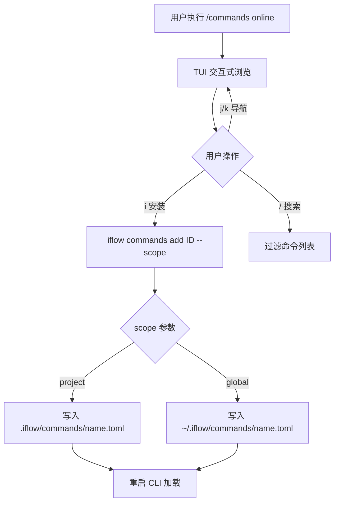

# PD-411.01 iflow-cli — 四类资源统一市场与双作用域插件生态

> 文档编号：PD-411.01
> 来源：iflow-cli `docs_en/examples/subcommand.md` `docs_en/examples/subagent.md` `docs_en/examples/mcp.md` `docs_en/examples/workflow.md`
> GitHub：https://github.com/iflow-ai/iflow-cli.git
> 问题域：PD-411 市场与插件生态 Marketplace & Plugin Ecosystem
> 状态：可复用方案

---

## 第 1 章 问题与动机

### 1.1 核心问题

AI CLI 工具面临一个根本性的生态困境：如何让用户在不修改核心代码的前提下，持续扩展 CLI 的能力边界？

传统 CLI 工具的扩展方式通常是"写插件 → 编译 → 发布到包管理器 → 用户安装"，这条路径对 AI Agent 场景有三个致命缺陷：

1. **资源类型碎片化**：Agent、Command、MCP Server、Workflow 是四种完全不同的扩展形态，传统包管理器无法统一管理
2. **作用域冲突**：团队项目需要项目级隔离，个人偏好需要全局生效，两者经常冲突
3. **发现成本高**：用户不知道有哪些可用扩展，也不知道哪个适合自己的场景

iflow-cli 的解法是构建一个**统一开放市场**（XinLiu Open Platform），将 Agent/Command/Workflow/MCP 四类资源纳入同一个发现-安装-管理闭环，配合 project/global 双作用域实现精确的能力边界控制。

### 1.2 iflow-cli 的解法概述

1. **四类资源统一市场**：Agent、Command、Workflow、MCP Server 共享同一个在线市场平台（`platform.iflow.cn`），用户通过 Web 浏览或 CLI 内 `/xxx online` 交互式浏览安装（`docs_en/examples/subcommand.md:46-48`）
2. **双作用域管理**：每类资源都支持 `--scope project` 和 `--scope global`（user），项目级优先于全局级（`docs_en/examples/subcommand.md:38-41`）
3. **声明式配置格式**：Command 用 TOML/Markdown、Agent 用 Markdown frontmatter、MCP 用 JSON，全部是人类可读的声明式配置（`docs_en/examples/subcommand.md:240-259`）
4. **CLI 内交互式市场**：`/commands online`、`/agents online`、`/mcp online` 提供 vim 风格的 TUI 浏览体验，j/k 导航、i 安装、/ 搜索（`docs_en/examples/subcommand.md:56-84`）
5. **处理器链扩展**：Command 的 TOML 配置通过 ShellProcessor → ShorthandArgumentProcessor → DefaultArgumentProcessor 三级处理器链实现动态能力注入（`docs_en/examples/subcommand.md:449-455`）

### 1.3 设计思想

| 设计原则 | 具体实现 | 理由 | 替代方案 |
|----------|----------|------|----------|
| 统一入口，分类管理 | 四类资源共享 platform.iflow.cn 市场，各有独立 CLI 子命令 | 降低用户认知负担，一个市场解决所有扩展需求 | 每类资源独立市场（如 npm + Docker Hub 分离） |
| 文件即配置 | TOML/Markdown/JSON 声明式配置，无需编译 | AI Agent 场景需要快速迭代，声明式配置零编译成本 | 编译型插件（如 Go plugin、Python wheel） |
| 双作用域隔离 | project 级 `.iflow/` 目录 + global 级 `~/.iflow/` 目录 | 团队协作需要项目隔离，个人偏好需要全局生效 | 单一全局作用域 |
| CLI 内市场浏览 | TUI 交互式浏览，vim 快捷键 | 开发者不离开终端即可发现和安装扩展 | 仅 Web 市场 + 手动复制命令 |
| 处理器链模式 | Shell/Shorthand/Default 三级处理器 | 支持动态 shell 命令注入和参数模板化 | 固定模板引擎 |

---

## 第 2 章 源码实现分析

### 2.1 架构概览

iflow-cli 的市场与插件生态由四个平行的资源管道组成，共享统一的市场后端和双作用域存储层：

```
┌─────────────────────────────────────────────────────────┐
│                XinLiu Open Platform                      │
│            (platform.iflow.cn/agents)                    │
│  ┌──────────┐ ┌──────────┐ ┌──────────┐ ┌────────────┐ │
│  │  Agents  │ │ Commands │ │Workflows │ │MCP Servers │ │
│  └────┬─────┘ └────┬─────┘ └────┬─────┘ └─────┬──────┘ │
└───────┼─────────────┼────────────┼─────────────┼────────┘
        │             │            │             │
   ┌────▼─────┐ ┌────▼─────┐ ┌───▼──────┐ ┌───▼──────┐
   │/agents   │ │/commands │ │/workflow │ │/mcp      │
   │ online   │ │ online   │ │ add      │ │ online   │
   │ add      │ │ add      │ │          │ │ add-json │
   │ list     │ │ list     │ │          │ │ list     │
   │ remove   │ │ remove   │ │          │ │ remove   │
   └────┬─────┘ └────┬─────┘ └───┬──────┘ └───┬──────┘
        │             │            │             │
   ┌────▼─────────────▼────────────▼─────────────▼──────┐
   │              双作用域存储层                          │
   │  Project: .iflow/{agents,commands}/                 │
   │  Global:  ~/.iflow/{agents,commands}/               │
   │  MCP:     .iflow/settings.json / ~/.iflow/settings  │
   └────────────────────────────────────────────────────┘
```

### 2.2 核心实现

#### 2.2.1 Command 市场安装与 TOML 配置体系



对应源码 `docs_en/examples/subcommand.md:240-259`：

```toml
# Command: code-reviewer
# Description: Professional code review tool supporting multi-language code quality detection
# Category: Development
# Version: 2
# Author: iflow-community

description = "Professional code review tool supporting multi-language code quality detection"

prompt = """
You are a professional code review expert. Please analyze the code provided by the user and evaluate from the following aspects:

1. Code quality and readability
2. Security issue detection
3. Performance optimization suggestions
4. Best practice compliance
5. Potential bugs or logical errors

Please provide specific improvement suggestions and example code.
"""
```

TOML 配置的核心字段只有两个：`description`（可选）和 `prompt`（必填）。配置验证使用 Zod schema（`docs_en/examples/subcommand.md:597-606`）：

```typescript
const TomlCommandDefSchema = z.object({
  prompt: z.string({
    required_error: "The 'prompt' field is required.",
    invalid_type_error: "The 'prompt' field must be a string.",
  }),
  description: z.string().optional(),
});
```

#### 2.2.2 处理器链：Shell 命令注入与参数模板化

```mermaid
graph TD
    A[TOML prompt 原文] --> B{包含 !{...} ?}
    B -->|是| C[ShellProcessor: 执行 shell 命令替换输出]
    B -->|否| D{包含 双花括号args ?}
    C --> D
    D -->|是| E[ShorthandArgumentProcessor: 替换参数占位符]
    D -->|否| F[DefaultArgumentProcessor: 追加用户输入到 prompt 末尾]
    E --> G[最终 prompt 发送给 LLM]
    F --> G
```

对应源码 `docs_en/examples/subcommand.md:449-455`：

| 处理器 | 触发条件 | 功能 |
|--------|----------|------|
| **ShellProcessor** | 包含 `!{...}` | 执行 Shell 命令并替换输出 |
| **ShorthandArgumentProcessor** | 包含 `{{args}}` | 替换参数占位符 |
| **DefaultArgumentProcessor** | 默认 | 追加用户输入到 prompt |

实际使用示例（`docs_en/examples/subcommand.md:427-439`）：

```toml
description = "Project analysis tool"

prompt = """
Current project information:

File structure:
!{find . -name "*.js" -o -name "*.ts" | head -20}

Git status:
!{git status --porcelain}

Please analyze project status and provide suggestions.
"""
```

#### 2.2.3 Agent 市场与权限继承机制

```mermaid
graph TD
    A[/agents online 或 iflow agent add] --> B{scope}
    B -->|project| C[.iflow/agents/name.md]
    B -->|global| D[~/.iflow/agents/name.md]
    C --> E[Markdown frontmatter 解析]
    D --> E
    E --> F{isInheritTools?}
    F -->|true| G[继承父 Agent 工具 + allowedTools]
    F -->|false| H[仅使用 allowedTools]
    G --> I{isInheritMcps?}
    H --> I
    I -->|true| J[继承父 Agent MCP + allowedMcps]
    I -->|false| K[仅使用 allowedMcps]
```

Agent 配置使用 Markdown frontmatter 格式（`docs_en/examples/subagent.md:296-312`）：

```markdown
---
agentType: "custom-expert"
systemPrompt: "You are an expert in a custom domain..."
whenToUse: "Use when handling specific domain tasks"
model: "claude-3-5-sonnet-20241022"
allowedTools: ["*"]
proactive: false
---

# Custom Expert Agent

This is a detailed description of a custom expert Agent...
```

权限继承是 Agent 系统的关键设计（`docs_en/examples/subagent.md:340-372`）：

- `isInheritTools: true`（默认）：继承主 Agent 所有工具权限 + allowedTools 额外工具
- `isInheritTools: false`：仅使用 allowedTools 中显式指定的工具
- `isInheritMcps` 同理，控制 MCP Server 访问权限

#### 2.2.4 MCP Server 多传输协议支持

MCP 安装支持四种传输协议（`docs_en/examples/mcp.md:82-121`）：

```bash
# stdio 本地进程
iflow mcp add file-manager python3 /path/to/file_manager.py

# SSE 实时通信
iflow mcp add --transport sse analytics-api https://api.example.com/mcp

# HTTP 远程服务
iflow mcp add --transport http notion https://mcp.notion.com/mcp

# JSON 完整配置
iflow mcp add-json 'playwright' '{"command":"npx","args":["-y","@iflow-mcp/playwright-mcp@0.0.32"]}'
```

MCP 配置存储在 `settings.json` 中，支持工具白名单/黑名单（`docs_en/examples/mcp.md:143-179`）：

```json
{
  "mcpServers": {
    "myPythonServer": {
      "command": "python",
      "args": ["mcp_server.py"],
      "includeTools": ["safe_tool", "file_reader"],
      "timeout": 5000
    },
    "myNodeServer": {
      "command": "node",
      "args": ["mcp_server.js"],
      "excludeTools": ["dangerous_tool"]
    }
  }
}
```

### 2.3 实现细节

#### Workflow 打包与分发

Workflow 是最复杂的资源类型，它是 Agent + Command + MCP + IFLOW.md 的组合包（`docs_en/examples/workflow.md:19-43`）：

```
Project Root/
├── .iflow/
│   ├── agents/          # Agent 配置
│   ├── commands/        # Command 配置
│   ├── IFLOW.md         # 工作流文档
│   └── settings.json    # MCP 配置
├── [Project Folder]/    # 工作流输出依赖的文件
└── IFLOW.md             # 工作流入口配置
```

安装方式（`docs_en/examples/workflow.md:56-59`）：

```bash
iflow workflow add "ppt-generator-v3-OzctqA"
```

上传流程（`docs_en/examples/workflow.md:107-140`）：zip 打包 → 上传到 XinLiu Open Platform → 填写元信息 → 审核发布。

#### 命名空间与冲突处理

- Command 文件命名：`command-name.toml`，层级命名 `parent:child.toml` 创建嵌套命令结构（`docs_en/examples/subcommand.md:493-496`）
- MCP 工具冲突：多个 MCP Server 暴露同名工具时，自动添加 `serverAlias__actualToolName` 前缀（`docs_en/examples/mcp.md:144`）
- Agent 快速调用：`$agent-type task` 语法，`$` 前缀触发自动补全（`docs_en/examples/subagent.md:186-196`）

---

## 第 3 章 迁移指南

### 3.1 迁移清单

#### 阶段一：基础市场框架（MVP）

- [ ] 定义资源类型枚举（Agent / Command / Workflow / MCP）
- [ ] 实现双作用域存储层：project 级 `.your-cli/` + global 级 `~/.your-cli/`
- [ ] 实现资源安装命令：`your-cli <type> add <id> --scope project|global`
- [ ] 实现资源列表命令：`your-cli <type> list`
- [ ] 实现资源移除命令：`your-cli <type> remove <name>`

#### 阶段二：声明式配置解析

- [ ] 实现 TOML 配置解析器（Command 类型）
- [ ] 实现 Markdown frontmatter 解析器（Agent 类型）
- [ ] 实现 JSON 配置解析器（MCP 类型）
- [ ] 实现处理器链：ShellProcessor → ArgumentProcessor → DefaultProcessor
- [ ] 实现 Zod schema 验证

#### 阶段三：在线市场集成

- [ ] 搭建市场后端 API（资源列表、详情、下载）
- [ ] 实现 CLI 内 TUI 交互式浏览（vim 快捷键）
- [ ] 实现 Web 市场前端
- [ ] 实现 Workflow zip 打包与解包

#### 阶段四：安全与治理

- [ ] 实现 Agent 权限继承机制（isInheritTools / isInheritMcps）
- [ ] 实现 MCP 工具白名单/黑名单（includeTools / excludeTools）
- [ ] 实现命名空间冲突自动解决（serverAlias__toolName）
- [ ] 添加第三方资源安全警告

### 3.2 适配代码模板

#### 双作用域资源管理器

```typescript
import * as path from 'path';
import * as os from 'os';
import * as fs from 'fs';

type ResourceType = 'agents' | 'commands' | 'workflows';
type Scope = 'project' | 'global';

interface ResourceManager {
  getDir(type: ResourceType, scope: Scope): string;
  list(type: ResourceType): { scope: Scope; name: string; path: string }[];
  add(type: ResourceType, name: string, content: string, scope: Scope): void;
  remove(type: ResourceType, name: string, scope: Scope): void;
}

class DualScopeResourceManager implements ResourceManager {
  constructor(
    private cliName: string,
    private projectRoot: string
  ) {}

  getDir(type: ResourceType, scope: Scope): string {
    const base = scope === 'global'
      ? path.join(os.homedir(), `.${this.cliName}`)
      : path.join(this.projectRoot, `.${this.cliName}`);
    return path.join(base, type);
  }

  list(type: ResourceType): { scope: Scope; name: string; path: string }[] {
    const results: { scope: Scope; name: string; path: string }[] = [];
    for (const scope of ['global', 'project'] as Scope[]) {
      const dir = this.getDir(type, scope);
      if (!fs.existsSync(dir)) continue;
      for (const file of fs.readdirSync(dir)) {
        const ext = path.extname(file);
        if (['.toml', '.md', '.json'].includes(ext)) {
          results.push({
            scope,
            name: path.basename(file, ext),
            path: path.join(dir, file),
          });
        }
      }
    }
    return results;
  }

  add(type: ResourceType, name: string, content: string, scope: Scope): void {
    const dir = this.getDir(type, scope);
    fs.mkdirSync(dir, { recursive: true });
    const ext = type === 'commands' ? '.toml' : '.md';
    fs.writeFileSync(path.join(dir, `${name}${ext}`), content, 'utf-8');
  }

  remove(type: ResourceType, name: string, scope: Scope): void {
    const dir = this.getDir(type, scope);
    for (const ext of ['.toml', '.md', '.json']) {
      const filePath = path.join(dir, `${name}${ext}`);
      if (fs.existsSync(filePath)) {
        fs.unlinkSync(filePath);
        return;
      }
    }
    throw new Error(`Resource '${name}' not found in ${scope} scope`);
  }
}
```

#### TOML Command 处理器链

```typescript
interface PromptProcessor {
  canProcess(prompt: string): boolean;
  process(prompt: string, userArgs: string): Promise<string>;
}

class ShellProcessor implements PromptProcessor {
  private shellPattern = /!\{([^}]+)\}/g;

  canProcess(prompt: string): boolean {
    return this.shellPattern.test(prompt);
  }

  async process(prompt: string, _userArgs: string): Promise<string> {
    const { execSync } = await import('child_process');
    return prompt.replace(this.shellPattern, (_match, cmd: string) => {
      try {
        return execSync(cmd, { encoding: 'utf-8', timeout: 10000 }).trim();
      } catch {
        return `[Shell error: ${cmd}]`;
      }
    });
  }
}

class ShorthandArgumentProcessor implements PromptProcessor {
  canProcess(prompt: string): boolean {
    return prompt.includes('{{args}}');
  }

  async process(prompt: string, userArgs: string): Promise<string> {
    return prompt.replace(/\{\{args\}\}/g, userArgs);
  }
}

class DefaultArgumentProcessor implements PromptProcessor {
  canProcess(_prompt: string): boolean {
    return true; // 兜底处理器
  }

  async process(prompt: string, userArgs: string): Promise<string> {
    return userArgs ? `${prompt}\n\n${userArgs}` : prompt;
  }
}

async function processCommandPrompt(
  rawPrompt: string,
  userArgs: string
): Promise<string> {
  const processors: PromptProcessor[] = [
    new ShellProcessor(),
    new ShorthandArgumentProcessor(),
    new DefaultArgumentProcessor(),
  ];

  let result = rawPrompt;
  for (const processor of processors) {
    if (processor.canProcess(result)) {
      result = await processor.process(result, userArgs);
      // ShellProcessor 不终止链，其他处理器终止
      if (!(processor instanceof ShellProcessor)) break;
    }
  }
  return result;
}
```

### 3.3 适用场景

| 场景 | 适用度 | 说明 |
|------|--------|------|
| AI CLI 工具扩展生态 | ⭐⭐⭐ | 完美匹配：Agent/Command/MCP/Workflow 四类资源统一管理 |
| IDE 插件市场 | ⭐⭐⭐ | 双作用域 + 声明式配置模式可直接复用 |
| DevOps 工具链管理 | ⭐⭐ | 适合管理脚本和配置，但 Workflow 打包模式可能过重 |
| 通用 SaaS 插件系统 | ⭐⭐ | 文件系统存储适合本地工具，云端 SaaS 需要改为 API 存储 |
| 嵌入式/IoT 场景 | ⭐ | 文件系统依赖和 Node.js 运行时不适合资源受限环境 |

---

## 第 4 章 测试用例

```python
import pytest
import os
import json
import tempfile
import shutil
from pathlib import Path
from unittest.mock import patch, MagicMock


class TestDualScopeResourceManager:
    """测试双作用域资源管理器"""

    @pytest.fixture
    def temp_dirs(self):
        project_dir = tempfile.mkdtemp()
        global_dir = tempfile.mkdtemp()
        yield project_dir, global_dir
        shutil.rmtree(project_dir)
        shutil.rmtree(global_dir)

    def test_project_scope_install(self, temp_dirs):
        """项目级安装：资源写入 .cli/commands/ 目录"""
        project_dir, _ = temp_dirs
        commands_dir = Path(project_dir) / ".iflow" / "commands"
        commands_dir.mkdir(parents=True)

        toml_content = 'description = "test"\nprompt = "Hello {{args}}"'
        config_path = commands_dir / "test-cmd.toml"
        config_path.write_text(toml_content)

        assert config_path.exists()
        content = config_path.read_text()
        assert 'prompt = "Hello {{args}}"' in content

    def test_global_scope_install(self, temp_dirs):
        """全局安装：资源写入 ~/.iflow/commands/ 目录"""
        _, global_dir = temp_dirs
        commands_dir = Path(global_dir) / "commands"
        commands_dir.mkdir(parents=True)

        toml_content = 'description = "global cmd"\nprompt = "Global prompt"'
        config_path = commands_dir / "global-cmd.toml"
        config_path.write_text(toml_content)

        assert config_path.exists()

    def test_project_overrides_global(self, temp_dirs):
        """项目级优先于全局级：同名资源项目级生效"""
        project_dir, global_dir = temp_dirs

        # 全局安装
        global_commands = Path(global_dir) / "commands"
        global_commands.mkdir(parents=True)
        (global_commands / "review.toml").write_text('prompt = "global review"')

        # 项目安装（同名）
        project_commands = Path(project_dir) / ".iflow" / "commands"
        project_commands.mkdir(parents=True)
        (project_commands / "review.toml").write_text('prompt = "project review"')

        # 加载时项目级优先
        project_content = (project_commands / "review.toml").read_text()
        assert "project review" in project_content


class TestProcessorChain:
    """测试 TOML Command 处理器链"""

    def test_shell_processor_replaces_commands(self):
        """ShellProcessor：!{cmd} 被 shell 输出替换"""
        prompt = "Current dir: !{echo /tmp}"
        import re
        pattern = r'!\{([^}]+)\}'
        result = re.sub(pattern, lambda m: "/tmp", prompt)
        assert result == "Current dir: /tmp"

    def test_shorthand_args_replacement(self):
        """ShorthandArgumentProcessor：{{args}} 被用户输入替换"""
        prompt = "Review this: {{args}}"
        user_args = "src/main.py"
        result = prompt.replace("{{args}}", user_args)
        assert result == "Review this: src/main.py"

    def test_default_processor_appends(self):
        """DefaultArgumentProcessor：用户输入追加到 prompt 末尾"""
        prompt = "You are a code reviewer."
        user_args = "/review src/app.ts"
        result = f"{prompt}\n\n{user_args}"
        assert "/review src/app.ts" in result

    def test_chain_priority(self):
        """处理器链优先级：Shell → Shorthand → Default"""
        prompt_with_shell = "Git: !{echo main}\nReview: {{args}}"
        # Shell 先处理
        import re
        step1 = re.sub(r'!\{([^}]+)\}', "main", prompt_with_shell)
        assert "Git: main" in step1
        # 然后 Shorthand 处理
        step2 = step1.replace("{{args}}", "file.py")
        assert "Review: file.py" in step2


class TestAgentPermissionInheritance:
    """测试 Agent 权限继承机制"""

    def test_inherit_tools_true(self):
        """isInheritTools=true：继承父 Agent 工具 + 自身 allowedTools"""
        parent_tools = ["Read", "Write", "Bash"]
        agent_config = {
            "allowedTools": ["Grep"],
            "isInheritTools": True,
        }
        effective_tools = list(set(parent_tools + agent_config["allowedTools"]))
        assert "Read" in effective_tools
        assert "Grep" in effective_tools

    def test_inherit_tools_false(self):
        """isInheritTools=false：仅使用自身 allowedTools"""
        parent_tools = ["Read", "Write", "Bash"]
        agent_config = {
            "allowedTools": ["Read", "Grep"],
            "isInheritTools": False,
        }
        effective_tools = agent_config["allowedTools"]
        assert "Write" not in effective_tools
        assert "Grep" in effective_tools

    def test_mcp_exclude_overrides_include(self):
        """excludeTools 优先于 includeTools"""
        mcp_config = {
            "includeTools": ["safe_tool", "file_reader", "dangerous_tool"],
            "excludeTools": ["dangerous_tool"],
        }
        included = set(mcp_config["includeTools"])
        excluded = set(mcp_config["excludeTools"])
        effective = included - excluded
        assert "dangerous_tool" not in effective
        assert "safe_tool" in effective
```

---

## 第 5 章 跨域关联

| 关联域 | 关系类型 | 说明 |
|--------|----------|------|
| PD-04 工具系统 | 强依赖 | MCP Server 是工具系统的核心扩展机制，市场安装的 MCP 直接扩展工具能力。iflow-cli 的 `includeTools`/`excludeTools` 白黑名单是工具权限控制的实现 |
| PD-02 多 Agent 编排 | 协同 | Sub Agent 通过市场安装后，由主 Agent 通过 Task tool 调度。`$agent-type` 快速调用语法是编排的用户入口 |
| PD-10 中间件管道 | 协同 | Command 的处理器链（ShellProcessor → ArgumentProcessor）本质上是一个微型中间件管道，处理 TOML prompt 的动态注入 |
| PD-09 Human-in-the-Loop | 协同 | `/commands online`、`/agents online` 的 TUI 交互式浏览是 HITL 模式在资源发现场景的应用 |
| PD-06 记忆持久化 | 依赖 | Workflow 安装后生成的 IFLOW.md 是记忆系统的一部分，通过分层加载（global → project → subdirectory）注入 AI 上下文 |
| PD-05 沙箱隔离 | 协同 | Command 的 `!{shell}` 注入和 Agent 的工具权限继承都需要沙箱机制保障安全执行 |

---

## 第 6 章 来源文件索引

| 文件 | 行范围 | 关键实现 |
|------|--------|----------|
| `docs_en/examples/subcommand.md` | L1-L645 | Command 市场完整文档：安装、TOML 配置、处理器链、开发指南 |
| `docs_en/examples/subagent.md` | L1-L416 | Agent 市场完整文档：安装、权限继承、快速调用、配置属性 |
| `docs_en/examples/mcp.md` | L1-L284 | MCP 市场完整文档：五种安装方式、多传输协议、工具白黑名单 |
| `docs_en/examples/workflow.md` | L1-L156 | Workflow 市场文档：目录结构、安装、打包上传流程 |
| `docs_en/configuration/settings.md` | L323-L360 | MCP Server JSON 配置 schema 定义 |
| `docs_en/configuration/iflow.md` | L1-L460 | IFLOW.md 分层记忆系统，Workflow 安装后的上下文注入机制 |
| `docs_en/features/slash-commands.md` | L106-L107 | `/commands` 和 `/agents` 斜杠命令入口定义 |
| `docs_en/examples/hooks.md` | L1-L1015 | Hooks 系统：9 种生命周期钩子，扩展 CLI 行为的另一维度 |
| `README.md` | L18-L41 | 功能对比表：iflow-cli 独有 Built-in Open Market 和 Workflow |
| `IFLOW.md` | L1-L91 | 项目概览和 MCP Server 默认配置 |

---

## 第 7 章 横向对比维度

> **重要：** 本章用于自动填充 Butcher Wiki 的横向对比表。
> 必须严格按以下 JSON 格式输出，放在 `comparison_data` 代码块中。

```json comparison_data
{
  "project": "iflow-cli",
  "dimensions": {
    "资源类型": "Agent/Command/Workflow/MCP 四类资源统一市场",
    "安装方式": "CLI 内 TUI 交互式浏览 + Web 市场 + 命令行直装",
    "配置格式": "TOML(Command) + Markdown frontmatter(Agent) + JSON(MCP)",
    "作用域模型": "project(.iflow/) / global(~/.iflow/) 双作用域，项目级优先",
    "权限控制": "Agent 工具继承 + MCP includeTools/excludeTools 白黑名单",
    "社区分发": "XinLiu Open Platform 统一市场 + zip 打包 Workflow",
    "处理器链": "ShellProcessor → ShorthandArgument → Default 三级链"
  }
}
```

### 域元数据补充

```json domain_metadata
{
  "solution_summary": "iflow-cli 将 Agent/Command/Workflow/MCP 四类资源纳入 XinLiu Open Platform 统一市场，配合 project/global 双作用域和 TOML/Markdown/JSON 声明式配置实现完整插件生态",
  "description": "四类异构资源的统一发现-安装-管理闭环与处理器链扩展",
  "sub_problems": [
    "异构资源类型的统一市场抽象",
    "CLI 内 TUI 交互式市场浏览体验",
    "Command prompt 的动态 Shell 注入与参数模板化",
    "Agent 工具权限的继承与隔离机制"
  ],
  "best_practices": [
    "四类资源共享统一市场后端但各有独立 CLI 子命令",
    "Workflow 作为 Agent+Command+MCP+Memory 的组合包分发",
    "MCP 工具冲突通过 serverAlias__toolName 命名空间自动解决",
    "处理器链模式实现 TOML 配置的动态能力注入"
  ]
}
```
