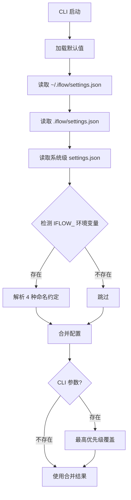
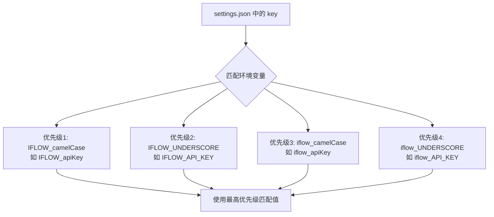
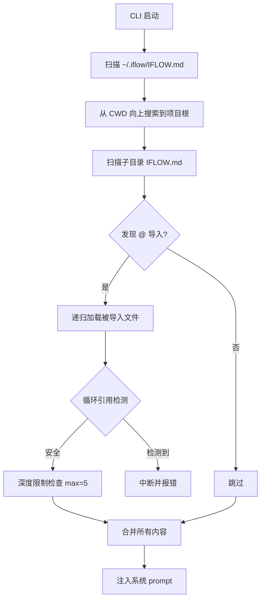

# PD-412.01 iflow-cli — 6 层配置优先级与 IFLOW_ 前缀环境变量体系

> 文档编号：PD-412.01
> 来源：iflow-cli `docs_en/configuration/settings.md` `docs_en/configuration/iflow.md` `docs_en/configuration/iflowignore.md`
> GitHub：https://github.com/iflow-ai/iflow-cli.git
> 问题域：PD-412 层级配置管理 Hierarchical Configuration Management
> 状态：可复用方案

---

## 第 1 章 问题与动机

### 1.1 核心问题

CLI 工具在不同环境（个人开发、团队项目、CI/CD、企业统一管控）下需要灵活的配置管理。核心挑战包括：

1. **多层级覆盖**：个人偏好、项目约定、系统管控、临时调试之间的优先级如何确定？
2. **环境变量命名冲突**：多个 CLI 工具共存时，环境变量名容易撞车（如 `API_KEY` 被多个工具争抢）
3. **敏感信息保护**：API Key 等凭证不能硬编码在配置文件中，需要支持环境变量引用
4. **文件过滤**：AI 工具不应读取 `node_modules/`、`.env` 等无关或敏感文件
5. **上下文记忆层级**：全局习惯、项目规范、模块约定需要分层管理且自动合并

### 1.2 iflow-cli 的解法概述

iflow-cli 实现了一套完整的 6 层配置优先级体系，从低到高：

1. **默认值** → 代码内置基础配置（`docs_en/configuration/settings.md:120`）
2. **用户全局** → `~/.iflow/settings.json`，个人偏好（`docs_en/configuration/settings.md:209-211`）
3. **项目级** → `.iflow/settings.json`，项目约定（`docs_en/configuration/settings.md:212-214`）
4. **系统级** → `/etc/iflow-cli/settings.json`，管理员管控（`docs_en/configuration/settings.md:215-217`）
5. **IFLOW_ 环境变量** → 4 种命名约定，CI/CD 友好（`docs_en/configuration/settings.md:30-35`）
6. **CLI 参数** → `--model`、`--sandbox` 等，临时覆盖（`docs_en/configuration/settings.md:532-586`）

同时配套三个子系统：
- **环境变量引用**：`settings.json` 中用 `$VAR` / `${VAR}` 引用环境变量（`docs_en/configuration/settings.md:219`）
- **IFLOW.md 层级记忆**：全局→项目→子目录三层上下文，支持 `@` 导入（`docs_en/configuration/iflow.md:17-46`）
- **.iflowignore 文件过滤**：独立于 `.gitignore` 的 AI 工具专用过滤（`docs_en/configuration/iflowignore.md:1-10`）

### 1.3 设计思想

| 设计原则 | 具体实现 | 理由 | 替代方案 |
|----------|----------|------|----------|
| 就近覆盖 | 6 层优先级，CLI 参数 > 环境变量 > 系统 > 项目 > 用户 > 默认 | 越临时的配置优先级越高，符合直觉 | 单一配置文件（不够灵活） |
| 命名空间隔离 | `IFLOW_` 前缀 + 4 种命名约定 | 避免与其他工具的环境变量冲突 | 无前缀（容易撞车） |
| 间接引用 | `$VAR_NAME` / `${VAR_NAME}` 语法 | 敏感信息不入配置文件，安全合规 | 直接写入明文（安全风险） |
| 关注点分离 | `.iflowignore` 独立于 `.gitignore` | Git 管版本控制，iflowignore 管 AI 可见性 | 复用 .gitignore（粒度不够） |
| 层级记忆 | IFLOW.md 全局→项目→子目录三层 | 不同粒度的上下文自动合并，子目录可覆盖项目级 | 单一 prompt 文件（无法分层） |

---

## 第 2 章 源码实现分析

### 2.1 架构概览

iflow-cli 是闭源 CLI 工具（通过 npm 分发），源码不可见。以下分析基于官方文档中描述的配置加载架构。

```
┌─────────────────────────────────────────────────────────────────┐
│                    iflow-cli 配置加载管线                         │
├─────────────────────────────────────────────────────────────────┤
│                                                                 │
│  ┌──────────┐  ┌──────────┐  ┌──────────┐  ┌──────────┐       │
│  │ 默认值    │→│ 用户全局  │→│ 项目级    │→│ 系统级    │       │
│  │ (内置)    │  │ ~/.iflow/ │  │ .iflow/  │  │ /etc/    │       │
│  │          │  │settings   │  │settings  │  │iflow-cli/│       │
│  └──────────┘  └──────────┘  └──────────┘  └──────────┘       │
│       ↓              ↓              ↓              ↓            │
│  ┌──────────────────────────────────────────────────┐          │
│  │              配置合并引擎（高优先级覆盖低优先级）    │          │
│  └──────────────────────────────────────────────────┘          │
│       ↑                                    ↑                    │
│  ┌──────────┐                        ┌──────────┐             │
│  │ IFLOW_   │                        │ CLI 参数  │             │
│  │ 环境变量  │                        │ --model  │             │
│  │ 4种命名   │                        │ --sandbox│             │
│  └──────────┘                        └──────────┘             │
│                                                                 │
│  ┌─────────────────────┐  ┌─────────────────────┐             │
│  │ IFLOW.md 层级记忆    │  │ .iflowignore 过滤   │             │
│  │ 全局→项目→子目录     │  │ 独立于 .gitignore   │             │
│  └─────────────────────┘  └─────────────────────┘             │
└─────────────────────────────────────────────────────────────────┘
```

### 2.2 核心实现

#### 2.2.1 六层配置优先级体系



对应文档 `docs_en/configuration/settings.md:110-121`：

```
Complete configuration priority (from high to low):

1. Command Line Parameters - such as `iflow --model your-model`
2. IFLOW Prefixed Environment Variables - supports all settings.json items
   - IFLOW_camelCase > IFLOW_underscore > iflow_camelCase > iflow_underscore
3. System Configuration File - `/etc/iflow-cli/settings.json`
4. Workspace Configuration File - `.iflow/settings.json`
5. User Configuration File - `~/.iflow/settings.json`
6. Default Values - default configuration defined in code
```

系统级配置文件路径跨平台适配（`docs_en/configuration/settings.md:216`）：
- Linux: `/etc/iflow-cli/settings.json`
- macOS: `/Library/Application Support/iFlowCli/settings.json`
- Windows: `C:\ProgramData\iflow-cli\settings.json`
- 自定义: `IFLOW_CLI_SYSTEM_SETTINGS_PATH` 环境变量

#### 2.2.2 IFLOW_ 前缀环境变量映射



对应文档 `docs_en/configuration/settings.md:30-45`，环境变量命名映射表：

```
| key in settings.json | 1. IFLOW_camelCase      | 2. IFLOW_underscore       |
| -------------------- | ----------------------- | ------------------------- |
| apiKey               | IFLOW_apiKey            | IFLOW_API_KEY             |
| baseUrl              | IFLOW_baseUrl           | IFLOW_BASE_URL            |
| modelName            | IFLOW_modelName         | IFLOW_MODEL_NAME          |
| vimMode              | IFLOW_vimMode           | IFLOW_VIM_MODE            |
| showMemoryUsage      | IFLOW_showMemoryUsage   | IFLOW_SHOW_MEMORY_USAGE   |
```

关键设计：所有 `settings.json` 中的配置项都可通过环境变量设置，实现了配置文件与环境变量的完全对称。

#### 2.2.3 settings.json 环境变量引用

对应文档 `docs_en/configuration/settings.md:219`：

```json
{
  "apiKey": "$MY_API_TOKEN",
  "baseUrl": "${API_BASE_URL}",
  "mcpServers": {
    "myDockerServer": {
      "command": "docker",
      "args": ["run", "-i", "--rm", "-e", "API_KEY", "ghcr.io/foo/bar"],
      "env": {
        "API_KEY": "$MY_API_TOKEN"
      }
    }
  }
}
```

支持两种语法：`$VAR_NAME` 和 `${VAR_NAME}`，在加载 settings 时自动解析替换。

### 2.3 实现细节

#### IFLOW.md 三层记忆加载

对应文档 `docs_en/configuration/iflow.md:17-46`：



三层优先级：
1. **全局** `~/.iflow/IFLOW.md` — 个人习惯、通用偏好
2. **项目** `/project/IFLOW.md` — 项目架构、团队规范
3. **子目录** `/project/src/IFLOW.md` — 模块特定指令

支持 `contextFileName` 配置自定义文件名，可以是字符串或数组（`docs_en/configuration/iflow.md:50-64`）：

```json
{
  "contextFileName": ["IFLOW.md", "AGENTS.md", "CONTEXT.md"]
}
```

安全特性（`docs_en/configuration/iflow.md:188-193`）：
- 循环导入检测
- 路径验证
- 深度限制（默认最大 5 层）
- 文件不存在/权限问题的优雅处理

#### .iflowignore 文件过滤

对应文档 `docs_en/configuration/iflowignore.md:1-10`：

独立于 `.gitignore` 的过滤系统，语法兼容 `.gitignore`，但作用域不同：
- `.gitignore` → 控制 Git 版本管理
- `.iflowignore` → 控制 AI 工具可见性

支持的工具：`ls`、`read_many_files`、`@filename` 引用等文件操作工具。


---

## 第 3 章 迁移指南

### 3.1 迁移清单

#### 阶段 1：基础配置层级（1-2 天）

- [ ] 定义配置 schema（TypeScript interface 或 JSON Schema）
- [ ] 实现 3 层配置文件加载：默认值 → 用户全局 → 项目级
- [ ] 实现配置合并逻辑（深度合并，高优先级覆盖低优先级）

#### 阶段 2：环境变量支持（1 天）

- [ ] 实现带前缀的环境变量扫描（如 `MYAPP_` 前缀）
- [ ] 支持 camelCase 和 UNDERSCORE_CASE 两种命名约定
- [ ] 实现 `$VAR` / `${VAR}` 环境变量引用解析

#### 阶段 3：CLI 参数覆盖（0.5 天）

- [ ] 集成 CLI 参数解析库（如 commander / yargs）
- [ ] CLI 参数作为最高优先级覆盖合并结果

#### 阶段 4：文件过滤（0.5 天）

- [ ] 实现 `.myappignore` 文件解析（复用 `.gitignore` 语法）
- [ ] 在文件操作工具中集成过滤逻辑

### 3.2 适配代码模板

以下是一个可直接运行的 TypeScript 实现，复刻 iflow-cli 的 6 层配置优先级体系：

```typescript
import { readFileSync, existsSync } from 'fs';
import { resolve, join, dirname } from 'path';
import { homedir } from 'os';
import { parse } from 'jsonc-parser';

// ---- 配置 Schema ----
interface AppConfig {
  apiKey?: string;
  baseUrl?: string;
  modelName?: string;
  theme?: string;
  vimMode?: boolean;
  maxSessionTurns?: number;
  [key: string]: unknown;
}

// ---- 环境变量引用解析 ----
function resolveEnvRefs(obj: Record<string, unknown>): Record<string, unknown> {
  const result: Record<string, unknown> = {};
  for (const [key, value] of Object.entries(obj)) {
    if (typeof value === 'string') {
      // 支持 $VAR 和 ${VAR} 两种语法
      result[key] = value.replace(/\$\{(\w+)\}|\$(\w+)/g, (_, a, b) => {
        const envName = a || b;
        return process.env[envName] ?? '';
      });
    } else if (typeof value === 'object' && value !== null) {
      result[key] = resolveEnvRefs(value as Record<string, unknown>);
    } else {
      result[key] = value;
    }
  }
  return result;
}

// ---- 带前缀的环境变量扫描 ----
function scanPrefixedEnvVars(
  prefix: string,
  schema: Record<string, unknown>
): Record<string, string> {
  const result: Record<string, string> = {};
  const keys = Object.keys(schema);

  for (const key of keys) {
    // 4 种命名约定，按优先级排列
    const candidates = [
      `${prefix.toUpperCase()}_${key}`,                          // PREFIX_camelCase
      `${prefix.toUpperCase()}_${camelToUnderscore(key)}`,       // PREFIX_UNDERSCORE
      `${prefix.toLowerCase()}_${key}`,                          // prefix_camelCase
      `${prefix.toLowerCase()}_${camelToUnderscore(key)}`,       // prefix_UNDERSCORE
    ];

    for (const envName of candidates) {
      if (process.env[envName] !== undefined) {
        result[key] = process.env[envName]!;
        break; // 使用最高优先级匹配
      }
    }
  }
  return result;
}

function camelToUnderscore(str: string): string {
  return str.replace(/([A-Z])/g, '_$1').toUpperCase();
}

// ---- 配置文件加载 ----
function loadJsonConfig(filePath: string): Record<string, unknown> {
  if (!existsSync(filePath)) return {};
  try {
    const content = readFileSync(filePath, 'utf-8');
    const parsed = parse(content) ?? {};
    return resolveEnvRefs(parsed);
  } catch {
    return {};
  }
}

// ---- 6 层配置合并 ----
function loadConfig(cliArgs: Record<string, unknown> = {}): AppConfig {
  const APP_PREFIX = 'MYAPP';
  const home = homedir();

  // Layer 1: 默认值
  const defaults: AppConfig = {
    theme: 'Default',
    vimMode: false,
    maxSessionTurns: -1,
  };

  // Layer 2: 用户全局
  const userConfig = loadJsonConfig(join(home, '.myapp', 'settings.json'));

  // Layer 3: 项目级
  const projectConfig = loadJsonConfig(
    join(process.cwd(), '.myapp', 'settings.json')
  );

  // Layer 4: 系统级（跨平台路径）
  const systemPath = process.env.MYAPP_SYSTEM_SETTINGS_PATH
    ?? getSystemSettingsPath();
  const systemConfig = loadJsonConfig(systemPath);

  // Layer 5: 环境变量
  const envConfig = scanPrefixedEnvVars(APP_PREFIX, defaults);

  // Layer 6: CLI 参数（最高优先级）
  // 合并：低优先级 → 高优先级
  return Object.assign({}, defaults, userConfig, projectConfig,
    systemConfig, envConfig, cliArgs) as AppConfig;
}

function getSystemSettingsPath(): string {
  switch (process.platform) {
    case 'linux': return '/etc/myapp/settings.json';
    case 'darwin': return '/Library/Application Support/MyApp/settings.json';
    case 'win32': return 'C:\\ProgramData\\myapp\\settings.json';
    default: return '/etc/myapp/settings.json';
  }
}
```

### 3.3 适用场景

| 场景 | 适用度 | 说明 |
|------|--------|------|
| CLI 工具配置管理 | ⭐⭐⭐ | 完美匹配，6 层优先级覆盖各种使用场景 |
| AI Agent 框架配置 | ⭐⭐⭐ | IFLOW.md 层级记忆 + 环境变量引用非常适合 Agent 场景 |
| CI/CD 环境 | ⭐⭐⭐ | IFLOW_ 前缀环境变量天然适配 CI secrets |
| 企业统一管控 | ⭐⭐⭐ | 系统级配置 + `IFLOW_CLI_SYSTEM_SETTINGS_PATH` 支持集中管理 |
| 简单脚本工具 | ⭐ | 过度设计，单层配置文件即可 |
| 微服务配置中心 | ⭐⭐ | 缺少远程配置拉取和热更新能力 |

---

## 第 4 章 测试用例

```python
import os
import json
import tempfile
import pytest
from pathlib import Path
from unittest.mock import patch


class TestConfigPriority:
    """测试 6 层配置优先级体系"""

    def test_default_values_used_when_no_config(self):
        """无任何配置时使用默认值"""
        config = load_config()
        assert config["theme"] == "Default"
        assert config["vimMode"] is False
        assert config["maxSessionTurns"] == -1

    def test_user_config_overrides_defaults(self, tmp_path):
        """用户全局配置覆盖默认值"""
        user_dir = tmp_path / ".myapp"
        user_dir.mkdir()
        (user_dir / "settings.json").write_text('{"theme": "GitHub"}')

        with patch("config.HOME_DIR", str(tmp_path)):
            config = load_config()
        assert config["theme"] == "GitHub"

    def test_project_config_overrides_user(self, tmp_path):
        """项目级配置覆盖用户全局"""
        user_dir = tmp_path / ".myapp"
        user_dir.mkdir()
        (user_dir / "settings.json").write_text('{"theme": "GitHub"}')

        project_dir = tmp_path / "project" / ".myapp"
        project_dir.mkdir(parents=True)
        (project_dir / "settings.json").write_text('{"theme": "Dark"}')

        with patch("config.HOME_DIR", str(tmp_path)), \
             patch("os.getcwd", return_value=str(tmp_path / "project")):
            config = load_config()
        assert config["theme"] == "Dark"

    def test_env_var_overrides_file_config(self):
        """IFLOW_ 前缀环境变量覆盖文件配置"""
        with patch.dict(os.environ, {"MYAPP_theme": "EnvTheme"}):
            config = load_config()
        assert config["theme"] == "EnvTheme"

    def test_cli_args_highest_priority(self):
        """CLI 参数具有最高优先级"""
        with patch.dict(os.environ, {"MYAPP_theme": "EnvTheme"}):
            config = load_config(cli_args={"theme": "CLITheme"})
        assert config["theme"] == "CLITheme"


class TestEnvVarNaming:
    """测试 4 种环境变量命名约定"""

    def test_prefix_camelcase_highest_priority(self):
        """IFLOW_camelCase 优先级最高"""
        with patch.dict(os.environ, {
            "MYAPP_apiKey": "camel",
            "MYAPP_API_KEY": "underscore",
        }):
            result = scan_prefixed_env_vars("MYAPP", {"apiKey": ""})
        assert result["apiKey"] == "camel"

    def test_underscore_fallback(self):
        """无 camelCase 时回退到 UNDERSCORE"""
        with patch.dict(os.environ, {"MYAPP_API_KEY": "underscore"}):
            result = scan_prefixed_env_vars("MYAPP", {"apiKey": ""})
        assert result["apiKey"] == "underscore"

    def test_lowercase_prefix_fallback(self):
        """无大写前缀时回退到小写前缀"""
        with patch.dict(os.environ, {"myapp_apiKey": "lower"}):
            result = scan_prefixed_env_vars("MYAPP", {"apiKey": ""})
        assert result["apiKey"] == "lower"


class TestEnvVarReference:
    """测试 settings.json 中的环境变量引用"""

    def test_dollar_var_syntax(self):
        """$VAR 语法解析"""
        with patch.dict(os.environ, {"MY_TOKEN": "secret123"}):
            result = resolve_env_refs({"apiKey": "$MY_TOKEN"})
        assert result["apiKey"] == "secret123"

    def test_dollar_brace_syntax(self):
        """${VAR} 语法解析"""
        with patch.dict(os.environ, {"MY_TOKEN": "secret456"}):
            result = resolve_env_refs({"apiKey": "${MY_TOKEN}"})
        assert result["apiKey"] == "secret456"

    def test_missing_env_var_resolves_empty(self):
        """未定义的环境变量解析为空字符串"""
        result = resolve_env_refs({"apiKey": "$NONEXISTENT_VAR"})
        assert result["apiKey"] == ""

    def test_nested_object_resolution(self):
        """嵌套对象中的环境变量也被解析"""
        with patch.dict(os.environ, {"TOKEN": "abc"}):
            result = resolve_env_refs({
                "mcpServers": {"server1": {"env": {"API_KEY": "$TOKEN"}}}
            })
        assert result["mcpServers"]["server1"]["env"]["API_KEY"] == "abc"


class TestIflowignore:
    """测试 .iflowignore 文件过滤"""

    def test_wildcard_pattern(self):
        """通配符匹配"""
        rules = parse_ignore_rules(["*.log", "*.tmp"])
        assert should_ignore("error.log", rules) is True
        assert should_ignore("app.js", rules) is False

    def test_directory_pattern(self):
        """目录匹配"""
        rules = parse_ignore_rules(["node_modules/", "dist/"])
        assert should_ignore("node_modules/package.json", rules) is True

    def test_negation_rule(self):
        """否定规则"""
        rules = parse_ignore_rules(["*.log", "!important.log"])
        assert should_ignore("error.log", rules) is True
        assert should_ignore("important.log", rules) is False
```


---

## 第 5 章 跨域关联

| 关联域 | 关系类型 | 说明 |
|--------|----------|------|
| PD-01 上下文管理 | 协同 | IFLOW.md 层级记忆本质上是上下文注入机制，`compressionTokenThreshold` 配置项控制上下文压缩阈值 |
| PD-04 工具系统 | 协同 | `coreTools` / `excludeTools` 配置项控制工具可用性，`mcpServers` 配置 MCP 工具服务器 |
| PD-05 沙箱隔离 | 依赖 | `sandbox` 配置项控制沙箱模式，`.iflow/sandbox-*.sb` 自定义沙箱配置依赖配置层级 |
| PD-06 记忆持久化 | 协同 | IFLOW.md 是记忆的载体，`contextFileName` 配置项控制记忆文件名，`/memory` 命令管理记忆 |
| PD-09 Human-in-the-Loop | 协同 | `autoAccept` 配置项控制是否自动批准工具调用，`maxSessionTurns` 限制会话轮次 |
| PD-11 可观测性 | 协同 | `telemetry` 配置对象控制 OTLP 端点、日志级别等可观测性参数 |

---

## 第 6 章 来源文件索引

| 文件 | 行范围 | 关键实现 |
|------|--------|----------|
| `docs_en/configuration/settings.md` | L10-18 | 5 层配置层级定义 |
| `docs_en/configuration/settings.md` | L20-121 | IFLOW_ 前缀环境变量完整规范 |
| `docs_en/configuration/settings.md` | L110-121 | 6 层完整优先级排序 |
| `docs_en/configuration/settings.md` | L205-522 | settings.json 所有配置项定义 |
| `docs_en/configuration/settings.md` | L219 | 环境变量引用语法 `$VAR` / `${VAR}` |
| `docs_en/configuration/settings.md` | L216 | 系统级配置跨平台路径 + `IFLOW_CLI_SYSTEM_SETTINGS_PATH` |
| `docs_en/configuration/settings.md` | L532-586 | CLI 命令行参数完整列表 |
| `docs_en/configuration/iflow.md` | L17-46 | IFLOW.md 三层优先级加载机制 |
| `docs_en/configuration/iflow.md` | L133-193 | `@` 导入语法 + 安全特性（循环检测、深度限制） |
| `docs_en/configuration/iflow.md` | L50-64 | `contextFileName` 自定义文件名配置 |
| `docs_en/configuration/iflowignore.md` | L1-10 | .iflowignore 概述与定位 |
| `docs_en/configuration/iflowignore.md` | L30-58 | 忽略规则语法（兼容 .gitignore） |
| `docs_en/configuration/iflowignore.md` | L193-198 | 重要注意事项（重启生效、独立于 .gitignore） |
| `install.sh` | L448-479 | npm 全局安装流程 |
| `IFLOW.md` | L1-91 | 项目自身的上下文记忆文件示例 |

---

## 第 7 章 横向对比维度

```json comparison_data
{
  "project": "iflow-cli",
  "dimensions": {
    "配置层级数": "6 层：默认值→用户→项目→系统→环境变量→CLI参数",
    "环境变量策略": "IFLOW_ 前缀 + 4 种命名约定（camelCase/UNDERSCORE × 大小写前缀）",
    "配置文件格式": "JSON（settings.json），支持 $VAR/${VAR} 环境变量引用",
    "文件过滤规则": ".iflowignore 独立于 .gitignore，兼容 gitignore 语法",
    "上下文记忆层级": "IFLOW.md 三层（全局→项目→子目录）+ @ 导入 + 循环检测",
    "跨平台适配": "系统级配置路径按 Linux/macOS/Windows 自动选择",
    "企业管控": "系统级 settings.json + IFLOW_CLI_SYSTEM_SETTINGS_PATH 自定义路径"
  }
}
```

### 域元数据补充

```json domain_metadata
{
  "solution_summary": "iflow-cli 实现 6 层配置优先级（默认→用户→项目→系统→IFLOW_环境变量→CLI参数），IFLOW_ 前缀支持 4 种命名约定，settings.json 支持 $VAR 环境变量引用，配套 IFLOW.md 三层记忆和 .iflowignore 过滤",
  "description": "CLI 工具的多层配置合并与环境变量命名空间隔离",
  "sub_problems": [
    "跨平台系统级配置路径适配",
    "环境变量命名约定优先级排序",
    "上下文记忆文件的模块化导入与循环检测"
  ],
  "best_practices": [
    "用命名空间前缀隔离环境变量避免冲突",
    "系统级配置路径支持环境变量自定义覆盖",
    "记忆文件支持 @ 导入实现模块化管理"
  ]
}
```

