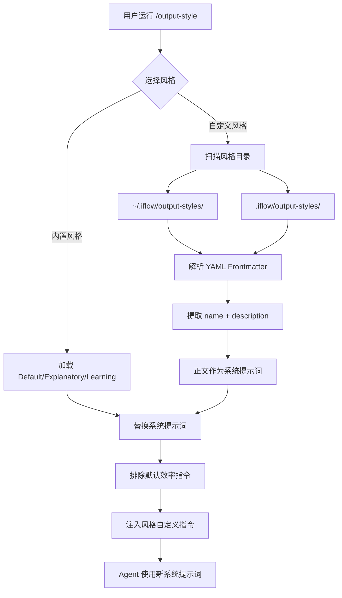
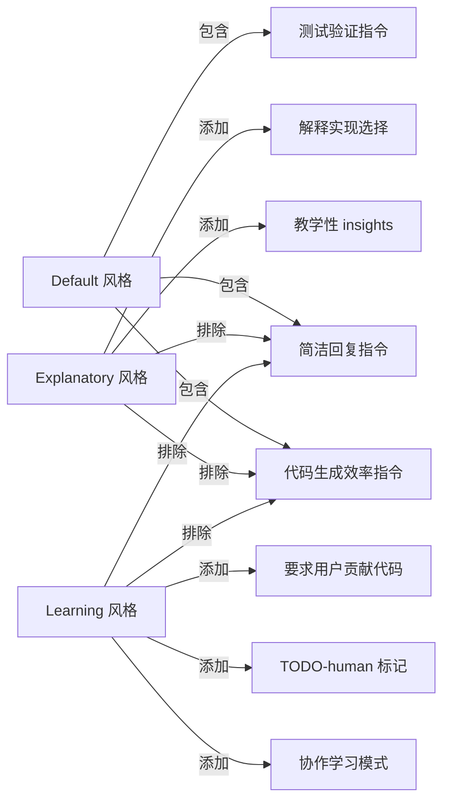

# PD-413.01 iflow-cli — Markdown 风格文件驱动系统提示词定制

> 文档编号：PD-413.01
> 来源：iflow-cli `docs_en/features/output-style.md`
> GitHub：https://github.com/iflow-ai/iflow-cli.git
> 问题域：PD-413 输出风格系统 Output Style System
> 状态：可复用方案

---

## 第 1 章 问题与动机（≥ 30 行）

### 1.1 核心问题

AI CLI 工具的默认系统提示词通常针对软件工程任务优化——简洁回复、代码验证、测试驱动。但用户的需求远不止写代码：有人想让 AI 解释每一步决策（教学模式），有人想让 AI 留出代码空白让自己动手（学习模式），有人想把 CLI 用于非编程任务（写作、分析、翻译）。

核心矛盾：**系统提示词是 Agent 行为的根基，但不同场景需要截然不同的行为模式**。

传统做法是在用户消息层面追加指令（如 IFLOW.md / CLAUDE.md），但这只能"补充"默认行为，无法"替换"默认行为中不适用的部分。例如，默认提示词中"保持简洁"的指令会与"详细解释每步决策"的教学需求冲突。

iFlow CLI 的 Output Style 系统直接解决了这个问题：**通过 Markdown 文件定义完整的系统提示词替换方案**，非默认风格会排除默认提示词中特定于代码生成效率的指令，然后注入自定义指令。

### 1.2 iflow-cli 的解法概述

1. **系统提示词级别的替换而非追加** — Output Style 直接修改系统提示词，而非像 IFLOW.md 那样在用户消息层追加内容（`docs_en/features/output-style.md:30-33`）
2. **内置三种风格模板** — Default（高效编码）、Explanatory（教学解释）、Learning（协作学习），覆盖最常见的使用场景（`docs_en/features/output-style.md:18-26`）
3. **Markdown + YAML Frontmatter 文件格式** — 风格定义为纯 Markdown 文件，YAML 头部声明 name/description 元数据，正文即系统提示词内容（`docs_en/features/output-style.md:50-65`）
4. **双层存储：用户级 + 项目级** — `~/.iflow/output-styles/` 全局可用，`.iflow/output-styles/` 项目专属，项目级覆盖用户级（`docs_en/features/output-style.md:48,67`）
5. **AI 辅助创建** — `/output-style:new` 命令让 AI 根据自然语言描述生成风格文件，降低创建门槛（`docs_en/features/output-style.md:45-47`）

### 1.3 设计思想

| 设计原则 | 具体实现 | 理由 | 替代方案 |
|----------|----------|------|----------|
| 替换优于追加 | 非默认风格排除默认效率指令，注入自定义指令 | 避免指令冲突（如"简洁"与"详细解释"矛盾） | 在用户消息层追加（IFLOW.md 方式），但无法移除默认行为 |
| 文件即配置 | Markdown 文件定义风格，YAML frontmatter 声明元数据 | 人类可读、版本可控、无需代码修改 | JSON/YAML 配置文件，但不如 Markdown 直观 |
| 分层覆盖 | 用户级 → 项目级，项目级优先 | 个人偏好全局生效，项目特殊需求局部覆盖 | 单一存储位置，但缺乏灵活性 |
| AI 辅助创建 | `/output-style:new` 用 AI 生成风格文件 | 降低非技术用户的创建门槛 | 手动编写 Markdown，但学习成本高 |
| 关注点分离 | Output Style ≠ IFLOW.md ≠ SubAgent ≠ Slash Command | 四种机制各司其职，避免职责混淆 | 统一配置入口，但概念模糊 |

---

## 第 2 章 源码实现分析（≥ 60 行，核心章节）

### 2.1 架构概览

iFlow CLI 的提示词系统由四个独立层次组成，Output Style 位于最底层（系统提示词层），拥有最高的行为控制权：

```
┌─────────────────────────────────────────────────────┐
│                   用户输入层                          │
│  Slash Commands: /output-style [name]               │
│  Quick Call: $agent-type task                        │
├─────────────────────────────────────────────────────┤
│                   用户消息层                          │
│  IFLOW.md: 项目上下文（追加到系统提示词之后）          │
│  Custom Slash Commands: "存储的提示"                  │
├─────────────────────────────────────────────────────┤
│                   Agent 层                           │
│  SubAgent: 独立模型 + 工具集 + 上下文                 │
│  （不影响主 Agent 系统提示词）                         │
├─────────────────────────────────────────────────────┤
│              ★ 系统提示词层 ★                         │
│  Output Style: 直接替换/修改系统提示词                 │
│  Default | Explanatory | Learning | Custom           │
└─────────────────────────────────────────────────────┘
```

关键区分（`docs_en/features/output-style.md:69-81`）：
- **Output Style vs IFLOW.md**：Output Style 替换系统提示词的风格部分；IFLOW.md 在系统提示词之后追加用户消息
- **Output Style vs SubAgent**：Output Style 影响主 Agent 循环的系统提示词；SubAgent 是独立的任务处理单元，有自己的模型和工具集
- **Output Style vs Custom Slash Commands**：Output Style 是"存储的系统提示"；Slash Commands 是"存储的提示"（用户消息级别）

### 2.2 核心实现

#### 2.2.1 风格文件格式与加载



风格文件结构（`docs_en/features/output-style.md:50-65`）：

```markdown
---
name: My Custom Style
description:
  A brief description of what this style does, to be displayed to the user
---

# Custom Style Instructions

You are an interactive CLI tool that helps users with software engineering
tasks. [Your custom instructions here...]

## Specific Behaviors

[Define how the assistant should behave in this style...]
```

文件格式要点：
- YAML frontmatter 中 `name` 字段用于菜单显示和命令行直接切换
- `description` 字段在选择菜单中展示，帮助用户理解风格用途
- frontmatter 之后的 Markdown 正文即完整的系统提示词内容
- 非默认风格会自动排除默认提示词中关于"简洁回复"和"通过测试验证代码"的效率指令（`docs_en/features/output-style.md:32-33`）

#### 2.2.2 内置风格的行为差异



三种内置风格的核心差异（`docs_en/features/output-style.md:18-33`）：

| 风格 | 效率指令 | 特殊行为 | 适用场景 |
|------|----------|----------|----------|
| Default | ✅ 保留 | 简洁回复 + 测试验证 | 日常软件工程 |
| Explanatory | ❌ 排除 | 提供教学性 insights，解释实现选择和代码库模式 | 代码审查、学习新项目 |
| Learning | ❌ 排除 | 协作学习 + `TODO(human)` 标记 + 要求用户贡献代码片段 | 编程教学、新手引导 |

#### 2.2.3 命令系统

风格切换通过三种方式触发（`docs_en/features/output-style.md:35-47`）：

```bash
# 方式 1：交互式菜单选择
/output-style

# 方式 2：直接切换到指定风格
/output-style explanatory

# 方式 3：AI 辅助创建新风格
/output-style:new I want an output style that helps me learn React patterns
```

`/output-style:new` 的工作流程：
1. 用户用自然语言描述期望的 AI 行为
2. AI 分析描述，生成符合 Markdown + YAML frontmatter 格式的风格文件
3. 文件默认保存到 `~/.iflow/output-styles/`（用户级，跨项目可用）
4. 立即可通过 `/output-style` 菜单或命令切换使用

### 2.3 实现细节

#### 存储层级与优先级

```
优先级（高 → 低）：
┌─────────────────────────────────┐
│ 项目级: .iflow/output-styles/   │  ← 项目专属风格
├─────────────────────────────────┤
│ 用户级: ~/.iflow/output-styles/ │  ← 全局个人风格
├─────────────────────────────────┤
│ 内置: Default/Explanatory/Learning │ ← 系统预设
└─────────────────────────────────┘
```

这与 iFlow CLI 的整体配置哲学一致（`docs_en/configuration/settings.md:12-18`）：
- 应用默认值 → 用户全局设置 → 项目特定设置 → 系统级设置 → 命令行参数

#### 与 IFLOW.md 记忆系统的协作

Output Style 和 IFLOW.md 是互补而非互斥的（`docs_en/features/output-style.md:71-73`）：

1. **Output Style** 控制 Agent 的"人格"——如何回复、什么语气、是否解释
2. **IFLOW.md** 提供 Agent 的"记忆"——项目结构、编码规范、技术栈信息

两者在提示词中的位置不同：
- Output Style → 替换系统提示词的行为部分
- IFLOW.md → 作为用户消息追加在系统提示词之后

这意味着切换 Output Style 不会丢失项目上下文，IFLOW.md 的内容始终存在。

#### 与 SubAgent 系统的边界

SubAgent（`docs_en/examples/subagent.md:1-50`）是独立的任务处理单元，有自己的：
- 系统提示词（`systemPrompt` 字段）
- 模型选择（`model` 字段）
- 工具权限（`allowedTools` 字段）
- MCP 服务器访问（`allowedMcps` 字段）

Output Style 只影响主 Agent 循环，不影响 SubAgent。这是一个重要的设计边界：
- 主 Agent 的"人格"由 Output Style 控制
- SubAgent 的"人格"由各自的 `systemPrompt` 控制
- 两者互不干扰


---

## 第 3 章 迁移指南（≥ 40 行）

### 3.1 迁移清单

#### 阶段 1：基础风格系统（1-2 天）

- [ ] 定义风格文件格式（Markdown + YAML frontmatter）
- [ ] 实现风格文件解析器（YAML frontmatter 提取 + Markdown 正文读取）
- [ ] 实现双层目录扫描（用户级 `~/.your-tool/output-styles/` + 项目级 `.your-tool/output-styles/`）
- [ ] 实现风格切换命令（交互式菜单 + 直接切换）
- [ ] 实现系统提示词替换逻辑（排除默认指令 + 注入风格指令）

#### 阶段 2：内置风格模板（0.5 天）

- [ ] 创建 Default 风格（保留所有效率指令）
- [ ] 创建 Explanatory 风格（排除效率指令 + 添加教学指令）
- [ ] 创建 Learning 风格（排除效率指令 + 添加协作学习指令）

#### 阶段 3：AI 辅助创建（1 天）

- [ ] 实现 `/output-style:new` 命令
- [ ] 设计风格生成 prompt（输入自然语言描述 → 输出 Markdown 风格文件）
- [ ] 实现文件保存逻辑（默认保存到用户级目录）

### 3.2 适配代码模板

#### 风格文件解析器（TypeScript）

```typescript
import * as fs from 'fs';
import * as path from 'path';
import * as os from 'os';

interface OutputStyle {
  name: string;
  description: string;
  systemPrompt: string;  // Markdown 正文部分
  source: 'builtin' | 'user' | 'project';
}

/**
 * 解析 Markdown + YAML frontmatter 格式的风格文件
 * 参考 iFlow CLI 的风格文件格式: docs_en/features/output-style.md:50-65
 */
function parseStyleFile(filePath: string, source: OutputStyle['source']): OutputStyle {
  const content = fs.readFileSync(filePath, 'utf-8');
  const frontmatterMatch = content.match(/^---\n([\s\S]*?)\n---\n([\s\S]*)$/);
  
  if (!frontmatterMatch) {
    // 无 frontmatter 的纯 Markdown 文件，文件名作为 name
    return {
      name: path.basename(filePath, '.md'),
      description: '',
      systemPrompt: content.trim(),
      source,
    };
  }

  const [, frontmatter, body] = frontmatterMatch;
  const meta: Record<string, string> = {};
  for (const line of frontmatter.split('\n')) {
    const colonIdx = line.indexOf(':');
    if (colonIdx > 0) {
      const key = line.slice(0, colonIdx).trim();
      const value = line.slice(colonIdx + 1).trim();
      meta[key] = value;
    }
  }

  return {
    name: meta.name || path.basename(filePath, '.md'),
    description: meta.description || '',
    systemPrompt: body.trim(),
    source,
  };
}

/**
 * 双层目录扫描：用户级 + 项目级
 * 参考 iFlow CLI 的存储位置: docs_en/features/output-style.md:48,67
 */
function discoverStyles(projectRoot: string): OutputStyle[] {
  const styles: OutputStyle[] = [];
  
  // 用户级: ~/.your-tool/output-styles/
  const userDir = path.join(os.homedir(), '.your-tool', 'output-styles');
  if (fs.existsSync(userDir)) {
    for (const file of fs.readdirSync(userDir).filter(f => f.endsWith('.md'))) {
      styles.push(parseStyleFile(path.join(userDir, file), 'user'));
    }
  }

  // 项目级: .your-tool/output-styles/ （优先级更高）
  const projectDir = path.join(projectRoot, '.your-tool', 'output-styles');
  if (fs.existsSync(projectDir)) {
    for (const file of fs.readdirSync(projectDir).filter(f => f.endsWith('.md'))) {
      const style = parseStyleFile(path.join(projectDir, file), 'project');
      // 项目级覆盖同名用户级风格
      const existingIdx = styles.findIndex(s => s.name === style.name);
      if (existingIdx >= 0) styles[existingIdx] = style;
      else styles.push(style);
    }
  }

  return styles;
}

/**
 * 系统提示词替换逻辑
 * 参考 iFlow CLI 的替换机制: docs_en/features/output-style.md:30-33
 */
function buildSystemPrompt(
  defaultPrompt: string,
  selectedStyle: OutputStyle | null,
  efficiencyMarkers: string[] = ['<!-- efficiency-start -->', '<!-- efficiency-end -->']
): string {
  if (!selectedStyle || selectedStyle.name === 'default') {
    return defaultPrompt;
  }

  // 非默认风格：排除效率指令区块，替换为风格自定义指令
  const [startMarker, endMarker] = efficiencyMarkers;
  const startIdx = defaultPrompt.indexOf(startMarker);
  const endIdx = defaultPrompt.indexOf(endMarker);

  if (startIdx >= 0 && endIdx >= 0) {
    // 移除效率指令区块，注入风格指令
    return defaultPrompt.slice(0, startIdx) 
      + selectedStyle.systemPrompt 
      + defaultPrompt.slice(endIdx + endMarker.length);
  }

  // 无标记时，直接使用风格的系统提示词
  return selectedStyle.systemPrompt;
}
```

### 3.3 适用场景

| 场景 | 适用度 | 说明 |
|------|--------|------|
| AI CLI 工具需要多种行为模式 | ⭐⭐⭐ | 核心场景：同一工具在不同任务下需要不同的回复风格 |
| 教学/学习场景的 AI 助手 | ⭐⭐⭐ | Explanatory/Learning 风格模板可直接复用 |
| 团队共享 AI 行为规范 | ⭐⭐⭐ | 项目级风格文件可纳入版本控制，团队统一 |
| 非编程任务的 AI 助手 | ⭐⭐ | 通过自定义风格将 CLI 适配为写作、分析等用途 |
| 需要精细控制 Agent 行为的平台 | ⭐⭐ | 风格文件提供声明式的行为定义，但缺乏条件逻辑 |
| 多 Agent 系统的行为定制 | ⭐ | Output Style 只影响主 Agent，SubAgent 需要独立配置 |

---

## 第 4 章 测试用例（≥ 20 行）

```python
import pytest
import os
import tempfile
from pathlib import Path

class TestOutputStyleParsing:
    """测试风格文件解析"""

    def test_parse_with_frontmatter(self, tmp_path):
        """正常路径：解析带 YAML frontmatter 的 Markdown 文件"""
        style_file = tmp_path / "teaching.md"
        style_file.write_text(
            "---\n"
            "name: Teaching Mode\n"
            "description: Explains every decision in detail\n"
            "---\n"
            "\n"
            "# Teaching Mode\n"
            "\n"
            "You are a patient teacher. Explain every step.\n"
        )
        # 解析后 name="Teaching Mode", systemPrompt 包含正文
        result = parse_style_file(str(style_file), 'user')
        assert result['name'] == 'Teaching Mode'
        assert 'patient teacher' in result['systemPrompt']
        assert result['source'] == 'user'

    def test_parse_without_frontmatter(self, tmp_path):
        """边界情况：无 frontmatter 的纯 Markdown 文件"""
        style_file = tmp_path / "minimal.md"
        style_file.write_text("Be concise and direct.")
        result = parse_style_file(str(style_file), 'project')
        assert result['name'] == 'minimal'  # 文件名作为 name
        assert result['systemPrompt'] == 'Be concise and direct.'

    def test_empty_style_file(self, tmp_path):
        """边界情况：空文件"""
        style_file = tmp_path / "empty.md"
        style_file.write_text("")
        result = parse_style_file(str(style_file), 'user')
        assert result['name'] == 'empty'
        assert result['systemPrompt'] == ''


class TestStyleDiscovery:
    """测试双层目录扫描"""

    def test_project_overrides_user(self, tmp_path):
        """项目级风格覆盖同名用户级风格"""
        user_dir = tmp_path / "user" / "output-styles"
        user_dir.mkdir(parents=True)
        (user_dir / "coding.md").write_text("---\nname: coding\n---\nUser version")

        project_dir = tmp_path / "project" / ".your-tool" / "output-styles"
        project_dir.mkdir(parents=True)
        (project_dir / "coding.md").write_text("---\nname: coding\n---\nProject version")

        styles = discover_styles(str(tmp_path / "project"), str(user_dir))
        coding = [s for s in styles if s['name'] == 'coding']
        assert len(coding) == 1
        assert 'Project version' in coding[0]['systemPrompt']

    def test_no_style_directories(self, tmp_path):
        """降级行为：风格目录不存在时返回空列表"""
        styles = discover_styles(str(tmp_path / "nonexistent"))
        assert styles == []


class TestSystemPromptReplacement:
    """测试系统提示词替换逻辑"""

    def test_default_style_keeps_original(self):
        """Default 风格保留完整默认提示词"""
        default_prompt = "Be concise. <!-- efficiency-start -->Write tests.<!-- efficiency-end --> Be helpful."
        result = build_system_prompt(default_prompt, None)
        assert result == default_prompt

    def test_custom_style_replaces_efficiency_block(self):
        """非默认风格替换效率指令区块"""
        default_prompt = "Base. <!-- efficiency-start -->Be concise.<!-- efficiency-end --> End."
        style = {'name': 'teaching', 'systemPrompt': 'Explain everything in detail.'}
        result = build_system_prompt(default_prompt, style)
        assert 'Be concise' not in result
        assert 'Explain everything in detail' in result
        assert result.startswith('Base.')
        assert result.endswith('End.')

    def test_no_markers_uses_style_directly(self):
        """无标记时直接使用风格的系统提示词"""
        default_prompt = "Default prompt without markers."
        style = {'name': 'custom', 'systemPrompt': 'Completely custom prompt.'}
        result = build_system_prompt(default_prompt, style)
        assert result == 'Completely custom prompt.'
```


---

## 第 5 章 跨域关联

| 关联域 | 关系类型 | 说明 |
|--------|----------|------|
| PD-01 上下文管理 | 协同 | Output Style 替换系统提示词的行为部分，IFLOW.md 在用户消息层追加项目上下文。两者共同构成 Agent 的完整上下文，但作用于不同层级 |
| PD-04 工具系统 | 协同 | Output Style 不影响工具可用性，但 SubAgent 的 `allowedTools` 可以限制工具集。风格切换不改变工具权限 |
| PD-09 Human-in-the-Loop | 协同 | `/output-style` 交互式菜单和 `/output-style:new` AI 辅助创建都是人机交互模式。Learning 风格的 `TODO(human)` 标记是一种轻量级 HITL 机制 |
| PD-10 中间件管道 | 依赖 | Output Style 的加载和应用可以视为系统提示词构建管道的一个中间件环节：扫描目录 → 解析文件 → 替换提示词 |
| PD-06 记忆持久化 | 协同 | IFLOW.md 记忆系统与 Output Style 互补：记忆提供"知道什么"，风格控制"怎么说"。`/memory refresh` 不影响当前风格选择 |

---

## 第 6 章 来源文件索引

| 文件 | 行范围 | 关键实现 |
|------|--------|----------|
| `docs_en/features/output-style.md` | L1-L81 | Output Style 完整功能文档：概念、内置风格、工作原理、命令、自定义格式 |
| `docs_cn/features/output-style.md` | L1-L82 | 中文版功能文档 |
| `docs_en/configuration/settings.md` | L12-L18 | 配置层级系统：应用默认 → 用户全局 → 项目特定 → 系统级 → 命令行参数 |
| `docs_en/configuration/iflow.md` | L1-L46 | IFLOW.md 记忆系统：层级加载、优先级、与 Output Style 的区别 |
| `docs_en/examples/subagent.md` | L1-L50 | SubAgent 系统：独立系统提示词、模型选择、工具权限，与 Output Style 的边界 |
| `docs_en/examples/subcommand.md` | L234-L260 | Custom Slash Commands：TOML 格式的"存储提示"，与 Output Style 的"存储系统提示"对比 |
| `docs_en/changelog.md` | L80 | v0.2.29 引入 Output Style 功能 |
| `docs_en/features/slash-commands.md` | L100-L108 | 斜杠命令系统：/output-style、/agents、/commands 等命令入口 |

---

## 第 7 章 横向对比维度

```json comparison_data
{
  "project": "iflow-cli",
  "dimensions": {
    "风格定义格式": "Markdown + YAML frontmatter，正文即系统提示词",
    "切换机制": "/output-style 交互菜单 + 直接命令切换 + AI 辅助创建",
    "作用层级": "系统提示词级替换，非默认风格排除效率指令后注入自定义指令",
    "存储层级": "双层：用户级 ~/.iflow/output-styles/ + 项目级 .iflow/output-styles/",
    "内置模板": "Default（高效编码）+ Explanatory（教学解释）+ Learning（协作学习 + TODO(human)）",
    "与上下文系统关系": "Output Style 替换系统提示词行为部分，IFLOW.md 在用户消息层追加项目上下文，互补不冲突"
  }
}
```

### 域元数据补充

```json domain_metadata
{
  "solution_summary": "iflow-cli 通过 Markdown+YAML frontmatter 风格文件直接替换系统提示词，内置 Default/Explanatory/Learning 三种模板，支持 /output-style:new AI 辅助创建，双层存储（用户级+项目级）实现行为模式灵活切换",
  "description": "Agent 行为模式的声明式定义与运行时热切换",
  "sub_problems": [
    "风格与上下文记忆的协作边界（替换 vs 追加）",
    "主 Agent 风格与 SubAgent 独立提示词的隔离"
  ],
  "best_practices": [
    "非默认风格应排除默认效率指令而非简单追加",
    "风格文件使用人类可读格式便于版本控制和团队共享"
  ]
}
```

