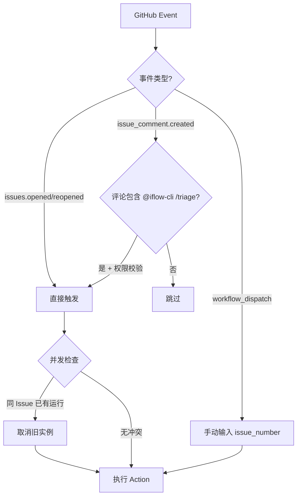
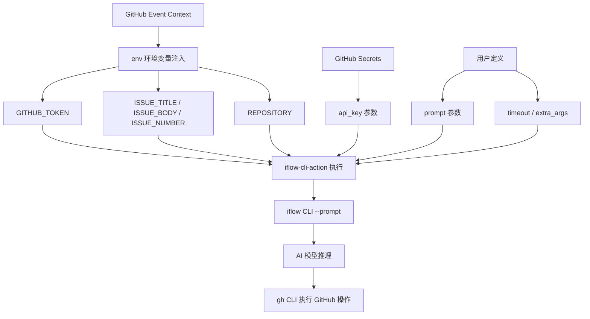

# PD-414.01 iflow-cli — GitHub Actions AI 原生 CI/CD 集成

> 文档编号：PD-414.01
> 来源：iflow-cli `docs_en/features/action.md`
> GitHub：https://github.com/iflow-ai/iflow-cli.git
> 问题域：PD-414 CI/CD 自动化集成
> 状态：可复用方案

---

## 第 1 章 问题与动机（≥ 30 行）

### 1.1 核心问题

传统 CI/CD 流水线依赖硬编码的脚本逻辑——lint 规则、测试命令、部署步骤都是预先写死的。当需要"理解"代码内容（如 Issue 分类、PR 审查、代码风格检查）时，传统方案要么依赖正则匹配，要么需要大量自定义脚本。

AI 原生 CI/CD 的核心问题是：**如何将 LLM 的理解能力无缝嵌入 GitHub Actions 工作流，同时保持安全性、可配置性和成本可控？**

具体子问题包括：
1. **Action 封装**：如何将 CLI 工具包装为标准 GitHub Action，降低接入门槛
2. **认证安全**：如何在 CI 环境中安全传递 API 密钥，避免泄露
3. **Prompt 驱动**：如何让用户通过自然语言 prompt 定义 CI 任务，而非硬编码脚本
4. **事件触发**：如何响应 GitHub 事件（Issue 创建、PR 提交、评论触发）自动执行 AI 任务
5. **并发控制**：如何防止同一 Issue/PR 的多个工作流实例冲突
6. **失败处理**：如何在 AI 执行失败时提供有意义的反馈

### 1.2 iflow-cli 的解法概述

iflow-cli 通过 `iflow-cli-action`（发布在 GitHub Actions Marketplace）提供了一套完整的 AI 原生 CI/CD 方案：

1. **官方 Action 封装**：`vibe-ideas/iflow-cli-action@main` 作为标准 GitHub Action，封装了 CLI 安装、认证、执行的全流程（`docs_en/features/action.md:66`）
2. **Secret 认证链**：通过 `secrets.IFLOW_API_KEY` + `secrets.GITHUB_TOKEN` 双密钥体系，分离 AI 服务认证和 GitHub API 认证（`docs_en/features/action.md:69-76`）
3. **Prompt 参数化**：Action 的 `prompt` 参数接受多行 YAML 字符串，用户用自然语言定义 AI 任务的角色、步骤和约束（`docs_en/features/action.md:78-106`）
4. **多事件触发**：支持 `issues.opened`、`issue_comment.created`、`workflow_dispatch` 等多种触发方式，包括评论中 `@iflow-cli /triage` 的人工触发（`docs_en/features/action.md:22-34`）
5. **并发互斥**：通过 `concurrency.group` + `cancel-in-progress: true` 确保同一 Issue 只有一个工作流实例运行（`docs_en/features/action.md:36-38`）
6. **失败回调**：通过 `actions/github-script` 在 AI 执行失败时自动在 Issue 中评论错误信息和日志链接（`docs_en/features/action.md:107-119`）

### 1.3 设计思想

| 设计原则 | 具体实现 | 理由 | 替代方案 |
|----------|----------|------|----------|
| Prompt-as-Code | prompt 直接写在 YAML workflow 文件中 | 版本控制、可审查、可复用 | 外部 prompt 文件引用 |
| 双密钥分离 | IFLOW_API_KEY（AI 服务）+ GITHUB_TOKEN（GitHub API） | 最小权限原则，各司其职 | 单一 token 统一认证 |
| 评论触发 | `@iflow-cli /triage` 评论触发工作流 | 人机协作，按需执行 | 仅自动触发 |
| 项目上下文注入 | IFLOW.md 文件定义项目规范 | AI 理解项目特定规则 | 每次在 prompt 中重复规范 |
| 环境变量桥接 | GitHub 事件数据通过 env 传递给 prompt | 解耦 GitHub API 和 AI prompt | 在 prompt 中硬编码 API 调用 |
| 权限最小化 | `permissions: contents: read, issues: write` | 限制 Action 的 GitHub API 权限 | 使用默认全权限 |

---

## 第 2 章 源码实现分析（≥ 60 行，核心章节）

### 2.1 架构概览

iflow-cli 的 CI/CD 集成架构分为三层：GitHub Events → Action 封装层 → CLI 执行层。

```
┌─────────────────────────────────────────────────────────┐
│                    GitHub Events                         │
│  issues.opened │ issue_comment │ pull_request │ dispatch │
└────────┬────────────────┬──────────────┬────────────────┘
         │                │              │
         ▼                ▼              ▼
┌─────────────────────────────────────────────────────────┐
│              iflow-cli-action (Action 封装层)            │
│  ┌──────────┐  ┌──────────┐  ┌──────────────────────┐  │
│  │ api_key  │  │ timeout  │  │ prompt (自然语言任务) │  │
│  │ (Secret) │  │ (3600s)  │  │ + extra_args         │  │
│  └────┬─────┘  └────┬─────┘  └──────────┬───────────┘  │
│       │              │                   │              │
│       ▼              ▼                   ▼              │
│  ┌──────────────────────────────────────────────────┐   │
│  │  iflow CLI 进程 (--prompt + --debug)             │   │
│  │  ├─ 认证: IFLOW_API_KEY                          │   │
│  │  ├─ 上下文: IFLOW.md + env vars                  │   │
│  │  ├─ 工具: gh CLI (issues/PR 操作)                │   │
│  │  └─ 模型: Qwen3-Coder / Kimi K2 / DeepSeek v3   │   │
│  └──────────────────────────────────────────────────┘   │
└─────────────────────────────────────────────────────────┘
         │
         ▼
┌─────────────────────────────────────────────────────────┐
│              GitHub API (通过 gh CLI)                     │
│  gh issue edit │ gh label list │ gh pr review            │
└─────────────────────────────────────────────────────────┘
```

### 2.2 核心实现

#### 2.2.1 工作流事件触发与并发控制



对应源码 `docs_en/features/action.md:18-59`：

```yaml
on:
  issues:
    types: ['opened', 'reopened']
  issue_comment:
    types: ['created']
  workflow_dispatch:
    inputs:
      issue_number:
        description: 'issue number to triage'
        required: true
        type: 'number'

concurrency:
  group: '${{ github.workflow }}-${{ github.event.issue.number }}'
  cancel-in-progress: true

jobs:
  triage-issue:
    if: |-
      github.event_name == 'issues' ||
      github.event_name == 'workflow_dispatch' ||
      (
        github.event_name == 'issue_comment' &&
        contains(github.event.comment.body, '@iflow-cli /triage') &&
        contains(fromJSON('["OWNER", "MEMBER", "COLLABORATOR"]'),
                 github.event.comment.author_association)
      )
    timeout-minutes: 5
    runs-on: 'ubuntu-latest'
```

关键设计点：
- **三路触发**：Issue 创建/重开自动触发、评论 `@iflow-cli /triage` 人工触发、workflow_dispatch 手动触发
- **权限守卫**：评论触发时校验 `author_association` 必须是 OWNER/MEMBER/COLLABORATOR，防止外部用户滥用
- **并发互斥**：`concurrency.group` 按 workflow 名 + Issue 编号分组，`cancel-in-progress` 取消旧实例

#### 2.2.2 Action 参数与环境变量桥接



对应源码 `docs_en/features/action.md:65-106`：

```yaml
- name: 'Run iFlow CLI Issue Triage'
  uses: vibe-ideas/iflow-cli-action@main
  id: 'iflow_cli_issue_triage'
  env:
    GITHUB_TOKEN: '${{ secrets.GITHUB_TOKEN }}'
    ISSUE_TITLE: '${{ github.event.issue.title }}'
    ISSUE_BODY: '${{ github.event.issue.body }}'
    ISSUE_NUMBER: '${{ github.event.issue.number }}'
    REPOSITORY: '${{ github.repository }}'
  with:
    api_key: ${{ secrets.IFLOW_API_KEY }}
    timeout: "3600"
    extra_args: "--debug"
    prompt: |
      ## Role
      You are an issue triage assistant. Analyze the current GitHub issue
      and apply the most appropriate existing labels.
      ## Steps
      1. Run: `gh label list` to get all available labels.
      2. Review the issue title and body provided in the environment
         variables: "${ISSUE_TITLE}" and "${ISSUE_BODY}".
      3. Classify issues by their kind (bug, enhancement, documentation,
         cleanup, etc) and their priority (p0, p1, p2, p3).
      4. Apply the selected labels to this issue using:
         `gh issue edit "${ISSUE_NUMBER}" --add-label "label1,label2"`
      5. If the "status/needs-triage" label is present, remove it.
```

关键设计点：
- **环境变量桥接**：GitHub 事件数据（Issue 标题、正文、编号）通过 `env` 注入为环境变量，prompt 中通过 `${VAR}` 引用
- **Prompt 结构化**：prompt 采用 Role-Steps-Guidelines 三段式结构，给 AI 明确的角色定位、执行步骤和约束条件
- **工具链复用**：AI 通过 `gh` CLI 操作 GitHub API，复用 `GITHUB_TOKEN` 认证，无需额外 API 封装

### 2.3 实现细节

#### 2.3.1 失败回调机制

当 AI 执行失败时，通过 `actions/github-script` 自动在 Issue 中发布错误评论（`docs_en/features/action.md:107-119`）：

```yaml
- name: 'Post Issue Triage Failure Comment'
  if: ${{ failure() && steps.iflow_cli_issue_triage.outcome == 'failure' }}
  uses: 'actions/github-script@60a0d83039c74a4aee543508d2ffcb1c3799cdea'
  with:
    github-token: '${{ secrets.GITHUB_TOKEN }}'
    script: |-
      github.rest.issues.createComment({
        owner: '${{ github.repository }}'.split('/')[0],
        repo: '${{ github.repository }}'.split('/')[1],
        issue_number: '${{ github.event.issue.number }}',
        body: 'There is a problem with the iFlow CLI issue triaging. Please check the [action logs](...) for details.'
      })
```

#### 2.3.2 IFLOW.md 项目上下文注入

iflow-cli 通过 `IFLOW.md` 文件为 AI 提供项目级上下文（`IFLOW.md:1-91`）。在 CI/CD 场景中，`actions/checkout@v4` 先检出代码，CLI 自动加载仓库根目录的 `IFLOW.md`，使 AI 理解项目的代码风格、审查标准和特定规则。

这种设计实现了 **Prompt = 任务指令 + 项目上下文** 的分离：
- `prompt` 参数：定义当前 CI 任务的具体步骤
- `IFLOW.md`：定义项目的长期规范和背景知识

#### 2.3.3 多模型支持与环境变量配置

iflow-cli 支持通过环境变量在 CI 中切换模型（`docs_en/configuration/settings.md:142-149`）：

```yaml
# 在 GitHub Actions 中通过环境变量配置
env:
  IFLOW_apiKey: "${{ secrets.API_KEY }}"
  IFLOW_baseUrl: "${{ vars.API_URL }}"
  IFLOW_modelName: "Qwen3-Coder"
```

支持 Kimi K2、Qwen3 Coder、DeepSeek v3 等多个模型，且兼容 OpenAI 协议的任意模型服务商。

#### 2.3.4 Hook 系统与 CI 扩展

iflow-cli 的 9 类 Hook（`docs_en/examples/hooks.md:22-273`）在 CI 场景中可用于：
- `PreToolUse`：在 AI 执行文件修改前进行安全检查
- `PostToolUse`：在工具执行后自动格式化代码
- `UserPromptSubmit`：过滤 prompt 中的敏感信息
- `Notification`：将 AI 执行通知转发到 Slack/邮件


---

## 第 3 章 迁移指南（≥ 40 行）

### 3.1 迁移清单

#### 阶段 1：基础接入（30 分钟）

- [ ] 获取 iFlow API Key（或配置 OpenAI 兼容的 API Key）
- [ ] 在 GitHub 仓库 Settings → Secrets 中添加 `IFLOW_API_KEY`
- [ ] 创建 `.github/workflows/ai-triage.yml` 工作流文件
- [ ] 在仓库根目录创建 `IFLOW.md` 定义项目规范

#### 阶段 2：Prompt 工程（1-2 小时）

- [ ] 设计 Issue 分类的 prompt（Role + Steps + Guidelines）
- [ ] 设计 PR 审查的 prompt
- [ ] 测试 prompt 在不同类型 Issue/PR 上的效果
- [ ] 调整 prompt 中的标签分类规则

#### 阶段 3：生产加固

- [ ] 配置 `concurrency` 防止并发冲突
- [ ] 添加 `timeout-minutes` 防止 AI 无限执行
- [ ] 添加失败回调（github-script 评论错误信息）
- [ ] 配置评论触发的权限守卫（author_association 校验）
- [ ] 设置 `permissions` 最小权限

#### 阶段 4：高级扩展

- [ ] 配置 IFLOW.md 的 `@import` 模块化引用
- [ ] 通过 Hook 系统添加安全检查和通知
- [ ] 接入 SDK 实现自定义 CI 脚本
- [ ] 配置多模型切换策略

### 3.2 适配代码模板

#### 模板 1：Issue 自动分类 Action

```yaml
name: 'AI Issue Triage'
on:
  issues:
    types: ['opened', 'reopened']
  issue_comment:
    types: ['created']

concurrency:
  group: '${{ github.workflow }}-${{ github.event.issue.number }}'
  cancel-in-progress: true

permissions:
  contents: read
  issues: write

jobs:
  triage:
    if: |-
      github.event_name == 'issues' ||
      (github.event_name == 'issue_comment' &&
       contains(github.event.comment.body, '@ai-bot /triage') &&
       contains(fromJSON('["OWNER","MEMBER","COLLABORATOR"]'),
                github.event.comment.author_association))
    timeout-minutes: 5
    runs-on: ubuntu-latest
    steps:
      - uses: actions/checkout@v4
      - uses: vibe-ideas/iflow-cli-action@main
        id: triage
        env:
          GITHUB_TOKEN: '${{ secrets.GITHUB_TOKEN }}'
          ISSUE_TITLE: '${{ github.event.issue.title }}'
          ISSUE_BODY: '${{ github.event.issue.body }}'
          ISSUE_NUMBER: '${{ github.event.issue.number }}'
        with:
          api_key: '${{ secrets.IFLOW_API_KEY }}'
          timeout: '300'
          prompt: |
            You are an issue triage assistant.
            1. Run `gh label list` to get available labels.
            2. Analyze "${ISSUE_TITLE}" and "${ISSUE_BODY}".
            3. Apply labels: `gh issue edit "${ISSUE_NUMBER}" --add-label "kind/bug,priority/p1"`
      - if: failure()
        uses: actions/github-script@v7
        with:
          script: |
            github.rest.issues.createComment({
              ...context.repo,
              issue_number: context.issue.number,
              body: '⚠️ AI triage failed. [View logs](${{ github.server_url }}/${{ github.repository }}/actions/runs/${{ github.run_id }})'
            })
```

#### 模板 2：PR 代码审查 Action

```yaml
name: 'AI PR Review'
on:
  pull_request:
    types: ['opened', 'synchronize']

permissions:
  contents: read
  pull-requests: write

jobs:
  review:
    timeout-minutes: 10
    runs-on: ubuntu-latest
    steps:
      - uses: actions/checkout@v4
        with:
          fetch-depth: 0
      - uses: vibe-ideas/iflow-cli-action@main
        env:
          GITHUB_TOKEN: '${{ secrets.GITHUB_TOKEN }}'
          PR_NUMBER: '${{ github.event.pull_request.number }}'
        with:
          api_key: '${{ secrets.IFLOW_API_KEY }}'
          timeout: '600'
          prompt: |
            You are a code reviewer. Review PR #${PR_NUMBER}.
            1. Run `gh pr diff ${PR_NUMBER}` to see changes.
            2. Analyze code quality, security, and best practices.
            3. Post review: `gh pr review ${PR_NUMBER} --comment --body "your review"`
```

#### 模板 3：通用 Prompt 驱动模式（适配任意 AI CLI）

```python
# generic_ai_action.py — 不依赖 iflow-cli 的通用实现
import subprocess
import os
import sys

def run_ai_ci_task(prompt: str, api_key: str, model: str = "gpt-4"):
    """通用 AI CI/CD 任务执行器"""
    env = {
        **os.environ,
        "AI_API_KEY": api_key,
        "AI_MODEL": model,
    }

    # 方案 A：调用 iflow CLI
    result = subprocess.run(
        ["iflow", "--prompt", prompt, "--yolo"],
        env=env,
        capture_output=True,
        text=True,
        timeout=300,
    )

    if result.returncode != 0:
        print(f"AI task failed: {result.stderr}", file=sys.stderr)
        # 通过 gh CLI 发布失败评论
        subprocess.run([
            "gh", "issue", "comment",
            os.environ.get("ISSUE_NUMBER", ""),
            "--body", f"AI task failed: {result.stderr[:500]}"
        ])
        sys.exit(1)

    return result.stdout

if __name__ == "__main__":
    prompt = os.environ.get("AI_PROMPT", "")
    api_key = os.environ.get("IFLOW_API_KEY", "")
    run_ai_ci_task(prompt, api_key)
```

### 3.3 适用场景

| 场景 | 适用度 | 说明 |
|------|--------|------|
| Issue 自动分类/打标签 | ⭐⭐⭐ | 最成熟的用例，prompt 模板可直接复用 |
| PR 代码审查 | ⭐⭐⭐ | 通过 `gh pr diff` 获取变更，AI 分析后评论 |
| 文档自动生成 | ⭐⭐ | 适合 CHANGELOG、API 文档等结构化文档 |
| 安全漏洞扫描 | ⭐⭐ | AI 辅助分析，但不能替代专业安全工具 |
| 自动修复 lint 错误 | ⭐ | 需要 write 权限，风险较高，建议人工审查 |
| 发布流程自动化 | ⭐⭐ | 适合版本号计算、release notes 生成 |

---

## 第 4 章 测试用例（≥ 20 行）

```python
import pytest
import yaml
import json
from unittest.mock import patch, MagicMock
from pathlib import Path


class TestIflowCIWorkflow:
    """测试 iflow-cli GitHub Actions CI/CD 集成"""

    def test_workflow_yaml_structure(self):
        """验证工作流 YAML 结构完整性"""
        workflow = {
            "name": "AI Issue Triage",
            "on": {
                "issues": {"types": ["opened", "reopened"]},
                "issue_comment": {"types": ["created"]},
            },
            "concurrency": {
                "group": "triage-42",
                "cancel-in-progress": True,
            },
            "permissions": {"contents": "read", "issues": "write"},
        }
        assert "concurrency" in workflow
        assert workflow["concurrency"]["cancel-in-progress"] is True
        assert workflow["permissions"]["contents"] == "read"

    def test_event_trigger_conditions(self):
        """验证事件触发条件逻辑"""
        def should_trigger(event_name, comment_body="", author_assoc=""):
            if event_name == "issues":
                return True
            if event_name == "workflow_dispatch":
                return True
            if event_name == "issue_comment":
                return (
                    "@iflow-cli /triage" in comment_body
                    and author_assoc in ["OWNER", "MEMBER", "COLLABORATOR"]
                )
            return False

        assert should_trigger("issues") is True
        assert should_trigger("workflow_dispatch") is True
        assert should_trigger("issue_comment", "@iflow-cli /triage", "OWNER") is True
        assert should_trigger("issue_comment", "@iflow-cli /triage", "NONE") is False
        assert should_trigger("issue_comment", "random comment", "OWNER") is False

    def test_concurrency_group_isolation(self):
        """验证并发组按 Issue 编号隔离"""
        def make_group(workflow_name, issue_number):
            return f"{workflow_name}-{issue_number}"

        g1 = make_group("triage", 42)
        g2 = make_group("triage", 43)
        g3 = make_group("triage", 42)
        assert g1 != g2  # 不同 Issue 不同组
        assert g1 == g3  # 同一 Issue 同一组

    def test_env_variable_bridging(self):
        """验证环境变量桥接到 prompt"""
        env = {
            "GITHUB_TOKEN": "ghp_xxx",
            "ISSUE_TITLE": "Bug: login fails",
            "ISSUE_BODY": "Steps to reproduce...",
            "ISSUE_NUMBER": "42",
            "REPOSITORY": "org/repo",
        }
        prompt_template = 'Analyze "${ISSUE_TITLE}" and "${ISSUE_BODY}"'
        # 模拟 shell 变量替换
        resolved = prompt_template
        for key, val in env.items():
            resolved = resolved.replace(f'"${{{key}}}"', f'"{val}"')
        assert "Bug: login fails" in resolved
        assert "Steps to reproduce" in resolved

    def test_secret_not_in_prompt(self):
        """验证 API 密钥不出现在 prompt 中"""
        prompt = """You are an issue triage assistant.
        1. Run: gh label list
        2. Review the issue title: "${ISSUE_TITLE}"
        3. Apply labels using gh issue edit"""
        assert "IFLOW_API_KEY" not in prompt
        assert "secret" not in prompt.lower()
        assert "api_key" not in prompt.lower()

    def test_failure_callback_structure(self):
        """验证失败回调评论结构"""
        def build_failure_comment(repo, run_id, server_url="https://github.com"):
            return (
                f"There is a problem with the iFlow CLI issue triaging. "
                f"Please check the [action logs]"
                f"({server_url}/{repo}/actions/runs/{run_id}) for details."
            )
        comment = build_failure_comment("org/repo", "12345")
        assert "action logs" in comment
        assert "org/repo/actions/runs/12345" in comment

    def test_permission_minimization(self):
        """验证权限最小化原则"""
        permissions = {"contents": "read", "issues": "write", "statuses": "write"}
        # 不应有 admin 权限
        assert "admin" not in permissions.values()
        # contents 应为只读
        assert permissions["contents"] == "read"
```


---

## 第 5 章 跨域关联

| 关联域 | 关系类型 | 说明 |
|--------|----------|------|
| PD-01 上下文管理 | 协同 | IFLOW.md 分层加载机制为 CI 中的 AI 提供项目上下文，`compressionTokenThreshold` 控制自动压缩 |
| PD-04 工具系统 | 依赖 | Action 中 AI 通过 `gh` CLI 工具操作 GitHub API，工具权限通过 `coreTools` 配置限制 |
| PD-09 Human-in-the-Loop | 协同 | 评论触发 `@iflow-cli /triage` 实现人机协作，`author_association` 权限守卫防止滥用 |
| PD-10 中间件管道 | 协同 | Hook 系统（PreToolUse/PostToolUse）可在 CI 中拦截和增强 AI 的工具调用 |
| PD-11 可观测性 | 协同 | `telemetry` 配置支持 OTLP 导出，`--debug` 参数在 CI 中启用详细日志 |
| PD-03 容错与重试 | 协同 | `timeout-minutes` 超时保护 + 失败回调评论 + `cancel-in-progress` 并发控制 |

---

## 第 6 章 来源文件索引

| 文件 | 行范围 | 关键实现 |
|------|--------|----------|
| `docs_en/features/action.md` | L1-L149 | GitHub Actions 集成完整文档，含工作流 YAML 模板 |
| `docs_en/features/action.md` | L18-L59 | 事件触发、并发控制、权限配置 |
| `docs_en/features/action.md` | L65-L106 | Action 参数、环境变量桥接、Prompt 定义 |
| `docs_en/features/action.md` | L107-L119 | 失败回调机制（github-script 评论） |
| `docs_en/features/action.md` | L130-L138 | IFLOW.md 项目上下文 + 安全最佳实践 |
| `docs_en/configuration/settings.md` | L142-L149 | CI/CD 环境变量配置示例 |
| `docs_en/examples/hooks.md` | L22-L273 | 9 类 Hook 系统定义与 CI 扩展场景 |
| `docs_en/examples/workflow.md` | L1-L156 | Workflow 工作流引擎架构 |
| `docs_en/sdk/sdk-python.md` | L1-L447 | Python SDK（ACP 协议）用于自定义 CI 脚本 |
| `IFLOW.md` | L1-L91 | 项目上下文文件规范 |
| `README.md` | L229-L231 | GitHub Actions 集成入口说明 |

---

## 第 7 章 横向对比维度

> **重要：** 本章用于自动填充 Butcher Wiki 的横向对比表。

```json comparison_data
{
  "project": "iflow-cli",
  "dimensions": {
    "CI 触发方式": "三路触发：Issue 事件 + 评论 @mention + workflow_dispatch 手动",
    "认证机制": "双密钥分离：IFLOW_API_KEY（AI 服务）+ GITHUB_TOKEN（GitHub API）",
    "任务定义方式": "Prompt-as-Code：自然语言 prompt 直接写在 YAML workflow 中",
    "并发控制": "concurrency group 按 Issue 编号分组 + cancel-in-progress",
    "失败处理": "github-script 自动评论错误信息 + Action 日志链接",
    "项目上下文": "IFLOW.md 分层加载 + @import 模块化引用",
    "模型支持": "多模型切换：Qwen3-Coder/Kimi K2/DeepSeek v3 + OpenAI 兼容协议",
    "扩展机制": "9 类 Hook 系统 + Python SDK（ACP 协议）+ Workflow 引擎"
  }
}
```

### 域元数据补充

```json domain_metadata
{
  "solution_summary": "iflow-cli 通过 iflow-cli-action 封装 + Prompt-as-Code + 双密钥分离 + IFLOW.md 项目上下文注入，实现 AI 原生 GitHub Actions 自动化",
  "description": "AI CLI 工具如何通过 Action 封装、Prompt 参数化和项目上下文注入实现 CI/CD 自动化",
  "sub_problems": [
    "评论触发的权限守卫与滥用防护",
    "并发工作流实例的互斥与取消策略",
    "项目上下文文件（IFLOW.md）的分层加载与 CI 注入"
  ],
  "best_practices": [
    "环境变量桥接 GitHub 事件数据到 AI prompt",
    "失败回调自动评论错误信息和日志链接",
    "Prompt 采用 Role-Steps-Guidelines 三段式结构"
  ]
}
```

