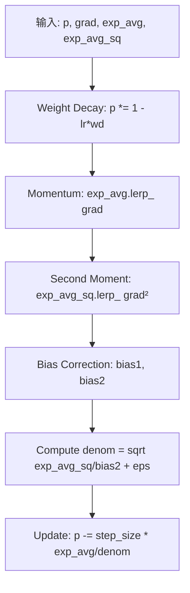
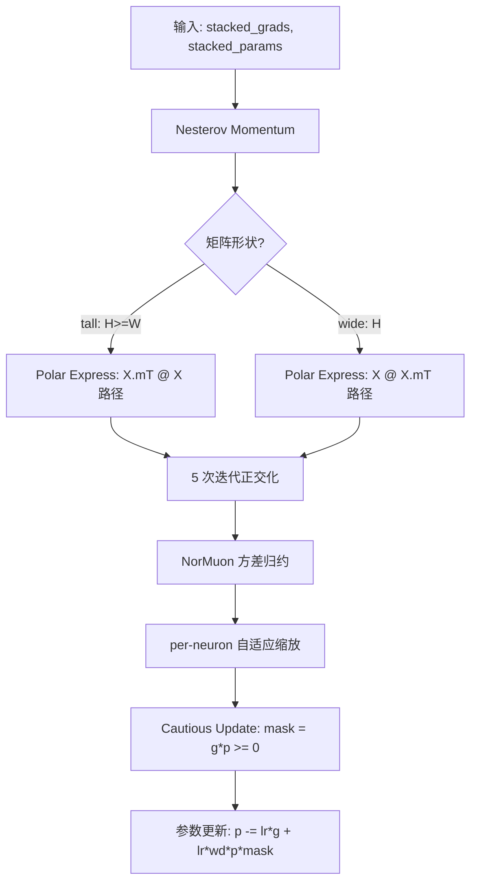
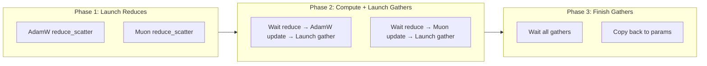

# PD-421.01 nanochat — Muon+AdamW 混合优化器

> 文档编号：PD-421.01
> 来源：nanochat `nanochat/optim.py`, `nanochat/gpt.py`
> GitHub：https://github.com/karpathy/nanochat.git
> 问题域：PD-421 高级优化器设计 Advanced Optimizer Design
> 状态：可复用方案

---

## 第 1 章 问题与动机

### 1.1 核心问题

LLM 训练中，不同类型的参数有截然不同的优化特性：

- **矩阵参数**（注意力 QKV、MLP 权重）：高维、可正交化，适合二阶近似方法
- **嵌入参数**（token embedding、value embedding）：稀疏更新，需要自适应学习率
- **标量参数**（per-layer lambda）：低维，对学习率极敏感

传统做法是对所有参数统一使用 AdamW，但这忽略了矩阵参数的几何结构。Muon（MomentUm Orthogonalized by Newton-schulz）利用正交化将梯度投影到最近正交矩阵，在矩阵参数上显著优于 AdamW，但不适用于嵌入和标量。

核心挑战：如何在一个优化器中同时支持两种策略，且不引入 Python 循环开销？

### 1.2 nanochat 的解法概述

nanochat 实现了 `MuonAdamW` 混合优化器，核心设计：

1. **参数路由**：按 `kind='adamw'|'muon'` 字段分组，矩阵参数走 Muon，其余走 AdamW（`nanochat/gpt.py:366-380`）
2. **Polar Express 正交化**：替代传统 Newton-Schulz 迭代，用预计算的五次多项式系数实现更快收敛（`nanochat/optim.py:80-88`）
3. **NorMuon 方差归约**：正交化后 per-neuron 自适应缩放，消除更新尺度不均匀（`nanochat/optim.py:129-140`）
4. **Cautious 更新**：只在梯度与参数同号时施加权重衰减，避免破坏已学到的特征（`nanochat/optim.py:142-146`）
5. **torch.compile 融合**：整个 step 编译为单一 CUDA kernel，0-D CPU tensor 传递超参避免重编译（`nanochat/optim.py:20-21, 90-91`）

### 1.3 设计思想

| 设计原则 | 具体实现 | 理由 | 替代方案 |
|----------|----------|------|----------|
| 参数类型感知 | `kind` 字段路由到不同优化算法 | 矩阵参数有正交结构可利用 | 统一 AdamW（浪费几何信息） |
| 编译友好 | 0-D CPU tensor 传超参，`dynamic=False` | 避免值变化触发重编译 | Python 标量（每次值变都重编译） |
| 单 kernel 融合 | momentum→polar→variance→update 一次编译 | 消除 4 次 kernel launch 开销 | 分步调用（4 次 launch + 中间内存） |
| 形状分组堆叠 | 同形状矩阵参数 stack 为 3D tensor | 一次 kernel 处理所有同形状参数 | 逐参数循环（N 次 kernel launch） |
| 分布式通信重叠 | 3-phase async: reduce→compute→gather | 通信与计算并行，隐藏延迟 | 同步 all-reduce（阻塞等待） |

---

## 第 2 章 源码实现分析

### 2.1 架构概览

nanochat 的优化器架构分为三层：融合内核层、单 GPU 优化器层、分布式优化器层。

```
┌─────────────────────────────────────────────────────────┐
│                    GPT.setup_optimizer()                  │
│  参数分组: embedding→AdamW, matrix→Muon(按shape分组)      │
└──────────────────────┬──────────────────────────────────┘
                       │
          ┌────────────┴────────────┐
          │                         │
  ┌───────▼────────┐     ┌─────────▼──────────┐
  │   MuonAdamW    │     │   DistMuonAdamW    │
  │  (单 GPU 版)    │     │  (分布式版)         │
  │  step():       │     │  step():           │
  │  for group:    │     │  Phase1: reduce    │
  │    adamw/muon  │     │  Phase2: compute   │
  └───────┬────────┘     │  Phase3: gather    │
          │              └─────────┬──────────┘
          │                        │
  ┌───────▼────────────────────────▼──────────┐
  │          Fused Kernel Layer                │
  │  adamw_step_fused()  muon_step_fused()    │
  │  @torch.compile(dynamic=False)            │
  │  0-D CPU tensors for hyperparameters      │
  └───────────────────────────────────────────┘
```

### 2.2 核心实现

#### 2.2.1 AdamW 融合内核



对应源码 `nanochat/optim.py:20-49`：

```python
@torch.compile(dynamic=False, fullgraph=True)
def adamw_step_fused(
    p: Tensor,              # (32768, 768) - parameter tensor
    grad: Tensor,           # (32768, 768) - gradient, same shape as p
    exp_avg: Tensor,        # (32768, 768) - first moment, same shape as p
    exp_avg_sq: Tensor,     # (32768, 768) - second moment, same shape as p
    step_t: Tensor,         # () - 0-D CPU tensor, step count
    lr_t: Tensor,           # () - 0-D CPU tensor, learning rate
    beta1_t: Tensor,        # () - 0-D CPU tensor, beta1
    beta2_t: Tensor,        # () - 0-D CPU tensor, beta2
    eps_t: Tensor,          # () - 0-D CPU tensor, epsilon
    wd_t: Tensor,           # () - 0-D CPU tensor, weight decay
) -> None:
    # Weight decay (decoupled, applied before the update)
    p.mul_(1 - lr_t * wd_t)
    # Update running averages (lerp_ is cleaner and fuses well)
    exp_avg.lerp_(grad, 1 - beta1_t)
    exp_avg_sq.lerp_(grad.square(), 1 - beta2_t)
    # Bias corrections
    bias1 = 1 - beta1_t ** step_t
    bias2 = 1 - beta2_t ** step_t
    # Compute update and apply
    denom = (exp_avg_sq / bias2).sqrt() + eps_t
    step_size = lr_t / bias1
    p.add_(exp_avg / denom, alpha=-step_size)
```

关键技巧：所有超参数通过 0-D CPU tensor 传入（`step_t`, `lr_t` 等），值变化时只需 `fill_()` 更新，不触发 `torch.compile` 重编译。

#### 2.2.2 Muon 融合内核（Polar Express + NorMuon + Cautious）



对应源码 `nanochat/optim.py:90-147`：

```python
@torch.compile(dynamic=False, fullgraph=True)
def muon_step_fused(
    stacked_grads: Tensor,          # (12, 768, 3072) - stacked gradients
    stacked_params: Tensor,         # (12, 768, 3072) - stacked parameters
    momentum_buffer: Tensor,        # (12, 768, 3072) - first moment buffer
    second_momentum_buffer: Tensor, # (12, 768, 1) or (12, 1, 3072) - factored second moment
    momentum_t: Tensor,             # () - 0-D CPU tensor
    lr_t: Tensor,                   # () - 0-D CPU tensor
    wd_t: Tensor,                   # () - 0-D CPU tensor
    beta2_t: Tensor,                # () - 0-D CPU tensor
    ns_steps: int,                  # 5 - number of Polar Express iterations
    red_dim: int,                   # -1 or -2 - reduction dimension
) -> None:
    # Nesterov momentum
    momentum = momentum_t.to(stacked_grads.dtype)
    momentum_buffer.lerp_(stacked_grads, 1 - momentum)
    g = stacked_grads.lerp_(momentum_buffer, momentum)

    # Polar Express orthogonalization
    X = g.bfloat16()
    X = X / (X.norm(dim=(-2, -1), keepdim=True) * 1.02 + 1e-6)
    if g.size(-2) > g.size(-1):  # Tall matrix
        for a, b, c in polar_express_coeffs[:ns_steps]:
            A = X.mT @ X
            B = b * A + c * (A @ A)
            X = a * X + X @ B
    else:  # Wide matrix
        for a, b, c in polar_express_coeffs[:ns_steps]:
            A = X @ X.mT
            B = b * A + c * (A @ A)
            X = a * X + B @ X
    g = X

    # NorMuon variance reduction
    beta2 = beta2_t.to(g.dtype)
    v_mean = g.float().square().mean(dim=red_dim, keepdim=True)
    # ... (adaptive scaling per neuron/column)

    # Cautious weight decay + parameter update
    lr = lr_t.to(g.dtype)
    wd = wd_t.to(g.dtype)
    mask = (g * stacked_params) >= 0
    stacked_params.sub_(lr * g + lr * wd * stacked_params * mask)
```

### 2.3 实现细节

#### 参数分组与形状堆叠

`GPT.setup_optimizer()` (`nanochat/gpt.py:348-386`) 将参数分为 6 组：

```python
# AdamW 组（5 组，各有独立学习率）
param_groups = [
    dict(kind='adamw', params=lm_head_params, lr=unembedding_lr * dmodel_lr_scale, ...),
    dict(kind='adamw', params=embedding_params, lr=embedding_lr * dmodel_lr_scale, ...),
    dict(kind='adamw', params=value_embeds_params, lr=embedding_lr * dmodel_lr_scale, ...),
    dict(kind='adamw', params=resid_params, lr=scalar_lr * 0.01, ...),
    dict(kind='adamw', params=x0_params, lr=scalar_lr, betas=(0.96, 0.95), ...),
]
# Muon 组（按形状分组，同形状参数 stack 为一个 3D tensor）
for shape in sorted({p.shape for p in matrix_params}):
    group_params = [p for p in matrix_params if p.shape == shape]
    param_groups.append(dict(kind='muon', params=group_params, lr=matrix_lr, ...))
```

Muon 按形状分组的关键意义：同形状参数 `torch.stack` 为 `(N, H, W)` 3D tensor，一次 kernel 调用处理所有 N 个参数，避免 N 次独立 kernel launch。

#### Polar Express 系数

预计算的五次多项式系数（`nanochat/optim.py:82-88`）来自论文 https://arxiv.org/pdf/2505.16932，针对 `num_iters=5, safety_factor=2e-2, cushion=2` 优化。相比传统 Newton-Schulz 迭代，Polar Express 在相同迭代次数下收敛更快，且数值更稳定。

#### 分布式 3-phase 异步通信

`DistMuonAdamW.step()` (`nanochat/optim.py:507-533`) 实现三阶段流水线：



- **AdamW 大参数**：reduce_scatter 梯度 → 每 rank 只更新 1/N 切片（ZeRO-2 风格）→ all_gather 更新后参数
- **AdamW 小参数**（<1024 元素）：all_reduce 梯度 → 每 rank 更新完整参数（状态复制但参数极小）
- **Muon 参数**：stack 所有同形状参数 → reduce_scatter → 每 rank 计算 ceil(K/N) 个参数 → all_gather
- **Buffer 复用**：Muon 的 `stacked_grads` buffer 在 reduce_scatter 后被复用为 all_gather 的输出 buffer（`nanochat/optim.py:494-496`）

#### 学习率缩放与调度

训练脚本 (`scripts/base_train.py:282-369`) 实现多层缩放：

1. **muP 缩放**：AdamW 学习率 ∝ 1/√(d_model/768)（`nanochat/gpt.py:362`）
2. **批量缩放**：η ∝ √(B/B_ref)，B_ref=524288（`scripts/base_train.py:288`）
3. **权重衰减缩放**：λ = λ_ref · √(B/B_ref) · (D_ref/D)，保持 T_epoch 不变（`scripts/base_train.py:297`）
4. **Muon momentum 预热**：0.85 → 0.95 over 300 steps（`scripts/base_train.py:362-365`）
5. **权重衰减线性衰减**：训练过程中线性衰减到 0（`scripts/base_train.py:368-369`）

---

## 第 3 章 迁移指南

### 3.1 迁移清单

**阶段 1：基础融合内核（1 个文件）**

- [ ] 复制 `adamw_step_fused()` 和 `muon_step_fused()` 两个函数
- [ ] 复制 `polar_express_coeffs` 系数表
- [ ] 确保 `torch.compile` 可用（PyTorch >= 2.0）

**阶段 2：单 GPU 优化器**

- [ ] 实现 `MuonAdamW` 类，包含 `_step_adamw()` 和 `_step_muon()` 方法
- [ ] 在模型中实现参数分组逻辑（按 `kind` 字段区分）
- [ ] 确保 Muon 组内所有参数形状相同（同形状 stack）

**阶段 3：分布式支持（可选）**

- [ ] 实现 `DistMuonAdamW`，添加 3-phase async 通信
- [ ] 处理 padding（参数数量不整除 world_size 时补零）
- [ ] 实现 buffer 复用（reduce_scatter 输入 → all_gather 输出）

**阶段 4：调度器集成**

- [ ] 实现 LR warmup/warmdown 调度
- [ ] 实现 Muon momentum 预热（0.85 → 0.95）
- [ ] 实现权重衰减线性衰减

### 3.2 适配代码模板

以下是一个可直接运行的最小化 MuonAdamW 实现模板：

```python
import torch
from torch import Tensor

# Polar Express 系数（直接从 nanochat 复制）
polar_express_coeffs = [
    (8.156554524902461, -22.48329292557795, 15.878769915207462),
    (4.042929935166739, -2.808917465908714, 0.5000178451051316),
    (3.8916678022926607, -2.772484153217685, 0.5060648178503393),
    (3.285753657755655, -2.3681294933425376, 0.46449024233003106),
    (2.3465413258596377, -1.7097828382687081, 0.42323551169305323),
]

@torch.compile(dynamic=False, fullgraph=True)
def adamw_step_fused(p, grad, exp_avg, exp_avg_sq, step_t, lr_t, beta1_t, beta2_t, eps_t, wd_t):
    p.mul_(1 - lr_t * wd_t)
    exp_avg.lerp_(grad, 1 - beta1_t)
    exp_avg_sq.lerp_(grad.square(), 1 - beta2_t)
    bias1 = 1 - beta1_t ** step_t
    bias2 = 1 - beta2_t ** step_t
    denom = (exp_avg_sq / bias2).sqrt() + eps_t
    p.add_(exp_avg / denom, alpha=-(lr_t / bias1))

@torch.compile(dynamic=False, fullgraph=True)
def muon_step_fused(stacked_grads, stacked_params, momentum_buffer,
                     second_momentum_buffer, momentum_t, lr_t, wd_t,
                     beta2_t, ns_steps, red_dim):
    momentum = momentum_t.to(stacked_grads.dtype)
    momentum_buffer.lerp_(stacked_grads, 1 - momentum)
    g = stacked_grads.lerp_(momentum_buffer, momentum)
    # Polar Express
    X = g.bfloat16()
    X = X / (X.norm(dim=(-2, -1), keepdim=True) * 1.02 + 1e-6)
    if g.size(-2) > g.size(-1):
        for a, b, c in polar_express_coeffs[:ns_steps]:
            A = X.mT @ X; B = b * A + c * (A @ A); X = a * X + X @ B
    else:
        for a, b, c in polar_express_coeffs[:ns_steps]:
            A = X @ X.mT; B = b * A + c * (A @ A); X = a * X + B @ X
    g = X
    # Variance reduction
    beta2 = beta2_t.to(g.dtype)
    v_mean = g.float().square().mean(dim=red_dim, keepdim=True)
    red_dim_size = g.size(red_dim)
    v_norm_sq = v_mean.sum(dim=(-2, -1), keepdim=True) * red_dim_size
    v_norm = v_norm_sq.sqrt()
    second_momentum_buffer.lerp_(v_mean.to(dtype=second_momentum_buffer.dtype), 1 - beta2)
    step_size = second_momentum_buffer.clamp_min(1e-10).rsqrt()
    scaled_sq_sum = (v_mean * red_dim_size) * step_size.float().square()
    v_norm_new = scaled_sq_sum.sum(dim=(-2, -1), keepdim=True).sqrt()
    final_scale = step_size * (v_norm / v_norm_new.clamp_min(1e-10))
    g = g * final_scale.to(g.dtype)
    # Cautious update
    lr, wd = lr_t.to(g.dtype), wd_t.to(g.dtype)
    mask = (g * stacked_params) >= 0
    stacked_params.sub_(lr * g + lr * wd * stacked_params * mask)


def setup_muon_adamw(model, matrix_lr=0.02, embedding_lr=0.2, weight_decay=0.0):
    """通用参数分组模板：2D 矩阵参数 → Muon，其余 → AdamW"""
    matrix_params, other_params = [], []
    for name, p in model.named_parameters():
        if p.ndim == 2 and 'embed' not in name and 'head' not in name:
            matrix_params.append(p)
        else:
            other_params.append(p)

    param_groups = [
        dict(kind='adamw', params=other_params, lr=embedding_lr,
             betas=(0.8, 0.95), eps=1e-10, weight_decay=0.0),
    ]
    # 按形状分组 Muon 参数
    for shape in sorted({p.shape for p in matrix_params}):
        group = [p for p in matrix_params if p.shape == shape]
        param_groups.append(dict(
            kind='muon', params=group, lr=matrix_lr,
            momentum=0.95, ns_steps=5, beta2=0.95, weight_decay=weight_decay,
        ))
    return MuonAdamW(param_groups)  # 使用 nanochat 的 MuonAdamW 类
```

### 3.3 适用场景

| 场景 | 适用度 | 说明 |
|------|--------|------|
| LLM 预训练（>100M 参数） | ⭐⭐⭐ | 最佳场景，Muon 在大矩阵上优势明显 |
| LLM 微调（LoRA/全参数） | ⭐⭐ | 全参数微调可用，LoRA 矩阵太小不适合 Muon |
| Vision Transformer | ⭐⭐⭐ | 注意力和 MLP 权重均为矩阵，适合 Muon |
| CNN 模型 | ⭐⭐ | 4D 卷积核需 flatten 后 3 维才能用 Muon |
| 小模型（<10M 参数） | ⭐ | torch.compile 编译开销可能超过收益 |
| 推理/部署 | ❌ | 优化器仅用于训练阶段 |

---

## 第 4 章 测试用例

```python
import pytest
import torch
from nanochat.optim import MuonAdamW, adamw_step_fused, muon_step_fused, polar_express_coeffs


class TestAdamWFused:
    """测试融合 AdamW 内核的正确性"""

    def test_basic_update(self):
        """验证单步 AdamW 更新方向正确"""
        torch.manual_seed(42)
        p = torch.randn(64, 64, device="cpu")
        p_init = p.clone()
        grad = torch.randn_like(p)
        exp_avg = torch.zeros_like(p)
        exp_avg_sq = torch.zeros_like(p)
        # 0-D CPU tensors
        step_t = torch.tensor(1.0)
        lr_t = torch.tensor(0.001)
        beta1_t = torch.tensor(0.9)
        beta2_t = torch.tensor(0.999)
        eps_t = torch.tensor(1e-8)
        wd_t = torch.tensor(0.0)
        adamw_step_fused(p, grad, exp_avg, exp_avg_sq,
                         step_t, lr_t, beta1_t, beta2_t, eps_t, wd_t)
        # 参数应该发生变化
        assert not torch.allclose(p, p_init)
        # exp_avg 应该非零
        assert exp_avg.abs().sum() > 0

    def test_weight_decay(self):
        """验证权重衰减使参数范数减小"""
        torch.manual_seed(42)
        p = torch.ones(32, 32)
        grad = torch.zeros_like(p)  # 零梯度，只有权重衰减生效
        exp_avg = torch.zeros_like(p)
        exp_avg_sq = torch.zeros_like(p)
        norm_before = p.norm().item()
        adamw_step_fused(p, grad, exp_avg, exp_avg_sq,
                         torch.tensor(1.0), torch.tensor(0.01),
                         torch.tensor(0.9), torch.tensor(0.999),
                         torch.tensor(1e-8), torch.tensor(0.1))
        assert p.norm().item() < norm_before


class TestMuonFused:
    """测试融合 Muon 内核的正确性"""

    def test_polar_express_orthogonality(self):
        """验证 Polar Express 输出近似正交"""
        torch.manual_seed(42)
        g = torch.randn(1, 64, 64)
        X = g.bfloat16()
        X = X / (X.norm(dim=(-2, -1), keepdim=True) * 1.02 + 1e-6)
        for a, b, c in polar_express_coeffs:
            A = X.mT @ X
            B = b * A + c * (A @ A)
            X = a * X + X @ B
        # X^T X 应接近单位矩阵
        XtX = (X[0].float().mT @ X[0].float())
        identity = torch.eye(64)
        assert torch.allclose(XtX, identity, atol=0.3)

    def test_muon_step_updates_params(self):
        """验证 Muon step 确实更新参数"""
        torch.manual_seed(42)
        N, H, W = 4, 64, 128
        stacked_grads = torch.randn(N, H, W)
        stacked_params = torch.randn(N, H, W)
        params_init = stacked_params.clone()
        momentum_buf = torch.zeros(N, H, W)
        second_buf = torch.zeros(N, H, 1)
        muon_step_fused(stacked_grads, stacked_params, momentum_buf, second_buf,
                        torch.tensor(0.95), torch.tensor(0.02),
                        torch.tensor(0.0), torch.tensor(0.95), 5, -1)
        assert not torch.allclose(stacked_params, params_init)

    def test_tall_vs_wide_matrix(self):
        """验证 tall 和 wide 矩阵走不同的 Polar Express 路径"""
        torch.manual_seed(42)
        # Tall matrix (H > W)
        g_tall = torch.randn(1, 128, 64)
        p_tall = torch.randn(1, 128, 64)
        m_tall = torch.zeros(1, 128, 64)
        s_tall = torch.zeros(1, 128, 1)  # red_dim=-1
        muon_step_fused(g_tall, p_tall, m_tall, s_tall,
                        torch.tensor(0.95), torch.tensor(0.02),
                        torch.tensor(0.0), torch.tensor(0.95), 5, -1)
        # Wide matrix (H < W)
        g_wide = torch.randn(1, 64, 128)
        p_wide = torch.randn(1, 64, 128)
        m_wide = torch.zeros(1, 64, 128)
        s_wide = torch.zeros(1, 1, 128)  # red_dim=-2
        muon_step_fused(g_wide, p_wide, m_wide, s_wide,
                        torch.tensor(0.95), torch.tensor(0.02),
                        torch.tensor(0.0), torch.tensor(0.95), 5, -2)
        # 两者都应该更新
        assert g_tall.abs().sum() > 0
        assert g_wide.abs().sum() > 0


class TestMuonAdamW:
    """测试混合优化器的参数路由"""

    def test_param_routing(self):
        """验证 adamw 和 muon 组分别调用正确的 step"""
        p_adamw = torch.randn(100)
        p_muon = torch.randn(4, 64, 64)
        param_groups = [
            dict(kind='adamw', params=[p_adamw], lr=0.001,
                 betas=(0.9, 0.999), eps=1e-8, weight_decay=0.0),
            dict(kind='muon', params=[p_muon], lr=0.02,
                 momentum=0.95, ns_steps=5, beta2=0.95, weight_decay=0.0),
        ]
        opt = MuonAdamW(param_groups)
        # 模拟梯度
        p_adamw.grad = torch.randn_like(p_adamw)
        p_muon.grad = torch.randn_like(p_muon)
        p_adamw_init = p_adamw.clone()
        p_muon_init = p_muon.clone()
        opt.step()
        assert not torch.allclose(p_adamw, p_adamw_init)
        assert not torch.allclose(p_muon, p_muon_init)
```

---

## 第 5 章 跨域关联

| 关联域 | 关系类型 | 说明 |
|--------|----------|------|
| PD-416 混合精度训练 | 协同 | Muon 内部将梯度转为 bfloat16 做 Polar Express，与 FP8 训练（`nanochat/fp8.py`）协同工作 |
| PD-415 分布式训练 | 依赖 | `DistMuonAdamW` 依赖 `torch.distributed` 的 reduce_scatter/all_gather 原语 |
| PD-420 高效数据加载 | 协同 | 训练循环中 `next(train_loader)` 在 GPU 计算时预取下一批数据，与优化器 step 并行 |
| PD-417 Scaling Laws | 协同 | 批量大小、学习率、权重衰减的缩放公式直接影响优化器超参配置 |
| PD-422 LLM 训练流水线 | 依赖 | 优化器是训练流水线的核心组件，`setup_optimizer()` 在模型初始化后立即调用 |

---

## 第 6 章 来源文件索引

| 文件 | 行范围 | 关键实现 |
|------|--------|----------|
| `nanochat/optim.py` | L1-8 | 模块文档：混合优化器设计说明 |
| `nanochat/optim.py` | L20-49 | `adamw_step_fused()`：融合 AdamW 内核 |
| `nanochat/optim.py` | L57-88 | Muon 背景说明 + Polar Express 系数 |
| `nanochat/optim.py` | L90-147 | `muon_step_fused()`：融合 Muon 内核（Polar Express + NorMuon + Cautious） |
| `nanochat/optim.py` | L152-291 | `MuonAdamW` 类：单 GPU 混合优化器 |
| `nanochat/optim.py` | L297-534 | `DistMuonAdamW` 类：分布式混合优化器（3-phase async） |
| `nanochat/optim.py` | L369-406 | `_reduce_muon()`：Muon 梯度 reduce_scatter + padding |
| `nanochat/optim.py` | L449-497 | `_compute_muon()`：Muon 计算 + all_gather + buffer 复用 |
| `nanochat/gpt.py` | L348-386 | `GPT.setup_optimizer()`：参数分组 + 学习率缩放 |
| `nanochat/gpt.py` | L366-380 | 参数分组详情：5 个 AdamW 组 + N 个 Muon 组（按形状） |
| `scripts/base_train.py` | L282-312 | 批量缩放、权重衰减缩放、优化器初始化 |
| `scripts/base_train.py` | L350-369 | LR 调度器 + Muon momentum 预热 + 权重衰减衰减 |

---

## 第 7 章 横向对比维度

```json comparison_data
{
  "project": "nanochat",
  "dimensions": {
    "适配器抽象": "单类 MuonAdamW 内含 kind 字段路由，无抽象基类",
    "路由机制": "param_group['kind'] 字段显式路由 adamw/muon",
    "降级策略": "单 GPU 版 MuonAdamW 作为 DistMuonAdamW 的降级替代",
    "并发模型": "3-phase async: reduce→compute→gather 流水线重叠通信与计算",
    "正交化算法": "Polar Express 五次多项式迭代，预计算系数，5 步收敛",
    "方差归约": "NorMuon per-neuron 自适应缩放 + factored second moment",
    "编译优化": "torch.compile fullgraph + 0-D CPU tensor 避免重编译",
    "参数分组": "按 shape 分组 stack 为 3D tensor，单次 kernel 处理"
  }
}
```

### 域元数据补充

```json domain_metadata
{
  "solution_summary": "nanochat 用 Polar Express 正交化 + NorMuon 方差归约 + Cautious 更新实现 Muon，与 AdamW 混合为单优化器，torch.compile 融合为单 kernel，分布式版本 3-phase async 通信",
  "description": "混合优化器中矩阵参数正交化与标量参数自适应学习率的统一调度",
  "sub_problems": [
    "Cautious 权重衰减（仅梯度与参数同号时施加）",
    "分布式 Muon 的参数 padding 与 buffer 复用",
    "muP 风格跨模型尺寸的学习率迁移",
    "Muon momentum 预热调度（0.85→0.95）"
  ],
  "best_practices": [
    "同形状矩阵参数 stack 为 3D tensor 减少 kernel launch 次数",
    "Polar Express 预计算系数替代运行时 Newton-Schulz 迭代",
    "reduce_scatter 输入 buffer 复用为 all_gather 输出节省显存",
    "权重衰减线性衰减到零配合 T_epoch 理论保持训练稳定"
  ]
}
```
