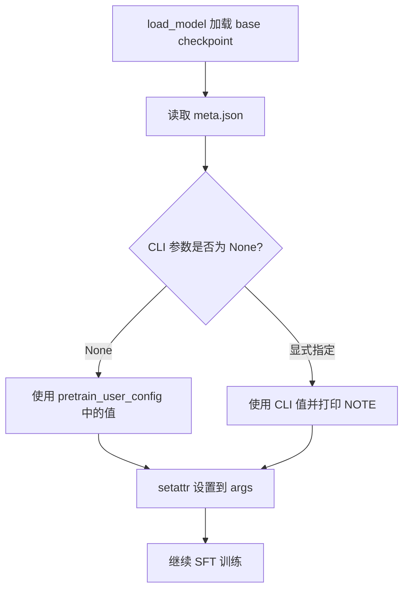
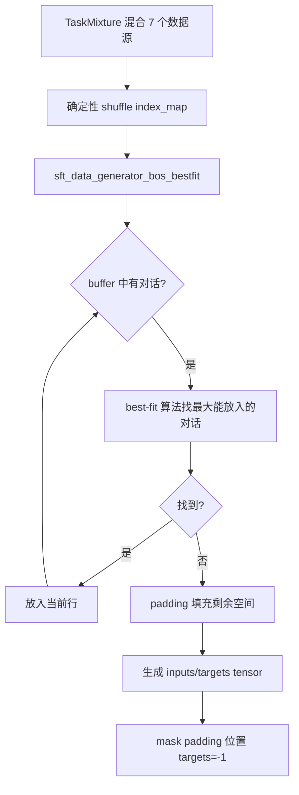
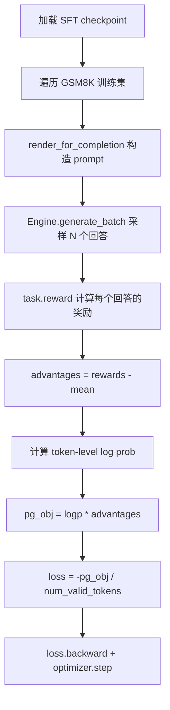

# PD-422.01 nanochat — 全栈 LLM 训练流水线

> 文档编号：PD-422.01
> 来源：nanochat `runs/speedrun.sh`, `scripts/chat_sft.py`, `scripts/chat_rl.py`
> GitHub：https://github.com/karpathy/nanochat.git
> 问题域：PD-422 全栈 LLM 训练流水线 Full-Stack LLM Training Pipeline
> 状态：可复用方案

---

## 第 1 章 问题与动机

### 1.1 核心问题

训练一个可对话的 LLM 涉及多个阶段：tokenizer 训练、预训练、监督微调（SFT）、强化学习（RL）、评估和部署。每个阶段有独立的数据需求、超参数空间和工程挑战。传统做法中这些阶段由不同团队用不同框架完成，导致：

1. **阶段间断裂**：预训练和 SFT 的超参数不连贯，checkpoint 格式不兼容
2. **不可复现**：缺少端到端一键运行的能力，每次训练需要大量手动干预
3. **RL 复杂度过高**：PPO/RLHF 需要 reference model、KL 散度、ratio clipping 等组件，工程负担重
4. **评估碎片化**：不同阶段用不同评估指标，缺少统一的质量度量

### 1.2 nanochat 的解法概述

nanochat 用一个 Git 仓库、一个 `speedrun.sh` 脚本实现从零到可对话模型的完整流水线：

1. **6 阶段线性流水线**：`tok_train → base_train → chat_sft → chat_rl → chat_eval → chat_web`，每阶段一个 Python 脚本，`speedrun.sh` 串联编排（`runs/speedrun.sh:1-98`）
2. **超参数继承机制**：SFT 从预训练 checkpoint 的 `meta.json` 继承 batch size、learning rate 等关键超参数，避免手动调参（`scripts/chat_sft.py:99-118`）
3. **极简 GRPO RL**：删除 trust region、PPO ratio+clip、KL 正则化，退化为 token-level REINFORCE with mean-subtracted advantages（`scripts/chat_rl.py:1-16`）
4. **统一评估框架**：ChatCORE 指标 = 6 个 benchmark 的 centered mean accuracy，从 0（随机基线）到 1（完美），贯穿 SFT 和 RL 阶段（`scripts/chat_eval.py:240-250`）
5. **自动报告生成**：每个阶段向 `Report` 对象写入结构化数据，最终生成包含所有指标的 Markdown 报告（`nanochat/report.py:244-277`）

### 1.3 设计思想

| 设计原则 | 具体实现 | 理由 | 替代方案 |
|----------|----------|------|----------|
| 一键可复现 | `speedrun.sh` 从 venv 创建到报告生成全自动 | 消除人工干预，任何人 clone 后即可复现 | Makefile / Docker Compose |
| 阶段间状态传递 | checkpoint `meta.json` 携带 `user_config` + `model_config` | SFT 可自动继承预训练超参数，无需手动抄写 | 全局配置文件 / Hydra |
| RL 极简化 | 删除 PPO 的 4 个组件，只保留 REINFORCE + mean advantage | 减少 80% RL 代码量，效果相当 | 完整 PPO / DPO |
| 统一评估指标 | ChatCORE = centered mean accuracy across 6 tasks | 单一数字衡量模型质量，便于跨阶段对比 | 每个 task 独立报告 |
| Scaling Laws 驱动 | 自动计算 batch size、LR、weight decay 基于模型深度 | 无需手动调参，模型越大自动适配 | 手动网格搜索 |

---

## 第 2 章 源码实现分析

### 2.1 架构概览

nanochat 的完整训练流水线由 `speedrun.sh` 编排，6 个阶段线性执行：

```
┌──────────────┐    ┌──────────────┐    ┌──────────────┐
│  tok_train   │───→│  base_train  │───→│   chat_sft   │
│ BPE 32K词表  │    │ 预训练 GPT-2 │    │ 监督微调     │
│ ~2B chars    │    │ 8×H100 DDP  │    │ 多任务混合   │
└──────────────┘    └──────────────┘    └──────────────┘
                                              │
┌──────────────┐    ┌──────────────┐          │
│   chat_web   │←───│  chat_eval   │←───┌─────┘
│ FastAPI+SSE  │    │ ChatCORE 6任务│    │
│ 多GPU Worker │    │ 分布式评估   │    ▼
└──────────────┘    └──────────────┘  ┌──────────────┐
                                      │   chat_rl    │
                                      │ GRPO on GSM8K│
                                      │ 简化REINFORCE│
                                      └──────────────┘
```

关键数据流：
- **Tokenizer → 预训练**：tokenizer 保存到 `~/.cache/nanochat/tokenizer/`，预训练通过 `get_tokenizer()` 加载
- **预训练 → SFT**：checkpoint 保存到 `base_checkpoints/d{depth}/`，SFT 通过 `load_model("base", ...)` 加载模型 + meta
- **SFT → RL**：checkpoint 保存到 `chatsft_checkpoints/`，RL 通过 `load_model("sft", ...)` 加载
- **每阶段 → Report**：通过 `get_report().log(section=..., data=[...])` 写入结构化日志

### 2.2 核心实现

#### 2.2.1 超参数继承机制

SFT 阶段从预训练 checkpoint 自动继承超参数，用户可通过 CLI 覆盖：



对应源码 `scripts/chat_sft.py:99-118`：

```python
# Inherit training hyperparameters from pretrained checkpoint (None = inherit, explicit value = override)
pretrain_user_config = meta.get("user_config", {})
for name, fallback, source in [
    ("max_seq_len",       2048,  meta),
    ("device_batch_size", 32,    meta),
    ("total_batch_size",  524288, meta),
    ("embedding_lr",      0.3,   pretrain_user_config),
    ("unembedding_lr",    0.004, pretrain_user_config),
    ("matrix_lr",         0.02,  pretrain_user_config),
]:
    arg_val = getattr(args, name)
    pretrain_val = source.get(name)
    if arg_val is None:
        resolved = pretrain_val if pretrain_val is not None else fallback
        setattr(args, name, resolved)
        print0(f"Inherited {name}={resolved} from pretrained checkpoint")
    elif pretrain_val is not None and arg_val != pretrain_val:
        print0(f"NOTE: --{name.replace('_', '-')}={arg_val} overrides pretrained value of {pretrain_val}")
```

设计要点：
- 三级优先级：CLI 显式值 > checkpoint 保存值 > 硬编码 fallback
- 继承来源区分：`max_seq_len` 等从 `meta` 顶层读取，`embedding_lr` 等从 `meta["user_config"]` 读取
- 透明日志：每个参数都打印来源（inherited / overrides / using），便于调试

#### 2.2.2 SFT 数据混合与 BOS-Bestfit 打包



对应源码 `scripts/chat_sft.py:159-170`（数据混合）：

```python
train_tasks = [
    SmolTalk(split="train"), # 460K rows of general conversations
    CustomJSON(filepath=identity_conversations_filepath), # 1000 rows of synthetic identity conversations
    CustomJSON(filepath=identity_conversations_filepath), # 2 epochs of these
    *[MMLU(subset="auxiliary_train", split="train") for _ in range(args.mmlu_epochs)], # 100K rows per epoch
    *[GSM8K(subset="main", split="train") for _ in range(args.gsm8k_epochs)], # 8K rows per epoch
    SimpleSpelling(size=200000, split="train"), # 200K rows of Simple Spelling
    SpellingBee(size=80000, split="train"), # 80K rows of Spelling Bee
]
train_dataset = TaskMixture(train_tasks)
```

`TaskMixture`（`tasks/common.py:54-86`）通过 `random.Random(42).shuffle(self.index_map)` 确定性打乱所有任务的索引，确保不同任务在训练过程中均匀分布。重复传入同一任务实例即可实现过采样（如 identity_conversations 传入 2 次 = 2 epochs）。

BOS-Bestfit 打包算法（`scripts/chat_sft.py:183-289`）的核心思想：每行以 BOS 开头，用 best-fit 算法将多个对话紧密打包到 `max_seq_len` 长度的行中。当没有对话能放入剩余空间时，用 padding 填充而非截断，确保零 token 浪费。

#### 2.2.3 极简 GRPO 强化学习



对应源码 `scripts/chat_rl.py:90-152`（rollout 生成）和 `scripts/chat_rl.py:252-281`（梯度计算）：

```python
# Calculate the advantages by simply subtracting the mean (instead of z-score (x-mu)/sigma)
mu = rewards.mean()
advantages = rewards - mu

# ... in training loop:
# Calculate log probabilities
with autocast_ctx:
    logp = -model(inputs, targets, loss_reduction='none').view_as(inputs) # (B, T)
# Calculate the PG objective
pg_obj = (logp * advantages.unsqueeze(-1)).sum()
num_valid = (targets >= 0).sum().clamp(min=1)
pg_obj = pg_obj / (num_valid * num_passes * examples_per_rank)
# Note, there is no need to add PPO ratio+clip because we are on policy
loss = -pg_obj
loss.backward()
```

相比标准 GRPO/PPO 的 4 个简化（`scripts/chat_rl.py:1-16`）：
1. 删除 trust region → 无 KL 正则化到 reference model
2. On-policy → 无需 PPO ratio+clip
3. DAPO 风格 token-level 归一化（非 sequence-level）
4. 只用 `(r - mu)` 作为 advantage（非 z-score `(r-mu)/sigma`）

### 2.3 实现细节

#### Scaling Laws 自动调参

预训练阶段（`scripts/base_train.py:256-299`）基于 scaling laws 自动计算训练超参数：

1. **训练 token 数**：`target_tokens = target_param_data_ratio × scaling_params`（默认 ratio=10.5，接近 Chinchilla 的 20 但更激进）
2. **Batch size**：遵循 Power Lines 论文 `B_opt ∝ D^0.383`，自动 clamp 到最近的 2 的幂
3. **Learning rate 缩放**：`η ∝ √(B/B_ref)`，AdamW 标准 sqrt scaling
4. **Weight decay 缩放**：基于 T_epoch 框架 `λ = λ_ref × √(B/B_ref) × (D_ref/D)`

#### Checkpoint 管理的三级目录结构

`nanochat/checkpoint_manager.py:164-172` 定义了统一的 checkpoint 加载接口：

```python
def load_model(source, *args, **kwargs):
    model_dir = {
        "base": "base_checkpoints",
        "sft": "chatsft_checkpoints",
        "rl": "chatrl_checkpoints",
    }[source]
    base_dir = get_base_dir()
    checkpoints_dir = os.path.join(base_dir, model_dir)
    return load_model_from_dir(checkpoints_dir, *args, **kwargs)
```

每个 checkpoint 包含三个文件：`model_{step}.pt`（模型参数）、`optim_{step}_rank{N}.pt`（分片优化器状态）、`meta_{step}.json`（元数据 + user_config）。

#### 推理引擎的 Tool Use 状态机

`nanochat/engine.py:155-275` 实现了带 calculator tool use 的推理引擎。每个生成行维护一个 `RowState`，跟踪 `<|python_start|>` / `<|python_end|>` 特殊 token，在检测到 Python 表达式时自动调用 `use_calculator()` 并将结果作为 forced tokens 注入生成流。KV Cache 采用 FA3 原生 `(B, T, H, D)` 布局，支持 batch=1 prefill + 多 sample 并行解码。

#### Web 服务的 Worker Pool 模式

`scripts/chat_web.py:98-148` 实现了多 GPU 数据并行推理：每个 GPU 加载一份完整模型副本，通过 `asyncio.Queue` 管理 worker 池。请求到达时从池中获取空闲 worker，生成完成后归还。SSE 流式输出处理了 UTF-8 多字节字符的边界问题（`scripts/chat_web.py:277-309`）。


---

## 第 3 章 迁移指南

### 3.1 迁移清单

#### 阶段 1：基础设施（必须）

- [ ] 建立统一的 checkpoint 目录结构：`{base_dir}/{phase}_checkpoints/{model_tag}/`
- [ ] 实现 `save_checkpoint(dir, step, model_data, optim_data, meta_data)` 和 `load_checkpoint()` 对称接口
- [ ] 在 `meta_data` 中保存 `user_config`（CLI 参数）和 `model_config`（模型架构参数）
- [ ] 实现 `load_model(source)` 统一入口，source 映射到不同 checkpoint 目录

#### 阶段 2：超参数继承（推荐）

- [ ] SFT 脚本中实现 "None = inherit from pretrain" 模式
- [ ] 为每个可继承参数定义 fallback 默认值
- [ ] 打印每个参数的来源（inherited / overrides / using）

#### 阶段 3：评估框架（推荐）

- [ ] 定义 `Task` 基类：`__getitem__` 返回 conversation dict，`evaluate()` 返回 0/1
- [ ] 实现 `TaskMixture` 用于 SFT 数据混合
- [ ] 实现统一的 ChatCORE 指标：`centered_mean = Σ (acc - baseline) / (1 - baseline) / N`

#### 阶段 4：RL 训练（可选）

- [ ] 实现简化 GRPO：on-policy REINFORCE + mean-subtracted advantages
- [ ] 复用 Task 的 `reward()` 方法作为 RL 奖励信号
- [ ] 实现 pass@k 评估用于 RL 过程监控

### 3.2 适配代码模板

#### 超参数继承模板

```python
"""
通用的超参数继承机制。
从上一阶段的 checkpoint meta 中继承参数，CLI 显式指定则覆盖。
"""
import argparse
import json

def inherit_hyperparams(args, meta: dict, inherit_specs: list):
    """
    从 checkpoint meta 继承超参数。
    
    Args:
        args: argparse.Namespace，当前阶段的 CLI 参数
        meta: dict，上一阶段 checkpoint 的 meta.json 内容
        inherit_specs: list of (param_name, fallback_value, meta_key_path)
            - param_name: args 中的属性名
            - fallback_value: meta 中也没有时的默认值
            - meta_key_path: meta dict 中的 key 路径，支持 "." 分隔的嵌套路径
    
    Returns:
        dict: 记录每个参数的来源 {"param_name": "inherited" | "overridden" | "default"}
    """
    sources = {}
    for param_name, fallback, meta_key_path in inherit_specs:
        # 从 meta 中按路径取值
        meta_val = meta
        for key in meta_key_path.split("."):
            meta_val = meta_val.get(key, {}) if isinstance(meta_val, dict) else None
            if meta_val is None:
                break
        
        cli_val = getattr(args, param_name)
        if cli_val is None:
            # CLI 未指定 → 继承
            resolved = meta_val if meta_val is not None else fallback
            setattr(args, param_name, resolved)
            sources[param_name] = "inherited"
            print(f"Inherited {param_name}={resolved} from checkpoint")
        elif meta_val is not None and cli_val != meta_val:
            # CLI 显式覆盖
            sources[param_name] = "overridden"
            print(f"NOTE: {param_name}={cli_val} overrides checkpoint value {meta_val}")
        else:
            sources[param_name] = "default"
    return sources


# 使用示例
if __name__ == "__main__":
    parser = argparse.ArgumentParser()
    parser.add_argument("--lr", type=float, default=None)
    parser.add_argument("--batch-size", type=int, default=None)
    args = parser.parse_args()
    
    # 加载上一阶段的 meta
    with open("checkpoints/meta_000100.json") as f:
        meta = json.load(f)
    
    inherit_hyperparams(args, meta, [
        ("lr",         0.001, "user_config.lr"),
        ("batch_size", 32,    "batch_size"),
    ])
```

#### 简化 GRPO 模板

```python
"""
简化 GRPO：on-policy REINFORCE with mean-subtracted advantages。
删除 PPO 的 trust region、ratio clipping、KL 正则化。
"""
import torch

def grpo_step(model, optimizer, rollout_batch, autocast_ctx):
    """
    执行一步简化 GRPO 更新。
    
    Args:
        model: 语言模型，forward(inputs, targets, loss_reduction='none') 返回 NLL
        optimizer: 优化器
        rollout_batch: dict with keys:
            - inputs: (B, T) token ids
            - targets: (B, T) target ids, -1 for ignore
            - rewards: (B,) per-sequence rewards
    """
    inputs = rollout_batch["inputs"]
    targets = rollout_batch["targets"]
    rewards = rollout_batch["rewards"]
    
    # 简化 advantage：只减均值，不除标准差
    advantages = rewards - rewards.mean()
    
    # 计算 token-level log probabilities
    with autocast_ctx:
        nll = model(inputs, targets, loss_reduction='none')  # (B, T)
        logp = -nll  # log prob
    
    # Policy gradient objective
    pg_obj = (logp * advantages.unsqueeze(-1)).sum()
    num_valid = (targets >= 0).sum().clamp(min=1)
    pg_obj = pg_obj / num_valid
    
    # Minimize negative objective
    loss = -pg_obj
    loss.backward()
    optimizer.step()
    model.zero_grad(set_to_none=True)
    
    return {
        "loss": loss.item(),
        "mean_reward": rewards.mean().item(),
        "advantage_std": advantages.std().item(),
    }
```

### 3.3 适用场景

| 场景 | 适用度 | 说明 |
|------|--------|------|
| 从零训练小型 LLM（≤1B） | ⭐⭐⭐ | nanochat 的核心场景，speedrun.sh 直接可用 |
| 已有预训练模型做 SFT | ⭐⭐⭐ | 超参数继承机制和 TaskMixture 可直接复用 |
| 简化 RL 微调 | ⭐⭐⭐ | GRPO 简化方案适合 reward 明确的任务（如数学） |
| 大规模分布式训练（>8 GPU） | ⭐⭐ | 当前仅支持单节点 DDP，需扩展 FSDP/DeepSpeed |
| 多轮对话 RL | ⭐ | 当前 RL 仅针对 GSM8K 单轮，需扩展 reward 设计 |

---

## 第 4 章 测试用例

```python
"""
基于 nanochat 真实接口的测试用例。
测试超参数继承、TaskMixture、GRPO advantage 计算等核心机制。
"""
import pytest
import torch
import random
from unittest.mock import MagicMock
from types import SimpleNamespace


class TestHyperparamInheritance:
    """测试 SFT 从预训练 checkpoint 继承超参数的机制。"""

    def _make_args(self, **kwargs):
        defaults = {
            "max_seq_len": None,
            "device_batch_size": None,
            "total_batch_size": None,
            "embedding_lr": None,
            "unembedding_lr": None,
            "matrix_lr": None,
        }
        defaults.update(kwargs)
        return SimpleNamespace(**defaults)

    def _make_meta(self, **kwargs):
        return {
            "max_seq_len": 2048,
            "device_batch_size": 32,
            "total_batch_size": 524288,
            "user_config": {
                "embedding_lr": 0.3,
                "unembedding_lr": 0.004,
                "matrix_lr": 0.02,
            },
            **kwargs,
        }

    def test_inherit_all_from_checkpoint(self):
        """CLI 全部为 None 时，应从 checkpoint 继承。"""
        args = self._make_args()
        meta = self._make_meta()
        pretrain_user_config = meta.get("user_config", {})

        for name, fallback, source in [
            ("max_seq_len", 2048, meta),
            ("device_batch_size", 32, meta),
            ("embedding_lr", 0.3, pretrain_user_config),
        ]:
            arg_val = getattr(args, name)
            pretrain_val = source.get(name)
            if arg_val is None:
                resolved = pretrain_val if pretrain_val is not None else fallback
                setattr(args, name, resolved)

        assert args.max_seq_len == 2048
        assert args.device_batch_size == 32
        assert args.embedding_lr == 0.3

    def test_cli_override(self):
        """CLI 显式指定时，应覆盖 checkpoint 值。"""
        args = self._make_args(max_seq_len=4096, embedding_lr=0.1)
        meta = self._make_meta()

        # max_seq_len 已显式指定，不应被覆盖
        assert args.max_seq_len == 4096
        assert args.embedding_lr == 0.1

    def test_fallback_when_meta_missing(self):
        """checkpoint meta 中缺少某参数时，应使用 fallback。"""
        args = self._make_args()
        meta = {}  # 空 meta
        pretrain_user_config = meta.get("user_config", {})

        for name, fallback, source in [
            ("max_seq_len", 2048, meta),
            ("embedding_lr", 0.3, pretrain_user_config),
        ]:
            arg_val = getattr(args, name)
            pretrain_val = source.get(name) if isinstance(source, dict) else None
            if arg_val is None:
                resolved = pretrain_val if pretrain_val is not None else fallback
                setattr(args, name, resolved)

        assert args.max_seq_len == 2048
        assert args.embedding_lr == 0.3


class TestTaskMixture:
    """测试 SFT 数据混合机制。"""

    def _make_mock_task(self, size, prefix="task"):
        task = MagicMock()
        task.__len__ = MagicMock(return_value=size)
        task.__getitem__ = MagicMock(side_effect=lambda i: f"{prefix}_{i}")
        return task

    def test_mixture_length(self):
        """混合后总长度应等于各任务长度之和。"""
        t1 = self._make_mock_task(100, "a")
        t2 = self._make_mock_task(200, "b")
        # 模拟 TaskMixture 的 index_map 构建
        index_map = []
        for task_idx, task in enumerate([t1, t2]):
            for local_idx in range(len(task)):
                index_map.append((task_idx, local_idx))
        assert len(index_map) == 300

    def test_deterministic_shuffle(self):
        """相同 seed 应产生相同的 shuffle 顺序。"""
        index_map = list(range(100))
        rng1 = random.Random(42)
        rng1.shuffle(index_map)
        order1 = index_map.copy()

        index_map = list(range(100))
        rng2 = random.Random(42)
        rng2.shuffle(index_map)
        order2 = index_map.copy()

        assert order1 == order2

    def test_oversampling_via_duplication(self):
        """重复传入同一任务应实现过采样。"""
        t1 = self._make_mock_task(10, "identity")
        tasks = [t1, t1]  # 2 epochs
        total = sum(len(t) for t in tasks)
        assert total == 20


class TestGRPOAdvantage:
    """测试简化 GRPO 的 advantage 计算。"""

    def test_mean_subtracted_advantage(self):
        """advantage 应为 rewards - mean(rewards)。"""
        rewards = torch.tensor([1.0, 0.0, 1.0, 0.0])
        mu = rewards.mean()
        advantages = rewards - mu
        assert torch.allclose(advantages, torch.tensor([0.5, -0.5, 0.5, -0.5]))
        assert torch.allclose(advantages.mean(), torch.tensor(0.0), atol=1e-6)

    def test_all_same_reward_zero_advantage(self):
        """所有 reward 相同时，advantage 应全为 0。"""
        rewards = torch.tensor([0.5, 0.5, 0.5, 0.5])
        advantages = rewards - rewards.mean()
        assert torch.allclose(advantages, torch.zeros(4))

    def test_token_level_pg_objective(self):
        """PG objective 应为 logp * advantage 在 valid token 上的均值。"""
        logp = torch.tensor([[0.1, 0.2, 0.3], [0.4, 0.5, 0.6]])  # (2, 3)
        targets = torch.tensor([[1, 2, -1], [3, 4, 5]])  # -1 = ignore
        advantages = torch.tensor([1.0, -1.0])  # (2,)

        pg_obj = (logp * advantages.unsqueeze(-1)).sum()
        num_valid = (targets >= 0).sum().clamp(min=1)
        pg_obj_normalized = pg_obj / num_valid

        # 手动计算
        # row0: 0.1*1 + 0.2*1 + 0.3*1 = 0.6 (但 target[0,2]=-1，logp 仍参与因为 mask 在 targets 上)
        # 实际上 nanochat 中 targets=-1 使得 model 输出 loss=0，所以 logp 在这些位置也是 0
        assert pg_obj_normalized.item() != 0  # 非零验证


class TestCheckpointManager:
    """测试 checkpoint 目录结构和加载逻辑。"""

    def test_source_to_dir_mapping(self):
        """load_model source 参数应正确映射到目录。"""
        model_dir_map = {
            "base": "base_checkpoints",
            "sft": "chatsft_checkpoints",
            "rl": "chatrl_checkpoints",
        }
        for source, expected_dir in model_dir_map.items():
            assert model_dir_map[source] == expected_dir

    def test_find_largest_model_by_depth(self):
        """应选择深度最大的模型 tag。"""
        model_tags = ["d12", "d20", "d26", "d4"]
        import re
        candidates = []
        for tag in model_tags:
            match = re.match(r"d(\d+)", tag)
            if match:
                candidates.append((int(match.group(1)), tag))
        candidates.sort(key=lambda x: x[0], reverse=True)
        assert candidates[0][1] == "d26"
```


---

## 第 5 章 跨域关联

| 关联域 | 关系类型 | 说明 |
|--------|----------|------|
| PD-415 分布式训练 | 依赖 | nanochat 的 `base_train` 和 `chat_sft` 均使用 `torchrun` DDP 多 GPU 训练，`compute_init()` 封装了 DDP 初始化 |
| PD-416 混合精度训练 | 依赖 | 全流程使用 BF16 autocast，预训练支持 FP8（H100+），`disable_fp8()` 上下文管理器在评估时切回 BF16 |
| PD-417 Scaling Laws 自动化 | 协同 | `base_train.py` 基于 Power Lines 论文自动计算 batch size、LR、weight decay，是 scaling laws 的工程实现 |
| PD-418 KV Cache 推理 | 协同 | `Engine` 的 `KVCache` 类实现 FA3 原生布局的 KV 缓存，支持 batch=1 prefill + 多 sample 并行解码 |
| PD-419 BPE Tokenizer | 依赖 | `tok_train.py` 训练 32K 词表的 BPE tokenizer，是流水线的第一阶段 |
| PD-420 高效数据加载 | 协同 | SFT 的 BOS-Bestfit 打包算法实现零 token 浪费的数据加载 |
| PD-421 高级优化器 | 依赖 | 全流程使用 MuonAdamW 混合优化器：Muon 用于矩阵参数，AdamW 用于 embedding |
| PD-11 可观测性 | 协同 | `Report` 系统收集每阶段的结构化指标，`wandb` 集成提供实时训练监控 |

---

## 第 6 章 来源文件索引

| 文件 | 行范围 | 关键实现 |
|------|--------|----------|
| `runs/speedrun.sh` | L1-L98 | 全流程编排脚本：venv → tokenizer → pretrain → SFT → eval → report |
| `scripts/base_train.py` | L125-L139 | 模型构建：基于 depth × aspect_ratio 自动计算模型维度 |
| `scripts/base_train.py` | L256-L299 | Scaling laws 自动调参：batch size、LR、weight decay |
| `scripts/base_train.py` | L399-L564 | 预训练循环：gradient accumulation + eval + checkpoint |
| `scripts/chat_sft.py` | L99-L118 | 超参数继承机制：从预训练 checkpoint 继承 6 个关键参数 |
| `scripts/chat_sft.py` | L159-L170 | SFT 数据混合：7 个数据源 + TaskMixture 确定性 shuffle |
| `scripts/chat_sft.py` | L183-L289 | BOS-Bestfit 打包算法：零 token 浪费的序列打包 |
| `scripts/chat_sft.py` | L350-L382 | ChatCORE 评估：6 任务 centered mean accuracy |
| `scripts/chat_rl.py` | L1-L16 | GRPO 简化说明：删除 trust region、PPO clip、KL、z-score |
| `scripts/chat_rl.py` | L90-L152 | RL rollout 生成：采样 + reward 计算 + advantage |
| `scripts/chat_rl.py` | L252-L281 | RL 梯度计算：token-level REINFORCE |
| `scripts/chat_eval.py` | L31-L83 | 生成式评估循环：分布式 pass@k |
| `scripts/chat_eval.py` | L90-L155 | 分类式评估循环：batch logits 聚焦到答案 letter |
| `scripts/chat_eval.py` | L240-L250 | ChatCORE 指标计算 |
| `scripts/tok_train.py` | L1-L107 | BPE tokenizer 训练：2B chars → 32K vocab |
| `scripts/chat_web.py` | L98-L148 | WorkerPool 多 GPU 推理：asyncio.Queue 管理 |
| `scripts/chat_web.py` | L262-L311 | SSE 流式生成：UTF-8 多字节字符处理 |
| `nanochat/engine.py` | L83-L133 | KVCache：FA3 原生 (B,T,H,D) 布局 + prefill 复制 |
| `nanochat/engine.py` | L164-L275 | Engine.generate：tool use 状态机 + forced token 注入 |
| `nanochat/checkpoint_manager.py` | L42-L74 | save/load checkpoint：model + optim shard + meta json |
| `nanochat/checkpoint_manager.py` | L164-L172 | load_model 统一入口：source → checkpoint 目录映射 |
| `nanochat/report.py` | L244-L277 | Report.log：结构化日志写入 |
| `nanochat/report.py` | L279-L369 | Report.generate：汇总所有阶段生成最终报告 |
| `tasks/common.py` | L10-L48 | Task 基类：conversation dict + evaluate() 接口 |
| `tasks/common.py` | L54-L86 | TaskMixture：确定性 shuffle 混合多任务 |
| `tasks/gsm8k.py` | L37-L117 | GSM8K 任务：tool call 解析 + reward 函数 |
| `nanochat/gpt.py` | L1-L119 | GPT 模型：RoPE + QK norm + GQA + FA3 + Value Embedding |

---

## 第 7 章 横向对比维度

```json comparison_data
{
  "project": "nanochat",
  "dimensions": {
    "流水线阶段数": "6 阶段线性：tok→pretrain→SFT→RL→eval→web",
    "编排方式": "单 Bash 脚本 speedrun.sh 串行编排全流程",
    "超参数传递": "checkpoint meta.json 携带 user_config，SFT 自动继承",
    "RL 方法": "极简 GRPO：删除 trust region/PPO clip/KL，退化为 REINFORCE",
    "评估框架": "ChatCORE：6 任务 centered mean accuracy，0-1 统一度量",
    "数据打包": "BOS-Bestfit：best-fit 算法打包对话，padding 不截断",
    "模型服务": "FastAPI + SSE + WorkerPool 多 GPU 数据并行推理",
    "报告系统": "Report 类收集每阶段结构化数据，生成 Markdown 报告卡"
  }
}
```

### 域元数据补充

```json domain_metadata
{
  "solution_summary": "nanochat 用 speedrun.sh 编排 6 阶段线性流水线（tok→pretrain→SFT→RL→eval→web），通过 checkpoint meta.json 实现超参数自动继承，GRPO 简化为 token-level REINFORCE",
  "description": "端到端训练流水线的阶段编排、状态传递与质量度量统一",
  "sub_problems": [
    "Scaling Laws 驱动的自动超参数计算",
    "BOS-Bestfit 零浪费序列打包",
    "统一评估指标 ChatCORE 的设计",
    "训练报告自动生成与成本估算"
  ],
  "best_practices": [
    "checkpoint meta.json 携带 user_config 实现跨阶段超参数继承",
    "TaskMixture 确定性 shuffle + 重复传入实现过采样",
    "删除 PPO 四大组件简化 RL 为 REINFORCE + mean advantage",
    "GC 手动管理避免训练中 500ms 暂停"
  ]
}
```

